Counterpoint Global Insights

# Opportunities and Expectations The Present Value of Growth Opportunities in Valuation

CONSILIENT OBSERVER | June 18, 2026

## Introduction

The goal of fundamental investing is to pay a price for a stake in a company that is less than its value in anticipation that price and value will converge. An investor will earn an excess return if the gap between price and value narrows.

Price is the transparent part of this calculation because it is quoted continually when the stock market is open. Value is the opaque part because it is based on the present value of future cash flows, and no one knows what the future holds.

You can think about the value of prospective cash flows in two parts.1 The first is the continuation of what a company is doing today. For instance, you might assume that a company earning \$2 per share annually can sustain that level on a steady-state basis.

The second part is the option to make investments in the future that create value. This part is called the “present value of growth opportunities” (PVGO), a term coined by Stewart Myers, a financial economist.2 “Growth” here refers to value creation, the ability to earn a return on investment higher than the opportunity cost of capital. “Opportunities” captures the idea that these investments are options, which confer the right but not the obligation to act.

For the stocks of most companies, and for the market overall, some of the price is attributable to PVGO. The contributions of steady state and PVGO to total price are proxies for expectations.

When the steady state is most of the stock price, expectations about future value creation are low (presuming the business is not cyclical or in secular decline). When the PVGO is a large percentage of the price, expectations about value creation are high.

This report examines PVGO in the context of the overall market as well as individual companies. It also considers how the PVGO percentage performs relative to the traditional value factor, price to book value. We find that the PVGO percentage can be a useful complement to other valuation approaches.

## AUTHORS

Michael J. Mauboussin michael.mauboussin@morganstanley.com

Dan Callahan, CFA dan.callahan1@morganstanley.com

For instance, here is a simple and useful heuristic for disaggregating a price-earnings (P/E) multiple. The steadystate assumes that the current level of earnings persists. As a result, we can value that part as a perpetuity, which capitalizes the earnings. Specifically, the P/E multiple should equal 1 ÷ the cost of equity capital. Assuming a cost of equity of 8.75 percent, the P/E multiple attributable to the steady-state value is 11.4 (11.4 = 1 ÷ 0.0875).3

A premium to the steady-state multiple implies that the market is attributing value to PVGO, current earnings are unsustainable, or a combination of the two.4 The P/E multiple for the S&P 500, an index of approximately 500 U.S. stocks with the largest market capitalizations, was 21.9 based on consensus estimates for 2026 earnings at the time of our analysis (June 12, 2026).

We now examine the history of the PVGO percentage for the S&P 500, whose constituents represent about 80 percent of U.S. equity market capitalization.

PVGO of Stock Market. Exhibit 1 shows the annual PVGO percentage for the S&P 500 from 1961 to 2025.5 We estimate the steady-state value by taking the operating earnings of the S&P 500 for the trailing four quarters and dividing them by an estimate of the cost of equity capital at year-end. The estimate for the equity risk premium comes from Aswath Damodaran, a professor of finance at the Stern School at New York University. We then subtract the steady-state price from the index price to assess the amount attributable to value creation.

On average, the PVGO has been 35 percent of the price, and the steady-state value has been 65 percent. There have been periods when the price incorporated little or no future value creation (1974 and 2011) and other times when it reflected substantial future value creation (1999 and 2001). At the end of 2025, this measure was well above the average.

Exhibit 1: PVGO Percentage for the S&P 500, 1961-2025  
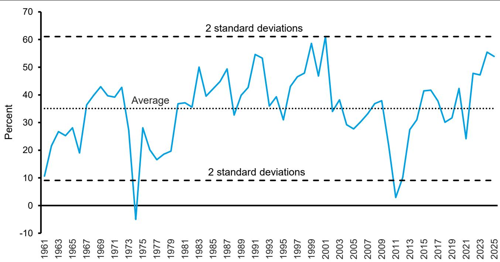  
Source: Counterpoint Global, S&P Dow Jones Indices, Aswath Damodaran, FRED at the Federal Reserve Bank of St. Louis.

Analysis of the PVGO percentage prompts the obvious question of how the market performs following high or low levels. Exhibit 2 compares the PVGO percentage to the compound annual growth rate (CAGR) in total shareholder returns (TSRs) in the subsequent 10-years for the S&P 500 from the end of 1961 to 2015.

Lower PVGO percentages are associated with higher subsequent TSRs, and higher percentages are followed by lower TSRs.6 But the correlation is only moderate. The relationship is the same, but the correlations are weaker, for 1- and 5-year TSRs.

Exhibit 2: PVGO Percentage and Future 10-Year TSRs for the S&P 500, 1961-2025  
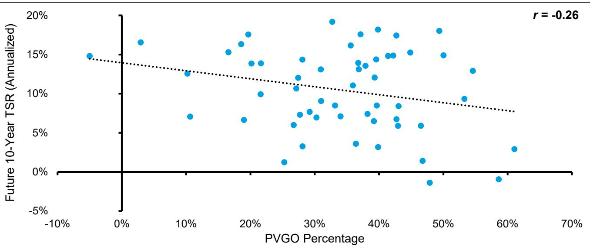  
Source: Counterpoint Global, S&P Dow Jones Indices, Aswath Damodaran, FRED at the Federal Reserve Bank of St. Louis. Past performance is no guarantee of future results.

Exhibit 3 shows the PVGO percentage ranked by quartiles (1 is the lowest and 4 is the highest) and the 10-year TSRs that follow. The CAGR in TSR is 11.6 percent for the lowest quartile and 7.6 percent for the highest quartile. The average CAGR in TSR for the middle quartiles is 11.2 percent. PVGO percentage provides a decent signal when it reaches extreme levels but is a poor tool for timing in general.

Exhibit 3: PVGO Percentage by Quartile and Future 10-Year TSRs for the S&P 500, 1961-2025  
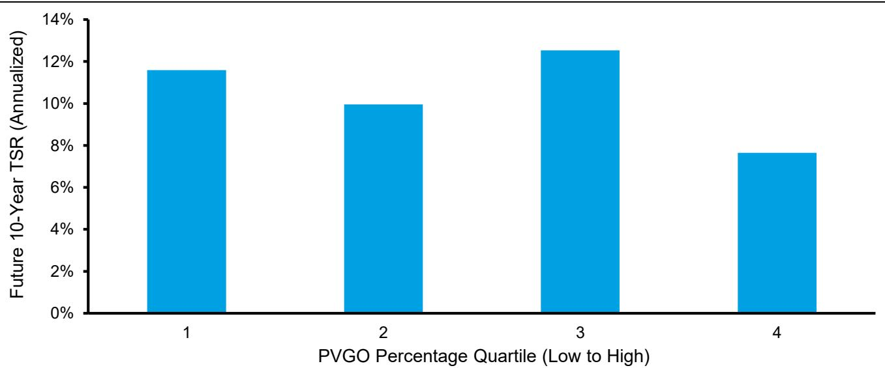  
Source: Counterpoint Global, S&P Dow Jones Indices, Aswath Damodaran, FRED at the Federal Reserve Bank of St. Louis. Past performance is no guarantee of future results.

PVGO of Companies. We now turn to the analysis of the stocks of companies.7 We use a different and more sophisticated method for this work. To estimate steady-state value for each company, we start with trailing 12- month net operating profit after taxes (NOPAT) and capitalize it by the weighted average cost of capital.8 We then subtract net debt, leaving us with a steady-state value for the equity. That allows us to estimate PVGO.

For example, assume NOPAT is \$100, the cost of capital is 8 percent, net debt is \$250, and the market value of equity is \$1,500. In this simple example, the steady-state equity value is \$1,000 (\$100 ÷ 0.08 = \$1,250 − \$250 = \$1,000).

Because total equity value equals steady-state value plus PVGO, we can solve for a PVGO percentage of 33 percent (PVGO = \$1,500 – \$1,000 = \$500, and PVGO percentage = \$500 ÷ \$1,500 = 0.33).

Exhibit 4 shows the five-year annualized TSRs, by quintile of PVGO percentage, for the stocks of U.S. public companies with market capitalizations of \$1 billion or more in 2024 USD from 1990 to 2024. The five-year median TSR was 8.7 percent for the quintile with the lowest PVGO percentage and 5.0 percent for the quintile with the highest PVGO percentage. But the fact that the second quintile had the highest median TSR underscores that this measure is more useful at the extremes than it is between them.

Exhibit 4: PVGO Percentage by Quintile and 5-Year TSRs for U.S. Companies, 1990-2024  
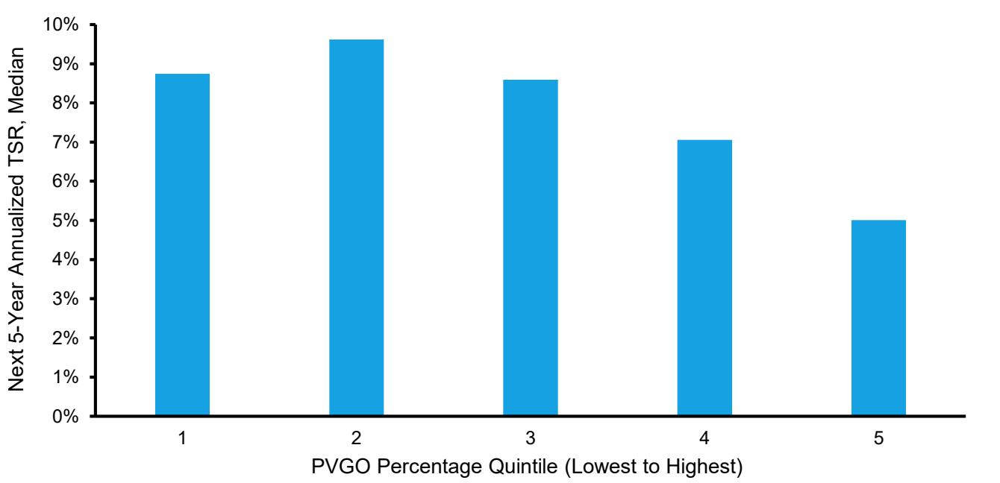  
Source: Counterpoint Global, Compustat, and FactSet.  
Note: Companies with market capitalizations of at least \$1 billion in 2024 USD.  
Past performance is no guarantee of future results.

Building on this point, we split stocks into two parts. We then calculated the annualized TSRs over the next fiveyears, on a rolling basis, for each group. Exhibit 5 shows the difference in future returns between the low and high groups for each year from 1990 to 2019. The return spread is positive in about 90 percent of the years and averages 2.6 percentage points over the full span.

Exhibit 5: Relative TSR of Bottom Versus Top Half of PVGO Percentage, 1990-2024  
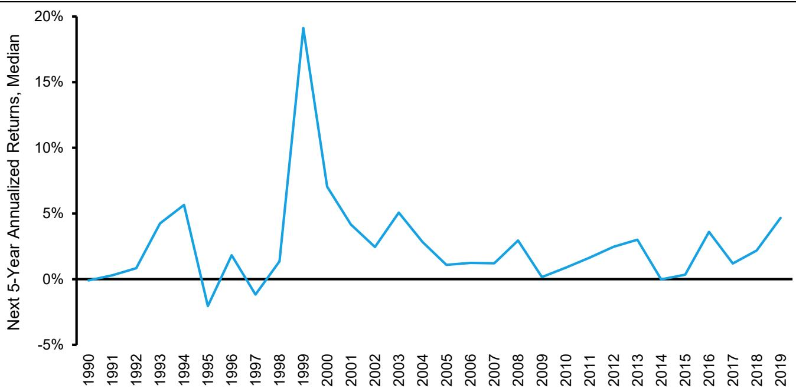  
Source: Counterpoint Global, Compustat, FactSet, and Kenneth R. French. Note: Companies with market capitalizations of at least \$1 billion in 2024 USD. Past performance is no guarantee of future results.

We next examine the PVGOs for individual companies over time. This calculation estimates steady-state value by capitalizing the consensus estimate for earnings over the next four quarters using the cost of equity. We can attribute the difference between the stock price and the steady-state value to the PVGO.

We picked a handful of companies we found to be interesting examples and measured PVGO percentages from the mid- to late-1990s to 2025 (see exhibit 6). A fuller group of leading companies in each sector appears in the appendix. Here are some observations, none of which should be construed as investment advice:

NVIDIA. Despite now being the largest company in the world as measured by market capitalization, Nvidia’s PVGO percentage is lower than it was, on average, in the early 2000s. The stock has performed extremely well in recent years, in large part mirroring rapid growth in earnings and cash flow. As a result, the PVGO percentage is today similar to what it was at the end of 2016.

Microsoft. Following the dot-com bust, Microsoft’s stock was roughly flat for a decade, even though the company continued to grow sales and profits. As a result, its PVGO percentage went from 85 percent in 1999 to negative 53 percent in 2012. From there, the stock and PVGO percentage rebounded strongly. Still, the PVGO percentage remains well below the peak.

Amazon. Amazon’s PVGO percentage was in excess of 100 percent in the late 1990s (through 2001), reflecting the fact that the company was losing money. But over time, the PVGO percentage has drifted lower even as the company’s sales, profits, and stock price grew at a rapid rate. The PVGO percentage at year-end 2025 was the lowest year-end reading since the company went public in 1997.

JPMorgan Chase. This company followed the same pattern as some of the technology giants, including Nvidia and Microsoft, but the absolute levels of its PVGO percentages were substantially lower. Similar to other financial companies, JPMorgan’s PVGO percentage peaked at around 40 percent and was substantially negative following the global financial crisis of 2008-2009.

Exhibit 6: PVGO Percentages for the Stocks of Selected Companies  
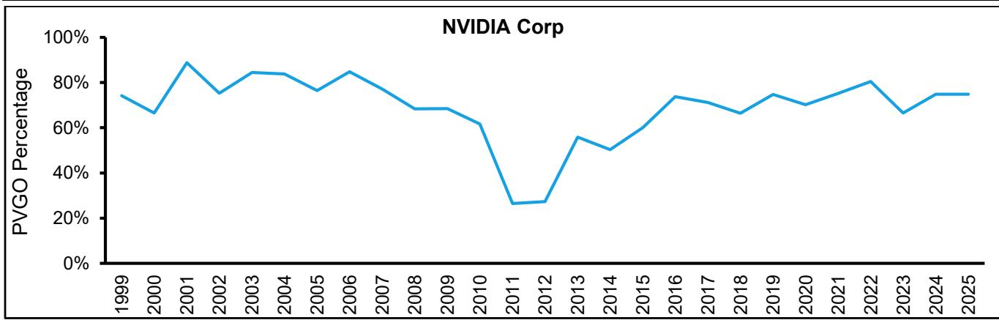

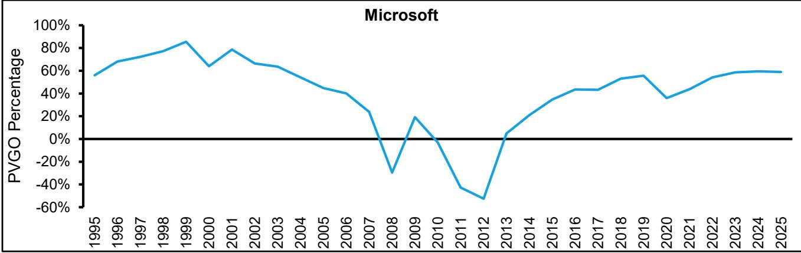

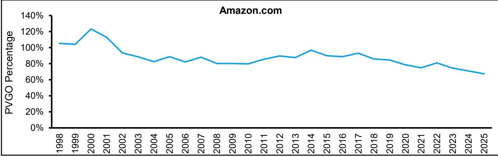

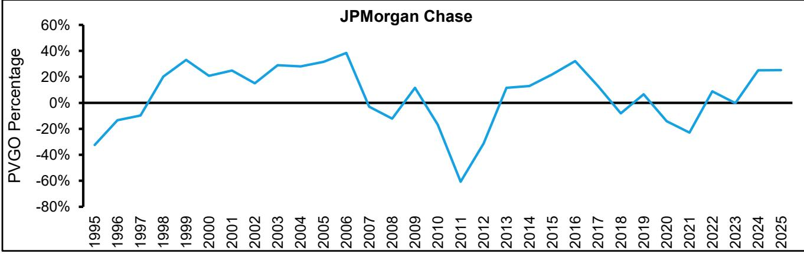  
Source: Counterpoint Global, Compustat, and FactSet.

PVGO and the Value Factor. PVGO is a measure of expectations. So is the “value factor,” which was popularized by Eugene Fama and Kenneth French, professors of finance.9 The value factor is calculated by sorting stocks based on book-to-price multiples, controlling for the size of the market capitalization. The factor is the average returns of the stocks with high book-to-price minus the average returns of those with low bookto-price.

The multiple of book-to-price is the inverse of the more conventional price-to-book. So, a high book-to-price multiple often implies modest expectations and low book-to-price reflects high expectations. This factor is called “high-minus-low” (HML), or “value,” in the finance literature. Fama and French show that the value factor helps explain stock returns beyond the predictions of the capital asset pricing model (CAPM) from 1927 to 2025.

The value factor has been less effective since the early 2000s. One potential explanation has been the shift from tangible to intangible investment, which has made book value a less relevant financial measure.10 Here we explore whether PVGO can add any insight.

Exhibit 7 compares the results of the sort based on low and high PVGO percentages (exhibit 5) to the value factor. The exhibit measures five-year annualized returns from 1990 through 2024. The PVGO percentage seems to provide higher, and more consistent, returns. The average five-year return is 230 basis points above those of the value factor.

Exhibit 7: TSR of Bottom Minus Top Half of PVGO Percentage and the Value Factor, 1990-2024  
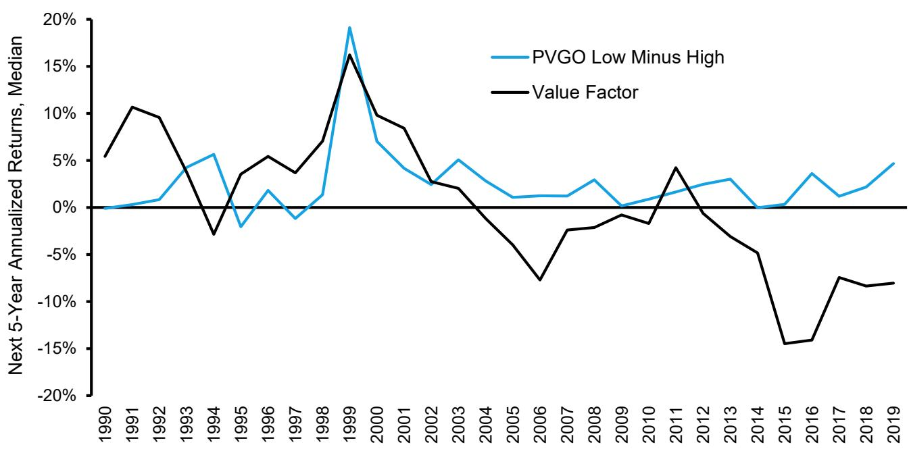  
Source: Counterpoint Global, Compustat, FactSet, and Kenneth R. French. Note: Companies with market capitalizations of at least \$1 billion in 2024 USD. Past performance is no guarantee of future results.

## Summary

The goal of fundamental investing is to buy an asset at a price that is lower than a reasonable estimate of value. Stock prices commonly reflect the value of current earnings and the option to make future investments that create value. This allows us to separate price into a steady-state value, which assumes current earnings persist, and the present value of growth opportunities (PVGO). It is a “bird in the hand” and “two in the bush.”11

We looked at how PVGO as a percentage of price, a proxy for investor expectations, served as a measure of market timing. Specifically, we compared the level of PVGO percentage to subsequent 10-year total shareholder returns (TSRs) for the S&P 500. The results show some modest usefulness in timing, but mostly when the PVGO percentage reaches extreme levels.

We then considered the PVGO percentage for individual companies. Our analysis looked at PVGO percentage levels and five-year TSRs. The measure shows a meaningful TSR spread, with the stocks with low PVGO expectations outperforming those with high PVGO expectations by 260 basis points per year.

Next we examined the PVGO percentages over time for a handful of companies (the appendix includes a sample of the largest companies, by market capitalization, for each sector). Each case provides the basis for a narrative about past results and future prospects.

The PVGO percentage is a complement to traditional valuation approaches. We also wanted to see whether it added any insight relative to another measure of expectations, the value factor. Our simple analysis suggests that the PVGO percentage may have provided a higher, and more consistent, return than the value factor over the past 25 years.

Appendix: PVGO Percentages for the Top U.S. Companies in Each Sector  
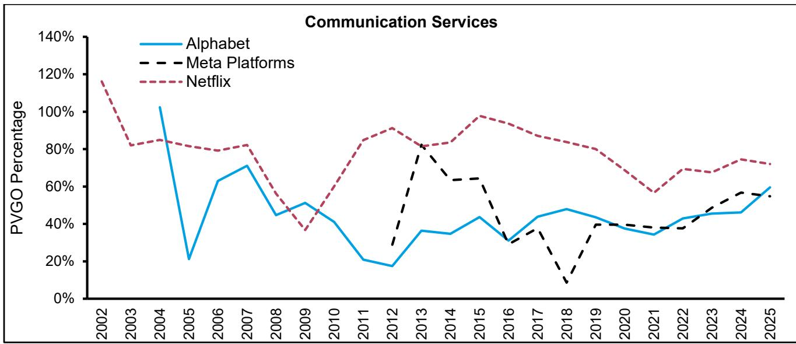

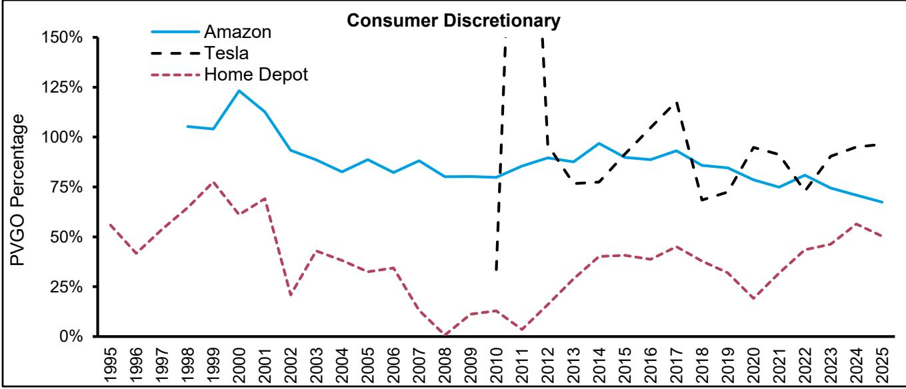

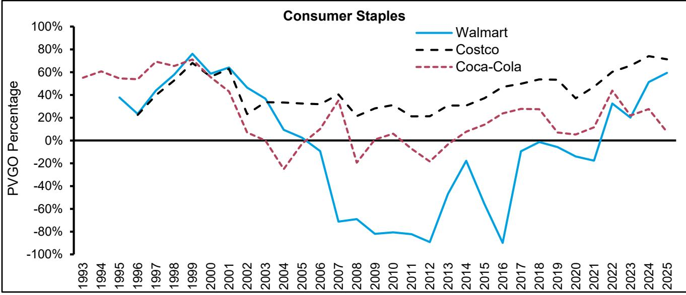

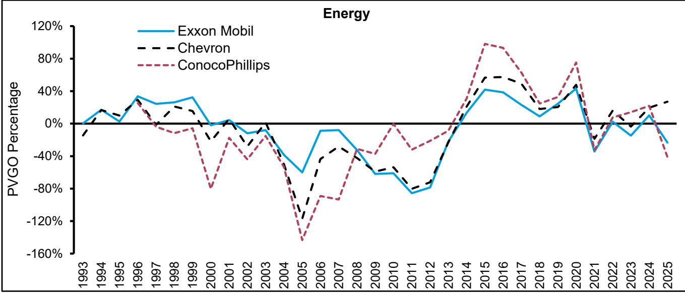

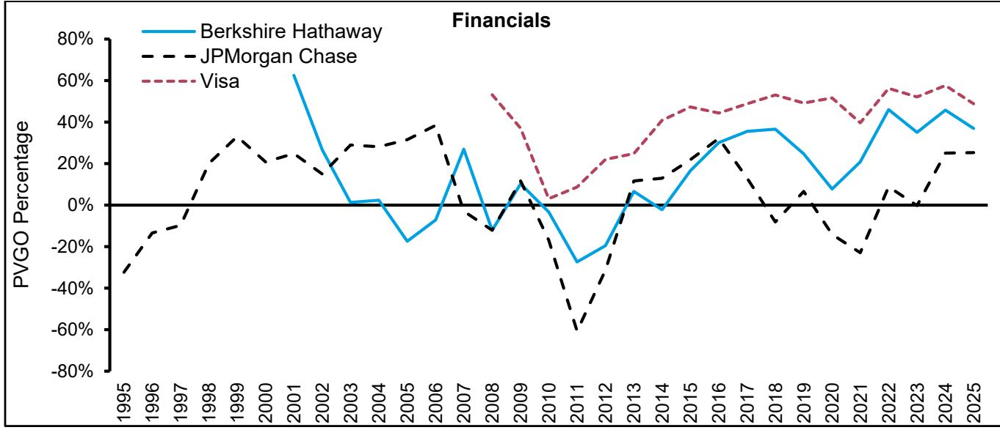

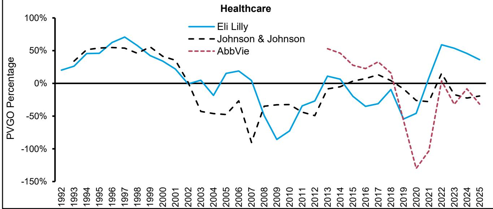

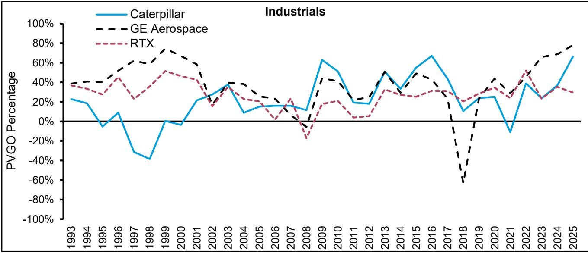

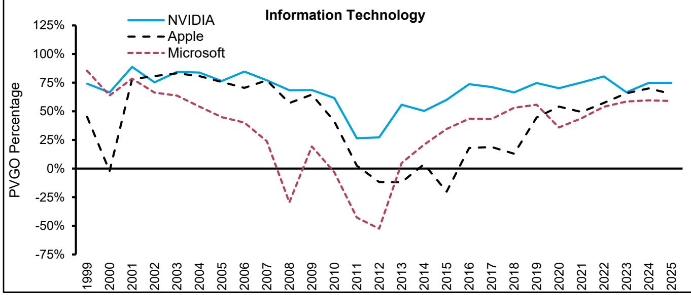

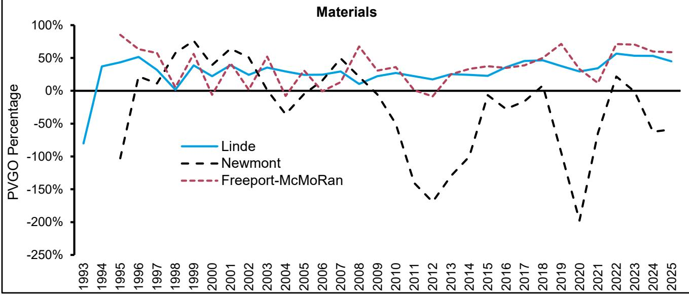

Source: Counterpoint Global and FactSet.

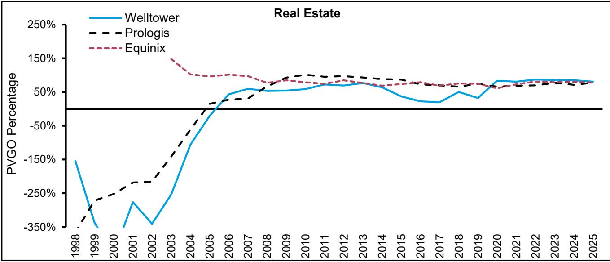

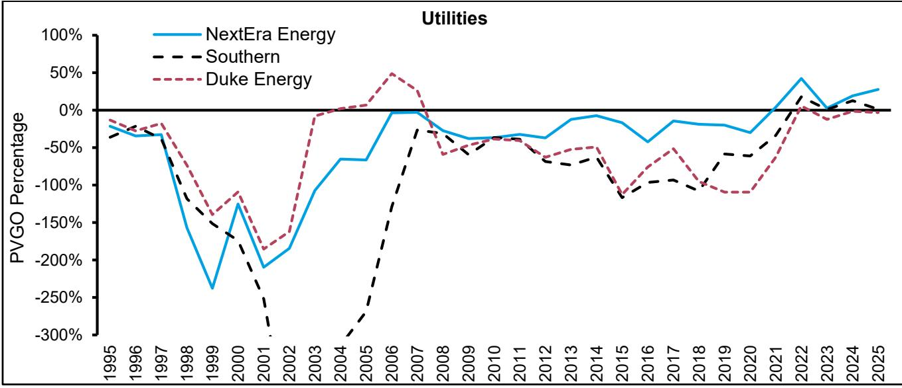

Note: Top 3 companies in each GICS sector in the S&P 500 Index based on market capitalization, as of 5/14/26; Begins at earliest record within each sector; To see a longer historical series, in Industrials we substituted RTX Corporation (4th largest) for GE Vernova (3rd largest), and in Utilities we substituted Duke Energy (4th largest) for Constellation Energy (3rd largest); Y-axis is truncated in several cases for visualization purposes.

## Endnotes

1 Merton H. Miller and Franco Modigliani, “Dividend Policy, Growth, and the Valuation of Shares,” The Journal of Business, Vol. 34, No. 4, October 1961, 411-433.

2 Stewart C. Myers, “Determinants of Corporate Borrowing,” Journal of Financial Economics, Vol. 5, No. 2, November 1977, 147-175. Also, see Richard A. Brealey, Stewart C. Myers, Franklin Allen, and Alex Edmans, Principles of Corporate Finance (New York: McGraw Hill, 2025), 4.18-4.24 and Richard E. Ottoo, Valuation of Corporate Growth Opportunities: A Real Options Approach (New York: Garland Publishing, 2000).

3 This is close to the June 1, 2026 estimate by Aswath Damodaran, a professor of finance at New York University. See https://pages.stern.nyu.edu/\~adamodar/.

4 This approach breaks price into “earnings power” and “franchise value.” See Martin L. Leibowitz, “Franchise Valuation under Q-Type Competition,” Financial Analysts Journal, Vol. 54, No. 6, November/December 1998, 62-74; Martin L. Leibowitz, Franchise Value: A Modern Approach to Security Analysis (Hoboken, NJ: John Wiley & Sons, 2004); and Martin L. Leibowitz and Stanley Kogelman, “Franchise Value and the Price/Earnings Ratio,” The Research Foundation of the Association for Investment Management and Research, 1994.

5 This method is based on free cash flow to equity, which assumes that earnings are a proxy for distributable cash for equity holders. Another approach, more common in finance, is free cash flow to enterprise, which takes the cash flow distributable to debt and equity holders to estimate a firm’s enterprise value and subtracts debt to determine equity value.

6 Javier Estrada, a professor of finance at the IESE Business School, uses a similar approach and data from 1872 to 2021. He comes up with much stronger results than we do, including a monotonic decline in returns for the market from the lowest to highest PVGOs as a percent of price. We could not replicate his results. See Javier Estrada, “PVGO and Expected Stock Returns,” Journal of Applied Corporate Finance, Vol. 34, No. 4, Fall 2022, 109-112.

7 There is a substantial amount of research on the value of PVGO for individual companies. One highly-cited paper is W. Carl Kester, “Today's Options for Tomorrow's Growth,” Harvard Business Review, Vol. 62, No. 2, March-April 1984, 153-160. Others tested Kester’s approach and found that the results are very sensitive to the inputs: see Jo Danbolt, Ian Hirst, and Edward Jones, “Measuring Growth Opportunities,” Applied Financial Economics, Vol. 12, No. 3, March 2002, 203-212. There is work on the characteristics of firms with high PVGO, including Michael S. Long, John K. Wald, and Jingfeng Zhang, “A Cross-sectional Analysis of Firm Growth Options,” Working Paper, November 5, 2002. Another thread shows that investors have a bias for paying too much for PVGO. See Hersh Shefrin, “Free Cash Flows, Valuation and Growth Opportunities Bias,” Journal of Investment Management, Vol. 12, No. 4, Fourth Quarter 2014, 4-26 and Cynthia M. Gong, Xindan Li, Di Luo, and Huainan Zhao, “The Bias of Growth Opportunity,” European Financial Management, Vol. 28, No. 4, September 2022, 926-963. For a good summary paper, see John D. Martin and Mark M. McNabb, “Equity Valuation, Growth Opportunities, and Franchise Value—What Was Old Is New Again,” Working Paper, September 2022.

8 Notably, our estimate of NOPAT includes an adjustment for intangible investment.

9 Eugene F. Fama and Kenneth R. French, “The Cross-Section of Expected Stock Returns,” Journal of Finance, Vol. 47, No. 2, June 1992, 427-465 and Eugene F. Fama and Kenneth R. French, “Common Risk Factors in the Returns on Stocks and Bonds,” Journal of Financial Economics, Vol. 33, No. 1, February 1993, 3-56.

10 Baruch Lev and Anup Srivastava, “Explaining the Recent Failure of Value Investing,” Critical Finance Review, Vol. 11, No. 2, May 2022, 333-360.

11 Warren E. Buffett, “Chairman’s Letter to the Shareholders,” Berkshire Hathaway, 2000.

## IMPORTANT INFORMATION

The views and opinions and/or analysis expressed are those of the author as of the date of preparation of this material and are subject to change at any time due to market or economic conditions and may not necessarily come to pass. Furthermore, the views will not be updated or otherwise revised to reflect information that subsequently becomes available or circumstances existing, or changes occurring, after the date of publication. The views expressed do not reflect the opinions of all investment personnel at Morgan Stanley Investment Management (MSIM) and its subsidiaries and affiliates (collectively “the Firm”), and may not be reflected in all the strategies and products that the Firm offers.

Forecasts and/or estimates provided herein are subject to change and may not actually come to pass. Information regarding expected market returns and market outlooks is based on the research, analysis and opinions of the authors or the investment team. These conclusions are speculative in nature, may not come to pass and are not intended to predict the future performance of any specific strategy or product the Firm offers. Future results may differ significantly depending on factors such as changes in securities or financial markets or general economic conditions.

Past performance is no guarantee of future results. This material has been prepared on the basis of publicly available information, internally developed data and other third-party sources believed to be reliable. However, no assurances are provided regarding the reliability of such information and the Firm has not sought to independently verify information taken from public and third-party sources. The views expressed in the books and articles referenced in this whitepaper are not necessarily endorsed by the Firm.

This material is a general communications which is not impartial and has been prepared solely for information and educational purposes and does not constitute an offer or a recommendation to buy or sell any particular security or to adopt any specific investment strategy or product. The material contained herein has not been based on a consideration of any individual client circumstances and is not investment advice, nor should it be construed in any way as tax, accounting, legal or regulatory advice. To that end, investors should seek independent legal and financial advice, including advice as to tax consequences, before making any investment decision.

Charts and graphs provided herein are for illustrative purposes only. Any securities referenced herein are solely for illustrative purposes only and should not be construed as a recommendation for investment.

The indexes referred to herein are the intellectual property (including registered trademarks) of the applicable licensors. Any product based on an index is in no way sponsored, endorsed, sold or promoted by the applicable licensor and it shall not have any liability with respect thereto.

This material is not a product of Morgan Stanley’s Research Department and should not be regarded as a research material or a recommendation.

The Firm has not authorised financial intermediaries to use and to distribute this material, unless such use and distribution is made in accordance with applicable law and regulation. Additionally, financial intermediaries are required to satisfy themselves that the information in this material is appropriate for any person to whom they provide this material in view of that person’s circumstances and purpose. The Firm shall not be liable for, and accepts no liability for, the use or misuse of this material by any such financial intermediary.

The whole or any part of this work may not be directly or indirectly reproduced, copied, modified, used to create a derivative work, performed, displayed, published, posted, licensed, framed, distributed or transmitted or any of its contents disclosed to third parties without MSIM’s express written consent. This work may not be linked to unless such hyperlink is for personal and non-commercial use. All information contained herein is proprietary and is protected under copyright and other applicable law.

Morgan Stanley Investment Management is the asset management division of Morgan Stanley.

This material may be translated into other languages. Where such a translation is made this English version remains definitive. If there are any discrepancies between the English version and any version of this material in another language, the English version shall prevail.

## DISTRIBUTION

This material is only intended for and will only be distributed to persons resident in jurisdictions where such distribution or availability would not be contrary to local laws or regulations.

MSIM, the asset management division of Morgan Stanley (NYSE: MS), and its affiliates have arrangements in place to market each other’s products and services. Each MSIM affiliate is regulated as appropriate in the jurisdiction it operates. MSIM’s affiliates are: Calvert Research and Management, Eaton Vance Management, Parametric Portfolio Associates LLC, Parametric SAS, and Atlanta Capital Management LLC.

This material has been issued by any one or more of the following entities:

## EMEA

This material is for Professional Clients/Accredited Investors only.

In the EU, MSIM materials are issued by MSIM Fund Management (Ireland) Limited (“FMIL”). FMIL is regulated by the Central Bank of Ireland and is incorporated in Ireland as a private company limited by shares with company registration number 616661 and has its registered address at 24-26 City Quay, Dublin 2, DO2 NY19, Ireland.

Outside the EU, MSIM materials are issued by Morgan Stanley Investment Management Limited (MSIM Ltd) is authorised and regulated by the Financial Conduct Authority. Registered in England. Registered No. 1981121. Registered Office: 25 Cabot Square, Canary Wharf, London E14 4QA.

In Switzerland, MSIM materials are issued by Morgan Stanley & Co. International plc, London (Zurich Branch) Authorised and regulated by the Eidgenössische Finanzmarktaufsicht ("FINMA"). Registered Office: Beethovenstrasse 33, 8002 Zurich, Switzerland.

Italy: MSIM FMIL (Milan Branch), (Sede Secondaria di Milano) Palazzo Serbelloni Corso Venezia, 16 20121 Milano, Italy. The Netherlands: MSIM FMIL (Amsterdam Branch), Rembrandt Tower, 11th Floor Amstelplein 1 1096HA, Netherlands. France: MSIM FMIL (Paris Branch), 61 rue de Monceau 75008 Paris, France. Spain: MSIM FMIL (Madrid Branch), Calle Serrano 55, 28006, Madrid, Spain. Germany: MSIM FMIL Frankfurt Branch, Große Gallusstraße 18, 60312 Frankfurt am Main, Germany (Gattung: Zweigniederlassung (FDI) gem. § 53b KWG). Denmark: MSIM FMIL (Copenhagen Branch), Gorrissen Federspiel, Axel Towers, Axeltorv2, 1609 Copenhagen V, Denmark.

## MIDDLE EAST

Dubai International Financial Centre: This information does not constitute or form part of any offer to issue or sell, or any solicitation of any offer to subscribe for or purchase, any securities or investment products in the UAE (including the Dubai International Financial Centre and the Abu Dhabi Global Market) and accordingly should not be construed as such. Furthermore, this information is being made available on the basis that the recipient acknowledges and understands that the entities and securities to which it may relate have not been approved, licensed by or registered with the UAE Central Bank, the Dubai Financial Services Authority, the UAE Securities and Commodities Authority, the Financial Services Regulatory Authority or any other relevant licensing authority or government agency in the UAE. The content of this report has not been approved by or filed with the UAE Central Bank, the Dubai Financial Services Authority, the UAE Securities and Commodities Authority or the Financial Services Regulatory Authority.

## U.S.

NOT FDIC INSURED | OFFER NO BANK GUARANTEE | MAY LOSE VALUE | NOT INSURED BY ANY FEDERAL GOVERNMENT AGENCY | NOT A DEPOSIT

## ASIA PACIFIC

Hong Kong: This document has been issued by Morgan Stanley Asia Limited, CE No. AAD291, for use in Hong Kong and shall only be made available to “professional investors” as defined under the Securities and Futures Ordinance of Hong Kong (Cap 571). The contents of this document have not been reviewed nor approved by any regulatory authority including the Securities and Futures Commission in Hong Kong. Accordingly, save where an exemption is available under the relevant law, this document shall not be issued, circulated, distributed, directed at, or made available to, the public in Hong Kong. Singapore: This material is disseminated by Morgan Stanley Investment Management Company, Registration No. 199002743C. This material may not be circulated or distributed, whether directly or indirectly, to persons in Singapore other than to (i) an accredited investor , (ii) an institutional investor as defined in Section 4A of the Securities and Futures Act, Chapter 289 of Singapore (“SFA”); or (iii) otherwise pursuant to, and in accordance with the conditions of, any other applicable provision of the SFA. This publication has not been reviewed by the Monetary Authority of Singapore. Australia: This material is provided by Morgan Stanley Investment Management (Australia) Pty Ltd ABN 22122040037, AFSL No. 314182 and its affiliates and does not constitute an offer of interests. Morgan Stanley Investment Management (Australia) Pty Limited arranges for MSIM affiliates to provide financial services to Australian wholesale clients. This material will not be lodged with the Australian Securities and Investments Commission.

## Japan

This material may not be circulated or distributed, whether directly or indirectly, to persons in Japan other than to (i) a professional investor as defined in Article 2 of the Financial Instruments and Exchange Act (“FIEA”) or (ii) otherwise pursuant to, and in accordance with the conditions of, any other allocable provision of the FIEA. This material is disseminated in Japan by Morgan Stanley Investment Management (Japan) Co., Ltd., Registered No. 410 (Director of Kanto Local Finance Bureau (Financial Instruments Firms)), Membership: the Japan Securities Dealers Association, The Investment Trusts Association, Japan, the Japan Investment Advisers Association and the Type II Financial Instruments Firms Association.