> **方正证券 | 航空航天与防务团队 | 中期行业策略报告**
> 分析师：李鲁靖 S1220523090002 | 黄凯伦 S1220524090001 | 刘明洋 S1220524010002 | 张世朴 S1220525100001

---

## 一、 基本面反转趋势确定，静待“十五五”规划化订单下达

1.1 一季度上游恢复明显，静待“十五五”规模化订单全面下达

1.2 行业进入新一轮景气上升期，新质战斗力为重点发力方向

1.2 新质战斗力建设已成为国防发展主旋律

## 二、 军贸：市场空间广阔+高利润率，第二增长曲线军贸迎来大发展机遇

## 三、 新质战斗力

3.1 先进战机：或进入2.0阶段，增量供应链将迎新机遇

3.2 数据链：助力信息化协同作战，未来战术应用场景广泛

3.3 军工AI:人工智能推动战争形态的转变,有望驱动全产业链演变加速

3.4 地面军用机器人：“机器狼” 重塑地面战争形态，产业有望迎来爆发

3.5 新型精确制导武器：高弹性细分赛道，低成本为后续重点方向

3.6 深海科技：国家战略新引擎驱动，深海建设迎1-10跨越式发展

上游恢复明显，静待“十五五”规模化订单全面下达。一季度国防军工行业受订单下达节奏影响，整体仍一定程度承压，但部分企业业绩扭亏为盈已预示行业拐点出现。去除船舶个股后，板块整体营收973亿元，同比下降12.1%；归母净利润50亿元，同比下降-16.96%。分板块看，船舶行业随着高价值船订单逐渐交付业绩进一步释放，Q1营收同比增长37.89%，归母净利润同比增长153.52%。上游企业收入端开始出现好转，其中新材料、被动元器件、有源器件、信息化类营收增速分别为6.86%、9.56%、14.66%、5.01%。上游企业作为行业风向标，Q1营收同比好转表明行业订单已逐步下达。行业有望在“十五五”规模化订单下达后迎来全面景气向上。

2026Q1军工板块整体营收  
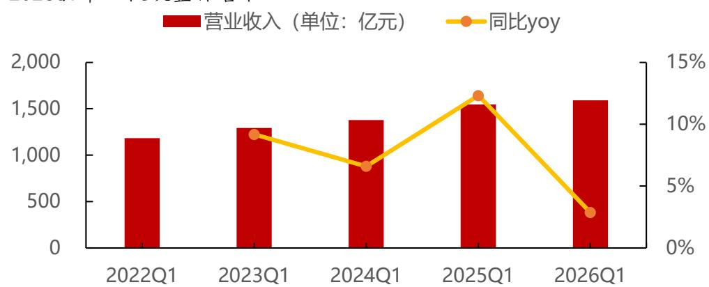

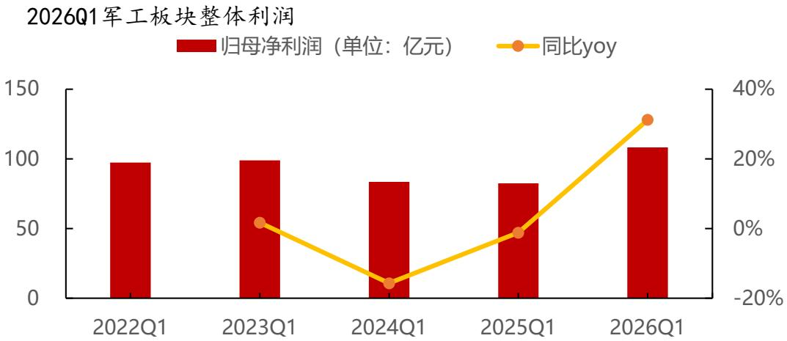

【方正军工】2026Q1军工板块上市公司财务数据横向比较（整体法)
| 版块 | 营业收入增速 归母净利润增速现金及现金等价物净增加额增速 | 毛利率变化值 净利率变化值(pct) (pct) | 期间费用率变化值(pct) | 存货增速 固定资产增速 在建工程增速 | 应收票据及账款 应付票据及账款预收款+合同负债增速 增速 增速 |
| --- | --- | --- | --- | --- | --- |
| 航空主机厂 | -2.68% | -28.84% | -192.16% | -0.42 | -1.08 |
| 新材料 | 6.86% | -9.13% | 34.78% | -0.09 | -1.73 |
| 航空航发中游配套 | -12.17% | -67.52% | -72.90% | -1.90 | -5.75 |
| 航空航发中间工序 | 10.71% | -29.13% | -136.53% | -4.05 | -4.60 |
| 地面兵装 | 46.40% | 92.42% | -15.24% | 0.50 | 6.35 |
| 航天 | -5.72% | -66.73% | -26.03% | -0.27 | 0.67 |
| 被动元器件 | 9.56% | -25.09% | 43.08% | -2.78 | -3.65 |
| 有源器件 | 14.66% | 22.01% | 611.74% | -2.59 | 0.64 |
| 信息化类 | 5.01% | -1370.05% | 9.79% | -0.11 | -1.66 |
| 导弹 | 41.86% | 175.76% | 48.14% | 1.53 | 5.80 |
| 船舶 | 37.89% | 153.52% | -30.03% | 2.94 | 4.18 |

资料来源：Wind，方正证券研究所

## 远期有锚点，近期有支撑，我们判断2026年行业将进入新一轮上升周期：

远期目标锚点：《中共中央关于制定国民经济和社会发展第十五个五年规划的建议》（以下简称建议）明确要求要“按照国防和军队现代化新“三步走”战略”，“高质量推进国防和军队现代化”，即到2027年实现建军一百年奋斗目标，到2035年基本实现国防和军队现代化，到本世纪中叶把人民军队全面建成世界一流军队。接续实现这一系列战略目标，需要国防和军队建设各领域全链路协调联动、同向发力，争取更快速度、更高质量、更高效益、更可持续的发展。

近期订单支撑：总书记3月7日在解放军和武警部队代表团全体会议上发表讲话，要求“如期完成既定目标任务”，从企业报表端反应情况看行业订单正加速下达，这对于短期行业基本面好转起到强支撑作用。我们认为，前期积压订单将在未来一段时间持续消化，填补“十五五”大规模订单下达前的行业空窗期，使行业平滑过渡至新一轮景气上升周期。26年行业业绩有望延续好转趋势。

军费保持较快增长，行业修复动能充足：2025年度我国军费预算为17846.65亿元人民币，同比增长7.2%，增幅与去年持平。这是自2022年以来，我国军费预算增幅连续四年超过7%。2024年我国军费支出占GDP比例为1.7%，在军费支出前10名国家中仅高于日本。长期来看我国国防支出占GDP的比重预计将与国际水平看齐，有望维持持续快速增长态势，对武器装备的采购需求也将持续增加。

## “新质战斗力”为十五五国防装备建设重点方向：

建议里明确指出，要“加快先进战斗力建设”、“推进新域新质作战力量规模化、实战化、体系化发展，加快无人智能作战力量及反制能力建设，加强传统作战力量升级改造”、“加快新兴领域战略能力建设，推动新质生产力同新质战斗力高效融合、双向拉动”。人工智能技术的高速发展或推动军工产业进入“技术裂变”新周期，新质生产力及新质战斗力建设已成为主旋律，预计也将成为未来“十五五”计划的重点领域。

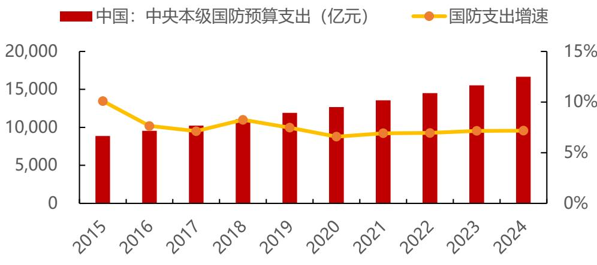

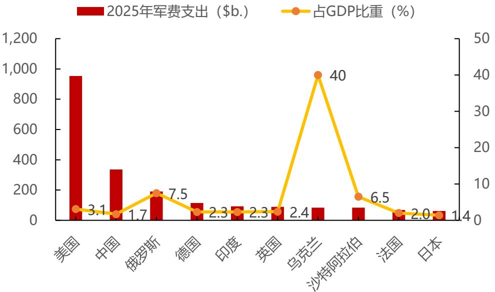

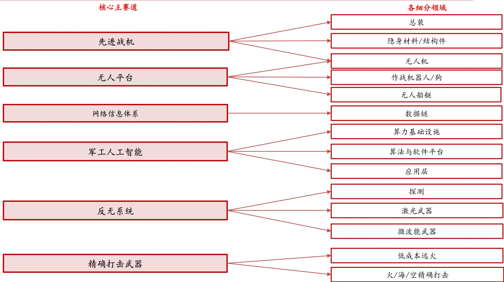

## 军贸：市场空间广阔+高利润率，第二增长曲线军贸迎来大发展机遇

➢ TIV(trend-indicator value)是SIPRI开发的一个单位，和特定年份交付的武器系统或子系统的数量一起来衡量武器的国际转让量。TIV基于一套核心武器的已知单位生产成本，旨在表示军事资源的转让，而不是转让的财务价值。

➢ 为了估算军贸市场出口的财务价值，我们粗略计算了美元与TIV的转化比率。美元与TIV的比值越大，意味着武器出口价与成本价比值越大，即利润率越高。

➢ 根据Rapport au Parlement 2023，可得到法国历年军贸出口交付额，22年为76.63亿欧元，使用各年底欧元兑美元汇率将欧元转换为美元，22年底汇率为1.07，即法国出口82.02亿美元，根据SIPRI的数据，法国22年军贸出口32.68亿TIV，可得美元与TIV的比值为2.51，依此类推可得13-22年美元与TIV的转化比率。13-22年美元与TIV的平均转化比率为3.09，即SIPRI统计得到的法国出口1TIV，实际约出口3.09美元。

➢ 根据SIPRI估算，2020年全球武器贸易237.58亿TIV，财务价值至少1120亿美元，以此来计算出美元与TIV的比值约4.71。

➢ 根据上述测算，我们假设在悲观/中性/乐观环境下，美元与TIV的转化比率为3.09/3.90/4.71。

➢ 根据SIPRI的数据，2019-2023年间全球军贸出口分别约为272.19/237.58/263.52/335.44/291.04亿TIV，乘以中性情形下美元与TIV的转化比率3.90，全球军贸出口约为1061.84/926.82/1028.01/1308.58/1135.37亿美元，5年共计5460.62亿美元。

表：2013-2022年法国军贸出口TIV-美元单位转化
| 法国 | 2013 | 2014 | 2015 | 2016 | 2017 | 2018 | 2019 | 2020 | 2021 | 2022 |
| --- | --- | --- | --- | --- | --- | --- | --- | --- | --- | --- |
| 出口：亿欧元 | 38.81 | 40.45 | 62.02 | 71.21 | 67.31 | 69.66 | 99.26 | 43.07 | 110.95 | 76.63 |
| 汇率（美元/欧元) | 1.37 | 1.21 | 1.09 | 1.05 | 1.20 | 1.15 | 1.12 | 1.22 | 1.14 | 1.07 |
| 出口：亿美元 | 53.34 | 48.94 | 67.31 | 74.89 | 80.78 | 79.87 | 111.34 | 52.61 | 126.14 | 82.02 |
| 出口：亿TIV | 17.99 | 17.68 | 22.71 | 21.41 | 23.15 | 18.79 | 37.24 | 23.87 | 38.92 | 32.68 |
| 比率 | 2.97 | 2.77 | 2.96 | 3.50 | 3.49 | 4.25 | 2.99 | 2.20 | 3.24 | 2.51 |

➢ 由于中东地区的民族矛盾、宗教纷争以及地区冲突不断，中东地区的局势动荡不安，军费开支长期居高不下，刺激了中东地区对武器进口的需求，根据SIPRI的数据，19-23年中东军贸进口 425.44亿TIV，占世界军贸进口比重30%，悲观/中性/乐观情形下，乘以美元与TIV的转化比率3.09/3.90/4.71 ，转化成美元约为1313.78/1659.72/2005.66亿美元。

➢ 根据SIPRI的数据，2019-2023年，中东军费支出从1421.60亿美元增长至1553.78亿美元，CAGR为2.25%。由军费支出与军贸进口存在显著的正相关关系，因此可用未来军费支出增速作为未来军贸进口额增速的近似替代。假设未来中东军费支出以过去5年的CAGR2.25%增长，军贸进口额也以2.25%的增速增长，则中性情形下，十五五期间的2026-2030年各年，中东军贸进口市场空间约为324.1/331.38/338.83/346.45/354.23亿美元，5年共1695亿美元。

图：19-30年悲观情形下中东军贸进口价值  
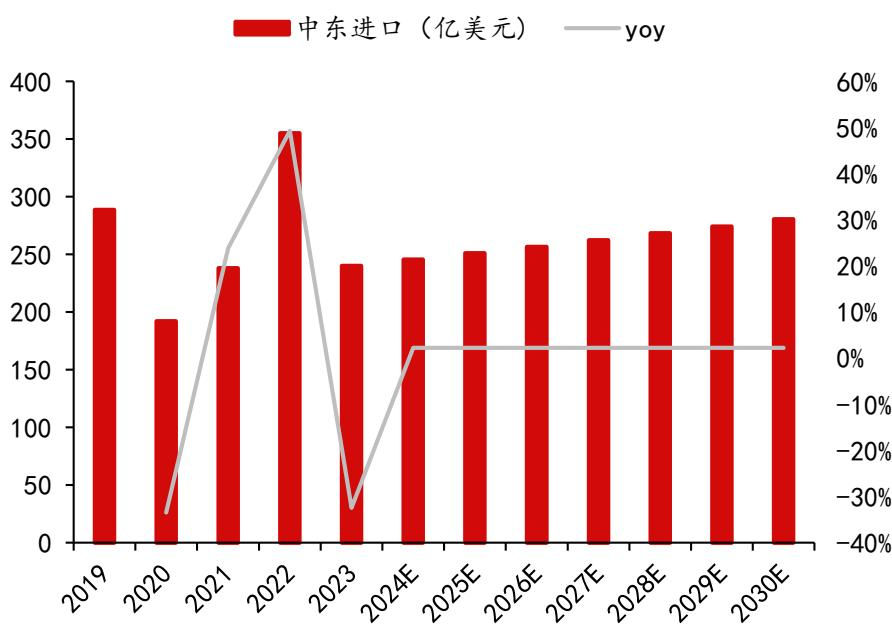

图：19-30年中性情形下中东军贸进口价值  
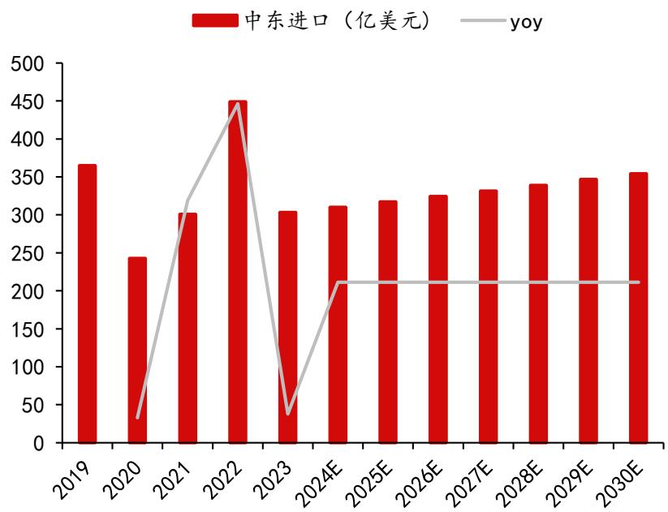

图：19-30年乐观情形下中东军贸进口价值  
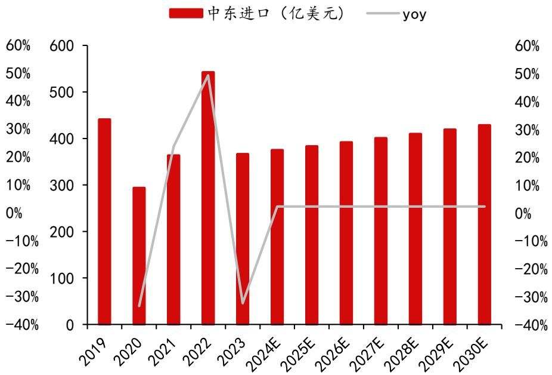

➢ 根据SIPRI的数据，19-23年南亚（巴基斯坦、孟加拉国）+东南亚地区军贸进口152.5亿TIV，占世界军贸进口10.89% ，悲观/中性/乐观情形下，乘以美元与TIV的转化比率3.09/3.90/4.71，转化成美元约为470.98/594.99/719.01亿美元。

➢ 根据SIPRI的数据，2019-2023年，南亚+东南亚军费支出503.3亿美元增长至541.93亿美元，CAGR为1.87%。假设未来南亚+东南亚军费支出以过去5年的CAGR1.87%增长，军贸进口额也以1.87%的增速增长，则中性情形下，十五五期间的2026-2030年各年，南亚+东南亚军贸进口市场空间约为171.87/175.08/178.34/181.67/185.06亿美元，5年共892.03亿美元。

图：19-30年悲观情形下南亚+东南亚军贸进口价值 图：19-30年中性情形下南亚+东南亚军贸进口价值 图：19-30年乐观情形下南亚+东南亚军贸进口价值  
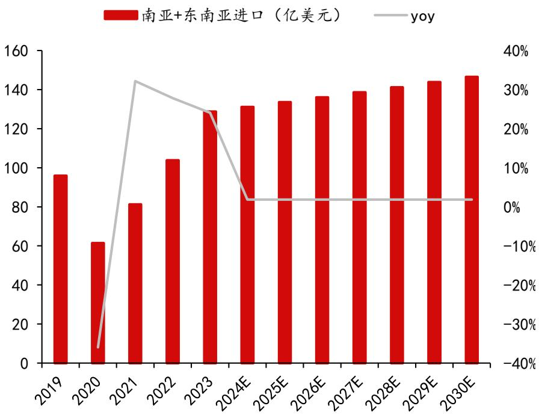

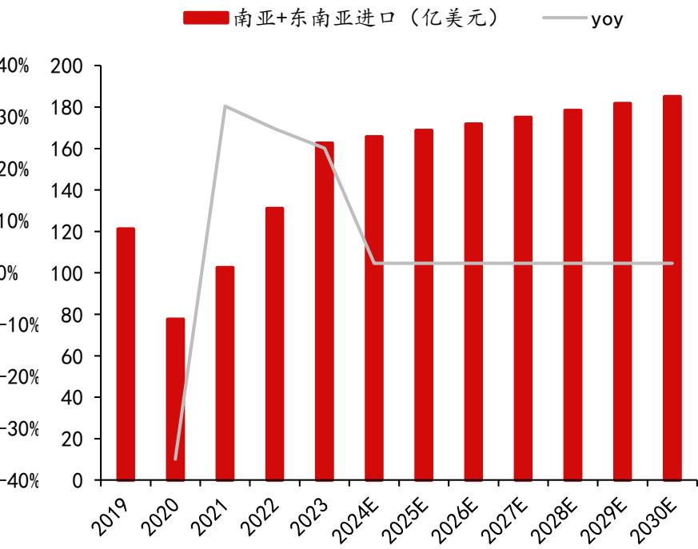

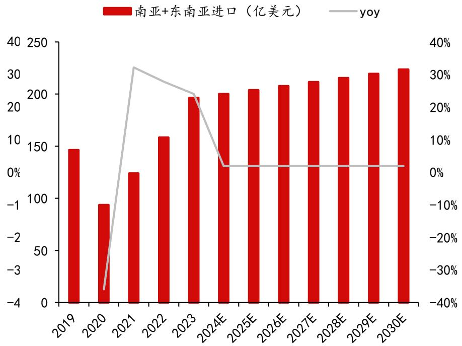

根据SIPRI的数据，19-23年，中东飞机/舰船/导弹/装甲车分别 进口194.92/74.79/73.46/43.75亿TIV，占中东武器进口比重分 别为46%/18%/17%/10%；南亚+东南亚飞机/舰船/装甲车/导弹分 别进口51.37/45.49/16.19/15.96亿TIV，占南亚+东南亚武器进 口比重分别为34%/30%/11%/10%。

假设以中东和南亚+东南亚过去5年武器进口结构作为十五五期间5年武器进口结构，则预期中性情形下，中东26-30年飞机进口市场空间约为779.70亿美元、导弹约为288.15亿美元；南亚+东南亚飞机进口市场空间约为303.29亿美元、舰船约为267.61亿美元。

图：19-23年中东武器进口结构  
图：19-23年南亚+东南亚武器进口结构  
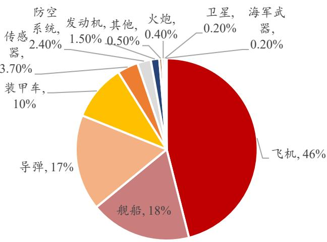

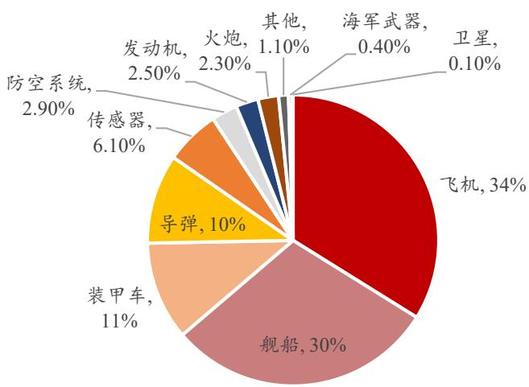

表：24-30年中性情形下中东和南亚+东南亚武器进口预期（亿美元）
| 类型 | 2024 | 2025E | 2026E | 2027E | 2028E | 2029E | 2030E |
| --- | --- | --- | --- | --- | --- | --- | --- |
|  |  |  | 中东 |  |  |  |  |
| 飞机 | 142.60 | 145.81 | 149.09 | 152.44 | 155.86 | 159.37 | 162.95 |
| 舰船 | 55.80 | 57.06 | 58.34 | 59.65 | 60.99 | 62.36 | 63.76 |
| 导弹 | 52.70 | 53.89 | 55.10 | 56.34 | 57.60 | 58.90 | 60.22 |
| 装甲车 | 31.00 | 31.70 | 32.41 | 33.14 | 33.88 | 34.64 | 35.42 |
| 传感 | 11.47 | 11.73 | 11.99 | 12.26 | 12.54 | 12.82 | 13.11 |
| 防空系统 | 7.44 | 7.61 | 7.78 | 7.95 | 8.13 | 8.31 | 8.50 |
| 发动机 | 4.65 | 4.75 | 4.86 | 4.97 | 5.08 | 5.20 | 5.31 |
| 其他 | 1.55 | 1.58 | 1.62 | 1.66 | 1.69 | 1.73 | 1.77 |
| 火炮 | 1.24 | 1.27 | 1.30 | 1.33 | 1.36 | 1.39 | 1.42 |
| 卫星 | 0.62 | 0.63 | 0.65 | 0.66 | 0.68 | 0.69 | 0.71 |
| 海军武器 | 0.62 | 0.63 | 0.65 | 0.66 | 0.68 | 0.69 | 0.71 |

| 南亚+东南亚 |
| --- |
| 飞机 |
| 舰船 |
| 装甲车 |
| 导弹 |
| 传感器 |
| 防空系统 |
| 发动机 |
| 火炮 |
| 其他 |
| 海军武器 |
| 卫星 |

➢ 根据SIPRI的数据，2019-2023年，中国军贸出口到南亚+东南亚地区分别为13.69/5.22/10.56/18/20.73亿TIV，占南亚+ 东南亚军贸总进口比重44.08%/26.24%/40.17%/53.57%/49.74%；中国军贸出口到中东地区分别为 0.52/0.52/0.65/0.2/0.15亿TIV，占中东军贸总进口比重0.56%/0.84%/0.84%/0.17%/0.19%。

➢ 预期我国主战装备市场竞争力增强，渗透率或显著提升。结合过去5年中国在南亚+东南亚和中东的出口情况，预期2025- 2030年，中国军贸出口在南亚+东南亚的渗透率为53.74%/55.74%/57.74%/59.74%/61.74%/63.74%，在中东的渗透率为 22.50%/25.00%/27.50%/30.00%/32.50%/35.00%。

前文估计在中性情况下，2025-2030年，南亚+东南亚军贸市场空间约为168.72/171.87/175.08/178.34/181.67/185.06亿美元，乘以渗透率，预计中国军贸出口到南亚+东南亚约90.66/95.79/101.08/106.54/112.16/117.95亿美元；中东军贸市场空间约316.97/324.10/331.38/338.83/346.45/354.23亿美元，乘以渗透率，预计中国军贸出口到中东约71.32/81.02/91.13/101.65/112.60/123.98亿美元。十五五期间（26-30年），预期中国军贸出口到南亚+东南亚/中东约533.52/510.38亿美元，合计值为1043.90亿美元。

图：19-23年中国对南亚+东南亚军贸出口 图：19-23年中国对中东军贸出口  
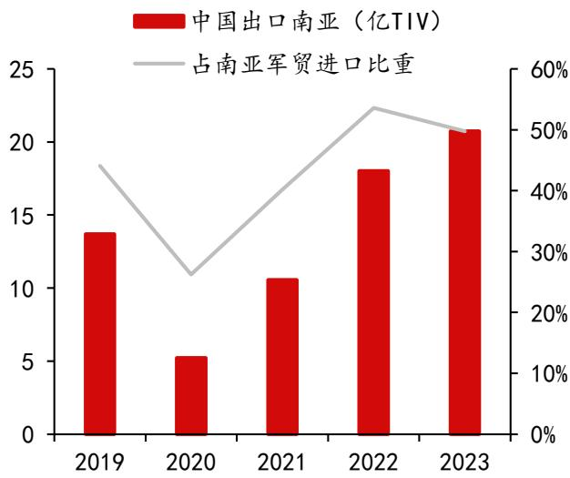

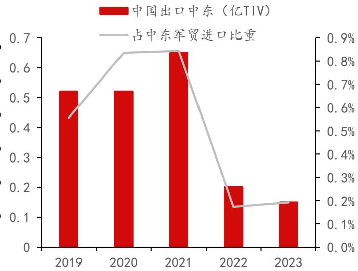

表：25-30年（预期）中国对南亚+东南亚和中东军贸出口
| 单位：亿美元 | 2024 | 2025E | 2026E | 2027E | 2028E | 2029E | 2030E |
| --- | --- | --- | --- | --- | --- | --- | --- |
| 南亚+东南亚军贸空间 | 165.63 | 168.72 | 171.87 | 175.08 | 178.34 | 181.67 | 185.06 |
| 渗透率 | 51.74% | 53.74% | 55.74% | 57.74% | 59.74% | 61.74% | 63.74% |
| 中国出口到南亚+东南亚 | 85.69 | 90.66 | 95.79 | 101.08 | 106.54 | 112.16 | 117.95 |
| 中东军贸空间 | 310.01 | 316.97 | 324.10 | 331.38 | 338.83 | 346.45 | 354.23 |
| 渗透率 | 20.00% | 22.50% | 25.00% | 27.50% | 30.00% | 32.50% | 35.00% |
| 中国出口到中东 | 62.00 | 71.32 | 81.02 | 91.13 | 101.65 | 112.60 | 123.98 |
| 合计 | 147.69 | 161.98 | 176.82 | 192.21 | 208.19 | 224.75 | 241.93 |

➢ 根据美国国防部发布的《Program Acquisition Cost by Weapon System》，23-25年美空军计划采购43/48/42架F-35A，平均单价1.04/1.10/1.18亿美元，美海军、海军陆战队计划采购34/35/26架F-35B/C，平均单价1.36/1.41/1.67亿美元；根据DSCA，2020年阿联酋计划向美国采购50架F-35A，平均单价2.08亿美元（较美军方采购溢价76.25%），新加坡计划采购12架F-35B，平均单价2.29亿美元（较美军方采购溢价37.31%），战机外贸价格显著高于内需价格。

➢ 无论是战机、或是黑鹰等直升机、MQ–9 Reaper等无人机、PAC-3 MSE等导弹，军贸价格均显著高于美国军方采购价格，军贸价格普遍溢价50%以上。武器军贸利润空间巨大，相关军贸企业将从中充分受益。

| 型号 | 內需 | 军贸 | 溢价 |
| --- | --- | --- | --- |
| 年份 | 采购方 | 单价(亿美元) | 年份 |
| F-35B/C | 2025 | 美国海军/海军陆战队 | 1.67 |
| F-35A | 2025 | 美国空军 | 1.18 |
| V-22 O0sprey | 2023 | 美国海军 | 1.47 |
| C-130J | 2023 | 美国 | 1.11 |
| MQ-9 Reaper | 2023 | 美国海军/海军陆战队 | 0.38 |
| AH-64E Apache | 2023 | 美国 | 0.21 |
| CH-47 Chinook | 2023 | 美国 | 0.67 |
| UH-60黑鹰 | 2023 | 美国 | 0.28 |
| E-2D先进鹰眼 | 2023 | 美国 | 1.72 |
| PAC3 MSE | 2024 | 美国 | 0.05 |
| AMRAAM | 2023 | 美国海军 | 0.01 |
| Rafale阵风 | 2024 | 法国 | 1.31 |

表：武器军贸价格远高于内需价格

## 军贸出口或为中国军贸企业带来更高的盈利增长：

1）中东、南亚+东南亚军贸进口需求增大。当前，中东局势愈演愈烈，中东对武器进口的需求或将进一步增大；印巴冲突、缅甸内部矛盾等因素，造成南亚+东南亚地区对武器进口也有增长的需求。

2）中国军贸出口渗透率上升。随着中国设计和制造武器的能力增强，中国武器在国际市场上的认可度提高，预期中国军贸出口在南亚和中东的渗透率会进一步提升。

3）军贸产品高利润率。美国战机、直升机、无人机和导弹等武器，军贸价格均显著高于美国军方采购价格，军贸价格普 遍溢价50%以上，军贸产品利润率很高。

我国的枭龙、歼-10C、彩虹和翼龙系列无人机为我国在军贸市场的主力军，J35为代表的第五代战机有望走向军贸市场，导弹和远火是军贸的另一个重要关注点。

## 战机全生命周期成本巨大，费用大量投入或为相关企业带来增长机遇：

美国防部估计，F-35使用至2088年，F-35项目全生命周期成本将超过2万亿美元，其中采购和开发成本约0.442万亿美元，维护费用约为1.58万亿美元。费用大量投入或为相关军事研发与制造企业，硬件或软件维护企业等带来增长机遇。

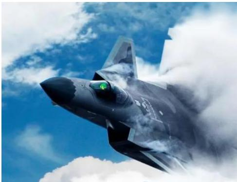  
图：歼-20

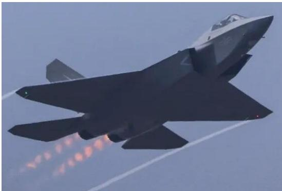  
图：J35

## 先进战机：或进入2.0阶段，增量供应链将迎新机遇

◆而今，各国正根据自身战略需求、国防预算以及技术发展水平，在各类军用飞机的研发、采购与升级上展开激烈的角逐。根据美国《航空周刊》对2025年至2034年全球值得关注的军用飞机格局梳理，战斗机、教练机和轻型战斗机、武装直升机、无人机、运输机和加油机、特种飞机等各个细分领域都有较为广阔的前景，这说明各国对军用战机需求旺盛。假设以中东和南亚+东南亚19-23年武器进口结构作为24-28年武器进口结构，则预期中性情形下，中东24-28年飞机进口市场空间约为745.8亿美元，南亚+东南亚飞机进口市场空间约为292.28亿美元。

◆先进战机功能性需求逐渐显现。近年来，无人装备运用已深度融入作战体系。2025年12月1日，乌克兰第412“涅墨西斯”旅下属的“暗节点”营使用“毒刺”拦截无人机，成功击落了一架经过改装的俄罗斯“天竺葵”-2无人机。未来先进军用战机或愈发注重无人机指挥能力，使用无人机完成侦察、发送目标指示、校准火力和通信中继等任务。

2025-2034全球各军用飞机市场  
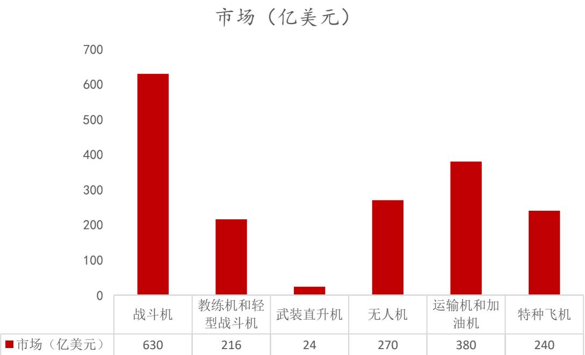

24-28年中性情形下中东和南亚+东南亚军用飞机进口预期（亿美元）  
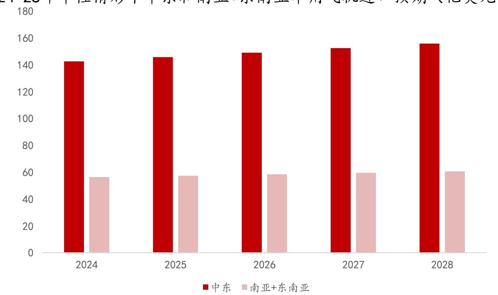

◆根据《World air forces 2026》报告，从美国各军种所使用的战机情况可以看出，美国中型五代机F-35A/B/C的现役部署数量（约683架）远远超过重型五代机F-22的现役部署数量（约177架）。在亚太地区，美国主要盟友（日、韩、澳）的现役F-35部署数量约148架；订购中的F-35约158架。截至报告发布，全球范围内F-35现役数量约883架，而F22的生产线早已拆解，这意味着在未来的全球范围内，先进战机的主力作战装备将以高效率低成本为新需求，中型五代机迎来重大发展机遇。而我国目前中型五代机仍未正式列装，未来中型五代机或于海军舰载机及空军列装，形成新核心战斗力。

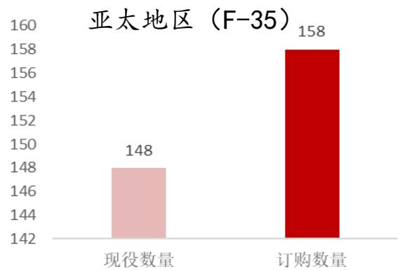

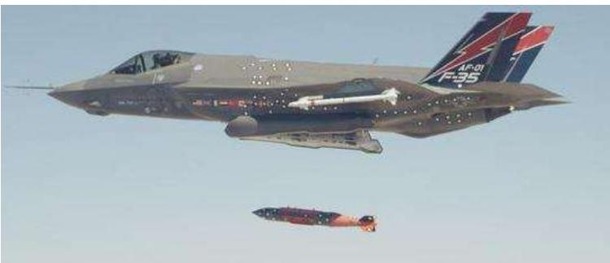

美国空军五代机(F35A/F22)  
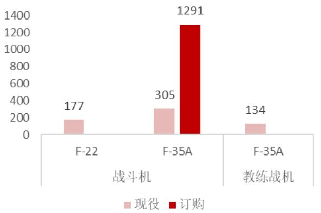

美国海军陆战队五代机(F35B/C)  
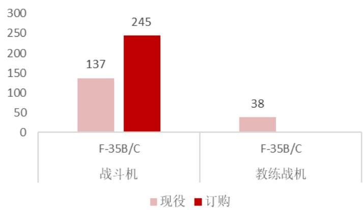

美国海军五代机(F35C)  

◆大多数人同意的五代机定义为：武器内埋，全方位隐身，超高敏捷性，全传感器融合，一体化航电系统，部分或全部的超声速巡航能力，包括美国的F-22、F-35。目前仅有中美俄三国具备完整五代机研发能力：美国的F-22、F-35，俄罗斯的苏-57，中国的歼20和歼35。韩国KF-21、土耳其“可汗”等项目虽自称五代机，但其技术仍停留在四代半水平，隐身能力尚未完全成熟。

◆歼-20于2011年首飞，并在2017年正式服役，其展现的综合性能，让世界为之侧目，标志着中国在顶尖航空装备领域实现了历史性跨越。其不仅自身战力强大，还在体系作战中能承担更持久的战场巡逻、信息中继和指挥控制任务。

◆美国F-35A是有史以来第一款具有核能力的第五代战机，也是自20世纪90年代初以来首个达到这一地位的新平台（战斗机或轰炸机）。F-35A战机获得认证为美国和北约提供了至关重要的威慑能力。

美国F-35A  
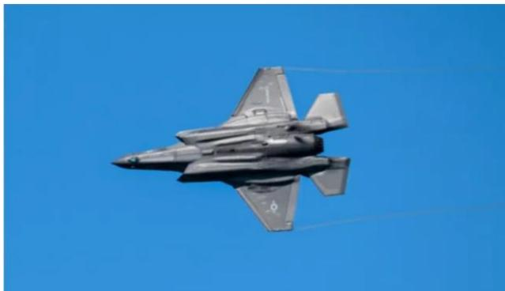

中国歼20  
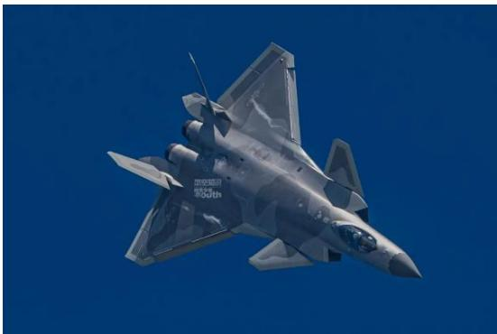

俄罗斯苏-57  
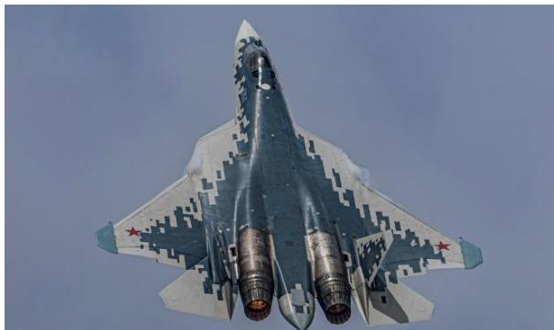

韩国KF-21  
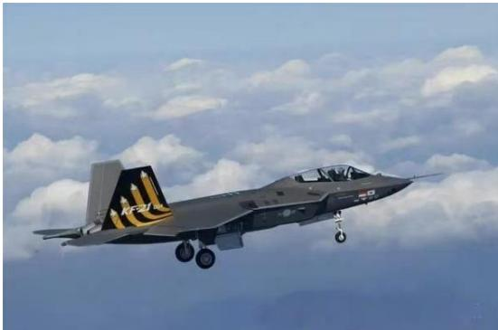

◆采用海空孪生、一机多型思路研发的歼35系列战机未来的装备数量可以很多，并能在体系化作战中充分发挥“组织后卫”的作用。从歼35的特点来看，它具有更强的隐身能力，此外，它的协同作战能力也会很强。2025巴黎航展上，歼35A以模型形式亮相国际舞台。

◆土耳其第五代战斗机“可汗”项目自2010年底启动，由土耳其航空航天工业公司主导研发。2024年2月，该战斗机完成首飞。2025年6月11日土耳其总统埃尔多安宣布，在10年的期限内，土耳其将向印度尼西亚出口创纪录的48架“可汗”战斗机（KAAN），预计将于2028年首次交付。

◆印度的先进中型战斗机（AMCA）旨在将印度空军（IAF）提升为拥有下一代空战能力的精英国家。AMCA于2024年获得批准，预计将于2035年首飞。已经批准了5个原型机进行开发，估计项目成本为1500亿卢比。第一架作战飞机预计将于2035年投入使用。

土耳其“可汗”战斗机  
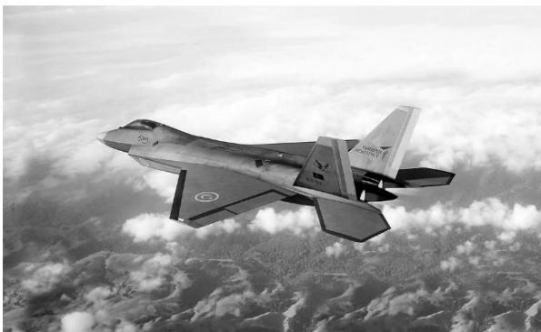

中国歼35A  
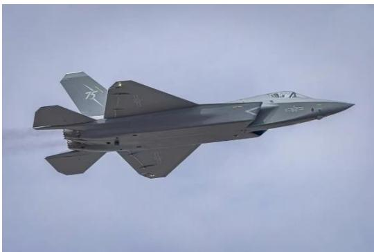

日本X-2  
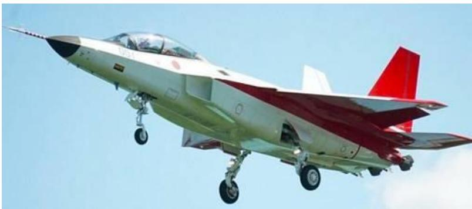

印度AMCA模型  
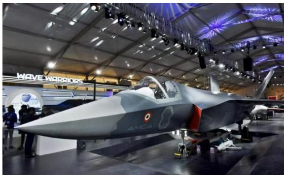

◆尽管目前第六代战机尚未形成统一标准，但各国在研发过程中所展现出的方向已呈现出诸多共性特征，这些特征反映了未来空战对战斗机性能的新需求:全域隐身、AI主导、网络化杀伤链、新概念武器、变循环引擎等。

全球各国积极研发六代机
| 六代机项目 | 概述 |
| --- | --- |
| 印度HALAMCA | 印度的HALAMCA项目最初被定位为第五代战斗机，但在设计上预留了升级至第六代的空间，计划于2030年实现量产。然而其也面临发动机依赖进口、项目本土化难等问题。 |
| 日本MitsubishiFX | 采用等离子隐身天线的技术，计划于2031年实现量产。旨在应对周边国家空中力量的发展，特别是中俄日益增强的空中作战能力，以强化日本在东海地区的制空权。 |
| 俄罗斯MiG41 | 俄罗斯的MiG41项目旨在替代老I旧的MiG31战机，计划于2025年实现量产。然而由于西方制裁，航电系统和材料技术的发展受到限制，关键零部件的进口受阻。 |
| 欧盟FCAS | 欧盟的FCAS项目由德、法、西三国主导，计划于2040年服役。在项目推进过程中，各国之间存在利益分配和技术整合等难题。 |
| 美国F/XX | 美国的F/XX项目处于高度保密状态，据推测，其原型机已于2020年进行了试飞。主要研发目标是维持对中俄等国的技术代差。 |
| 中国JXX | 旨在接替歼20与歼31，进一步提升中国空军的作战能力。目前，该项目的细节处于高度保密状态。确保WS15发动机的稳定运行和性能提升，是JXX项目面临的重要任务之一。 |
| 英国Tempest | 英国的Tempest项目截至2025年已投入20亿英镑，预计将创造20万就业岗位。脱欧后，Tempest项目能否维持与欧盟国家的合作存在不确定性。 |

◆无人僚机，指可以与有人驾驶战斗机协同作战的无人驾驶飞行器，通常具备一定的自主能力，可以执行侦察、打击和电子战等多种任务。与传统无人机相比，无人僚机更强调与有人机的交互配合，增强整体作战效能。

◆ 作为一种新兴的军事装备，无人僚机足以改变战争形态。无人僚机具有低成本、高效能等特点，它不仅代表了无人机技术向战场主要技术演进的重要趋势，还预示着有人—无人系统协同作战的发展方向。

**无人僚机发展时间线：**

| 时间 | 事件 |
| --- | --- |
| 2015 | 美军正式提出有人作战飞机与无人僚机协同作战概念，并相继启动多个项目 |
| 2021 | MQ-25”黄貂鱼”无人加油机与美国海军F/A-18战斗机完成空中加油测试，此后又陆续与E-2D预警机、F-35C战斗机进行空中加油测试 |
| 2024 | “翡翠旗”军演中，XQ-58A”女武神”无人机与美海军陆战队4架F-35B战斗机以及美国空军2架F-15EX战斗机进行协同作战演示 |
| 2024.5 | 英国奎奈蒂克公司在英国国防科技实验室、海军和空军作战中心协助下，成功进行有人作战飞机与”女妖80”自主喷气式无人机协同作战试验 |
| 2024.6 | 空客公司推出”僚机”隐身无人机原型机。该机翼展约12米,可搭载多种弹药，能与”台风”战斗机和F-35战斗机等协同作战 |
| 2024.10 | 法国达索公司公布与”阵风”F5战斗机协同的新型无人僚机研制计划。德国赫尔辛公司与空客公司共同为无人僚机项目开发人工智能控制系统 |
| 2025.5 | 空客公司与西班牙海军合作，进行”灵活旋翼”无人机与H135直升机协同作战概念验证，为无人僚机与直升机协同作战积累经验 |
| 2030前 | 采购1000架低成本无人僚机 |

俄罗斯“猎人”无人僚机  
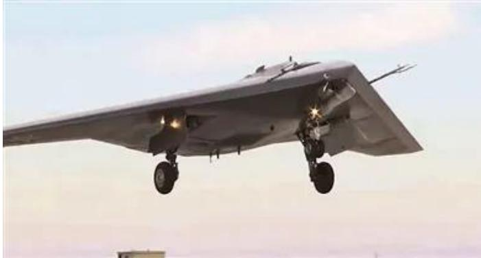

法国“神经元”无人机（右）与“阵风”舰载机协同飞行

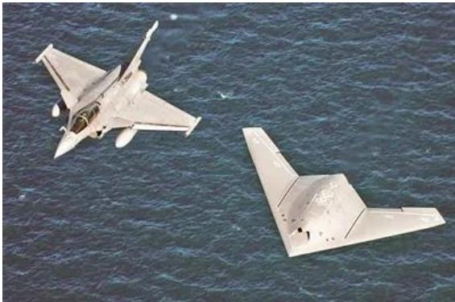

### 无人僚机优势

协同作战

移动弹药库

作为有人一无人协同作战的组成部分，无人僚机能够在有人战斗机的指挥下，深入敌防空区执行侦察、干扰和打击等一系列任务，从而加强空中作战的灵活程度。

无人僚机还能作为有人战斗机的“弹药库为其提供火力支持。无人僚机携带小直径炸弹或空地导弹时，可为有人机提供火力支援。

资料来源：中国国防报，方正证券研究所等

◆衡量隐身技术的优劣的指标是雷达散射截面积（Radar cross section,简称RCS）,RCS越小，隐身性能就越好。为降低战机的RCS，便需用到相关的隐身材料。下图为歼-20部分隐身材料应用情况：

歼-20隐身材料应用

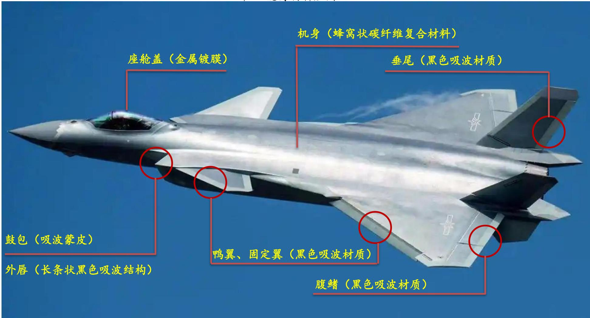  
资料来源：北国军技，材料PLUS，兵工科技海上武器版，成电研究生科学普及，方正证券研究所等

## 数据链：助力信息化协同作战，未来战术应用场景广泛

数据链能够从以下四个方面有效提升部队整体的作战效能:

◼ (1) 主宰机动。主宰机动是联合部队在执行军事任务过程中, 以决定性的反应速度、压倒性的作战节奏夺取位置优势的能力。高度分散展开的联合部队, 能够根据战斗或非战斗行动要求, 调动或集结一支或多支部队的兵力与火力效果。

◼ (2) 精确打击。精确打击是联合部队在整个军事行动领域的能力, 能够定位、监视、识别和跟踪目标, 选择、组织和使用适当的系统, 产生预期的效果, 评估作战效果, 在必要时能以决定性的速度和压倒性的节奏再次实施打击。精确打击是基于效果的作战。

◼ (3) 集中后勤。集中后勤是一种保障能力, 它为联合部队在整个军事行动范围内的准确地点和准确时间, 提供准确数量的人员、设备以及资源补给。

◼ (4) 全维防护。全维防护是联合部队保护其执行关键任务的人员及物资的能力。它通过精心选择和应用多层次的主动和被动措施来实现, 在可接受的风险程度内, 贯穿于整个军事行动区域的天空、陆地、海洋、太空和信息领域。

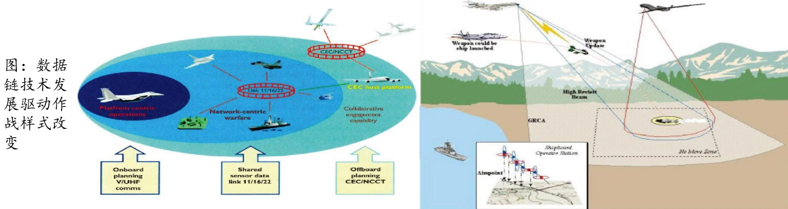  
图：共享传感器数据与控制权

◼ 北约最早制定了战术数据链Link系列，代表系统包括Link 4、Link 11和Link 16等。后续基于服务对象与传输格式化信息内容结构的差别，逐渐衍生出了多种专用数据链。此时，数据链系统主要分为战术数据链和专用数据链2类。

随着现代化战争对情报、侦察与监视（ISR）信息需求的提升，仅靠窄带的战术数据链已无法满足作战要求。美国国防部于20世纪80年代开始开发专用于传输ISR信息的宽带情报数据链，并于90年代装备通用数据链（CDL）系列。这一时期的数据链系统主要分为战术数据链、宽带情报数据链和专用数据链3类。

战术数据链主要面向平台控制进行态势共享和战术协同，受限于时延和组网体制，难以满足现代战场环境的火力控制要求。在此背景下，武器协同数据链从专用弹载数据链中独立出来，以美国海军协同交战能力（CEC)和美国空军机间数据链（IFDL）为代表成为一种新的数据链类型。

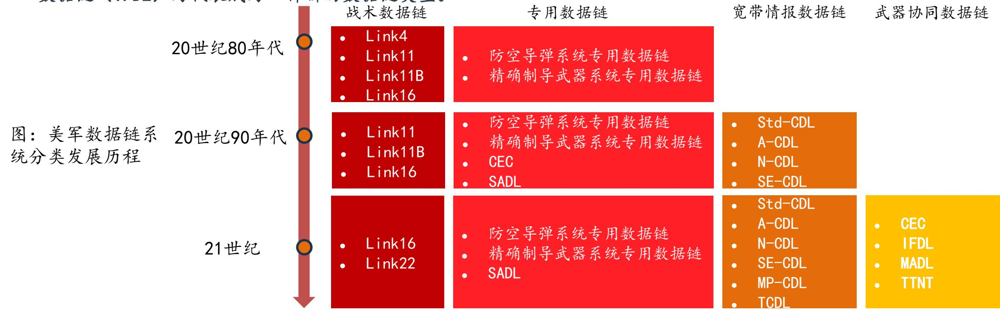

◼ 指控链：美国和北约国家是最早开始研制装备数据链的，美军称指控链为战术数字信息链（TADIL），早期也称态势共享数据链。美国空军当前主要装备的指控链为Link 16。

情报链：CDL系列是美国国防部指定的大容量信号和图像情报分发的数据链标准，TCDL是一款为解决小型飞机平台及无人机平台的空-地和空-舰情报传输而设计的宽带情报数据链。近年来，TCDL主要装备于美国陆军的中小型无人机以及海军的反潜直升机与反潜巡逻机等，美军计划进一步提升TCDL的传输速率，升级至与CDL系列完全兼容，以协同MP-CDL覆盖有人/无人平台实现情报传输交互。

◼ 武协链：指武器协同数据链，最早由专用数据链中点对点弹载数据链演化而来。目前，美国空军在研/在役的武器协同数据链主要包括IFDL、MADL和TTNT等。

图：美国空军数据链运用体系概念图  
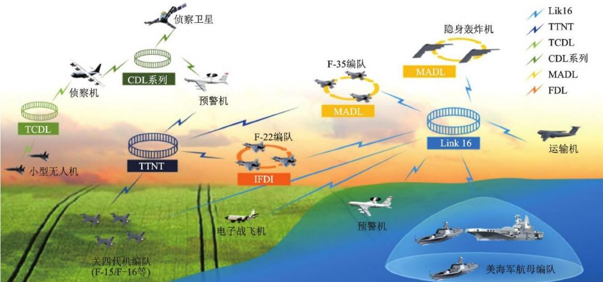

◼ 我国各军兵种数字化建设起步较晚，这与前苏联将蓝天系统作为国土防空的重要武器，拒绝对外提供给包括我国在内的任何国家有关。

◼ 20世纪60年代，空军组建了自动化研究所，在学习国外C3I系统的基础上，探索我国防空自动化系统的概念、体制和技术。

20世纪70年代末，开始研制雷情-1号半自动防空情报指挥系统，该系统利用数据链实现各雷达站与防空指挥中心的对接。

◼ 20世纪80年代，该系统首先装备在河北和广西两地，并在此基础上研制了用于地面指挥所与空中截击机之间联系用的481和483两种数据链；与此同时，海军开发类似Link-11的战术数据链，同时为支持歼轰-7型飞机的反舰作战研制了483D数据链。

◼ 不过当时我军在数据链建设方面存在各军兵种的标准不一的问题，难以协同作战。

◼ 进入21世纪，着眼于现代战争的需要，我国先后研制了歼-10等武器装备，为实现各战术链间的互联互通以提高整体作战能力，全军综合数据链系统得以诞生。

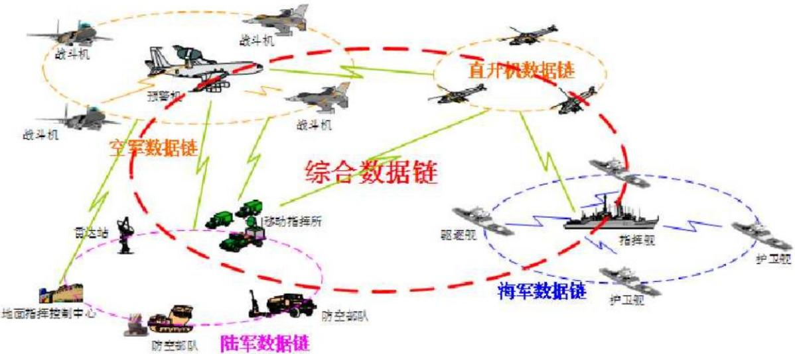  
图：我国全军综合战术链很大程度参考美军Link-16战术数据链的通信模式和功能设计，并就一些技术和操作上做了较大改进，提升了战术通信的能力。

目前，市场公开信息中，少有对数据链进行产业链分析。不过，同样作为以数据作为载体的数据链条，有较多公开信息对大数据产业链和区块链产业链进行分析。据前瞻经济网的相关分析，大数据产业链可以分为核心为基础设施的上游、数据服务为特色的中游以及下游的应用层；区块链产业链可以分为核心为底层技术及基础设施的上游、核心为平台层的中游以及下游的应用层。我们认为，可以采用类似的产业链分析对数据链这一技术进行产业链分析。

据光明网报道——“数据链是按规定的消息格式和通信协议，链接战场传感器、指控系统和武器平台，可实时自动地传输和处理情报侦察、指挥控制、武器协同等作战数据的信息系统，它对接的是战场上快速机动的作战单元，面向的是战术单元之间高效协同的战术行动，因此军事领域的数据链一定是战术层面的，也被称作战术数据链”。

因此，我们认为数据链产业链也可以分为上、中、下游——其中，上游主要为数据链技术的信息标准、底层技术以及基础设施，比如通信协议技术有统计优先多址接入(statistic priority-based media access,SPMA)协议、固定TDMA(time division multiple access)协议和P-TDMA(priority-TDMA)协议等；中游为数据链关键技术及其配套产品的制作生产，比如无线通信技术及其产品等，中游具有一定数量的上市公司和研究所；下游为数据链的应用场景，比如车载、机载和舰载等。

图：数据链产业链流程图
| 上游 | 中游 |  | 下游 |  |
| --- | --- | --- | --- | --- |
| ·通信协议 | ·无线通信技术及产品 | ·车载应用 |  |  |
| ·信息标准 | ·T/R组件和射频模块 | ·机载应用 |  |  |
| ·底层计算机技术 |  | ·舰载应用 |  |  |
| ·基础设施 |  | ·弹载应用 |  |  |

## 军工AI:人工智能推动战争形态的转变,有望驱动全产业链演变加速

➢ 人工智能推动战争形态的转变：从制陆权到制海权、制空权，再到制天权、制信息权，智能化时代，军事斗争焦点延伸至认知域，“制智权”成为未来战争的“新高地”。人工智能技术将成为军事变革的重要推手，必将催生新的战争样式，推动战争形态的加速转变。

➢ 人工智能应用是战术体系发展和装备体系发展的必然方向：未来战争空间多维、力量多元、样式多样、节奏加快等突出趋势，对战场信息的接收与认知、对战场态势的评估与预测、对作战行动的快速应变等能力要求将远远超出作战人员的思维能力，必然需要依靠具有超强计算、学习和理解能力的机器进行威胁研判和作战辅助决策。

## 在武器装备和战争制胜机理“双轮”驱动下不断演进断发展

## 制陆权

## 制海权

石块、棍棒

## 制空权

金属制武器

火炮、枪械等热兵器

冷兵器时代

制天权

石器时代

热兵器时代

坦克、飞机、 战舰、火炮等

机械化时代

## 制信息权

??4??????系统、电子对抗、战术互联网

制智权

无人武器、机器人、集群

智能化时代

## 融入联合的体系破击战

信息化时代

在联合作战背景下，综合运用空、天、电、网、智等多维手段，对敌支撑作战体系的关键环节实施杀伤

## 基于能力的多维慑止战

统筹运用信息战、火力战、特种战和心理战，以信息攻击、火力摧毁、小战速胜等手段实施惩戒性威慑。

空地一体的精确火力战

对敌作战体系的要害目标实施空地一体精确打击。

灵活高效的全域机动战

快速响应、远距离投送、多方式机动，跨越国土疆域全域多维战场空间。

## 脑机融合的智能化作战

武器装备平台集智能感知、智能决策、智能行动于一体，进行自主化、无人化智能作战行动。

## 战
术
体
系
发
展

**装备体系发展**：
①机动化、精确化：提高战略机动和战术机动能力

②信息化：加快装备功能要素的整合，适应一体化联合作战要求

③智能化：要适应灵敏多能的作战要求

## 俄乌冲突充分展示人工智能力量

俄乌冲突可以称为第一次“智能化战争”，人工智能技术在战场的广泛应用，大大削弱了冲突双方的实力差距，促使作战样式也转向了扁平化、分散式和去中心化的小分队作战模式。

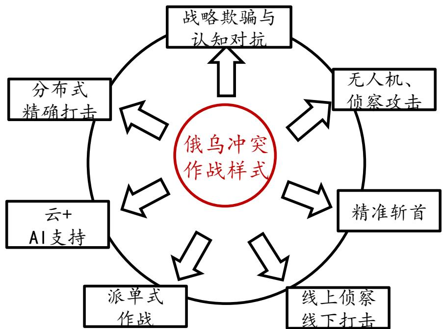

军事AI技术体系框架包括：赋能体系、军事智能系统、作战体系。

➢ 赋能体系：以机器学习、人机交互、计算机视觉等人工智能算法为依托，形成面向军事应用的人工智能优化算法引擎，实现人工智能技术在军事领域的赋能。

➢ 军事智能系统：应用赋能技术，面向军事作战需求，依托作为人工智能算法“倍增器”的基础支撑，实现感知、指挥、打击、互联形成的OODA作战链路的智能化。

➢ 作战体系：在空中作战、反导反临作战、太空对抗、陆海作战等行动中，作战部队利用军事智能系统，与人协同，提升作战效能，形成对敌方的非对称优势

军事AI技术体系框架  
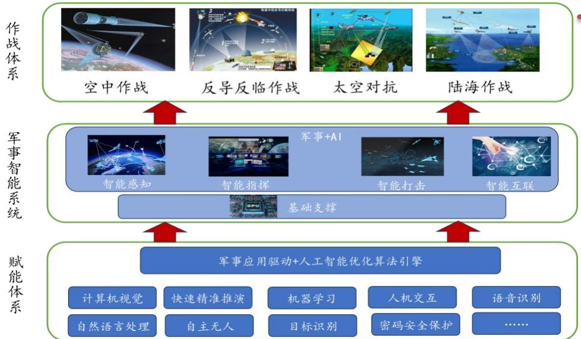

### 态势感知：穿透战场迷雾，构建非对称优势

未来战场信息杂乱、真假难辨，AI能像“智能筛子”一样整合多源信息，剔除干扰、识破伪装，提升态势感知准确率。

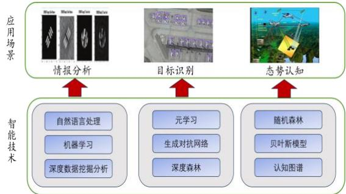

### 武器打击：增强体系韧性，保证持续作战

### 指挥控制：重塑决策模式，夺取速度优势

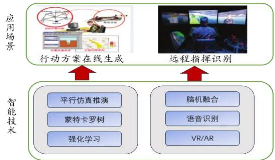

AI赋能下的作战单元具备“自组织、自适应”能力，使作战体系更具抗毁性和持续作战能力。

AI通过毫秒级处理海量信息，能将战争节奏压缩至“秒级” ，缩短OODA的闭环周期。

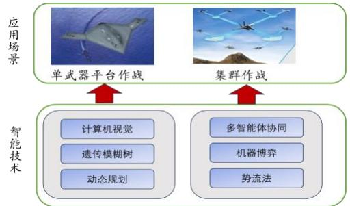

### 战场互联：自由互联互通，实现网络优势

可在单武器平台自主作战、作战编组分布式杀伤等方面应用计算机视觉、多智能体协同等智能技术。

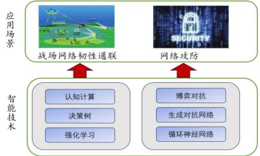

### 支援保障：创新训练模式，优化后勤保障

AI通过构建高拟真度的虚拟战场和提供实时反馈，能够提升训练效率、降低成本，并推动后勤保障向智能化、精准化转型

美国不断提高军事人工智能战略重要性，加大政策支持及资源投入。自2016年以来,美国陆续出台了一系列人工智能战略与政策,如制定《国防部人工智能战略》,将人工智能定位为优势技术领域。2023年11月2日，美国国防部发布了《数据、分析与人工智能采用战略》，是推动美军深度数字化转型的里程碑事件，明确将中国视为美国在军事人工智能领域唯一“战略竞争对手”的代表。2025年美国发布首个人工智能条令《空军条令说明25-1 人工智能》，标志其战略布局进入新阶段。

美国国防部及军队AI相关战略规划
| 《国防部云战略》 | 《国防部人工智能战略概要》 | 《国防部数据战略》 2020 | 《国防部负责任人工智能战 略和实施路径》 2022 | 《数据、分析与人工智能采 用战略 | 《空军条令说明25-1人工智 能》（AFDN25-1) |
| --- | --- | --- | --- | --- | --- |
| 2019 | 2023 | 2025 |  |  |  |
| 制定了云计算运用发展 |  | 提出国防部应加快成为 | 阐明了国防部如何寻求 | 阐明了国防部保持决策 | 美军发布的首个人工智 |
| 的战略和指导原则，提 | 描述了加快人工智能应 | 一个“以数据为中心” | 人工智能实现更加安全 | 优势的敏捷方法和六大 | 能军种条令，也是全球 |
| 1升云平台对军队的支撑 | 用的战略方针和重点领 | 」的组织，在作战速度和 | 和高效的方法，使其在 | 战略支柱，旨在加强国 | ‖首个人工智能专业条令。 |
| 能力，配合国防部更大 | 域 | 规模上利用数据提高作 | 一系列作战和非作战应 | 防部的数据、分析与人 | 美军在人工智能领域布 |
| 的网络战略 |  | 战优势和效率 | 用中实现能力现代化 | 一工智能能力 | 局进入新阶段。—。 |

主要国家军事人工智能战略及其对数据的定位
| 年份 发布机构 | 战略名称 | 《人工智能在军事领域的发展现状及 | 主要内容 明确将人工智能视为国家间战略竞争的重要领域。指明了未来俄罗斯军用人工智能的发展方向。认为数据是训练人 |
| --- | --- | --- | --- |
| 2018 | 俄罗斯外交与国防政策委员会 | 应用前景》 | 工智能算法的燃料 |
| 2018 | 美国国防部 | 《国防部人工智能战略概要(2018)》 | 将人工智能确定为确保美国能够打赢未来战争的关键技术，阐述了一系列战略方法、 战略重点领域等内容。将数据 作为提高关键人工智能能力的重要因素 |
| 2019 | 法国国防部 | 《支持国防的人工智能》 | 将人工智能视为一种影响全球战略平衡的技术，认为法国军队需要利用人工智能技术来维持优势。认为“数据是人 工智能成功发展的必要基础” |
| 2021 | 澳大利亚国防部 | 《打好人工智能战：未来智能化战争 之作战构想》 | 提出了未来人工智能赋能作战的整体构想，重点探讨人工智能在未来海、陆、空作战领域的应用。将数据视为人工 智能运行的“燃料” |
| 2022 | 英国国防部 | 《国防人工智能战略》 | 详细阐述了人工智能领域的愿景、目标、行动计划，旨在将国防部转变为一个“人工智能就绪”的组织。明确“数 据是一项关键的战略资产” |
| 2023 | 美国国防部 | 《数据、分析与人工智能采用战略》 | 加速国防部采用先进的数据、分析与人工智能技术，以获得持久的军事决策优势。将高质量数据作为人工智能发展 基石 |
| 2024 | 加拿大国防部 | 《加拿大国防部和武装部队的人工智 能战略》 | 旨在到2030年使加拿大国防部和加拿大式装部队(DND/CAF)成为一个“人工智能赋能的组织”。将数据视为人工智能 实施的“关键战略资产” |

自下而上：AI发展的基石如数据、算法、算力支持趋于完善。军工AI发展所必须的安全性、低成本核心需求被满足。

低功耗、强算力、易扩展的智能芯片为军事智能化提供“新基建”：国产芯片设计与制造能力加速突破，不仅满足国防领域应用自主可控的安全要求，还可以深入特定应用场景进行优化。国内部分AI芯片厂家及其产品

| 厂家 | 产品 | 厂家 | 产品 |
| --- | --- | --- | --- |
| 华为海思 | 昇腾系列 | 寒武纪 | 思元系列 |
| 地平线 | 征程系列 | 海光信息 | DCU 协处理器 |
| 摩尔线程 | MTT S系列 | 平头哥 | 含光 800 等 |
| 燧原科技 | 邃思系列 | 芯原股份 | NPU IP 授权等 |
| 景嘉微 | JM9系列 | 沐曦 | MXC500 GPU |

推理成本大幅降低，AI下沉前提满足：推理成本降低对于AI在军工领域的接入和普及，其意义是革命性的。推理成本变得极低时，AI可以“下沉”到军事体系的每一个末梢。

国内外部分推理模型价格
| 模型 | 输入费用（元/百万tokens) | 输出费用（元／百万tokens) | 上下文长度 |
| --- | --- | --- | --- |
| ERNIE 5.0 | 6 | 24 | (=<32k) |
| qwen3-max | 3.2 | 12.8 | (=<32k) |
| deepseek-chat | 2（缓存未命中) | 3 | 128K |
| GPT-5 | 1.25$ | 10$ |  |

## 自上而下：政策牵引，国防智能化体系建设加速。

✓ 政策规划：“十五五”建议中对国防军队建设做出明确要求：“加快机械化信息化智能化融合发展”、“统筹网络信息体系建设运用，加强数据资源开发利用，构建智能化军事体系”。

✓ 体系牵引：2024年4月19日中国人民解放军信息支援部队成立，习主席在视察信息支援部队时强调要“努力建设一支强大的现代化信息支援部队，推动我军网络信息体系建设跨越发展”。

我们认为在政策规划的顶层指引下、在信息支援部队的关键支撑及牵头作用下，全军网络信息体系组织水平有望快速提升，各军兵种网络信息体系或加速融合，人工智能在军工领域的应用有望迎来加速。

军民融合，政企协同，十大军工集团率先发力。

国务院国资委年初召开了中央企业“AI+”专项行动深化部署会，会议要求，中央企业在编制企业“十五五”规划中要将发展人工智能作为重点。要加大相关资金投入，持续壮大发展人工智能产业。

部分军工集团已接入AI大模型，人工智能在军工领域的应用已从概念走向具体业务场景。

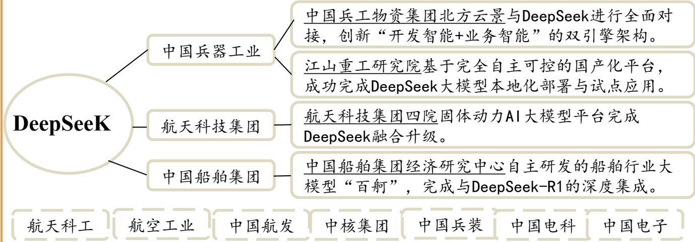

➢ 根据Mordor Intelligence测算，全球航空航天和国防中的AI市场在2025年产生了279.1亿美元收入，预计到2030年将达到426.7亿美元，预测期内复合年增长率为8.86%。国防领域AI市场的快速扩容有望驱动全产业链演变加速。

军工AI产业链大致可分为：

✓ 基础层-算力基础设施：整个军工AI体系的基石，为上层应用提供不可或缺的底层支持，核心构成包括云端训练、边缘推理、终端算力芯片。

✓ 技术层-算法与软件平台：技术层是AI的“大脑”，负责将底层的算力转化为具体的智能能力。核心构成包括大语言模型（LLM）、计算机视觉、自主决策算法等。

✓ 应用层-智能武器装备与系统：应用层是AI能力最终呈现的“面孔”，直接嵌入作战体系，形成新质战斗力，包括无人自主系统、智能指挥控制系统、基于AI的情报分析系统等。

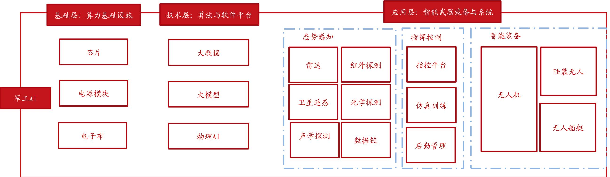

## 地面军用机器人：“机器狼” 重塑地面战争形态，产业有望迎来爆发

军用机器人指的是用于军事领域的具有某种仿人功能的自动机。进入21世纪以来，伴随着人工智能、信息通信等高新技术的飞速发展以及各种传感器的开发使用，军用机器人的功能日趋完备，智能化程度越来越高，机器人正在以一种全新的姿态走上世界军事舞台，或将从根本上改变战争形态。军用机器人分类标准包括控制方式、应用场景等。

➢ 根据控制方式，军用机器人可以分为：遥控、自动化、半自主、自主机器人。自动化是指由武器装备自动执行的一组相关功能，要求人类在自动序列之前或之后执行一系列操作以完成任务。自主指在没有人为输入或指导的情况下，武器装备可以在规定条件下执行编程操作，并且它具有一定的判断分析能力，可根据战场的状况做出决定。半自主的武器则具有有限的判断能力。根据国际公约，自主式军用机器人只能限于非致命性武器，如侦察、排爆、扫雷等。

➢ 根据应用场景，军用机器人可以分为地面、空中、水下、空间等军用机器人。

图表：根据应用场景分类的军用机器人
| 类型 | 应用场景 |
| --- | --- |
| 地面军用机器人 | 主要是指智能或遥控的轮式、履带式车辆，又可分为自主车辆和半自主车辆。地面军用机器人主要包括地面运输机器人、排雷排爆机器人、地面侦察机器人、地面微型军用机器人等. |
| 空中军用机器人 | 简称为UAV，主要执行战场侦察、监视图像、目标捕获、战场毁伤评估等任务。它能深入最危险地区搜集最新的实时战场情报，为精确打击武器指示目标，评估打击效果，起到侦察卫星、预警机无法起到的作用 |
| 水下军用机器人 | 分为有人机器人和无人机器人。水下机器人可以分为两大类：一种是有缆水下机器人，简称ROV；另一种是无缆水下机器人，简称AUV |
| 空间军用机器人 | 是一种低价位的轻型遥控机器人，可在行星的大气环境中导航及飞行，是实现空间操控自动化和智能化的使能手段之一，在无人及载人的空间科学探索活动中至关重要 |

地面机器人  

空中机器人  
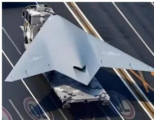  
空间机器人

水下机器人  
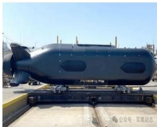

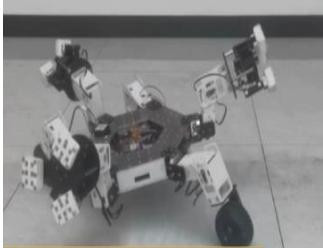

## 战场实际应用：

➢ 美国：美国陆军先后将部分先进地面机器人系统运用于阿富汗和叙利亚等战场中，其在侦察引导、地面巡逻和运输保障等作战行动中作用突出，有效加快美军的决策效率，提升了美军的作战能力。当前，美军正不断加强装备的智能化，重点发展排爆、运输、和火力打击等地面机器人，这些装备将配合美军作战，提升作战效率。

➢ 俄罗斯：俄罗斯依仗其雄厚的工业基础和技术实力加大对军用机器人领域的研究，结合实战经验，在作战机器人研究取得了极大进展。在叙利亚战场上，俄罗斯通过仙女座-D指挥系统指挥由6个平台-M履带式机器人、4个暗语轮式机器人、1个洋槐自动化火炮群以及数架无人机组成的机器人军团，对敌人开展了空地一体的人机协同联合作战，成功攻占“伊斯兰国”武装分子控制的拉塔基亚754.5高地。俄罗斯还在战场使用了地面无人作战车辆，比如BR-1无人地面车辆和BRG-1无人地面车辆，用于执行埋雷任务和伤员疏散任务。此外，炮兵部队还运用“海鹰”无人机引导“红土地”制导炮弹实现精准打击敌方目标。俄军持续开展智能装备研制和列装工作，计划至2025年将无人作战系统在武器装备中的比例提高到30%以上，并宣布将于2025年完成组建无人系统部队。

### 分工明确，效率倍增

图表：美国地面军用机器人实际应用

火力打击方面，美军主要有“利剑”及“魔爪”等机器人，可以对敌防御工事进行火力打击。

侦察监视方面，美军主要有“帕克伯特”机器人，可以24小时全天候和全地形执行情报侦察等任务。

后勤运输方面，美国有“奥德蒂斯”机器人，该机器人机动性能强，可以行走在山地之间进行战场物资的运输。

### 人机融合，加快决策

依据美地面机器人在阿富汗和叙利亚进行的战场评估，美军将继续在地面机器人上投入大量资金，提升机器人信息搜集和处理的智能化能力，改进地面机器人的自主性等系统

### 高度智能，应用广泛

美军将把人工智能技术运用于重型地面机器人的研发上，推动装备向智能化方向发展，着力开发自主性强、高度智能的重型多功能机器人

美军早已开展了对地面无人作战系统的研究，是研究地面无人作战系统最早，投入人力物力财力最多的军队，其多款先进的无人系统已经运用于实战。

## 战略规划方面：

2001年，美陆军提出“2015年实现1/3地面作战车辆为地面无人系统”的目标，有力推动了其小型无人车、班组任务支援系统等地面车辆的发展。2018年7月，美陆军成立未来司令部该司令部下辖8个跨职能团队，其中“下一代战车跨职能团队”主要负责未来战车项目的具体研发工作。2018年8月，美国国防部公布第八版《无人系统综合路线图（2017-2042）》，旨在指导包括无人地面车辆在内的无人作战系统的全面发展。2020年7月～8月，美陆军首次将重型机器人战车纳入作战部队单位，参加了科罗拉多州卡森堡的士兵作战试验，并在测试中取得了成功。

图表：美国RAS规划目标  
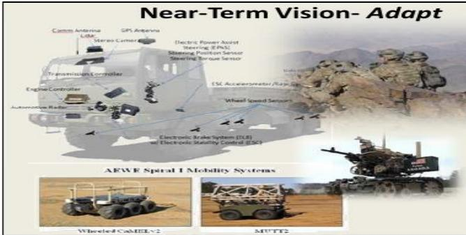

## 近期目标：

➢ 应用协同车队技术

➢ 减轻士兵单兵负荷

增强对威胁的战场非接触应对能力，提升态势感知

## 中期目标:

➢ 提升无人系统自主性技术

➢ 实现无人化货运投送能力

➢ 推动机器人成为“协作式队友”而非单纯工具

➢ 部署微型自主空中/地面系统，增强班排级与小分队的战场态势感知

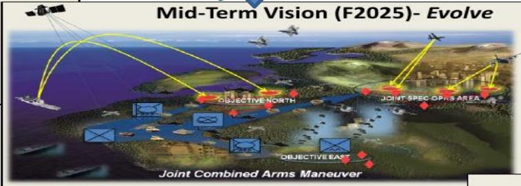

## 远期目标：

通过投入可扩展传感器、可扩展协同架构、士兵-机器人通信技术，以及基于机器学习技术的共享态势理解，实现空中与地面机动中无缝协作的有人-无人协同作战体系。

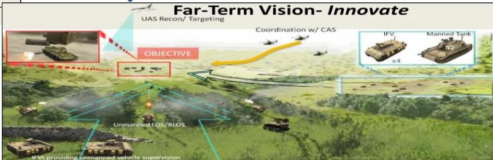

“机器狗”学名为四足机器人，是一种腿足式的仿生机器人。之所以叫“狗”是因为其四肢膝一致朝后与狗类似，该设计有助于‘狗形’机器人完成上楼任务，有更大，更能避免撞击的腿部活动空间。

• 与传统的轮式和履带式移动机器人相比，腿足式机器人凭借其腿部系统的仿生结构，通过自由选择与环境的接触点可以克服环境中的离散和非连续的地形特性。

• 与其他多足机器人相比，四足机器人具有适度的执行器数量和简化的腿部结构，在保证负载能力和稳定性的前提下，同时降低了成本。

基于以上优点，四足机器人的产业化应有望加速实现，并在地面战中发挥弥足轻重的作用。

图表：履带式、轮式、腿足式机器人关键性能对比
| 类型 | 地形适应性 | 机动性 | 成本 | 技术复杂度 | 人机协同性 | 续航能力 | 负载能力 | 环境破坏性 |
| --- | --- | --- | --- | --- | --- | --- | --- | --- |
| 履带式 | 适应性强。主要面向泥沼、雪地、沟壑等复杂地面，最大坡度35° | 机动性差，速度≤15km/h，转向半径大 | 价格中等，维护成本高 | 机械结构简单，需要防脱轨设计 | 协同性低，体积大、噪音大 | 续航时间长，支持外接电源，但能耗比仍高于轮式机器人 | 可负载超500kg重物，稳定运输 | 易碾压损伤路面，并造成扬尘污染 |
| 轮式 | 适应性较差，多应用于平坦硬质路面，最大坡度20$ | 机动性高，速度可达60km/h，零半径转向 | 价格较低，运营成本低 | 技术相对成熟，器并运用成熟驱动方案 | 人机协同性高，适用于结构化设计，可载人 | 能效比最高，续航时间可超12h | 负载能力中等，平衡重心条件下可运输重量约200kg | 环境友好，使用橡胶轮胎与静音设计 |
| 腿足式 | 适应性中等，可适用于楼梯、岩石等非结构化地形，最大坡度70° | 机动性适中，运动方向调整灵活但是速度较低 | 成本昂贵，关键部件价格高 | 技术复杂度高，多度同控制与实时运用动态平衡算法 | 任务协同性最优，可进行仿人动作，如开关标准门 | 续航不足4h，能耗比约为轮式机器人3-5倍 | 由于动态负载限制，其承载不超过50kg | 环境破坏性最低，选择性接触地面，噪音<50db |

➢ 战略层面：机器狗某种程度上代表了军事战斗力的发展水平，是新质生产力和新质战斗力的重要发展方向，是大国竞争的重要领地。

➢ 战术应用：早在2024年中柬“金龙-2024”联演中，机器狗就已经开始投入实战。包括15公斤级的“侦察狗”和百斤级的“战斗狗”。在24年底的全军合成训练出现了空降兵某部的空降无人战车与机器狼协同作战的场景。可以预见各类型智能化无人装备将协同搭配，深入融入侦察、控制、突入、打击等各个关键环节，大幅提高综合作战能力。

| 场景 | 技术成熟度 | 需求紧迫性 | 成本敏感度 |
| --- | --- | --- | --- |
| 边境巡逻 | ★★★☆ | ★★★★★ | ★★☆☆☆ |
| 危险排爆 | ★★★☆☆ | ★★★★☆ | ★☆☆☆☆ |
| 战场侦察 | ★★☆☆☆ | ★★★☆☆ | ★★★☆☆ |
| 后勤运输 | ★★☆☆☆ | ★★☆☆☆ | ★★★★☆ |

图表：我国演训中使用的机器狗  
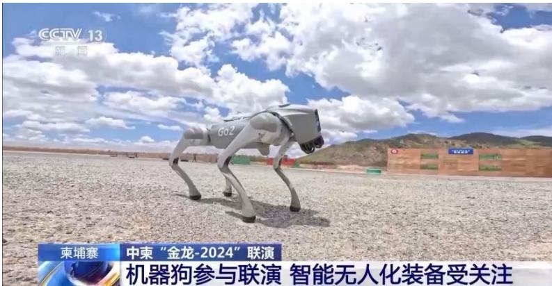

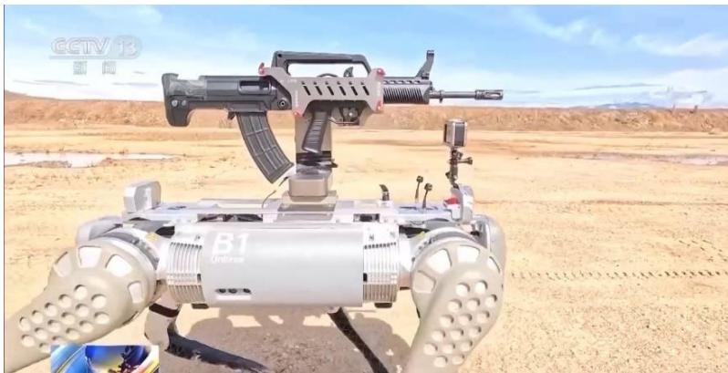

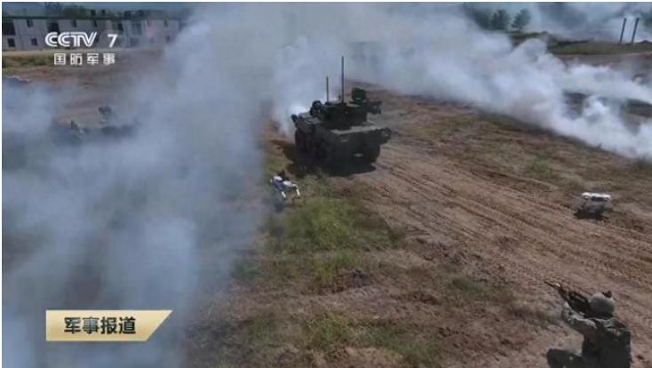

➢ 在15届航展上，由中国兵器装备集团自动化研究所有限公司自主研制的“机器狼”首次在中国航展现场进行动态展示。应用于军事领域的机器狼以作战分队形式展现。

➢ 通过智能无人集群的作战方式可以有效解决在城市市区山地高原等复杂场景中通信能力差、突击能力弱等问题为特战分队、步兵分队提供集群式的综合作战手段。

图表：机器狼助力提升战场能力  
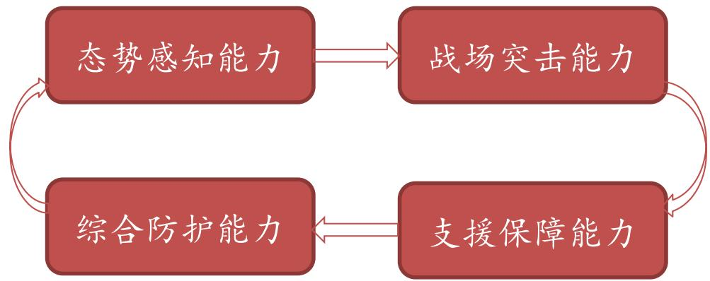

图表：机器狼群示意图  
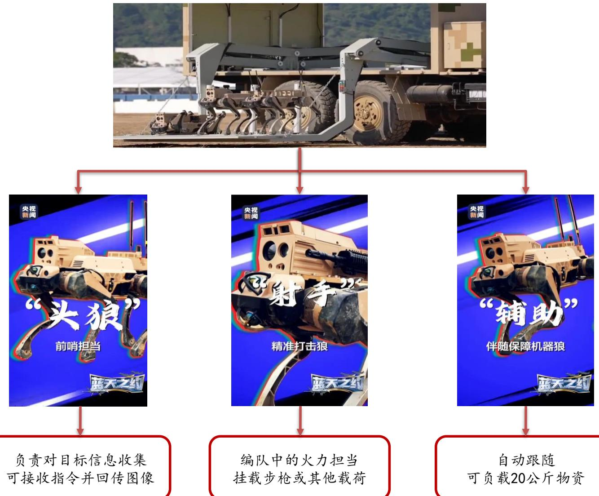

上游配套相对成熟，下游应用端待进一步开发。

上游：核心零部件

芯片

感知与智能

机器狗产业链

减速器

伺服电机

轴承

电池

## 中游：系统集成与整机制造

军用级

工业级

消费级

## 下游：应用领域

军用级

物资运输排雷排爆军事勘察边境巡逻

工业级安防巡检矿产勘查应急救援运维保养

消费级户外运动教育科研医疗保养实犬替代

## 新型精确制导武器：高弹性细分赛道，低成本为后续重点方向

据不完全统计，越战时期，投入精确制导武器的比例为0.2%，海湾战争时期为9%，到了沙漠之狐行动，这个比例就突增到75%，科索沃战争时期达到了90%。

根据美国空军报告，2014-2020年间美国在阿富汗、以色列、叙利亚战争中合计使用13.9万件制导武器，平均年使用量2万枚，其中2017年达到惊人的3.95万枚。主要武器包括联合制导攻击武器（JDAMs）、火狐导弹、远程制导火箭炮（GMLRS）等。

为应对战争消耗，2014-2020年间美国PGM采购金额从20亿美金激增至60亿。随着俄乌战争及巴以冲突的开展，美国仍将持续加强采购力度，预计2023-2025年将花费114亿美元采购PGM。

PGM采购量及在阿富汗、伊拉克及叙利亚战争中的使用情况  
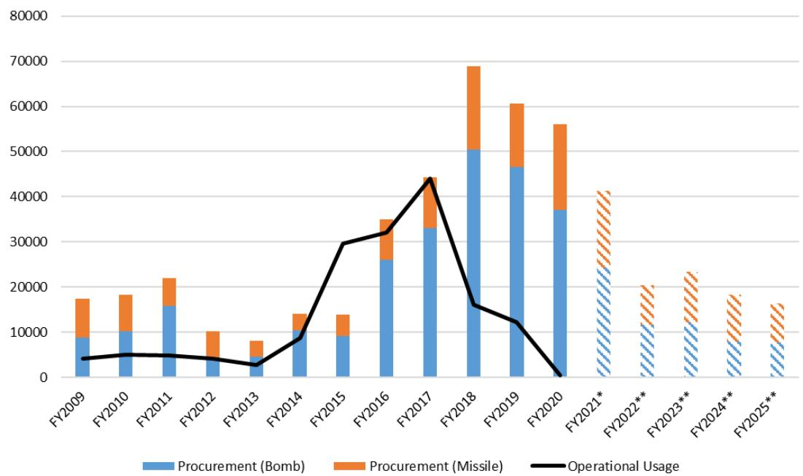

1998-2024财年美国PGM采购额（通胀调整后）  
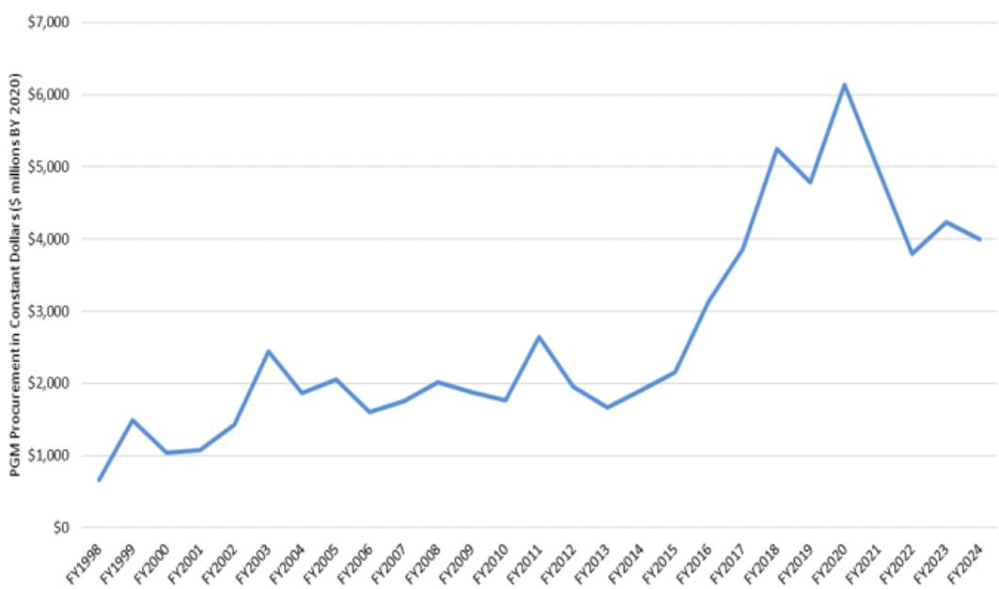

俄乌战争中弹药消耗量达到史无前例的高度。北约高级官员透露，在顿巴斯战役中乌克兰的炮兵每天要打掉6000-7000发炮弹，俄罗斯发射的火炮能达到4万-5万发/天。

现代战争就是消耗战，弹药战略储备意义重大。乌克兰“每日最低绝对需求量”为6000枚炮弹，但乌军每天只能发射2000枚炮弹，这也直接导致乌克兰被迫撤出阿夫杰耶夫卡。作为欧洲最大的弹药生产商之一，德国莱茵金属公司首席执行官阿明·帕珀费尔指出，要想让乌克兰炮兵压倒对手，西方每年提供给该国的炮弹数量不能低于150万发。

根据俄罗斯国防部2024年1月4日发布的通报，自俄乌冲突爆发以来，共有54个国家向乌克兰提供各类援助，援助金额为2030亿美元。乌克兰每年需要1000亿左右美元的外援，才能在这场冲突中与俄罗斯打成平手。

欧美意识到战储重要性，提高军火产能。外界一度认为俄乌冲突会非常短暂，但如今西方各国都已认清了加快弹药生产的重大意义。根据《青年参考》美国2023年将155毫米榴弹炮炮弹的生产列为最优先事项，目标是在2024年实现月产8万发。德国莱茵金属公司2023年宣称自己每月能生产4万发炮弹，产能是2022年的4倍。法国内克斯特系统公司每年能够生产数以万计155毫米口径炮弹， “几乎已经达到产能上限”。

美国2024财年国防部要求306亿美元用于弹药及导弹采办，金额较上一年增加了24%；占全部武器系统采办及研发经费的9.7%，较23年上涨0.9pct。其中，常规导弹56亿美元，战略导弹73亿美元，战术导弹171亿美元，技术开发6亿美元，以确保工业基地生产联合部队所需产品的稳定性。

美国4月23日通过千亿对外援助法案，其中包含610亿对乌克兰的援助。根据法案内容，这笔钱中将有232亿美元用于填补对乌武器援助给美国武器库存造成的空缺；113亿美元用于资助美军在欧洲执行任务；138亿美元用于美国政府向军火商采购援乌先进武器和防御装备。

2020-2024年美国导弹和弹药国防预算申请（单位：10亿美元）  
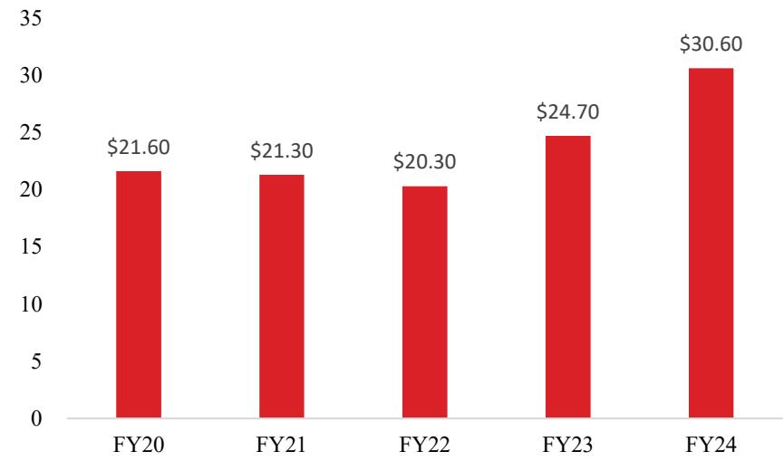  
2024年美国战术导弹采办费171亿美元（单位10亿美元）

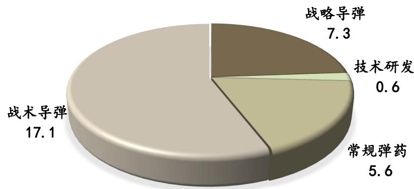

地缘政治冲突扰动，我国面临严峻挑战。菲律宾在南海不断挑衅，菲防长命令菲军启动“全面群岛防御规划”战略；印度在藏南边境线制造冲突，并称藏南是印领土；台独分子活动愈发猖獗，美国与台往来频繁；美国驱逐舰频繁现身南海。我国领土主权安全不断受到挑战。同时美国大肆宣扬“中国威胁论”并对我国进行多维度制裁，我国面临严峻挑战，武器战略储备具有实际意义。

精确制导武器是我国形成反介入/区域拒止能力建设的重要环节，具备战略意义。远火覆盖范围15km-500km，导弹打击范围可超过1.1万km，结合我国现有的战机、驱逐舰等平台，打造了海陆空天地一体化的防御体系，形成了对近海、临海的反介入和区域拒止能力。

实战演训趋向常态化，消耗量有望加大。2024年3月7日下午，总书记在十四届全国人大二次会议解放军和武警部队代表团全体会议上强调“全面加强练兵备战，提高人民军队打赢能力”、“深入推进实战化军事训练，深化联合训练、对抗训练、科技练兵。加强军事力量常态化多样化运用，坚定灵活开展军事斗争，塑造安全态势，遏控危机冲突，打赢局部战争。”

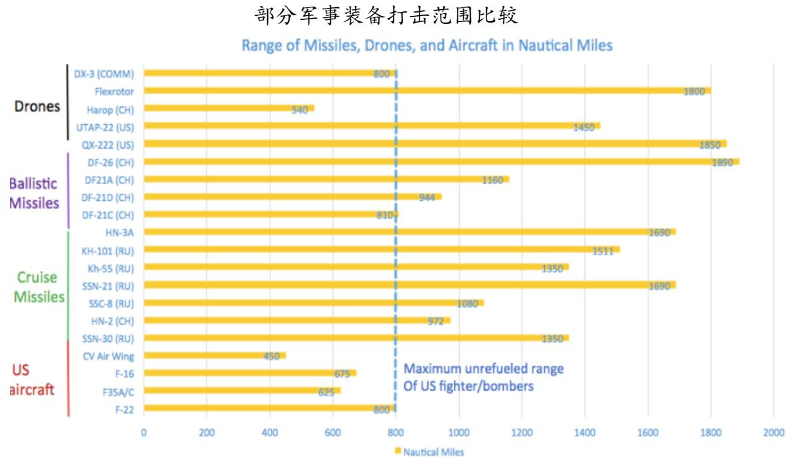

我国武器打击范围示意图（部分）  
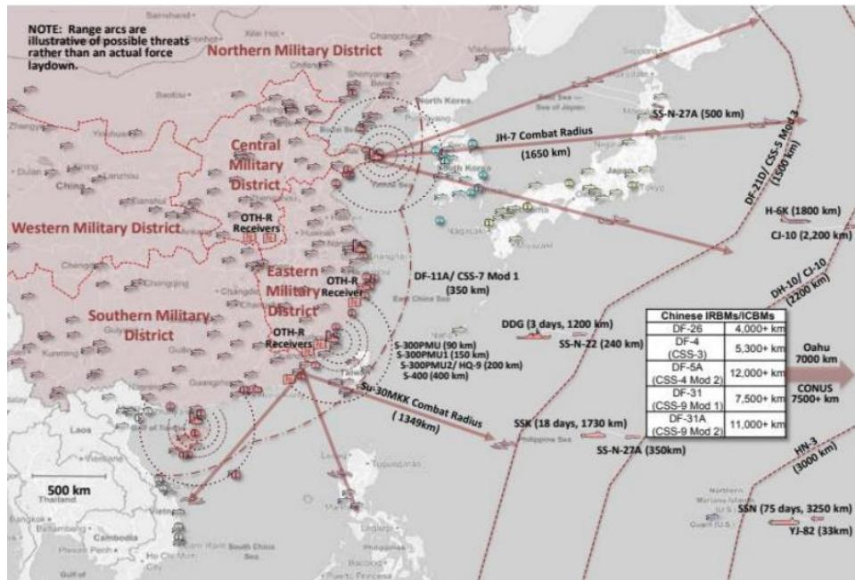

➢ 俄乌战争中“改变战争走向的利器”：2022年6月，美国援助的第一批“海马斯”系统抵达乌克兰战场，开启了“远火洗地”模式。根据俄乌双方公布的战报，“海马斯”凭借其机动性强、反应速度快、自动化程度高、打击精度高等优势，配合北约强大的情报支持，多次炮轰俄军后勤站、部队集结点、重要指挥部以及后勤补给线，让俄军吃尽苦头，曾一度被乌克兰誉为“改变战争走向的利器”。

➢ 美国或基于三次对外战争的经验对未来战场远火的重要作用做出判断，自2018年起大幅提高制导火箭弹（GMLRS）采办费，连续7年保持在9.3亿美元以上，2023年采购总额达13.2亿元创下历史之最。2024年美国军费预算中GMLRS占10.3亿美元（含RDT&E费用），占弹药系统总经费3.4%。

GMLRS成为美陆军最核心制导弹药。2003年美国发动伊拉克战争以后，GMLRS占比陆军PGM采办总额比例保持持续增长势头，2021年占比达72%。

➢ 美国积极储备远火，或许暗示了未来地面战争的趋势为低成本火力压制，这也为我们发展地面装备带来启发。

2018年起美国大幅提高GMLRS采购费用（不含RDT&E费用）

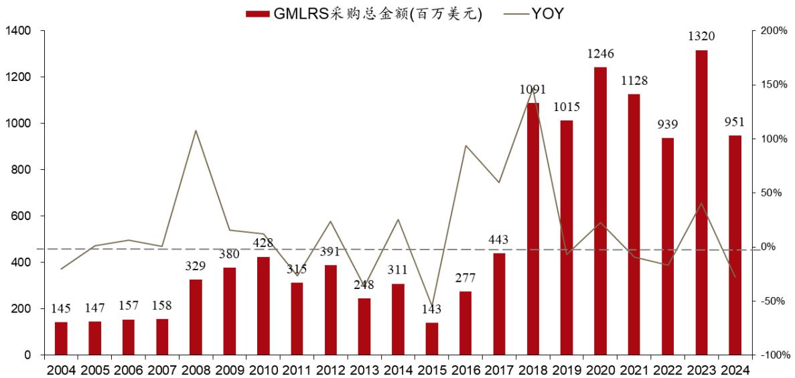  
GMLRS采购费占美陆军PGM采购总额比例总体呈增长态势

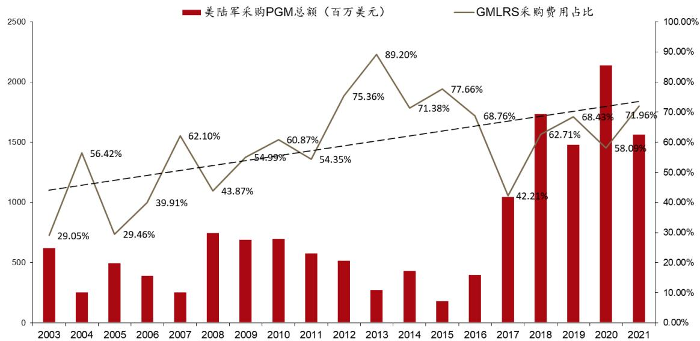

#### 内需：低成本化是国内列装方向，远火是低成本精确制导核心

陆军装备部在2021年8月发布《关于加快推动陆军装备高质量高效益高速度低成本发展的倡议书》，强调要坚持“以低成本为导向的高质量”；远火火力从境内覆盖周边地区，具备战略威慑意义，有战略储备需求。

#### 外贸：地缘冲突或推动远火外贸高增，我国有望把握历史机遇

##### 需求端：远火是军贸明星产品，实战效能已得到验证

全球军费高涨带动军贸需求：23年全球军费支出达2.39万亿美元，增长了6.19%（较22年+3.18pct），为近5年最高增长率。

地缘冲突推动军贸增长：乌克兰进口增长，23年同比增长44%，达40.1亿TIV，成为全球最大的军贸进口国，份额为14%。其中19-23年乌克兰导弹及火炮进口量占总需求的46.8%；中东地区局势复杂，军贸需求强烈。

##### 供给端：我国远火具备竞争优势，有望持续开拓市场

俄罗斯受制于战场需求，出口转向内：19-23年俄罗斯军贸出口147.6亿TIV，较上期减少52.5%，军贸供给出现缺口。

我国军企生产研发自主可控，技术水平世界前列，军贸政治附加条件少，与客户建立长期稳定关系。19-23年，累计出口81.2亿TIV，占全球军贸出口5.8%，居军贸出口榜榜四位置。

我国远火具有竞争优势：我国远火谱系众多，可应对不同需求。目前我国远火外贸型号主要有兵器集团生产的远程火箭炮AR-2、AR-3 和SR-5，“火蛇”70A与“火蛇”90A航空制导火箭弹，“火龙”、“神龙”BRE 系列火箭弹。航天科工集团的“SY”系列火箭炮，航天科技集团的“A”系列、“WS”系列火箭炮也是市场主要竞争者。从效能上讲，我国远火可达500km射程，处于全球领先。

联合演训中东部战区陆军远火对台湾海峡东部实施打击

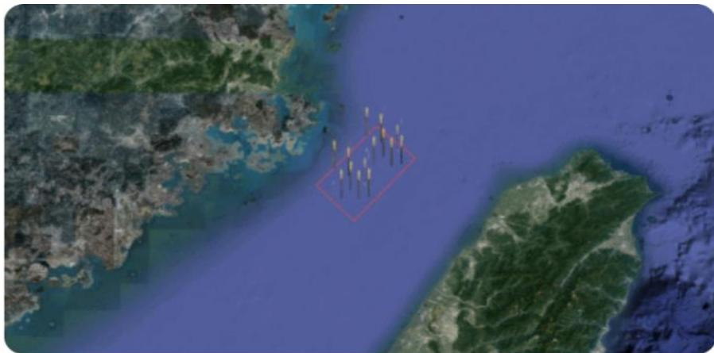

2014-2023年中国军贸出口量  
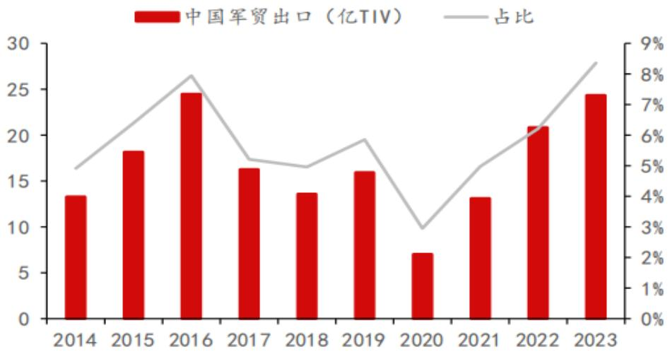

航空制导炸弹是空对地攻击的主要作战装备，在普通航空炸弹上加装精确制导装置和空气动力控制装置后制成的一种精确打击弹药，既保留了普通炸弹结构简单、价格便宜、使用方便等特点，又具有精度高、作战效费比高的优势，获得世界各国青睐与大力发展和装备使用。其主要特点有：

• 精度高：航空制导炸弹精度较普通炸弹高得多，如美国“宝石路Ⅲ”型CEP可达到1米；

效费比高：航空制导炸弹较巡航导弹价格便宜得多，以美空军2024采购计划看，JDAM单枚价格约7.5万美元，不足JAGM空地导弹（33万美元/枚）的四分之一，约为“地狱火” （75万美元/枚）的十分之一；

• 可防区外发射：航空制导炸弹可利用弹上探测系统提供的目标信息修正弹道，可以在敌方防御火力圈之外实现远距离攻击目标；

• 应用范围广：航空制导炸弹可携带多种战斗部，满足不同作战需求。包括反坦克弹、破甲弹、钻地弹、电磁脉冲弹、石墨弹、子母弹等等。

航空炸弹是近代几次局部战争中使用数量最多的空地武器，制导炸弹的比例也逐步提高。美国基于其先进的弹药技术、强大的隐身平台和航母编队，在越南战争、海湾战争、叙利亚战争等近几次局部战争中大量使用制导航空炸弹，发挥了不可替代的作用，完成了既定作战任务。

近几次局部战争中空地武器使用情况
| 作战行动 | 时间 | 航空炸弹占比/(%) | 制导炸弹占比/(%) |
| --- | --- | --- | --- |
| 海湾战爭 | 1991年 | 51 | 8 |
| 科索沃战争 | 1999年 | 96 | 35 |
| 阿富汗战爭 | 2001年 | 90 | 56 |
| 伊拉克战爭 | 2003年 | 95 | 68 |
| 叙利亚战争 | 2011年 | 俄罗斯使用大量的KAB-250/-500/-1500系列制导炸弹合FAB-500无制导炸弹 |  |
| 利比亚战爭 | 2011年 | 美军B-2轰炸机投放了45枚900kg级JDAM攻击利比亚空军基地 |  |

JDAM航空制导炸弹  
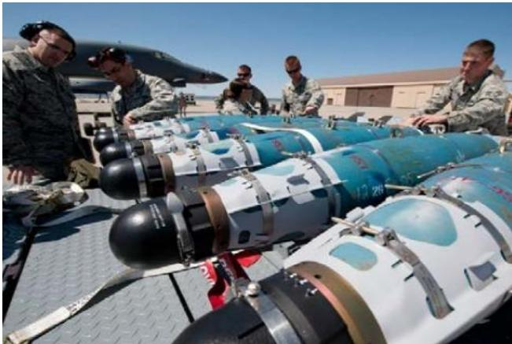

从国外航空制导炸弹发展情况类比推演产业趋势，我们认为模块化趋势+新型号量产或为行业带来扩容机遇。

## 模块化趋势：

航空制导炸弹是在普通航空炸弹上加装精确制导装置空气动力控制装置后制成的一种精确打击弹药，近年来制造组件模块化成为趋势。美国“JDAM”制导炸弹就是在常规炸弹的尾翼中增加了GPS／INS制导装置，既提高了弹药的打击精度，又大大减少了开发新武器的高额费用，使精确打击发生革命性的变化。

早在俄乌冲突开始之前，俄罗斯就已经为航弹研制了“通用规划和修正套件”（滑翔翼和控制系统）。俄罗斯改装后的FAB-1500航空炸弹部署在乌克兰战场，显著提高了前线航空兵的作战能力。配装“通用规划和修正套件”后，航空炸弹变为打击精度在5米内的高精度弹药。而普通炸弹的投射范围通常为几十米，需要投射20-25枚普通炸弹摧毁的目标，使用配装“通用规划和修正套件”的炸弹仅需 1-2枚，显著提高了航空兵作战效能。

2024年，改造版FAB-1500航弹的产量预期将翻一番。同时俄罗斯国防部下令恢复生产FAB-3000航弹，并为该炸弹研制“通用规划和修正套件”，如此，空天军最重的常规炸弹将变成高精度武器。美国和其他北约国家也纷纷效仿，我国航道制导控制系统模块化改造也有望加速开展。

## 新型号批产：

美国大幅提高航弹采办费，我国内需外贸双轮驱动型号订单有望持续下达：美国2023、2024年JDAM航弹的采办费分别为3.28亿、2.06亿，为2022年的3.37倍、2.12倍。在当前地缘冲突加剧的情况下，我国受内需及外贸双轮驱动，产品批产订单有望持续下达。

低成本和精确制导兼顾，MEMS惯导新型号有望定型量产：惯性导航具有自主性、高隐蔽性和强干扰性的优点，但是价格较高，而新型的MEMS惯导系统具有体积小、重量轻、环境适应性强、价格低、易于大批量生产的优点，完美兼顾了低成本及精确制导要求。当前临近“十四五”末，前中期研制的相关新型号产品有望加速定型鉴定，进入批产阶段。

生产线上的FAB-1500航弹  
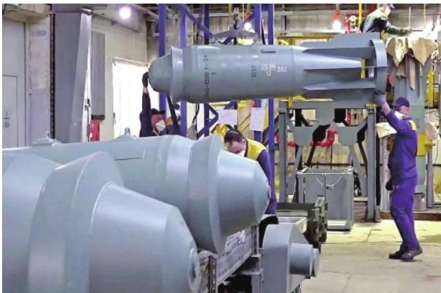

FAB-3000和FAB-1500航空炸弹共线生产  

## 深海科技：国家战略新引擎驱动，深海建设迎1-10跨越式发展

2025年《政府工作报告》首次提及“深海科技”，并将其对标“商业航天”、“低空经济”等新兴产业，充分展示了国家发展深海科技的决心及战略定力。深海科技涵盖深海防护、深海探测、深海资源开发等内涵，具有万亿级市场容量。十五五期间，深海科技产业1-10有望加速展开。

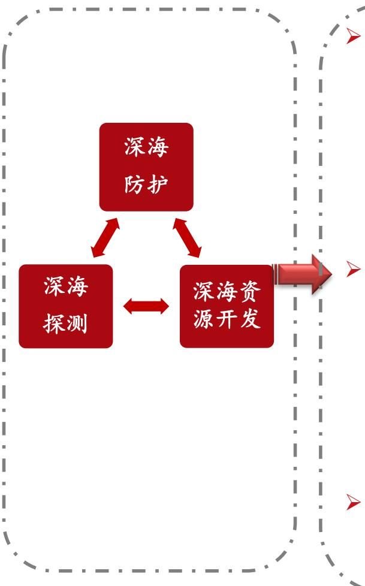

深海防护：水下是重要“新域新质”领域，是大国地缘战略竞争和军事竞争的主战场。我国海域有众多耳目，“水下国门洞开”问题长期存在。

深海探测：深海探测不仅有助于人类更好地理解海洋和地球的奥秘，还蕴藏着丰富的资源和战略价值，对科学研究和经济发展具有重要意义。

深海资源开发：深海资源包括海底矿产资源、生物资源以及能源等。

## 紧迫性：

➢ 深海是可与海面、空、天等作战空间相比拟的争夺制海权的重要作战空间，我国深海建设起步较晚，较美国有一定差距。

➢ 美国"蓝色经济计划"、欧盟"蓝色增长战略"、日本"海洋立国战略"等国家战略的推出，凸显深海科技的战略价值。

## 爆发性：

➢ 全球深海科技市场规模预计2025年突破5000亿美元，年均增长率15%以上。产业空间持续扩容。

➢ 我国深海科技不断突破，深海建设进入实操阶段，产业1-10有望加速突破。

## 持续性：

➢ 从“863”计划、到“十一五”再到“十四五”持续布局。实现了从探索到领先的跨越。

➢ 短期瞄准2027、中期瞄准2035、远期瞄准2050。

## 军民融合性：

➢ 深海领域具有天然的军民融合特性，军民两用技术占比高、互用性强。军民一体推进深海前沿科技攻关、高端装备制造、产业链发展。

➢ 深海科技向海洋经济持续辐射,深海科技的内涵不断丰富。

➢ 水下攻防对抗体系是指跨域作战单元按照统一部署，综合运用探测、指控、打击、保障等作战要素，形成执行水下攻防作战任务的有机整体。既是动态、开放的复杂网络，又是水下战场探测感知、信息传递、指挥控制、决策交战、综合评估等全过程相关的作战资源有序集合。这一体系内的各分系统在功能上相互作用、性能上相互补充。

➢ 水下攻防对抗体系通过潜艇平台快速、有效地组织执行各种水下作战任务，再利用水声数据链将多种作战平台和信息节点有机联合。通过建立水下信息优势，实现水下战场态势感知和高度共享，快速指挥先敌行动和部队行动，执行联合水下打击任务，封锁敌潜艇进出水道。

### 综合态势感知能力

能够综合运用各种固定和机动侦察预警手段，发现、跟踪、识别和报知水下威胁目标，及时准确地提供水下目标情报信息

### 指挥控制能力

建成多手段并用、节点联接紧密、信息传输快捷、辅助决策高效、覆盖范围广泛的指挥网络与控制系统

### 隐蔽突防和打击能力

通过提高水下平台的综合隐身性能，使先进水下兵器能够对敌方的航母编队、港口基地等重要目标构成有效威胁

### 水下防御作战能力

运用多种反潜、反水雷、反水下特种作战手段及时可靠地消除水下威胁；

### 水下信息作战能力

对敌方的潜艇和水中兵器实施信息对抗，干扰、欺骗、压制、摧毁敌方的水下警戒系统和水下网络信息系统

### 综合保障能力

实现对全球重要海域的全时环境测量监测，导航定位精度和水下目标特性数据满足水下长时间航行和武器使用要求，具备深远海援潜救生能力

水下攻防体系示意图  
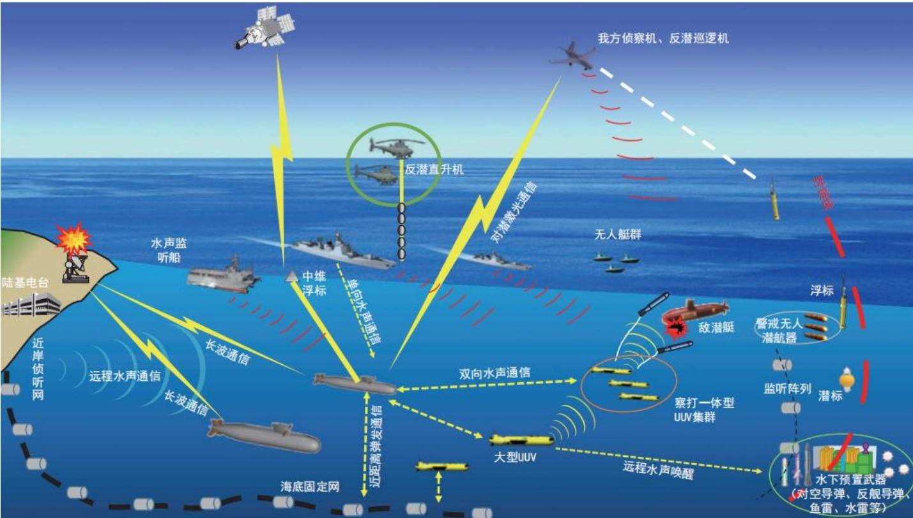

水下攻防体系主要由机动装备、固定装备、基础设施三部分组成。依靠信息保障网络体系，形成侦察预警能力、指挥控制能力、隐蔽突防和打击能力、水下防御作战能力、水下信息战能力、综合保障能力，打造以核潜艇为主、攻击型UUV为辅的水下攻防对抗能力。

### 机动装备

有人装备是水下攻防体系的指挥中枢：以核潜艇为核心，包括反潜水面舰船、潜艇、反潜机等，负责水下攻防体系的整体侦察预警、指挥决策、兵力投送、火力打击等，还可为无人装备提供能源。

无人装备是水下攻防体系前沿作战终端：主要包括无人水面艇、水下无人装备和水中兵器，重点执行情报监视侦察（ISR）、跟踪、反潜艇、反水雷、隐蔽打击等任务。

### 固定装备

主要指水下预置武器系统，一般提前部署在关键海区，长期在海底待机；在战时唤醒，对敌方舰艇进行导弹或鱼雷打击。按照布放深度分为深海预置装备和浅海预置装备。

### 基础设施

分为水下监听网络系统、水下声学通信网络、水下导航网络、浮标潜标网络、水下充电站等。浮标与潜标网络提供海域水上、水下的环境信息，并可作为导航、通信的中继节点。

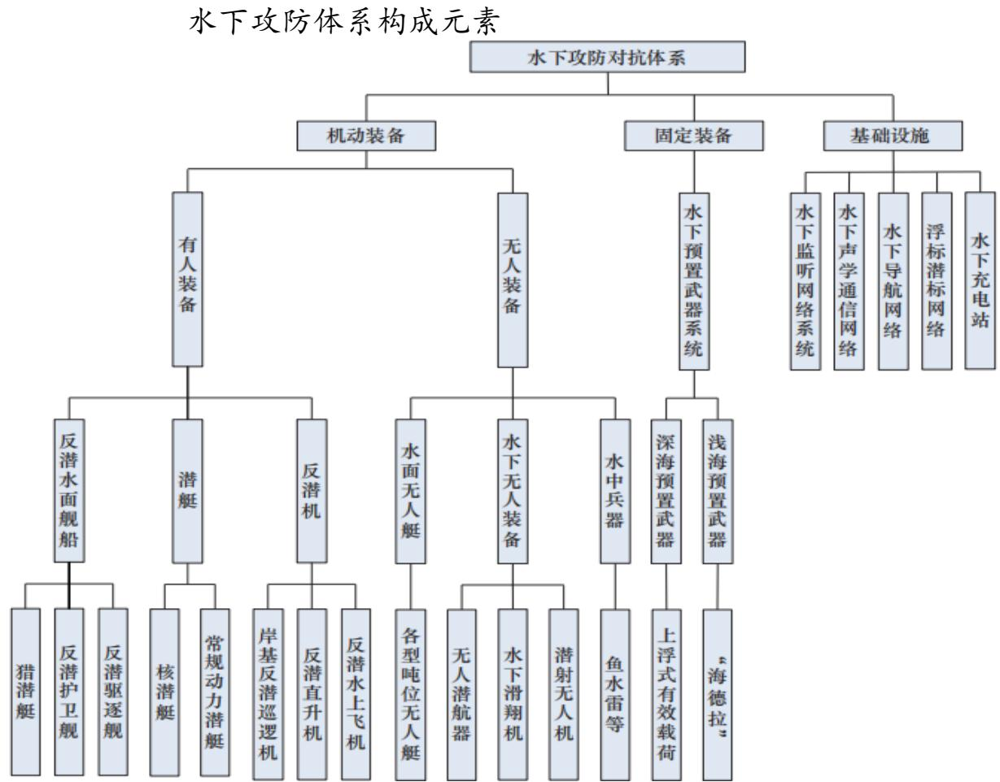

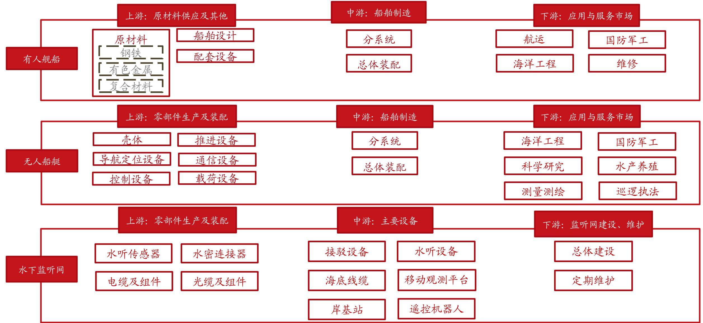

## 投资建议及风险提示

建议关注：新质战斗力与新质生产力合力打造行业增长极，军贸有望成为第二增长曲线

新质战斗力：规模化订单下达后进入中长期发展道路。

1）先进战机：主机厂-中航沈飞、中航西飞、中航成飞；航发-航发动力、航发科技、航宇科技；隐身材料-佳驰科技、华秦科技、光启技术；无人机-中无人机、航天彩虹、洪都航空；

2）数据链：七一二、海格通信、新劲刚；

3）军工AI：算力基础-[[01-公司/菲利华|菲利华]]、新雷能、成都华微；算法模型-[[01-公司/中科星图|中科星图]]、拓尔思、能科科技；应用层-兴图新科、华如科技、观想科技;

4) 作战机器人：晶品特装、光电股份、建设工业；

5）精确打击武器：远火-中兵红箭、北方导航、长盈通；航弹-广联航空、芯动联科；火工品-国泰集团、北化股份、国科军工；

6）反无系统：探测-四川九洲、航天南湖、四创电子；激光武器-锐科激光、联创光电、长光华芯；微波能武器-国光电气、六九一二；

7）水下攻防：电磁装备-湘电股份、王子新材；水下探测-中国海防、中科海讯、集智股份；水下材料-西部材料、金天钛业。

军贸：全球军贸格局重塑，我国有望把握历史机遇。

1）精确打击武器：中兵红箭、高德红外、国科军工；

2）军机整机：主战型号-中航成飞、中航沈飞、洪都航空；无人机-航天彩虹、中无人机；

3）雷达系统：国睿科技、航天南湖。

风险提示：国际局势变化风险，客户订单节奏变化风险，技术研发风险等。

### 关联阅读

- [[02-主题/商业航天]] — 与军工产业链高度交叉，共享上游元器件和材料供应商
- [[02-主题/低空经济]] — 无人机军民融合的重要应用场景
- 关注标的：[[01-公司/菲利华|菲利华]]（军工AI算力基础）、[[01-公司/中科星图|中科星图]]（军工AI算法模型）

> ⚠️ **说明**：本报告中 52 只推荐标的中，目前仅 2 只（菲利华、中科星图）在知识库中有公司页。其余 50 只均为纯文本，可择机建页后回链。

---

## 分析师声明

作者具有中国证券业协会授予的证券投资咨询执业资格，保证报告所采用的数据和信息均来自公开合规渠道，分析逻辑基于作者的职业理解，本报告清晰准确地反映了作者的研究观点，力求独立、客观和公正，结论不受任何第三方的授意或影响。研究报告对所涉及的证券或发行人的评价是分析师本人通过财务分析预测、数量化方法、或行业比较分析所得出的结论，但使用以上信息和分析方法存在局限性。特此声明。

### 免责声明

本研究报告由方正证券制作及在中国（香港和澳门特别行政区、台湾省除外）发布。根据《证券期货投资者适当性管理办法》，本报告内容仅供我公司适当性评级为C3及以上等级的投资者使用，本公司不会因接收人收到本报告而视其为本公司的当然客户。若您并非前述等级的投资者，为保证服务质量、控制风险，请勿订阅本报告中的信息，本资料难以设置访问权限，若给您造成不便，敬请谅解。

在任何情况下，本报告的内容不构成对任何人的投资建议，也没有考虑到个别客户特殊的投资目标、财务状况或需求，方正证券不对任何人因使用本报告所载任何内容所引致的任何损失负任何责任，投资者需自行承担风险。

本报告版权仅为方正证券所有，本公司对本报告保留一切法律权利。未经本公司事先书面授权，任何机构或个人不得以任何形式复制、转发或公开传播本报告的全部或部分内容，不得将报告内容作为诉讼、仲裁、传媒所引用之证明或依据，不得用于营利或用于未经允许的其它用途。如需引用、刊发或转载本报告，需注明出处且不得进行任何有悖原意的引用、删节和修改。

| 类别 | 评级 | 说明 |
| --- | --- | --- |
| 公司评级 | 强烈推荐 | 分析师预测未来12个月内相对同期基准指数有20%以上的涨幅。 |
| 推荐 | 分析师预测未来12个月内相对同期基准指数有10%以上的涨幅 |  |
| 中性 | 分析师预测未来12个月内相对同期基准指数在-10%和10%之间波动。 |  |
| 减持 | 分析师预测未来12个月内相对同期基准指数有10%以上的跌幅。 |  |
| 行业评级 | 推荐 | 分析师预测未来12个月内行业表现强于同期基准指数。 |
| 中性 | 分析师预测未来12个月内行业表现与同期基准指数持平。 |  |
| 减持 | 分析师预测未来12个月内行业表现弱于同期基准指数。 |  |
| 基准指数说明 | A股市场以沪深300 指数为基准；香港市场以恒生指数为基准，美股市场以标普500指数为基准。 |  |

### 方正证券研究所

专 注 专 心 专 业

北京市朝阳区朝阳门南大街10号兆泰国际中心A座17层长沙市天心区湘江中路二段36号华远国际中心37层

上 海 市 静 安 区 延 平 路 7 1 号 延 平 大 厦 2 楼深圳市福田区竹子林紫竹七道光大银行大厦31层

广州市天河区兴盛路12号楼隽峰院2期3层方正证券