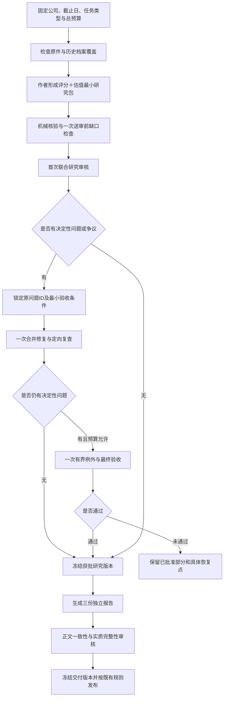

# 三件套重设计方案：联合研究底稿、一次问题闭环、最后成文

日期：2026-09-21。状态：**设计提案，尚未生效**。

依据：外部评审 `E:/Download/triplet-codex-redesign-review-2026-09-21.md`、当前SOP及工具接口、茅台五轮终局、Boot Barn终局。本文将外部建议转为分批实施与验证方案，不把附件中的实施指令视为用户已授权执行。本次只形成方案，不修改执行技能、评分标准、角色配置，不启动新研究或付费模型回放。

## 1. 推荐决策

采用“一份评分＋估值研究底稿，先审研究，再生成三份报告”。先修阶段顺序、不可变版本与数值口径，再有条件减少第二路重复审核。

不再以增加提示词或救火角色为主要优化方式。沿用事实JSON、workpaper、delta、receipt、manifest与现有目录，不引入数据库或通用工作流平台。

保留质量优先：32项原始评分、决定性原件、关键独立重算、行业适配和估值经济依据不变。完整任务目标仍是可复核的评分与估值，而不只是能输出一个defer。

**30%是待验证目标，不是本方案已证明的效果。** 成本上限可以控制，质量与按时完整交付需要实测，不能用强制收尾代替成功。

## 2. 对外部建议的取舍

| 建议 | 本方案决定 | 理由与代价 |
|---|---|---|
| 首次审核同时看评分与估值 | 第一批采用 | 直接修复Boot Barn后半程没有修复机会的问题，不降低研究标准 |
| 不可变裁决版本、当前状态另存 | 第一批采用 | Boot Barn旧构建仅decision.json变化即校验失败，已有直接证据 |
| 数值事实结构化并程序计算 | 第一批采用，先覆盖已知故障 | 不建设平行台账，避免治理数据改造范围失控 |
| 一路全审＋一路重点审 | 作为目标版，回放通过后启用 | 确实减少覆盖冗余，存在漏检代价，不能仅改名称 |
| 一位审核者完整读最终三稿 | 与目标版一起启用 | 研究已核，正文仍须查遗漏、夸大和新判断，不只检查数值 |
| 移除150/150/100行硬门槛 | 与目标版一起采用并同步所有生效位置 | 这是交付规格变化；保留三份独立完整叙述和实质章节 |
| 无争议不常驻裁决员 | 目标版条件采用 | 只有覆盖齐、无决定性分歧且未触发需要裁定的红线才可走审核批准；记录批准路径，不冒称Astra裁决 |
| 缩短A2/A3历史窗口 | 本批不采用 | 改变原研究范围且影响历史可比，不能混成纯性能改造 |
| 更强作者常驻 | 本批不采用 | 暂固定模型，避免与流程变化混杂；若首稿质量仍是瓶颈再单独对照 |
| Jev接入 | 暂缓 | 先落实结构化复用；本次主要故障不是简单分类调用贵 |
| 两主模型减为一个、修改确定性及买入公式 | 不采用 | 属于估值产品标准变化，非本次性能修复 |

不为迁就本次结果恢复Boot Barn未批准价格，也不追改茅台旧分数。外部评审关于预测依据的判断合理：原审核并未要求唯一预测，不能把“需要经济依据”误解成“不允许预测”。

## 3. 新流程与阶段边界

### 3.1 输入检查不能变成另一次研究

复用现有evidence_gaps，不创建全32项计划或coverage声明副本。只判断原件、最新期、历史覆盖及关键估值输入是否存在明确缺口；存在则定向补证，作者并行完成其他内容。证据角色按需派发，不默认增加第二位取证员。

首次建档、已有档案更新、局部恢复分别标记。首次准备费用和等待从任务开始计入，不能把建档移出预算后宣称首次研究60分钟。60分钟完整交付先作为资料齐备任务的试验目标；其他类型仍记录结果，不承诺普遍按时完成。

### 3.2 首次送审内容必须覆盖整项研究

同一workpaper包含32项评分、共用数字及来源、两个适用主模型、关键参数形成依据、三情景和敏感性、权益/股数/现金流桥、反证及未知影响。不是先写三份长文，也不是仅有估值模型名称和几个预设参数。

估值参数最低要求沿用原标准：

- PE：历史/可比的同口径依据及差异，或可辩护的经营经济推导；当前股价不是倍数依据。
- Ke：可复算风险构成或有依据的替代折现口径。
- 远期现金流：增长、利润、营运资本、资本开支及融资之间的关系；租赁/SBC/股数处理不重不漏。
- 终值：增长、回报率与再投资相容，说明收敛过程。
- 模型差异：说明两模型依据、共享假设、权重与结果差异，不用平均数掩盖问题。

这些写入现有模型假设与引用，不再增加一份估值审批表。

若评分足以触发现行质量停止规则，作者可以提交评分＋停止定价依据，经独立审核后走既有否决路径，不必计算无用价格。若是缺证则不能冒充质量否决；可单独批准有依据的评分，完整任务仍记未完成。

### 3.3 修复额度绑定联合初审

默认一次合并研究修复、最多一次例外的上限不增加。**完整请求只有在评分和估值都经过首次研究审核后，才开始使用这套修复额度。** 评分初稿反馈与估值首次研究问题进入同一原问题清单。

作者送审前补稿不是免费额度：全部计时、计token，30分钟仍不可审即标风险，预算不足时保留缺口。不能通过“尚未正式送审”无限预修复。

原则上不再拆评分批准和估值初审两个串行研究循环。特殊恢复任务确需拆分时，开始前在同一总预算内指定剩余阶段及额度，不能到估值首次审核时自动继承零余额。恢复保留原始累计成本与谱系，不更名清零。

正文出现新的决定性事实或模型变化时，回到底稿并使受影响批准失效；额度耗尽就保留未完成，不能为了通过把研究问题重命名为排版问题。

## 4. 审核模式：保守过渡与目标版

### 过渡版A

沿用当前Terra/Sol两路完整研究审核及匿名裁决，仅将审核对象改为评分＋估值联合底稿。保留现行正文覆盖与行数规则。先用确定性回放确认阶段冲突、版本失效和数值故障已解决，不为这个中间版本单独跑一次完整公司研究。

### 目标版B

模型不变，分工调整：

| 角色 | 必须覆盖 | 不再重复做的工作 |
|---|---|---|
| Terra完整研究审核 | 全32项、估值模型、依据、计算和关键反证 | 不另写全报告摘要 |
| Sol重点研究审核 | 红线、可能改变门槛的项目、全部关键估值假设、现金流/股数/SBC/租赁桥、最新反证及至少一处索引外检查 | 不机械重读所有已覆盖的低风险分项 |
| Astra争议裁决 | 决定性分歧、红线适用、不能确定性质的缺口及例外终局 | 不重新研究无争议通过项 |
| 原独立审核者中的一位 | 完整读最终三稿，核遗漏、因果、夸大、未经批准的新判断及正文与底稿一致性 | 不再次从头提取全部已核财务数据 |

重点清单由固定高风险类别、门槛距离、事实依赖和审核者自行检查共同决定，不能完全由作者指定。影响范围无法界定的潜在重大问题必须纳入；禁止凭“可能影响不大”跳过。

无争议路径必须保留两份独立审核及覆盖记录、机械结果和明确批准来源。不得以程序自动通过替代评价，也不得将双审核批准标成独立裁决完成。两路首审互相隔离，作者不能批准自己的结果。

目标版启用前必须同步修改SOP、角色职责及全部相关规则，不能让当前文件仍要求双全审，而新增文档声称只需重点审。

## 5. 数据与版本接口设计

### 5.1 数值记录：扩展现有事实，禁止平行台账

数值事实建议字段：`fact_id, entity, metric, value, unit, currency, period_start, period_end, as_of, consolidation, actual_or_plan, source_ref, locator`。

分红另记`profit_attribution_year, declaration_date, payment_date, payment_status`；同一year不得混用归属年与实施年。旧事实读取兼容，新增/更新关键数值必须符合新字段约束，缺失单位或归属则不能进入依赖该数值的计算。

派生值保存`formula, input_fact_ids, result, unit`。先覆盖已知故障：合并权益/少数股东、营业收入/总收入、三年现金转换均值、现金Capex变化、分红累计与十倍单位差、利用率、现金流/股数桥。检查跨期资产平衡和同口径勾稽，不能声称仅靠单位字符串就能发现任意错误。定性选档仍由作者和审核判断。

### 5.2 不可变研究版本与可变指针

沿用run目录，接口意图如下，名称在实施时与现有格式兼容：

| 对象 | 约束 |
|---|---|
| `workpaper-vN.json` | 同一文件同时持有评分与估值；冻结后不覆盖 |
| `decision-vN.json` | 引用确定研究版本与前一裁决；新状态生成新文件 |
| `current.json` | 只保存当前有效版本路径和哈希；不成为旧manifest的冻结输入 |
| 评分批准记录 | 绑定评分分项、所依赖事实与规则版本的投影哈希；不能只哈希分数忽略证据 |
| 估值批准记录 | 绑定模型、关键假设、输入事实和规则版本 |
| 构建manifest | 绑定明确版本的研究输入、源稿及输出哈希；状态指针变化不影响它 |
| 发布批准记录 | 在构建生成并检查后引用manifest，避免构建与最终发布批准相互等待 |

只改变估值或发布状态时，原评分批准不应失效；共享事实若变化，所有依赖它的评分和估值批准必须重新判断。依赖关系无法确定时按受影响处理，不假定安全。

### 5.3 局部修复接口

现有score-flow只支持评分项及evidence_gaps，不能把估值修复偷偷塞进该接口。实施时保留旧命令兼容，为联合研究修复增加受裁决约束的估值模型/假设路径白名单，绑定基础底稿和裁决哈希，生成完整新底稿及receipt。禁止任意JSON路径修改或以通用patch绕过验收范围。

报告继续复用triplet_delivery装配。研究批准前允许候选构建，但不能进入正式发布；目标流程正常只在研究获批后展开完整正文。

## 6. 交付规格与历史资产

目标版移除行数作为批准条件，保留公司/管理层/估值各自必备主题、论证、反证和来源。数字字段、引用、标题由机器检查，内容实质由独立读稿检查；不再用重复文字达到字数或行数。

生效时需同时更新AGENTS.md、两个内容模块中的相关要求、报告格式附件、SOP、装配/检查脚本及测试。单独记录交付规格版本，不改变32项评分的原规则版本；历史报告不追溯重排或重新评分。

历史档案沿用现有事实与来源，补充覆盖起止、已核事件、缺口、上次核验截止。已核的是事实和覆盖范围，不是永久有效的旧分数。新披露的旧事件、重述和持续风险触发重查；缺少中间窗口的旧材料不能标为已完成档案。

本批仍执行A2/A3原全历史要求。未来“近五年详查＋重大历史扫描”若采纳，必须另立范围版本，并改写绝对断言；不作为本轮达到30%的捷径。

## 7. 预算与结果分类

对资料与历史档案齐备任务的60分钟试验分配：5分钟检查、20分钟联合底稿、10分钟并行审核、15分钟合并修复/定向复查/裁决、10分钟生成及读稿。阶段重叠不重复加总，平台排队照计。

30分钟无可审包：停止背景扩写；45分钟：只处理决定性问题；55分钟：不扩展旁支，准备恢复点。60分钟未完成如实记时间失败，不能随机扣分或撤掉重大错误来按时交付。按总预算决定是否继续已有收尾，时间失败不自动变研究成功。

主指标仍为全任务树非缓存输入＋输出，缓存输入单列。预算不能靠少报告供应商调用达成；所有准备、重试、协调、审核及接手计入。并发任务分派前预留额度，结合预计输入和输出上限控制，不允许多个角色各自把剩余总预算花一遍。估算失准导致超额也如实记录。

后续完整Boot Barn同范围试验候选上限：**1,650,000 token**，较旧失败运行2,364,317低约30%。这只能检验“比旧失败运行少消耗且本次完成”，不是同质量成功基线的因果降耗证明。茅台评分目标928,196.5不用于完整估值任务。

结果必须分开列：评分批准、估值批准、报告交付、时间目标、token目标。真实质量否决单列，不计为正式定价成功；defer为诚实未完成，不能计为优化成功。未知订阅额度不换算；若以后换模型，另核实际单价比较费用。

## 8. 实施与验收次序

### 第一批：不降低研究标准的改造

范围：SOP阶段2—6、联合底稿及修复接口、不可变裁决/manifest关系、关键数值字段与现有计算检查。模型、双全审、历史窗口与行数暂不变。

验收：BOOT-V03类问题在第一次联合研究审核即出现且仍有修复余额；修改current不会破坏旧构建；共享评分事实变化会使相关批准失效；仅估值状态变化不会撤销不受影响评分；已知数值错误能被拦截或重算。保留旧数据读取与历史回放。

### 第二批：有限离线回放后决定目标版是否启用

先复用已有测试，新增仅覆盖尚未覆盖的故障。不新增完整公司研究：

| 回放样本 | 必须证明的行为 |
|---|---|
| Boot Barn估值依据不足、共享修复额度 | 首次送审可发现，不会用尽评分额度后才开始审估值 |
| Boot Barn可变decision | 新裁决不改旧输入，旧manifest仍可验 |
| 茅台分红错年/十倍、利用率、合并口径 | 有原件输入及独立期别/单位勾稽，不能用历史裁决答案替代源数据 |
| 起终点代替历史、最新中报遗漏 | 指出精确缺口，不任意扣分或批准绝对断言 |
| KAM、已离任高管、未知扣分 | 防止审核误报和评分归因错误 |
| 重复占位、三稿错贴、无关项回退 | 结构及实质检查发现问题；delta保留未改内容 |

随后如获实施授权，最多比较两个审核方案：A双全审与B全审＋重点审。使用同一组冻结底稿与原件片段，保持作者输出和模型不变，隔离审核意见；另留未用于调试的片段。先比较审核改造，不同时比较作者升级。

有限模型回放的建议总上限为200,000非缓存输入＋输出：每方案最多90,000，协调及汇总预留20,000；每方案墙钟目标15分钟。调用与复核均在预算内，超限停止扩展。数据不够就判证据不足，不补开无限试验。

目标版通过要求：选定的所有决定性错误均检出或正确处理、误报不高于对照、原已核项无回退、无新增漏检；重点覆盖理由可核查。小样本通过不能证明普遍安全。若B不通过，保留A，不通过放宽标准硬凑30%。

### 第三批：只安排一次完整验证，不自动执行

给出补丁、离线结果、冻结输入和明确预算后，再由用户决定是否启动一次Boot Barn完整验证。旧五轮授权已用尽，本方案不构成新增实跑指令。

固定旧截止日与可得原件；需要补估值依据则记录补充来源及获取成本。新流程作者不读取旧获批分数、终局答案；若复用旧评分只算恢复试验，不能称独立全流程。

完整验收包括三报告、评分及正式估值完成，无已知决定性未闭问题，分数/参数变化可解释，60分钟与165万预算分别通过。若启用B，在最终冻结后做一次仅用于实验验收的全覆盖查漏：额外时间与token单列，也计入实验总成本；165万总预算需事先预留该部分，不能移出总量。

达到完整性但超预算只算质量通过，不能声称30%成功；预算达标但估值未批准也不是成功。一轮结果不外推所有公司，后续在正常任务中观察分布，不立刻再开五轮。

## 9. 文件变更责任表（实施时）

| 位置 | 应承担的变更 |
|---|---|
| skills/company-triplet/SKILL.md | 仍只路由，不塞入新版全部规则 |
| docs/three-report-economy-routing.md | 联合送审、修复额度起点、A/B覆盖、阶段预算唯一真源 |
| .codex/agents/triplet_*.toml | 与SOP一致的角色范围，不重复维护标准 |
| docs/three-report-workpaper.md / score-flow.md | 联合底稿、数值字段、修复白名单和批准投影接口 |
| docs/three-report-evidence-contract.md | 覆盖窗口、重述和已核事实增量复用，不新增重复声明表 |
| docs/three-report-delivery.md / closeout.md | 不可变研究/构建/发布关系，正文审核，批准失效规则 |
| scripts/triplet_score_flow.py / triplet_workpaper.py | 原命令兼容，联合修复、口径检查及范围哈希 |
| scripts/triplet_delivery.py | immutable输入与发布批准顺序，目标版实质章节检查 |
| scripts/triplet_run_audit.py | 复用已有计量；需要时补分类，不重写计数体系 |
| AGENTS.md / 模块及report-format附件 | 仅目标版启用时同步审核/行数变化，原评分尺度不动 |
| tests/test_triplet_*.py | 复用已有用例，只补真实故障缺口 |

实施前保留当前未提交工作，按具体模块差异修改；不覆盖历史报告、旧裁决或其他任务文件。改完运行受影响测试、唯一入口与迁移核验。若交付规格改变涉及原文迁移哈希，建立显式新迁移版本，不伪造旧原文不变。

## 10. 本方案的完成边界

本次已完成的是可评审的新设计。尚未改动执行流程、降低审核、取消行数、进行模型调用回放或新的Boot Barn研究。

推荐下一步是第一批具体补丁与确定性回放，再决定目标版B；暂不接入Jev，不升级全部模型，不改全历史标准。最优先证明的是“评分与估值问题能够在同一次研究闭环解决”，然后才判断减少重复审核是否真能带来30%的净收益。
