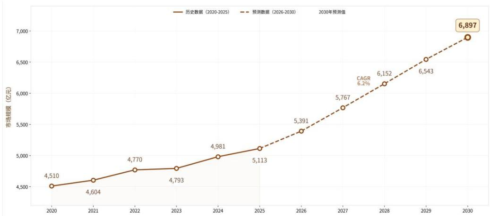
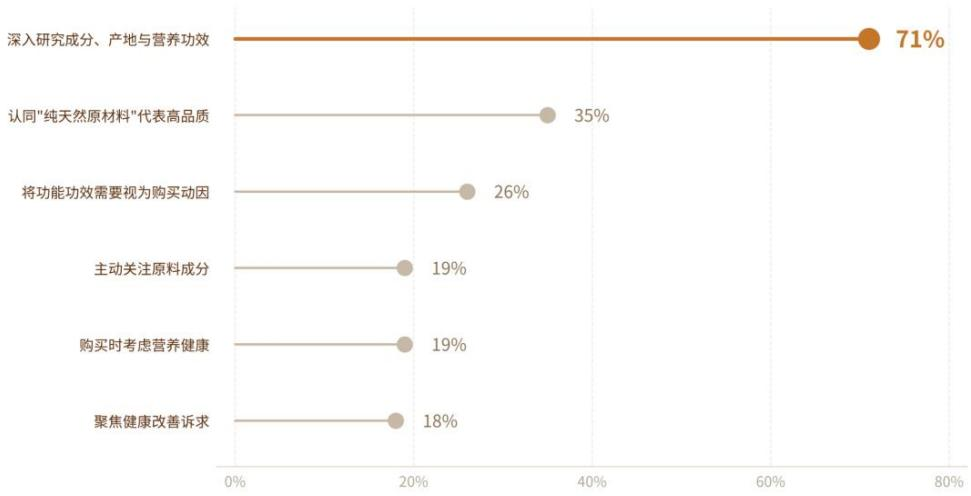
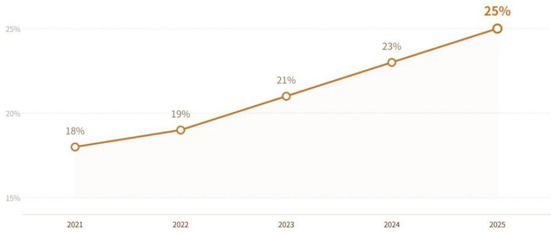
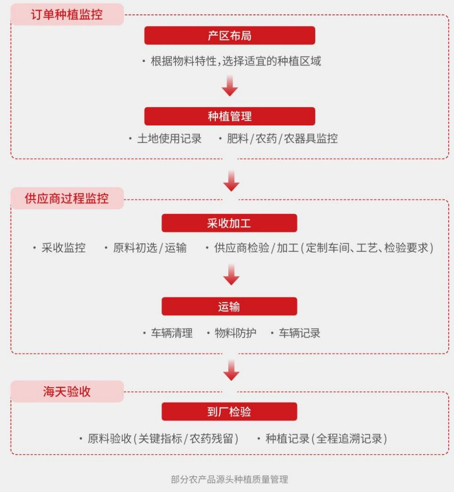
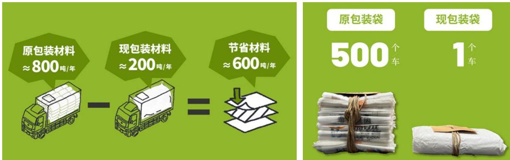
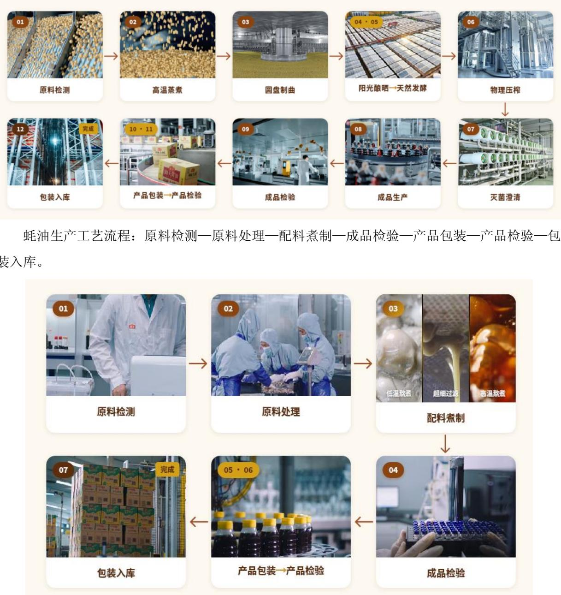
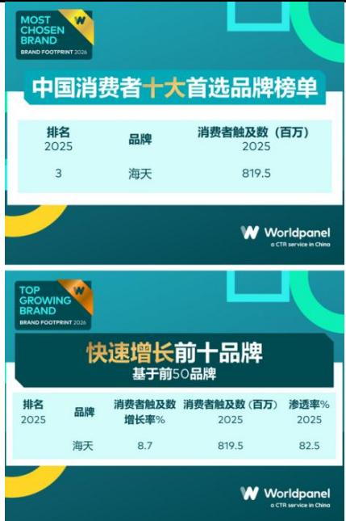

公司代码：603288

公司简称：海天味业

# 佛山市海天调味食品股份有限公司2026 年半年度报告

2026 年 8 月

## 重要提示

一、 本公司董事会及董事、高级管理人员保证半年度报告内容的真实性、准确性、完整性，不存在虚假记载、误导性陈述或重大遗漏，并承担个别和连带的法律责任。

二、 公司全体董事出席董事会会议。

三、 本半年度报告未经审计。

四、 公司负责人管江华、主管会计工作负责人李军及会计机构负责人（会计主管人员）牟琪声明：保证半年度报告中财务报告的真实、准确、完整。

## 五、 董事会决议通过的本报告期利润分配预案或公积金转增股本预案

## 六、 前瞻性陈述的风险声明

√适用 □不适用

本报告中所涉及未来计划、发展战略等前瞻性陈述，不构成公司对投资者的实质承诺，敬请投资者注意投资风险。

## 七、 是否存在被控股股东及其他关联方非经营性占用资金情况

## 八、 是否存在违反规定决策程序对外提供担保的情况

## 九、 是否存在半数以上董事无法保证公司所披露半年度报告的真实性、准确性和完整性否

## 十、 重大风险提示

公司已在本报告中详细描述可能存在的相关风险，敬请查阅管理层讨论与分析中可能面对的风险章节的相关内容。

## 十一、 其他

□适用 √不适用

## 目录

第一节 释义 ....  
第二节 公司简介和主要财务指标. 4  
第三节 管理层讨论与分析......  
第四节 公司治理、环境和社会.. .32  
第五节 重要事项.... . 35  
第六节 股份变动及股东情况. 39  
第七节 债券相关情况. ... 42  
第八节 财务报告.... ... 43

<table><tr><td rowspan=4 colspan=1>备查文件目录</td><td rowspan=1 colspan=1>一、载有法定代表人签名的半年度报告文本；</td></tr><tr><td rowspan=1 colspan=1>二、载有法定代表人、主管会计工作负责人、会计机构负责人（会计主管人员）签名并盖章的财务报表；</td></tr><tr><td rowspan=1 colspan=1>三、报告期内在中国证监会指定网站上公开披露过的所有公司文件的正本和公告的原稿；</td></tr><tr><td rowspan=1 colspan=1>四、在香港证券市场公布的中期业绩公告。</td></tr></table>

## 第一节 释义

在本报告书中，除非文义另有所指，下列词语具有如下含义：

<table><tr><td rowspan=1 colspan=3>常用词语释义</td></tr><tr><td rowspan=1 colspan=1>海天集团、控股股东</td><td rowspan=1 colspan=1>指</td><td rowspan=1 colspan=1>广东海天集团股份有限公司</td></tr><tr><td rowspan=1 colspan=1>本公司、公司、海天味业</td><td rowspan=1 colspan=1>指</td><td rowspan=1 colspan=1>佛山市海天调味食品股份有限公司</td></tr><tr><td rowspan=1 colspan=1>本集团、集团</td><td rowspan=1 colspan=1>指</td><td rowspan=1 colspan=1>佛山市海天调味食品股份有限公司及其子公司</td></tr><tr><td rowspan=1 colspan=1>股东会</td><td rowspan=1 colspan=1>指</td><td rowspan=1 colspan=1>佛山市海天调味食品股份有限公司股东会</td></tr><tr><td rowspan=1 colspan=1>董事会</td><td rowspan=1 colspan=1>指</td><td rowspan=1 colspan=1>佛山市海天调味食品股份有限公司董事会</td></tr><tr><td rowspan=1 colspan=1>中国证监会</td><td rowspan=1 colspan=1>指</td><td rowspan=1 colspan=1>中国证券监督管理委员会</td></tr><tr><td rowspan=1 colspan=1>上交所</td><td rowspan=1 colspan=1>指</td><td rowspan=1 colspan=1>上海证券交易所</td></tr><tr><td rowspan=1 colspan=1>香港联交所</td><td rowspan=1 colspan=1>指</td><td rowspan=1 colspan=1>香港联合交易所有限公司</td></tr><tr><td rowspan=1 colspan=1>报告期</td><td rowspan=1 colspan=1>指</td><td rowspan=1 colspan=1>2026年1月1日至2026年6月30日</td></tr><tr><td rowspan=1 colspan=1>元、万元、亿元</td><td rowspan=1 colspan=1>指</td><td rowspan=1 colspan=1>人民币元、人民币万元、人民币亿元</td></tr></table>

## 第二节 公司简介和主要财务指标

## 一、 公司信息

<table><tr><td rowspan=1 colspan=1>公司的中文名称</td><td rowspan=1 colspan=1>佛山市海天调味食品股份有限公司</td></tr><tr><td rowspan=1 colspan=1>公司的中文简称</td><td rowspan=1 colspan=1>海天味业</td></tr><tr><td rowspan=1 colspan=1>公司的外文名称</td><td rowspan=1 colspan=1>Foshan Haitian Flavouring and Food Company Ltd.</td></tr><tr><td rowspan=1 colspan=1>公司的外文名称缩写</td><td rowspan=1 colspan=1>HAI TIAN</td></tr><tr><td rowspan=1 colspan=1>公司的法定代表人</td><td rowspan=1 colspan=1>管江华</td></tr></table>

## 二、 联系人和联系方式

<table><tr><td rowspan=1 colspan=1></td><td rowspan=1 colspan=1>董事会秘书</td><td rowspan=1 colspan=1>证券事务代表</td></tr><tr><td rowspan=1 colspan=1>姓名</td><td rowspan=1 colspan=1>柯莹</td><td rowspan=1 colspan=1>吴伟明</td></tr><tr><td rowspan=1 colspan=1>联系地址</td><td rowspan=1 colspan=1>广东省佛山市文沙路16号</td><td rowspan=1 colspan=1>广东省佛山市文沙路16号</td></tr><tr><td rowspan=1 colspan=1>电话</td><td rowspan=1 colspan=1>0757-82836083</td><td rowspan=1 colspan=1>0757-82836083</td></tr><tr><td rowspan=1 colspan=1>传真</td><td rowspan=1 colspan=1>0757-82873730</td><td rowspan=1 colspan=1>0757-82873730</td></tr><tr><td rowspan=1 colspan=1>电子信箱</td><td rowspan=1 colspan=1>OBD@haday.cn</td><td rowspan=1 colspan=1>OBD@haday.cn</td></tr></table>

## 三、 基本情况变更简介

<table><tr><td rowspan=1 colspan=1>公司注册地址</td><td rowspan=1 colspan=1>广东省佛山市文沙路16号</td></tr><tr><td rowspan=1 colspan=1>公司注册地址的历史变更情况</td><td rowspan=1 colspan=1>不适用</td></tr><tr><td rowspan=1 colspan=1>公司办公地址</td><td rowspan=1 colspan=1>广东省佛山市文沙路16号</td></tr><tr><td rowspan=1 colspan=1>公司办公地址的邮政编码</td><td rowspan=1 colspan=1>528000</td></tr><tr><td rowspan=1 colspan=1>公司网址</td><td rowspan=1 colspan=1>https://www.haday.com</td></tr><tr><td rowspan=1 colspan=1>电子信箱</td><td rowspan=1 colspan=1>OBD@haday.cn</td></tr><tr><td rowspan=1 colspan=1>报告期内变更情况查询索引</td><td rowspan=1 colspan=1>不适用</td></tr></table>

四、 信息披露及备置地点变更情况简介
<table><tr><td colspan="1" rowspan="1">公司选定的信息披露报纸名称</td><td colspan="1" rowspan="1">《中国证券报》、《证券日报》、《证券时报》、《上海证券报》</td></tr><tr><td colspan="1" rowspan="1">登载半年度报告的网站地址</td><td colspan="1" rowspan="1">www.sse.com.cn</td></tr><tr><td colspan="1" rowspan="1">公司半年度报告备置地点</td><td colspan="1" rowspan="1">广东省佛山市禅城区文沙路16号董事会办公室</td></tr><tr><td>报告期内变更情况查询索引</td><td>不适用</td></tr></table>

五、 公司股票简况
<table><tr><td rowspan=1 colspan=1>股票种类</td><td rowspan=1 colspan=1>股票上市交易所</td><td rowspan=1 colspan=1>股票简称</td><td rowspan=1 colspan=1>股票代码</td><td rowspan=1 colspan=1>变更前股票简称</td></tr><tr><td rowspan=1 colspan=1>A股</td><td rowspan=1 colspan=1>上海证券交易所</td><td rowspan=1 colspan=1>海天味业</td><td rowspan=1 colspan=1>603288</td><td rowspan=1 colspan=1>不适用</td></tr><tr><td rowspan=1 colspan=1>H股</td><td rowspan=1 colspan=1>香港联交所</td><td rowspan=1 colspan=1>海天味業</td><td rowspan=1 colspan=1>03288</td><td rowspan=1 colspan=1>不适用</td></tr></table>

六、 其他有关资料

□适用 √不适用

## 七、 公司主要会计数据和财务指标

## (一) 主要会计数据

单位：元 币种：人民币

<table><tr><td rowspan=2 colspan=1>主要会计数据</td><td rowspan=2 colspan=1>本报告期(1-6月）</td><td rowspan=1 colspan=2>上年同期</td><td rowspan=2 colspan=1>本报告期比上年同期增减(%</td></tr><tr><td rowspan=1 colspan=1>调整后</td><td rowspan=1 colspan=1>调整前</td></tr><tr><td rowspan=1 colspan=1>营业收入</td><td rowspan=1 colspan=1>16,146,273,837.53</td><td rowspan=1 colspan=1>15,231,446,763.67</td><td rowspan=1 colspan=1>15,229,923,077.90</td><td rowspan=1 colspan=1>6.01</td></tr><tr><td rowspan=1 colspan=1>利润总额</td><td rowspan=1 colspan=1>4,954,368,093.46</td><td rowspan=1 colspan=1>4,648,795,419.45</td><td rowspan=1 colspan=1>4,651,340,550.25</td><td rowspan=1 colspan=1>6.57</td></tr><tr><td rowspan=1 colspan=1>归属于上市公司股东的净利润</td><td rowspan=1 colspan=1>4,190,156,263.00</td><td rowspan=1 colspan=1>3,911,459,893.08</td><td rowspan=1 colspan=1>3,914,005,023.88</td><td rowspan=1 colspan=1>7.13</td></tr><tr><td rowspan=1 colspan=1>归属于上市公司股东的扣除非经常性损益的净利润</td><td rowspan=1 colspan=1>3,960,405,507.28</td><td rowspan=1 colspan=1>3,816,542,513.66</td><td rowspan=1 colspan=1>3,816,542,513.66</td><td rowspan=1 colspan=1>3.77</td></tr><tr><td rowspan=1 colspan=1>经营活动产生的现金流量净额</td><td rowspan=1 colspan=1>1,224,226,577.61</td><td rowspan=1 colspan=1>1,502,402,735.60</td><td rowspan=1 colspan=1>1,504,938,083.15</td><td rowspan=1 colspan=1>-18.52</td></tr><tr><td rowspan=2 colspan=1></td><td rowspan=2 colspan=1>本报告期末</td><td rowspan=1 colspan=1>上年度</td><td rowspan=1 colspan=1>末</td><td rowspan=2 colspan=1>本报告期末比上年度末增减(%</td></tr><tr><td rowspan=1 colspan=1>调整后</td><td rowspan=1 colspan=1>调整前</td></tr><tr><td rowspan=1 colspan=1>归属于上市公司股东的净资产</td><td rowspan=1 colspan=1>39,093,532,493.98</td><td rowspan=1 colspan=1>41,329,564,456.48</td><td rowspan=1 colspan=1>41,329,564,456.48</td><td rowspan=1 colspan=1>-5.41</td></tr><tr><td rowspan=1 colspan=1>总资产</td><td rowspan=1 colspan=1>47,140,879,048.25</td><td rowspan=1 colspan=1>52,183,944,926.12</td><td rowspan=1 colspan=1>52,183,944,926.12</td><td rowspan=1 colspan=1>-9.66</td></tr></table>

## (二) 主要财务指标

<table><tr><td rowspan=2 colspan=1>主要财务指标</td><td rowspan=2 colspan=1>本报告期(1-6月）</td><td rowspan=1 colspan=2>上年同期</td><td rowspan=2 colspan=1>本报告期比上年同期增减(%)</td></tr><tr><td rowspan=1 colspan=1>调整后</td><td rowspan=1 colspan=1>调整前</td></tr><tr><td rowspan=1 colspan=1>基本每股收益(元／股）</td><td rowspan=1 colspan=1>0.72</td><td rowspan=1 colspan=1>0.70</td><td rowspan=1 colspan=1>0.70</td><td rowspan=1 colspan=1>2.86</td></tr><tr><td rowspan=1 colspan=1>稀释每股收益（元／股）</td><td rowspan=1 colspan=1>0.72</td><td rowspan=1 colspan=1>0.70</td><td rowspan=1 colspan=1>0.70</td><td rowspan=1 colspan=1>2.86</td></tr><tr><td rowspan=1 colspan=1>扣除非经常性损益后的基本每股收益(元/股）</td><td rowspan=1 colspan=1>0.68</td><td rowspan=1 colspan=1>0.69</td><td rowspan=1 colspan=1>0.69</td><td rowspan=1 colspan=1>-1.45</td></tr><tr><td rowspan=1 colspan=1>加权平均净资产收益率（%）</td><td rowspan=1 colspan=1>10.07</td><td rowspan=1 colspan=1>11.29</td><td rowspan=1 colspan=1>12.22</td><td rowspan=1 colspan=1>-1.22</td></tr><tr><td rowspan=1 colspan=1>扣除非经常性损益后的加权平均净资产收益率（%)</td><td rowspan=1 colspan=1>9.52</td><td rowspan=1 colspan=1>10.73</td><td rowspan=1 colspan=1>11.91</td><td rowspan=1 colspan=1>-1.21</td></tr></table>

公司主要会计数据和财务指标的说明

√适用 □不适用

2025 年 11 月 30 日，公司完成对广东海天创新技术有限公司的收购（同一控制下企业合并），按照相关会计规定，对可比财务数据进行了重述。

## 八、 境内外会计准则下会计数据差异

□适用 √不适用

## 九、 非经常性损益项目和金额

√适用 □不适用

单位：元 币种：人民币

<table><tr><td rowspan=1 colspan=1>非经常性损益项目</td><td rowspan=1 colspan=1>金额</td><td rowspan=1 colspan=1>附注（如适用）</td></tr><tr><td rowspan=1 colspan=1>非流动性资产处置损益，包括已计提资产减值准备的冲销部分</td><td rowspan=1 colspan=1>748,113.10</td><td rowspan=1 colspan=1></td></tr><tr><td rowspan=1 colspan=1>计入当期损益的政府补助，但与公司正常经营业务密切相关、符合国家政策规定、按照确定的标准享有、对公司损益产生持续影响的政府补助除外</td><td rowspan=1 colspan=1>33,896,236.64</td><td rowspan=1 colspan=1></td></tr><tr><td rowspan=1 colspan=1>除同公司正常经营业务相关的有效套期保值业务外，非金融企业持有金融资产和金融负债产生的公允价值变动损益以及处置金融资产和金融负债产生的损益</td><td rowspan=1 colspan=1>258,880,091.32</td><td rowspan=1 colspan=1></td></tr><tr><td rowspan=1 colspan=1>除上述各项之外的其他营业外收入和支出</td><td rowspan=1 colspan=1>-7,241,848.43</td><td rowspan=1 colspan=1></td></tr><tr><td rowspan=1 colspan=1>减：所得税影响额</td><td rowspan=1 colspan=1>52,996,977.69</td><td rowspan=1 colspan=1></td></tr><tr><td rowspan=1 colspan=1>少数股东权益影响额（税后）</td><td rowspan=1 colspan=1>3,534,859.22</td><td rowspan=1 colspan=1></td></tr><tr><td rowspan=1 colspan=1>合计</td><td rowspan=1 colspan=1>229,750,755.72</td><td rowspan=1 colspan=1></td></tr></table>

对公司将《公开发行证券的公司信息披露解释性公告第 1 号——非经常性损益》未列举的项目认定为非经常性损益项目且金额重大的，以及将《公开发行证券的公司信息披露解释性公告第 1 号非经常性损益》中列举的非经常性损益项目界定为经常性损益的项目，应说明原因。□适用 √不适用

## 十、 存在股权激励、员工持股计划的公司可选择披露扣除股份支付影响后的净利润

□适用 √不适用

## 十一、 其他

□适用 √不适用

## 第三节 管理层讨论与分析

## 一、报告期内公司所属行业及主营业务情况说明

## （一）调味品行业发展情况

得益于调味品悠久的发展历史和刚需特性，调味品行业在过往总体保持稳健发展。全球和中国调味品市场容量大，仍有较大发展空间。根据弗若斯特沙利文的资料，中国调味品市场规模将从 2025 年的约 5,113 亿元人民币，提升至 2030 年的约 6,897 亿元人民币，复合增速约为 6.2%。2026 年 7 月，国务院批复《扩大消费“十五五”规划》，明确提出“到 2030 年……社会消费品零售总额达到 60 万亿元左右”，较 2025 年社会消费品零售总额 50 万亿元提升约 20%，消费市场总体规模稳步扩大，中长期总需求得到政策支撑。

  
数据来源：弗若斯特沙利文

## 1、行业内拓展成本大，进入壁垒不断提高

调味品是单价相对较低的“小产品”，但行业本身资本投入高、产业技术复杂且投入产出周期长，土地资源、厂房建设、智能设备、渠道网络、品牌经营等方面的重资本投入也构筑起较高的行业进入壁垒。近几年，消费者对产品和服务的需求趋向多元化，对调味品企业的技术革新能力和产品创新能力再次提出更高的要求。

以 AI 应用为代表的数智化技术正全面渗透调味品全产业链，从消费洞察、研发生产到品控供应链，经验被转化为量化且可复用的模型，柔性制造兼顾规模与定制，科技正重塑企业间的竞争逻辑。唯有率先实现全价值链数智化转型的企业，方能建立并持续扩大效率、品质与成本的代际优势。

## 2、行业竞争日趋激烈，供给格局不断优化，头部企业综合优势持续凸显

调味品行业是一个充分竞争的行业。市场需求从总量扩张转向结构分化，用户需求呈现多元化、健康化与便捷化趋势，这对企业的需求洞察能力、研发创新实力、柔性制造能力及供应链协同效率提出了全方位挑战。企业不仅需要精准把握用户需求的动态变化，更需依托强大的研发储备、极致化的工业生产能力和高效的供应链整合能力，将用户洞察转化为优质产品，并通过立体化渠道高效触达消费者。只有构建系统化优势的企业，方能引领行业下一阶段。

政策规范提升行业准入门槛，落后产能逐步退出。酱油、食醋、鸡精等系列食品质量新国标陆续落地，环保、质检、发酵工艺门槛抬高，合规产能向头部集中。而《扩大消费“十五五”规划》强调要“提升餐饮服务品质，压实经营者食品安全主体责任，实施地域餐饮品牌培育工程，鼓励地方打造美食集聚区和特色小吃产业集群”，餐饮行业品质化、连锁化、特色化发展提速，对上游调味品企业在风味标准化能力、食品安全品控能力以及区域特色产品的柔性研发与供应能力等方面提出更高要求，行业竞争门槛进一步抬升。

外部环境飞速巨变，行业龙头凭借系统化的抗风险能力，成为不确定性中的确定性。全球地缘政治冲突反复延宕，大宗商品市场波动加剧，调味品行业亦面临一定成本传导压力。在此背景下，龙头企业依托长协订单、规模化集中采购、技术驱动降本及生态圈资源整合等多重优势，在波动中有效对冲风险、维持盈利韧性，抗风险优势在压力测试中持续凸显。

## 3、多元消费需求给行业带来新的机遇和挑战，企业必须具备与时俱进的综合能力

我国幅员辽阔，形成了不同区域、不同人群差异化的消费需求，为企业带来了更多机遇，但也对企业能力提出了多维度的挑战。

消费者对调味品的真材实料、健康和便捷等属性的要求越来越高。据尼尔森 IQ 的报告，高达71%的大食饮消费者表示“在意产品的成份、产地和营养功效等，会深入研究后挑选最适合自己的产品”，健康化正演化为消费者主导的、精细化的产品筛选乃至共创的过程。同时，快节奏的工作生活方式，催生了消费者对方便快捷产品、复合调味料产品的需求，要求企业以更精准的消费洞察、更高的创新效率和更敏捷的生产响应能力推出新品。

  
数据来源：《2025 大食饮行业消费者心智及决策链路研究白皮书》

近几年来，餐饮行业连锁化趋势加速。根据中国连锁经营协会的数据，全国餐饮连锁化率已从 2020 年的 15%提升至 2025 年的 25%。根据国家统计局的数据，限额以上餐饮收入（年营业额达 200 万元及以上）占餐饮收入比例从 2021 年的约 22%提升至 2025 年的约 28%，2026 年上半年进一步提升至 29.5%。连锁餐饮对食品安全、风味稳定及标准化解决方案的要求，将利好于已有技术储备和柔性响应能力的调味品龙头企业，推动上游调味品行业的整合程度逐步提高。

  
数据来源：《2026 中国餐饮连锁化发展白皮书》

## 4、消费者触达渠道及交付形式愈发多元，对企业运营能力提出极致要求

随着线上及线下渠道的快速迭代，消费者的触达场景、消费场景已高度碎片化。根据艾瑞传媒的报告，在家庭消费场景中，调味品人均购买渠道达 4.2 个。消费的决策路径以及全渠道交付模式变得立体多元，电商平台、即时零售、直播电商等新兴渠道和零售业态快速涌现，这对行业供应模式、分销模式的转型升级提出了新挑战。市场的日新月异要求企业在分销体系重构、供应交付体系重构、数字化能力建设、创新能力等多方面持续作为，积极拥抱变化。只有具备全渠道布局能力、能够针对不同渠道特性实施差异化策略的企业，才能化挑战为机遇，抓住新生意。

## （二）公司主营业务

公司是拥有 400 年历史传承的调味品龙头企业，致力于用优质产品服务全球用户，满足从厨房到餐桌的调味需求。长期积累的口碑造就了家喻户晓的“海天”品牌，让公司成为首批荣获中国商务部“中华老字号”认定的企业之一。公司产品家庭渗透率超 80%，位居中国消费者首选调味品品牌第一。公司产品涵盖酱油、蚝油、调味酱、食醋、料酒、复合调味料等各大品类，主要业务板块情况如下：

## 1、酱油板块

酱油是中国调味品市场规模最大的单一品类，具有使用需求大、使用频次高、适用场景广等特点，在家庭、餐饮和食饮加工等领域具有重要地位。

作为公司的核心业务板块之一，海天酱油产销量和市场占有率已连续数十年位居全国第一。公司坚持用真材实料酿造好产品、坚持天然阳光晒制、坚持传统酿造工艺，依托独特的菌种选育和发酵技术沉淀，将“三大坚持”融入数字化生产工序，从源头上锁定营养与风味。正是这份对原料的严苛、对匠心的敬畏和对质量的坚守，成就了一代又一代消费者熟悉和信赖的味道。

为满足不同用户对健康、美味、安心的需求，公司在风味、品质和包装等方面不断升级，构建了从大众基础到各类细分需求的完整产品线，逐步形成系列化、立体化的酱油产品矩阵。除满足日常需求的经典和味极鲜等系列以外，海天还有满足健康需求的薄盐、有机等营养健康系列，满足特定膳食需求的无蔗糖、无麸质、富硒特调系列等众多产品。与环保理念相融合，我们更将全链条的减碳实践酿进有机酱油和无麸质特级生抽，让减碳成为每个人都能参与的事，让低碳转化为可感知的用户体验。

## 2、蚝油板块

蚝油生产历史悠久，是以生蚝为原料，经蒸煮、浓缩等工艺制成的经典鲜味调味品。海天蚝油的市场占有率连续 11 年位居全国第一，是名副其实的国民产品，深受消费者喜爱。

我们相信，新鲜是定义一瓶好蚝油的标尺。公司的蚝油产品均用生蚝鲜熬制成，从高标准的海洋牧场中优选原只生蚝、熬化成汁，真材实料和严选工艺确保了海天蚝油颜色红亮、鲜香浓郁、质地幼滑，形成了“浓而不腥，一招定鲜”的优势壁垒，具有广泛的使用场景。公司与上下游伙伴联合发起设立中国蚝产业领鲜生态联盟，并发布“蚝油品质六新鲜”标准，从“源头锁鲜-原只鲜熬-工艺护鲜-质控纯鲜-科学呈鲜-包装留鲜”六大维度出发，为用户打造一瓶好蚝油。

公司既拥有海天上等蚝油、金标蚝油等国民经典产品，也提供为爆炒、炖煮等核心烹饪场景专研的小炒鲜、炖煮鲜风味蚝油，还有满足多重健康选择的薄盐蚝油。随着全国饮食文化的加速融合，蚝油在不同地域和菜系持续渗透，叠加烹饪场景的不断拓展，未来仍有较大的发展空间。

## 3、调味酱板块

调味酱被广泛应用于中西餐烹饪及即食场景。公司调味酱包括基础和复合调味酱两种主要类别，已形成产品丰富、风味立体、场景多元的调味酱体系，并在快速迭代中不断焕发新机。公司拥有黄豆酱、香辣酱等具备广泛消费基础的大单品，并依托积累多年的先进生产能力和核心发酵技术，推出柱侯酱、海鲜酱、拌饭酱、香菇酱等适用不同烹饪方式的特色酱料，以及葱油拌面酱、葱香肉丁炸酱等便捷化调味酱，有效满足用户需求。

  
12 / 164

## 4、特色调味品及其他板块

公司拓展品类边界，推广食醋、料酒和复调等产品，旨在提供全场景“一站式”的厨房调味解决方案。

食醋作为我国传统特色调味品，其消费习惯与风味偏好具有显著的地域性。为满足不同地域、不同场景消费者对醋类产品的需求，我们坚持“传统醋+特色醋”的产品布局，持续迭代升级传统醋，同时不断推陈出新，开发出香甜醋、甄选清香米醋、康乐醋等地域特色米醋产品，以及零糖苹果醋、原浆橘子醋等特色果醋产品，形成丰富多元的醋类产品体系。

  
料酒是去腥增香、提鲜解腻的常用调料。公司拥有海天古道料酒、海天古道姜葱料酒等共振单品，并结合市场需求开发出丰富的料酒产品，涵盖基础、有机、老字号和年份系列等多个产品线，是料酒细分市场有力的竞争者。

从基础调味品供应商转型升级为菜品解决方案综合服务商，公司积极发现并响应用户需求，开发多元化的调味产品，包括快捷酱汁系列、辣鲜露和鸡精等，并根据连锁餐饮、食品工业企业和商超等用户的需求和应用场景，提供共创客制产品。

## （三）公司经营模式

公司经营模式以用户为导向，贯通采购、生产、销售和研发等各个核心环节，构建了支撑高质量发展的核心运营能力。报告期内，公司的主要经营模式未发生重大变化。

## 1、采购模式

公司建立了从源头原料采购到调味品生产的极致供应链体系，不断打造行业领先的质量和效率优势。我们关注供应链的整体效益与风险，重视原材料的优选，坚持做好食品安全、稳定供应、可持续发展等重点领域的严格管控。我们以高标准甄选供应商，与其建立稳定的合作关系，从产业布局、种植管理、采收加工到运输，协同规范工序流程并完善追溯体系，确保原料质量；同时利用数字化系统赋能供应链管理，通过数字化采购平台拉通库存、灵活定价、公平竞争，提高产供效率。

## 对于核心原材料，海天与供应商合作，建立并不断完善质量管理和追溯体系

公司重视与供应商建立阳光健康的合作关系，打造稳定可靠的供应商网络。为此，公司通过开展新供应商准入培训、战略供应商交流会以及廉洁合作专项培训等方式，为打造全链协同的高质量供应体系赋能。我们采取原材料定向定点采购、助力农户增收等措施，积极响应国家乡村振兴战略；通过将节能减排成果纳入供应商综合素质评估范围，在采购工作中践行可持续发展的理念。

  
海天与黄豆供应商合作共创，升级黄豆内衬袋，一年节约 600 吨包装材料

## 2、生产模式

公司在广东、江苏、浙江、广西、湖北和海外布局现代化生产基地，以海天高明“灯塔工厂”为标杆，逐步提高各个基地的数智化制造水平，并根据市场需求有序扩张和释放产能，满足全球用户的调味需求。公司所生产的酱油、黄豆酱等发酵类产品以传统酿造工艺为基础，同时利用数字化技术管控生产全流程，确保产品健康营养、风味品质稳定、生产效率较高且库存运转良好。公司贯彻绿色低碳环保理念，在生产过程中通过运用现代技术手段，兼顾环境效益和经济效益。

公司部分产品的生产流程如下：

酱油生产工艺流程：原料检测—高温蒸煮—圆盘制曲—阳光酿晒—天然发酵—物理压榨—灭菌澄清—成品生产—成品检验—产品包装—产品检验—包装入库。

黄豆酱生产工艺流程：原料检测—原料蒸煮—制曲—天然发酵—配料煮制—成品生产—成品检验—产品包装—产品检验—包装入库。

以市场趋势为导向，公司打造并完善多品类生产的柔性生产能力，实现无缝转产换型，最高可在一条生产线生产超 20 种规格或 130 个 SKU 的不同产品。以酱油为例，公司自主研发并引入了各类先进的柔性化自动生产线，包括全自动超高温灭菌产线、全自动封闭式圆盘制曲产线、全自动连续压榨产线等，实现产品全流程柔性化生产，满足市场的定制化需求。

## 3、销售模式

公司采用以经销为主、以直销为补充的销售模式，在线上线下全渠道布局立体渠道体系。经过多年发展，现已建设并维持一支能力突出、长期合作的优质经销商队伍，并配备销售人员与其紧密沟通、提供支持，确保为终端用户高效提供优质产品。近年来，通过为销售和经销商队伍进行数字化赋能转型，渠道运营的整体效率不断提升。

海天目前已有超 6000 家经销商，覆盖约 300 万线下终端网点，线上与数十家主流电商平台合作

## 4、品牌策略

海天的品牌影响力与产品高品质、市场领先地位相互映衬，在行业中持续保持领先。公司持续深化品牌与产业生态的融合，夯实健康、安全、专业、亲和、值得信赖的品牌形象，提升品牌美誉度。一方面，通过权威媒体平台宣传、构建宣传矩阵、邀请消费者及合作伙伴实地参观海天阳光工厂等路径，以开放透明的体验增进用户对海天品质的信任；另一方面，公司持续将品牌势能转化为对餐饮行业及中国味道的助推赋能，以更具互动性的方式传递品牌价值，通过品牌与用户的双向联动，巩固了在消费者心中的信赖感和认同感。

  
公司发起“海天·全球真实用户‘代言人’计划”，听取用户的真实感受

## 5、研发模式

公司建立以市场需求为导向的研发体系，主要分为生产研发和产品研发两个板块，涵盖了产品开发、生产技术开发、市场研究、新兴技术应用和智能装备设计与食品安全检验等内容。

生产研发方面，公司专注于风味、安全、质量及效率多个关键环节的研发，通过对核心技术的长期积累和不断突破，把老师傅古法酿造工艺转化为自动化、智能化及数字化生产流程。产品研发方面，公司以用户为中心，专注于消费者需求及体验，建立市场导向的端到端产品研发流程，通过市场洞察与需求评估→项目评估→试点及中试→上市评估→生命周期管理的全流程，升级迭代现有产品并开发新品，形成从市场到市场的整体闭环。

  
老师傅工艺被转化为可量化的检测指标，确保每一瓶产品的品质与风味  
报告期内公司新增重要非主营业务的说明  
□适用 √不适用

## 二、经营情况的讨论与分析

公司始终认为，只有坚持以用户满意为中心、不断自我革新以满足用户需求，才能持续抓住业务机会，实现稳健发展。过去几年，海天围绕用户健康化、便捷化等需求不断开发新产品，以敏捷响应、全方位满足用家需求为出发点挖掘渠道新机会，公司业绩取得一定增长的同时，也补足了自身的业务短板、积累了新的能力。

2026 年，外部环境依旧复杂多变、行业竞争亦日趋激烈，公司一边要保持业务发展的韧性，一边还要动态审视组织能力的进化，确保经营稳健。在这样“边行军边打仗”的常态下，公司 26年上半年实现营业收入 161.46 亿元，同比增长 6.01%，其中调味品主营业务收入 153.52 亿元，同比增长 5.43%；归母净利润 41.90 亿元，同比增长 7.13%。在距 26 年全年还剩 4 月余的当下，公司仍将聚焦“用户满意至上”，全力实现营收、利润的稳健进步。

## （一）坚持固本强基与固本培优双发展，实现海天优势的螺旋升维

公司多年的发展积累了一定的基础优势，如品类、渠道、技术等多方面。我们将以这些基础优势为锚点，在夯实既有优势的同时孕育新优势，形成螺旋式的增强回路。

品类互促。酱油、蚝油、调味酱三大品类是公司金字塔型产品矩阵的塔基，营业收入占比合计达 77%。2026年上半年，酱油/蚝油/调味酱分别实现营业收入 82.96 亿元/25.66 亿元/16.45 亿元，整体保持增长。我们将持续巩固三大核心品类基本盘，并以其为依托，加速培养醋酒、健康、复调等赛道的新优势。以薄盐和有机等营养健康系列为例，报告期内同比增速达 27.09%，成为稳固三大品类的核心增长引擎。复调产品也借以基调的品质、供应链、渠道优势，取得较好发展。当消费者因为健康新产品而走进海天的货架前、当渠道用家因为复调而导入海天更多的品类资源及服务能力时，三大核心品类也会再次得以激活。

渠道互补。线下餐饮和批发农贸是海天渠道的基本盘。2026 年上半年，公司线下渠道营业收入 143.80 亿元，同比增长 4.81%。经过二十余年的深耕，公司在线下拥有覆盖全国的经销商网络和终端触达能力。我们紧抓传统渠道的“固本”，通过毛细网络的二次建设增强密实度，以数字化营销的新工具技术链接下沉市场。“培优”则体现在线上、工业等新兴渠道能力的构建上：26年上半年线上营业收入 9.72 亿元，同比增长 15.45%；以食品工业为典型代表的新渠道也取得较好发展。传统渠道和新兴渠道，在这几年的发展中逐步形成了双向赋能，传统渠道的承载力为新渠道提供履约背书，线上及工业等新赛道又在挖潜更多的生意触达机会、补强了全面服务用户的能力。

市场互驱。国内市场是公司发展的根基，也是国际化发展的底座。经过多年积累，公司在国内形成的产品品质、供应链、渠道运营、品牌建设和组织管理等体系能力，为走向国际市场提供了坚实支撑。公司持续深耕国内市场，同时坚定推进国际化，国内与国际市场相互驱动。一方面，公司将国内长期积累能力向国际市场延伸，根据不同国家和地区的消费需求和市场特点，加快产品与渠道的本地化布局；另一方面，国际市场更高标准的食安、品质和市场竞争要求，反向推动公司在研发、品质、标准、供应链及管理体系等方面持续升级，并反哺国内，形成内外互驱、相互赋能的发展格局，构筑面向未来的更高竞争力。

固本强基及固本培优双发展，是接下来公司业务取得进步的主旋律。不断扎实基础优势，让新优势的生长更有底气；不断壮大新优势，对基础优势的激发越有活力。

## （二）科技赋能全产业链条，打破“不可能三角”实现公司利润的健康持续

我们一直在探索如何打破“用户满意、企业不断投入、盈利能力领先”的不可能三角，不断拔高核心壁垒。在“科技立企”战略指引下，公司全面拥抱 AI 时代，将科技创新融入研发、采购、生产、物流、营销等全产业链，以技术进步和效率提升持续降低综合成本，将降本形成的空间更多投入品质升级和市场拓展，推动“降本—提质—增量—再降本”的良性循环。

以科技创新推动全链路降本增效。公司持续加大研发、AI 数智化与生产装备投入，通过工艺优化、智能制造、精益管理等方式挖掘效率空间；同时推行“人人科技”，鼓励员工立足业务场景，利用 AI 工具提质增效，让创新走向全员、从单点应用走向全链条提效。2026 年上半年，公司实现毛利率 41.04%，同比提升 0.92 个百分点。

以经验迭代复用放大科技红利。依托全国化生产基地和供应链体系，公司将高明“灯塔工厂”成熟的数字化用例向宿迁、南宁、武汉、嘉兴等基地复制改良。技术和经验的快速复用，不仅放大了提质增效成果，也进一步支撑了公司打造更具质价比、心价比的产品和服务。

以规模效应反哺品质升级。当消费者和客户的口碑，转化为订单与规模增长的根本动因，规模效应又反向摊薄研发、生产和供应链成本。公司将规模效应的红利更多投入品质升级和市场拓展，转化成对用户更好的交付及服务，从而驱动下一轮的增长。

我们正在持续突破“不可能三角”，为公司的长期稳健发展提供坚实支撑。

## （三）坚持用户满意至上，以文化和机制的进化实现长期主义

持续让用户满意，关键在于能否将发展过程中做对的事情沉淀为机制、演化为组织能力。因此，我们坚持让“用户满意”演绎成公司方方面面的标准动作。以产品为例，让用户满意就是消费者对拿到手的产品有“物有所值”甚至“物超所值”的感受，品质、风味、包装、价格等，每一项都对标用户超预期的方向反复打磨；对服务用家来说，我们将帮助客户成功作为衡量工作质量的标尺，在交付稳定、敏捷响应、质价比等方面提供最优的解决方案；对产业生态中的各方伙伴而言，共赢共生、携手发展就是让用户满意，这样端到端的价值链条也才能稳固；对企业内部员工，被看见、有成长，才能让员工满意，也才能让用户满意的执行落到实处。

26 年，公司已全面启动“全员进化”行动，这是全体海天人面向未来的共识凝聚。我们将以此为牵引，坚定信心，全力以赴冲刺全年经营目标的高质量达成。

报告期内主营业务情况如下：

单位：元 币种：人民币

<table><tr><td colspan="6" rowspan="1">主营业务分行业情况</td></tr><tr><td colspan="1" rowspan="1">分行业</td><td colspan="1" rowspan="1">营业收入</td><td colspan="1" rowspan="1">营业成本</td><td colspan="1" rowspan="1">毛利率 (%)</td><td colspan="1" rowspan="1">营业收入同比增减(%)</td><td colspan="1" rowspan="1">毛利率同比增减（%）</td></tr><tr><td colspan="1" rowspan="1">食品制造业</td><td colspan="1" rowspan="1">15,352,023,982.84</td><td colspan="1" rowspan="1">8,798,058,218.80</td><td colspan="1" rowspan="1">42.69</td><td colspan="1" rowspan="1">5.43</td><td colspan="1" rowspan="1">增加1.24个百分点</td></tr><tr><td colspan="6" rowspan="1">主营业务分产品情况</td></tr><tr><td colspan="1" rowspan="1">分产品</td><td colspan="2" rowspan="1">本报告期营业收入</td><td colspan="2" rowspan="1">去年同期营业收入</td><td colspan="1" rowspan="1">同比增减</td></tr><tr><td colspan="1" rowspan="1"></td><td colspan="1" rowspan="1">金额</td><td colspan="1" rowspan="1">占比(%)</td><td colspan="1" rowspan="1">金额</td><td colspan="1" rowspan="1">占比(%)</td><td colspan="1" rowspan="1">(%)</td></tr><tr><td colspan="1" rowspan="1">酱油</td><td colspan="1" rowspan="1">8,296,229,832.55</td><td colspan="1" rowspan="1">54.04</td><td colspan="1" rowspan="1">7,927,942,766.07</td><td colspan="1" rowspan="1">54.44</td><td colspan="1" rowspan="1">4.65</td></tr><tr><td colspan="1" rowspan="1">蚝油</td><td colspan="1" rowspan="1">2,566,288,755.84</td><td colspan="1" rowspan="1">16.72</td><td colspan="1" rowspan="1">2,502,329,945.16</td><td colspan="1" rowspan="1">17.18</td><td colspan="1" rowspan="1">2.56</td></tr><tr><td colspan="1" rowspan="1">调味酱</td><td colspan="1" rowspan="1">1,645,243,866.18</td><td colspan="1" rowspan="1">10.72</td><td colspan="1" rowspan="1">1,625,950,770.20</td><td colspan="1" rowspan="1">11.17</td><td colspan="1" rowspan="1">1.19</td></tr><tr><td colspan="1" rowspan="1">其他</td><td colspan="1" rowspan="1">2,844,261,528.27</td><td colspan="1" rowspan="1">18.52</td><td colspan="1" rowspan="1">2,505,507,042.34</td><td colspan="1" rowspan="1">17.21</td><td colspan="1" rowspan="1">13.52</td></tr><tr><td colspan="1" rowspan="1"></td><td colspan="5" rowspan="1">主营业务分地区情况</td></tr><tr><td colspan="1" rowspan="2">分地区</td><td colspan="2" rowspan="1">本报告期营业收入</td><td colspan="2" rowspan="1">去年同期营业收入</td><td colspan="1" rowspan="2">同比增减(%)</td></tr><tr><td colspan="1" rowspan="1">金额</td><td colspan="1" rowspan="1">占比 (%)</td><td colspan="1" rowspan="1">金额</td><td colspan="1" rowspan="1">占比(%）</td></tr><tr><td colspan="1" rowspan="1">东部区域</td><td colspan="1" rowspan="1">3,016,072,840.77</td><td colspan="1" rowspan="1">19.65</td><td colspan="1" rowspan="1">2,860,033,028.56</td><td colspan="1" rowspan="1">19.64</td><td colspan="1" rowspan="1">5.46</td></tr><tr><td colspan="1" rowspan="1">南部区域</td><td colspan="1" rowspan="1">3,191,572,431.58</td><td colspan="1" rowspan="1">20.79</td><td colspan="1" rowspan="1">3,022,657,047.43</td><td colspan="1" rowspan="1">20.76</td><td colspan="1" rowspan="1">5.59</td></tr><tr><td colspan="1" rowspan="1">中部区域</td><td colspan="1" rowspan="1">3,425,152,247.73</td><td colspan="1" rowspan="1">22.31</td><td colspan="1" rowspan="1">3,182,252,785.82</td><td colspan="1" rowspan="1">21.85</td><td colspan="1" rowspan="1">7.63</td></tr><tr><td colspan="1" rowspan="1">北部区域</td><td colspan="1" rowspan="1">3,767,282,052.75</td><td colspan="1" rowspan="1">24.54</td><td colspan="1" rowspan="1">3,647,681,357.05</td><td colspan="1" rowspan="1">25.05</td><td colspan="1" rowspan="1">3.28</td></tr><tr><td colspan="1" rowspan="1">西部区域</td><td colspan="1" rowspan="1">1,951,944,410.01</td><td colspan="1" rowspan="1">12.71</td><td colspan="1" rowspan="1">1,849,106,304.91</td><td colspan="1" rowspan="1">12.70</td><td colspan="1" rowspan="1">5.56</td></tr><tr><td colspan="6" rowspan="1">主营业务分渠道情况</td></tr><tr><td colspan="1" rowspan="2">分渠道</td><td colspan="2" rowspan="1">本报告期营业收入</td><td colspan="2" rowspan="1">去年同期营业收入</td><td colspan="1" rowspan="2">同比增减(%)</td></tr><tr><td colspan="1" rowspan="1">金额</td><td colspan="1" rowspan="1">占比(%)</td><td colspan="1" rowspan="1">金额</td><td colspan="1" rowspan="1">占比(%)</td></tr><tr><td colspan="1" rowspan="1">线下渠道</td><td colspan="1" rowspan="1">14,379,805,266.83</td><td colspan="1" rowspan="1">93.67</td><td colspan="1" rowspan="1">13,719,625,207.17</td><td colspan="1" rowspan="1">94.22</td><td colspan="1" rowspan="1">4.81</td></tr><tr><td colspan="1" rowspan="1">线上渠道</td><td colspan="1" rowspan="1">972,218,716.01</td><td colspan="1" rowspan="1">6.33</td><td colspan="1" rowspan="1">842,105,316.60</td><td colspan="1" rowspan="1">5.78</td><td colspan="1" rowspan="1">15.45</td></tr></table>

报告期内公司经营情况的重大变化，以及报告期内发生的对公司经营情况有重大影响和预计未  
来会有重大影响的事项  
□适用 √不适用

## 三、报告期内核心竞争力分析

√适用 □不适用

公司认为：海天的核心竞争力是一场“围绕优势持续升维”的长期进化。公司竞争壁垒的本质，不单单在于规模、产品、技术、渠道、品牌等外显优势，更深刻体现在“历史积淀、持续迭代、进化思维”的系统能力中。

1、存量优势的持续深耕。历史积淀非一日之功，时间已换来了先发优势。公司的规模、渠道、产品力交织成网，并装载着深厚的用户心智、产业链协同、客户长期信任等等。这些已帮助公司构筑了短期内难以复制的既有优势，成为公司最宝贵的资产。截至 2026 年 6月末，公司已有 7 个十亿级以上产品系列、超 30 个亿级以上产品系列，约 7000 家经销商，覆盖国内约 100%地级市和超过 90%县级市。

  
海天品牌排名连续多年领先，Worldpanel中国消费者十大首选品牌排名第三，消费者触及数超 8 亿

2、新优势的系统注入。历史积淀同样是孕育新优势的土壤，新物种带来组织能力的重构。公司对存量优势并非守着不动，而是持续用新方法激活老资产。AI 赋能生产全链路、数字化驱动渠道精耕、智能制造重构效率边界、大数据反哺用户洞察，同样是酱油、同样是渠道，内涵却在时刻进化，海天的优势不是静态持有，而是在动态生长。

  
海天用 AI 重塑调味品生产的各个环节，构建起智能制造的效率与质量壁垒

3、永不停歇的进化思维。不满足于现状，始终保持开放、谦逊和警觉，这种思维让公司始终处于“自我刷新”状态，持续进化。从“用户至上”到“用户满意至上”，我们的追求从关注用户走向真正让用户满意；从“调味产品”到“全场景烹饪解决方案”和“味道研究”，海天不断重新定义自身的价值边界；从适应市场到主动拥抱变化，市场在变，海天也在变。只有这样的进化思维，企业的核心壁垒才不会因客观环境的变化而消失，反会在经历一次次周期后打磨得更强。

## 四、报告期内主要经营情况

## (一) 主营业务分析

## 1、 财务报表相关科目变动分析表

单位：元 币种：人民币

<table><tr><td rowspan=1 colspan=1>科目</td><td rowspan=1 colspan=1>本期数</td><td rowspan=1 colspan=1>上年同期数</td><td rowspan=1 colspan=1>变动比例（%）</td></tr><tr><td rowspan=1 colspan=1>营业收入</td><td rowspan=1 colspan=1>16,146,273,837.53</td><td rowspan=1 colspan=1>15,231,446,763.67</td><td rowspan=1 colspan=1>6.01</td></tr><tr><td rowspan=1 colspan=1>营业成本</td><td rowspan=1 colspan=1>9,520,438,519.97</td><td rowspan=1 colspan=1>9,121,787,090.38</td><td rowspan=1 colspan=1>4.37</td></tr><tr><td rowspan=1 colspan=1>销售费用</td><td rowspan=1 colspan=1>932,568,185.55</td><td rowspan=1 colspan=1>971,989,602.04</td><td rowspan=1 colspan=1>-4.06</td></tr><tr><td rowspan=1 colspan=1>管理费用</td><td rowspan=1 colspan=1>394,614,258.61</td><td rowspan=1 colspan=1>316,376,704.68</td><td rowspan=1 colspan=1>24.73</td></tr><tr><td rowspan=1 colspan=1>财务费用</td><td rowspan=1 colspan=1>40,738,696.70</td><td rowspan=1 colspan=1>-211,195,309.99</td><td rowspan=1 colspan=1>不适用</td></tr><tr><td rowspan=1 colspan=1>研发费用</td><td rowspan=1 colspan=1>488,256,340.19</td><td rowspan=1 colspan=1>414,568,936.50</td><td rowspan=1 colspan=1>17.77</td></tr><tr><td rowspan=1 colspan=1>经营活动产生的现金流量净额</td><td rowspan=1 colspan=1>1,224,226,577.61</td><td rowspan=1 colspan=1>1,502,402,735.60</td><td rowspan=1 colspan=1>-18.52</td></tr><tr><td rowspan=1 colspan=1>投资活动产生的现金流量净额</td><td rowspan=1 colspan=1>-35,083,113.91</td><td rowspan=1 colspan=1>-1,271,668,808.24</td><td rowspan=1 colspan=1>不适用</td></tr><tr><td rowspan=1 colspan=1>筹资活动产生的现金流量净额</td><td rowspan=1 colspan=1>-5,481,587,113.43</td><td rowspan=1 colspan=1>5,451,696,480.26</td><td rowspan=1 colspan=1>不适用</td></tr></table>

管理费用变动原因说明：主要是人工、长期待摊费用摊销及咨询等行政开支增加所致。  
财务费用变动原因说明：主要是汇兑损失增加所致。  
研发费用变动原因说明：主要是研发材料耗用及人工支出增加所致。  
经营活动产生的现金流量净额变动原因说明：主要是采购支出增加所致。  
投资活动产生的现金流量净额变动原因说明：主要是本期投资支付的现金减少所致。  
筹资活动产生的现金流量净额变动原因说明：主要由于上年同期收到 H 股募集资金所致。

## 2、 本期公司业务类型、利润构成或利润来源发生重大变动的详细说明

□适用 √不适用

## (二) 非主营业务导致利润重大变化的说明

□适用 √不适用

## (三) 资产、负债情况分析

√适用 □不适用

## 1、 资产及负债状况

单位：元 币种：人民币

<table><tr><td colspan="1" rowspan="1">项目名称</td><td colspan="1" rowspan="1">本期期末数</td><td colspan="1" rowspan="1">本期期末数占总资产的比例（%）</td><td colspan="1" rowspan="1">上年期末数</td><td colspan="1" rowspan="1">上年期末数占总资产的比例（%）</td><td colspan="1" rowspan="1">本期期末金额较上年期末变动比例（%）</td><td colspan="1" rowspan="1">情况说明</td></tr><tr><td colspan="1" rowspan="1">衍生金融资产</td><td colspan="1" rowspan="1">22,514,478.69</td><td colspan="1" rowspan="1">0.05</td><td colspan="1" rowspan="1"></td><td colspan="1" rowspan="1"></td><td colspan="1" rowspan="1">不适用</td><td colspan="1" rowspan="1">主要是外汇远期合约公允价值波动所致。</td></tr><tr><td colspan="1" rowspan="1">其他应收款</td><td colspan="1" rowspan="1">66,728,116.58</td><td colspan="1" rowspan="1">0.14</td><td colspan="1" rowspan="1">45,018,653.04</td><td colspan="1" rowspan="1">0.09</td><td colspan="1" rowspan="1">48.22</td><td colspan="1" rowspan="1">主要是出口退税增加所致。</td></tr><tr><td colspan="1" rowspan="1">其他流动资产</td><td colspan="1" rowspan="1">225,448,293.34</td><td colspan="1" rowspan="1">0.48</td><td colspan="1" rowspan="1">398,493,961.91</td><td colspan="1" rowspan="1">0.76</td><td colspan="1" rowspan="1">-43.42</td><td colspan="1" rowspan="1">主要是本期收到预缴所得税退税所致。</td></tr><tr><td colspan="1" rowspan="1">长期待摊费用</td><td colspan="1" rowspan="1">67,832,325.39</td><td colspan="1" rowspan="1">0.14</td><td colspan="1" rowspan="1">4,509,113.90</td><td colspan="1" rowspan="1">0.01</td><td colspan="1" rowspan="1">1,404.34</td><td colspan="1" rowspan="1">主要是本期结转办公场所装修支出所致。</td></tr><tr><td colspan="1" rowspan="1">短期借款</td><td colspan="1" rowspan="1">329,350,000.00</td><td colspan="1" rowspan="1">0.70</td><td colspan="1" rowspan="1">140,850,000.00</td><td colspan="1" rowspan="1">0.27</td><td colspan="1" rowspan="1">133.83</td><td colspan="1" rowspan="1">主要是本期子公司增加银行信用借款所致。</td></tr><tr><td colspan="1" rowspan="1">衍生金融负债</td><td colspan="1" rowspan="1">2,088,500.00</td><td colspan="1" rowspan="1">0.00</td><td colspan="1" rowspan="1">359,670.58</td><td colspan="1" rowspan="1">0.00</td><td colspan="1" rowspan="1">480.67</td><td colspan="1" rowspan="1">主要是外汇远期合约公允价值波动所致。</td></tr><tr><td colspan="1" rowspan="1">应付票据</td><td colspan="1" rowspan="1">2,091,660,520.74</td><td colspan="1" rowspan="1">4.44</td><td colspan="1" rowspan="1">1,266,872,211.16</td><td colspan="1" rowspan="1">2.43</td><td colspan="1" rowspan="1">65.10</td><td colspan="1" rowspan="1">主要是本期增加票据结算所致。</td></tr><tr><td colspan="1" rowspan="1">合同负债</td><td colspan="1" rowspan="1">978,657,471.40</td><td colspan="1" rowspan="1">2.08</td><td colspan="1" rowspan="1">4,128,488,829.61</td><td colspan="1" rowspan="1">7.91</td><td colspan="1" rowspan="1">-76.30</td><td colspan="1" rowspan="1">主要是上年末经销商春节备货打款导致年初预收货款金额较大，本期末恢复常态。</td></tr><tr><td colspan="1" rowspan="1">其他流动负债</td><td colspan="1" rowspan="1">73,443,372.27</td><td colspan="1" rowspan="1">0.16</td><td colspan="1" rowspan="1">442,690,392.59</td><td colspan="1" rowspan="1">0.85</td><td colspan="1" rowspan="1">-83.41</td><td colspan="1" rowspan="1">主要是上年末经销商春节备货打款导致年初待转销项税额较大，本期末恢复常态。</td></tr></table>

其他说明  
不适用

## 2、 境外资产情况

√适用 □不适用

(1) 资产规模

其中：境外资产8,723,332,572.46（单位：元 币种：人民币），占总资产的比例为18.50%。

## (2) 境外资产占比较高的相关说明

□适用 √不适用

其他说明

无

## 3、 截至报告期末主要资产受限情况

□适用 √不适用

## 4、 其他说明

□适用 √不适用

## (四) 投资状况分析

## 1、 对外股权投资总体分析

√适用 □不适用

于 2026 年 2 月 5 日，本公司的子公司海天国际投资有限公司于韩国设立全资子公司 HadayKorea Co., Ltd.，注册资本为 15 亿韩元。

于 2026 年 4 月 16 日，本公司的子公司海天国际投资有限公司于新加坡设立全资子公司Haday SG Co., Ltd.，注册资本为 50 万新加坡元。

于 2026 年 5 月 5 日，本公司的子公司海天国际投资有限公司的全资子公司 Haday Food(AM) Holding Limited 于美国设立全资子公司 Haday US Holding Inc.，注册资本为 200 万美元。

于 2026 年 5 月 22 日，本公司的子公司海天国际投资有限公司的全资子公司 Haday SG Co.,Ltd.于马来西亚设立全资子公司 HADAYFOODS MALAYSIA SDN. BHD.，注册资本为 100 万马来西亚林吉特。

## (1)重大的股权投资

□适用 √不适用

## (2)重大的非股权投资

□适用 √不适用

## (3)以公允价值计量的金融资产

√适用 □不适用

单位：元 币种：人民币

<table><tr><td rowspan=1 colspan=1>资产类别</td><td rowspan=1 colspan=1>期初数</td><td rowspan=1 colspan=1>本期公允价值变动损益</td><td rowspan=1 colspan=1>计入权益的累计公允价值变动</td><td rowspan=1 colspan=1>本期计提的减值</td><td rowspan=1 colspan=1>本期购买金额</td><td rowspan=1 colspan=1>本期出售/赎回金额</td><td rowspan=1 colspan=1>其他变动</td><td rowspan=1 colspan=1>期末数</td></tr><tr><td rowspan=1 colspan=1>其他</td><td rowspan=1 colspan=1>10,105,563,050.02</td><td rowspan=1 colspan=1>258,880,091.32</td><td rowspan=1 colspan=1></td><td rowspan=1 colspan=1></td><td rowspan=1 colspan=1>6,445,000,000.00</td><td rowspan=1 colspan=1>5,974,574,764.34</td><td rowspan=1 colspan=1></td><td rowspan=1 colspan=1>10,834,868,377.00</td></tr><tr><td rowspan=1 colspan=1>合计</td><td rowspan=1 colspan=1>10,105,563,050.02</td><td rowspan=1 colspan=1>258,880,091.32</td><td rowspan=1 colspan=1></td><td rowspan=1 colspan=1></td><td rowspan=1 colspan=1>6,445,000,000.00</td><td rowspan=1 colspan=1>5,974,574,764.34</td><td rowspan=1 colspan=1></td><td rowspan=1 colspan=1>10,834,868,377.00</td></tr></table>

证券投资情况

□适用 √不适用

证券投资情况的说明

□适用 √不适用

私募基金投资情况

□适用 √不适用

衍生品投资情况

√适用 □不适用

## (1) 报告期内以套期保值为目的的衍生品投资

√适用 □不适用

单位：元 币种：人民币

<table><tr><td rowspan=1 colspan=1>衍生品投资类型</td><td rowspan=1 colspan=1>初始投资金额</td><td rowspan=1 colspan=1>期初账面价值</td><td rowspan=1 colspan=1>本期公允价值变动损益</td><td rowspan=1 colspan=1>计入权益的累计公允价值变动</td><td rowspan=1 colspan=1>报告期内购入金额</td><td rowspan=1 colspan=1>报告期内售出金额</td><td rowspan=1 colspan=1>期末账面价值</td><td rowspan=1 colspan=1>期末账面价值占公司报告期末净资产比例（%）</td></tr><tr><td rowspan=1 colspan=1>外汇合约</td><td rowspan=1 colspan=1></td><td rowspan=1 colspan=1>1,546,880,000.00</td><td rowspan=1 colspan=1>20,785,649.27</td><td rowspan=1 colspan=1></td><td rowspan=1 colspan=1>4,092,635,900.00</td><td rowspan=1 colspan=1></td><td rowspan=1 colspan=1>5,639,515,900.00</td><td rowspan=1 colspan=1>14.24</td></tr><tr><td rowspan=1 colspan=1>合计</td><td rowspan=1 colspan=1></td><td rowspan=1 colspan=1>1,546,880,000.00</td><td rowspan=1 colspan=1>20,785,649.27</td><td rowspan=1 colspan=1></td><td rowspan=1 colspan=1>4,092,635,900.00</td><td rowspan=1 colspan=1></td><td rowspan=1 colspan=1>5,639,515,900.00</td><td rowspan=1 colspan=1>14.24</td></tr><tr><td rowspan=1 colspan=1>报告期内套期保值业务</td><td rowspan=1 colspan=1>公司根据</td><td rowspan=1 colspan=1>财政部《企业会计</td><td rowspan=1 colspan=6>准则第22号   金融工具确认和计量》、《企业会计准则第24号   套期会计》、《企业会</td></tr></table>

<table><tr><td colspan="1" rowspan="1">的会计政策、会计核算具体原则，以及与上一报告期相比是否发生重大变化的说明</td><td colspan="1" rowspan="1">计准则第37号—一金融工具列报》及《企业会计准则第39号—公允价值计量》相关规定及其指南，对开展的业务进行相应的核算处理，反映资产负债表及损益表相关项目。与上一报告期相比无变化。</td></tr><tr><td colspan="1" rowspan="1">报告期实际损益情况的说明</td><td colspan="1" rowspan="1">报告期内衍生产品投资实际损益为2,078.56万元。</td></tr><tr><td colspan="1" rowspan="1">套期保值效果的说明</td><td colspan="1" rowspan="1">公司开展衍生品交易业务以实际生产经营为基础，是为了减少和防范汇率波动对公司经营影响的管理策略，有利于提高公司应对外汇波动风险的能力，增强财务稳健性。外汇业务不以投机和非法套利为目的，不会对公司日常资金周转和主营业务的正常开展造成影响。</td></tr><tr><td colspan="1" rowspan="1">衍生品投资资金来源</td><td colspan="1" rowspan="1">公司自有资金</td></tr><tr><td colspan="1" rowspan="1">报告期衍生品持仓的风险分析及控制措施说明（包括但不限于市场风险、流动性风险、信用风险、操作风险、法律风险等）</td><td colspan="1" rowspan="1">（一）风险分析：1、市场风险：国际、国内经济形势变化，进而导致外汇市场的波动，汇率等价格波动将对衍生品交易产生潜在损失。2、操作风险：外汇衍生品交易业务专业性较强，复杂程度较高，可能存在人为判断偏差，或未按既定程序操作而造成损失的风险。3、履约风险：衍生品交易合约期内出现交易对手无法按期履约而造成损失的风险。（二）风险控制措施1、制度规范：公司制订了外汇衍生品交易业务相关管理制度，明确衍生品交易以具体经营业务为依托、不进行投机和非法套利的原则，就业务操作、审批权限、管理分工及操作流程、信息保密及风险应对程序等进行规范明确，符合监管部门的相关要求。2、交易对手匹配：施行合作机构准入机制，仅与具备外汇衍生品交易业务资质的金融机构开展相关业务，规避可能产生的履约风险。3、产品选择：衍生品品种选择符合公司业务需要的衍生产品或组合，在约定的产品范围之外采取严格准入模式。4、信息跟踪：公司资金部时刻关注外汇市场信息，跟踪外汇衍生品交易业务的价格或损益变化，及时评估已交易外汇衍生品的风险口，最大限度规避市场风险。</td></tr><tr><td colspan="1" rowspan="1">已投资衍生品报告期内市场价格或产品公允价值变动的情况，对衍生品公允价值的分析应披露具体使用的方法及相关假设与参数的设定</td><td colspan="1" rowspan="1">外汇合约公允价值按照银行的外汇产品报价厘定</td></tr><tr><td colspan="1" rowspan="1">涉诉情况（如适用）</td><td colspan="1" rowspan="1">不适用</td></tr><tr><td colspan="1" rowspan="1">衍生品投资审批董事会公告披露日期（如有）</td><td colspan="1" rowspan="1">2026年3月27日</td></tr><tr><td colspan="1" rowspan="1">衍生品投资审批股东会公告披露日期(如有）</td><td colspan="1" rowspan="1">不适用</td></tr></table>

(2) 报告期内以投机为目的的衍生品投资

□适用 √不适用

其他说明

无

## (五) 重大资产和股权出售

□适用 √不适用

(六) 主要控股参股公司分析

√适用 □不适用

主要子公司及对公司净利润影响达 10%以上的参股公司情况

√适用 □不适用

单位：亿元 币种：人民币

<table><tr><td colspan="1" rowspan="1">公司名称</td><td colspan="1" rowspan="1">公司类型</td><td colspan="1" rowspan="1">主要业务</td><td colspan="1" rowspan="1">注册资本</td><td colspan="1" rowspan="1">总资产</td><td colspan="1" rowspan="1">净资产</td><td colspan="1" rowspan="1">营业收入</td><td colspan="1" rowspan="1">营业利润</td><td colspan="1" rowspan="1">净利润</td></tr><tr><td colspan="1" rowspan="1">佛山市海天（高明）调味食品有限公司</td><td colspan="1" rowspan="1">子公司</td><td colspan="1" rowspan="1">生产、销售调味品、食品、饮料、食品添加剂、食品用塑料包装容器工具制品；食品进出口；包装材料及制品销售；食用农产品初加工；农副产品销售；工业旅游旅游、餐饮、信息技术咨询、机械设备租赁、仓储设备租赁、住房租赁、土地使用权租赁等服务</td><td colspan="1" rowspan="1">0.5亿元</td><td colspan="1" rowspan="1">79.75</td><td colspan="1" rowspan="1">27.17</td><td colspan="1" rowspan="1">101.33</td><td colspan="1" rowspan="1">37.66</td><td colspan="1" rowspan="1">32.17</td></tr><tr><td colspan="1" rowspan="1">兴兆环球投资有限公司</td><td colspan="1" rowspan="1">子公司</td><td colspan="1" rowspan="1">股权投资</td><td colspan="1" rowspan="1">1美元</td><td colspan="1" rowspan="1">101.20</td><td colspan="1" rowspan="1">100.83</td><td colspan="1" rowspan="1">0.45</td><td colspan="1" rowspan="1">10.41</td><td colspan="1" rowspan="1">10.22</td></tr><tr><td colspan="1" rowspan="1">海天国际投资有限公司</td><td colspan="1" rowspan="1">子公司</td><td colspan="1" rowspan="1">股权投资</td><td colspan="1" rowspan="1">150万美元</td><td colspan="1" rowspan="1">52.97</td><td colspan="1" rowspan="1">0.33</td><td colspan="1" rowspan="1">0.01</td><td colspan="1" rowspan="1">0.15</td><td colspan="1" rowspan="1">0.15</td></tr><tr><td>佛山市海天（南 宁）调味食品有 限公司</td><td>子公司 询服务</td><td>生产及销售调味品、食品、食品用塑料包装容器工 具制品、食品添加剂、饮料、酒制品；发电业务、 输电业务、供（配）电业务；农产品的生产、销售、 加工、运输、贮藏及其他相关服务;食用农产品初加 工;农副产品销售;食品进出口;货物进出口;技术 进出口;非居住房地产租赁;休闲观光活动;信息咨</td><td>0.5亿元</td><td>24.26</td><td>8.04</td><td>8.96</td><td>2.93</td><td>2.68</td></tr></table>

报告期内取得和处置子公司的情况

□适用 √不适用

其他说明

□适用 √不适用

## (七) 公司控制的结构化主体情况

□适用 √不适用

## 五、其他披露事项

## (一) 可能面对的风险

√适用 □不适用

## 1、食品安全风险

随着国内监管部门和消费者对食品安全和营养健康的关注度提升，同时国际业务所带来更为多样的市场监管环境，产品质量是食品加工企业的重中之重。公司在各个经营环节严格执行品质控制，尤其关注技术突破和应用带来的质量水平跃升，将食品质量安全控制作为公司的核心工作。

## 2、原材料价格波动风险

调味品的生产销售依赖于稳定充足的优质原材料供应。农产品的价格可能受国内外环境、市场供求、气候环境条件等多方面因素的影响，从而产生波动。公司采购团队每年根据销售预测和预期价格波动提前制定采购计划，但如原材料价格上涨较大，将可能对公司产品毛利率水平带来一定影响。

## 3、宏观经济波动和行业景气度下降风险

虽调味品产业具有一定的抗周期能力，但易受经济复苏情况、通胀周期和餐饮行业景气度等因素影响，大众消费品增速不排除面临下行风险。但另一方面，此项风险同时也有利于推动行业上下游的整合。

## 4、市场竞争加剧风险

随着调味品市场企业日益增多，销售渠道和模式逐渐多元化、碎片化，行业竞争不断加剧。在此过程中，可能存在同质化竞争、无序竞争带来的潜在风险。为此，公司坚持追求为用户提供高质价比产品，不断提升运营能力和效率，满足不同用户群体需求。

## 5、公司技术人员不足或流失风险

公司经过长期发展和业务积累，已经形成稳定的研发团队并储备多项核心技术。随着公司在国内外业务不断扩张，公司对技术研发人才的需求必然加大，不能排除面临技术人才不足的风险。

## 6、外汇风险

外汇风险来自外币（即交易相关经营业务的功能货币以外的货币）计值的商业交易或已确认的资产及负债。公司产生此风险的货币主要为美元、欧元、港元及人民币。公司持续跟踪汇率波动，并在必要时运用适当的金融工具进行对冲，以降低外汇风险。

## (二) 其他披露事项

## √适用 □不适用

为推动公司高质量发展，切实保障和维护投资者合法权益，公司于 2026 年 4 月 28 日在上海证券交易所网站（www.sse.com.cn）披露了《海天味业关于 2026 年度“提质增效重回报”行动方案的公告》。公司根据行动方案内容积极推动落实相关工作，2026 年上半年的执行情况总结如下：

## 1、聚焦主营业务，提升公司经营质量

公司聚焦调味品主业发展不动摇，坚守“用户满意至上”的经营理念，锚定用户品质化、健康化、便捷化的需求，强化对消费需求、应用场景的深度洞察，持续为用户提供营养健康、质量稳定、高质价比的海天产品。

2026 年上半年，公司实现经营业绩稳健增长，营业收入、净利润均创历史新高，市占率稳步提升，其中核心基础品类保持增长固本强基，趋势品类破局起势，健康类、便捷类、客制类调味品加快贡献增长动能，海外业务加速推进，国际化战略逐步走深走实；毛利率、净利率持续提升，其中毛利率维持 40%以上区间，盈利能力和质量快速提升；产品矩阵不断丰富、渠道效率和价值继续提升、供应链效率快速迭代、品牌价值持续彰显，公司护城河不断拓宽加固。

## 2、加快发展新质生产力，多措并举落实提质增效

公司坚持高质量发展战略，坚持科技创新、坚持数智化转型升级、坚持内部管理变革，多举措提质增效，持续为企业经营打造新的竞争力。

公司坚持以科技创新引领企业高质量发展。2026 年上半年，公司投入研发费用 4.88 亿元，占上半年营业收入的 3.02%。公司始终秉持战略定力，持续保持营收 3%左右的研发投入强度，支撑公司在发酵核心技术、菌种选育、酿造关键装备、极致检测技术等关键领域不断突破，支撑公司持续开发新品，构筑出金字塔形的立体产品矩阵。

2026 年上半年，公司数字化转型不断深入。高明“灯塔工厂”在用例数量和数据质量持续提升的基础上，效率提升和成本节约空间不断打开，并将验证成熟的数字化用例加速向其他生产基地复制推广，实现算法和经验的低成本快速复用。公司全面拥抱 AI 时代，推动 AI 等先进技术在研发、生产、供应链、营销、管理等全链条的深度融合，在原料筛选、智能发酵、品控检测、营销下单、生产管理等多个环节落地见效，全链运营效率持续提升。

可持续发展方面，公司持续将 ESG 深度融入战略与运营。“碳路者绿链联盟”升级为“海链计划”，联盟成员翻倍至 50 家，发布调味品行业首份产业链系统性减碳规划。MSCIESG 评级升至 AA 级，实现连续四年从 BB 级到 AA 级的跃升，达到行业国内最高、国际一流评级。

## 3、重视投资者回报，维护股东权益

公司实施积极稳定的利润分配政策，高度重视与广大投资者共享公司经营发展的成果。为提升投资者的获得感与回报的可预期性，公司报告期内积极践行《关于未来三年（2025-2027 年）股东回报规划》中现金分红比率不低于 80%的承诺，完成 2025 年度现金分红实施，分红比率高达112.95%，创历史新高。

基于对行业和公司稳健经营的坚定信心，以及对股东的诚意回报，公司于 2026 年启动 A+H股双市场回购计划。A 股方面，公司拟以自有资金通过集中竞价交易方式回购 10-20 亿元，回购期限为股东会审议通过之日起不超过 12 个月，其中 70%或以上回购股份将用于注销并减少注册资本，该回购方案已于 2026 年 7月 21 日正式启动实施。截至 2026 年 7 月底，公司已累计回购 A股股份 1,810,507 股，占公司总股本的比例约为 0.0309%，购买的最高价为 37.37 元/股、最低价为

36.02 元/股，已支付的总金额为 65,799,496.36 元（不含交易费用）。H 股方面，股东会授权公司董事会及董事会授权人士使用不超过 5 亿港元回购 H 股股份（不超过已发行 H 股总股本的 10%），回购股份将用于注销及/或持作库存股。本次 A+H 股双市场回购是公司在中期分红、特别分红、推出回报规划等系列化市值维护举措之后的再次落地，充分彰显了行业龙头担当。

## 4、提升信息披露质量，准确传递公司动态

公司高度重视信息披露工作，严格按照法律、法规等相关要求，真实、准确、完整、及时地披露有关信息，确保定期报告和临时报告信息披露的质量和透明度。公司严格履行内幕信息知情人备案管理制度，做好重大事项的内幕信息管理，确保所有股东获取信息的机会平等。2026 年上半年，公司发布的各项定期报告、临时报告真实、准确、完整，不存在虚假记载、误导性陈述或者重大遗漏。

公司自香港联交所上市以来，严格遵循 A+H 两地的信息披露规则，有力保障了境内外投资者信息获取公平性。此外，公司积极通过召开股东会、线上与线下投资者会议、业绩说明会、上证e互动平台、投资者邮箱与热线电话、优化升级公司官网等多元化的方式，不断丰富向投资者传递公司动态的方式和渠道，有效保障投资者的权益。

## 5、坚持规范运作，完善公司治理

公司严格按照《上海证券交易所股票上市规则》《上海证券交易所上市公司自律监管指引第1号—规范运作》等法律法规、规范性文件的相关规定和要求，结合公司实际情况，不断完善治理结构和内部控制制度。

公司密切关注股票上市地最新监管动态，及时向董事和高级管理人员传递最新监管政策并开展培训，加强对管理层履职能力的动态评估，持续提升“关键少数”的履职能力、责任意识与担当精神，为公司高质量发展提供坚实的治理保障。同时，公司上半年审议通过 2026 年 A 股员工持股计划，进一步完善公司长期激励约束机制。

未来，公司将继续推进“提质增效重回报”相关工作，坚持聚焦主业，持续提升公司经营规模和质量；坚持科技立企，依托新质生产力更好满足用户需求；坚持用户满意至上，以为用户创造和提供价值来匹配和分配资源；坚持规范运作，让公司在合规治理下行稳致远；坚持理性共享，以 A+H 股双市场回购等实际行动持续回馈股东，与股东共同见证公司发展动态，分享公司发展成果。

## 第四节 公司治理、环境和社会

## 一、公司董事、高级管理人员变动情况

□适用 √不适用

公司董事、高级管理人员变动的情况说明

□适用 √不适用

## 二、利润分配或资本公积金转增预案

半年度拟定的利润分配预案、公积金转增股本预案

<table><tr><td rowspan=1 colspan=1>是否分配或转增</td><td rowspan=1 colspan=1>否</td></tr><tr><td rowspan=1 colspan=1>每10股送红股数（股）</td><td rowspan=1 colspan=1></td></tr><tr><td rowspan=1 colspan=1>每10股派息数(元)（含税）</td><td rowspan=1 colspan=1></td></tr><tr><td rowspan=1 colspan=1>每10股转增数（股）</td><td rowspan=1 colspan=1></td></tr><tr><td rowspan=1 colspan=2>利润分配或资本公积金转增预案的相关情况说明</td></tr><tr><td rowspan=1 colspan=2>不适用</td></tr></table>

## 三、公司股权激励计划、员工持股计划或其他员工激励措施的情况及其影响

(一) 相关股权激励事项已在临时公告披露且后续实施无进展或变化的

√适用 □不适用

<table><tr><td rowspan=1 colspan=1>事项概述</td><td rowspan=1 colspan=1>查询索引</td></tr><tr><td rowspan=1 colspan=1>2026年3月27日，披露公司关于回购注销 2024年员工持股计划A股股份暨 2024年员工持股计划终止的公告</td><td rowspan=1 colspan=1>上海证券交易所网站（www.sse.com.cn）《海天味业关于回购注销 2024年员工持股计划A股股份暨 2024年员工持股计划终止的公告》</td></tr><tr><td rowspan=1 colspan=1>2026年3月27日，披露公司2026年A股员工持股计划（草案）</td><td rowspan=1 colspan=1>上海证券交易所网站（www.sse.com.cn）《海天味业 2026年A股员工持股计划（草案）》</td></tr><tr><td rowspan=1 colspan=1>2026年3月27日，披露公司2026年A股员工持股计划（草案）摘要</td><td rowspan=1 colspan=1>上海证券交易所网站（www.sse.com.cn）《海天味业2026年A股员工持股计划（草案）摘要》</td></tr><tr><td rowspan=1 colspan=1>2026年3月27日，披露公司实施 2026年A股员工持股计划的法律意见书</td><td rowspan=1 colspan=1>上海证券交易所网站（www.sse.com.cn）《北京市嘉源律师事务所关于海天味业实施2026年A股员工持股计划的法律意见书》</td></tr><tr><td rowspan=1 colspan=1>2026年3月27日，披露公司2026年A股员工持股计划管理办法</td><td rowspan=1 colspan=1>上海证券交易所网站（www.sse.com.cn）《海天味业2026年A股员工持股计划管理办法》</td></tr><tr><td rowspan=1 colspan=1>2026年3月27日，披露公司薪酬与考核委员会关于2026年A 股员工持股计划相关事宜的核查意见</td><td rowspan=1 colspan=1>上海证券交易所网站（www.sse.com.cn）《海天味业薪酬与考核委员会关于2026年A股员工持股计划相关事宜的核查意见》</td></tr><tr><td rowspan=1 colspan=1>2026年4月11日，披露公司关于 2024年员工持股计划存续期即将届满的提示性公告</td><td rowspan=1 colspan=1>上海证券交易所网站（www.sse.com.cn）《海天味业关于2024年员工持股计划存续期即将届满的提示性公告》</td></tr><tr><td rowspan=1 colspan=1>2026年5月12日，披露公司关于回购注销股份、减少注册资本暨通知债权人的公告</td><td rowspan=1 colspan=1>上海证券交易所网站（www.sse.com.cn）《海天味业关于回购注销股份、减少注册资本暨通知债权人的公告》</td></tr></table>

<table><tr><td>2026年5月12日，披露公司 2026年A股员工持股计划</td><td>上海证券交易所网站（www.sse.com.cn）《海天味业2026 年A股员工持股计划》</td><td></td></tr><tr><td>2026年6月5日，披露公司关 于 2026年A股员工持股计划 管理委员会成员的公告</td><td>上海证券交易所网站（www.sse.com.cn）《海天味业关于 2026年A股员工持股计划管理委员会成员的公告》</td><td></td></tr></table>

## (二) 临时公告未披露或有后续进展的激励情况

股权激励情况

□适用 √不适用

其他说明

□适用 √不适用

员工持股计划情况

□适用 √不适用

其他激励措施

□适用 √不适用

## 四、纳入环境信息依法披露企业名单的上市公司及其主要子公司的环境信息情况

√适用 □不适用

<table><tr><td rowspan=1 colspan=2>纳入环境信息依法披露企业名单中的企业数量（个）</td><td rowspan=1 colspan=1>7</td></tr><tr><td rowspan=1 colspan=1>序号</td><td rowspan=1 colspan=1>企业名称</td><td rowspan=1 colspan=1>环境信息依法披露报告的查询索引</td></tr><tr><td rowspan=1 colspan=1>1</td><td rowspan=1 colspan=1>佛山市海天 (高明)调味食品有限公司</td><td rowspan=1 colspan=1>相关报告可在“广东省生态环境厅— -企业环境信息依法披露系统”（htps://gdee.gd.gov.cn/gdeepub/front/dal/report/list）查询。</td></tr><tr><td rowspan=1 colspan=1>2</td><td rowspan=1 colspan=1>佛山市海天 (南宁)调味食品有限公司</td><td rowspan=1 colspan=1>相关报告可在“企业环境信息依法披露系统（广西）”（https://qfq.sthjt.gxzf.gov.cn/GXHJXXPLQYD/frontal/index.html#/home/overview）查询。</td></tr><tr><td rowspan=1 colspan=1>3</td><td rowspan=1 colspan=1>佛山市海天(武汉)调味食品有限公司</td><td rowspan=1 colspan=1>相关报告可在“企业环境信息依法披露系统（湖北）”(http://219.140.164.18:8007/hbyfpl/frontal/index.html#/home/index）查询。</td></tr><tr><td rowspan=1 colspan=1>4</td><td rowspan=1 colspan=1>海天（江苏）调味食品有限公司</td><td rowspan=1 colspan=1>相关报告可在“企业环境信息依法披露系统（江苏）”（http://ywxt.sthjt.jiangsu.gov.cn:18181/spsarchive-webapp/web/viewRunner.html?viewId=http://ywxt.sthjt.jiangsu.gov.cn:18181/spsarchive- webapp/web/sps/views/yfpl/views/yfplHomeNew/index.js）查询。</td></tr><tr><td rowspan=1 colspan=1>5</td><td rowspan=1 colspan=1>海天（浙江）调味食品有限公司</td><td rowspan=1 colspan=1>相关报告可在“浙江省生态环境厅— -企业环境信息依法披露系统”（htps://mlzj.sthjt.zj.gov.cn/eps/index/enterprise-search）查询。</td></tr><tr><td rowspan=1 colspan=1>6</td><td rowspan=1 colspan=1>镇江丹和醋业有限公司</td><td rowspan=1 colspan=1>相关报告可在“企业环境信息依法披露系统（江苏）”（http://ywxt.sthjt.jiangsu.gov.cn:18181/spsarchive-webapp/web/viewRunner.html?viewId=http://ywxt.sthjt.jiangsu.gov.cn:18181/spsarchive- webapp/web/sps/views/yfpl/views/yfplHomeNew/index.js）查询。</td></tr><tr><td rowspan=1 colspan=1>7</td><td rowspan=1 colspan=1>合肥燕庄食用油有限责任公司</td><td rowspan=1 colspan=1>相关报告可在“企业环境信息依法披露系统（安徽）”(https://39.145.37.16:8081/zhhb/yfplpub_html/#/home）查询。</td></tr></table>

注：佛山市海天（武汉）调味食品有限公司、海天（江苏）调味食品有限公司、海天（浙江）调味食品有限公司为2026年新纳入环境信息依法披露企业名单的企业。根据相关规定，上述公司暂未到需要披露相关环境信息的时间节点，故暂无报告可查。

其他说明

□适用 √不适用

## 五、巩固拓展脱贫攻坚成果、乡村振兴等工作具体情况

## √适用 □不适用

公司始终秉持“良心、爱心、责任心”的“三心”理念，积极响应国家号召，实施常态化精准帮扶，持续为巩固拓展脱贫攻坚成果、推进乡村振兴事业贡献力量。同时，公司也积极发挥自身优势与特点，向更多有需要的人群传递健康营养的生活方式，共同酿造幸福生活。

产业与就业帮扶。公司的重要产品原料来自田野，也时刻不忘以自身行动回馈乡村。2026年上半年，公司持续在大豆、辣椒、香菇、小麦等重点产区开展原材料收购工作，既有效为当地农产品打通了销路，带动当地农户增收，也保障了公司产品供应来源的持续稳定。公司坚持业务发展与帮扶就业相结合，持续招录脱贫人员，为他们收获生活保障与技能提升创造条件，为巩固脱贫攻坚成果贡献力量。

营养与健康关怀。公司致力于改善农村儿童缺铁贫血问题，长期坚持为相关儿童送去营养与健康关怀，助力他们健康成长。2026 年上半年，公司携手康泽基金会（康泽基金会全称为“佛山市康泽慈善基金会”，是由庞康先生和海天集团发起，于 2020 年 12 月成立的全国性非公募基金会）向甘肃、贵州、广西的 21 个县（其中包括 16 个原国家级贫困县、9个乡村振兴重点帮扶县）的学校捐赠了铁强化酱油产品，继续助力当地改善学生缺铁贫血问题，使约 13万人次的学生在项目中受益。

天灾无情，海天有爱。面对灾难，海天第一时间响应，支持当地保障受灾群众的基本生活条件。2026 年 5 月，在广东省乡村振兴基金会、粤黔协作工作队等的协调支持下，公司携手康泽基金会为广西柳南区、贵州贵定县灾区群众捐赠总计 1100 余箱调味品、大米等物资，支持当地灾害救援和灾民安置工作。

2026 年 6月，公司荣获中共广东省委农村工作领导小组颁发“2025 年度‘6·30’助力乡村振兴活动纪念铜杯”；海天味业·康泽慈善基金会荣获中共佛山市委农村工作领导小组授予“广东（佛山）2025 年度‘6·30’助力乡村振兴活动中表现突出单位”称号。

## 第五节 重要事项

## 一、承诺事项履行情况

(一) 公司实际控制人、股东、关联方、收购人以及公司等承诺相关方在报告期内或持续到报告期内的承诺事项

√适用 □不适用

<table><tr><td colspan="1" rowspan="1">承诺背景</td><td colspan="1" rowspan="1">承诺类型</td><td colspan="1" rowspan="1">承诺方</td><td colspan="1" rowspan="1">承诺内容</td><td colspan="1" rowspan="1">承诺时间</td><td colspan="1" rowspan="1">是否有履行期限</td><td colspan="1" rowspan="1">承诺期限</td><td colspan="1" rowspan="1">是否及时严格履行</td><td colspan="1" rowspan="1">如未能及时履行应说明未完成履行的具体原因</td><td colspan="1" rowspan="1">如未能及时履行应说明下一步计划</td></tr><tr><td colspan="1" rowspan="2">与首次公开发行相关的承诺</td><td colspan="1" rowspan="1">解决同业竞争</td><td colspan="1" rowspan="1">海天集团、实际控制人</td><td colspan="1" rowspan="1">关于避免同业竞争的承诺：承诺人目前不存在从事与发行人及其所控制的企业相同或相似业务的情形；其在对发行人拥有直接或间接控制权期间，将严格遵守国家有关法律、法规、规范性法律文件的规定，不在中国境内或境外，直接或间接从事与发行人及其所控制的企业相同、相似或构成实质竞争的业务，亦不会直接或间接拥有与发行人及其所控制的企业从事相同、相似或构成实质竞争的业务的其它企业、组织、经济实体的绝对或相对的控制权；其将利用对所控制的其它企业的控制权，促使该等企业按照同样的标准遵守上述承诺；其若违反上述承诺，其将承担相应的法律责任，包括但不限于由此给发行人及其它中小股东造成的全部损失。</td><td colspan="1" rowspan="1">2013年</td><td colspan="1" rowspan="1">否</td><td colspan="1" rowspan="1">长期有效</td><td colspan="1" rowspan="1">是</td><td colspan="1" rowspan="1"></td><td colspan="1" rowspan="1"></td></tr><tr><td colspan="1" rowspan="1">其他</td><td colspan="1" rowspan="1">海天集团、上市公司、实际控制人、持股5%以上股东</td><td colspan="1" rowspan="1">关于招股说明书信息披露的承诺：若相关监管部门认定发行人在本次发行并上市的招股说明书有虚假记载、误导性陈述或者重大遗漏，致使投资者在证券交易中遭受损失的，本人/本公司将依法赔偿投资者损失。</td><td colspan="1" rowspan="1">2013年</td><td colspan="1" rowspan="1">否</td><td colspan="1" rowspan="1">长期有效</td><td colspan="1" rowspan="1">是</td><td colspan="1" rowspan="1"></td><td colspan="1" rowspan="1"></td></tr><tr><td colspan="1" rowspan="1"></td><td colspan="1" rowspan="1">其他</td><td colspan="1" rowspan="1">海天集团</td><td colspan="1" rowspan="1">关于财政补贴的承诺：公司控股股东海天集团承诺，就本公司及佛山市海天（高明）调味食品有限公司（以下简称“高明海天”）自2009年1月1日至公开披露招股说明书签署之日期间享受的财政补贴，如果被政府要求补缴或退还，海天集团将对本公司或高明海天因此承担的相应损失给予及时足额补偿，若海天集团违反、未履行或未完全履行前述承诺，本公司有权扣留应付海天集团的现金分红款。关于股权诉讼的承诺：公司控股股东海天集团承诺，若本公司因与2013年12月22日前是其股东的第三方因股权事项产生纠纷确需承担金钱赔偿责任，海天集团将代本公司承担金钱赔偿责任，包括代本公司向第三方支付索赔金额及因处理索赔事宜引致的费用支出，若海天集团违反、未履行或未完全履行前述承诺，本公司有权扣留应付海天集团的现金分红款。</td><td colspan="1" rowspan="1">2013年</td><td colspan="1" rowspan="1">否</td><td colspan="1" rowspan="1">长期有效</td><td colspan="1" rowspan="1">是</td><td colspan="1" rowspan="1"></td><td colspan="1" rowspan="1"></td></tr></table>

## 二、报告期内控股股东及其他关联方非经营性占用资金情况

□适用 √不适用

## 三、违规担保情况

□适用 √不适用

## 四、半年报审计情况

□适用 √不适用

## 五、上年年度报告非标准审计意见涉及事项的变化及处理情况

□适用 √不适用

## 六、破产重整相关事项

□适用 √不适用

## 七、重大诉讼、仲裁事项

□本报告期公司有重大诉讼、仲裁事项 √本报告期公司无重大诉讼、仲裁事项

## 八、上市公司及其董事、高级管理人员、控股股东、实际控制人涉嫌违法违规、受到处罚及整改情况

□适用 √不适用

## 九、报告期内公司及其控股股东、实际控制人诚信状况的说明

√适用 □不适用

公司及控股股东、实际控制人不存在未履行法院生效判决、所负数额较大的债务到期未清偿等情况。

## 十、重大关联交易

## (一) 与日常经营相关的关联交易

1、 已在临时公告披露且后续实施无进展或变化的事项

□适用 √不适用

## 2、 已在临时公告披露，但有后续实施的进展或变化的事项

□适用 √不适用

## 3、 临时公告未披露的事项

□适用 √不适用

## (二) 资产收购或股权收购、出售发生的关联交易

1、 已在临时公告披露且后续实施无进展或变化的事项

□适用 √不适用

## 2、 已在临时公告披露，但有后续实施的进展或变化的事项

□适用 √不适用

## 3、 临时公告未披露的事项

□适用 √不适用

## 4、 涉及业绩约定的，应当披露报告期内的业绩实现情况

□适用 √不适用

## (三) 共同对外投资的重大关联交易

1、 已在临时公告披露且后续实施无进展或变化的事项

□适用 √不适用

## 2、 已在临时公告披露，但有后续实施的进展或变化的事项

□适用 √不适用

## 3、 临时公告未披露的事项

□适用 √不适用

## (四) 关联债权债务往来

1、 已在临时公告披露且后续实施无进展或变化的事项

□适用 √不适用

## 2、 已在临时公告披露，但有后续实施的进展或变化的事项

□适用 √不适用

## 3、 临时公告未披露的事项

□适用 √不适用

## (五) 公司与存在关联关系的财务公司、公司控股财务公司与关联方之间的金融业务

□适用 √不适用

(六) 其他重大关联交易

□适用 √不适用

(七) 其他

□适用 √不适用

## 十一、重大合同及其履行情况

(一) 托管、承包、租赁事项

□适用 √不适用

(二) 报告期内履行的及尚未履行完毕的重大担保情况

□适用 √不适用

(三) 其他重大合同

□适用 √不适用

## 十二、募集资金使用进展说明

□适用 √不适用

## 十三、其他重大事项的说明

□适用 √不适用

## 第六节 股份变动及股东情况

## 一、股本变动情况

## (一) 股份变动情况表

## 1、 股份变动情况表

报告期内，公司股份总数及股本结构未发生变化。

## 2、 股份变动情况说明

□适用 √不适用

## 3、 报告期后到半年报披露日期间发生股份变动对每股收益、每股净资产等财务指标的影响（如有）

√适用 □不适用

公司 2024 年员工持股计划尚未归属的 779,900 股 A 股股票已于 2026 年 8月 6 日完成回购注销。公司总股本由 5,851,824,944 股减少至 5,851,045,044 股。公司注册资本相应由人民币5,851,824,944 元变更为人民币 5,851,045,044 元。上述回购注销对公司每股收益、每股净资产等财务指标不产生重大影响。

## 4、 公司认为必要或证券监管机构要求披露的其他内容

□适用 √不适用

## (二) 限售股份变动情况

□适用 √不适用

## 二、股东情况

## (一) 股东总数：

<table><tr><td>截至报告期末普通股股东总数(户)</td><td>211,365</td></tr><tr><td>截至报告期末表决权恢复的优先股股东总数（户）</td><td>不涉及</td></tr></table>

## (二) 截至报告期末前十名股东、前十名流通股东（或无限售条件股东）持股情况表

单位：股

<table><tr><td colspan="8" rowspan="1">前十名股东持股情况（不含通过转融通出借股份）</td></tr><tr><td colspan="1" rowspan="2">股东名称（全称）</td><td colspan="1" rowspan="2">报告期内增减</td><td colspan="1" rowspan="2">期末持股数量</td><td colspan="1" rowspan="2">比例(%</td><td colspan="1" rowspan="2">持有有限售条件股份数量</td><td colspan="2" rowspan="1">质押、标记或冻结情况</td><td colspan="1" rowspan="2">股东性质</td></tr><tr><td colspan="1" rowspan="1">股份状态</td><td colspan="1" rowspan="1">数量</td></tr><tr><td colspan="1" rowspan="1">广东海天集团股份有限公司</td><td colspan="1" rowspan="1">0</td><td colspan="1" rowspan="1">3,239,509,183</td><td colspan="1" rowspan="1">55.36</td><td colspan="1" rowspan="1">0</td><td colspan="1" rowspan="1">无</td><td colspan="1" rowspan="1">0</td><td colspan="1" rowspan="1">境内非国有法人</td></tr><tr><td colspan="1" rowspan="1">庞康</td><td colspan="1" rowspan="1">0</td><td colspan="1" rowspan="1">532,115,177</td><td colspan="1" rowspan="1">9.09</td><td colspan="1" rowspan="1">0</td><td colspan="1" rowspan="1">无</td><td colspan="1" rowspan="1">0</td><td colspan="1" rowspan="1">境内自然人</td></tr><tr><td colspan="1" rowspan="1">HKSCCNOMINEESLIMITED</td><td colspan="1" rowspan="1">490</td><td colspan="1" rowspan="1">291,221,475</td><td colspan="1" rowspan="1">4.98</td><td colspan="1" rowspan="1">0</td><td colspan="1" rowspan="1">未知</td><td colspan="1" rowspan="1">0</td><td colspan="1" rowspan="1">境外法人</td></tr><tr><td colspan="1" rowspan="1">程雪</td><td colspan="1" rowspan="1">0</td><td colspan="1" rowspan="1">176,365,478</td><td colspan="1" rowspan="1">3.01</td><td colspan="1" rowspan="1">0</td><td colspan="1" rowspan="1">无</td><td colspan="1" rowspan="1">0</td><td colspan="1" rowspan="1">境内自然人</td></tr><tr><td colspan="1" rowspan="1">香港中央结算有限公司</td><td colspan="1" rowspan="1">12,681,293</td><td colspan="1" rowspan="1">135,976,920</td><td colspan="1" rowspan="1">2.32</td><td colspan="1" rowspan="1">0</td><td colspan="1" rowspan="1">无</td><td colspan="1" rowspan="1">0</td><td colspan="1" rowspan="1">境外法人</td></tr><tr><td colspan="1" rowspan="1">黎旭晖</td><td colspan="1" rowspan="1">0</td><td colspan="1" rowspan="1">89,999,306</td><td colspan="1" rowspan="1">1.54</td><td colspan="1" rowspan="1">0</td><td colspan="1" rowspan="1">无</td><td colspan="1" rowspan="1">0</td><td colspan="1" rowspan="1">境内自然人</td></tr><tr><td colspan="1" rowspan="1">潘来灿</td><td colspan="1" rowspan="1">0</td><td colspan="1" rowspan="1">85,425,468</td><td colspan="1" rowspan="1">1.46</td><td colspan="1" rowspan="1">0</td><td colspan="1" rowspan="1">无</td><td colspan="1" rowspan="1">0</td><td colspan="1" rowspan="1">境内自然人</td></tr><tr><td colspan="1" rowspan="1">赖建平</td><td colspan="1" rowspan="1">0</td><td colspan="1" rowspan="1">44,465,759</td><td colspan="1" rowspan="1">0.76</td><td colspan="1" rowspan="1">0</td><td colspan="1" rowspan="1">无</td><td colspan="1" rowspan="1">0</td><td colspan="1" rowspan="1">境内自然人</td></tr><tr><td colspan="1" rowspan="1">黄文彪</td><td colspan="1" rowspan="1">0</td><td colspan="1" rowspan="1">28,984,921</td><td colspan="1" rowspan="1">0.50</td><td colspan="1" rowspan="1">0</td><td colspan="1" rowspan="1">无</td><td colspan="1" rowspan="1">0</td><td colspan="1" rowspan="1">境内自然人</td></tr><tr><td colspan="1" rowspan="1">廖忻愉</td><td colspan="1" rowspan="1">0</td><td colspan="1" rowspan="1">26,081,036</td><td colspan="1" rowspan="1">0.45</td><td colspan="1" rowspan="1">0</td><td colspan="1" rowspan="1">无</td><td colspan="1" rowspan="1">0</td><td colspan="1" rowspan="1">境内自然人</td></tr><tr><td colspan="8" rowspan="1">前十名无限售条件股东持股情况（不含通过转融通出借股份）</td></tr><tr><td colspan="2" rowspan="2">股东名称</td><td colspan="3" rowspan="2">持有无限售条件流通股的数量</td><td colspan="3" rowspan="1">股份种类及数量</td></tr><tr><td colspan="2" rowspan="1">种类</td><td colspan="1" rowspan="1">数量</td></tr><tr><td colspan="2" rowspan="1">广东海天集团股份有限公司</td><td colspan="3" rowspan="1">3,239,509,183</td><td colspan="2" rowspan="1">人民币普通股</td><td colspan="1" rowspan="1">3,239,509,183</td></tr><tr><td colspan="2" rowspan="1">庞康</td><td colspan="3" rowspan="1">532,115,177</td><td colspan="2" rowspan="1">人民币普通股</td><td colspan="1" rowspan="1">532,115,177</td></tr><tr><td colspan="2" rowspan="1">HKSCC NOMINEESLIMITED</td><td colspan="3" rowspan="1">291,221,475</td><td colspan="2" rowspan="1">境外上市外资股</td><td colspan="1" rowspan="1">291,221,475</td></tr><tr><td colspan="2" rowspan="1">程雪</td><td colspan="3" rowspan="1">176,365,478</td><td colspan="2" rowspan="1">人民币普通股</td><td colspan="1" rowspan="1">176,365,478</td></tr><tr><td colspan="2" rowspan="1">香港中央结算有限公司</td><td colspan="3" rowspan="1">135,976,920</td><td colspan="2" rowspan="1">人民币普通股</td><td colspan="1" rowspan="1">135,976,920</td></tr><tr><td colspan="2" rowspan="1">黎旭晖</td><td colspan="3" rowspan="1">89,999,306</td><td colspan="2" rowspan="1">人民币普通股</td><td colspan="1" rowspan="1">89,999,306</td></tr><tr><td colspan="2" rowspan="1">潘来灿</td><td colspan="3" rowspan="1">85,425,468</td><td colspan="2" rowspan="1">人民币普通股</td><td colspan="1" rowspan="1">85,425,468</td></tr><tr><td colspan="2" rowspan="1">赖建平</td><td colspan="3" rowspan="1">44,465,759</td><td colspan="2" rowspan="1">人民币普通股</td><td colspan="1" rowspan="1">44,465,759</td></tr><tr><td colspan="2" rowspan="1">黄文彪</td><td colspan="3" rowspan="1">28,984,921</td><td colspan="2" rowspan="1">人民币普通股</td><td colspan="1" rowspan="1">28,984,921</td></tr><tr><td colspan="2" rowspan="1">廖忻愉</td><td colspan="3" rowspan="1">26,081,036</td><td colspan="2" rowspan="1">人民币普通股</td><td colspan="1" rowspan="1">26,081,036</td></tr><tr><td colspan="2" rowspan="1">前十名股东中回购专户情况说明</td><td colspan="6" rowspan="1">不涉及</td></tr><tr><td colspan="2" rowspan="1">上述股东委托表决权、受托表决权、放弃表决权的说明</td><td colspan="6" rowspan="1">不涉及</td></tr><tr><td colspan="2" rowspan="1">上述股东关联关系或一致行动的说明</td><td colspan="6" rowspan="1">1、庞康、程雪与公司另外四名自然人股东（三名为公司董事、一名为公司控股股东之股东）为一致行动人；2、前十名股东中，庞康、程雪、潘来灿、赖建平、黄文彪是海天集团的股东，其中庞康、程雪担任海天集团董事；3、除上述以外，公司未知其他股东是否存在关联关系或一致行动关系。</td></tr><tr><td colspan="2" rowspan="1">表决权恢复的优先股股东及持股数量的说明</td><td colspan="6" rowspan="1">不涉及</td></tr></table>

持股 5%以上股东、前十名股东及前十名无限售流通股股东参与转融通业务出借股份情况□适用 √不适用

前十名股东及前十名无限售流通股股东因转融通出借/归还原因导致较上期发生变化□适用 √不适用

前十名有限售条件股东持股数量及限售条件

□适用 √不适用

## (三) 战略投资者或一般法人因配售新股成为前十名股东

□适用 √不适用

## 三、董事和高级管理人员情况

## (一) 现任及报告期内离任董事和高级管理人员持股变动情况

√适用 □不适用

单位：股

<table><tr><td rowspan=1 colspan=1>姓名</td><td rowspan=1 colspan=1>职务</td><td rowspan=1 colspan=1>期初持股数</td><td rowspan=1 colspan=1>期末持股数</td><td rowspan=1 colspan=1>报告期内股份增减变动量</td><td rowspan=1 colspan=1>增减变动原因</td></tr><tr><td rowspan=1 colspan=1>程雪</td><td rowspan=1 colspan=1>董事长</td><td rowspan=1 colspan=1>176,365,478</td><td rowspan=1 colspan=1>176,365,478</td><td rowspan=1 colspan=1>0</td><td rowspan=1 colspan=1></td></tr><tr><td rowspan=1 colspan=1>管江华</td><td rowspan=1 colspan=1>董事、总裁</td><td rowspan=1 colspan=1>15,409,690</td><td rowspan=1 colspan=1>15,409,690</td><td rowspan=1 colspan=1>0</td><td rowspan=1 colspan=1></td></tr><tr><td rowspan=1 colspan=1>黄文彪</td><td rowspan=1 colspan=1>董事</td><td rowspan=1 colspan=1>28,984,921</td><td rowspan=1 colspan=1>28,984,921</td><td rowspan=1 colspan=1>0</td><td rowspan=1 colspan=1></td></tr><tr><td rowspan=1 colspan=1>文志州</td><td rowspan=1 colspan=1>职工代表董事</td><td rowspan=1 colspan=1>8,885,967</td><td rowspan=1 colspan=1>8,885,967</td><td rowspan=1 colspan=1>0</td><td rowspan=1 colspan=1></td></tr><tr><td rowspan=1 colspan=1>廖长辉</td><td rowspan=1 colspan=1>董事</td><td rowspan=1 colspan=1>1,538,323</td><td rowspan=1 colspan=1>1,538,323</td><td rowspan=1 colspan=1>0</td><td rowspan=1 colspan=1></td></tr><tr><td rowspan=1 colspan=1>代文</td><td rowspan=1 colspan=1>董事</td><td rowspan=1 colspan=1>40,000</td><td rowspan=1 colspan=1>40,000</td><td rowspan=1 colspan=1>0</td><td rowspan=1 colspan=1></td></tr><tr><td rowspan=1 colspan=1>张科春</td><td rowspan=1 colspan=1>独立董事</td><td rowspan=1 colspan=1>0</td><td rowspan=1 colspan=1>0</td><td rowspan=1 colspan=1>0</td><td rowspan=1 colspan=1></td></tr><tr><td rowspan=1 colspan=1>屈文洲</td><td rowspan=1 colspan=1>独立董事</td><td rowspan=1 colspan=1>0</td><td rowspan=1 colspan=1>0</td><td rowspan=1 colspan=1>0</td><td rowspan=1 colspan=1></td></tr><tr><td rowspan=1 colspan=1>丁邦清</td><td rowspan=1 colspan=1>独立董事</td><td rowspan=1 colspan=1>0</td><td rowspan=1 colspan=1>0</td><td rowspan=1 colspan=1>0</td><td rowspan=1 colspan=1></td></tr><tr><td rowspan=1 colspan=1>桂军强</td><td rowspan=1 colspan=1>副总裁</td><td rowspan=1 colspan=1>40,000</td><td rowspan=1 colspan=1>40,000</td><td rowspan=1 colspan=1>0</td><td rowspan=1 colspan=1></td></tr><tr><td rowspan=1 colspan=1>柳志青</td><td rowspan=1 colspan=1>副总裁</td><td rowspan=1 colspan=1>40,000</td><td rowspan=1 colspan=1>40,000</td><td rowspan=1 colspan=1>0</td><td rowspan=1 colspan=1></td></tr><tr><td rowspan=1 colspan=1>夏振东</td><td rowspan=1 colspan=1>副总裁</td><td rowspan=1 colspan=1>40,000</td><td rowspan=1 colspan=1>40,000</td><td rowspan=1 colspan=1>0</td><td rowspan=1 colspan=1></td></tr><tr><td rowspan=1 colspan=1>李军</td><td rowspan=1 colspan=1>财务负责人</td><td rowspan=1 colspan=1>20,000</td><td rowspan=1 colspan=1>20,000</td><td rowspan=1 colspan=1>0</td><td rowspan=1 colspan=1></td></tr><tr><td rowspan=1 colspan=1>柯莹</td><td rowspan=1 colspan=1>董事会秘书</td><td rowspan=1 colspan=1>79,421</td><td rowspan=1 colspan=1>79,421</td><td rowspan=1 colspan=1>0</td><td rowspan=1 colspan=1></td></tr></table>

其它情况说明

□适用 √不适用

## (二) 董事、高级管理人员报告期内被授予的股权激励情况

□适用 √不适用

(三) 其他说明

□适用 √不适用

## 四、控股股东或实际控制人变更情况

□适用 √不适用

## 五、优先股相关情况

□适用 √不适用

## 第七节 债券相关情况

## 一、公司债券（含企业债券）和非金融企业债务融资工具

□适用 √不适用

## 二、可转换公司债券情况

□适用 √不适用

## 第八节 财务报告

## 一、审计报告

□适用 √不适用

## 二、财务报表

合并资产负债表

2026 年 6 月 30 日

编制单位：佛山市海天调味食品股份有限公司

单位：元 币种：人民币

<table><tr><td colspan="1" rowspan="1">项目</td><td colspan="1" rowspan="1">附注</td><td colspan="1" rowspan="1">2026年6月30日</td><td colspan="1" rowspan="1">2025年12月31日</td></tr><tr><td colspan="4" rowspan="1">流动资产：</td></tr><tr><td colspan="1" rowspan="1">货币资金</td><td colspan="1" rowspan="1">七、1</td><td colspan="1" rowspan="1">18,939,072,130.18</td><td colspan="1" rowspan="1">24,603,677,724.73</td></tr><tr><td colspan="1" rowspan="1">结算备付金</td><td colspan="1" rowspan="1"></td><td colspan="1" rowspan="1"></td><td colspan="1" rowspan="1"></td></tr><tr><td colspan="1" rowspan="1">拆出资金</td><td colspan="1" rowspan="1"></td><td colspan="1" rowspan="1"></td><td colspan="1" rowspan="1"></td></tr><tr><td colspan="1" rowspan="1">交易性金融资产</td><td colspan="1" rowspan="1">七、2</td><td colspan="1" rowspan="1">10,814,342,398.31</td><td colspan="1" rowspan="1">10,105,463,050.02</td></tr><tr><td colspan="1" rowspan="1">衍生金融资产</td><td colspan="1" rowspan="1">七、3</td><td colspan="1" rowspan="1">22,514,478.69</td><td colspan="1" rowspan="1"></td></tr><tr><td colspan="1" rowspan="1">应收票据</td><td colspan="1" rowspan="1"></td><td colspan="1" rowspan="1"></td><td colspan="1" rowspan="1"></td></tr><tr><td colspan="1" rowspan="1">应收账款</td><td colspan="1" rowspan="1">七、5</td><td colspan="1" rowspan="1">274,351,190.96</td><td colspan="1" rowspan="1">295,624,145.05</td></tr><tr><td colspan="1" rowspan="1">应收款项融资</td><td colspan="1" rowspan="1"></td><td colspan="1" rowspan="1"></td><td colspan="1" rowspan="1"></td></tr><tr><td colspan="1" rowspan="1">预付款项</td><td colspan="1" rowspan="1">七、8</td><td colspan="1" rowspan="1">111,885,398.14</td><td colspan="1" rowspan="1">127,741,500.26</td></tr><tr><td colspan="1" rowspan="1">应收保费</td><td colspan="1" rowspan="1"></td><td colspan="1" rowspan="1"></td><td colspan="1" rowspan="1"></td></tr><tr><td colspan="1" rowspan="1">应收分保账款</td><td colspan="1" rowspan="1"></td><td colspan="1" rowspan="1"></td><td colspan="1" rowspan="1"></td></tr><tr><td colspan="1" rowspan="1">应收分保合同准备金</td><td colspan="1" rowspan="1"></td><td colspan="1" rowspan="1"></td><td colspan="1" rowspan="1"></td></tr><tr><td colspan="1" rowspan="1">其他应收款</td><td colspan="1" rowspan="1">七、9</td><td colspan="1" rowspan="1">66,728,116.58</td><td colspan="1" rowspan="1">45,018,653.04</td></tr><tr><td colspan="1" rowspan="1">其中：应收利息</td><td colspan="1" rowspan="1"></td><td colspan="1" rowspan="1"></td><td colspan="1" rowspan="1"></td></tr><tr><td colspan="1" rowspan="1">应收股利</td><td colspan="1" rowspan="1"></td><td colspan="1" rowspan="1"></td><td colspan="1" rowspan="1"></td></tr><tr><td colspan="1" rowspan="1">买入返售金融资产</td><td colspan="1" rowspan="1"></td><td colspan="1" rowspan="1"></td><td colspan="1" rowspan="1"></td></tr><tr><td colspan="1" rowspan="1">存货</td><td colspan="1" rowspan="1">七、10</td><td colspan="1" rowspan="1">2,208,524,163.76</td><td colspan="1" rowspan="1">2,407,715,424.00</td></tr><tr><td colspan="1" rowspan="1">其中：数据资源</td><td colspan="1" rowspan="1"></td><td colspan="1" rowspan="1"></td><td colspan="1" rowspan="1"></td></tr><tr><td colspan="1" rowspan="1">合同资产</td><td colspan="1" rowspan="1"></td><td colspan="1" rowspan="1"></td><td colspan="1" rowspan="1"></td></tr><tr><td colspan="1" rowspan="1">持有待售资产</td><td colspan="1" rowspan="1"></td><td colspan="1" rowspan="1"></td><td colspan="1" rowspan="1"></td></tr><tr><td colspan="1" rowspan="1">一年内到期的非流动资产</td><td colspan="1" rowspan="1"></td><td colspan="1" rowspan="1"></td><td colspan="1" rowspan="1"></td></tr><tr><td colspan="1" rowspan="1">其他流动资产</td><td colspan="1" rowspan="1">七、13</td><td colspan="1" rowspan="1">225,448,293.34</td><td colspan="1" rowspan="1">398,493,961.91</td></tr><tr><td colspan="1" rowspan="1">流动资产合计</td><td colspan="1" rowspan="1"></td><td colspan="1" rowspan="1">32,662,866,169.96</td><td colspan="1" rowspan="1">37,983,734,459.01</td></tr><tr><td colspan="1" rowspan="1">非流动资产：</td><td colspan="1" rowspan="1"></td><td colspan="1" rowspan="1"></td><td colspan="1" rowspan="1"></td></tr><tr><td colspan="1" rowspan="1">发放贷款和垫款</td><td colspan="1" rowspan="1"></td><td colspan="1" rowspan="1"></td><td colspan="1" rowspan="1"></td></tr><tr><td colspan="1" rowspan="1">债权投资</td><td colspan="1" rowspan="1"></td><td colspan="1" rowspan="1"></td><td colspan="1" rowspan="1"></td></tr><tr><td colspan="1" rowspan="1">其他债权投资</td><td colspan="1" rowspan="1"></td><td colspan="1" rowspan="1"></td><td colspan="1" rowspan="1"></td></tr><tr><td colspan="1" rowspan="1">长期应收款</td><td colspan="1" rowspan="1"></td><td colspan="1" rowspan="1"></td><td colspan="1" rowspan="1"></td></tr><tr><td colspan="1" rowspan="1">长期股权投资</td><td colspan="1" rowspan="1"></td><td colspan="1" rowspan="1"></td><td colspan="1" rowspan="1"></td></tr><tr><td colspan="1" rowspan="1">其他权益工具投资</td><td colspan="1" rowspan="1"></td><td colspan="1" rowspan="1"></td><td colspan="1" rowspan="1"></td></tr><tr><td colspan="1" rowspan="1">其他非流动金融资产</td><td colspan="1" rowspan="1">七、19</td><td colspan="1" rowspan="1">100,000.00</td><td colspan="1" rowspan="1">100,000.00</td></tr><tr><td colspan="1" rowspan="1">投资性房地产</td><td colspan="1" rowspan="1">七、20</td><td colspan="1" rowspan="1">3,002,548.46</td><td colspan="1" rowspan="1">3,115,702.77</td></tr><tr><td colspan="1" rowspan="1">固定资产</td><td colspan="1" rowspan="1">七、21</td><td colspan="1" rowspan="1">5,622,191,513.46</td><td colspan="1" rowspan="1">5,223,472,094.73</td></tr><tr><td colspan="1" rowspan="1">在建工程</td><td colspan="1" rowspan="1">七、22</td><td colspan="1" rowspan="1">1,213,947,286.38</td><td colspan="1" rowspan="1">1,649,488,766.50</td></tr><tr><td colspan="1" rowspan="1">生产性生物资产</td><td colspan="1" rowspan="1"></td><td colspan="1" rowspan="1"></td><td colspan="1" rowspan="1"></td></tr><tr><td colspan="1" rowspan="1">油气资产</td><td colspan="1" rowspan="1"></td><td colspan="1" rowspan="1"></td><td colspan="1" rowspan="1"></td></tr><tr><td colspan="1" rowspan="1">使用权资产</td><td colspan="1" rowspan="1">七、25</td><td colspan="1" rowspan="1">94,207,103.23</td><td colspan="1" rowspan="1">111,358,021.37</td></tr><tr><td colspan="1" rowspan="1">无形资产</td><td colspan="1" rowspan="1">七、26</td><td colspan="1" rowspan="1">850,528,674.00</td><td colspan="1" rowspan="1">865,532,594.48</td></tr><tr><td colspan="1" rowspan="1">其中：数据资源</td><td colspan="1" rowspan="1"></td><td colspan="1" rowspan="1"></td><td colspan="1" rowspan="1"></td></tr><tr><td colspan="1" rowspan="1">开发支出</td><td colspan="1" rowspan="1"></td><td colspan="1" rowspan="1"></td><td colspan="1" rowspan="1"></td></tr><tr><td colspan="1" rowspan="1">其中：数据资源</td><td colspan="1" rowspan="1"></td><td colspan="1" rowspan="1"></td><td colspan="1" rowspan="1"></td></tr><tr><td colspan="1" rowspan="1">商誉</td><td colspan="1" rowspan="1">七、27</td><td colspan="1" rowspan="1">112,937,041.73</td><td colspan="1" rowspan="1">112,937,041.73</td></tr><tr><td colspan="1" rowspan="1">长期待摊费用</td><td colspan="1" rowspan="1">七、28</td><td colspan="1" rowspan="1">67,832,325.39</td><td colspan="1" rowspan="1">4,509,113.90</td></tr><tr><td colspan="1" rowspan="1">递延所得税资产</td><td colspan="1" rowspan="1">七、29</td><td colspan="1" rowspan="1">246,126,484.26</td><td colspan="1" rowspan="1">317,668,671.64</td></tr><tr><td colspan="1" rowspan="1">其他非流动资产</td><td colspan="1" rowspan="1">七、30</td><td colspan="1" rowspan="1">6,267,139,901.38</td><td colspan="1" rowspan="1">5,912,028,459.99</td></tr><tr><td colspan="1" rowspan="1">非流动资产合计</td><td colspan="1" rowspan="1"></td><td colspan="1" rowspan="1">14,478,012,878.29</td><td colspan="1" rowspan="1">14,200,210,467.11</td></tr><tr><td colspan="1" rowspan="1">资产总计</td><td colspan="1" rowspan="1"></td><td colspan="1" rowspan="1">47,140,879,048.25</td><td colspan="1" rowspan="1">52,183,944,926.12</td></tr><tr><td colspan="1" rowspan="1">流动负债：</td><td colspan="1" rowspan="1"></td><td colspan="2" rowspan="1"></td></tr><tr><td colspan="1" rowspan="1">短期借款</td><td colspan="1" rowspan="1">七、32</td><td colspan="1" rowspan="1">329,350,000.00</td><td colspan="1" rowspan="1">140,850,000.00</td></tr><tr><td colspan="1" rowspan="1">向中央银行借款</td><td colspan="1" rowspan="1"></td><td colspan="1" rowspan="1"></td><td colspan="1" rowspan="1"></td></tr><tr><td colspan="1" rowspan="1">拆入资金</td><td colspan="1" rowspan="1"></td><td colspan="1" rowspan="1"></td><td colspan="1" rowspan="1"></td></tr><tr><td colspan="1" rowspan="1">交易性金融负债</td><td colspan="1" rowspan="1"></td><td colspan="1" rowspan="1"></td><td colspan="1" rowspan="1"></td></tr><tr><td colspan="1" rowspan="1">衍生金融负债</td><td colspan="1" rowspan="1">七、34</td><td colspan="1" rowspan="1">2,088,500.00</td><td colspan="1" rowspan="1">359,670.58</td></tr><tr><td colspan="1" rowspan="1">应付票据</td><td colspan="1" rowspan="1">七、35</td><td colspan="1" rowspan="1">2,091,660,520.74</td><td colspan="1" rowspan="1">1,266,872,211.16</td></tr><tr><td colspan="1" rowspan="1">应付账款</td><td colspan="1" rowspan="1">七、36</td><td colspan="1" rowspan="1">1,561,995,617.79</td><td colspan="1" rowspan="1">1,505,924,425.92</td></tr><tr><td colspan="1" rowspan="1">预收款项</td><td colspan="1" rowspan="1"></td><td colspan="1" rowspan="1"></td><td colspan="1" rowspan="1"></td></tr><tr><td colspan="1" rowspan="1">合同负债</td><td colspan="1" rowspan="1">七、38</td><td colspan="1" rowspan="1">978,657,471.40</td><td colspan="1" rowspan="1">4,128,488,829.61</td></tr><tr><td colspan="1" rowspan="1">卖出回购金融资产款</td><td colspan="1" rowspan="1"></td><td colspan="1" rowspan="1"></td><td colspan="1" rowspan="1"></td></tr><tr><td colspan="1" rowspan="1">吸收存款及同业存放</td><td colspan="1" rowspan="1"></td><td colspan="1" rowspan="1"></td><td colspan="1" rowspan="1"></td></tr><tr><td colspan="1" rowspan="1">代理买卖证券款</td><td colspan="1" rowspan="1"></td><td colspan="1" rowspan="1"></td><td colspan="1" rowspan="1"></td></tr><tr><td colspan="1" rowspan="1">代理承销证券款</td><td colspan="1" rowspan="1"></td><td colspan="1" rowspan="1"></td><td colspan="1" rowspan="1"></td></tr><tr><td colspan="1" rowspan="1">应付职工薪酬</td><td colspan="1" rowspan="1">七、39</td><td colspan="1" rowspan="1">499,693,688.09</td><td colspan="1" rowspan="1">712,232,831.61</td></tr><tr><td colspan="1" rowspan="1">应交税费</td><td colspan="1" rowspan="1">七、40</td><td colspan="1" rowspan="1">650,322,832.42</td><td colspan="1" rowspan="1">695,725,821.19</td></tr><tr><td colspan="1" rowspan="1">其他应付款</td><td colspan="1" rowspan="1">七、41</td><td colspan="1" rowspan="1">775,956,716.89</td><td colspan="1" rowspan="1">882,591,441.68</td></tr><tr><td colspan="1" rowspan="1">其中：应付利息</td><td colspan="1" rowspan="1"></td><td colspan="1" rowspan="1"></td><td colspan="1" rowspan="1"></td></tr><tr><td colspan="1" rowspan="1">应付股利</td><td colspan="1" rowspan="1"></td><td colspan="1" rowspan="1"></td><td colspan="1" rowspan="1"></td></tr><tr><td colspan="1" rowspan="1">应付手续费及佣金</td><td colspan="1" rowspan="1"></td><td colspan="1" rowspan="1"></td><td colspan="1" rowspan="1"></td></tr><tr><td colspan="1" rowspan="1">应付分保账款</td><td colspan="1" rowspan="1"></td><td colspan="1" rowspan="1"></td><td colspan="1" rowspan="1"></td></tr><tr><td colspan="1" rowspan="1">持有待售负债</td><td colspan="1" rowspan="1"></td><td colspan="1" rowspan="1"></td><td colspan="1" rowspan="1"></td></tr><tr><td colspan="1" rowspan="1">一年内到期的非流动负债</td><td colspan="1" rowspan="1">七、43</td><td colspan="1" rowspan="1">58,160,969.38</td><td colspan="1" rowspan="1">77,674,512.86</td></tr><tr><td colspan="1" rowspan="1">其他流动负债</td><td colspan="1" rowspan="1">七、44</td><td colspan="1" rowspan="1">73,443,372.27</td><td colspan="1" rowspan="1">442,690,392.59</td></tr><tr><td colspan="1" rowspan="1">流动负债合计</td><td colspan="1" rowspan="1"></td><td colspan="1" rowspan="1">7,021,329,688.98</td><td colspan="1" rowspan="1">9,853,410,137.20</td></tr><tr><td colspan="1" rowspan="1">非流动负债：</td><td colspan="1" rowspan="1"></td><td colspan="2" rowspan="1"></td></tr><tr><td colspan="1" rowspan="1">保险合同准备金</td><td colspan="1" rowspan="1"></td><td colspan="1" rowspan="1"></td><td colspan="1" rowspan="1"></td></tr><tr><td colspan="1" rowspan="1">长期借款</td><td colspan="1" rowspan="1"></td><td colspan="1" rowspan="1"></td><td colspan="1" rowspan="1"></td></tr><tr><td colspan="1" rowspan="1">应付债券</td><td colspan="1" rowspan="1"></td><td colspan="1" rowspan="1"></td><td colspan="1" rowspan="1"></td></tr><tr><td colspan="1" rowspan="1">其中：优先股</td><td colspan="1" rowspan="1"></td><td colspan="1" rowspan="1"></td><td colspan="1" rowspan="1"></td></tr><tr><td colspan="1" rowspan="1">永续债</td><td colspan="1" rowspan="1"></td><td colspan="1" rowspan="1"></td><td colspan="1" rowspan="1"></td></tr><tr><td colspan="1" rowspan="1">租赁负债</td><td colspan="1" rowspan="1">七、47</td><td colspan="1" rowspan="1">51,419,223.87</td><td colspan="1" rowspan="1">60,632,747.12</td></tr><tr><td colspan="1" rowspan="1">长期应付款</td><td colspan="1" rowspan="1"></td><td colspan="1" rowspan="1"></td><td colspan="1" rowspan="1"></td></tr><tr><td colspan="1" rowspan="1">长期应付职工薪酬</td><td colspan="1" rowspan="1"></td><td colspan="1" rowspan="1"></td><td colspan="1" rowspan="1"></td></tr><tr><td colspan="1" rowspan="1">预计负债</td><td colspan="1" rowspan="1"></td><td colspan="1" rowspan="1"></td><td colspan="1" rowspan="1"></td></tr><tr><td colspan="1" rowspan="1">递延收益</td><td colspan="1" rowspan="1">七、51</td><td colspan="1" rowspan="1">431,051,260.64</td><td colspan="1" rowspan="1">398,106,704.01</td></tr><tr><td colspan="1" rowspan="1">递延所得税负债</td><td colspan="1" rowspan="1">七、29</td><td colspan="1" rowspan="1">27,089,134.57</td><td colspan="1" rowspan="1">26,718,212.07</td></tr><tr><td colspan="1" rowspan="1">其他非流动负债</td><td colspan="1" rowspan="1">七、52</td><td colspan="1" rowspan="1">6,000,000.00</td><td colspan="1" rowspan="1">5,400,000.00</td></tr><tr><td colspan="1" rowspan="1">非流动负债合计</td><td colspan="1" rowspan="1"></td><td colspan="1" rowspan="1">515,559,619.08</td><td colspan="1" rowspan="1">490,857,663.20</td></tr><tr><td colspan="1" rowspan="1">负债合计</td><td colspan="1" rowspan="1"></td><td colspan="1" rowspan="1">7,536,889,308.06</td><td colspan="1" rowspan="1">10,344,267,800.40</td></tr><tr><td colspan="4" rowspan="1">所有者权益（或股东权益）：</td></tr><tr><td colspan="1" rowspan="1">实收资本（或股本）</td><td colspan="1" rowspan="1">七、53</td><td colspan="1" rowspan="1">5,851,824,944.00</td><td colspan="1" rowspan="1">5,851,824,944.00</td></tr><tr><td colspan="1" rowspan="1">其他权益工具</td><td colspan="1" rowspan="1"></td><td colspan="1" rowspan="1"></td><td colspan="1" rowspan="1"></td></tr><tr><td colspan="1" rowspan="1">其中：优先股</td><td colspan="1" rowspan="1"></td><td colspan="1" rowspan="1"></td><td colspan="1" rowspan="1"></td></tr><tr><td colspan="1" rowspan="1">永续债</td><td colspan="1" rowspan="1"></td><td colspan="1" rowspan="1"></td><td colspan="1" rowspan="1"></td></tr><tr><td colspan="1" rowspan="1">资本公积</td><td colspan="1" rowspan="1">七、55</td><td colspan="1" rowspan="1">9,398,341,619.80</td><td colspan="1" rowspan="1">9,398,341,619.80</td></tr><tr><td colspan="1" rowspan="1">减：库存股</td><td colspan="1" rowspan="1">七、56</td><td colspan="1" rowspan="1">408,246,619.96</td><td colspan="1" rowspan="1">408,246,619.96</td></tr><tr><td colspan="1" rowspan="1">其他综合收益</td><td colspan="1" rowspan="1">七、57</td><td colspan="1" rowspan="1">-11,008,249.80</td><td colspan="1" rowspan="1">-9,651,132.60</td></tr><tr><td colspan="1" rowspan="1">专项储备</td><td colspan="1" rowspan="1"></td><td colspan="1" rowspan="1"></td><td colspan="1" rowspan="1"></td></tr><tr><td colspan="1" rowspan="1">盈余公积</td><td colspan="1" rowspan="1">七、59</td><td colspan="1" rowspan="1">2,944,488,087.90</td><td colspan="1" rowspan="1">2,944,488,087.90</td></tr><tr><td colspan="1" rowspan="1">一般风险准备</td><td colspan="1" rowspan="1"></td><td colspan="1" rowspan="1"></td><td colspan="1" rowspan="1"></td></tr><tr><td colspan="1" rowspan="1">未分配利润</td><td colspan="1" rowspan="1">七、60</td><td colspan="1" rowspan="1">21,318,132,712.04</td><td colspan="1" rowspan="1">23,552,807,557.34</td></tr><tr><td colspan="1" rowspan="1">归属于母公司所有者权益（或股东权益）合计</td><td colspan="1" rowspan="1"></td><td colspan="1" rowspan="1">39,093,532,493.98</td><td colspan="1" rowspan="1">41,329,564,456.48</td></tr><tr><td colspan="1" rowspan="1">少数股东权益</td><td colspan="1" rowspan="1"></td><td colspan="1" rowspan="1">510,457,246.21</td><td colspan="1" rowspan="1">510,112,669.24</td></tr><tr><td colspan="1" rowspan="1">所有者权益（或股东权益）合计</td><td colspan="1" rowspan="1"></td><td colspan="1" rowspan="1">39,603,989,740.19</td><td colspan="1" rowspan="1">41,839,677,125.72</td></tr><tr><td colspan="1" rowspan="1">负债和所有者权益（或股东权益）总计</td><td colspan="1" rowspan="1"></td><td colspan="1" rowspan="1">47,140,879,048.25</td><td colspan="1" rowspan="1">52,183,944,926.12</td></tr></table>

公司负责人：管江华  
主管会计工作负责人：李军  
会计机构负责人：牟琪

母公司资产负债表

2026 年 6 月 30 日

编制单位：佛山市海天调味食品股份有限公司

单位：元 币种：人民币

<table><tr><td colspan="1" rowspan="1">项目</td><td colspan="1" rowspan="1">附注</td><td colspan="1" rowspan="1">2026年6月30日</td><td colspan="1" rowspan="1">2025年12月31日</td></tr><tr><td colspan="4" rowspan="1">流动资产：</td></tr><tr><td colspan="1" rowspan="1">货币资金</td><td colspan="1" rowspan="1"></td><td colspan="1" rowspan="1">13,725,382,125.86</td><td colspan="1" rowspan="1">18,991,084,605.61</td></tr><tr><td colspan="1" rowspan="1">交易性金融资产</td><td colspan="1" rowspan="1"></td><td colspan="1" rowspan="1">6,639,238,341.37</td><td colspan="1" rowspan="1">5,246,569,312.94</td></tr><tr><td colspan="1" rowspan="1">衍生金融资产</td><td colspan="1" rowspan="1"></td><td colspan="1" rowspan="1"></td><td colspan="1" rowspan="1"></td></tr><tr><td colspan="1" rowspan="1">应收票据</td><td colspan="1" rowspan="1"></td><td colspan="1" rowspan="1"></td><td colspan="1" rowspan="1"></td></tr><tr><td colspan="1" rowspan="1">应收账款</td><td colspan="1" rowspan="1"></td><td colspan="1" rowspan="1"></td><td colspan="1" rowspan="1">2,291,286.00</td></tr><tr><td colspan="1" rowspan="1">应收款项融资</td><td colspan="1" rowspan="1"></td><td colspan="1" rowspan="1"></td><td colspan="1" rowspan="1"></td></tr><tr><td colspan="1" rowspan="1">预付款项</td><td colspan="1" rowspan="1"></td><td colspan="1" rowspan="1">503,336,083.03</td><td colspan="1" rowspan="1">8,302,451.28</td></tr><tr><td colspan="1" rowspan="1">其他应收款</td><td colspan="1" rowspan="1">十九、2</td><td colspan="1" rowspan="1">2,670,191,837.22</td><td colspan="1" rowspan="1">6,914,136,649.74</td></tr><tr><td colspan="1" rowspan="1">其中：应收利息</td><td colspan="1" rowspan="1"></td><td colspan="1" rowspan="1"></td><td colspan="1" rowspan="1"></td></tr><tr><td colspan="1" rowspan="1">应收股利</td><td colspan="1" rowspan="1"></td><td colspan="1" rowspan="1">1,575,000,000.00</td><td colspan="1" rowspan="1">4,564,691,192.98</td></tr><tr><td colspan="1" rowspan="1">存货</td><td colspan="1" rowspan="1"></td><td colspan="1" rowspan="1">6,168,717.16</td><td colspan="1" rowspan="1">8,402,807.55</td></tr><tr><td colspan="1" rowspan="1">其中：数据资源</td><td colspan="1" rowspan="1"></td><td colspan="1" rowspan="1"></td><td colspan="1" rowspan="1"></td></tr><tr><td colspan="1" rowspan="1">合同资产</td><td colspan="1" rowspan="1"></td><td colspan="1" rowspan="1"></td><td colspan="1" rowspan="1"></td></tr><tr><td colspan="1" rowspan="1">持有待售资产</td><td colspan="1" rowspan="1"></td><td colspan="1" rowspan="1"></td><td colspan="1" rowspan="1"></td></tr><tr><td colspan="1" rowspan="1">一年内到期的非流动资产</td><td colspan="1" rowspan="1"></td><td colspan="1" rowspan="1"></td><td colspan="1" rowspan="1"></td></tr><tr><td colspan="1" rowspan="1">其他流动资产</td><td colspan="1" rowspan="1"></td><td colspan="1" rowspan="1">16,782,749.36</td><td colspan="1" rowspan="1">4,054.00</td></tr><tr><td colspan="1" rowspan="1">流动资产合计</td><td colspan="1" rowspan="1"></td><td colspan="1" rowspan="1">23,561,099,854.00</td><td colspan="1" rowspan="1">31,170,791,167.12</td></tr><tr><td colspan="1" rowspan="1">非流动资产：</td><td colspan="1" rowspan="1"></td><td colspan="1" rowspan="1"></td><td colspan="1" rowspan="1"></td></tr><tr><td colspan="1" rowspan="1">债权投资</td><td colspan="1" rowspan="1"></td><td colspan="1" rowspan="1"></td><td colspan="1" rowspan="1"></td></tr><tr><td colspan="1" rowspan="1">其他债权投资</td><td colspan="1" rowspan="1"></td><td colspan="1" rowspan="1"></td><td colspan="1" rowspan="1"></td></tr><tr><td colspan="1" rowspan="1">长期应收款</td><td colspan="1" rowspan="1"></td><td colspan="1" rowspan="1"></td><td colspan="1" rowspan="1"></td></tr><tr><td colspan="1" rowspan="1">长期股权投资</td><td colspan="1" rowspan="1">十九、3</td><td colspan="1" rowspan="1">1,697,739,788.44</td><td colspan="1" rowspan="1">1,607,739,788.44</td></tr><tr><td colspan="1" rowspan="1">其他权益工具投资</td><td colspan="1" rowspan="1"></td><td colspan="1" rowspan="1"></td><td colspan="1" rowspan="1"></td></tr><tr><td colspan="1" rowspan="1">其他非流动金融资产</td><td colspan="1" rowspan="1"></td><td colspan="1" rowspan="1">100,000.00</td><td colspan="1" rowspan="1">100,000.00</td></tr><tr><td colspan="1" rowspan="1">投资性房地产</td><td colspan="1" rowspan="1"></td><td colspan="1" rowspan="1">1,343,050.45</td><td colspan="1" rowspan="1">1,381,001.01</td></tr><tr><td colspan="1" rowspan="1">固定资产</td><td colspan="1" rowspan="1"></td><td colspan="1" rowspan="1">14,567,316.30</td><td colspan="1" rowspan="1">15,539,860.94</td></tr><tr><td colspan="1" rowspan="1">在建工程</td><td colspan="1" rowspan="1"></td><td colspan="1" rowspan="1">17,120,807.33</td><td colspan="1" rowspan="1">71,119,112.78</td></tr><tr><td colspan="1" rowspan="1">生产性生物资产</td><td colspan="1" rowspan="1"></td><td colspan="1" rowspan="1"></td><td colspan="1" rowspan="1"></td></tr><tr><td colspan="1" rowspan="1">油气资产</td><td colspan="1" rowspan="1"></td><td colspan="1" rowspan="1"></td><td colspan="1" rowspan="1"></td></tr><tr><td colspan="1" rowspan="1">使用权资产</td><td colspan="1" rowspan="1"></td><td colspan="1" rowspan="1">69,952,575.75</td><td colspan="1" rowspan="1">88,575,604.04</td></tr><tr><td colspan="1" rowspan="1">无形资产</td><td colspan="1" rowspan="1"></td><td colspan="1" rowspan="1">7,169,562.34</td><td colspan="1" rowspan="1">8,816,839.09</td></tr><tr><td colspan="1" rowspan="1">其中：数据资源</td><td colspan="1" rowspan="1"></td><td colspan="1" rowspan="1"></td><td colspan="1" rowspan="1"></td></tr><tr><td colspan="1" rowspan="1">开发支出</td><td colspan="1" rowspan="1"></td><td colspan="1" rowspan="1"></td><td colspan="1" rowspan="1"></td></tr><tr><td colspan="1" rowspan="1">其中：数据资源</td><td colspan="1" rowspan="1"></td><td colspan="1" rowspan="1"></td><td colspan="1" rowspan="1"></td></tr><tr><td colspan="1" rowspan="1">商誉</td><td colspan="1" rowspan="1"></td><td colspan="1" rowspan="1"></td><td colspan="1" rowspan="1"></td></tr><tr><td colspan="1" rowspan="1">长期待摊费用</td><td colspan="1" rowspan="1"></td><td colspan="1" rowspan="1">64,843,151.03</td><td colspan="1" rowspan="1">476,977.23</td></tr><tr><td colspan="1" rowspan="1">递延所得税资产</td><td colspan="1" rowspan="1"></td><td colspan="1" rowspan="1">104,922,522.68</td><td colspan="1" rowspan="1">183,528,533.72</td></tr><tr><td colspan="1" rowspan="1">其他非流动资产</td><td colspan="1" rowspan="1"></td><td colspan="1" rowspan="1">4,416,970,686.87</td><td colspan="1" rowspan="1">3,673,100,640.14</td></tr><tr><td colspan="1" rowspan="1">非流动资产合计</td><td colspan="1" rowspan="1"></td><td colspan="1" rowspan="1">6,394,729,461.19</td><td colspan="1" rowspan="1">5,650,378,357.39</td></tr><tr><td colspan="1" rowspan="1">资产总计</td><td colspan="1" rowspan="1"></td><td colspan="1" rowspan="1">29,955,829,315.19</td><td colspan="1" rowspan="1">36,821,169,524.51</td></tr><tr><td colspan="1" rowspan="1">流动负债：</td><td colspan="1" rowspan="1"></td><td colspan="1" rowspan="1"></td><td colspan="1" rowspan="1"></td></tr><tr><td colspan="1" rowspan="1">短期借款</td><td colspan="1" rowspan="1"></td><td colspan="1" rowspan="1"></td><td colspan="1" rowspan="1"></td></tr><tr><td colspan="1" rowspan="1">交易性金融负债</td><td colspan="1" rowspan="1"></td><td colspan="1" rowspan="1"></td><td colspan="1" rowspan="1"></td></tr><tr><td colspan="1" rowspan="1">衍生金融负债</td><td colspan="1" rowspan="1"></td><td colspan="1" rowspan="1">2,088,500.00</td><td colspan="1" rowspan="1"></td></tr><tr><td colspan="1" rowspan="1">应付票据</td><td colspan="1" rowspan="1"></td><td colspan="1" rowspan="1">2,061,660,520.74</td><td colspan="1" rowspan="1">1,236,872,211.16</td></tr><tr><td colspan="1" rowspan="1">应付账款</td><td colspan="1" rowspan="1"></td><td colspan="1" rowspan="1">614,539,633.29</td><td colspan="1" rowspan="1">637,383,245.09</td></tr><tr><td colspan="1" rowspan="1">预收款项</td><td colspan="1" rowspan="1"></td><td colspan="1" rowspan="1"></td><td colspan="1" rowspan="1"></td></tr><tr><td colspan="1" rowspan="1">合同负债</td><td colspan="1" rowspan="1"></td><td colspan="1" rowspan="1">730,074,301.03</td><td colspan="1" rowspan="1">3,740,025,077.61</td></tr><tr><td colspan="1" rowspan="1">应付职工薪酬</td><td colspan="1" rowspan="1"></td><td colspan="1" rowspan="1">339,360,679.72</td><td colspan="1" rowspan="1">464,448,689.86</td></tr><tr><td colspan="1" rowspan="1">应交税费</td><td colspan="1" rowspan="1"></td><td colspan="1" rowspan="1">66,131,339.57</td><td colspan="1" rowspan="1">151,173,052.82</td></tr><tr><td colspan="1" rowspan="1">其他应付款</td><td colspan="1" rowspan="1"></td><td colspan="1" rowspan="1">1,637,203,558.37</td><td colspan="1" rowspan="1">1,096,638,442.51</td></tr><tr><td colspan="1" rowspan="1">其中：应付利息</td><td colspan="1" rowspan="1"></td><td colspan="1" rowspan="1"></td><td colspan="1" rowspan="1"></td></tr><tr><td colspan="1" rowspan="1">应付股利</td><td colspan="1" rowspan="1"></td><td colspan="1" rowspan="1"></td><td colspan="1" rowspan="1"></td></tr><tr><td colspan="1" rowspan="1">持有待售负债</td><td colspan="1" rowspan="1"></td><td colspan="1" rowspan="1"></td><td colspan="1" rowspan="1"></td></tr><tr><td colspan="1" rowspan="1">一年内到期的非流动负债</td><td colspan="1" rowspan="1"></td><td colspan="1" rowspan="1">30,173,134.41</td><td colspan="1" rowspan="1">36,586,611.69</td></tr><tr><td colspan="1" rowspan="1">其他流动负债</td><td colspan="1" rowspan="1"></td><td colspan="1" rowspan="1">47,873,765.11</td><td colspan="1" rowspan="1">396,320,245.67</td></tr><tr><td colspan="1" rowspan="1">流动负债合计</td><td colspan="1" rowspan="1"></td><td colspan="1" rowspan="1">5,529,105,432.24</td><td colspan="1" rowspan="1">7,759,447,576.41</td></tr><tr><td colspan="2" rowspan="1">非流动负债：</td><td colspan="2" rowspan="1"></td></tr><tr><td colspan="1" rowspan="1">长期借款</td><td colspan="1" rowspan="1"></td><td colspan="1" rowspan="1"></td><td colspan="1" rowspan="1"></td></tr><tr><td colspan="1" rowspan="1">应付债券</td><td colspan="1" rowspan="1"></td><td colspan="1" rowspan="1"></td><td colspan="1" rowspan="1"></td></tr><tr><td colspan="1" rowspan="1">其中：优先股</td><td colspan="1" rowspan="1"></td><td colspan="1" rowspan="1"></td><td colspan="1" rowspan="1"></td></tr><tr><td colspan="1" rowspan="1">永续债</td><td colspan="1" rowspan="1"></td><td colspan="1" rowspan="1"></td><td colspan="1" rowspan="1"></td></tr><tr><td colspan="1" rowspan="1">租赁负债</td><td colspan="1" rowspan="1"></td><td colspan="1" rowspan="1">30,094,235.95</td><td colspan="1" rowspan="1">41,975,551.59</td></tr><tr><td colspan="1" rowspan="1">长期应付款</td><td colspan="1" rowspan="1"></td><td colspan="1" rowspan="1"></td><td colspan="1" rowspan="1"></td></tr><tr><td colspan="1" rowspan="1">长期应付职工薪酬</td><td colspan="1" rowspan="1"></td><td colspan="1" rowspan="1"></td><td colspan="1" rowspan="1"></td></tr><tr><td colspan="1" rowspan="1">预计负债</td><td colspan="1" rowspan="1"></td><td colspan="1" rowspan="1"></td><td colspan="1" rowspan="1"></td></tr><tr><td colspan="1" rowspan="1">递延收益</td><td colspan="1" rowspan="1"></td><td colspan="1" rowspan="1">5,063,832.83</td><td colspan="1" rowspan="1">5,502,802.34</td></tr><tr><td colspan="1" rowspan="1">递延所得税负债</td><td colspan="1" rowspan="1"></td><td colspan="1" rowspan="1"></td><td colspan="1" rowspan="1"></td></tr><tr><td colspan="1" rowspan="1">其他非流动负债</td><td colspan="1" rowspan="1"></td><td colspan="1" rowspan="1"></td><td colspan="1" rowspan="1"></td></tr><tr><td colspan="1" rowspan="1">非流动负债合计</td><td colspan="1" rowspan="1"></td><td colspan="1" rowspan="1">35,158,068.78</td><td colspan="1" rowspan="1">47,478,353.93</td></tr><tr><td colspan="1" rowspan="1">负债合计</td><td colspan="1" rowspan="1"></td><td colspan="1" rowspan="1">5,564,263,501.02</td><td colspan="1" rowspan="1">7,806,925,930.34</td></tr><tr><td colspan="1" rowspan="1">所有者权益（或股东权益）：</td><td colspan="3" rowspan="1"></td></tr><tr><td colspan="1" rowspan="1">实收资本（或股本）</td><td colspan="1" rowspan="1"></td><td colspan="1" rowspan="1">5,851,824,944.00</td><td colspan="1" rowspan="1">5,851,824,944.00</td></tr><tr><td colspan="1" rowspan="1">其他权益工具</td><td colspan="1" rowspan="1"></td><td colspan="1" rowspan="1"></td><td colspan="1" rowspan="1"></td></tr><tr><td colspan="1" rowspan="1">其中：优先股</td><td colspan="1" rowspan="1"></td><td colspan="1" rowspan="1"></td><td colspan="1" rowspan="1"></td></tr><tr><td colspan="1" rowspan="1">永续债</td><td colspan="1" rowspan="1"></td><td colspan="1" rowspan="1"></td><td colspan="1" rowspan="1"></td></tr><tr><td colspan="1" rowspan="1">资本公积</td><td colspan="1" rowspan="1"></td><td colspan="1" rowspan="1">9,414,317,469.34</td><td colspan="1" rowspan="1">9,414,317,469.34</td></tr><tr><td colspan="1" rowspan="1">减：库存股</td><td colspan="1" rowspan="1"></td><td colspan="1" rowspan="1">408,246,619.96</td><td colspan="1" rowspan="1">408,246,619.96</td></tr><tr><td colspan="1" rowspan="1">其他综合收益</td><td colspan="1" rowspan="1"></td><td colspan="1" rowspan="1"></td><td colspan="1" rowspan="1"></td></tr><tr><td colspan="1" rowspan="1">专项储备</td><td colspan="1" rowspan="1"></td><td colspan="1" rowspan="1"></td><td colspan="1" rowspan="1"></td></tr><tr><td colspan="1" rowspan="1">盈余公积</td><td colspan="1" rowspan="1"></td><td colspan="1" rowspan="1">2,925,912,472.00</td><td colspan="1" rowspan="1">2,925,912,472.00</td></tr><tr><td colspan="1" rowspan="1">未分配利润</td><td colspan="1" rowspan="1"></td><td colspan="1" rowspan="1">6,607,757,548.79</td><td colspan="1" rowspan="1">11,230,435,328.79</td></tr><tr><td colspan="1" rowspan="1">所有者权益（或股东权益）合计</td><td colspan="1" rowspan="1"></td><td colspan="1" rowspan="1">24,391,565,814.17</td><td colspan="1" rowspan="1">29,014,243,594.17</td></tr><tr><td colspan="1" rowspan="1">负债和所有者权益（或股东权益）总计</td><td colspan="1" rowspan="1"></td><td colspan="1" rowspan="1">29,955,829,315.19</td><td colspan="1" rowspan="1">36,821,169,524.51</td></tr></table>

公司负责人：管江华  
主管会计工作负责人：李军  
会计机构负责人：牟琪

## 合并利润表

2026 年 1—6 月

单位：元 币种：人民币

<table><tr><td colspan="1" rowspan="1">项目</td><td colspan="1" rowspan="1">附注</td><td colspan="1" rowspan="1">2026年半年度</td><td colspan="1" rowspan="1">2025年半年度</td></tr><tr><td colspan="1" rowspan="1">一、营业总收入</td><td colspan="1" rowspan="1"></td><td colspan="1" rowspan="1">16,146,273,837.53</td><td colspan="1" rowspan="1">15,231,446,763.67</td></tr><tr><td colspan="1" rowspan="1">其中：营业收入</td><td colspan="1" rowspan="1">七、61</td><td colspan="1" rowspan="1">16,146,273,837.53</td><td colspan="1" rowspan="1">15,231,446,763.67</td></tr><tr><td colspan="1" rowspan="1">利息收入</td><td colspan="1" rowspan="1"></td><td colspan="1" rowspan="1"></td><td colspan="1" rowspan="1"></td></tr><tr><td colspan="1" rowspan="1">已赚保费</td><td colspan="1" rowspan="1"></td><td colspan="1" rowspan="1"></td><td colspan="1" rowspan="1"></td></tr><tr><td colspan="1" rowspan="1">手续费及佣金收入</td><td colspan="1" rowspan="1"></td><td colspan="1" rowspan="1"></td><td colspan="1" rowspan="1"></td></tr><tr><td colspan="1" rowspan="1">二、营业总成本</td><td colspan="1" rowspan="1"></td><td colspan="1" rowspan="1">11,513,822,138.00</td><td colspan="1" rowspan="1">10,743,901,253.21</td></tr><tr><td colspan="1" rowspan="1">其中：营业成本</td><td colspan="1" rowspan="1">七、61</td><td colspan="1" rowspan="1">9,520,438,519.97</td><td colspan="1" rowspan="1">9,121,787,090.38</td></tr><tr><td colspan="1" rowspan="1">利息支出</td><td colspan="1" rowspan="1"></td><td colspan="1" rowspan="1"></td><td colspan="1" rowspan="1"></td></tr><tr><td colspan="1" rowspan="1">手续费及佣金支出</td><td colspan="1" rowspan="1"></td><td colspan="1" rowspan="1"></td><td colspan="1" rowspan="1"></td></tr><tr><td colspan="1" rowspan="1">退保金</td><td colspan="1" rowspan="1"></td><td colspan="1" rowspan="1"></td><td colspan="1" rowspan="1"></td></tr><tr><td colspan="1" rowspan="1">赔付支出净额</td><td colspan="1" rowspan="1"></td><td colspan="1" rowspan="1"></td><td colspan="1" rowspan="1"></td></tr><tr><td colspan="1" rowspan="1">提取保险责任准备金净额</td><td colspan="1" rowspan="1"></td><td colspan="1" rowspan="1"></td><td colspan="1" rowspan="1"></td></tr><tr><td colspan="1" rowspan="1">保单红利支出</td><td colspan="1" rowspan="1"></td><td colspan="1" rowspan="1"></td><td colspan="1" rowspan="1"></td></tr><tr><td colspan="1" rowspan="1">分保费用</td><td colspan="1" rowspan="1"></td><td colspan="1" rowspan="1"></td><td colspan="1" rowspan="1"></td></tr><tr><td colspan="1" rowspan="1">税金及附加</td><td colspan="1" rowspan="1">七、62</td><td colspan="1" rowspan="1">137,206,136.98</td><td colspan="1" rowspan="1">130,374,229.60</td></tr><tr><td colspan="1" rowspan="1">销售费用</td><td colspan="1" rowspan="1">七、63</td><td colspan="1" rowspan="1">932,568,185.55</td><td colspan="1" rowspan="1">971,989,602.04</td></tr><tr><td colspan="1" rowspan="1">管理费用</td><td colspan="1" rowspan="1">七、64</td><td colspan="1" rowspan="1">394,614,258.61</td><td colspan="1" rowspan="1">316,376,704.68</td></tr><tr><td colspan="1" rowspan="1">研发费用</td><td colspan="1" rowspan="1">七、65</td><td colspan="1" rowspan="1">488,256,340.19</td><td colspan="1" rowspan="1">414,568,936.50</td></tr><tr><td colspan="1" rowspan="1">财务费用</td><td colspan="1" rowspan="1">七、66</td><td colspan="1" rowspan="1">40,738,696.70</td><td colspan="1" rowspan="1">-211,195,309.99</td></tr><tr><td colspan="1" rowspan="1">其中：利息费用</td><td colspan="1" rowspan="1"></td><td colspan="1" rowspan="1">4,786,404.69</td><td colspan="1" rowspan="1">14,651,894.05</td></tr><tr><td colspan="1" rowspan="1">利息收入</td><td colspan="1" rowspan="1"></td><td colspan="1" rowspan="1">445,615,848.53</td><td colspan="1" rowspan="1">254,646,064.26</td></tr><tr><td colspan="1" rowspan="1">加：其他收益</td><td colspan="1" rowspan="1">七、67</td><td colspan="1" rowspan="1">72,004,087.03</td><td colspan="1" rowspan="1">79,786,318.68</td></tr><tr><td colspan="1" rowspan="1">投资收益（损失以“-”号填列）</td><td colspan="1" rowspan="1">七、68</td><td colspan="1" rowspan="1">5,066,744.62</td><td colspan="1" rowspan="1">12,323,079.96</td></tr><tr><td colspan="1" rowspan="1">其中：对联营企业和合营企业的投资收益</td><td colspan="1" rowspan="1"></td><td colspan="1" rowspan="1"></td><td colspan="1" rowspan="1"></td></tr><tr><td colspan="1" rowspan="1">以摊余成本计量的金融资产终止确认收益（损失以“”号填列)</td><td colspan="1" rowspan="1"></td><td colspan="1" rowspan="1"></td><td colspan="1" rowspan="1"></td></tr><tr><td colspan="1" rowspan="1">汇兑收益（损失以“-”号填列）</td><td colspan="1" rowspan="1"></td><td colspan="1" rowspan="1"></td><td colspan="1" rowspan="1"></td></tr><tr><td colspan="1" rowspan="1">净口套期收益（损失以“"号填列）</td><td colspan="1" rowspan="1"></td><td colspan="1" rowspan="1"></td><td colspan="1" rowspan="1"></td></tr><tr><td colspan="1" rowspan="1">公允价值变动收益（损失以“_”号填列）</td><td colspan="1" rowspan="1">七、70</td><td colspan="1" rowspan="1">253,813,346.70</td><td colspan="1" rowspan="1">78,385,816.47</td></tr><tr><td colspan="1" rowspan="1">信用减值损失（损失以“”号填列)</td><td colspan="1" rowspan="1">七、71</td><td colspan="1" rowspan="1">-87,965.53</td><td colspan="1" rowspan="1">-1,141,719.78</td></tr><tr><td colspan="1" rowspan="1">资产减值损失（损失以“”号填列）</td><td colspan="1" rowspan="1">七、72</td><td colspan="1" rowspan="1">-2,386,083.56</td><td colspan="1" rowspan="1">-217,151.36</td></tr><tr><td colspan="1" rowspan="1">资产处置收益（损失以“-”号填列）</td><td colspan="1" rowspan="1">七、73</td><td colspan="1" rowspan="1">748,113.10</td><td colspan="1" rowspan="1">-247,094.99</td></tr><tr><td colspan="1" rowspan="1">三、营业利润（亏损以“-”号填列）</td><td colspan="1" rowspan="1"></td><td colspan="1" rowspan="1">4,961,609,941.89</td><td colspan="1" rowspan="1">4,656,434,759.44</td></tr><tr><td colspan="1" rowspan="1">加：营业外收入</td><td colspan="1" rowspan="1">七、74</td><td colspan="1" rowspan="1">2,057,937.85</td><td colspan="1" rowspan="1">3,821,156.80</td></tr><tr><td colspan="1" rowspan="1">减：营业外支出</td><td colspan="1" rowspan="1">七、75</td><td colspan="1" rowspan="1">9,299,786.28</td><td colspan="1" rowspan="1">11,460,496.79</td></tr><tr><td colspan="1" rowspan="1">四、利润总额（亏损总额以“"号填列）</td><td colspan="1" rowspan="1"></td><td colspan="1" rowspan="1">4,954,368,093.46</td><td colspan="1" rowspan="1">4,648,795,419.45</td></tr><tr><td colspan="1" rowspan="1">减：所得税费用</td><td colspan="1" rowspan="1">七、76</td><td colspan="1" rowspan="1">763,867,253.49</td><td colspan="1" rowspan="1">729,569,114.51</td></tr><tr><td colspan="1" rowspan="1">五、净利润 (净亏损以“"号填列)</td><td colspan="1" rowspan="1"></td><td colspan="1" rowspan="1">4,190,500,839.97</td><td colspan="1" rowspan="1">3,919,226,304.94</td></tr><tr><td colspan="1" rowspan="1">（一）按经营持续性分类</td><td colspan="1" rowspan="1"></td><td colspan="1" rowspan="1"></td><td colspan="1" rowspan="1"></td></tr><tr><td colspan="1" rowspan="1">1.持续经营净利润（净亏损以“号填列）</td><td colspan="1" rowspan="1"></td><td colspan="1" rowspan="1">4,190,500,839.97</td><td colspan="1" rowspan="1">3,919,226,304.94</td></tr><tr><td colspan="1" rowspan="1">2.终止经营净利润（净亏损以“"号填列）</td><td colspan="1" rowspan="1"></td><td colspan="1" rowspan="1"></td><td colspan="1" rowspan="1"></td></tr><tr><td colspan="1" rowspan="1">（二）按所有权归属分类</td><td colspan="1" rowspan="1"></td><td colspan="2" rowspan="1"></td></tr><tr><td colspan="1" rowspan="1">1.归属于母公司股东的净利润（净亏损以“"号填列）</td><td colspan="1" rowspan="1"></td><td colspan="1" rowspan="1">4,190,156,263.00</td><td colspan="1" rowspan="1">3,911,459,893.08</td></tr><tr><td colspan="1" rowspan="1">2.少数股东损益（净亏损以“-"号填列）</td><td colspan="1" rowspan="1"></td><td colspan="1" rowspan="1">344,576.97</td><td colspan="1" rowspan="1">7,766,411.86</td></tr><tr><td colspan="1" rowspan="1">六、其他综合收益的税后净额</td><td colspan="1" rowspan="1"></td><td colspan="1" rowspan="1">-1,357,117.20</td><td colspan="1" rowspan="1">-1,599,382.80</td></tr><tr><td colspan="1" rowspan="1">（一）归属母公司所有者的其他综合收益的税后净额</td><td colspan="1" rowspan="1"></td><td colspan="1" rowspan="1">-1,357,117.20</td><td colspan="1" rowspan="1">-1,599,382.80</td></tr><tr><td colspan="1" rowspan="1">1.不能重分类进损益的其他综合收益</td><td colspan="1" rowspan="1"></td><td colspan="1" rowspan="1"></td><td colspan="1" rowspan="1"></td></tr><tr><td colspan="1" rowspan="1">（1）重新计量设定受益计划变动额</td><td colspan="1" rowspan="1"></td><td colspan="1" rowspan="1"></td><td colspan="1" rowspan="1"></td></tr><tr><td colspan="1" rowspan="1">（2）权益法下不能转损益的其他综合收益</td><td colspan="1" rowspan="1"></td><td colspan="1" rowspan="1"></td><td colspan="1" rowspan="1"></td></tr><tr><td colspan="1" rowspan="1">（3）其他权益工具投资公允价值变动</td><td colspan="1" rowspan="1"></td><td colspan="1" rowspan="1"></td><td colspan="1" rowspan="1"></td></tr><tr><td colspan="1" rowspan="1">（4）企业自身信用风险公允价值变动</td><td colspan="1" rowspan="1"></td><td colspan="1" rowspan="1"></td><td colspan="1" rowspan="1"></td></tr><tr><td colspan="1" rowspan="1">2.将重分类进损益的其他综合收益</td><td colspan="1" rowspan="1"></td><td colspan="1" rowspan="1">-1,357,117.20</td><td colspan="1" rowspan="1">-1,599,382.80</td></tr><tr><td colspan="1" rowspan="1">（1）权益法下可转损益的其他综合收益</td><td colspan="1" rowspan="1"></td><td colspan="1" rowspan="1"></td><td colspan="1" rowspan="1"></td></tr><tr><td colspan="1" rowspan="1">（2）其他债权投资公允价值变动</td><td colspan="1" rowspan="1"></td><td colspan="1" rowspan="1"></td><td colspan="1" rowspan="1"></td></tr><tr><td colspan="1" rowspan="1">（3）金融资产重分类计入其他综合收益的金额</td><td colspan="1" rowspan="1"></td><td colspan="1" rowspan="1"></td><td colspan="1" rowspan="1"></td></tr><tr><td colspan="1" rowspan="1">（4）其他债权投资信用减值准备</td><td colspan="1" rowspan="1"></td><td colspan="1" rowspan="1"></td><td colspan="1" rowspan="1"></td></tr><tr><td colspan="1" rowspan="1">（5）现金流量套期储备</td><td colspan="1" rowspan="1"></td><td colspan="1" rowspan="1"></td><td colspan="1" rowspan="1"></td></tr><tr><td colspan="1" rowspan="1">（6）外币财务报表折算差额</td><td colspan="1" rowspan="1"></td><td colspan="1" rowspan="1">-1,357,117.20</td><td colspan="1" rowspan="1">-1,599,382.80</td></tr><tr><td colspan="1" rowspan="1">（7）其他</td><td colspan="1" rowspan="1"></td><td colspan="1" rowspan="1"></td><td colspan="1" rowspan="1"></td></tr><tr><td colspan="1" rowspan="1">（二）归属于少数股东的其他综合收益的税后净额</td><td colspan="1" rowspan="1"></td><td colspan="1" rowspan="1"></td><td colspan="1" rowspan="1"></td></tr><tr><td colspan="1" rowspan="1">七、综合收益总额</td><td colspan="1" rowspan="1"></td><td colspan="1" rowspan="1">4,189,143,722.77</td><td colspan="1" rowspan="1">3,917,626,922.14</td></tr><tr><td colspan="1" rowspan="1">（一）归属于母公司所有者的综合收益总额</td><td colspan="1" rowspan="1"></td><td colspan="1" rowspan="1">4,188,799,145.80</td><td colspan="1" rowspan="1">3,909,860,510.28</td></tr><tr><td colspan="1" rowspan="1">（二）归属于少数股东的综合收益总额</td><td colspan="1" rowspan="1"></td><td colspan="1" rowspan="1">344,576.97</td><td colspan="1" rowspan="1">7,766,411.86</td></tr><tr><td colspan="4" rowspan="1">八、每股收益：</td></tr><tr><td colspan="1" rowspan="1">(一）基本每股收益(元/股)</td><td colspan="1" rowspan="1"></td><td colspan="1" rowspan="1">0.72</td><td colspan="1" rowspan="1">0.70</td></tr><tr><td colspan="1" rowspan="1">(二）稀释每股收益(元/股)</td><td colspan="1" rowspan="1"></td><td colspan="1" rowspan="1">0.72</td><td colspan="1" rowspan="1">0.70</td></tr></table>

公司负责人：管江华  
主管会计工作负责人：李军  
会计机构负责人：牟琪

## 母公司利润表

2026 年 1—6 月

单位：元 币种：人民币

<table><tr><td colspan="1" rowspan="1">项目</td><td colspan="1" rowspan="1">附注</td><td colspan="1" rowspan="1">2026年半年度</td><td colspan="1" rowspan="1">2025年半年度</td></tr><tr><td colspan="1" rowspan="1">一、营业收入</td><td colspan="1" rowspan="1">十九、4</td><td colspan="1" rowspan="1">12,716,108,351.27</td><td colspan="1" rowspan="1">12,491,837,924.16</td></tr><tr><td colspan="1" rowspan="1">减：营业成本</td><td colspan="1" rowspan="1">十九、4</td><td colspan="1" rowspan="1">11,750,807,254.67</td><td colspan="1" rowspan="1">11,413,646,503.00</td></tr><tr><td colspan="1" rowspan="1">税金及附加</td><td colspan="1" rowspan="1"></td><td colspan="1" rowspan="1">22,132,148.14</td><td colspan="1" rowspan="1">23,998,272.66</td></tr><tr><td colspan="1" rowspan="1">销售费用</td><td colspan="1" rowspan="1"></td><td colspan="1" rowspan="1">549,347,099.85</td><td colspan="1" rowspan="1">709,844,065.55</td></tr><tr><td colspan="1" rowspan="1">管理费用</td><td colspan="1" rowspan="1"></td><td colspan="1" rowspan="1">157,468,390.02</td><td colspan="1" rowspan="1">123,218,164.34</td></tr><tr><td colspan="1" rowspan="1">研发费用</td><td colspan="1" rowspan="1"></td><td colspan="1" rowspan="1">8,845,677.94</td><td colspan="1" rowspan="1">4,171,880.56</td></tr><tr><td colspan="1" rowspan="1">财务费用</td><td colspan="1" rowspan="1"></td><td colspan="1" rowspan="1">-6,110,693.02</td><td colspan="1" rowspan="1">-148,209,717.06</td></tr><tr><td colspan="1" rowspan="1">其中：利息费用</td><td colspan="1" rowspan="1"></td><td colspan="1" rowspan="1">1,319,966.49</td><td colspan="1" rowspan="1">361,171.99</td></tr><tr><td colspan="1" rowspan="1">利息收入</td><td colspan="1" rowspan="1"></td><td colspan="1" rowspan="1">354,873,483.95</td><td colspan="1" rowspan="1">168,353,443.15</td></tr><tr><td colspan="1" rowspan="1">加：其他收益</td><td colspan="1" rowspan="1"></td><td colspan="1" rowspan="1">2,866,911.93</td><td colspan="1" rowspan="1">2,605,874.31</td></tr><tr><td colspan="1" rowspan="1">投资收益（损失以“-”号填列）</td><td colspan="1" rowspan="1">十九、5</td><td colspan="1" rowspan="1">1,577,318,355.10</td><td colspan="1" rowspan="1">4,205,780.09</td></tr><tr><td colspan="1" rowspan="1">其中：对联营企业和合营企业的投资收益</td><td colspan="1" rowspan="1"></td><td colspan="1" rowspan="1"></td><td colspan="1" rowspan="1"></td></tr><tr><td colspan="1" rowspan="1">以摊余成本计量的金融资产终止确认收益（损失以“”号填列)</td><td colspan="1" rowspan="1"></td><td colspan="1" rowspan="1"></td><td colspan="1" rowspan="1"></td></tr><tr><td colspan="1" rowspan="1">净口套期收益（损失以“-"号填列）</td><td colspan="1" rowspan="1"></td><td colspan="1" rowspan="1"></td><td colspan="1" rowspan="1"></td></tr><tr><td colspan="1" rowspan="1">公允价值变动收益（损失以“_”号填列）</td><td colspan="1" rowspan="1"></td><td colspan="1" rowspan="1">77,346,479.04</td><td colspan="1" rowspan="1">56,226,708.87</td></tr><tr><td colspan="1" rowspan="1">信用减值损失（损失以“-”号填列）</td><td colspan="1" rowspan="1"></td><td colspan="1" rowspan="1">120,594.00</td><td colspan="1" rowspan="1"></td></tr><tr><td colspan="1" rowspan="1">资产减值损失（损失以“”号填列）</td><td colspan="1" rowspan="1"></td><td colspan="1" rowspan="1"></td><td colspan="1" rowspan="1"></td></tr><tr><td colspan="1" rowspan="1">资产处置收益（损失以“_”号填列）</td><td colspan="1" rowspan="1"></td><td colspan="1" rowspan="1">-37,916.09</td><td colspan="1" rowspan="1">-79,901.38</td></tr><tr><td colspan="1" rowspan="1">二、营业利润（亏损以“”号填列）</td><td colspan="1" rowspan="1"></td><td colspan="1" rowspan="1">1,891,232,897.65</td><td colspan="1" rowspan="1">428,127,217.00</td></tr><tr><td colspan="1" rowspan="1">加：营业外收入</td><td colspan="1" rowspan="1"></td><td colspan="1" rowspan="1">967,854.63</td><td colspan="1" rowspan="1">2,923,456.44</td></tr><tr><td colspan="1" rowspan="1">减：营业外支出</td><td colspan="1" rowspan="1"></td><td colspan="1" rowspan="1">6,196,459.63</td><td colspan="1" rowspan="1">6,596,463.30</td></tr><tr><td colspan="1" rowspan="1">三、利润总额（亏损总额以“”号填列）</td><td colspan="1" rowspan="1"></td><td colspan="1" rowspan="1">1,886,004,292.65</td><td colspan="1" rowspan="1">424,454,210.14</td></tr><tr><td colspan="1" rowspan="1">减：所得税费用</td><td colspan="1" rowspan="1"></td><td colspan="1" rowspan="1">83,850,964.35</td><td colspan="1" rowspan="1">106,996,142.65</td></tr><tr><td colspan="1" rowspan="1">四、净利润（净亏损以“-”号填列）</td><td colspan="1" rowspan="1"></td><td colspan="1" rowspan="1">1,802,153,328.30</td><td colspan="1" rowspan="1">317,458,067.49</td></tr><tr><td colspan="1" rowspan="1">（一）持续经营净利润（净亏损以"-"号填列）</td><td colspan="1" rowspan="1"></td><td colspan="1" rowspan="1">1,802,153,328.30</td><td colspan="1" rowspan="1">317,458,067.49</td></tr><tr><td colspan="1" rowspan="1">（二）终止经营净利润（净亏损以“-”号填列）</td><td colspan="1" rowspan="1"></td><td colspan="1" rowspan="1"></td><td colspan="1" rowspan="1"></td></tr><tr><td colspan="1" rowspan="1">五、其他综合收益的税后净额</td><td colspan="1" rowspan="1"></td><td colspan="1" rowspan="1"></td><td colspan="1" rowspan="1"></td></tr><tr><td colspan="1" rowspan="1">（一）不能重分类进损益的其他综合收益</td><td colspan="1" rowspan="1"></td><td colspan="1" rowspan="1"></td><td colspan="1" rowspan="1"></td></tr><tr><td colspan="1" rowspan="1">1.重新计量设定受益计划变动额</td><td colspan="1" rowspan="1"></td><td colspan="1" rowspan="1"></td><td colspan="1" rowspan="1"></td></tr><tr><td colspan="1" rowspan="1">2.权益法下不能转损益的其他综合收益</td><td colspan="1" rowspan="1"></td><td colspan="1" rowspan="1"></td><td colspan="1" rowspan="1"></td></tr><tr><td colspan="1" rowspan="1">3.其他权益工具投资公允价值变动</td><td colspan="1" rowspan="1"></td><td colspan="1" rowspan="1"></td><td colspan="1" rowspan="1"></td></tr><tr><td colspan="1" rowspan="1">4.企业自身信用风险公允价值变动</td><td colspan="1" rowspan="1"></td><td colspan="1" rowspan="1"></td><td colspan="1" rowspan="1"></td></tr><tr><td colspan="1" rowspan="1">（二）将重分类进损益的其他综合收益</td><td colspan="1" rowspan="1"></td><td colspan="1" rowspan="1"></td><td colspan="1" rowspan="1"></td></tr><tr><td colspan="1" rowspan="1">1.权益法下可转损益的其他综合收益</td><td colspan="1" rowspan="1"></td><td colspan="1" rowspan="1"></td><td colspan="1" rowspan="1"></td></tr><tr><td colspan="1" rowspan="1">2.其他债权投资公允价值变动</td><td colspan="1" rowspan="1"></td><td colspan="1" rowspan="1"></td><td colspan="1" rowspan="1"></td></tr><tr><td colspan="1" rowspan="1">3.金融资产重分类计入其他综合收益的金额</td><td colspan="1" rowspan="1"></td><td colspan="1" rowspan="1"></td><td colspan="1" rowspan="1"></td></tr><tr><td colspan="1" rowspan="1">4.其他债权投资信用减值准备</td><td colspan="1" rowspan="1"></td><td colspan="1" rowspan="1"></td><td colspan="1" rowspan="1"></td></tr><tr><td colspan="1" rowspan="1">5.现金流量套期储备</td><td colspan="1" rowspan="1"></td><td colspan="1" rowspan="1"></td><td colspan="1" rowspan="1"></td></tr><tr><td colspan="1" rowspan="1">6.外币财务报表折算差额</td><td colspan="1" rowspan="1"></td><td colspan="1" rowspan="1"></td><td colspan="1" rowspan="1"></td></tr><tr><td colspan="1" rowspan="1">7.其他</td><td colspan="1" rowspan="1"></td><td colspan="1" rowspan="1"></td><td colspan="1" rowspan="1"></td></tr><tr><td colspan="1" rowspan="1">六、综合收益总额</td><td colspan="1" rowspan="1"></td><td colspan="1" rowspan="1">1,802,153,328.30</td><td colspan="1" rowspan="1">317,458,067.49</td></tr><tr><td colspan="1" rowspan="1">七、每股收益：</td><td colspan="1" rowspan="1"></td><td colspan="1" rowspan="1"></td><td colspan="1" rowspan="1"></td></tr><tr><td colspan="1" rowspan="1">(一）基本每股收益(元/股)</td><td colspan="1" rowspan="1"></td><td colspan="1" rowspan="1"></td><td colspan="1" rowspan="1"></td></tr><tr><td colspan="1" rowspan="1">(二）稀释每股收益(元/股)</td><td colspan="1" rowspan="1"></td><td colspan="1" rowspan="1"></td><td colspan="1" rowspan="1"></td></tr></table>

公司负责人：管江华  
主管会计工作负责人：李军  
会计机构负责人：牟琪

## 合并现金流量表

2026 年 1—6 月

单位：元 币种：人民币

<table><tr><td colspan="1" rowspan="1">项目</td><td colspan="1" rowspan="1">附注</td><td colspan="1" rowspan="1">2026年半年度</td><td colspan="1" rowspan="1">2025年半年度</td></tr><tr><td colspan="4" rowspan="1">一、经营活动产生的现金流量：</td></tr><tr><td colspan="1" rowspan="1">销售商品、提供劳务收到的现金</td><td colspan="1" rowspan="1"></td><td colspan="1" rowspan="1">15,335,456,659.84</td><td colspan="1" rowspan="1">14,007,920,942.23</td></tr><tr><td colspan="1" rowspan="1">客户存款和同业存放款项净增加额</td><td colspan="1" rowspan="1"></td><td colspan="1" rowspan="1"></td><td colspan="1" rowspan="1"></td></tr><tr><td colspan="1" rowspan="1">向中央银行借款净增加额</td><td colspan="1" rowspan="1"></td><td colspan="1" rowspan="1"></td><td colspan="1" rowspan="1"></td></tr><tr><td colspan="1" rowspan="1">向其他金融机构拆入资金净增加额</td><td colspan="1" rowspan="1"></td><td colspan="1" rowspan="1"></td><td colspan="1" rowspan="1"></td></tr><tr><td colspan="1" rowspan="1">收到原保险合同保费取得的现金</td><td colspan="1" rowspan="1"></td><td colspan="1" rowspan="1"></td><td colspan="1" rowspan="1"></td></tr><tr><td colspan="1" rowspan="1">收到再保业务现金净额</td><td colspan="1" rowspan="1"></td><td colspan="1" rowspan="1"></td><td colspan="1" rowspan="1"></td></tr><tr><td colspan="1" rowspan="1">保户储金及投资款净增加额</td><td colspan="1" rowspan="1"></td><td colspan="1" rowspan="1"></td><td colspan="1" rowspan="1"></td></tr><tr><td colspan="1" rowspan="1">收取利息、手续费及佣金的现金</td><td colspan="1" rowspan="1"></td><td colspan="1" rowspan="1"></td><td colspan="1" rowspan="1"></td></tr><tr><td colspan="1" rowspan="1">拆入资金净增加额</td><td colspan="1" rowspan="1"></td><td colspan="1" rowspan="1"></td><td colspan="1" rowspan="1"></td></tr><tr><td colspan="1" rowspan="1">回购业务资金净增加额</td><td colspan="1" rowspan="1"></td><td colspan="1" rowspan="1"></td><td colspan="1" rowspan="1"></td></tr><tr><td colspan="1" rowspan="1">代理买卖证券收到的现金净额</td><td colspan="1" rowspan="1"></td><td colspan="1" rowspan="1"></td><td colspan="1" rowspan="1"></td></tr><tr><td colspan="1" rowspan="1">收到的税费返还</td><td colspan="1" rowspan="1"></td><td colspan="1" rowspan="1">252,932,170.93</td><td colspan="1" rowspan="1">17,180,597.58</td></tr><tr><td colspan="1" rowspan="1">收到其他与经营活动有关的现金</td><td colspan="1" rowspan="1">七、78 (1)</td><td colspan="1" rowspan="1">98,139,645.09</td><td colspan="1" rowspan="1">74,485,769.69</td></tr><tr><td colspan="1" rowspan="1">经营活动现金流入小计</td><td colspan="1" rowspan="1"></td><td colspan="1" rowspan="1">15,686,528,475.86</td><td colspan="1" rowspan="1">14,099,587,309.50</td></tr><tr><td colspan="1" rowspan="1">购买商品、接受劳务支付的现金</td><td colspan="1" rowspan="1"></td><td colspan="1" rowspan="1">10,083,553,587.02</td><td colspan="1" rowspan="1">8,995,607,231.41</td></tr><tr><td colspan="1" rowspan="1">客户贷款及垫款净增加额</td><td colspan="1" rowspan="1"></td><td colspan="1" rowspan="1"></td><td colspan="1" rowspan="1"></td></tr><tr><td colspan="1" rowspan="1">存放中央银行和同业款项净增加额</td><td colspan="1" rowspan="1"></td><td colspan="1" rowspan="1"></td><td colspan="1" rowspan="1"></td></tr><tr><td colspan="1" rowspan="1">支付原保险合同赔付款项的现金</td><td colspan="1" rowspan="1"></td><td colspan="1" rowspan="1"></td><td colspan="1" rowspan="1"></td></tr><tr><td colspan="1" rowspan="1">拆出资金净增加额</td><td colspan="1" rowspan="1"></td><td colspan="1" rowspan="1"></td><td colspan="1" rowspan="1"></td></tr><tr><td colspan="1" rowspan="1">支付利息、手续费及佣金的现金</td><td colspan="1" rowspan="1"></td><td colspan="1" rowspan="1"></td><td colspan="1" rowspan="1"></td></tr><tr><td colspan="1" rowspan="1">支付保单红利的现金</td><td colspan="1" rowspan="1"></td><td colspan="1" rowspan="1"></td><td colspan="1" rowspan="1"></td></tr><tr><td colspan="1" rowspan="1">支付给职工及为职工支付的现金</td><td colspan="1" rowspan="1"></td><td colspan="1" rowspan="1">1,289,836,114.94</td><td colspan="1" rowspan="1">1,166,673,116.91</td></tr><tr><td colspan="1" rowspan="1">支付的各项税费</td><td colspan="1" rowspan="1"></td><td colspan="1" rowspan="1">1,778,348,452.10</td><td colspan="1" rowspan="1">1,335,645,750.54</td></tr><tr><td colspan="1" rowspan="1">支付其他与经营活动有关的现金</td><td colspan="1" rowspan="1">七、78 (1)</td><td colspan="1" rowspan="1">1,310,563,744.19</td><td colspan="1" rowspan="1">1,099,258,475.04</td></tr><tr><td colspan="1" rowspan="1">经营活动现金流出小计</td><td colspan="1" rowspan="1"></td><td colspan="1" rowspan="1">14,462,301,898.25</td><td colspan="1" rowspan="1">12,597,184,573.90</td></tr><tr><td colspan="1" rowspan="1">经营活动产生的现金流量净额</td><td colspan="1" rowspan="1"></td><td colspan="1" rowspan="1">1,224,226,577.61</td><td colspan="1" rowspan="1">1,502,402,735.60</td></tr><tr><td colspan="1" rowspan="1">三、投资活动产生的现金流量：</td><td colspan="1" rowspan="1"></td><td colspan="1" rowspan="1"></td><td colspan="1" rowspan="1"></td></tr><tr><td colspan="1" rowspan="1">收回投资收到的现金</td><td colspan="1" rowspan="1">七、78(2)</td><td colspan="1" rowspan="1">8,010,226,600.00</td><td colspan="1" rowspan="1">8,542,113,109.88</td></tr><tr><td colspan="1" rowspan="1">取得投资收益收到的现金</td><td colspan="1" rowspan="1"></td><td colspan="1" rowspan="1">174,651,093.76</td><td colspan="1" rowspan="1">136,338,386.69</td></tr><tr><td colspan="1" rowspan="1">处置固定资产、无形资产和其他长期资产收回的现金净额</td><td colspan="1" rowspan="1"></td><td colspan="1" rowspan="1">4,170,438.53</td><td colspan="1" rowspan="1">234,028.38</td></tr><tr><td colspan="1" rowspan="1">处置子公司及其他营业单位收到的现金净额</td><td colspan="1" rowspan="1"></td><td colspan="1" rowspan="1"></td><td colspan="1" rowspan="1"></td></tr><tr><td colspan="1" rowspan="1">收到其他与投资活动有关的现金</td><td colspan="1" rowspan="1">七、78 (2)</td><td colspan="1" rowspan="1">263,594,969.79</td><td colspan="1" rowspan="1">223,908,672.87</td></tr><tr><td colspan="1" rowspan="1">投资活动现金流入小计</td><td colspan="1" rowspan="1"></td><td colspan="1" rowspan="1">8,452,643,102.08</td><td colspan="1" rowspan="1">8,902,594,197.82</td></tr><tr><td colspan="1" rowspan="1">购建固定资产、无形资产和其他长期资产支付的现金</td><td colspan="1" rowspan="1">七、78 (2)</td><td colspan="1" rowspan="1">535,930,948.39</td><td colspan="1" rowspan="1">550,011,506.06</td></tr><tr><td colspan="1" rowspan="1">投资支付的现金</td><td colspan="1" rowspan="1">七、78(2)</td><td colspan="1" rowspan="1">7,951,795,267.60</td><td colspan="1" rowspan="1">9,624,251,500.00</td></tr><tr><td colspan="1" rowspan="1">质押贷款净增加额</td><td colspan="1" rowspan="1"></td><td colspan="1" rowspan="1"></td><td colspan="1" rowspan="1"></td></tr><tr><td colspan="1" rowspan="1">取得子公司及其他营业单位支付的现金净额</td><td colspan="1" rowspan="1"></td><td colspan="1" rowspan="1"></td><td colspan="1" rowspan="1"></td></tr><tr><td colspan="1" rowspan="1">支付其他与投资活动有关的现金</td><td colspan="1" rowspan="1"></td><td colspan="1" rowspan="1"></td><td colspan="1" rowspan="1"></td></tr><tr><td colspan="1" rowspan="1">投资活动现金流出小计</td><td colspan="1" rowspan="1"></td><td colspan="1" rowspan="1">8,487,726,215.99</td><td colspan="1" rowspan="1">10,174,263,006.06</td></tr><tr><td colspan="1" rowspan="1">投资活动产生的现金流量净额</td><td colspan="1" rowspan="1"></td><td colspan="1" rowspan="1">-35,083,113.91</td><td colspan="1" rowspan="1">-1,271,668,808.24</td></tr><tr><td colspan="1" rowspan="1">三、筹资活动产生的现金流量：</td><td colspan="1" rowspan="1"></td><td colspan="1" rowspan="1"></td><td colspan="1" rowspan="1"></td></tr><tr><td colspan="1" rowspan="1">吸收投资收到的现金</td><td colspan="1" rowspan="1"></td><td colspan="1" rowspan="1"></td><td colspan="1" rowspan="1">9,179,672,511.31</td></tr><tr><td colspan="1" rowspan="1">其中：子公司吸收少数股东投资收到的现金</td><td colspan="1" rowspan="1"></td><td colspan="1" rowspan="1"></td><td colspan="1" rowspan="1"></td></tr><tr><td colspan="1" rowspan="1">取得借款收到的现金</td><td colspan="1" rowspan="1"></td><td colspan="1" rowspan="1">270,100,000.00</td><td colspan="1" rowspan="1">97,000,000.00</td></tr><tr><td colspan="1" rowspan="1">收到其他与筹资活动有关的现金</td><td colspan="1" rowspan="1">七、78 (3)</td><td colspan="1" rowspan="1">2,061,660,520.74</td><td colspan="1" rowspan="1">1,869,533,149.15</td></tr><tr><td colspan="1" rowspan="1">筹资活动现金流入小计</td><td colspan="1" rowspan="1"></td><td colspan="1" rowspan="1">2,331,760,520.74</td><td colspan="1" rowspan="1">11,146,205,660.46</td></tr><tr><td colspan="1" rowspan="1">偿还债务支付的现金</td><td colspan="1" rowspan="1"></td><td colspan="1" rowspan="1">93,000,000.00</td><td colspan="1" rowspan="1">278,414,953.68</td></tr><tr><td colspan="1" rowspan="1">分配股利、利润或偿付利息支付的现金</td><td colspan="1" rowspan="1"></td><td colspan="1" rowspan="1">6,427,757,496.37</td><td colspan="1" rowspan="1">4,782,688,669.56</td></tr><tr><td colspan="1" rowspan="1">其中：子公司支付给少数股东的股利、利润</td><td colspan="1" rowspan="1"></td><td colspan="1" rowspan="1"></td><td colspan="1" rowspan="1"></td></tr><tr><td colspan="1" rowspan="1">支付其他与筹资活动有关的现金</td><td colspan="1" rowspan="1">七、78 (3)</td><td colspan="1" rowspan="1">1,292,590,137.80</td><td colspan="1" rowspan="1">633,405,556.96</td></tr><tr><td colspan="1" rowspan="1">筹资活动现金流出小计</td><td colspan="1" rowspan="1"></td><td colspan="1" rowspan="1">7,813,347,634.17</td><td colspan="1" rowspan="1">5,694,509,180.20</td></tr><tr><td colspan="1" rowspan="1">筹资活动产生的现金流量净额</td><td colspan="1" rowspan="1"></td><td colspan="1" rowspan="1">-5,481,587,113.43</td><td colspan="1" rowspan="1">5,451,696,480.26</td></tr><tr><td colspan="1" rowspan="1">四、汇率变动对现金及现金等价物的影响</td><td colspan="1" rowspan="1"></td><td colspan="1" rowspan="1">-115,922,457.27</td><td colspan="1" rowspan="1">32,520,102.85</td></tr><tr><td colspan="1" rowspan="1">五、现金及现金等价物净增加额</td><td colspan="1" rowspan="1"></td><td colspan="1" rowspan="1">-4,408,366,107.00</td><td colspan="1" rowspan="1">5,714,950,510.47</td></tr><tr><td colspan="1" rowspan="1">加：期初现金及现金等价物余额</td><td colspan="1" rowspan="1"></td><td colspan="1" rowspan="1">9,545,499,792.61</td><td colspan="1" rowspan="1">11,915,753,331.07</td></tr><tr><td colspan="1" rowspan="1">六、期末现金及现金等价物余额</td><td colspan="1" rowspan="1"></td><td colspan="1" rowspan="1">5,137,133,685.61</td><td colspan="1" rowspan="1">17,630,703,841.54</td></tr></table>

公司负责人：管江华  
主管会计工作负责人：李军  
会计机构负责人：牟琪

## 母公司现金流量表

2026 年 1—6 月

单位：元 币种：人民币

<table><tr><td colspan="1" rowspan="1">项目</td><td colspan="1" rowspan="1">附注</td><td colspan="1" rowspan="1">2026年半年度</td><td colspan="1" rowspan="1">2025年半年度</td></tr><tr><td colspan="4" rowspan="1">一、经营活动产生的现金流量：</td></tr><tr><td colspan="1" rowspan="1">销售商品、提供劳务收到的现金</td><td colspan="1" rowspan="1"></td><td colspan="1" rowspan="1">11,594,660,704.68</td><td colspan="1" rowspan="1">11,117,288,251.43</td></tr><tr><td colspan="1" rowspan="1">收到的税费返还</td><td colspan="1" rowspan="1"></td><td colspan="1" rowspan="1"></td><td colspan="1" rowspan="1"></td></tr><tr><td colspan="1" rowspan="1">收到其他与经营活动有关的现金</td><td colspan="1" rowspan="1"></td><td colspan="1" rowspan="1">1,273,219,801.47</td><td colspan="1" rowspan="1">15,318,121.25</td></tr><tr><td colspan="1" rowspan="1">经营活动现金流入小计</td><td colspan="1" rowspan="1"></td><td colspan="1" rowspan="1">12,867,880,506.15</td><td colspan="1" rowspan="1">11,132,606,372.68</td></tr><tr><td colspan="1" rowspan="1">购买商品、接受劳务支付的现金</td><td colspan="1" rowspan="1"></td><td colspan="1" rowspan="1">12,968,063,794.85</td><td colspan="1" rowspan="1">8,823,555,093.05</td></tr><tr><td colspan="1" rowspan="1">支付给职工及为职工支付的现金</td><td colspan="1" rowspan="1"></td><td colspan="1" rowspan="1">631,373,748.99</td><td colspan="1" rowspan="1">576,424,533.14</td></tr><tr><td colspan="1" rowspan="1">支付的各项税费</td><td colspan="1" rowspan="1"></td><td colspan="1" rowspan="1">262,179,279.00</td><td colspan="1" rowspan="1">239,428,284.37</td></tr><tr><td colspan="1" rowspan="1">支付其他与经营活动有关的现金</td><td colspan="1" rowspan="1"></td><td colspan="1" rowspan="1">757,670,583.26</td><td colspan="1" rowspan="1">1,639,615,314.43</td></tr><tr><td colspan="1" rowspan="1">经营活动现金流出小计</td><td colspan="1" rowspan="1"></td><td colspan="1" rowspan="1">14,619,287,406.10</td><td colspan="1" rowspan="1">11,279,023,224.99</td></tr><tr><td colspan="1" rowspan="1">经营活动产生的现金流量净额</td><td colspan="1" rowspan="1"></td><td colspan="1" rowspan="1">-1,751,406,899.95</td><td colspan="1" rowspan="1">-146,416,852.31</td></tr><tr><td colspan="2" rowspan="1">二、投资活动产生的现金流量：</td><td colspan="2" rowspan="1"></td></tr><tr><td colspan="1" rowspan="1">收回投资收到的现金</td><td colspan="1" rowspan="1"></td><td colspan="1" rowspan="1">5,000,000,000.00</td><td colspan="1" rowspan="1">6,050,000,000.00</td></tr><tr><td colspan="1" rowspan="1">取得投资收益收到的现金</td><td colspan="1" rowspan="1"></td><td colspan="1" rowspan="1">4,618,775,498.69</td><td colspan="1" rowspan="1">2,747,957,132.66</td></tr><tr><td colspan="1" rowspan="1">处置固定资产、无形资产和其他长期资产收回的现金净额</td><td colspan="1" rowspan="1"></td><td colspan="1" rowspan="1">522,123.89</td><td colspan="1" rowspan="1">101,698.75</td></tr><tr><td colspan="1" rowspan="1">处置子公司及其他营业单位收到的现金净额</td><td colspan="1" rowspan="1"></td><td colspan="1" rowspan="1"></td><td colspan="1" rowspan="1"></td></tr><tr><td colspan="1" rowspan="1">收到其他与投资活动有关的现金</td><td colspan="1" rowspan="1"></td><td colspan="1" rowspan="1">187,921,553.31</td><td colspan="1" rowspan="1">137,324,832.82</td></tr><tr><td colspan="1" rowspan="1">投资活动现金流入小计</td><td colspan="1" rowspan="1"></td><td colspan="1" rowspan="1">9,807,219,175.89</td><td colspan="1" rowspan="1">8,935,383,664.23</td></tr><tr><td colspan="1" rowspan="1">购建固定资产、无形资产和其他长期资产支付的现金</td><td colspan="1" rowspan="1"></td><td colspan="1" rowspan="1">67,399,437.24</td><td colspan="1" rowspan="1">33,645,119.08</td></tr><tr><td colspan="1" rowspan="1">投资支付的现金</td><td colspan="1" rowspan="1"></td><td colspan="1" rowspan="1">6,665,000,000.00</td><td colspan="1" rowspan="1">7,100,000,000.00</td></tr><tr><td colspan="1" rowspan="1">取得子公司及其他营业单位支付的现金净额</td><td colspan="1" rowspan="1"></td><td colspan="1" rowspan="1"></td><td colspan="1" rowspan="1"></td></tr><tr><td colspan="1" rowspan="1">支付其他与投资活动有关的现金</td><td colspan="1" rowspan="1"></td><td colspan="1" rowspan="1">91,253,236.73</td><td colspan="1" rowspan="1">26,000,000.00</td></tr><tr><td colspan="1" rowspan="1">投资活动现金流出小计</td><td colspan="1" rowspan="1"></td><td colspan="1" rowspan="1">6,823,652,673.97</td><td colspan="1" rowspan="1">7,159,645,119.08</td></tr><tr><td colspan="1" rowspan="1">投资活动产生的现金流量净额</td><td colspan="1" rowspan="1"></td><td colspan="1" rowspan="1">2,983,566,501.92</td><td colspan="1" rowspan="1">1,775,738,545.15</td></tr><tr><td colspan="2" rowspan="1">三、筹资活动产生的现金流量：</td><td colspan="1" rowspan="1"></td><td colspan="1" rowspan="1"></td></tr><tr><td colspan="1" rowspan="1">吸收投资收到的现金</td><td colspan="1" rowspan="1"></td><td colspan="1" rowspan="1"></td><td colspan="1" rowspan="1">9,179,672,511.31</td></tr><tr><td colspan="1" rowspan="1">取得借款收到的现金</td><td colspan="1" rowspan="1"></td><td colspan="1" rowspan="1"></td><td colspan="1" rowspan="1"></td></tr><tr><td colspan="1" rowspan="1">收到其他与筹资活动有关的现金</td><td colspan="1" rowspan="1"></td><td colspan="1" rowspan="1">576,779,629.61</td><td colspan="1" rowspan="1"></td></tr><tr><td colspan="1" rowspan="1">筹资活动现金流入小计</td><td colspan="1" rowspan="1"></td><td colspan="1" rowspan="1">576,779,629.61</td><td colspan="1" rowspan="1">9,179,672,511.31</td></tr><tr><td colspan="1" rowspan="1">偿还债务支付的现金</td><td colspan="1" rowspan="1"></td><td colspan="1" rowspan="1"></td><td colspan="1" rowspan="1"></td></tr><tr><td colspan="1" rowspan="1">分配股利、利润或偿付利息支付的现金</td><td colspan="1" rowspan="1"></td><td colspan="1" rowspan="1">6,424,831,108.30</td><td colspan="1" rowspan="1">4,768,967,505.58</td></tr><tr><td colspan="1" rowspan="1">支付其他与筹资活动有关的现金</td><td colspan="1" rowspan="1"></td><td colspan="1" rowspan="1">19,605,972.29</td><td colspan="1" rowspan="1">41,859,821.69</td></tr><tr><td colspan="1" rowspan="1">筹资活动现金流出小计</td><td colspan="1" rowspan="1"></td><td colspan="1" rowspan="1">6,444,437,080.59</td><td colspan="1" rowspan="1">4,810,827,327.27</td></tr><tr><td colspan="1" rowspan="1">筹资活动产生的现金流量净额</td><td colspan="1" rowspan="1"></td><td colspan="1" rowspan="1">-5,867,657,450.98</td><td colspan="1" rowspan="1">4,368,845,184.04</td></tr><tr><td colspan="1" rowspan="1">四、汇率变动对现金及现金等价物的影响</td><td colspan="1" rowspan="1"></td><td colspan="1" rowspan="1">-6,110,106.48</td><td colspan="1" rowspan="1">-18,386,713.65</td></tr><tr><td colspan="1" rowspan="1">五、现金及现金等价物净增加额</td><td colspan="1" rowspan="1"></td><td colspan="1" rowspan="1">-4,641,607,955.49</td><td colspan="1" rowspan="1">5,979,780,163.23</td></tr><tr><td colspan="1" rowspan="1">加：期初现金及现金等价物余额</td><td colspan="1" rowspan="1"></td><td colspan="1" rowspan="1">6,105,004,657.91</td><td colspan="1" rowspan="1">5,151,010,193.19</td></tr><tr><td colspan="1" rowspan="1">六、期末现金及现金等价物余额</td><td colspan="1" rowspan="1"></td><td colspan="1" rowspan="1">1,463,396,702.42</td><td colspan="1" rowspan="1">11,130,790,356.42</td></tr></table>

公司负责人：管江华  
主管会计工作负责人：李军  
会计机构负责人：牟琪

## 合并所有者权益变动表

2026 年 1—6 月

单位：元 币种：人民币

<table><tr><td colspan="1" rowspan="4">项目</td><td colspan="15" rowspan="1">2026年半年度</td></tr><tr><td colspan="13" rowspan="1">归属于母公司所有者权益</td><td colspan="1" rowspan="3">少数股东权益</td><td colspan="1" rowspan="3">所有者权益合计</td></tr><tr><td colspan="1" rowspan="2">实收资本(或股本</td><td colspan="3" rowspan="1">其他权益工具</td><td colspan="1" rowspan="1"></td><td colspan="1" rowspan="1"></td><td colspan="1" rowspan="2">其他综合收益</td><td colspan="1" rowspan="1"></td><td colspan="1" rowspan="2">盈余公积</td><td colspan="1" rowspan="2">般风险准备</td><td colspan="1" rowspan="2">未分配利润</td><td colspan="1" rowspan="2">其他</td><td colspan="1" rowspan="2">小计</td></tr><tr><td colspan="1" rowspan="1">优先股</td><td colspan="1" rowspan="1">永续债</td><td colspan="1" rowspan="1">其他</td><td colspan="1" rowspan="1">资本公积</td><td colspan="1" rowspan="1">减：库存股</td><td colspan="1" rowspan="1">专项储备</td></tr><tr><td colspan="1" rowspan="1">上年期末余额</td><td colspan="1" rowspan="1">5,851,824,944.00</td><td colspan="1" rowspan="1"></td><td colspan="1" rowspan="1"></td><td colspan="1" rowspan="1"></td><td colspan="1" rowspan="1">9,398,341,619.80</td><td colspan="1" rowspan="1">-408,246,619.96</td><td colspan="1" rowspan="1">-9,651,132.60</td><td colspan="1" rowspan="1"></td><td colspan="1" rowspan="1">2,944,488,087.90</td><td colspan="1" rowspan="1"></td><td colspan="1" rowspan="1">23,552,807,557.34</td><td colspan="1" rowspan="1"></td><td colspan="1" rowspan="1">41,329,564,456.48</td><td colspan="1" rowspan="1">510,112,669.24</td><td colspan="1" rowspan="1">41,839,677,125.72</td></tr><tr><td colspan="1" rowspan="1">加：会计政策变更</td><td colspan="1" rowspan="1"></td><td colspan="1" rowspan="1"></td><td colspan="1" rowspan="1"></td><td colspan="1" rowspan="1"></td><td colspan="1" rowspan="1"></td><td colspan="1" rowspan="1"></td><td colspan="1" rowspan="1"></td><td colspan="1" rowspan="1"></td><td colspan="1" rowspan="1"></td><td colspan="1" rowspan="1"></td><td colspan="1" rowspan="1"></td><td colspan="1" rowspan="1"></td><td colspan="1" rowspan="1"></td><td colspan="1" rowspan="1"></td><td colspan="1" rowspan="1"></td></tr><tr><td colspan="1" rowspan="1">前期差错更正</td><td colspan="1" rowspan="1"></td><td colspan="1" rowspan="1"></td><td colspan="1" rowspan="1"></td><td colspan="1" rowspan="1"></td><td colspan="1" rowspan="1"></td><td colspan="1" rowspan="1"></td><td colspan="1" rowspan="1"></td><td colspan="1" rowspan="1"></td><td colspan="1" rowspan="1"></td><td colspan="1" rowspan="1"></td><td colspan="1" rowspan="1"></td><td colspan="1" rowspan="1"></td><td colspan="1" rowspan="1"></td><td colspan="1" rowspan="1"></td><td colspan="1" rowspan="1"></td></tr><tr><td colspan="1" rowspan="1">其他</td><td colspan="1" rowspan="1"></td><td colspan="1" rowspan="1"></td><td colspan="1" rowspan="1"></td><td colspan="1" rowspan="1"></td><td colspan="1" rowspan="1"></td><td colspan="1" rowspan="1"></td><td colspan="1" rowspan="1"></td><td colspan="1" rowspan="1"></td><td colspan="1" rowspan="1"></td><td colspan="1" rowspan="1"></td><td colspan="1" rowspan="1"></td><td colspan="1" rowspan="1"></td><td colspan="1" rowspan="1"></td><td colspan="1" rowspan="1"></td><td colspan="1" rowspan="1"></td></tr><tr><td colspan="1" rowspan="1">本年期初余额</td><td colspan="1" rowspan="1">5,851,824,944.00</td><td colspan="1" rowspan="1"></td><td colspan="1" rowspan="1"></td><td colspan="1" rowspan="1"></td><td colspan="1" rowspan="1">9,398,341,619.80</td><td colspan="1" rowspan="1">-408,246,619.96</td><td colspan="1" rowspan="1">-9,651,132.60</td><td colspan="1" rowspan="1"></td><td colspan="1" rowspan="1">2,944,488,087.90</td><td colspan="1" rowspan="1"></td><td colspan="1" rowspan="1">23,552,807,557.34</td><td colspan="1" rowspan="1"></td><td colspan="1" rowspan="1">41,329,564,456.48</td><td colspan="1" rowspan="1">510,112,669.24</td><td colspan="1" rowspan="1">41,839,677,125.72</td></tr><tr><td colspan="1" rowspan="1">三、本期增减变动金额（减少以“"号填列）</td><td colspan="1" rowspan="1"></td><td colspan="1" rowspan="1"></td><td colspan="1" rowspan="1"></td><td colspan="1" rowspan="1"></td><td colspan="1" rowspan="1"></td><td colspan="1" rowspan="1"></td><td colspan="1" rowspan="1">-1,357,117.20</td><td colspan="1" rowspan="1"></td><td colspan="1" rowspan="1"></td><td colspan="1" rowspan="1"></td><td colspan="1" rowspan="1">-2,234,674,845.30</td><td colspan="1" rowspan="1"></td><td colspan="1" rowspan="1">-2,236,031,962.50</td><td colspan="1" rowspan="1">344,576.97</td><td colspan="1" rowspan="1">-2,235,687,385.53</td></tr><tr><td colspan="1" rowspan="1">（一）综合收益总额</td><td colspan="1" rowspan="1"></td><td colspan="1" rowspan="1"></td><td colspan="1" rowspan="1"></td><td colspan="1" rowspan="1"></td><td colspan="1" rowspan="1"></td><td colspan="1" rowspan="1"></td><td colspan="1" rowspan="1">-1,357,117.20</td><td colspan="1" rowspan="1"></td><td colspan="1" rowspan="1"></td><td colspan="1" rowspan="1"></td><td colspan="1" rowspan="1">4,190,156,263.00</td><td colspan="1" rowspan="1"></td><td colspan="1" rowspan="1">4,188,799,145.80</td><td colspan="1" rowspan="1">344,576.97</td><td colspan="1" rowspan="1">4,189,143,722.77</td></tr><tr><td colspan="1" rowspan="1">（二）所有者投入和减少资本</td><td colspan="1" rowspan="1"></td><td colspan="1" rowspan="1"></td><td colspan="1" rowspan="1"></td><td colspan="1" rowspan="1"></td><td colspan="1" rowspan="1"></td><td colspan="1" rowspan="1"></td><td colspan="1" rowspan="1"></td><td colspan="1" rowspan="1"></td><td colspan="1" rowspan="1"></td><td colspan="1" rowspan="1"></td><td colspan="1" rowspan="1"></td><td colspan="1" rowspan="1"></td><td colspan="1" rowspan="1"></td><td colspan="1" rowspan="1"></td><td colspan="1" rowspan="1"></td></tr><tr><td colspan="1" rowspan="1">1．所有者投入的普通股</td><td colspan="1" rowspan="1"></td><td colspan="1" rowspan="1"></td><td colspan="1" rowspan="1"></td><td colspan="1" rowspan="1"></td><td colspan="1" rowspan="1"></td><td colspan="1" rowspan="1"></td><td colspan="1" rowspan="1"></td><td colspan="1" rowspan="1"></td><td colspan="1" rowspan="1"></td><td colspan="1" rowspan="1"></td><td colspan="1" rowspan="1"></td><td colspan="1" rowspan="1"></td><td colspan="1" rowspan="1"></td><td colspan="1" rowspan="1"></td><td colspan="1" rowspan="1"></td></tr><tr><td colspan="1" rowspan="1">2.其他权益工具持有者投入资本</td><td colspan="1" rowspan="1"></td><td colspan="1" rowspan="1"></td><td colspan="1" rowspan="1"></td><td colspan="1" rowspan="1"></td><td colspan="1" rowspan="1"></td><td colspan="1" rowspan="1"></td><td colspan="1" rowspan="1"></td><td colspan="1" rowspan="1"></td><td colspan="1" rowspan="1"></td><td colspan="1" rowspan="1"></td><td colspan="1" rowspan="1"></td><td colspan="1" rowspan="1"></td><td colspan="1" rowspan="1"></td><td colspan="1" rowspan="1"></td><td colspan="1" rowspan="1"></td></tr><tr><td colspan="1" rowspan="1">3．股份支付计入所有者权益的金额</td><td colspan="1" rowspan="1"></td><td colspan="1" rowspan="1"></td><td colspan="1" rowspan="1"></td><td colspan="1" rowspan="1"></td><td colspan="1" rowspan="1"></td><td colspan="1" rowspan="1"></td><td colspan="1" rowspan="1"></td><td colspan="1" rowspan="1"></td><td colspan="1" rowspan="1"></td><td colspan="1" rowspan="1"></td><td colspan="1" rowspan="1"></td><td colspan="1" rowspan="1"></td><td colspan="1" rowspan="1"></td><td colspan="1" rowspan="1"></td><td colspan="1" rowspan="1"></td></tr><tr><td colspan="1" rowspan="1">4.其他</td><td colspan="1" rowspan="1"></td><td colspan="1" rowspan="1"></td><td colspan="1" rowspan="1"></td><td colspan="1" rowspan="1"></td><td colspan="1" rowspan="1"></td><td colspan="1" rowspan="1"></td><td colspan="1" rowspan="1"></td><td colspan="1" rowspan="1"></td><td colspan="1" rowspan="1"></td><td colspan="1" rowspan="1"></td><td colspan="1" rowspan="1"></td><td colspan="1" rowspan="1"></td><td colspan="1" rowspan="1"></td><td colspan="1" rowspan="1"></td><td colspan="1" rowspan="1"></td></tr><tr><td colspan="1" rowspan="1">（三）利润分配</td><td colspan="1" rowspan="1"></td><td colspan="1" rowspan="1"></td><td colspan="1" rowspan="1"></td><td colspan="1" rowspan="1"></td><td colspan="1" rowspan="1"></td><td colspan="1" rowspan="1"></td><td colspan="1" rowspan="1"></td><td colspan="1" rowspan="1"></td><td colspan="1" rowspan="1"></td><td colspan="1" rowspan="1"></td><td colspan="1" rowspan="1">-6,424,831,108.30</td><td colspan="1" rowspan="1"></td><td colspan="1" rowspan="1">-6,424,831,108.30</td><td colspan="1" rowspan="1"></td><td colspan="1" rowspan="1">-6,424,831,108.30</td></tr><tr><td colspan="1" rowspan="1">1.提取盈余公积</td><td colspan="1" rowspan="1"></td><td colspan="1" rowspan="1"></td><td colspan="1" rowspan="1"></td><td colspan="1" rowspan="1"></td><td colspan="1" rowspan="1"></td><td colspan="1" rowspan="1"></td><td colspan="1" rowspan="1"></td><td colspan="1" rowspan="1"></td><td colspan="1" rowspan="1"></td><td colspan="1" rowspan="1"></td><td colspan="1" rowspan="1"></td><td colspan="1" rowspan="1"></td><td colspan="1" rowspan="1"></td><td colspan="1" rowspan="1"></td><td colspan="1" rowspan="1"></td></tr><tr><td colspan="1" rowspan="1">2.提取一般风险准备</td><td colspan="1" rowspan="1"></td><td colspan="1" rowspan="1"></td><td colspan="1" rowspan="1"></td><td colspan="1" rowspan="1"></td><td colspan="1" rowspan="1"></td><td colspan="1" rowspan="1"></td><td colspan="1" rowspan="1"></td><td colspan="1" rowspan="1"></td><td colspan="1" rowspan="1"></td><td colspan="1" rowspan="1"></td><td colspan="1" rowspan="1"></td><td colspan="1" rowspan="1"></td><td colspan="1" rowspan="1"></td><td colspan="1" rowspan="1"></td><td colspan="1" rowspan="1"></td></tr><tr><td colspan="1" rowspan="1">3.对所有者（或股东）的分配</td><td colspan="1" rowspan="1"></td><td colspan="1" rowspan="1"></td><td colspan="1" rowspan="1"></td><td colspan="1" rowspan="1"></td><td colspan="1" rowspan="1"></td><td colspan="1" rowspan="1"></td><td colspan="1" rowspan="1"></td><td colspan="1" rowspan="1"></td><td colspan="1" rowspan="1"></td><td colspan="1" rowspan="1"></td><td colspan="1" rowspan="1">-6,424,831,108.30</td><td colspan="1" rowspan="1"></td><td colspan="1" rowspan="1">-6,424,831,108.30</td><td colspan="1" rowspan="1"></td><td colspan="1" rowspan="1">-6,424,831,108.30</td></tr><tr><td colspan="1" rowspan="1">4.其他</td><td colspan="1" rowspan="1"></td><td colspan="1" rowspan="1"></td><td colspan="1" rowspan="1"></td><td colspan="1" rowspan="1"></td><td colspan="1" rowspan="1"></td><td colspan="1" rowspan="1"></td><td colspan="1" rowspan="1"></td><td colspan="1" rowspan="1"></td><td colspan="1" rowspan="1"></td><td colspan="1" rowspan="1"></td><td colspan="1" rowspan="1"></td><td colspan="1" rowspan="1"></td><td colspan="1" rowspan="1"></td><td colspan="1" rowspan="1"></td><td colspan="1" rowspan="1"></td></tr><tr><td colspan="1" rowspan="1">（四）所有者权益内部结转</td><td colspan="1" rowspan="1"></td><td colspan="1" rowspan="1"></td><td colspan="1" rowspan="1"></td><td colspan="1" rowspan="1"></td><td colspan="1" rowspan="1"></td><td colspan="1" rowspan="1"></td><td colspan="1" rowspan="1"></td><td colspan="1" rowspan="1"></td><td colspan="1" rowspan="1"></td><td colspan="1" rowspan="1"></td><td colspan="1" rowspan="1"></td><td colspan="1" rowspan="1"></td><td colspan="1" rowspan="1"></td><td colspan="1" rowspan="1"></td><td colspan="1" rowspan="1"></td></tr><tr><td colspan="1" rowspan="1">1.资本公积转增资本（或股本）</td><td colspan="1" rowspan="1"></td><td colspan="1" rowspan="1"></td><td colspan="1" rowspan="1"></td><td colspan="1" rowspan="1"></td><td colspan="1" rowspan="1"></td><td colspan="1" rowspan="1"></td><td colspan="1" rowspan="1"></td><td colspan="1" rowspan="1"></td><td colspan="1" rowspan="1"></td><td colspan="1" rowspan="1"></td><td colspan="1" rowspan="1"></td><td colspan="1" rowspan="1"></td><td colspan="1" rowspan="1"></td><td colspan="1" rowspan="1"></td><td colspan="1" rowspan="1"></td></tr><tr><td colspan="1" rowspan="1">2.盈余公积转增资本（或股本）</td><td colspan="1" rowspan="1"></td><td colspan="1" rowspan="1"></td><td colspan="1" rowspan="1"></td><td colspan="1" rowspan="1"></td><td colspan="1" rowspan="1"></td><td colspan="1" rowspan="1"></td><td colspan="1" rowspan="1"></td><td colspan="1" rowspan="1"></td><td colspan="1" rowspan="1"></td><td colspan="1" rowspan="1"></td><td colspan="1" rowspan="1"></td><td colspan="1" rowspan="1"></td><td colspan="1" rowspan="1"></td><td colspan="1" rowspan="1"></td><td colspan="1" rowspan="1"></td></tr><tr><td colspan="1" rowspan="1">3.盈余公积弥补亏损</td><td colspan="1" rowspan="1"></td><td colspan="1" rowspan="1"></td><td colspan="1" rowspan="1"></td><td colspan="1" rowspan="1"></td><td colspan="1" rowspan="1"></td><td colspan="1" rowspan="1"></td><td colspan="1" rowspan="1"></td><td colspan="1" rowspan="1"></td><td colspan="1" rowspan="1"></td><td colspan="1" rowspan="1"></td><td colspan="1" rowspan="1"></td><td colspan="1" rowspan="1"></td><td colspan="1" rowspan="1"></td><td colspan="1" rowspan="1"></td><td colspan="1" rowspan="1"></td></tr><tr><td colspan="1" rowspan="1">4．设定受益计划变动额结转留存收益</td><td colspan="1" rowspan="1"></td><td colspan="1" rowspan="1"></td><td colspan="1" rowspan="1"></td><td colspan="1" rowspan="1"></td><td colspan="1" rowspan="1"></td><td colspan="1" rowspan="1"></td><td colspan="1" rowspan="1"></td><td colspan="1" rowspan="1"></td><td colspan="1" rowspan="1"></td><td colspan="1" rowspan="1"></td><td colspan="1" rowspan="1"></td><td colspan="1" rowspan="1"></td><td colspan="1" rowspan="1"></td><td colspan="1" rowspan="1"></td><td colspan="1" rowspan="1"></td></tr><tr><td colspan="1" rowspan="1">5.其他综合收益结转留存收益</td><td colspan="1" rowspan="1"></td><td colspan="1" rowspan="1"></td><td colspan="1" rowspan="1"></td><td colspan="1" rowspan="1"></td><td colspan="1" rowspan="1"></td><td colspan="1" rowspan="1"></td><td colspan="1" rowspan="1"></td><td colspan="1" rowspan="1"></td><td colspan="1" rowspan="1"></td><td colspan="1" rowspan="1"></td><td colspan="1" rowspan="1"></td><td colspan="1" rowspan="1"></td><td colspan="1" rowspan="1"></td><td colspan="1" rowspan="1"></td><td colspan="1" rowspan="1"></td></tr><tr><td colspan="1" rowspan="1">6.其他</td><td colspan="1" rowspan="1"></td><td colspan="1" rowspan="1"></td><td colspan="1" rowspan="1"></td><td colspan="1" rowspan="1"></td><td colspan="1" rowspan="1"></td><td colspan="1" rowspan="1"></td><td colspan="1" rowspan="1"></td><td colspan="1" rowspan="1"></td><td colspan="1" rowspan="1"></td><td colspan="1" rowspan="1"></td><td colspan="1" rowspan="1"></td><td colspan="1" rowspan="1"></td><td colspan="1" rowspan="1"></td><td colspan="1" rowspan="1"></td><td colspan="1" rowspan="1"></td></tr><tr><td colspan="1" rowspan="1">（五）专项储备</td><td colspan="1" rowspan="1"></td><td colspan="1" rowspan="1"></td><td colspan="1" rowspan="1"></td><td colspan="1" rowspan="1"></td><td colspan="1" rowspan="1"></td><td colspan="1" rowspan="1"></td><td colspan="1" rowspan="1"></td><td colspan="1" rowspan="1"></td><td colspan="1" rowspan="1"></td><td colspan="1" rowspan="1"></td><td colspan="1" rowspan="1"></td><td colspan="1" rowspan="1"></td><td colspan="1" rowspan="1"></td><td colspan="1" rowspan="1"></td><td colspan="1" rowspan="1"></td></tr><tr><td colspan="1" rowspan="1">1．本期提取</td><td colspan="1" rowspan="1"></td><td colspan="1" rowspan="1"></td><td colspan="1" rowspan="1"></td><td colspan="1" rowspan="1"></td><td colspan="1" rowspan="1"></td><td colspan="1" rowspan="1"></td><td colspan="1" rowspan="1"></td><td colspan="1" rowspan="1"></td><td colspan="1" rowspan="1"></td><td colspan="1" rowspan="1"></td><td colspan="1" rowspan="1"></td><td colspan="1" rowspan="1"></td><td colspan="1" rowspan="1"></td><td colspan="1" rowspan="1"></td><td colspan="1" rowspan="1"></td></tr><tr><td colspan="1" rowspan="1">2.本期使用</td><td colspan="1" rowspan="1"></td><td colspan="1" rowspan="1"></td><td colspan="1" rowspan="1"></td><td colspan="1" rowspan="1"></td><td colspan="1" rowspan="1"></td><td colspan="1" rowspan="1"></td><td colspan="1" rowspan="1"></td><td colspan="1" rowspan="1"></td><td colspan="1" rowspan="1"></td><td colspan="1" rowspan="1"></td><td colspan="1" rowspan="1"></td><td colspan="1" rowspan="1"></td><td colspan="1" rowspan="1"></td><td colspan="1" rowspan="1"></td><td colspan="1" rowspan="1"></td></tr><tr><td colspan="1" rowspan="1">（六）其他</td><td colspan="1" rowspan="1"></td><td colspan="1" rowspan="1"></td><td colspan="1" rowspan="1"></td><td colspan="1" rowspan="1"></td><td colspan="1" rowspan="1"></td><td colspan="1" rowspan="1"></td><td colspan="1" rowspan="1"></td><td colspan="1" rowspan="1"></td><td colspan="1" rowspan="1"></td><td colspan="1" rowspan="1"></td><td colspan="1" rowspan="1"></td><td colspan="1" rowspan="1"></td><td colspan="1" rowspan="1"></td><td colspan="1" rowspan="1"></td><td colspan="1" rowspan="1"></td></tr><tr><td colspan="1" rowspan="1">四、本期期末余额</td><td colspan="1" rowspan="1">5,851,824,944.00</td><td colspan="1" rowspan="1"></td><td colspan="1" rowspan="1"></td><td colspan="1" rowspan="1"></td><td colspan="1" rowspan="1">9,398,341,619.80</td><td colspan="1" rowspan="1">-408,246,619.96</td><td colspan="1" rowspan="1">-11,008,249.80</td><td colspan="1" rowspan="1"></td><td colspan="1" rowspan="1">2,944,488,087.90</td><td colspan="1" rowspan="1"></td><td colspan="1" rowspan="1">21,318,132,712.04</td><td colspan="1" rowspan="1"></td><td colspan="1" rowspan="1">39,093,532,493.98</td><td colspan="1" rowspan="1">510,457,246.21</td><td colspan="1" rowspan="1">39,603,989,740.19</td></tr></table>

<table><tr><td colspan="1" rowspan="4">项目</td><td colspan="15" rowspan="1">2025年半年度</td></tr><tr><td colspan="13" rowspan="1">归属于母公司所有者权益</td><td colspan="1" rowspan="3">少数股东权益</td><td colspan="1" rowspan="3">所有者权益合计</td></tr><tr><td colspan="1" rowspan="2">实收资本(或股本</td><td colspan="3" rowspan="1">其他权益工具</td><td colspan="1" rowspan="2">资本公积</td><td colspan="1" rowspan="1"></td><td colspan="1" rowspan="2">其他综合收益</td><td colspan="1" rowspan="2">专项储备</td><td colspan="1" rowspan="2">盈余公积</td><td colspan="1" rowspan="2">一般风险准备</td><td colspan="1" rowspan="2">未分配利润</td><td colspan="1" rowspan="2">其他</td><td colspan="1" rowspan="2">小计</td></tr><tr><td colspan="1" rowspan="1">优先股</td><td colspan="1" rowspan="1">永续债</td><td colspan="1" rowspan="1">其他</td><td colspan="1" rowspan="1">减：库存股</td></tr><tr><td colspan="1" rowspan="1">一、上年期末余额</td><td colspan="1" rowspan="1">5,560,600,544.00</td><td colspan="1" rowspan="1"></td><td colspan="1" rowspan="1"></td><td colspan="1" rowspan="1"></td><td colspan="1" rowspan="1">142,498,802.39</td><td colspan="1" rowspan="1">-563,841,706.96</td><td colspan="1" rowspan="1">-5,082,219.27</td><td colspan="1" rowspan="1"></td><td colspan="1" rowspan="1">2,798,875,887.90</td><td colspan="1" rowspan="1"></td><td colspan="1" rowspan="1">22,962,356,548.75</td><td colspan="1" rowspan="1"></td><td colspan="1" rowspan="1">30,895,407,856.81</td><td colspan="1" rowspan="1">506,535,726.69</td><td colspan="1" rowspan="1">31,401,943,583.50</td></tr><tr><td colspan="1" rowspan="1">加：会计政策变更</td><td colspan="1" rowspan="1"></td><td colspan="1" rowspan="1"></td><td colspan="1" rowspan="1"></td><td colspan="1" rowspan="1"></td><td colspan="1" rowspan="1"></td><td colspan="1" rowspan="1"></td><td colspan="1" rowspan="1"></td><td colspan="1" rowspan="1"></td><td colspan="1" rowspan="1"></td><td colspan="1" rowspan="1"></td><td colspan="1" rowspan="1"></td><td colspan="1" rowspan="1"></td><td colspan="1" rowspan="1"></td><td colspan="1" rowspan="1"></td><td colspan="1" rowspan="1"></td></tr><tr><td colspan="1" rowspan="1">前期差错更正</td><td colspan="1" rowspan="1"></td><td colspan="1" rowspan="1"></td><td colspan="1" rowspan="1"></td><td colspan="1" rowspan="1"></td><td colspan="1" rowspan="1"></td><td colspan="1" rowspan="1"></td><td colspan="1" rowspan="1"></td><td colspan="1" rowspan="1"></td><td colspan="1" rowspan="1"></td><td colspan="1" rowspan="1"></td><td colspan="1" rowspan="1"></td><td colspan="1" rowspan="1"></td><td colspan="1" rowspan="1"></td><td colspan="1" rowspan="1"></td><td colspan="1" rowspan="1"></td></tr><tr><td colspan="1" rowspan="1">同一控制下的企业合并调整</td><td colspan="1" rowspan="1"></td><td colspan="1" rowspan="1"></td><td colspan="1" rowspan="1"></td><td colspan="1" rowspan="1"></td><td colspan="1" rowspan="1">10,000,000.00</td><td colspan="1" rowspan="1"></td><td colspan="1" rowspan="1"></td><td colspan="1" rowspan="1"></td><td colspan="1" rowspan="1"></td><td colspan="1" rowspan="1"></td><td colspan="1" rowspan="1">-15,935,262.20</td><td colspan="1" rowspan="1"></td><td colspan="1" rowspan="1">-5,935,262.20</td><td colspan="1" rowspan="1"></td><td colspan="1" rowspan="1">-5,935,262.20</td></tr><tr><td colspan="1" rowspan="1">其他</td><td colspan="1" rowspan="1"></td><td colspan="1" rowspan="1"></td><td colspan="1" rowspan="1"></td><td colspan="1" rowspan="1"></td><td colspan="1" rowspan="1"></td><td colspan="1" rowspan="1"></td><td colspan="1" rowspan="1"></td><td colspan="1" rowspan="1"></td><td colspan="1" rowspan="1"></td><td colspan="1" rowspan="1"></td><td colspan="1" rowspan="1"></td><td colspan="1" rowspan="1"></td><td colspan="1" rowspan="1"></td><td colspan="1" rowspan="1"></td><td colspan="1" rowspan="1"></td></tr><tr><td colspan="1" rowspan="1">二、本年期初余额</td><td colspan="1" rowspan="1">5,560,600,544.00</td><td colspan="1" rowspan="1"></td><td colspan="1" rowspan="1"></td><td colspan="1" rowspan="1"></td><td colspan="1" rowspan="1">152,498,802.39</td><td colspan="1" rowspan="1">-563,841,706.96</td><td colspan="1" rowspan="1">-5,082,219.27</td><td colspan="1" rowspan="1"></td><td colspan="1" rowspan="1">2,798,875,887.90</td><td colspan="1" rowspan="1"></td><td colspan="1" rowspan="1">22,946,421,286.55</td><td colspan="1" rowspan="1"></td><td colspan="1" rowspan="1">30,889,472,594.61</td><td colspan="1" rowspan="1">506,535,726.69</td><td colspan="1" rowspan="1">31,396008,32.30</td></tr><tr><td colspan="1" rowspan="1">三、本期增减变动金额（减少以“号填列）</td><td colspan="1" rowspan="1">279.031,700.00</td><td colspan="1" rowspan="1"></td><td colspan="1" rowspan="1"></td><td colspan="1" rowspan="1"></td><td colspan="1" rowspan="1">8,869,332,825.05</td><td colspan="1" rowspan="1"></td><td colspan="1" rowspan="1">-1,599,382.80</td><td colspan="1" rowspan="1"></td><td colspan="1" rowspan="1"></td><td colspan="1" rowspan="1"></td><td colspan="1" rowspan="1">-857,507,612.50</td><td colspan="1" rowspan="1"></td><td colspan="1" rowspan="1">8,289,257,529.75</td><td colspan="1" rowspan="1">7,766,411.86</td><td colspan="1" rowspan="1">8,297,023,941.61</td></tr><tr><td colspan="1" rowspan="1">（一）综合收益总额</td><td colspan="1" rowspan="1"></td><td colspan="1" rowspan="1"></td><td colspan="1" rowspan="1"></td><td colspan="1" rowspan="1"></td><td colspan="1" rowspan="1"></td><td colspan="1" rowspan="1"></td><td colspan="1" rowspan="1">-1,599.382.80</td><td colspan="1" rowspan="1"></td><td colspan="1" rowspan="1"></td><td colspan="1" rowspan="1"></td><td colspan="1" rowspan="1">3,911,459,893.08</td><td colspan="1" rowspan="1"></td><td colspan="1" rowspan="1">3,909,860,510.28</td><td colspan="1" rowspan="1">7,766,411.86</td><td colspan="1" rowspan="1">3,917,626,922.14</td></tr><tr><td colspan="1" rowspan="1">（二）所有者投入和减少资本</td><td colspan="1" rowspan="1">279,031,700.00</td><td colspan="1" rowspan="1"></td><td colspan="1" rowspan="1"></td><td colspan="1" rowspan="1"></td><td colspan="1" rowspan="1">8,869,332,825.05</td><td colspan="1" rowspan="1"></td><td colspan="1" rowspan="1"></td><td colspan="1" rowspan="1"></td><td colspan="1" rowspan="1"></td><td colspan="1" rowspan="1"></td><td colspan="1" rowspan="1"></td><td colspan="1" rowspan="1"></td><td colspan="1" rowspan="1">9,148,364,525.05</td><td colspan="1" rowspan="1"></td><td colspan="1" rowspan="1">9,148,364,525.05</td></tr><tr><td colspan="1" rowspan="1">1.所有者投入的普通股</td><td colspan="1" rowspan="1">279,031,700.00</td><td colspan="1" rowspan="1">一</td><td colspan="1" rowspan="1"></td><td colspan="1" rowspan="1"></td><td colspan="1" rowspan="1">8,869,332,825.05</td><td colspan="1" rowspan="1"></td><td colspan="1" rowspan="1"></td><td colspan="1" rowspan="1"></td><td colspan="1" rowspan="1"></td><td colspan="1" rowspan="1"></td><td colspan="1" rowspan="1"></td><td colspan="1" rowspan="1"></td><td colspan="1" rowspan="1">9,148,364,525.05</td><td colspan="1" rowspan="1"></td><td colspan="1" rowspan="1">9,148,364,525.05</td></tr><tr><td colspan="1" rowspan="1">2.其他权益工具持有者投入资本</td><td colspan="1" rowspan="1"></td><td colspan="1" rowspan="1"></td><td colspan="1" rowspan="1"></td><td colspan="1" rowspan="1"></td><td colspan="1" rowspan="1"></td><td colspan="1" rowspan="1"></td><td colspan="1" rowspan="1"></td><td colspan="1" rowspan="1"></td><td colspan="1" rowspan="1"></td><td colspan="1" rowspan="1"></td><td colspan="1" rowspan="1"></td><td colspan="1" rowspan="1"></td><td colspan="1" rowspan="1"></td><td colspan="1" rowspan="1"></td><td colspan="1" rowspan="1"></td></tr><tr><td colspan="1" rowspan="1">3．股份支付计入所有者权益的金额</td><td colspan="1" rowspan="1"></td><td colspan="1" rowspan="1"></td><td colspan="1" rowspan="1"></td><td colspan="1" rowspan="1"></td><td colspan="1" rowspan="1"></td><td colspan="1" rowspan="1"></td><td colspan="1" rowspan="1"></td><td colspan="1" rowspan="1"></td><td colspan="1" rowspan="1"></td><td colspan="1" rowspan="1"></td><td colspan="1" rowspan="1"></td><td colspan="1" rowspan="1"></td><td colspan="1" rowspan="1"></td><td colspan="1" rowspan="1"></td><td colspan="1" rowspan="1"></td></tr><tr><td colspan="1" rowspan="1">4.其他</td><td colspan="1" rowspan="1"></td><td colspan="1" rowspan="1">一</td><td colspan="1" rowspan="1"></td><td colspan="1" rowspan="1"></td><td colspan="1" rowspan="1"></td><td colspan="1" rowspan="1"></td><td colspan="1" rowspan="1"></td><td colspan="1" rowspan="1"></td><td colspan="1" rowspan="1"></td><td colspan="1" rowspan="1"></td><td colspan="1" rowspan="1"></td><td colspan="1" rowspan="1"></td><td colspan="1" rowspan="1"></td><td colspan="1" rowspan="1"></td><td colspan="1" rowspan="1"></td></tr><tr><td colspan="1" rowspan="1">（三）利润分配</td><td colspan="1" rowspan="1"></td><td colspan="1" rowspan="1"></td><td colspan="1" rowspan="1"></td><td colspan="1" rowspan="1"></td><td colspan="1" rowspan="1"></td><td colspan="1" rowspan="1"></td><td colspan="1" rowspan="1"></td><td colspan="1" rowspan="1"></td><td colspan="1" rowspan="1"></td><td colspan="1" rowspan="1"></td><td colspan="1" rowspan="1">-4,768,967,505.58</td><td colspan="1" rowspan="1"></td><td colspan="1" rowspan="1">-4,768,967,505.58</td><td colspan="1" rowspan="1"></td><td colspan="1" rowspan="1">-4,768,967,505.58</td></tr><tr><td colspan="1" rowspan="1">1.提取盈余公积</td><td colspan="1" rowspan="1"></td><td colspan="1" rowspan="1">一</td><td colspan="1" rowspan="1">一</td><td colspan="1" rowspan="1">一</td><td colspan="1" rowspan="1"></td><td colspan="1" rowspan="1"></td><td colspan="1" rowspan="1"></td><td colspan="1" rowspan="1"></td><td colspan="1" rowspan="1"></td><td colspan="1" rowspan="1">一</td><td colspan="1" rowspan="1"></td><td colspan="1" rowspan="1">一</td><td colspan="1" rowspan="1"></td><td colspan="1" rowspan="1"></td><td colspan="1" rowspan="1"></td></tr><tr><td colspan="1" rowspan="1">2.提取一般风险准备</td><td colspan="1" rowspan="1"></td><td colspan="1" rowspan="1"></td><td colspan="1" rowspan="1"></td><td colspan="1" rowspan="1"></td><td colspan="1" rowspan="1"></td><td colspan="1" rowspan="1"></td><td colspan="1" rowspan="1"></td><td colspan="1" rowspan="1"></td><td colspan="1" rowspan="1"></td><td colspan="1" rowspan="1"></td><td colspan="1" rowspan="1"></td><td colspan="1" rowspan="1"></td><td colspan="1" rowspan="1"></td><td colspan="1" rowspan="1"></td><td colspan="1" rowspan="1"></td></tr><tr><td colspan="1" rowspan="1">3.对所有者（或股东）的分配</td><td colspan="1" rowspan="1"></td><td colspan="1" rowspan="1"></td><td colspan="1" rowspan="1"></td><td colspan="1" rowspan="1"></td><td colspan="1" rowspan="1"></td><td colspan="1" rowspan="1"></td><td colspan="1" rowspan="1"></td><td colspan="1" rowspan="1"></td><td colspan="1" rowspan="1"></td><td colspan="1" rowspan="1"></td><td colspan="1" rowspan="1">-4,768,967,505.58</td><td colspan="1" rowspan="1"></td><td colspan="1" rowspan="1">-4,768,967,505.58</td><td colspan="1" rowspan="1"></td><td colspan="1" rowspan="1">-4,768,967,505.58</td></tr><tr><td colspan="1" rowspan="1">4.其他</td><td colspan="1" rowspan="1"></td><td colspan="1" rowspan="1"></td><td colspan="1" rowspan="1"></td><td colspan="1" rowspan="1"></td><td colspan="1" rowspan="1"></td><td colspan="1" rowspan="1"></td><td colspan="1" rowspan="1"></td><td colspan="1" rowspan="1"></td><td colspan="1" rowspan="1"></td><td colspan="1" rowspan="1"></td><td colspan="1" rowspan="1"></td><td colspan="1" rowspan="1"></td><td colspan="1" rowspan="1"></td><td colspan="1" rowspan="1"></td><td colspan="1" rowspan="1"></td></tr><tr><td colspan="1" rowspan="1">（四）所有者权益内部结转</td><td colspan="1" rowspan="1"></td><td colspan="1" rowspan="1"></td><td colspan="1" rowspan="1"></td><td colspan="1" rowspan="1"></td><td colspan="1" rowspan="1"></td><td colspan="1" rowspan="1"></td><td colspan="1" rowspan="1"></td><td colspan="1" rowspan="1"></td><td colspan="1" rowspan="1"></td><td colspan="1" rowspan="1"></td><td colspan="1" rowspan="1"></td><td colspan="1" rowspan="1"></td><td colspan="1" rowspan="1"></td><td colspan="1" rowspan="1"></td><td colspan="1" rowspan="1"></td></tr><tr><td colspan="1" rowspan="1">1．资本公积转增资本（或股本）</td><td colspan="1" rowspan="1"></td><td colspan="1" rowspan="1"></td><td colspan="1" rowspan="1"></td><td colspan="1" rowspan="1"></td><td colspan="1" rowspan="1"></td><td colspan="1" rowspan="1"></td><td colspan="1" rowspan="1"></td><td colspan="1" rowspan="1"></td><td colspan="1" rowspan="1"></td><td colspan="1" rowspan="1"></td><td colspan="1" rowspan="1"></td><td colspan="1" rowspan="1"></td><td colspan="1" rowspan="1"></td><td colspan="1" rowspan="1"></td><td colspan="1" rowspan="1"></td></tr><tr><td colspan="1" rowspan="1">2.盈余公积转增资本（或股本）</td><td colspan="1" rowspan="1"></td><td colspan="1" rowspan="1"></td><td colspan="1" rowspan="1"></td><td colspan="1" rowspan="1"></td><td colspan="1" rowspan="1"></td><td colspan="1" rowspan="1"></td><td colspan="1" rowspan="1"></td><td colspan="1" rowspan="1"></td><td colspan="1" rowspan="1"></td><td colspan="1" rowspan="1"></td><td colspan="1" rowspan="1"></td><td colspan="1" rowspan="1"></td><td colspan="1" rowspan="1"></td><td colspan="1" rowspan="1"></td><td colspan="1" rowspan="1"></td></tr><tr><td colspan="1" rowspan="1">3.盈余公积弥补亏损</td><td colspan="1" rowspan="1"></td><td colspan="1" rowspan="1"></td><td colspan="1" rowspan="1"></td><td colspan="1" rowspan="1"></td><td colspan="1" rowspan="1"></td><td colspan="1" rowspan="1"></td><td colspan="1" rowspan="1"></td><td colspan="1" rowspan="1"></td><td colspan="1" rowspan="1"></td><td colspan="1" rowspan="1"></td><td colspan="1" rowspan="1"></td><td colspan="1" rowspan="1"></td><td colspan="1" rowspan="1"></td><td colspan="1" rowspan="1"></td><td colspan="1" rowspan="1"></td></tr><tr><td colspan="1" rowspan="1">4.设定受益计划变动额结转留存收益</td><td colspan="1" rowspan="1"></td><td colspan="1" rowspan="1"></td><td colspan="1" rowspan="1"></td><td colspan="1" rowspan="1"></td><td colspan="1" rowspan="1"></td><td colspan="1" rowspan="1"></td><td colspan="1" rowspan="1"></td><td colspan="1" rowspan="1"></td><td colspan="1" rowspan="1"></td><td colspan="1" rowspan="1"></td><td colspan="1" rowspan="1"></td><td colspan="1" rowspan="1"></td><td colspan="1" rowspan="1"></td><td colspan="1" rowspan="1"></td><td colspan="1" rowspan="1"></td></tr><tr><td colspan="1" rowspan="1">5.其他综合收益结转留存收益</td><td colspan="1" rowspan="1"></td><td colspan="1" rowspan="1"></td><td colspan="1" rowspan="1"></td><td colspan="1" rowspan="1"></td><td colspan="1" rowspan="1"></td><td colspan="1" rowspan="1"></td><td colspan="1" rowspan="1"></td><td colspan="1" rowspan="1"></td><td colspan="1" rowspan="1"></td><td colspan="1" rowspan="1"></td><td colspan="1" rowspan="1"></td><td colspan="1" rowspan="1"></td><td colspan="1" rowspan="1"></td><td colspan="1" rowspan="1"></td><td colspan="1" rowspan="1"></td></tr><tr><td colspan="1" rowspan="1">6.其他</td><td colspan="1" rowspan="1"></td><td colspan="1" rowspan="1"></td><td colspan="1" rowspan="1"></td><td colspan="1" rowspan="1"></td><td colspan="1" rowspan="1"></td><td colspan="1" rowspan="1"></td><td colspan="1" rowspan="1"></td><td colspan="1" rowspan="1"></td><td colspan="1" rowspan="1"></td><td colspan="1" rowspan="1"></td><td colspan="1" rowspan="1"></td><td colspan="1" rowspan="1"></td><td colspan="1" rowspan="1"></td><td colspan="1" rowspan="1"></td><td colspan="1" rowspan="1"></td></tr><tr><td colspan="1" rowspan="1">（五）专项储备</td><td colspan="1" rowspan="1"></td><td colspan="1" rowspan="1"></td><td colspan="1" rowspan="1"></td><td colspan="1" rowspan="1"></td><td colspan="1" rowspan="1"></td><td colspan="1" rowspan="1"></td><td colspan="1" rowspan="1"></td><td colspan="1" rowspan="1"></td><td colspan="1" rowspan="1"></td><td colspan="1" rowspan="1"></td><td colspan="1" rowspan="1"></td><td colspan="1" rowspan="1"></td><td colspan="1" rowspan="1"></td><td colspan="1" rowspan="1"></td><td colspan="1" rowspan="1"></td></tr><tr><td colspan="1" rowspan="1">1.本期提取</td><td colspan="1" rowspan="1"></td><td colspan="1" rowspan="1"></td><td colspan="1" rowspan="1"></td><td colspan="1" rowspan="1"></td><td colspan="1" rowspan="1"></td><td colspan="1" rowspan="1"></td><td colspan="1" rowspan="1"></td><td colspan="1" rowspan="1"></td><td colspan="1" rowspan="1"></td><td colspan="1" rowspan="1"></td><td colspan="1" rowspan="1"></td><td colspan="1" rowspan="1"></td><td colspan="1" rowspan="1"></td><td colspan="1" rowspan="1"></td><td colspan="1" rowspan="1"></td></tr><tr><td colspan="1" rowspan="1">2.本期使用</td><td colspan="1" rowspan="1"></td><td colspan="1" rowspan="1"></td><td colspan="1" rowspan="1"></td><td colspan="1" rowspan="1"></td><td colspan="1" rowspan="1"></td><td colspan="1" rowspan="1"></td><td colspan="1" rowspan="1"></td><td colspan="1" rowspan="1"></td><td colspan="1" rowspan="1"></td><td colspan="1" rowspan="1"></td><td colspan="1" rowspan="1"></td><td colspan="1" rowspan="1"></td><td colspan="1" rowspan="1"></td><td colspan="1" rowspan="1"></td><td colspan="1" rowspan="1"></td></tr><tr><td colspan="1" rowspan="1">（六）其他</td><td colspan="1" rowspan="1"></td><td colspan="1" rowspan="1"></td><td colspan="1" rowspan="1"></td><td colspan="1" rowspan="1"></td><td colspan="1" rowspan="1"></td><td colspan="1" rowspan="1"></td><td colspan="1" rowspan="1"></td><td colspan="1" rowspan="1"></td><td colspan="1" rowspan="1"></td><td colspan="1" rowspan="1"></td><td colspan="1" rowspan="1"></td><td colspan="1" rowspan="1"></td><td colspan="1" rowspan="1"></td><td colspan="1" rowspan="1"></td><td colspan="1" rowspan="1"></td></tr><tr><td colspan="1" rowspan="1">四、本期期末余额</td><td colspan="1" rowspan="1">5,839,632,244.00</td><td colspan="1" rowspan="1"></td><td colspan="1" rowspan="1"></td><td colspan="1" rowspan="1"></td><td colspan="1" rowspan="1">9,021,831,627.44</td><td colspan="1" rowspan="1">-563,841,706.96</td><td colspan="1" rowspan="1">-6,681,602.07</td><td colspan="1" rowspan="1"></td><td colspan="1" rowspan="1">2,798,875,887.90</td><td colspan="1" rowspan="1"></td><td colspan="1" rowspan="1">22,088,913,674.05</td><td colspan="1" rowspan="1"></td><td colspan="1" rowspan="1">39,178,730,124.36</td><td colspan="1" rowspan="1">514,302,138.55</td><td colspan="1" rowspan="1">39,693,032,262.91</td></tr></table>

公司负责人：管江华

主管会计工作负责人：李军

会计机构负责人：牟琪

## 母公司所有者权益变动表

2026 年 1—6 月

单位：元 币种：人民币

<table><tr><td colspan="1" rowspan="3">项目</td><td colspan="11" rowspan="1">2026年半年度</td></tr><tr><td colspan="1" rowspan="1">实收资本(或股</td><td colspan="3" rowspan="1">其他权益工具</td><td colspan="1" rowspan="2">资本公积</td><td colspan="1" rowspan="2">减：库存股</td><td colspan="1" rowspan="2">其他综合收益</td><td colspan="1" rowspan="2">专项储备</td><td colspan="1" rowspan="2">盈余公积</td><td colspan="1" rowspan="2">未分配利润</td><td colspan="1" rowspan="2">所有者权益合计</td></tr><tr><td colspan="1" rowspan="1">本</td><td colspan="1" rowspan="1">优先股</td><td colspan="1" rowspan="1">永续债</td><td colspan="1" rowspan="1">其他</td></tr><tr><td colspan="1" rowspan="1">上年期末余额</td><td colspan="1" rowspan="1">5,851,824,944.00</td><td colspan="1" rowspan="1"></td><td colspan="1" rowspan="1"></td><td colspan="1" rowspan="1"></td><td colspan="1" rowspan="1">9,414,317,469.34</td><td colspan="1" rowspan="1">-408,246,619.96</td><td colspan="1" rowspan="1"></td><td colspan="1" rowspan="1"></td><td colspan="1" rowspan="1">2,925,912,472.00</td><td colspan="1" rowspan="1">11,230,435,328.79</td><td colspan="1" rowspan="1">29,014,243,594.17</td></tr><tr><td colspan="1" rowspan="1">加：会计政策变更</td><td colspan="1" rowspan="1"></td><td colspan="1" rowspan="1"></td><td colspan="1" rowspan="1"></td><td colspan="1" rowspan="1"></td><td colspan="1" rowspan="1"></td><td colspan="1" rowspan="1"></td><td colspan="1" rowspan="1"></td><td colspan="1" rowspan="1"></td><td colspan="1" rowspan="1"></td><td colspan="1" rowspan="1"></td><td colspan="1" rowspan="1"></td></tr><tr><td colspan="1" rowspan="1">前期差错更正</td><td colspan="1" rowspan="1"></td><td colspan="1" rowspan="1"></td><td colspan="1" rowspan="1"></td><td colspan="1" rowspan="1"></td><td colspan="1" rowspan="1"></td><td colspan="1" rowspan="1"></td><td colspan="1" rowspan="1"></td><td colspan="1" rowspan="1"></td><td colspan="1" rowspan="1"></td><td colspan="1" rowspan="1"></td><td colspan="1" rowspan="1"></td></tr><tr><td colspan="1" rowspan="1">其他</td><td colspan="1" rowspan="1"></td><td colspan="1" rowspan="1"></td><td colspan="1" rowspan="1"></td><td colspan="1" rowspan="1"></td><td colspan="1" rowspan="1"></td><td colspan="1" rowspan="1"></td><td colspan="1" rowspan="1"></td><td colspan="1" rowspan="1"></td><td colspan="1" rowspan="1"></td><td colspan="1" rowspan="1"></td><td colspan="1" rowspan="1"></td></tr><tr><td colspan="1" rowspan="1">二、本年期初余额</td><td colspan="1" rowspan="1">5,851,824,944.00</td><td colspan="1" rowspan="1"></td><td colspan="1" rowspan="1"></td><td colspan="1" rowspan="1"></td><td colspan="1" rowspan="1">9,414,317,469.34</td><td colspan="1" rowspan="1">-408,246,619.96</td><td colspan="1" rowspan="1"></td><td colspan="1" rowspan="1"></td><td colspan="1" rowspan="1">2,925,912,472.00</td><td colspan="1" rowspan="1">11,230,435,328.79</td><td colspan="1" rowspan="1">29,014,243,594.17</td></tr><tr><td colspan="1" rowspan="1">三、本期增减变动金额（减少以""号填列）</td><td colspan="1" rowspan="1"></td><td colspan="1" rowspan="1"></td><td colspan="1" rowspan="1"></td><td colspan="1" rowspan="1"></td><td colspan="1" rowspan="1"></td><td colspan="1" rowspan="1"></td><td colspan="1" rowspan="1"></td><td colspan="1" rowspan="1"></td><td colspan="1" rowspan="1"></td><td colspan="1" rowspan="1">-4,622,677,780.00</td><td colspan="1" rowspan="1">-4,622,677,780.00</td></tr><tr><td colspan="1" rowspan="1">（一）综合收益总额</td><td colspan="1" rowspan="1"></td><td colspan="1" rowspan="1"></td><td colspan="1" rowspan="1"></td><td colspan="1" rowspan="1"></td><td colspan="1" rowspan="1"></td><td colspan="1" rowspan="1"></td><td colspan="1" rowspan="1"></td><td colspan="1" rowspan="1"></td><td colspan="1" rowspan="1"></td><td colspan="1" rowspan="1">1,802,153,328.30</td><td colspan="1" rowspan="1">1,802,153,328.30</td></tr><tr><td colspan="1" rowspan="1">（二）所有者投入和减少资本</td><td colspan="1" rowspan="1"></td><td colspan="1" rowspan="1"></td><td colspan="1" rowspan="1"></td><td colspan="1" rowspan="1"></td><td colspan="1" rowspan="1"></td><td colspan="1" rowspan="1"></td><td colspan="1" rowspan="1"></td><td colspan="1" rowspan="1"></td><td colspan="1" rowspan="1"></td><td colspan="1" rowspan="1"></td><td colspan="1" rowspan="1"></td></tr><tr><td colspan="1" rowspan="1">1．所有者投入的普通股</td><td colspan="1" rowspan="1"></td><td colspan="1" rowspan="1"></td><td colspan="1" rowspan="1"></td><td colspan="1" rowspan="1"></td><td colspan="1" rowspan="1"></td><td colspan="1" rowspan="1"></td><td colspan="1" rowspan="1"></td><td colspan="1" rowspan="1"></td><td colspan="1" rowspan="1"></td><td colspan="1" rowspan="1"></td><td colspan="1" rowspan="1"></td></tr><tr><td colspan="1" rowspan="1">2．其他权益工具持有者投入资本</td><td colspan="1" rowspan="1"></td><td colspan="1" rowspan="1"></td><td colspan="1" rowspan="1"></td><td colspan="1" rowspan="1"></td><td colspan="1" rowspan="1"></td><td colspan="1" rowspan="1"></td><td colspan="1" rowspan="1"></td><td colspan="1" rowspan="1"></td><td colspan="1" rowspan="1"></td><td colspan="1" rowspan="1"></td><td colspan="1" rowspan="1"></td></tr><tr><td colspan="1" rowspan="1">3．股份支付计入所有者权益的金额</td><td colspan="1" rowspan="1"></td><td colspan="1" rowspan="1"></td><td colspan="1" rowspan="1"></td><td colspan="1" rowspan="1"></td><td colspan="1" rowspan="1"></td><td colspan="1" rowspan="1"></td><td colspan="1" rowspan="1"></td><td colspan="1" rowspan="1"></td><td colspan="1" rowspan="1"></td><td colspan="1" rowspan="1"></td><td colspan="1" rowspan="1"></td></tr><tr><td colspan="1" rowspan="1">4.其他</td><td colspan="1" rowspan="1"></td><td colspan="1" rowspan="1"></td><td colspan="1" rowspan="1"></td><td colspan="1" rowspan="1"></td><td colspan="1" rowspan="1"></td><td colspan="1" rowspan="1"></td><td colspan="1" rowspan="1"></td><td colspan="1" rowspan="1"></td><td colspan="1" rowspan="1"></td><td colspan="1" rowspan="1"></td><td colspan="1" rowspan="1"></td></tr><tr><td colspan="1" rowspan="1">（三）利润分配</td><td colspan="1" rowspan="1"></td><td colspan="1" rowspan="1"></td><td colspan="1" rowspan="1"></td><td colspan="1" rowspan="1"></td><td colspan="1" rowspan="1"></td><td colspan="1" rowspan="1"></td><td colspan="1" rowspan="1"></td><td colspan="1" rowspan="1"></td><td colspan="1" rowspan="1"></td><td colspan="1" rowspan="1">-6,424,831,108.30</td><td colspan="1" rowspan="1">-6,424,831,108.30</td></tr><tr><td colspan="1" rowspan="1">1．提取盈余公积</td><td colspan="1" rowspan="1"></td><td colspan="1" rowspan="1"></td><td colspan="1" rowspan="1"></td><td colspan="1" rowspan="1"></td><td colspan="1" rowspan="1"></td><td colspan="1" rowspan="1"></td><td colspan="1" rowspan="1"></td><td colspan="1" rowspan="1"></td><td colspan="1" rowspan="1"></td><td colspan="1" rowspan="1"></td><td colspan="1" rowspan="1"></td></tr><tr><td colspan="1" rowspan="1">2．对所有者（或股东）的分配</td><td colspan="1" rowspan="1"></td><td colspan="1" rowspan="1"></td><td colspan="1" rowspan="1"></td><td colspan="1" rowspan="1"></td><td colspan="1" rowspan="1"></td><td colspan="1" rowspan="1"></td><td colspan="1" rowspan="1"></td><td colspan="1" rowspan="1"></td><td colspan="1" rowspan="1"></td><td colspan="1" rowspan="1">-6,424,831,108.0</td><td colspan="1" rowspan="1">-6,424,831,108.30</td></tr><tr><td colspan="1" rowspan="1">3.其他</td><td colspan="1" rowspan="1"></td><td colspan="1" rowspan="1"></td><td colspan="1" rowspan="1"></td><td colspan="1" rowspan="1"></td><td colspan="1" rowspan="1"></td><td colspan="1" rowspan="1"></td><td colspan="1" rowspan="1"></td><td colspan="1" rowspan="1"></td><td colspan="1" rowspan="1"></td><td colspan="1" rowspan="1"></td><td colspan="1" rowspan="1"></td></tr><tr><td colspan="1" rowspan="1">（四）所有者权益内部结转</td><td colspan="1" rowspan="1"></td><td colspan="1" rowspan="1"></td><td colspan="1" rowspan="1"></td><td colspan="1" rowspan="1"></td><td colspan="1" rowspan="1"></td><td colspan="1" rowspan="1"></td><td colspan="1" rowspan="1"></td><td colspan="1" rowspan="1"></td><td colspan="1" rowspan="1"></td><td colspan="1" rowspan="1"></td><td colspan="1" rowspan="1"></td></tr><tr><td colspan="1" rowspan="1">1．资本公积转增资本(或股本)</td><td colspan="1" rowspan="1"></td><td colspan="1" rowspan="1"></td><td colspan="1" rowspan="1"></td><td colspan="1" rowspan="1"></td><td colspan="1" rowspan="1"></td><td colspan="1" rowspan="1"></td><td colspan="1" rowspan="1"></td><td colspan="1" rowspan="1"></td><td colspan="1" rowspan="1"></td><td colspan="1" rowspan="1"></td><td colspan="1" rowspan="1"></td></tr><tr><td colspan="1" rowspan="1">2.盈余公积转增资本（或股本）</td><td colspan="1" rowspan="1"></td><td colspan="1" rowspan="1"></td><td colspan="1" rowspan="1"></td><td colspan="1" rowspan="1"></td><td colspan="1" rowspan="1"></td><td colspan="1" rowspan="1"></td><td colspan="1" rowspan="1"></td><td colspan="1" rowspan="1"></td><td colspan="1" rowspan="1"></td><td colspan="1" rowspan="1"></td><td colspan="1" rowspan="1"></td></tr><tr><td colspan="1" rowspan="1">3．盈余公积弥补亏损</td><td colspan="1" rowspan="1"></td><td colspan="1" rowspan="1"></td><td colspan="1" rowspan="1"></td><td colspan="1" rowspan="1"></td><td colspan="1" rowspan="1"></td><td colspan="1" rowspan="1"></td><td colspan="1" rowspan="1"></td><td colspan="1" rowspan="1"></td><td colspan="1" rowspan="1"></td><td colspan="1" rowspan="1"></td><td colspan="1" rowspan="1"></td></tr><tr><td colspan="1" rowspan="1">4．设定受益计划变动额结转留存收益</td><td colspan="1" rowspan="1"></td><td colspan="1" rowspan="1"></td><td colspan="1" rowspan="1"></td><td colspan="1" rowspan="1"></td><td colspan="1" rowspan="1"></td><td colspan="1" rowspan="1"></td><td colspan="1" rowspan="1"></td><td colspan="1" rowspan="1"></td><td colspan="1" rowspan="1"></td><td colspan="1" rowspan="1"></td><td colspan="1" rowspan="1"></td></tr><tr><td colspan="1" rowspan="1">5.其他综合收益结转留存收益</td><td colspan="1" rowspan="1"></td><td colspan="1" rowspan="1"></td><td colspan="1" rowspan="1"></td><td colspan="1" rowspan="1"></td><td colspan="1" rowspan="1"></td><td colspan="1" rowspan="1"></td><td colspan="1" rowspan="1"></td><td colspan="1" rowspan="1"></td><td colspan="1" rowspan="1"></td><td colspan="1" rowspan="1"></td><td colspan="1" rowspan="1"></td></tr><tr><td colspan="1" rowspan="1">6.其他</td><td colspan="1" rowspan="1"></td><td colspan="1" rowspan="1"></td><td colspan="1" rowspan="1"></td><td colspan="1" rowspan="1"></td><td colspan="1" rowspan="1"></td><td colspan="1" rowspan="1"></td><td colspan="1" rowspan="1"></td><td colspan="1" rowspan="1"></td><td colspan="1" rowspan="1"></td><td colspan="1" rowspan="1"></td><td colspan="1" rowspan="1"></td></tr><tr><td colspan="1" rowspan="1">（五）专项储备</td><td colspan="1" rowspan="1"></td><td colspan="1" rowspan="1"></td><td colspan="1" rowspan="1"></td><td colspan="1" rowspan="1"></td><td colspan="1" rowspan="1"></td><td colspan="1" rowspan="1"></td><td colspan="1" rowspan="1"></td><td colspan="1" rowspan="1"></td><td colspan="1" rowspan="1"></td><td colspan="1" rowspan="1"></td><td colspan="1" rowspan="1"></td></tr><tr><td colspan="1" rowspan="1">1．本期提取</td><td colspan="1" rowspan="1"></td><td colspan="1" rowspan="1"></td><td colspan="1" rowspan="1"></td><td colspan="1" rowspan="1"></td><td colspan="1" rowspan="1"></td><td colspan="1" rowspan="1"></td><td colspan="1" rowspan="1"></td><td colspan="1" rowspan="1"></td><td colspan="1" rowspan="1"></td><td colspan="1" rowspan="1"></td><td colspan="1" rowspan="1"></td></tr><tr><td colspan="1" rowspan="1">2.本期使用</td><td colspan="1" rowspan="1"></td><td colspan="1" rowspan="1"></td><td colspan="1" rowspan="1"></td><td colspan="1" rowspan="1"></td><td colspan="1" rowspan="1"></td><td colspan="1" rowspan="1"></td><td colspan="1" rowspan="1"></td><td colspan="1" rowspan="1"></td><td colspan="1" rowspan="1"></td><td colspan="1" rowspan="1"></td><td colspan="1" rowspan="1"></td></tr><tr><td colspan="1" rowspan="1">（六）其他</td><td colspan="1" rowspan="1"></td><td colspan="1" rowspan="1"></td><td colspan="1" rowspan="1"></td><td colspan="1" rowspan="1"></td><td colspan="1" rowspan="1"></td><td colspan="1" rowspan="1"></td><td colspan="1" rowspan="1"></td><td colspan="1" rowspan="1"></td><td colspan="1" rowspan="1"></td><td colspan="1" rowspan="1"></td><td colspan="1" rowspan="1"></td></tr><tr><td colspan="1" rowspan="1">四、本期期末余额</td><td colspan="1" rowspan="1">5,851,824,944.00</td><td colspan="1" rowspan="1"></td><td colspan="1" rowspan="1"></td><td colspan="1" rowspan="1"></td><td colspan="1" rowspan="1">9,414,317,469.34</td><td colspan="1" rowspan="1">-408,246,619.96</td><td colspan="1" rowspan="1"></td><td colspan="1" rowspan="1"></td><td colspan="1" rowspan="1">2,925,912,472.00</td><td colspan="1" rowspan="1">6,607,757,548.79</td><td colspan="1" rowspan="1">24,391,565,814.17</td></tr></table>

<table><tr><td colspan="1" rowspan="3">项目</td><td colspan="11" rowspan="1">2025年半年度</td></tr><tr><td colspan="1" rowspan="2">实收资本 (或股本</td><td colspan="3" rowspan="1">其他权益工具</td><td colspan="1" rowspan="2">资本公积</td><td colspan="1" rowspan="2">减：库存股</td><td colspan="1" rowspan="2">其他综合收益</td><td colspan="1" rowspan="2">专项储备</td><td colspan="1" rowspan="2">盈余公积</td><td colspan="1" rowspan="2">未分配利润</td><td colspan="1" rowspan="2">所有者权益合计</td></tr><tr><td colspan="1" rowspan="1">优</td><td colspan="1" rowspan="1">家</td><td colspan="1" rowspan="1">其他</td></tr><tr><td colspan="1" rowspan="1">、上年期末余额</td><td colspan="1" rowspan="1">5,560,600,544.00</td><td colspan="1" rowspan="1"></td><td colspan="1" rowspan="1"></td><td colspan="1" rowspan="1"></td><td colspan="1" rowspan="1">178,821,285.41</td><td colspan="1" rowspan="1">-563,841,706.96</td><td colspan="1" rowspan="1"></td><td colspan="1" rowspan="1"></td><td colspan="1" rowspan="1">2,780,300,272.00</td><td colspan="1" rowspan="1">11,512,976,806.59</td><td colspan="1" rowspan="1">19,468,857,201.04</td></tr><tr><td colspan="1" rowspan="1">加：会计政策变更</td><td colspan="1" rowspan="1"></td><td colspan="1" rowspan="1"></td><td colspan="1" rowspan="1"></td><td colspan="1" rowspan="1"></td><td colspan="1" rowspan="1"></td><td colspan="1" rowspan="1"></td><td colspan="1" rowspan="1"></td><td colspan="1" rowspan="1"></td><td colspan="1" rowspan="1"></td><td colspan="1" rowspan="1"></td><td colspan="1" rowspan="1"></td></tr><tr><td colspan="1" rowspan="1">前期差错更正</td><td colspan="1" rowspan="1"></td><td colspan="1" rowspan="1"></td><td colspan="1" rowspan="1"></td><td colspan="1" rowspan="1"></td><td colspan="1" rowspan="1"></td><td colspan="1" rowspan="1"></td><td colspan="1" rowspan="1"></td><td colspan="1" rowspan="1"></td><td colspan="1" rowspan="1"></td><td colspan="1" rowspan="1"></td><td colspan="1" rowspan="1"></td></tr><tr><td colspan="1" rowspan="1">其他</td><td colspan="1" rowspan="1"></td><td colspan="1" rowspan="1"></td><td colspan="1" rowspan="1"></td><td colspan="1" rowspan="1"></td><td colspan="1" rowspan="1"></td><td colspan="1" rowspan="1"></td><td colspan="1" rowspan="1"></td><td colspan="1" rowspan="1"></td><td colspan="1" rowspan="1"></td><td colspan="1" rowspan="1"></td><td colspan="1" rowspan="1"></td></tr><tr><td colspan="1" rowspan="1">二、本年期初余额</td><td colspan="1" rowspan="1">5,560,600,544.00</td><td colspan="1" rowspan="1"></td><td colspan="1" rowspan="1"></td><td colspan="1" rowspan="1"></td><td colspan="1" rowspan="1">178,821,285.41</td><td colspan="1" rowspan="1">-563,841,706.96</td><td colspan="1" rowspan="1"></td><td colspan="1" rowspan="1"></td><td colspan="1" rowspan="1">2,780,300,272.00</td><td colspan="1" rowspan="1">11,512,976,806.59</td><td colspan="1" rowspan="1">19,468,857,201.04</td></tr><tr><td colspan="1" rowspan="1">三、本期增减变动金额（减少以“”号填列）</td><td colspan="1" rowspan="1">279,031,700.00</td><td colspan="1" rowspan="1"></td><td colspan="1" rowspan="1"></td><td colspan="1" rowspan="1"></td><td colspan="1" rowspan="1">8,869,332,825.05</td><td colspan="1" rowspan="1"></td><td colspan="1" rowspan="1"></td><td colspan="1" rowspan="1"></td><td colspan="1" rowspan="1"></td><td colspan="1" rowspan="1">-4,451,509,438.09</td><td colspan="1" rowspan="1">4,696,855,086.96</td></tr><tr><td colspan="1" rowspan="1">（一）综合收益总额</td><td colspan="1" rowspan="1"></td><td colspan="1" rowspan="1"></td><td colspan="1" rowspan="1"></td><td colspan="1" rowspan="1"></td><td colspan="1" rowspan="1"></td><td colspan="1" rowspan="1"></td><td colspan="1" rowspan="1"></td><td colspan="1" rowspan="1"></td><td colspan="1" rowspan="1"></td><td colspan="1" rowspan="1">317,458,067.49</td><td colspan="1" rowspan="1">317,458,067.49</td></tr><tr><td colspan="1" rowspan="1">（二）所有者投入和减少资本</td><td colspan="1" rowspan="1">279,031,700.00</td><td colspan="1" rowspan="1"></td><td colspan="1" rowspan="1"></td><td colspan="1" rowspan="1"></td><td colspan="1" rowspan="1">8,869,332,825.05</td><td colspan="1" rowspan="1"></td><td colspan="1" rowspan="1"></td><td colspan="1" rowspan="1"></td><td colspan="1" rowspan="1"></td><td colspan="1" rowspan="1"></td><td colspan="1" rowspan="1">9,148,364,525.05</td></tr><tr><td colspan="1" rowspan="1">1．所有者投入的普通股</td><td colspan="1" rowspan="1">279,031,700.00</td><td colspan="1" rowspan="1"></td><td colspan="1" rowspan="1"></td><td colspan="1" rowspan="1"></td><td colspan="1" rowspan="1">8,869,332,825.05</td><td colspan="1" rowspan="1"></td><td colspan="1" rowspan="1"></td><td colspan="1" rowspan="1"></td><td colspan="1" rowspan="1"></td><td colspan="1" rowspan="1"></td><td colspan="1" rowspan="1">9,148,364,525.05</td></tr><tr><td colspan="1" rowspan="1">2.其他权益工具持有者投入资本</td><td colspan="1" rowspan="1"></td><td colspan="1" rowspan="1"></td><td colspan="1" rowspan="1"></td><td colspan="1" rowspan="1"></td><td colspan="1" rowspan="1"></td><td colspan="1" rowspan="1"></td><td colspan="1" rowspan="1"></td><td colspan="1" rowspan="1"></td><td colspan="1" rowspan="1"></td><td colspan="1" rowspan="1"></td><td colspan="1" rowspan="1"></td></tr><tr><td colspan="1" rowspan="1">3.股份支付计入所有者权益的金额</td><td colspan="1" rowspan="1"></td><td colspan="1" rowspan="1"></td><td colspan="1" rowspan="1"></td><td colspan="1" rowspan="1"></td><td colspan="1" rowspan="1"></td><td colspan="1" rowspan="1"></td><td colspan="1" rowspan="1"></td><td colspan="1" rowspan="1"></td><td colspan="1" rowspan="1"></td><td colspan="1" rowspan="1"></td><td colspan="1" rowspan="1"></td></tr><tr><td colspan="1" rowspan="1">4.其他</td><td colspan="1" rowspan="1"></td><td colspan="1" rowspan="1"></td><td colspan="1" rowspan="1"></td><td colspan="1" rowspan="1"></td><td colspan="1" rowspan="1"></td><td colspan="1" rowspan="1"></td><td colspan="1" rowspan="1"></td><td colspan="1" rowspan="1"></td><td colspan="1" rowspan="1"></td><td colspan="1" rowspan="1"></td><td colspan="1" rowspan="1"></td></tr><tr><td colspan="1" rowspan="1">（三）利润分配</td><td colspan="1" rowspan="1"></td><td colspan="1" rowspan="1"></td><td colspan="1" rowspan="1"></td><td colspan="1" rowspan="1"></td><td colspan="1" rowspan="1"></td><td colspan="1" rowspan="1"></td><td colspan="1" rowspan="1"></td><td colspan="1" rowspan="1"></td><td colspan="1" rowspan="1"></td><td colspan="1" rowspan="1">-4,768,967,505.58</td><td colspan="1" rowspan="1">-4,768,967,505.58</td></tr><tr><td colspan="1" rowspan="1">1．提取盈余公积</td><td colspan="1" rowspan="1"></td><td colspan="1" rowspan="1"></td><td colspan="1" rowspan="1"></td><td colspan="1" rowspan="1"></td><td colspan="1" rowspan="1"></td><td colspan="1" rowspan="1"></td><td colspan="1" rowspan="1"></td><td colspan="1" rowspan="1"></td><td colspan="1" rowspan="1"></td><td colspan="1" rowspan="1"></td><td colspan="1" rowspan="1"></td></tr><tr><td colspan="1" rowspan="1">2.对所有者（或股东）的分配</td><td colspan="1" rowspan="1"></td><td colspan="1" rowspan="1"></td><td colspan="1" rowspan="1"></td><td colspan="1" rowspan="1"></td><td colspan="1" rowspan="1"></td><td colspan="1" rowspan="1"></td><td colspan="1" rowspan="1"></td><td colspan="1" rowspan="1"></td><td colspan="1" rowspan="1"></td><td colspan="1" rowspan="1">-4,768,967,505.58</td><td colspan="1" rowspan="1">-4,768,967,505.58</td></tr><tr><td colspan="1" rowspan="1">3.其他</td><td colspan="1" rowspan="1"></td><td colspan="1" rowspan="1"></td><td colspan="1" rowspan="1"></td><td colspan="1" rowspan="1"></td><td colspan="1" rowspan="1"></td><td colspan="1" rowspan="1"></td><td colspan="1" rowspan="1"></td><td colspan="1" rowspan="1"></td><td colspan="1" rowspan="1"></td><td colspan="1" rowspan="1"></td><td colspan="1" rowspan="1"></td></tr><tr><td colspan="1" rowspan="1">（四）所有者权益内部结转</td><td colspan="1" rowspan="1"></td><td colspan="1" rowspan="1"></td><td colspan="1" rowspan="1"></td><td colspan="1" rowspan="1"></td><td colspan="1" rowspan="1"></td><td colspan="1" rowspan="1"></td><td colspan="1" rowspan="1"></td><td colspan="1" rowspan="1"></td><td colspan="1" rowspan="1"></td><td colspan="1" rowspan="1"></td><td colspan="1" rowspan="1"></td></tr><tr><td colspan="1" rowspan="1">1．资本公积转增资本（或股本）</td><td colspan="1" rowspan="1"></td><td colspan="1" rowspan="1"></td><td colspan="1" rowspan="1"></td><td colspan="1" rowspan="1"></td><td colspan="1" rowspan="1"></td><td colspan="1" rowspan="1"></td><td colspan="1" rowspan="1"></td><td colspan="1" rowspan="1"></td><td colspan="1" rowspan="1"></td><td colspan="1" rowspan="1"></td><td colspan="1" rowspan="1"></td></tr><tr><td colspan="1" rowspan="1">2.盈余公积转增资本（或股本）</td><td colspan="1" rowspan="1"></td><td colspan="1" rowspan="1"></td><td colspan="1" rowspan="1"></td><td colspan="1" rowspan="1"></td><td colspan="1" rowspan="1"></td><td colspan="1" rowspan="1"></td><td colspan="1" rowspan="1"></td><td colspan="1" rowspan="1"></td><td colspan="1" rowspan="1"></td><td colspan="1" rowspan="1"></td><td colspan="1" rowspan="1"></td></tr><tr><td colspan="1" rowspan="1">3．盈余公积弥补亏损</td><td colspan="1" rowspan="1"></td><td colspan="1" rowspan="1"></td><td colspan="1" rowspan="1"></td><td colspan="1" rowspan="1"></td><td colspan="1" rowspan="1"></td><td colspan="1" rowspan="1"></td><td colspan="1" rowspan="1"></td><td colspan="1" rowspan="1"></td><td colspan="1" rowspan="1"></td><td colspan="1" rowspan="1"></td><td colspan="1" rowspan="1"></td></tr><tr><td colspan="1" rowspan="1">4．设定受益计划变动额结转留存收益</td><td colspan="1" rowspan="1"></td><td colspan="1" rowspan="1"></td><td colspan="1" rowspan="1"></td><td colspan="1" rowspan="1"></td><td colspan="1" rowspan="1"></td><td colspan="1" rowspan="1"></td><td colspan="1" rowspan="1"></td><td colspan="1" rowspan="1"></td><td colspan="1" rowspan="1"></td><td colspan="1" rowspan="1"></td><td colspan="1" rowspan="1"></td></tr><tr><td colspan="1" rowspan="1">5.其他综合收益结转留存收益</td><td colspan="1" rowspan="1"></td><td colspan="1" rowspan="1"></td><td colspan="1" rowspan="1"></td><td colspan="1" rowspan="1"></td><td colspan="1" rowspan="1"></td><td colspan="1" rowspan="1"></td><td colspan="1" rowspan="1"></td><td colspan="1" rowspan="1"></td><td colspan="1" rowspan="1"></td><td colspan="1" rowspan="1"></td><td colspan="1" rowspan="1"></td></tr><tr><td colspan="1" rowspan="1">6.其他</td><td colspan="1" rowspan="1"></td><td colspan="1" rowspan="1"></td><td colspan="1" rowspan="1"></td><td colspan="1" rowspan="1"></td><td colspan="1" rowspan="1"></td><td colspan="1" rowspan="1"></td><td colspan="1" rowspan="1"></td><td colspan="1" rowspan="1"></td><td colspan="1" rowspan="1"></td><td colspan="1" rowspan="1"></td><td colspan="1" rowspan="1"></td></tr><tr><td colspan="1" rowspan="1">（五）专项储备</td><td colspan="1" rowspan="1"></td><td colspan="1" rowspan="1"></td><td colspan="1" rowspan="1"></td><td colspan="1" rowspan="1"></td><td colspan="1" rowspan="1"></td><td colspan="1" rowspan="1"></td><td colspan="1" rowspan="1"></td><td colspan="1" rowspan="1"></td><td colspan="1" rowspan="1"></td><td colspan="1" rowspan="1"></td><td colspan="1" rowspan="1"></td></tr><tr><td colspan="1" rowspan="1">1．本期提取</td><td colspan="1" rowspan="1"></td><td colspan="1" rowspan="1"></td><td colspan="1" rowspan="1"></td><td colspan="1" rowspan="1"></td><td colspan="1" rowspan="1"></td><td colspan="1" rowspan="1"></td><td colspan="1" rowspan="1"></td><td colspan="1" rowspan="1"></td><td colspan="1" rowspan="1"></td><td colspan="1" rowspan="1"></td><td colspan="1" rowspan="1"></td></tr><tr><td colspan="1" rowspan="1">2.本期使用</td><td colspan="1" rowspan="1"></td><td colspan="1" rowspan="1"></td><td colspan="1" rowspan="1"></td><td colspan="1" rowspan="1"></td><td colspan="1" rowspan="1"></td><td colspan="1" rowspan="1"></td><td colspan="1" rowspan="1"></td><td colspan="1" rowspan="1"></td><td colspan="1" rowspan="1"></td><td colspan="1" rowspan="1"></td><td colspan="1" rowspan="1"></td></tr><tr><td colspan="1" rowspan="1">（六）其他</td><td colspan="1" rowspan="1"></td><td colspan="1" rowspan="1"></td><td colspan="1" rowspan="1"></td><td colspan="1" rowspan="1"></td><td colspan="1" rowspan="1"></td><td colspan="1" rowspan="1"></td><td colspan="1" rowspan="1"></td><td colspan="1" rowspan="1"></td><td colspan="1" rowspan="1"></td><td colspan="1" rowspan="1"></td><td colspan="1" rowspan="1"></td></tr><tr><td colspan="1" rowspan="1">四、本期期末余额</td><td colspan="1" rowspan="1">5,839,632,244.00</td><td colspan="1" rowspan="1"></td><td colspan="1" rowspan="1"></td><td colspan="1" rowspan="1"></td><td colspan="1" rowspan="1">9,048,154,110.46</td><td colspan="1" rowspan="1">-563,841,706.96</td><td colspan="1" rowspan="1"></td><td colspan="1" rowspan="1"></td><td colspan="1" rowspan="1">2,780,300,272.00</td><td colspan="1" rowspan="1">7,061,467,368.50</td><td colspan="1" rowspan="1">24,165,712,288.00</td></tr></table>

公司负责人：管江华  
主管会计工作负责人：李军  
会计机构负责人：牟琪

## 三、公司基本情况

## 1、 公司概况

## √适用 □不适用

佛山市海天调味食品股份有限公司（以下简称“本公司”）是由佛山市海天调味食品有限公司整体变更发起设立的股份有限公司，本公司的注册地址为中华人民共和国广东省佛山市文沙路16 号，总部位于中华人民共和国广东省佛山市。本公司的母公司及最终控股公司为海天集团。

本公司 A 股股票于 2014 年 2 月 11 日在上海证券交易所主板上市，H 股股票于 2025 年 6月19 日在香港联交所主板上市。

本公司及子公司（以下简称“本集团”），主要从事生产经营调味品、豆制品、食品、饮料、包装材料；农副产品的加工；货物、技术进出口；信息咨询服务、运输服务及批发兼零售预包装食品。

本报告期间，本集团新增子公司的情况参见附注九。

## 四、财务报表的编制基础

## 1、 编制基础

本公司财务报表以持续经营为编制基础。

## 2、 持续经营

## √适用 □不适用

本公司对报告期末起至少 12 个月的持续经营能力进行了评价，未发现影响持续经营能力的重大事项。

## 五、重要会计政策及会计估计

具体会计政策和会计估计提示：

√适用 □不适用

公司根据生产经营特点确定具体会计政策和会计估计，主要体现在存货（详见附注五“16、存货”）、固定资产折旧（详见附注五“21、固定资产”）、收入的确认（详见附注五“34、收入”）等。

## 1、 遵循企业会计准则的声明

本公司所编制的财务报表符合企业会计准则的要求，真实、完整地反映了公司的财务状况、经营成果、股东权益变动和现金流量等有关信息。

## 2、 会计期间

本公司会计年度自公历 1 月 1 日起至 12 月 31 日止。

## 3、 营业周期

√适用 □不适用

本集团将从购买用于加工的资产起至实现现金或现金等价物的期间作为正常营业周期。本集团主要业务的营业周期通常小于 12 个月。

## 4、 记账本位币

本公司的记账本位币为人民币，编制财务报表采用的货币为人民币。本公司及子公司选定记账本位币的依据是主要业务收支的计价和结算币种。本公司的部分子公司采用本公司记账本位币以外的货币作为记账本位币，在编制本财务报表时这些子公司的外币财务报表按照附注五、10进行了折算。

## 5、 重要性标准确定方法和选择依据

√适用 □不适用
<table><tr><td rowspan=1 colspan=1>项目</td><td rowspan=1 colspan=1>重要性标准</td></tr><tr><td rowspan=1 colspan=1>重要的在建工程</td><td rowspan=1 colspan=1>单个项目预算占固定资产总额5%以上且金额占在建工程余额的10%以上</td></tr><tr><td rowspan=1 colspan=1>重要的应付账款、其他应付款</td><td rowspan=1 colspan=1>账龄超过一年的应付账款/其他应付款占应付账款/其他应付款总额的10%以上</td></tr><tr><td rowspan=1 colspan=1>重要的合同负债</td><td rowspan=1 colspan=1>账龄超过一年的合同负债占合同负债总额的5%以上</td></tr><tr><td rowspan=1 colspan=1>重要的投资活动</td><td rowspan=1 colspan=1>单项同类型投资活动占收到/支付投资活动相关的现金流入/流出总额的10%以上</td></tr><tr><td rowspan=1 colspan=1>重要子公司</td><td rowspan=1 colspan=1>子公司总资产或净资产占集团总资产或净资产的5%以上，或子公司净利润占集团合并净利润的10%以上</td></tr><tr><td rowspan=1 colspan=1>重要的非全资子公司</td><td rowspan=1 colspan=1>子公司总资产或净资产占集团总资产或净资产的5%以上，或子公司净利润占集团合并净利润的10%以上</td></tr></table>

## 6、 同一控制下和非同一控制下企业合并的会计处理方法

## √适用 □不适用

本集团取得对另一个或多个企业（或一组资产或净资产）的控制权且其构成业务的，该交易或事项构成企业合并。企业合并分为同一控制下的企业合并和非同一控制下的企业合并。

对于非同一控制下的交易，购买方在判断取得的资产组合等是否构成一项业务时，将考虑是否选择采用“集中度测试”的简化判断方式。如果该组合通过集中度测试，则判断为不构成业务。如果该组合未通过集中度测试，仍应按照业务条件进行判断。

当本集团取得了不构成业务的一组资产或净资产时，应将购买成本按购买日所取得各项可辨认资产、负债的相对公允价值基础进行分配，不按照以下企业合并的会计处理方法进行处理。

## （1）同一控制下的企业合并

参与合并的企业在合并前后均受同一方或相同的多方最终控制且该控制并非暂时性的，为同一控制下的企业合并。合并方在企业合并中取得的资产和负债，按照合并日在最终控制方合并财务报表中的账面价值计量。取得的净资产账面价值份额与支付的合并对价账面价值（或发行股份面值总额）的差额，调整资本公积中的股本溢价；资本公积中的股本溢价不足冲减的，依次冲减盈余公积和未分配利润。为进行企业合并发生的直接相关费用，于发生时计入当期损益。合并日为合并方实际取得对被合并方控制权的日期。

## （2）非同一控制下的企业合并

参与合并的各方在合并前后不受同一方或相同的多方最终控制的，为非同一控制下的企业合并。本集团作为购买方，为取得被购买方控制权而付出的资产（包括购买日之前所持有的被购买方的股权）、发生或承担的负债以及发行的权益性证券在购买日的公允价值之和，减去合并中取得的被购买方可辨认净资产于购买日公允价值份额的差额，在考虑相关递延所得税影响之后，如为正数则确认为商誉（参见附注五、27）；如为负数则计入当期损益。本集团为进行企业合并发生的各项直接费用计入当期损益。本集团在购买日按公允价值确认所取得的被购买方符合确认条件的各项可辨认资产、负债及或有负债。购买日是指购买方实际取得对被购买方控制权的日期。

## 7、 控制的判断标准和合并财务报表的编制方法

## √适用 □不适用

## （1）总体原则

合并财务报表的合并范围以控制为基础予以确定，包括本公司及本公司控制的子公司。控制，是指本集团拥有对被投资方的权力，通过参与被投资方的相关活动而享有可变回报，并且有能力运用对被投资方的权力影响其回报金额。在判断本集团是否拥有对被投资方的权力时，本集团仅考虑与被投资方相关的实质性权利（包括本集团自身所享有的及其他方所享有的实质性权利）。子公司的财务状况、经营成果和现金流量由控制开始日起至控制结束日止包含于合并财务报表中。

子公司少数股东应占的权益、损益和综合收益总额分别在合并资产负债表的股东权益中和合并利润表的净利润及综合收益总额项目后单独列示。

如果子公司少数股东分担的当期亏损超过了少数股东在该子公司期初所有者权益中所享有的份额的，其余额仍冲减少数股东权益。

当子公司所采用的会计期间或会计政策与本公司不一致时，合并时已按照本公司的会计期间或会计政策对子公司财务报表进行必要的调整。合并时所有集团内部交易及余额，包括未实现内部交易损益均已抵销。集团内部交易发生的未实现损失，有证据表明该损失是相关资产减值损失的，则全额确认该损失。

## （2）合并取得子公司

对于通过同一控制下企业合并取得的子公司，在编制合并当期财务报表时，以被合并子公司的各项资产、负债在最终控制方财务报表中的账面价值为基础，视同被合并子公司在本公司最终控制方对其开始实施控制时纳入本公司合并范围，并对合并财务报表的期初数以及前期比较报表进行相应调整。

对于通过非同一控制下企业合并取得的子公司，在编制合并当期财务报表时，以购买日确定的被购买子公司各项可辨认资产、负债的公允价值为基础自购买日起将被购买子公司纳入本公司合并范围。

## （3）处置子公司

本集团丧失对原有子公司控制权时，由此产生的任何处置收益或损失，计入丧失控制权当期的投资收益。对于剩余股权投资，本集团按照其在丧失控制权日的公允价值进行重新计量，由此产生的任何收益或损失，也计入丧失控制权当期的投资收益。

## （4）少数股东权益变动

本公司因购买少数股权新取得的长期股权投资成本与按照新增持股比例计算应享有子公司的净资产份额之间的差额，以及在不丧失控制权的情况下因部分处置对子公司的股权投资而取得的处置价款与处置长期股权投资相对应享有子公司净资产的差额，均调整合并资产负债表中的资本公积（股本溢价），资本公积（股本溢价）不足冲减的，依次冲减盈余公积、未分配利润。

## 8、 合营安排分类及共同经营会计处理方法

## □适用 √不适用

## 9、 现金及现金等价物的确定标准

现金及现金等价物包括库存现金、可以随时用于支付的存款以及持有期限短、流动性强、易于转换为已知金额现金、价值变动风险很小的投资。

## 10、 外币业务和外币报表折算

## √适用 □不适用

本集团收到投资者以外币投入资本时按当日即期汇率折合为人民币，其他外币交易在初始确认时按交易发生日的即期汇率折合为人民币。

于资产负债表日，外币货币性项目采用该日的即期汇率折算。汇兑差额计入当期损益。以历史成本计量的外币非货币性项目，仍采用交易发生日的即期汇率折算。

对境外经营的财务报表进行折算时，资产负债表中的资产和负债项目，采用资产负债表日的即期汇率折算，股东权益项目中除未分配利润及其他综合收益中的外币财务报表折算差额项目外，其他项目采用发生时的即期汇率折算。利润表中的收入和费用项目，采用交易发生日的即期汇率的近似汇率折算。按照上述折算产生的外币财务报表折算差额，在其他综合收益中列示。处置境外经营时，相关的外币财务报表折算差额自其他综合收益转入处置当期损益。

## 11、 金融工具

## √适用 □不适用

本集团的金融工具包括货币资金、除长期股权投资（参见附注五、19）以外的股权投资、应收款项、应付款项、借款、交易性金融资产、其他非流动金融资产及股本等。

## （1）金融资产及金融负债的确认和初始计量

金融资产和金融负债在本集团成为相关金融工具合同条款的一方时，于资产负债表内确认。

在初始确认时，金融资产及金融负债均以公允价值计量。对于以公允价值计量且其变动计入当期损益的金融资产或金融负债，相关交易费用直接计入当期损益；对于其他类别的金融资产或金融负债，相关交易费用计入初始确认金额。对于未包含重大融资成分或不考虑不超过一年的合同中的融资成分的应收账款，本集团按照根据附注五、34 的会计政策确定的交易价格进行初始计量。

## （2）金融资产的分类和后续计量

## (a)本集团金融资产的分类

本集团通常根据管理金融资产的业务模式和金融资产的合同现金流量特征，在初始确认时将金融资产分为不同类别：以摊余成本计量的金融资产、以公允价值计量且其变动计入其他综合收益的金融资产及以公允价值计量且其变动计入当期损益的金融资产。

除非本集团改变管理金融资产的业务模式，在此情形下，所有受影响的相关金融资产在业务模式发生变更后的首个报告期间的第一天进行重分类，否则金融资产在初始确认后不得进行重分类。

本集团将同时符合下列条件且未被指定为以公允价值计量且其变动计入当期损益的金融资产，分类为以摊余成本计量的金融资产：

\- 本集团管理该金融资产的业务模式是以收取合同现金流量为目标；

\- 该金融资产的合同条款规定，在特定日期产生的现金流量，仅为对本金和以未偿付本金金额为基础的利息的支付。

本集团将同时符合下列条件且未被指定为以公允价值计量且其变动计入当期损益的金融资产，分类为以公允价值计量且其变动计入其他综合收益的金融资产：

\- 本集团管理该金融资产的业务模式既以收取合同现金流量为目标又以出售该金融资产为目标；

\- 该金融资产的合同条款规定，在特定日期产生的现金流量，仅为对本金和以未偿付本金金额为基础的利息的支付。

对于非交易性权益工具投资，本集团可在初始确认时将其不可撤销地指定为以公允价值计量且其变动计入其他综合收益的金融资产。该指定在单项投资的基础上作出，且相关投资从发行者的角度符合权益工具的定义。

除上述以摊余成本计量和以公允价值计量且其变动计入其他综合收益的金融资产外，本集团将其余所有的金融资产分类为以公允价值计量且其变动计入当期损益的金融资产。

管理金融资产的业务模式，是指本集团如何管理金融资产以产生现金流量。业务模式决定本集团所管理金融资产现金流量的来源是收取合同现金流量、出售金融资产还是两者兼有。本集团以客观事实为依据、以关键管理人员决定的对金融资产进行管理的特定业务目标为基础，确定管理金融资产的业务模式。

本集团对金融资产的合同现金流量特征进行评估，以确定相关金融资产在特定日期产生的合同现金流量是否仅为对本金和以未偿付本金金额为基础的利息的支付。其中，本金是指金融资产在初始确认时的公允价值；利息包括对货币时间价值、与特定时期未偿付本金金额相关的信用风险、以及其他基本借贷风险、成本和利润的对价。此外，本集团对可能导致金融资产合同现金流量的时间分布或金额发生变更的合同条款进行评估，以确定其是否满足上述合同现金流量特征的要求。

## (b)本集团金融资产的后续计量

## - 以公允价值计量且其变动计入当期损益的金融资产

初始确认后，对于该类金融资产以公允价值进行后续计量，产生的利得或损失（包括利息和股利收入）计入当期损益，除非该金融资产属于套期关系的一部分。

## - 以摊余成本计量的金融资产

初始确认后，对于该类金融资产采用实际利率法以摊余成本计量。以摊余成本计量且不属于任何套期关系的一部分的金融资产所产生的利得或损失，在终止确认、按照实际利率法摊销或确认减值时，计入当期损益。

## （3）金融负债的分类和后续计量

本集团将金融负债分类为以公允价值计量且其变动计入当期损益的金融负债及以摊余成本计量的金融负债。

## - 以公允价值计量且其变动计入当期损益的金融负债

该类金融负债包括交易性金融负债（含属于金融负债的衍生工具）和指定为以公允价值计量且其变动计入当期损益的金融负债。

初始确认后，对于该类金融负债以公允价值进行后续计量，除与套期会计有关外，产生的利得或损失计入当期损益。

## - 以摊余成本计量的金融负债

初始确认后，对于该类金融负债采用实际利率法以摊余成本计量。

## （4）抵销

金融资产和金融负债在资产负债表内分别列示，没有相互抵销。但是，同时满足下列条件的，以相互抵销后的净额在资产负债表内列示：

\- 本集团具有抵销已确认金额的法定权利，且该种法定权利是当前可执行的；

\- 本集团计划以净额结算，或同时变现该金融资产和清偿该金融负债。

## （5）金融资产和金融负债的终止确认

满足下列条件之一时，本集团终止确认该金融资产：

\- 收取该金融资产现金流量的合同权利终止；

\- 该金融资产已转移，且本集团将金融资产所有权上几乎所有的风险和报酬转移给转入方；

\- 该金融资产已转移，虽然本集团既没有转移也没有保留金融资产所有权上几乎所有的风险和报酬，但是未保留对该金融资产的控制。

金融资产转移整体满足终止确认条件的，本集团将下列两项金额的差额计入当期损益：

\- 被转移金融资产在终止确认日的账面价值；

\- 因转移金融资产而收到的对价，与原直接计入其他综合收益的公允价值变动累计额中对应终止确认部分的金额（涉及转移的金融资产为以公允价值计量且其变动计入其他综合收益的债权投资）之和。

金融负债（或其一部分）的现时义务已经解除的，本集团终止确认该金融负债（或该部分金融负债）。

## （6）减值

本集团以预期信用损失为基础，对下列项目进行减值会计处理并确认损失准备：

\- 以摊余成本计量的金融资产；

\- 租赁应收款。

本集团持有的其他以公允价值计量的金融资产不适用预期信用损失模型，包括以公允价值计量且其变动计入当期损益的债权投资或权益工具投资，指定为以公允价值计量且其变动计入其他综合收益的权益工具投资，以及衍生金融资产。

## 预期信用损失的计量

预期信用损失，是指以发生违约的风险为权重的金融工具信用损失的加权平均值。信用损失，是指本集团按照原实际利率折现的、根据合同应收的所有合同现金流量与预期收取的所有现金流量之间的差额，即全部现金短缺的现值。

在计量预期信用损失时，本集团需考虑的最长期限为企业面临信用风险的最长合同期限（包括考虑续约选择权）。

整个存续期预期信用损失，是指因金融工具整个预计存续期内所有可能发生的违约事件而导致的预期信用损失。

未来 12 个月内预期信用损失，是指因资产负债表日后 12 个月内（若金融工具的预计存续期少于 12 个月，则为预计存续期）可能发生的金融工具违约事件而导致的预期信用损失，是整个存续期预期信用损失的一部分。

对于因销售商品、提供劳务等日常经营活动形成的应收账款，本集团始终按照相当于整个存续期内预期信用损失的金额计量其损失准备。本集团基于历史信用损失经验、使用准备矩阵计算上述金融资产的预期信用损失，相关历史经验根据资产负债表日借款人的特定因素、以及对当前状况和未来经济状况预测的评估进行调整。

除应收账款外，本集团对满足下列情形的金融工具按照相当于未来 12 个月内预期信用损失的金额计量其损失准备，对其他金融工具按照相当于整个存续期内预期信用损失的金额计量其损失准备：

\- 该金融工具在资产负债表日只具有较低的信用风险；或

\- 该金融工具的信用风险自初始确认后并未显著增加。

## 应收款项的坏账准备

(a)按照信用风险特征组合计提坏账准备的组合类别及确定依据

## - 应收账款

本集团参考历史信用损失经验，结合当前状况以及对未来经济状况的预测，依据信用风险特征将应收账款划分为不同的组合，在组合基础上计算预期信用损失。按客户所属行业、公司性质、应收账款性质将应收账款划分为两个组合：

## - 组合 1：应收货款

## - 组合 2：应收运输款

## - 其他应收款

本集团其他应收款主要包括应收出口退税款、及合同期内的保证金等。除上述其他应收款类别之外，本公司其他应收款包括应收集团合并范围内子公司款项。根据本集团及本公司的历史经验，不同类别的其他应收款发生损失的情况没有显著差异，因此在计算坏账准备时未进一步区分不同的组合。

## (b)按照单项计提坏账准备的单项计提判断标准

本集团对于应收账款和其他应收款，通常按照信用风险特征组合计量其损失准备。若某一对手方信用风险特征与组合中其他对手方显著不同，或该对手方信用风险特征发生显著变化，对应收该对手方款项按照单项计提损失准备。

## 具有较低的信用风险

如果金融工具的违约风险较低，借款人在短期内履行其合同现金流量义务的能力很强，并且即便较长时期内经济形势和经营环境存在不利变化但未必一定降低借款人履行其合同现金流量义务的能力，该金融工具被视为具有较低的信用风险。

## 信用风险显著增加

本集团通过比较金融工具在资产负债表日发生违约的风险与在初始确认日发生违约的风险，评估金融工具的信用风险自初始确认后是否已显著增加。

在确定信用风险自初始确认后是否显著增加时，本集团考虑无须付出不必要的额外成本或努力即可获得的合理且有依据的信息，包括前瞻性信息。本集团考虑的信息包括：

\- 债务人未能按合同到期日支付本金和利息的情况；

\- 已发生的或预期的金融工具的外部或内部信用评级（如有）的严重恶化；

\- 已发生的或预期的债务人经营成果的严重恶化；

\- 现存的或预期的技术、市场、经济或法律环境变化，并将对债务人对本集团的还款能力产生重大不利影响。

如果逾期超过 30 日，本集团确定金融工具的信用风险已经显著增加。

已发生信用减值的金融资产

本集团在资产负债表日评估以摊余成本计量的金融资产和以公允价值计量且其变动计入其他综合收益的债权投资是否已发生信用减值。当对金融资产预期未来现金流量具有不利影响的一项或多项事件发生时，该金融资产成为已发生信用减值的金融资产。金融资产已发生信用减值的证据包括下列可观察信息：

\- 发行方或债务人发生重大财务困难；

\- 债务人违反合同，如偿付利息或本金违约或逾期等；

\- 本集团出于与债务人财务困难有关的经济或合同考虑，给予债务人在任何其他情况下都不会做出的让步；

\- 债务人很可能破产或进行其他财务重组；

\- 发行方或债务人财务困难导致该金融资产的活跃市场消失。

预期信用损失准备的列报

为反映金融工具的信用风险自初始确认后的变化，本集团在每个资产负债表日重新计量预期信用损失，由此形成的损失准备的增加或转回金额，应当作为减值损失或利得计入当期损益。对于以摊余成本计量的金融资产，损失准备抵减该金融资产在资产负债表中列示的账面价值；对于以公允价值计量且其变动计入其他综合收益的债权投资，本集团在其他综合收益中确认其损失准备，不抵减该金融资产的账面价值。

## 核销

如果本集团不再合理预期金融资产合同现金流量能够全部或部分收回，则直接减记该金融资产的账面余额。这种减记构成相关金融资产的终止确认。这种情况通常发生在本集团确定债务人没有资产或收入来源可产生足够的现金流量以偿还将被减记的金额。但是，被减记的金融资产仍可能受到本集团催收到期款项相关执行活动的影响。

已减记的金融资产以后又收回的，作为减值损失的转回计入收回当期的损益。

（7）权益工具

本公司发行权益工具按实际发行价格计入股东权益，相关的交易费用从股东权益（资本公积）中扣减，如资本公积不足冲减的，依次冲减盈余公积和未分配利润。回购本公司权益工具支付的对价和交易费用，减少股东权益。

回购本公司股份时，回购的股份作为库存股管理，回购股份的全部支出转为库存股成本，同时进行备查登记。库存股不参与利润分配，在资产负债表中作为股东权益的备抵项目列示。

库存股注销时，按注销股票面值总额减少股本，库存股成本超过面值总额的部分，应依次冲减资本公积（股本溢价）、盈余公积和未分配利润；库存股成本低于面值总额的，低于面值总额的部分增加资本公积（股本溢价）。

库存股转让时，转让收入高于库存股成本的部分，增加资本公积（股本溢价）；低于库存股成本的部分，依次冲减资本公积（股本溢价）、盈余公积、未分配利润。

## 12、 应收票据

□适用 √不适用

## 13、 应收账款

√适用 □不适用

## 按照信用风险特征组合计提坏账准备的组合类别及确定依据

√适用 □不适用

本集团参考历史信用损失经验，结合当前状况以及对未来经济状况的预测，依据信用风险特征将应收账款划分为不同的组合，在组合基础上计算预期信用损失。按客户所属行业、公司性质、应收账款性质将应收账款划分为两个组合：

\- 组合 1：应收货款

\- 组合 2：应收运输款

## 基于账龄确认信用风险特征组合的账龄计算方法

□适用 √不适用

## 按照单项计提坏账准备的认定单项计提判断标准

□适用 √不适用

## 14、 应收款项融资

□适用 √不适用

## 15、 其他应收款

√适用 □不适用

## 按照信用风险特征组合计提坏账准备的组合类别及确定依据

√适用 □不适用

本集团其他应收款主要包括应收出口退税款及合同期内的保证金等。除上述其他应收款类别之外，本公司其他应收款包括应收集团合并范围内子公司款项。根据本集团及本公司的历史经验，不同类别的其他应收款发生损失的情况没有显著差异，因此在计算坏账准备时未进一步区分不同的组合。

## 基于账龄确认信用风险特征组合的账龄计算方法

□适用 √不适用

## 按照单项计提坏账准备的单项计提判断标准

□适用 √不适用

## 16、 存货

## √适用 □不适用

## 存货类别、发出计价方法、盘存制度、低值易耗品和包装物的摊销方法

## √适用 □不适用

## （1）存货类别

存货包括原材料、在产品、产成品、包装物以及周转材料。周转材料指能够多次使用、但不符合固定资产定义的低值易耗品、包装物和其他材料。

存货按成本进行初始计量。存货成本包括采购成本、加工成本和使存货达到目前场所和状态所发生的其他支出。除原材料采购成本外，在产品及产成品还包括直接人工和基于正常产量并按照适当比例分配的生产制造费用。

## （2）发出计价方法

发出存货的实际成本采用加权平均法计量。

## （3）盘存制度

本集团存货盘存制度为永续盘存制。

## （4）低值易耗品和包装物的摊销方法

低值易耗品及包装物等周转材料采用一次转销法进行摊销，计入相关资产的成本或者当期损益。

## 存货跌价准备的确认标准和计提方法

√适用 □不适用

资产负债表日，存货按照成本与可变现净值孰低计量。

可变现净值，是指在日常活动中，存货的估计售价减去至完工时估计将要发生的成本、估计的销售费用以及相关税费后的金额。为生产而持有的原材料，其可变现净值根据其生产的产成品的可变现净值为基础确定。为执行销售合同或者劳务合同而持有的存货，其可变现净值以合同价格为基础计算。当持有存货的数量多于相关合同订购数量的，超出部分的存货的可变现净值以一般销售价格为基础计算。

按单个存货项目计算的成本高于其可变现净值的差额，计提存货跌价准备，计入当期损益。

## 按照组合计提存货跌价准备的组合类别及确定依据、不同类别存货可变现净值的确定依据

□适用 √不适用

## 基于库龄确认存货可变现净值的各库龄组合可变现净值的计算方法和确定依据

□适用 √不适用

## 17、 合同资产

□适用 √不适用

## 18、 持有待售的非流动资产或处置组

□适用 √不适用

## 划分为持有待售的非流动资产或处置组的确认标准和会计处理方法

□适用 √不适用

终止经营的认定标准和列报方法

□适用 √不适用

## 19、 长期股权投资

√适用 □不适用

## （1）长期股权投资投资成本确定

## (a)通过企业合并形成的长期股权投资

\- 对于同一控制下的企业合并形成的对子公司的长期股权投资，本公司按照合并日取得的被合并方所有者权益在最终控制方合并财务报表中的账面价值的份额作为长期股权投资的初始投资成本。长期股权投资初始投资成本与支付对价账面价值之间的差额，调整资本公积中的股本溢价；资本公积中的股本溢价不足冲减时，依次冲减盈余公积和未分配利润。

\- 对于非同一控制下企业合并形成的对子公司的长期股权投资，本公司按照购买日取得对被购买方的控制权而付出的资产以及发生或承担的负债，作为该投资的初始投资成本。

## (b)其他方式取得的长期股权投资

对于通过企业合并以外的其他方式取得的长期股权投资，在初始确认时，对于以支付现金取得的长期股权投资，本集团按照实际支付的购买价款作为初始投资成本。

## （2）长期股权投资后续计量及损益确认方法

## 对子公司的投资

在本公司个别财务报表中，本公司采用成本法对子公司的长期股权投资进行后续计量，对被投资单位宣告分派的现金股利或利润由本公司享有的部分确认为当期投资收益，但取得投资时实际支付的价款或对价中包含的已宣告但尚未发放的现金股利或利润除外。

对子公司的投资按照成本减去减值准备后在资产负债表内列示。

对子公司投资的减值测试方法及减值准备计提方法参见附注五、27。

在本集团合并财务报表中，对子公司的长期股权投资按附注五、7进行处理。

## 20、 投资性房地产

## (1) 如果采用成本计量模式的

## 折旧或摊销方法

本集团将持有的为赚取租金或资本增值，或两者兼有的房地产划分为投资性房地产。本集团采用成本模式计量投资性房地产，即以成本减累计折旧、摊销及减值准备后在资产负债表内列示。本集团将投资性房地产的成本扣除预计净残值和累计减值准备后在使用寿命内按年限平均法计提折旧。减值测试方法及减值准备计提方法参见附注五、27。

投资性房地产的使用寿命、残值率和年折旧率为：

<table><tr><td rowspan=1 colspan=1>项目</td><td rowspan=1 colspan=1>使用寿命</td><td rowspan=1 colspan=1>残值率</td><td rowspan=1 colspan=1>年折旧率</td></tr><tr><td rowspan=1 colspan=1>房屋建筑物</td><td rowspan=1 colspan=1>20年</td><td rowspan=1 colspan=1>10%</td><td rowspan=1 colspan=1>4.5%</td></tr></table>

## 21、 固定资产

## (1) 确认条件

## √适用 □不适用

固定资产指本集团为生产商品或经营管理而持有的，使用寿命超过一个会计年度的有形资产。

外购固定资产的初始成本包括购买价款、相关税费以及使该资产达到预定可使用状态前所发生的可归属于该项资产的支出。自行建造固定资产按附注五、22 确定初始成本。

对于构成固定资产的各组成部分，如果各自具有不同使用寿命或者以不同方式为本集团提供经济利益，适用不同折旧率或折旧方法的，本集团分别将各组成部分确认为单项固定资产。

对于固定资产的后续支出，包括与更换固定资产某组成部分相关的支出，在与支出相关的经济利益很可能流入本集团时资本化计入固定资产成本，同时将被替换部分的账面价值扣除；与固定资产日常维护相关的支出在发生时计入当期损益。

固定资产以成本减累计折旧及减值准备后在资产负债表内列示。

## (2) 折旧方法

## √适用 □不适用

<table><tr><td rowspan=1 colspan=1>类别</td><td rowspan=1 colspan=1>折旧方法</td><td rowspan=1 colspan=1>折旧年限（年）</td><td rowspan=1 colspan=1>残值率</td><td rowspan=1 colspan=1>年折旧率</td></tr><tr><td rowspan=1 colspan=1>房屋建筑物</td><td rowspan=1 colspan=1>年限平均法</td><td rowspan=1 colspan=1>5-30年</td><td rowspan=1 colspan=1>3%-10%</td><td rowspan=1 colspan=1>3.00%-19.40%</td></tr><tr><td rowspan=1 colspan=1>机器设备</td><td rowspan=1 colspan=1>年限平均法</td><td rowspan=1 colspan=1>2-17年</td><td rowspan=1 colspan=1>1%-10%</td><td rowspan=1 colspan=1>5.30%-49.50%</td></tr><tr><td rowspan=1 colspan=1>办公设备及其他设备</td><td rowspan=1 colspan=1>年限平均法</td><td rowspan=1 colspan=1>2-10年</td><td rowspan=1 colspan=1>0%-10%</td><td rowspan=1 colspan=1>9.00%-50.00%</td></tr><tr><td rowspan=1 colspan=1>运输工具</td><td rowspan=1 colspan=1>年限平均法</td><td rowspan=1 colspan=1>3-10年</td><td rowspan=1 colspan=1>1%-10%</td><td rowspan=1 colspan=1>9.00%-33.00%</td></tr></table>

## 22、 在建工程

## √适用 □不适用

自行建造的固定资产的成本包括工程用物资、直接人工、符合资本化条件的借款费用（参见附注五、23）和使该项资产达到预定可使用状态前所发生的必要支出。

自行建造的固定资产于达到预定可使用状态时转入固定资产，此前列于在建工程，且不计提折旧。

本集团在建工程结转为固定资产的标准和时点如下：

<table><tr><td>类别</td><td>结转为固定资产的标准和时点</td></tr><tr><td>房屋建筑物</td><td>（1）主体建设工程及配套工程已实质上完工； （2）建造工程在达到预定设计要求，经勘察、设计、施工、监理等单位完成验 收； （3）建设工程达到预定可使用状态但尚未办理竣工决算的，自达到预定可使用 状态之日起，根据工程实际造价按预估价值转入固定资产。</td></tr><tr><td>需安装调试 的机器设备</td><td>（1）相关设备及其他配套设施已安装完毕； (2） 设备经过调试可在一段时间内保持正常稳定运行； （3） 生产设备能够在一段时间内稳定的产出合格产品；</td></tr></table>

在建工程以成本减减值准备（参见附注五、27）在资产负债表内列示。

本集团将固定资产达到预定可使用状态前产出的产品或副产品对外销售，按照《企业会计准则第 14 号——收入》、《企业会计准则第 1 号——存货》等规定，对相关的收入和成本分别进行会计处理，计入当期损益。

## 23、 借款费用

## √适用 □不适用

本集团发生的可直接归属于符合资本化条件的资产的购建的借款费用，予以资本化并计入相关资产的成本，其他借款费用均于发生当期确认为财务费用。

在资本化期间内，本集团按照下列方法确定每一会计期间的利息资本化金额（包括折价或溢价的摊销）：

\- 对于为购建符合资本化条件的资产而借入的专门借款，本集团以专门借款按实际利率计算的当期利息费用，减去将尚未动用的借款资金存入银行取得的利息收入或进行暂时性投资取得的投资收益后的金额确定专门借款应予资本化的利息金额。

\- 对于为购建符合资本化条件的资产而占用的一般借款，本集团根据累计资产支出超过专门借款部分的资产支出的加权平均数乘以所占用一般借款的资本化率，计算确定一般借款应予资本化的利息金额。资本化率是根据一般借款加权平均的实际利率计算确定。

本集团确定借款的实际利率时，是将借款在预期存续期间或适用的更短期间内的未来现金流量，折现为该借款初始确认时确定的金额所使用的利率。

在资本化期间内，外币专门借款本金及其利息的汇兑差额，予以资本化，计入符合资本化条件的资产的成本。而除外币专门借款之外的其他外币借款本金及其利息所产生的汇兑差额作为财务费用，计入当期损益。

资本化期间是指本集团从借款费用开始资本化时点到停止资本化时点的期间，借款费用暂停资本化的期间不包括在内。当资本支出和借款费用已经发生及为使资产达到预定可使用状态所必要的购建活动已经开始时，借款费用开始资本化。当购建符合资本化条件的资产达到预定可使用状态时，借款费用停止资本化。对于符合资本化条件的资产在购建过程中发生非正常中断、且中断时间连续超过3个月的，本集团暂停借款费用的资本化。

## 24、 生物资产

□适用 √不适用

## 25、 油气资产

□适用 √不适用

## 26、 无形资产

## (1) 使用寿命及其确定依据、估计情况、摊销方法或复核程序

√适用 □不适用

无形资产以成本减累计摊销（仅限于使用寿命有限的无形资产）及减值准备（参见附注五、27）后在资产负债表内列示。对于使用寿命有限的无形资产，本集团将无形资产的成本扣除预计净残值和累计减值准备后按直线法在预计使用寿命期内摊销。

各项无形资产的使用寿命及其确定依据、摊销方法为：

<table><tr><td rowspan=1 colspan=1>项目</td><td rowspan=1 colspan=1>摊销年限</td><td rowspan=1 colspan=1>确定依据</td><td rowspan=1 colspan=1>摊销方法</td></tr><tr><td rowspan=1 colspan=1>土地使用权</td><td rowspan=1 colspan=1>37-70年</td><td rowspan=1 colspan=1>土地使用权证登记年限</td><td rowspan=1 colspan=1>直线法</td></tr><tr><td rowspan=1 colspan=1>ERP系统</td><td rowspan=1 colspan=1>5年</td><td rowspan=1 colspan=1>预计为本集团带来经济利益的期限</td><td rowspan=1 colspan=1>直线法</td></tr><tr><td rowspan=1 colspan=1>其他计算机软件</td><td rowspan=1 colspan=1>2-10年</td><td rowspan=1 colspan=1>预计为本集团带来经济利益的期限</td><td rowspan=1 colspan=1>直线法</td></tr><tr><td rowspan=1 colspan=1>商标及其他</td><td rowspan=1 colspan=1>3-10年</td><td rowspan=1 colspan=1>预计为本集团带来经济利益的期限</td><td rowspan=1 colspan=1>直线法</td></tr></table>

本集团至少在每年年度终了对使用寿命有限的无形资产的使用寿命及摊销方法进行复核。

本集团将无法预见未来经济利益期限的无形资产视为使用寿命不确定的无形资产，并对这类无形资产不予摊销。截至资产负债表日，本集团没有使用寿命不确定的无形资产。

## (2) 研发支出的归集范围及相关会计处理方法

## √适用 □不适用

本集团内部研究开发项目的支出分为研究阶段支出和开发阶段支出。

研究阶段的支出，于发生时计入当期损益。开发阶段的支出，如果开发形成的某项产品或工序等在技术和商业上可行，而且本集团有充足的资源和意向完成开发工作，并且开发阶段支出能够可靠计量，则开发阶段的支出便会予以资本化。资本化开发支出按成本减减值准备（参见附注五、39）在资产负债表内列示。其他开发费用则在其产生的期间内确认为费用。

本集团对于研发过程中产出的产品或副产品对外销售，按照《企业会计准则第 14 号——收入》、《企业会计准则第 1 号——存货》等规定，对相关的收入和成本分别进行会计处理，计入当期损益。

## 27、 长期资产减值

√适用 □不适用

（1）商誉

因非同一控制下企业合并形成的商誉，其初始成本是合并成本大于合并中取得的被购买方可辨认净资产公允价值份额的差额。

本集团对商誉不摊销，以成本减累计减值准备（参见附注五、27）在资产负债表内列示。商誉在其相关资产组或资产组组合处置时予以转出，计入当期损益。

## （2）除存货及金融资产外的其他资产减值

集团在资产负债表日根据内部及外部信息以确定下列资产是否存在减值的迹象，包括：

\- 固定资产

\- 在建工程

\- 使用权资产

\- 无形资产

\- 采用成本模式计量的投资性房地产

\- 长期股权投资

\- 商誉

\- 长期待摊费用

\- 其他非流动资产等

本集团对存在减值迹象的资产进行减值测试，估计资产的可收回金额。此外，无论是否存在减值迹象，本集团于每年年度终了对商誉估计其可收回金额。本集团依据相关资产组或者资产组组合能够从企业合并的协同效应中的受益情况分摊商誉账面价值，并在此基础上进行商誉减值测试。

可收回金额是指资产（或资产组、资产组组合，下同）的公允价值（参见附注五、39）减去处置费用后的净额与资产预计未来现金流量的现值两者之间较高者。

资产组由创造现金流入相关的资产组成，是可以认定的最小资产组合，其产生的现金流入基本上独立于其他资产或者资产组。

资产预计未来现金流量的现值，按照资产在持续使用过程中和最终处置时所产生的预计未来现金流量，选择恰当的税前折现率对其进行折现后的金额加以确定。

可收回金额的估计结果表明，资产的可收回金额低于其账面价值的，资产的账面价值会减记至可收回金额，减记的金额确认为资产减值损失，计入当期损益，同时计提相应的资产减值准备。与资产组或者资产组组合相关的减值损失，先抵减分摊至该资产组或者资产组组合中商誉的账面价值，再根据资产组或者资产组组合中除商誉之外的其他各项资产的账面价值所占比重，按比例抵减其他各项资产的账面价值，但抵减后的各资产的账面价值不得低于该资产的公允价值减去处置费用后的净额（如可确定的）、该资产预计未来现金流量的现值（如可确定的）和零三者之中最高者。

资产减值损失一经确认，在以后会计期间不会转回。

## 28、 长期待摊费用

## √适用 □不适用

本集团将已发生且受益期在一年以上的各项费用确认为长期待摊费用。长期待摊费用以成本减累计摊销及减值准备（参见附注五、27）在资产负债表内列示。

长期待摊费用在受益期限内分期平均摊销。各项费用的摊销期限分别为：

<table><tr><td rowspan=1 colspan=1>项目</td><td rowspan=1 colspan=1>摊销年限</td></tr><tr><td rowspan=1 colspan=1>租赁资产装修改良支出</td><td rowspan=1 colspan=1>2-10年</td></tr><tr><td rowspan=1 colspan=1>其他</td><td rowspan=1 colspan=1>3-5年</td></tr></table>

## 29、 合同负债

√适用 □不适用

本集团拥有的、无条件（仅取决于时间流逝）向客户收取对价的权利作为应收款项列示。本集团已收或应收客户对价而应向客户转让商品或服务的义务作为合同负债列示。

## 30、 职工薪酬

## (1) 短期薪酬的会计处理方法

√适用 □不适用

本集团在职工提供服务的会计期间，将实际发生或按规定的基准和比例计提的职工工资、奖金、医疗保险费、工伤保险费和生育保险费等社会保险费和住房公积金，确认为负债，并计入当期损益或相关资产成本。

## (2) 离职后福利的会计处理方法

## √适用 □不适用

本集团所参与的设定提存计划是按照中国有关法规要求，本集团职工参加的由政府机构设立管理的社会保障体系中的基本养老保险。基本养老保险的缴费金额按国家规定的基准和比例计算。本集团在职工提供服务的会计期间，将应缴存的金额确认为负债，并计入当期损益或相关资产成本。

## (3) 辞退福利的会计处理方法

√适用 □不适用

本集团在职工劳动合同到期之前解除与职工的劳动关系，或者为鼓励职工自愿接受裁减而提出给予补偿的建议，在下列两者孰早日，确认辞退福利产生的负债，同时计入当期损益：

\- 本集团不能单方面撤回解除劳动关系计划或裁减建议所提供的辞退福利时；

\- 本集团有详细、正式的涉及支付辞退福利的重组计划；并且，该重组计划已开始实施，或已向受其影响的各方面通告了该计划的主要内容，从而使各方形成了对本集团将实施重组的合理预期时。

## (4) 其他长期职工福利的会计处理方法

□适用 √不适用

## 31、 预计负债

√适用 □不适用

如果与或有事项相关的义务是本集团承担的现时义务，且该义务的履行很可能会导致经济利益流出本集团，以及有关金额能够可靠地计量，则本集团会确认预计负债。

预计负债按照履行相关现时义务所需支出的最佳估计数进行初始计量。对于货币时间价值影响重大的，预计负债以预计未来现金流量折现后的金额确定。在确定最佳估计数时，本集团综合考虑了与或有事项有关的风险、不确定性和货币时间价值等因素。所需支出存在一个连续范围，且该范围内各种结果发生的可能性相同的，最佳估计数按照该范围内的中间值确定；在其他情况下，最佳估计数分别下列情况处理：

\- 或有事项涉及单个项目的，按照最可能发生金额确定。

\- 或有事项涉及多个项目的，按照各种可能结果及相关概率计算确定。

本集团在资产负债表日对预计负债的账面价值进行复核，并按照当前最佳估计数对该账面价值进行调整。

## 32、 股份支付

√适用 □不适用

（1）股份支付的种类

本集团的股份支付为以权益结算的股份支付。

（2）实施股份支付计划的相关会计处理

\- 以权益结算的股份支付

本集团以股份或其他权益工具作为对价换取职工提供服务时，以授予职工权益工具在授予日公允价值计量。对于授予后立即可行权的股份支付交易，本集团在授予日按照权益工具的公允价值计入相关成本或费用，相应增加资本公积。对于授予后完成等待期内的服务或达到规定业绩条件才可行权的股份支付交易，本集团在等待期内的每个资产负债表日，根据最新取得的可行权职工人数变动等后续信息对可行权权益工具数量作出最佳估计，以此基础按照权益工具授予日的公允价值，将当期取得的服务计入相关成本或费用，并相应计入资本公积。

## 33、 优先股、永续债等其他金融工具

## □适用 √不适用

## 34、 收入

## (1) 按照业务类型披露收入确认和计量所采用的会计政策

## √适用 □不适用

收入是本集团在日常活动中形成的、会导致股东权益增加且与股东投入资本无关的经济利益的总流入。

本集团在履行了合同中的履约义务，即在客户取得相关商品或服务的控制权时，确认收入。

合同中包含两项或多项履约义务的，本集团在合同开始日，按照各单项履约义务所承诺商品或服务的单独售价的相对比例，将交易价格分摊至各单项履约义务，按照分摊至各单项履约义务的交易价格计量收入。单独售价，是指本集团向客户单独销售商品或提供服务的价格。单独售价无法直接观察的，本集团综合考虑能够合理取得的全部相关信息，并最大限度地采用可观察的输入值估计单独售价。

附有质量保证条款的合同，本集团对其所提供的质量保证的性质进行分析，如果质量保证在向客户保证所销售的商品符合既定标准之外提供了一项单独服务，本集团将其作为单项履约义务。否则，本集团按照《企业会计准则第 13 号——或有事项》的规定进行会计处理。

交易价格是本集团因向客户转让商品或服务而预期有权收取的对价金额，不包括代第三方收取的款项。本集团确认的交易价格不超过在相关不确定性消除时累计已确认收入极可能不会发生重大转回的金额。合同开始日，本集团预计客户取得商品或服务控制权与客户支付价款间隔不超过一年的，不考虑合同中存在的重大融资成分。

满足下列条件之一时，本集团属于在某一时段内履行履约义务，否则，属于在某一时点履行履约义务：

\- 客户在本集团履约的同时即取得并消耗本集团履约所带来的经济利益；

\- 客户能够控制本集团履约过程中在建的商品；

\- 本集团履约过程中所产出的商品具有不可替代用途，且本集团在整个合同期间内有权就累计至今已完成的履约部分收取款项。

对于在某一时段内履行的履约义务，本集团在该段时间内按照履约进度确认收入。履约进度不能合理确定时，本集团已经发生的成本预计能够得到补偿的，按照已经发生的成本金额确认收入，直到履约进度能够合理确定为止。

对于在某一时点履行的履约义务，本集团在客户取得相关商品或服务控制权时点确认收入。在判断客户是否已取得商品或服务控制权时，本集团会考虑下列迹象：

\- 本集团就该商品或服务享有现时收款权利；

\- 本集团已将该商品的实物转移给客户；

\- 本集团已将该商品的法定所有权或所有权上的主要风险和报酬转移给客户；

\- 客户已接受该商品或服务等。

本集团根据在向客户转让商品或服务前是否拥有对该商品或服务的控制权，来判断本集团从事交易时的身份是主要责任人还是代理人。本集团在向客户转让商品或服务前能够控制该商品或服务的，本集团为主要责任人，按照已收或应收对价总额确认收入；否则，本集团为代理人，按照预期有权收取的佣金或手续费的金额确认收入，该金额按照已收或应收对价总额扣除应支付给其他相关方的价款后的净额，或者按照既定的佣金金额或比例等确定。

本集团拥有的、无条件（仅取决于时间流逝）向客户收取对价的权利作为应收款项列示。本集团已收或应收客户对价而应向客户转让商品或服务的义务作为合同负债列示。

在客户取得相关商品或服务的控制权时，按预期有权收取的对价金额确认收入。与本集团取得收入的主要活动相关的具体会计政策描述如下：

## （1）销售商品收入

本集团主要客户为经销商，按照销售合同及销售订单约定的时间、地点将产品交付给客户后，客户取得商品控制权；或者当客户指定本集团为承运人时，本集团发货后，客户取得商品控制权。本集团按合同约定的价格扣除预期需提供给客户的返利及需向客户支付的促销费金额后的净额确认收入。

## （2）运输服务收入

由于本集团按照运输合同提供运输服务的同时，客户即取得并消耗本集团履约所带来的经济利益，本集团将其作为在某一时段内履行的履约义务，按照履约进度确认收入。

## (2) 同类业务采用不同经营模式涉及不同收入确认方式及计量方法□适用 √不适用

## 35、 合同成本

## □适用 √不适用

## 36、 政府补助

## √适用 □不适用

政府补助是本集团从政府无偿取得的货币性资产或非货币性资产，但不包括政府以投资者身份向本集团投入的资本。

政府补助在能够满足政府补助所附条件，并能够收到时，予以确认。

政府补助为货币性资产的，按照收到或应收的金额计量。政府补助为非货币性资产的，按照公允价值计量。

本集团取得的、用于购建或以其他方式形成长期资产的政府补助作为与资产相关的政府补助。本集团取得的与资产相关之外的其他政府补助作为与收益相关的政府补助。与资产相关的政府补助，本集团将其确认为递延收益，并在相关资产使用寿命内按照合理、系统的方法分期计入其他收益或营业外收入。与收益相关的政府补助，如果用于补偿本集团以后期间的相关成本费用或损失的，本集团将其确认为递延收益，并在确认相关成本费用或损失的期间，计入其他收益或营业外收入；否则直接计入其他收益或营业外收入。

本集团取得的政策性优惠贷款贴息是财政将贴息资金直接拨付给本集团，本集团将对应的贴息冲减相关借款费用。

## 37、 递延所得税资产/递延所得税负债

## √适用 □不适用

除因企业合并和直接计入所有者权益（包括其他综合收益）的交易或者事项产生的所得税外，本集团将当期所得税和递延所得税计入当期损益。

当期所得税是按本年度应税所得额，根据税法规定的税率计算的预期应交所得税，加上以往年度应付所得税的调整。

资产负债表日，如果本集团拥有以净额结算的法定权利并且意图以净额结算或取得资产、清偿负债同时进行，那么当期所得税资产及当期所得税负债以抵销后的净额列示。

递延所得税资产与递延所得税负债分别根据可抵扣暂时性差异和应纳税暂时性差异确定。暂时性差异是指资产或负债的账面价值与其计税基础之间的差额，包括能够结转以后年度的可抵扣亏损和税款抵减。递延所得税资产的确认以很可能取得用来抵扣可抵扣暂时性差异的应纳税所得额为限。

如果单项交易不是企业合并，交易发生时既不影响会计利润也不影响应纳税所得额（或可抵扣亏损），且初始确认的资产和负债并未导致产生等额应纳税暂时性差异和可抵扣暂时性差异，则该项交易中产生的暂时性差异不会产生递延所得税。商誉的初始确认导致的暂时性差异也不产生相关的递延所得税。

资产负债表日，本集团根据递延所得税资产和负债的预期收回或结算方式，依据已颁布的税法规定，按照预期收回该资产或清偿该负债期间的适用税率计量该递延所得税资产和负债的账面金额。

资产负债表日，本集团对递延所得税资产的账面价值进行复核。如果未来期间很可能无法获得足够的应纳税所得额用以抵扣递延所得税资产的利益，则减记递延所得税资产的账面价值。在很可能获得足够的应纳税所得额时，减记的金额予以转回。

资产负债表日，递延所得税资产及递延所得税负债在同时满足以下条件时以抵销后的净额列示：

\- 纳税主体拥有以净额结算当期所得税资产及当期所得税负债的法定权利；

\- 递延所得税资产及递延所得税负债是与同一税收征管部门对同一纳税主体征收的所得税相关或者是对不同的纳税主体相关，但在未来每一具有重要性的递延所得税资产及负债转回的期间内，涉及的纳税主体意图以净额结算当期所得税资产和负债或是同时取得资产、清偿负债。

## 38、 租赁

√适用 □不适用

作为承租方对短期租赁和低价值资产租赁进行简化处理的判断依据和会计处理方法

√适用 □不适用

本集团已选择对短期租赁（租赁期不超过 12 个月的租赁）和低价值资产租赁（单项租赁资产为全新资产时价值较低）不确认使用权资产和租赁负债，并将相关的租赁付款额在租赁期内各个期间按照直线法计入当期损益或相关资产成本。

## 作为出租方的租赁分类标准和会计处理方法

√适用 □不适用

在租赁开始日，本集团将租赁分为融资租赁和经营租赁。融资租赁是指无论所有权最终是否转移但实质上转移了与租赁资产所有权有关的几乎全部风险和报酬的租赁。经营租赁是指除融资租赁以外的其他租赁。

本集团作为转租出租人时，基于原租赁产生的使用权资产，而不是原租赁的标的资产，对转租赁进行分类。如果原租赁为短期租赁且本集团选择对原租赁应用上述短期租赁的简化处理，本集团将该转租赁分类为经营租赁。

融资租赁下，在租赁期开始日，本集团对融资租赁确认应收融资租赁款，并终止确认融资租赁资产。本集团对应收融资租赁款进行初始计量时，将租赁投资净额作为应收融资租赁款的入账价值。租赁投资净额为未担保余值和租赁期开始日尚未收到的租赁收款额按照租赁内含利率折现的现值之和。

本集团按照固定的周期性利率计算并确认租赁期内各个期间的利息收入。应收融资租赁款的终止确认和减值按附注五、11 所述的会计政策进行会计处理。未纳入租赁投资净额计量的可变租赁付款额在实际发生时计入当期损益。

经营租赁的租赁收款额在租赁期内按直线法确认为租金收入。本集团将其发生的与经营租赁有关的初始直接费用予以资本化，在租赁期内按照与租金收入确认相同的基础进行分摊，分期计入当期损益。未计入租赁收款额的可变租赁付款额在实际发生时计入当期损益。

## 39、 其他重要的会计政策和会计估计

## √适用 □不适用

## （1）公允价值计量

除特别声明外，本集团按下述原则计量公允价值：

公允价值是指市场参与者在计量日发生的有序交易中，出售一项资产所能收到或者转移一项负债所需支付的价格。

本集团估计公允价值时，考虑市场参与者在计量日对相关资产或负债进行定价时考虑的特征（包括资产状况及所在位置、对资产出售或者使用的限制等），并采用在当前情况下适用并且有足够可利用数据和其他信息支持的估值技术。使用的估值技术主要包括市场法、收益法和成本法。

## （2）股利分配

资产负债表日后，经审议批准的利润分配方案中拟分配的股利或利润，不确认为资产负债表日的负债，在附注中单独披露。

## （3）关联方

一方控制、共同控制另一方或对另一方施加重大影响，以及两方或两方以上同受一方控制、共同控制的，构成关联方。关联方可为个人或企业。仅仅同受国家控制而不存在其他关联方关系的企业，不构成关联方。

此外，本公司同时根据证监会颁布的《上市公司信息披露管理办法》确定本集团或本公司的关联方。

## （4）分部报告

本集团以内部组织结构、管理要求、内部报告制度为依据确定经营分部。如果两个或多个经营分部存在相似经济特征且同时在各单项产品或劳务的性质、生产过程的性质、产品或劳务的客户类型、销售产品或提供劳务的方式、生产产品及提供劳务受法律及行政法规的影响等方面具有相同或相似性的，可以合并为一个经营分部。本集团以经营分部为基础考虑重要性原则后确定报告分部。

## （5）主要会计估计及判断

编制财务报表时，本集团管理层需要运用估计和假设，这些估计和假设会对会计政策的应用及资产、负债、收入及费用的金额产生影响。实际情况可能与这些估计不同。本集团管理层对估计涉及的关键假设和不确定因素的判断进行持续评估，会计估计变更的影响在变更当期和未来期间予以确认。

## 主要会计估计

除附注七、27 和附注十三载有关于商誉减值、金融工具公允价值估值涉及的假设和风险因素的数据外，其他主要估计金额的不确定因素如下：

## - 存货跌价准备

如附注五、16 所述，本集团定期估计存货的可变现净值，并对存货成本高于可变现净值的差额确认存货跌价损失。本集团在估计存货的可变现净值时，考虑持有存货的目的，并以可得到的资料作为估计的基础，其中包括存货的市场价格及本集团过往的营运成本。存货的实际售价、完工成本及销售费用和税金可能随市场销售状况、生产技术工艺或存货的实际用途等的改变而发生变化，因此存货跌价准备的金额可能会随上述原因而发生变化。对存货跌价准备的调整将影响估计变更当期的损益。

## - 除存货及金融资产外的其他资产减值

如附注五、27 所述，本集团在资产负债表日对除存货及金融资产外的其他资产进行减值评估，以确定资产可收回金额是否下跌至低于其账面价值。如果情况显示长期资产的账面价值可能无法全部收回，有关资产便会视为已减值，并相应确认减值损失。

可收回金额是资产（或资产组）的公允价值减去处置费用后的净额与资产（或资产组）预计未来现金流量的现值两者之间的较高者。当本集团不能可靠获得资产（或资产组）的公开市价，且不能可靠估计资产的公允价值时，本集团将预计未来现金流量的现值作为可收回金额。在预计未来现金流量现值时，需要对该资产（或资产组）生产产品的产量、售价、相关经营成本以及计算现值时使用的折现率等作出重大判断。本集团在估计可收回金额时会采用所有能够获得的相关资料，包括根据合理和可支持的假设所作出有关产量、售价和相关经营成本的预测。

\- 投资性房地产、固定资产、无形资产等资产的折旧和摊销

如附注五、20、21 和 26 所述，本集团对投资性房地产、固定资产和无形资产等资产在考虑其残值后，在使用寿命内计提折旧和摊销。本集团定期审阅相关资产的使用寿命，以决定将计入每个报告期的折旧和摊销费用数额。资产使用寿命是本集团根据对同类资产的以往经验并结合预期的技术改变而确定。如果以前的估计发生重大变化，则会在未来期间对折旧和摊销费用进行调整。

## 40、 重要会计政策和会计估计的变更

(1) 重要会计政策变更

□适用 √不适用

(2) 重要会计估计变更

□适用 √不适用

(3) 2026 年起首次执行新会计准则或准则解释等涉及调整首次执行当年年初的财务报表□适用 √不适用

41、 其他

□适用 √不适用

## 六、税项

## 1、 主要税种及税率

主要税种及税率情况

√适用 □不适用

<table><tr><td rowspan=1 colspan=1>税种</td><td rowspan=1 colspan=1>计税依据</td><td rowspan=1 colspan=1>税率</td></tr><tr><td rowspan=1 colspan=1>中国增值税</td><td rowspan=1 colspan=1>按税法规定计算的销售货物和应税劳务收入为基础计算销项税额，在扣除当期允许抵扣的进项税额后，差额部分为应交增值税。</td><td rowspan=1 colspan=1>适用税率13%、9%、6%</td></tr><tr><td rowspan=1 colspan=1>越南增值税</td><td rowspan=1 colspan=1>按税法规定计算的销售货物和应税劳务收入为基础计算销项税额，在扣除当期允许抵扣的进项税额后，差额部分为应交增值税。</td><td rowspan=1 colspan=1>标准税率10%</td></tr><tr><td rowspan=1 colspan=1>中国房产税</td><td rowspan=1 colspan=1>从价计征的，按照房产原值一次减除 30%后余值的1.2%计缴；从租计征的，按租金收入的12%计缴。</td><td rowspan=1 colspan=1>1.2%、12%</td></tr><tr><td rowspan=1 colspan=1>中国城市维护建设税</td><td rowspan=1 colspan=1>按实际缴纳的流转税计征</td><td rowspan=1 colspan=1>7%、5%</td></tr><tr><td rowspan=1 colspan=1>中国教育费附加</td><td rowspan=1 colspan=1>按实际缴纳的流转税计征</td><td rowspan=1 colspan=1>3%</td></tr><tr><td rowspan=1 colspan=1>中国地方教育费附加</td><td rowspan=1 colspan=1>按实际缴纳的流转税计征</td><td rowspan=1 colspan=1>2%</td></tr><tr><td rowspan=1 colspan=1>企业所得税</td><td rowspan=1 colspan=1>按应纳税所得额计征</td><td rowspan=1 colspan=1>附注六、2</td></tr></table>

存在不同企业所得税税率纳税主体的，披露情况说明

√适用 □不适用

<table><tr><td colspan="1" rowspan="1">纳税主体名称</td><td colspan="1" rowspan="1">所得税税率（%)</td></tr><tr><td colspan="1" rowspan="1">注册在中国的子公司</td><td colspan="1" rowspan="1">9-25</td></tr><tr><td colspan="1" rowspan="1">注册在中国香港地区的子公司</td><td colspan="1" rowspan="1">16.5</td></tr><tr><td colspan="1" rowspan="1">注册在美国（特拉华州）的子公司</td><td colspan="1" rowspan="1">联邦所得税21%；州所得税适用各州所得税率</td></tr><tr><td colspan="1" rowspan="1">注册在荷兰的子公司</td><td colspan="1" rowspan="1">当年应税利润不超过20万欧元的部分，适用19%的企业所得税率，超过20万欧元的部分适用25.8%的企业所得税率</td></tr><tr><td colspan="1" rowspan="1">注册在墨西哥的子公司</td><td colspan="1" rowspan="1">30</td></tr><tr><td colspan="1" rowspan="1">注册在印度尼西亚的子公司</td><td colspan="1" rowspan="1">22</td></tr><tr><td colspan="1" rowspan="1">注册在越南的子公司</td><td colspan="1" rowspan="1">20</td></tr><tr><td colspan="1" rowspan="1">注册在马来西亚的子公司</td><td colspan="1" rowspan="1">24</td></tr><tr><td colspan="1" rowspan="1">注册在韩国的子公司</td><td colspan="1" rowspan="1">10</td></tr><tr><td colspan="1" rowspan="1">注册在新加坡的子公司</td><td colspan="1" rowspan="1">17</td></tr></table>

## 2、 税收优惠

√适用 □不适用

本集团享受企业所得税优惠政策的子公司如下：

<table><tr><td rowspan=1 colspan=1>公司名称</td><td rowspan=1 colspan=1>注</td><td rowspan=1 colspan=1>自2026年1月1日至2026年6月30日止期间</td><td rowspan=1 colspan=1>自2025年1月1日至2025年6月30日止期间</td></tr><tr><td rowspan=1 colspan=1>佛山市海天（高明）调味食品有限公司（以下简称“高明海天”）</td><td rowspan=1 colspan=1>(1)</td><td rowspan=1 colspan=1>15%</td><td rowspan=1 colspan=1>15%</td></tr><tr><td rowspan=1 colspan=1>广东广中皇食品有限公司（以下简称“广东广中皇”）</td><td rowspan=1 colspan=1>(1）</td><td rowspan=1 colspan=1>15%</td><td rowspan=1 colspan=1>15%</td></tr><tr><td rowspan=1 colspan=1>海天（江苏）调味食品有限公司（以下简称“江苏海天”，原名：海天醋业集团有限公司）</td><td rowspan=1 colspan=1>(1）</td><td rowspan=1 colspan=1>15%</td><td rowspan=1 colspan=1>15%</td></tr><tr><td rowspan=1 colspan=1>镇江丹和醋业有限公司（以下简称“丹和醋业”）</td><td rowspan=1 colspan=1>1</td><td rowspan=1 colspan=1>15%</td><td rowspan=1 colspan=1>15%</td></tr><tr><td rowspan=1 colspan=1>佛山市海天（宿迁）调味食品有限公司（以下简称“宿迁海天”）</td><td rowspan=1 colspan=1>(1)</td><td rowspan=1 colspan=1>25%</td><td rowspan=1 colspan=1>15%</td></tr><tr><td rowspan=1 colspan=1>海天醋业（广东）有限公司（以下简称“广东醋业”）</td><td rowspan=1 colspan=1>（1</td><td rowspan=1 colspan=1>25%</td><td rowspan=1 colspan=1>15%</td></tr><tr><td rowspan=1 colspan=1>浙江久晟油茶科技有限公司（以下简称“浙江久晟”）</td><td rowspan=1 colspan=1>（1）</td><td rowspan=1 colspan=1>15%</td><td rowspan=1 colspan=1>15%</td></tr><tr><td rowspan=1 colspan=1>江西久晟油茶发展有限公司（以下简称“江西久晟”）</td><td rowspan=1 colspan=1>（1）</td><td rowspan=1 colspan=1>25%</td><td rowspan=1 colspan=1>15%</td></tr><tr><td rowspan=1 colspan=1>广东海天创新技术有限公司（以下简称“海天创新”）</td><td rowspan=1 colspan=1>（1）</td><td rowspan=1 colspan=1>15%</td><td rowspan=1 colspan=1>15%</td></tr><tr><td rowspan=1 colspan=1>红河宏斌食品有限公司（以下简称“红河宏斌”）</td><td rowspan=1 colspan=1>（1）(4)</td><td rowspan=1 colspan=1>15%</td><td rowspan=1 colspan=1>15%</td></tr><tr><td rowspan=1 colspan=1>兴兆环球投资有限公司（以下简称“兴兆环球”）</td><td rowspan=1 colspan=1>（2）</td><td rowspan=1 colspan=1>25%</td><td rowspan=1 colspan=1>25%</td></tr><tr><td rowspan=1 colspan=1>佛山市海盛食品有限公司（以下简称“佛山海盛”）</td><td rowspan=1 colspan=1>（3）</td><td rowspan=1 colspan=1>20%</td><td rowspan=1 colspan=1>20%</td></tr><tr><td rowspan=1 colspan=1>杭州久晟生物科技有限公司（以下简称“杭州久晟”）</td><td rowspan=1 colspan=1>(3）</td><td rowspan=1 colspan=1>20%</td><td rowspan=1 colspan=1>20%</td></tr><tr><td rowspan=1 colspan=1>天致（广东）工程技术有限公司（以下简称“天致工程”）</td><td rowspan=1 colspan=1>(3）</td><td rowspan=1 colspan=1>20%</td><td rowspan=1 colspan=1>20%</td></tr><tr><td rowspan=1 colspan=1>深圳前海天益贸易有限公司（以下简称“深圳天益”）</td><td rowspan=1 colspan=1>（3）</td><td rowspan=1 colspan=1>20%</td><td rowspan=1 colspan=1>20%</td></tr><tr><td rowspan=1 colspan=1>海勤（广东）园区管理服务有限公司（以下简称“广东海勤”）</td><td rowspan=1 colspan=1>(3）</td><td rowspan=1 colspan=1>20%</td><td rowspan=1 colspan=1>20%</td></tr><tr><td rowspan=1 colspan=1>广东四季天成食品有限公司（以下简称“四季天成”）</td><td rowspan=1 colspan=1>（3）</td><td rowspan=1 colspan=1>20%</td><td rowspan=1 colspan=1>25%</td></tr><tr><td rowspan=1 colspan=1>海天蚝油（天津）集团有限公司（以下简称“天津蚝油”）</td><td rowspan=1 colspan=1>(3）</td><td rowspan=1 colspan=1>20%</td><td rowspan=1 colspan=1>25%</td></tr><tr><td rowspan=1 colspan=1>佛山市海天（南宁）调味食品有限公司（以下简称“南宁海天”）</td><td rowspan=1 colspan=1>(4)</td><td rowspan=1 colspan=1>9%</td><td rowspan=1 colspan=1>9%</td></tr><tr><td rowspan=1 colspan=1>贵州久晟油茶科技有限公司（以下简称“贵州久晟”）</td><td rowspan=1 colspan=1>（4）</td><td rowspan=1 colspan=1>15%</td><td rowspan=1 colspan=1>15%</td></tr><tr><td rowspan=1 colspan=1>弥渡县老土罐绿色食品有限责任公司（以下简称“老土罐”）</td><td rowspan=1 colspan=1>（4）</td><td rowspan=1 colspan=1>15%</td><td rowspan=1 colspan=1>15%</td></tr></table>

（1）高明海天、广东广中皇、江苏海天、丹和醋业、宿迁海天、广东醋业、浙江久晟、江西久晟、海天创新、红河宏斌

高明海天于 2025 年 12 月 19 日取得了由广东省科学技术厅、广东省财政厅及广东省税务局联合批准的更新的有效期为 3 年的高新技术企业证书，在 2025 年至 2027 年享受高新技术企业所得税优惠。因此，高明海天自 2026 年 1 月 1 日至 2026 年 6 月 30 日止期间适用的所得税税率为15%。

广东广中皇于 2024 年 12 月 11 日取得了由广东省科学技术厅、广东省财政厅及广东省税务局联合批准的更新的有效期为 3 年的高新技术企业证书，在 2024 年至 2026 年享受高新技术企业所得税优惠。因此，广东广中皇自 2026 年 1 月 1 日至 2026 年 6 月 30 日止期间适用的所得税税率为 15%。

江苏海天于 2025 年 11 月 18 日取得了由江苏省科学技术厅、江苏省财政厅及江苏省税务局联合批准的更新的有效期为 3 年的高新技术企业证书，在 2025 年至 2027 年享受高新技术企业所得税优惠。因此，江苏海天自 2026 年 1 月 1 日至 2026 年 6 月 30 日止期间适用的所得税税率为15%。

丹和醋业于 2024 年 12 月 16 日取得了由江苏省科学技术厅、江苏省财政厅及江苏省税务局联合批准的更新的有效期为 3 年的高新技术企业证书，在 2024 年至 2026 年享受高新技术企业所得税优惠。因此，丹和醋业自 2026 年 1 月 1 日至 2026 年 6 月 30 日止期间适用的所得税税率为15%。

宿迁海天于 2023 年 12 月 13 日取得了由江苏省科学技术厅、江苏省财政厅及江苏省税务局联合批准的更新的有效期为 3 年的高新技术企业证书，在 2023 年至 2025 年享受高新技术企业所得税优惠。因此，宿迁海天自 2025 年 1 月 1 日至 2025 年 6 月 30 日止期间适用的所得税税率为15%。

广东醋业于 2023 年 12 月 28 日取得了由广东省科学技术厅、广东省财政厅及广东省税务局联合批准的有效期为 3 年的高新技术企业证书，在 2023 年至 2025 年享受高新技术企业所得税优惠。因此，广东醋业自 2025 年 1 月 1 日至 2025 年 6 月 30 日止期间适用的所得税税率为 15%。

浙江久晟于 2025 年 12 月 29 日取得了由浙江省科学技术厅、浙江省财政厅及浙江省税务局联合批准的更新的有效期为 3 年的高新技术企业证书，在 2025 年至 2027 年享受高新技术企业所得税优惠。因此，浙江久晟自 2026 年 1 月 1 日至 2026 年 6 月 30 日止期间适用的所得税税率为15%。

江西久晟于 2023 年 11 月 22 日取得了由江西省科学技术厅、江西省财政厅及江西省税务局联合批准的更新的有效期为 3 年的高新技术企业证书，在 2023 年至 2025 年享受高新技术企业所得税优惠。因此，江西久晟在自 2025 年 1月 1日至 2025 年 6 月 30 日止期间适用的所得税税率为 15%。

海天创新于 2023 年 12 月 28 日取得了由广东省科学技术厅、广东省财政厅及广东省税务局联合批准的更新的有效期为 3 年的高新技术企业证书，在 2023 年至 2025 年享受高新技术企业所得税优惠。目前公司已提交高新技术企业复审申请，在通过复审之前，在高新技术企业资格有效期内，2026 年半年度企业所得税暂按 15%的税率计缴。

红河宏斌于 2024 年 12 月 4 日取得了由云南省科学技术厅、云南省财政厅及云南省税务局联合批准的更新的有效期为 3 年的高新技术企业证书，在 2024 年至 2026 年享受高新技术企业所得税优惠。因此，红河宏斌自 2026 年 1月 1日至 2026 年 6 月 30 日止期间适用的所得税税率为15%。

## （2）兴兆环球

兴兆环球于 2014 年 12 月 8 日取得广东省国税局发布的粤国税函（2014）531 号认定信息，企业自 2014 年度起被认定为非境内注册居民企业，适用 25%的企业所得税税率。因此，兴兆环球自 2026 年 1月 1日至 2026 年 6 月 30 日止期间适用的所得税税率为 25%。此外，自 2014 年开始，兴兆环球从中国境内其他居民企业取得的股息、红利等权益性投资收益，属于免税收入，免征企业所得税。

## （3）佛山海盛、杭州久晟、天致工程、深圳天益、广东海勤、四季天成、天津蚝油

根据财政部、国家税务总局颁布《关于进一步支持小微企业和个体工商户发展有关税费政策的公告》（财政部 税务总局公告 2023 年第 12 号）的有关规定，自 2023 年 1 月 1 日至 2027 年12 月 31 日，对小型微利企业年应纳税所得额不超过 300 万元的部分，减按 25%计入应纳税所得额，按 20%的税率缴纳企业所得税。

本集团的子公司佛山海盛、杭州久晟、天致工程、深圳天益、广东海勤、四季天成、天津蚝油自 2026 年 1月 1日至 2026 年 6 月 30 日止期间符合小型微利企业税收优惠条件，按 20%的优惠税率缴纳企业所得税。

## （4）南宁海天、贵州久晟、红河宏斌、老土罐

按照财政部、海关总署、国家税务总局财税 [2011] 58 号《关于深入实施西部大开发战略有关税收政策问题的通知》，自 2011 年 1 月 1 日至 2020 年 12 月 31 日，对设在西部地区的鼓励类产业企业减按 15%的税率征收企业所得税。按照财政部、国家税务总局、国家发展改革委公告[2020] 23 号《关于延续西部大开发企业所得税政策的公告》，自 2021 年 1 月 1 日至 2030 年 12月 31 日，对设在西部地区的鼓励类产业企业减按 15%的税率征收企业所得税。自 2026 年 1 月 1日至 2026 年 6月 30 日止期间本集团的子公司南宁海天、贵州久晟、红河宏斌、老土罐符合西部大开发企业所得税优惠政策的条件。

根据《广西壮族自治区人民政府印发关于促进新时代广西北部湾经济区高水平开放高质量发展若干政策的通知》(桂政发 [2020] 42 号)，对在广西北部湾经济区内新注册开办，经认定为高新技术企业或符合享受国家西部大开发企业所得税税收优惠政策条件的企业，自其取得第一笔主营业务收入所属纳税年度起，免征属于地方分享部分的企业所得税 5 年。根据国发 [2003] 26 号《国务院关于明确中央与地方所得税收入分享比例的通知》，从 2004 年起，中央与地方所得税收入分享比例继续按中央分享 60%，地方分享 40%执行。自 2026 年 1 月 1 日至 2026 年 6月 30日止期间，本集团的子公司南宁海天享受西部大开发企业的所得税优惠政策，同时按广西壮族自治区政策免征 5 年地方分享部分的企业所得税，按 9%的优惠税率缴纳企业所得税。

## 3、 其他

□适用 √不适用

## 七、合并财务报表项目注释

## 1、 货币资金

√适用 □不适用

单位：元 币种：人民币

<table><tr><td rowspan=1 colspan=1>项目</td><td rowspan=1 colspan=1>期末余额</td><td rowspan=1 colspan=1>期初余额</td></tr><tr><td rowspan=1 colspan=1>库存现金</td><td rowspan=1 colspan=1>123.40</td><td rowspan=1 colspan=1>105.70</td></tr><tr><td rowspan=1 colspan=1>银行存款</td><td rowspan=1 colspan=1>18,909,580,176.80</td><td rowspan=1 colspan=1>24,560,995,259.28</td></tr><tr><td rowspan=1 colspan=1>其他货币资金</td><td rowspan=1 colspan=1>29,491,829.98</td><td rowspan=1 colspan=1>42,682,359.75</td></tr><tr><td rowspan=1 colspan=1>合计</td><td rowspan=1 colspan=1>18,939,072,130.18</td><td rowspan=1 colspan=1>24,603,677,724.73</td></tr><tr><td rowspan=1 colspan=1>其中：存放在境外的款项总额</td><td rowspan=1 colspan=1>4,339,085,097.07</td><td rowspan=1 colspan=1>5,760,343,168.64</td></tr></table>

其他说明

本集团于 2026 年 6月 30 日持有的银行存款中包括期限超过三个月的大额存单和定期存款本金人民币 13,119,933,615.91 元（2025 年 12 月 31 日：人民币 14,494,908,645.80 元），及基于实际利率法计提的应收利息人民币 668,155,565.11 元（2025 年 12 月 31 日：人民币 551,658,339.50元）。

本集团其他货币资金为存放在银行的信用证保证金，票据保证金，员工持股计划分红款，存放在支付宝、京东及拼多多等网络支付或销售平台账户的保证金。上述部分资金使用受到限制，详见附注七、31。

## 2、 交易性金融资产

√适用 □不适用

单位：元 币种：人民币

<table><tr><td rowspan=1 colspan=1>项目</td><td rowspan=1 colspan=1>期末余额</td><td rowspan=1 colspan=1>期初余额</td><td rowspan=1 colspan=1>指定理由和依据</td></tr><tr><td rowspan=1 colspan=1>以公允价值计量且其变动计入当期损益的金融资产</td><td rowspan=1 colspan=1>10,814,342,398.31</td><td rowspan=1 colspan=1>10,105,463,050.02</td><td rowspan=1 colspan=1>/</td></tr><tr><td rowspan=1 colspan=4>其中：</td></tr><tr><td rowspan=1 colspan=1>债务工具投资</td><td rowspan=1 colspan=1>10,814,342,398.31</td><td rowspan=1 colspan=1>10,105,463,050.02</td><td rowspan=1 colspan=1>/</td></tr><tr><td rowspan=1 colspan=1>合计</td><td rowspan=1 colspan=1>10,814,342,398.31</td><td rowspan=1 colspan=1>10,105,463,050.02</td><td rowspan=1 colspan=1>/</td></tr></table>

其他说明：  
□适用 √不适用

## 3、 衍生金融资产

√适用 □不适用

单位：元 币种：人民币

<table><tr><td rowspan=1 colspan=1>项目</td><td rowspan=1 colspan=1>期末余额</td><td rowspan=1 colspan=1>期初余额</td></tr><tr><td rowspan=1 colspan=1>远期外汇合约</td><td rowspan=1 colspan=1>22,514,478.69</td><td rowspan=1 colspan=1></td></tr><tr><td rowspan=1 colspan=1>合计</td><td rowspan=1 colspan=1>22,514,478.69</td><td rowspan=1 colspan=1></td></tr></table>

其他说明：

无

## 4、 应收票据

(1) 应收票据分类列示

□适用 √不适用

(2) 期末公司已质押的应收票据

□适用 √不适用

(3) 期末公司已背书或贴现且在资产负债表日尚未到期的应收票据

□适用 √不适用

## (4) 按坏账计提方法分类披露

□适用 √不适用

按单项计提坏账准备：

□适用 √不适用

按组合计提坏账准备：

□适用 √不适用

按预期信用损失一般模型计提坏账准备

□适用 √不适用

各阶段划分依据和坏账准备计提比例

不适用

对本期发生损失准备变动的应收票据账面余额显著变动的情况说明：

□适用 √不适用

## (5) 坏账准备的情况

□适用 √不适用

其中本期坏账准备收回或转回金额重要的：

□适用 √不适用

其他说明：

不适用

## (6) 本期实际核销的应收票据情况

□适用 √不适用

其中重要的应收票据核销情况：

□适用 √不适用

应收票据核销说明：

□适用 √不适用

其他说明：

□适用 √不适用

## 5、 应收账款

## (1) 按账龄披露

√适用 □不适用

单位：元 币种：人民币

<table><tr><td rowspan=1 colspan=1>账龄</td><td rowspan=1 colspan=1>期末账面余额</td><td rowspan=1 colspan=1>期初账面余额</td></tr><tr><td rowspan=1 colspan=1>1年以内（含1年）</td><td rowspan=1 colspan=1>284,680,866.89</td><td rowspan=1 colspan=1>303,734,401.07</td></tr><tr><td rowspan=1 colspan=1>1至2年</td><td rowspan=1 colspan=1>1,307,960.70</td><td rowspan=1 colspan=1>3,580,416.87</td></tr><tr><td rowspan=1 colspan=1>2至3年</td><td rowspan=1 colspan=1>312,159.82</td><td rowspan=1 colspan=1>182,409.56</td></tr><tr><td rowspan=1 colspan=1>3年以上</td><td rowspan=1 colspan=1>1,097,672.59</td><td rowspan=1 colspan=1>1,097,891.07</td></tr><tr><td rowspan=1 colspan=1>合计</td><td rowspan=1 colspan=1>287,398,660.00</td><td rowspan=1 colspan=1>308,595,118.57</td></tr></table>

## (2) 按坏账计提方法分类披露

√适用 □不适用

单位：元 币种：人民币

<table><tr><td rowspan=3 colspan=1>类别</td><td rowspan=1 colspan=5>期末余额</td><td rowspan=1 colspan=5>期初余额</td></tr><tr><td rowspan=1 colspan=2>账面余额</td><td rowspan=1 colspan=2>坏账准备</td><td rowspan=2 colspan=1>账面价值</td><td rowspan=1 colspan=2>账面余额</td><td rowspan=1 colspan=2>坏账准备</td><td rowspan=2 colspan=1>账面价值</td></tr><tr><td rowspan=1 colspan=1>金额</td><td rowspan=1 colspan=1>比例%</td><td rowspan=1 colspan=1>金额</td><td rowspan=1 colspan=1>计提比例%</td><td rowspan=1 colspan=1>金额</td><td rowspan=1 colspan=1>比例(%</td><td rowspan=1 colspan=1>金额</td><td rowspan=1 colspan=1>计提比例%</td></tr><tr><td rowspan=1 colspan=1>按组合计提坏账准备</td><td rowspan=1 colspan=1>287,398,660.00</td><td rowspan=1 colspan=1>100.00</td><td rowspan=1 colspan=1>13,047,469.04</td><td rowspan=1 colspan=1>4.542</td><td rowspan=1 colspan=1>74,351,190.96</td><td rowspan=1 colspan=1>308,595,118.57</td><td rowspan=1 colspan=1>100.00</td><td rowspan=1 colspan=1>12,970,973.52</td><td rowspan=1 colspan=1>4.20</td><td rowspan=1 colspan=1>295,624,145.05</td></tr><tr><td rowspan=1 colspan=11>其中：</td></tr><tr><td rowspan=1 colspan=1>组合1</td><td rowspan=1 colspan=1>204,540,694.08</td><td rowspan=1 colspan=1>71.17</td><td rowspan=1 colspan=1>12,190,517.57</td><td rowspan=1 colspan=1>5.96</td><td rowspan=1 colspan=1>192,350,176.51</td><td rowspan=1 colspan=1>191,046,044.74</td><td rowspan=1 colspan=1>61.91</td><td rowspan=1 colspan=1>11,741,298.31</td><td rowspan=1 colspan=1>6.15</td><td rowspan=1 colspan=1>179,304,746.43</td></tr><tr><td rowspan=1 colspan=1>组合2</td><td rowspan=1 colspan=1>82,857,965.92</td><td rowspan=1 colspan=1>28.83</td><td rowspan=1 colspan=1>856,951.47</td><td rowspan=1 colspan=1>1.03</td><td rowspan=1 colspan=1>82,001,014.45</td><td rowspan=1 colspan=1>117,549,073.83</td><td rowspan=1 colspan=1>38.09</td><td rowspan=1 colspan=1>1,229,675.21</td><td rowspan=1 colspan=1>1.05</td><td rowspan=1 colspan=1>116,319,398.62</td></tr><tr><td rowspan=1 colspan=1>合计</td><td rowspan=1 colspan=1>287,398,660.00</td><td rowspan=1 colspan=1></td><td rowspan=1 colspan=1>13,047,469.04</td><td rowspan=1 colspan=1></td><td rowspan=1 colspan=1>274,351,190.963</td><td rowspan=1 colspan=1>08,595,118.57</td><td rowspan=1 colspan=1></td><td rowspan=1 colspan=1>12,970,973.52</td><td rowspan=1 colspan=1></td><td rowspan=1 colspan=1>295,624,145.05</td></tr></table>

按单项计提坏账准备：

□适用 √不适用

按组合计提坏账准备：

√适用 □不适用

组合计提项目：组合 1；组合 2

单位：元 币种：人民币

<table><tr><td rowspan=2 colspan=1>名称</td><td rowspan=1 colspan=3>期末余额</td></tr><tr><td rowspan=1 colspan=1>账面余额</td><td rowspan=1 colspan=1>坏账准备</td><td rowspan=1 colspan=1>计提比例（%)</td></tr><tr><td rowspan=1 colspan=1>组合1</td><td rowspan=1 colspan=1>204,540,694.08</td><td rowspan=1 colspan=1>12,190,517.57</td><td rowspan=1 colspan=1>5.96</td></tr><tr><td rowspan=1 colspan=1>组合2</td><td rowspan=1 colspan=1>82,857,965.92</td><td rowspan=1 colspan=1>856,951.47</td><td rowspan=1 colspan=1>1.03</td></tr><tr><td rowspan=1 colspan=1>合计</td><td rowspan=1 colspan=1>287,398,660.00</td><td rowspan=1 colspan=1>13,047,469.04</td><td rowspan=1 colspan=1>4.54</td></tr></table>

按组合计提坏账准备的说明：  
√适用 □不适用

如附注五、13 所述，本集团将应收账款分为 2个组合：

组合 1 应收货款

组合 2 应收运输款

应收账款预期信用损失的评估：

本集团始终按照相当于整个存续期内预期信用损失的金额计量应收账款的减值准备，并以逾期天数与预期信用损失率对照表为基础计算其预期信用损失。

2026 年 6 月 30 日

组合 1：应收货款
<table><tr><td rowspan=1 colspan=1></td><td rowspan=1 colspan=1>预期信用损失率（%）</td><td rowspan=1 colspan=1>期末账面余额</td><td rowspan=1 colspan=1>期末减值准备</td></tr><tr><td rowspan=1 colspan=1>未逾期</td><td rowspan=1 colspan=1>5.00</td><td rowspan=1 colspan=1>197,847,859.07</td><td rowspan=1 colspan=1>9,892,392.95</td></tr><tr><td rowspan=1 colspan=1>逾期1年以内</td><td rowspan=1 colspan=1>10.00</td><td rowspan=1 colspan=1>4,883,011.55</td><td rowspan=1 colspan=1>488,301.16</td></tr><tr><td rowspan=1 colspan=1>逾期1年以上</td><td rowspan=1 colspan=1>100.00</td><td rowspan=1 colspan=1>1,809,823.46</td><td rowspan=1 colspan=1>1,809,823.46</td></tr><tr><td rowspan=1 colspan=1>合计</td><td rowspan=1 colspan=1></td><td rowspan=1 colspan=1>204,540,694.08</td><td rowspan=1 colspan=1>12,190,517.57</td></tr></table>

组合 2：应收运输款
<table><tr><td rowspan=1 colspan=1></td><td rowspan=1 colspan=1>预期信用损失率（%）</td><td rowspan=1 colspan=1>期末账面余额</td><td rowspan=1 colspan=1>期末减值准备</td></tr><tr><td rowspan=1 colspan=1>未逾期</td><td rowspan=1 colspan=1>1.00</td><td rowspan=1 colspan=1>81,443,742.68</td><td rowspan=1 colspan=1>814,437.43</td></tr><tr><td rowspan=1 colspan=1>逾期1年以内</td><td rowspan=1 colspan=1>3.00</td><td rowspan=1 colspan=1>1,414,133.20</td><td rowspan=1 colspan=1>42,424.00</td></tr><tr><td rowspan=1 colspan=1>逾期1年以上</td><td rowspan=1 colspan=1>100.00</td><td rowspan=1 colspan=1>90.04</td><td rowspan=1 colspan=1>90.04</td></tr><tr><td rowspan=1 colspan=1>合计</td><td rowspan=1 colspan=1></td><td rowspan=1 colspan=1>82,857,965.92</td><td rowspan=1 colspan=1>856,951.47</td></tr></table>

2025 年 12 月 31 日

组合 1：应收货款
<table><tr><td rowspan=1 colspan=1></td><td rowspan=1 colspan=1>预期信用损失率（%）</td><td rowspan=1 colspan=1>期末账面余额</td><td rowspan=1 colspan=1>期末减值准备</td></tr><tr><td rowspan=1 colspan=1>未逾期</td><td rowspan=1 colspan=1>5.00</td><td rowspan=1 colspan=1>183,914,146.50</td><td rowspan=1 colspan=1>9,195,707.33</td></tr><tr><td rowspan=1 colspan=1>逾期1年以内</td><td rowspan=1 colspan=1>10.00</td><td rowspan=1 colspan=1>5,095,896.96</td><td rowspan=1 colspan=1>509,589.70</td></tr><tr><td rowspan=1 colspan=1>逾期1年以上</td><td rowspan=1 colspan=1>100.00</td><td rowspan=1 colspan=1>2,036,001.28</td><td rowspan=1 colspan=1>2,036,001.28</td></tr><tr><td rowspan=1 colspan=1>合计</td><td rowspan=1 colspan=1></td><td rowspan=1 colspan=1>191,046,044.74</td><td rowspan=1 colspan=1>11,741,298.31</td></tr></table>

组合 2：应收运输款
<table><tr><td rowspan=1 colspan=1></td><td rowspan=1 colspan=1>预期信用损失率（%）</td><td rowspan=1 colspan=1>期末账面余额</td><td rowspan=1 colspan=1>期末减值准备</td></tr><tr><td rowspan=1 colspan=1>未逾期</td><td rowspan=1 colspan=1>1.00</td><td rowspan=1 colspan=1>114,844,188.69</td><td rowspan=1 colspan=1>1,148,441.89</td></tr><tr><td rowspan=1 colspan=1>逾期1年以内</td><td rowspan=1 colspan=1>3.00</td><td rowspan=1 colspan=1>2,704,795.69</td><td rowspan=1 colspan=1>81,143.87</td></tr><tr><td rowspan=1 colspan=1>逾期1年以上</td><td rowspan=1 colspan=1>100.00</td><td rowspan=1 colspan=1>89.45</td><td rowspan=1 colspan=1>89.45</td></tr><tr><td rowspan=1 colspan=1>合计</td><td rowspan=1 colspan=1></td><td rowspan=1 colspan=1>117,549,073.83</td><td rowspan=1 colspan=1>1,229,675.21</td></tr></table>

预期信用损失率基于过去 3 年的实际信用损失经验计算，并根据历史数据收集期间的经济状况、当前的经济状况与本集团所认为的预计存续期内的经济状况三者之间的差异进行调整。

按预期信用损失一般模型计提坏账准备

□适用 √不适用

各阶段划分依据和坏账准备计提比例

不适用

对本期发生损失准备变动的应收账款账面余额显著变动的情况说明：

□适用 √不适用

## (3) 坏账准备的情况

√适用 □不适用

单位：元 币种：人民币

<table><tr><td rowspan=2 colspan=1>类别</td><td rowspan=2 colspan=1>期初余额</td><td rowspan=1 colspan=4>本期变动金额</td><td rowspan=2 colspan=1>期末余额</td></tr><tr><td rowspan=1 colspan=1>计提</td><td rowspan=1 colspan=1>收回或转回</td><td rowspan=1 colspan=1>转销或核销</td><td rowspan=1 colspan=1>其他变动</td></tr><tr><td rowspan=1 colspan=1>组合1</td><td rowspan=1 colspan=1>11,741,298.31</td><td rowspan=1 colspan=1>3,574,666.01</td><td rowspan=1 colspan=1>3,113,976.74</td><td rowspan=1 colspan=1>11,470.01</td><td rowspan=1 colspan=1></td><td rowspan=1 colspan=1>12,190,517.57</td></tr><tr><td rowspan=1 colspan=1>组合2</td><td rowspan=1 colspan=1>1,229,675.21</td><td rowspan=1 colspan=1>23,370.37</td><td rowspan=1 colspan=1>396,094.11</td><td rowspan=1 colspan=1></td><td rowspan=1 colspan=1></td><td rowspan=1 colspan=1>856,951.47</td></tr><tr><td rowspan=1 colspan=1>合计</td><td rowspan=1 colspan=1>12,970,973.52</td><td rowspan=1 colspan=1>3,598,036.38</td><td rowspan=1 colspan=1>3,510,070.85</td><td rowspan=1 colspan=1>11,470.01</td><td rowspan=1 colspan=1></td><td rowspan=1 colspan=1>13,047,469.04</td></tr></table>

其中本期坏账准备收回或转回金额重要的：  
□适用 √不适用

其他说明：

不适用

## (4) 本期实际核销的应收账款情况

√适用 □不适用

单位：元 币种：人民币

<table><tr><td>项目</td><td>核销金额</td></tr><tr><td>实际核销的应收账款</td><td>11,470.01</td></tr></table>

其中重要的应收账款核销情况

□适用 √不适用

应收账款核销说明：

□适用 √不适用

## (5) 按欠款方归集的期末余额前五名的应收账款和合同资产情况

√适用 □不适用

单位：元 币种：人民币

<table><tr><td rowspan=1 colspan=1>单位名称</td><td rowspan=1 colspan=1>应收账款期末余额</td><td rowspan=1 colspan=1>合同资产期末余额</td><td rowspan=1 colspan=1>应收账款和合同资产期末余额</td><td rowspan=1 colspan=1>占应收账款和合同资产期末余额合计数的比例(%)</td><td rowspan=1 colspan=1>坏账准备期末余额</td></tr><tr><td rowspan=1 colspan=1>单位一</td><td rowspan=1 colspan=1>40,550,460.65</td><td rowspan=1 colspan=1></td><td rowspan=1 colspan=1>40,550,460.65</td><td rowspan=1 colspan=1>14.11</td><td rowspan=1 colspan=1>2,047,531.80</td></tr><tr><td rowspan=1 colspan=1>单位二</td><td rowspan=1 colspan=1>19,344,701.26</td><td rowspan=1 colspan=1></td><td rowspan=1 colspan=1>19,344,701.26</td><td rowspan=1 colspan=1>6.73</td><td rowspan=1 colspan=1>193,447.01</td></tr><tr><td rowspan=1 colspan=1>单位三</td><td rowspan=1 colspan=1>14,080,780.00</td><td rowspan=1 colspan=1></td><td rowspan=1 colspan=1>14,080,780.00</td><td rowspan=1 colspan=1>4.90</td><td rowspan=1 colspan=1>704,039.00</td></tr><tr><td rowspan=1 colspan=1>单位四</td><td rowspan=1 colspan=1>11,837,307.00</td><td rowspan=1 colspan=1></td><td rowspan=1 colspan=1>11,837,307.00</td><td rowspan=1 colspan=1>4.12</td><td rowspan=1 colspan=1>591,865.35</td></tr><tr><td rowspan=1 colspan=1>单位五</td><td rowspan=1 colspan=1>8,768,006.05</td><td rowspan=1 colspan=1></td><td rowspan=1 colspan=1>8,768,006.05</td><td rowspan=1 colspan=1>3.05</td><td rowspan=1 colspan=1>438,400.30</td></tr><tr><td rowspan=1 colspan=1>合计</td><td rowspan=1 colspan=1>94,581,254.96</td><td rowspan=1 colspan=1></td><td rowspan=1 colspan=1>94,581,254.96</td><td rowspan=1 colspan=1>32.91</td><td rowspan=1 colspan=1>3,975,283.46</td></tr></table>

其他说明

无

其他说明：

□适用 √不适用

## 6、 合同资产

(1) 合同资产情况

□适用 √不适用

## (2) 报告期内账面价值发生重大变动的金额和原因

□适用 √不适用

## (3) 按坏账计提方法分类披露

□适用 √不适用

按单项计提坏账准备：

□适用 √不适用

按单项计提坏账准备的说明：

□适用 √不适用

按组合计提坏账准备：

□适用 √不适用

按预期信用损失一般模型计提坏账准备

□适用 √不适用

各阶段划分依据和坏账准备计提比例

不适用

对本期发生损失准备变动的合同资产账面余额显著变动的情况说明：

□适用 √不适用

## (4) 本期合同资产计提坏账准备情况

□适用 √不适用

其中本期坏账准备收回或转回金额重要的：

□适用 √不适用

其他说明：

不适用

## (5) 本期实际核销的合同资产情况

□适用 √不适用

其中重要的合同资产核销情况

□适用 √不适用

合同资产核销说明：

□适用 √不适用

其他说明：

□适用 √不适用

## 7、 应收款项融资

(1) 应收款项融资分类列示

□适用 √不适用

## (2) 期末公司已质押的应收款项融资

□适用 √不适用

## (3) 期末公司已背书或贴现且在资产负债表日尚未到期的应收款项融资

□适用 √不适用

## (4) 按坏账计提方法分类披露

□适用 √不适用

按单项计提坏账准备：

□适用 √不适用

按单项计提坏账准备的说明：

□适用 √不适用

按组合计提坏账准备：

□适用 √不适用

按预期信用损失一般模型计提坏账准备

□适用 √不适用

各阶段划分依据和坏账准备计提比例

不适用

对本期发生损失准备变动的应收款项融资账面余额显著变动的情况说明：

□适用 √不适用

## (5) 坏账准备的情况

□适用 √不适用

其中本期坏账准备收回或转回金额重要的：

□适用 √不适用

其他说明：

不适用

## (6) 本期实际核销的应收款项融资情况

□适用 √不适用

其中重要的应收款项融资核销情况

□适用 √不适用

核销说明：

□适用 √不适用

## (7) 应收款项融资本期增减变动及公允价值变动情况：

□适用 √不适用

(8) 其他说明：

□适用 √不适用

## 8、 预付款项

## (1) 预付款项按账龄列示

√适用 □不适用

单位：元 币种：人民币

<table><tr><td rowspan=2 colspan=1>账龄</td><td rowspan=1 colspan=2>期末余额</td><td rowspan=1 colspan=2>期初余额</td></tr><tr><td rowspan=1 colspan=1>金额</td><td rowspan=1 colspan=1>比例(%)</td><td rowspan=1 colspan=1>金额</td><td rowspan=1 colspan=1>比例(%)</td></tr><tr><td rowspan=1 colspan=1>1年以内</td><td rowspan=1 colspan=1>111,885,398.14</td><td rowspan=1 colspan=1>100.00</td><td rowspan=1 colspan=1>127,741,500.26</td><td rowspan=1 colspan=1>100.00</td></tr><tr><td rowspan=1 colspan=1>合计</td><td rowspan=1 colspan=1>111,885,398.14</td><td rowspan=1 colspan=1>100.00</td><td rowspan=1 colspan=1>127,741,500.26</td><td rowspan=1 colspan=1>100.00</td></tr></table>

账龄超过 1 年且金额重要的预付款项未及时结算原因的说明：  
本集团于 2026 年 6月 30 日无账龄超过 1 年的重大预付款项。

## (2) 按预付对象归集的期末余额前五名的预付款情况

√适用 □不适用

其他说明：

本集团期末余额前五名的预付款项合计人民币 75,045,025.03 元（2025 年 12 月 31 日：人民币 45,832,222.70 元），占预付款项期末余额合计数的 67.07%（2025 年 12 月 31 日：35.88%）。

其他说明

□适用 √不适用

## 9、 其他应收款

项目列示

√适用 □不适用

单位：元 币种：人民币

<table><tr><td rowspan=1 colspan=1>项目</td><td rowspan=1 colspan=1>期末余额</td><td rowspan=1 colspan=1>期初余额</td></tr><tr><td rowspan=1 colspan=1>其他应收款</td><td rowspan=1 colspan=1>66,728,116.58</td><td rowspan=1 colspan=1>45,018,653.04</td></tr><tr><td rowspan=1 colspan=1>合计</td><td rowspan=1 colspan=1>66,728,116.58</td><td rowspan=1 colspan=1>45,018,653.04</td></tr></table>

其他说明：

□适用 √不适用

## 应收利息

## (1) 应收利息分类

□适用 √不适用

## (2) 重要逾期利息

□适用 √不适用

## (3) 按坏账计提方法分类披露

□适用 √不适用

按单项计提坏账准备：

□适用 √不适用

按单项计提坏账准备的说明：

□适用 √不适用

按组合计提坏账准备：

□适用 √不适用

## (4) 按预期信用损失一般模型计提坏账准备

□适用 √不适用

## (5) 坏账准备的情况

□适用 √不适用

其中本期坏账准备收回或转回金额重要的：

□适用 √不适用

其他说明：

不适用

## (6) 本期实际核销的应收利息情况

□适用 √不适用

其中重要的应收利息核销情况

□适用 √不适用

核销说明：

□适用 √不适用

其他说明：

□适用 √不适用

## 应收股利

(1) 应收股利

□适用 √不适用

## (2) 重要的账龄超过 1 年的应收股利

□适用 √不适用

## (3) 按坏账计提方法分类披露

□适用 √不适用

按单项计提坏账准备：

□适用 √不适用

按单项计提坏账准备的说明：

□适用 √不适用

按组合计提坏账准备：

□适用 √不适用

## (4) 按预期信用损失一般模型计提坏账准备

□适用 √不适用

## (5) 坏账准备的情况

□适用 √不适用

其中本期坏账准备收回或转回金额重要的：

□适用 √不适用

其他说明：

不适用

## (6) 本期实际核销的应收股利情况

□适用 √不适用

其中重要的应收股利核销情况

□适用 √不适用

核销说明：

□适用 √不适用

其他说明：

□适用 √不适用

## 其他应收款

## (1) 按账龄披露

√适用 □不适用

<table><tr><td rowspan=1 colspan=1>账龄</td><td rowspan=1 colspan=1>期末账面余额</td><td rowspan=1 colspan=1>期初账面余额</td></tr><tr><td rowspan=1 colspan=1>1年以内 (含1年）</td><td rowspan=1 colspan=1>56,417,876.97</td><td rowspan=1 colspan=1>41,097,516.12</td></tr><tr><td rowspan=1 colspan=1>1至2年（含2年）</td><td rowspan=1 colspan=1>8,149,522.21</td><td rowspan=1 colspan=1>2,302,909.08</td></tr><tr><td rowspan=1 colspan=1>2至3年（含3年）</td><td rowspan=1 colspan=1>973,442.90</td><td rowspan=1 colspan=1>608,727.84</td></tr><tr><td rowspan=1 colspan=1>3年以上</td><td rowspan=1 colspan=1>1,187,274.50</td><td rowspan=1 colspan=1>1,009,500.00</td></tr><tr><td rowspan=1 colspan=1>合计</td><td rowspan=1 colspan=1>66,728,116.58</td><td rowspan=1 colspan=1>45,018,653.04</td></tr></table>

单位：元 币种：人民币

## (2) 按款项性质分类情况

√适用 □不适用

单位：元 币种：人民币

<table><tr><td>款项性质</td><td>期末账面余额</td><td>期初账面余额</td></tr><tr><td colspan="1" rowspan="1">出口退税</td><td colspan="1" rowspan="1">19,668,840.95</td><td colspan="1" rowspan="1">14,773,734.81</td></tr><tr><td colspan="1" rowspan="1">保证金</td><td colspan="1" rowspan="1">24,239,910.44</td><td colspan="1" rowspan="1">18,444,579.88</td></tr><tr><td colspan="1" rowspan="1">员工备用金</td><td colspan="1" rowspan="1">878,584.22</td><td colspan="1" rowspan="1">985,747.10</td></tr><tr><td colspan="1" rowspan="1">其他</td><td colspan="1" rowspan="1">21,940,780.97</td><td colspan="1" rowspan="1">10,814,591.25</td></tr><tr><td colspan="1" rowspan="1">合计</td><td colspan="1" rowspan="1">66,728,116.58</td><td colspan="1" rowspan="1">45,018,653.04</td></tr></table>

## (3) 坏账准备计提情况

□适用 √不适用

## (4) 坏账准备的情况

□适用 √不适用

其中本期坏账准备转回或收回金额重要的：

□适用 √不适用

其他说明

截至 2026 年 6月 30 日，本集团其他应收款主要包括应收出口退税款及合同期内的保证金等，根据历史经验上述其他应收款无法收回的风险较低，因此该组合无需计提坏账准备。

## (5) 本期实际核销的其他应收款情况

□适用 √不适用

其中重要的其他应收款核销情况：

□适用 √不适用

其他应收款核销说明：

□适用 √不适用

## (6) 按欠款方归集的期末余额前五名的其他应收款情况

√适用 □不适用

单位：元 币种：人民币

<table><tr><td rowspan=1 colspan=1>单位名称</td><td rowspan=1 colspan=1>期末余额</td><td rowspan=1 colspan=1>占其他应收款期末余额合计数的比例(%)</td><td rowspan=1 colspan=1>款项的性质</td><td rowspan=1 colspan=1>账龄</td><td rowspan=1 colspan=1>坏账准备期末余额</td></tr><tr><td rowspan=1 colspan=1>出口退税</td><td rowspan=1 colspan=1>19,622,341.97</td><td rowspan=1 colspan=1>29.41</td><td rowspan=1 colspan=1>出口退税</td><td rowspan=1 colspan=1>1年以内</td><td rowspan=1 colspan=1></td></tr><tr><td rowspan=1 colspan=1>佛山市天德科技有限公司</td><td rowspan=1 colspan=1>6,851,824.00</td><td rowspan=1 colspan=1>10.27</td><td rowspan=1 colspan=1>保证金</td><td rowspan=1 colspan=1>1年以内</td><td rowspan=1 colspan=1></td></tr><tr><td rowspan=1 colspan=1>广东铁路有限公司</td><td rowspan=1 colspan=1>4,123,040.00</td><td rowspan=1 colspan=1>6.18</td><td rowspan=1 colspan=1>保证金</td><td rowspan=1 colspan=1>1年以内及1-2年（含2年）</td><td rowspan=1 colspan=1></td></tr><tr><td rowspan=1 colspan=1>呼伦贝尔东北阜丰生物科技有限公司</td><td rowspan=1 colspan=1>2,200,000.00</td><td rowspan=1 colspan=1>3.30</td><td rowspan=1 colspan=1>保证金</td><td rowspan=1 colspan=1>1年以内</td><td rowspan=1 colspan=1></td></tr><tr><td rowspan=1 colspan=1>佛山天玻包装有限公司</td><td rowspan=1 colspan=1>1,080,545.94</td><td rowspan=1 colspan=1>1.62</td><td rowspan=1 colspan=1>关联方往来</td><td rowspan=1 colspan=1>1年以内</td><td rowspan=1 colspan=1></td></tr><tr><td rowspan=1 colspan=1>合计</td><td rowspan=1 colspan=1>33,877,751.91</td><td rowspan=1 colspan=1>50.77</td><td rowspan=1 colspan=1>/</td><td rowspan=1 colspan=1>/</td><td rowspan=1 colspan=1></td></tr></table>

## (7) 因资金集中管理而列报于其他应收款

□适用 √不适用

其他说明：

□适用 √不适用

## 10、 存货

## (1) 存货分类

√适用 □不适用

单位：元 币种：人民币

<table><tr><td rowspan=2 colspan=1>项目</td><td rowspan=1 colspan=3>期末余额</td><td rowspan=1 colspan=3>期初余额</td></tr><tr><td rowspan=1 colspan=1>账面余额</td><td rowspan=1 colspan=1>存货跌价准备/合同履约成本减值准备</td><td rowspan=1 colspan=1>账面价值</td><td rowspan=1 colspan=1>账面余额</td><td rowspan=1 colspan=1>存货跌价准备/合同履约成本减值准备</td><td rowspan=1 colspan=1>账面价值</td></tr><tr><td rowspan=1 colspan=1>原材料</td><td rowspan=1 colspan=1>295,073,862.96</td><td rowspan=1 colspan=1></td><td rowspan=1 colspan=1>295,073,862.96</td><td rowspan=1 colspan=1>300,162,794.12</td><td rowspan=1 colspan=1></td><td rowspan=1 colspan=1>300,162,794.12</td></tr><tr><td rowspan=1 colspan=1>在产品</td><td rowspan=1 colspan=1>1,390,113,466.42</td><td rowspan=1 colspan=1>1,439,791.43</td><td rowspan=1 colspan=1>1,388,673,674.99</td><td rowspan=1 colspan=1>1,274,242,177.75</td><td rowspan=1 colspan=1>1,043,991.51</td><td rowspan=1 colspan=1>1,273,198,186.24</td></tr><tr><td rowspan=1 colspan=1>产成品</td><td rowspan=1 colspan=1>402,626,138.93</td><td rowspan=1 colspan=1>2,495,599.09</td><td rowspan=1 colspan=1>400,130,539.84</td><td rowspan=1 colspan=1>710,579,086.41</td><td rowspan=1 colspan=1>3,194,750.57</td><td rowspan=1 colspan=1>707,384,335.84</td></tr><tr><td rowspan=1 colspan=1>包装物</td><td rowspan=1 colspan=1>79,209,714.27</td><td rowspan=1 colspan=1>325,290.15</td><td rowspan=1 colspan=1>78,884,424.12</td><td rowspan=1 colspan=1>84,384,530.12</td><td rowspan=1 colspan=1>325,290.15</td><td rowspan=1 colspan=1>84,059,239.97</td></tr><tr><td rowspan=1 colspan=1>低值易耗品</td><td rowspan=1 colspan=1>43,281,878.32</td><td rowspan=1 colspan=1></td><td rowspan=1 colspan=1>43,281,878.32</td><td rowspan=1 colspan=1>40,440,209.30</td><td rowspan=1 colspan=1></td><td rowspan=1 colspan=1>40,440,209.30</td></tr><tr><td rowspan=1 colspan=1>委托加工物资</td><td rowspan=1 colspan=1>2,479,783.53</td><td rowspan=1 colspan=1></td><td rowspan=1 colspan=1>2,479,783.53</td><td rowspan=1 colspan=1>2,470,658.53</td><td rowspan=1 colspan=1></td><td rowspan=1 colspan=1>2,470,658.53</td></tr><tr><td rowspan=1 colspan=1>合计</td><td rowspan=1 colspan=1>2,212,784,844.43</td><td rowspan=1 colspan=1>4,260,680.672,</td><td rowspan=1 colspan=1>208,524,163.76|2</td><td rowspan=1 colspan=1>,412,279,456.23</td><td rowspan=1 colspan=1>4,564,032.23</td><td rowspan=1 colspan=1>2,407,715,424.00</td></tr></table>

## (2) 确认为存货的数据资源

□适用 √不适用

## (3) 存货跌价准备及合同履约成本减值准备

√适用 □不适用

单位：元 币种：人民币

<table><tr><td rowspan=2 colspan=1>项目</td><td rowspan=2 colspan=1>期初余额</td><td rowspan=1 colspan=2>本期增加金额</td><td rowspan=1 colspan=2>本期减少金额</td><td rowspan=2 colspan=1>期末余额</td></tr><tr><td rowspan=1 colspan=1>计提</td><td rowspan=1 colspan=1>其他</td><td rowspan=1 colspan=1>转回或转销</td><td rowspan=1 colspan=1>其他</td></tr><tr><td rowspan=1 colspan=1>在产品</td><td rowspan=1 colspan=1>1,043,991.51</td><td rowspan=1 colspan=1>1,210,422.34</td><td rowspan=1 colspan=1></td><td rowspan=1 colspan=1>814,622.42</td><td rowspan=1 colspan=1></td><td rowspan=1 colspan=1>1,439,791.43</td></tr><tr><td rowspan=1 colspan=1>产成品</td><td rowspan=1 colspan=1>3,194,750.57</td><td rowspan=1 colspan=1>1,175,661.22</td><td rowspan=1 colspan=1></td><td rowspan=1 colspan=1>1,874,812.70</td><td rowspan=1 colspan=1></td><td rowspan=1 colspan=1>2,495,599.09</td></tr><tr><td rowspan=1 colspan=1>包装物</td><td rowspan=1 colspan=1>325,290.15</td><td rowspan=1 colspan=1></td><td rowspan=1 colspan=1></td><td rowspan=1 colspan=1></td><td rowspan=1 colspan=1></td><td rowspan=1 colspan=1>325,290.15</td></tr><tr><td rowspan=1 colspan=1>合计</td><td rowspan=1 colspan=1>4,564,032.23</td><td rowspan=1 colspan=1>2,386,083.56</td><td rowspan=1 colspan=1></td><td rowspan=1 colspan=1>2,689,435.12</td><td rowspan=1 colspan=1></td><td rowspan=1 colspan=1>4,260,680.67</td></tr></table>

本期转回或转销存货跌价准备的原因

√适用 □不适用

对已生产领用或出售的在产品和产成品的存货跌价准备进行转回或转销。

按组合计提存货跌价准备

□适用 √不适用

按组合计提存货跌价准备的计提标准

□适用 √不适用

## (4) 存货期末余额含有的借款费用资本化金额及其计算标准和依据

□适用 √不适用

## (5) 合同履约成本本期摊销金额的说明

□适用 √不适用

其他说明：

□适用 √不适用

## 11、 持有待售资产

□适用 √不适用

## 12、 一年内到期的非流动资产

□适用 √不适用

一年内到期的债权投资

□适用 √不适用

## 一年内到期的其他债权投资

□适用 √不适用

一年内到期的非流动资产的其他说明

不适用

## 13、 其他流动资产

√适用 □不适用

单位：元 币种：人民币

<table><tr><td rowspan=1 colspan=1>项目</td><td rowspan=1 colspan=1>期末余额</td><td rowspan=1 colspan=1>期初余额</td></tr><tr><td rowspan=1 colspan=1>可抵扣进项税</td><td rowspan=1 colspan=1>203,874,419.24</td><td rowspan=1 colspan=1>245,745,769.99</td></tr><tr><td rowspan=1 colspan=1>预缴所得税</td><td rowspan=1 colspan=1>20,492,654.54</td><td rowspan=1 colspan=1>151,371,242.52</td></tr><tr><td rowspan=1 colspan=1>其他</td><td rowspan=1 colspan=1>1,081,219.56</td><td rowspan=1 colspan=1>1,376,949.40</td></tr><tr><td rowspan=1 colspan=1>合计</td><td rowspan=1 colspan=1>225,448,293.34</td><td rowspan=1 colspan=1>398,493,961.91</td></tr></table>

补偿性资产相关信息

□适用 √不适用

其他说明：

本集团本期末持有的可抵扣进项税主要包括本集团已提交税务机关进行认证的增值税发票的留抵税额。

## 14、 债权投资

## (1) 债权投资情况

□适用 √不适用

债权投资减值准备本期变动情况

□适用 √不适用

(2) 期末重要的债权投资

□适用 √不适用

## (3) 减值准备计提情况

□适用 √不适用

各阶段划分依据和减值准备计提比例：

不适用

对本期发生损失准备变动的债权投资账面余额显著变动的情况说明：

□适用 √不适用

本期减值准备计提金额以及评估金融工具的信用风险是否显著增加的采用依据：

□适用 √不适用

## (4) 本期实际的核销债权投资情况

□适用 √不适用

其中重要的债权投资情况核销情况

□适用 √不适用

债权投资的核销说明：

□适用 √不适用

其他说明：

不适用

## 15、 其他债权投资

(1) 其他债权投资情况

□适用 √不适用

其他债权投资减值准备本期变动情况

□适用 √不适用

## (2) 期末重要的其他债权投资

□适用 √不适用

## (3) 减值准备计提情况

□适用 √不适用

## (4) 本期实际核销的其他债权投资情况

□适用 √不适用

其中重要的其他债权投资情况核销情况

□适用 √不适用

其他债权投资的核销说明：

□适用 √不适用

其他说明：

□适用 √不适用

## 16、 长期应收款

(1) 长期应收款情况

□适用 √不适用

## (2) 按坏账计提方法分类披露

□适用 √不适用

按单项计提坏账准备：

□适用 √不适用

按单项计提坏账准备的说明：

□适用 √不适用

按组合计提坏账准备：

□适用 √不适用

按预期信用损失一般模型计提坏账准备

□适用 √不适用

## (3) 坏账准备的情况

□适用 √不适用

其中本期坏账准备收回或转回金额重要的：

□适用 √不适用

其他说明：

不适用

## (4) 本期实际核销的长期应收款情况

□适用 √不适用

其中重要的长期应收款核销情况

□适用 √不适用

核销说明：

□适用 √不适用

其他说明：

□适用 √不适用

## 17、 长期股权投资

(1) 长期股权投资情况

□适用 √不适用

## (2) 长期股权投资的减值测试情况

□适用 √不适用

其他说明

不适用

## 18、 其他权益工具投资

(1) 其他权益工具投资情况

□适用 √不适用

## (2) 本期存在终止确认的情况说明

□适用 √不适用

其他说明：

□适用 √不适用

## 19、 其他非流动金融资产

√适用 □不适用

单位：元 币种：人民币

<table><tr><td rowspan=1 colspan=1>项目</td><td rowspan=1 colspan=1>期末余额</td><td rowspan=1 colspan=1>期初余额</td></tr><tr><td rowspan=1 colspan=1>以公允价值计量且其变动计入当期损益的金融资产</td><td rowspan=1 colspan=1>100,000.00</td><td rowspan=1 colspan=1>100,000.00</td></tr><tr><td rowspan=1 colspan=1>其中：权益工具投资</td><td rowspan=1 colspan=1>100,000.00</td><td rowspan=1 colspan=1>100,000.00</td></tr><tr><td rowspan=1 colspan=1>合计</td><td rowspan=1 colspan=1>100,000.00</td><td rowspan=1 colspan=1>100,000.00</td></tr></table>

其他说明：  
无

## 20、 投资性房地产

投资性房地产计量模式

(1) 采用成本计量模式的投资性房地产

单位：元 币种：人民币

<table><tr><td rowspan=1 colspan=1>项目</td><td rowspan=1 colspan=1>房屋、建筑物</td><td rowspan=1 colspan=1>合计</td></tr><tr><td rowspan=1 colspan=3>一、账面原值</td></tr><tr><td rowspan=1 colspan=1>1.期初余额</td><td rowspan=1 colspan=1>15,283,780.57</td><td rowspan=1 colspan=1>15,283,780.57</td></tr><tr><td rowspan=1 colspan=1>2.本期增加金额</td><td rowspan=1 colspan=1></td><td rowspan=1 colspan=1></td></tr><tr><td rowspan=1 colspan=1>3.本期减少金额</td><td rowspan=1 colspan=1></td><td rowspan=1 colspan=1></td></tr><tr><td rowspan=1 colspan=1>4.期末余额</td><td rowspan=1 colspan=1>15,283,780.57</td><td rowspan=1 colspan=1>15,283,780.57</td></tr><tr><td rowspan=1 colspan=1>二、累计折旧和累计摊销</td><td rowspan=1 colspan=1></td><td rowspan=1 colspan=1></td></tr><tr><td rowspan=1 colspan=1>1.期初余额</td><td rowspan=1 colspan=1>12,168,077.80</td><td rowspan=1 colspan=1>12,168,077.80</td></tr><tr><td rowspan=1 colspan=1>2.本期增加金额</td><td rowspan=1 colspan=1>113,154.31</td><td rowspan=1 colspan=1>113,154.31</td></tr><tr><td rowspan=1 colspan=1>（1）计提或摊销</td><td rowspan=1 colspan=1>113,154.31</td><td rowspan=1 colspan=1>113,154.31</td></tr><tr><td rowspan=1 colspan=1>3.本期减少金额</td><td rowspan=1 colspan=1></td><td rowspan=1 colspan=1></td></tr><tr><td rowspan=1 colspan=1>4.期末余额</td><td rowspan=1 colspan=1>12,281,232.11</td><td rowspan=1 colspan=1>12,281,232.11</td></tr><tr><td rowspan=1 colspan=1>三、减值准备</td><td rowspan=1 colspan=1></td><td rowspan=1 colspan=1></td></tr><tr><td rowspan=1 colspan=1>1.期初余额</td><td rowspan=1 colspan=1></td><td rowspan=1 colspan=1></td></tr><tr><td rowspan=1 colspan=1>2.本期增加金额</td><td rowspan=1 colspan=1></td><td rowspan=1 colspan=1></td></tr><tr><td rowspan=1 colspan=1>3.本期减少金额</td><td rowspan=1 colspan=1></td><td rowspan=1 colspan=1></td></tr><tr><td rowspan=1 colspan=1>4.期末余额</td><td rowspan=1 colspan=1></td><td rowspan=1 colspan=1></td></tr><tr><td rowspan=1 colspan=3>四、账面价值</td></tr><tr><td rowspan=1 colspan=1>1.期末账面价值</td><td rowspan=1 colspan=1>3,002,548.46</td><td rowspan=1 colspan=1>3,002,548.46</td></tr><tr><td rowspan=1 colspan=1>2.期初账面价值</td><td rowspan=1 colspan=1>3,115,702.77</td><td rowspan=1 colspan=1>3,115,702.77</td></tr></table>

(2) 未办妥产权证书的投资性房地产情况：

□适用 √不适用

## (3) 采用成本计量模式的投资性房地产的减值测试情况

□适用 √不适用

其他说明

□适用 √不适用

## 21、 固定资产

项目列示

√适用 □不适用

单位：元 币种：人民币

<table><tr><td rowspan=1 colspan=1>项目</td><td rowspan=1 colspan=1>期末余额</td><td rowspan=1 colspan=1>期初余额</td></tr><tr><td rowspan=1 colspan=1>固定资产</td><td rowspan=1 colspan=1>5,622,191,513.46</td><td rowspan=1 colspan=1>5,223,472,094.73</td></tr><tr><td rowspan=1 colspan=1>合计</td><td rowspan=1 colspan=1>5,622,191,513.46</td><td rowspan=1 colspan=1>5,223,472,094.73</td></tr></table>

其他说明：

无

## 固定资产

(1) 固定资产情况

√适用 □不适用

单位：元 币种：人民币

<table><tr><td rowspan=1 colspan=1>项目</td><td rowspan=1 colspan=1>房屋及建筑物</td><td rowspan=1 colspan=1>机器设备</td><td rowspan=1 colspan=1>运输工具</td><td rowspan=1 colspan=1>办公设备及其他设备</td><td rowspan=1 colspan=1>合计</td></tr><tr><td rowspan=1 colspan=6>一、账面原值：</td></tr><tr><td rowspan=1 colspan=1>1.期初余额</td><td rowspan=1 colspan=1>4,125,063,883.17</td><td rowspan=1 colspan=1>8,015,462,337.32</td><td rowspan=1 colspan=1>9,773,120.73</td><td rowspan=1 colspan=1>54,078,540.94</td><td rowspan=1 colspan=1>12,204,377,882.16</td></tr><tr><td rowspan=1 colspan=1>2.本期增加金额</td><td rowspan=1 colspan=1>168,938,472.30</td><td rowspan=1 colspan=1>599,276,035.21</td><td rowspan=1 colspan=1>95,779.70</td><td rowspan=1 colspan=1>2,338,316.69</td><td rowspan=1 colspan=1>770,648,603.90</td></tr><tr><td rowspan=1 colspan=1>（1）购置</td><td rowspan=1 colspan=1>227,110.01</td><td rowspan=1 colspan=1>17,840,355.80</td><td rowspan=1 colspan=1>32,582.34</td><td rowspan=1 colspan=1>251,931.95</td><td rowspan=1 colspan=1>18,351,980.10</td></tr><tr><td rowspan=1 colspan=1>（2）在建工程转入</td><td rowspan=1 colspan=1>168,711,362.29</td><td rowspan=1 colspan=1>581,435,679.41</td><td rowspan=1 colspan=1>63,197.36</td><td rowspan=1 colspan=1>2,086,384.74</td><td rowspan=1 colspan=1>752,296,623.80</td></tr><tr><td rowspan=1 colspan=1>3.本期减少金额</td><td rowspan=1 colspan=1>287,815.13</td><td rowspan=1 colspan=1>11,034,802.09</td><td rowspan=1 colspan=1>2,217,952.34</td><td rowspan=1 colspan=1>3,069,891.65</td><td rowspan=1 colspan=1>16,610,461.21</td></tr><tr><td rowspan=1 colspan=1>（1）处置或报废</td><td rowspan=1 colspan=1>287,815.13</td><td rowspan=1 colspan=1>11,034,802.09</td><td rowspan=1 colspan=1>2,217,952.34</td><td rowspan=1 colspan=1>3,069,891.65</td><td rowspan=1 colspan=1>16,610,461.21</td></tr><tr><td rowspan=1 colspan=1>4.期末余额</td><td rowspan=1 colspan=1>4,293,714,540.34</td><td rowspan=1 colspan=1>8,603,703,570.44</td><td rowspan=1 colspan=1>7,650,948.09</td><td rowspan=1 colspan=1>53,346,965.98</td><td rowspan=1 colspan=1>12,958,416,024.85</td></tr><tr><td rowspan=1 colspan=1>二、累计折旧</td><td rowspan=1 colspan=5></td></tr><tr><td rowspan=1 colspan=1>1.期初余额</td><td rowspan=1 colspan=1>1,462,150,999.36</td><td rowspan=1 colspan=1>5,468,046,175.15</td><td rowspan=1 colspan=1>6,005,901.01</td><td rowspan=1 colspan=1>44,702,711.91</td><td rowspan=1 colspan=1>6,980,905,787.43</td></tr><tr><td rowspan=1 colspan=1>2.本期增加金额</td><td rowspan=1 colspan=1>93,582,378.72</td><td rowspan=1 colspan=1>273,859,963.93</td><td rowspan=1 colspan=1>410,803.41</td><td rowspan=1 colspan=1>1,811,601.59</td><td rowspan=1 colspan=1>369,664,747.65</td></tr><tr><td rowspan=1 colspan=1>（1）计提</td><td rowspan=1 colspan=1>93,582,378.72</td><td rowspan=1 colspan=1>273,859,963.93</td><td rowspan=1 colspan=1>410,803.41</td><td rowspan=1 colspan=1>1,811,601.59</td><td rowspan=1 colspan=1>369,664,747.65</td></tr><tr><td rowspan=1 colspan=1>3.本期减少金额</td><td rowspan=1 colspan=1>3,060,731.69</td><td rowspan=1 colspan=1>5,822,459.79</td><td rowspan=1 colspan=1>2,099,783.92</td><td rowspan=1 colspan=1>3,363,048.29</td><td rowspan=1 colspan=1>14,346,023.69</td></tr><tr><td rowspan=1 colspan=1>（1）处置或报废</td><td rowspan=1 colspan=1>3,060,731.69</td><td rowspan=1 colspan=1>5,822,459.79</td><td rowspan=1 colspan=1>2,099,783.92</td><td rowspan=1 colspan=1>3,363,048.29</td><td rowspan=1 colspan=1>14,346,023.69</td></tr><tr><td rowspan=1 colspan=1>4.期末余额</td><td rowspan=1 colspan=1>1,552,672,646.39</td><td rowspan=1 colspan=1>5,736,083,679.29</td><td rowspan=1 colspan=1>4,316,920.50</td><td rowspan=1 colspan=1>43,151,265.21</td><td rowspan=1 colspan=1>7,336,224,511.39</td></tr><tr><td rowspan=1 colspan=1>三、减值准备</td><td rowspan=1 colspan=1></td><td rowspan=1 colspan=1></td><td rowspan=1 colspan=1></td><td rowspan=1 colspan=1></td><td rowspan=1 colspan=1></td></tr><tr><td rowspan=1 colspan=1>1.期初余额</td><td rowspan=1 colspan=1></td><td rowspan=1 colspan=1></td><td rowspan=1 colspan=1></td><td rowspan=1 colspan=1></td><td rowspan=1 colspan=1></td></tr><tr><td rowspan=1 colspan=1>2.本期增加金额</td><td rowspan=1 colspan=1></td><td rowspan=1 colspan=1></td><td rowspan=1 colspan=1></td><td rowspan=1 colspan=1></td><td rowspan=1 colspan=1></td></tr><tr><td rowspan=1 colspan=1>（1）计提</td><td rowspan=1 colspan=1></td><td rowspan=1 colspan=1></td><td rowspan=1 colspan=1></td><td rowspan=1 colspan=1></td><td rowspan=1 colspan=1></td></tr><tr><td rowspan=1 colspan=1>3.本期减少金额</td><td rowspan=1 colspan=1></td><td rowspan=1 colspan=1></td><td rowspan=1 colspan=1></td><td rowspan=1 colspan=1></td><td rowspan=1 colspan=1></td></tr><tr><td rowspan=1 colspan=1>（1）处置或报废</td><td rowspan=1 colspan=1></td><td rowspan=1 colspan=1></td><td rowspan=1 colspan=1></td><td rowspan=1 colspan=1></td><td rowspan=1 colspan=1></td></tr><tr><td rowspan=1 colspan=1>4.期末余额</td><td rowspan=1 colspan=1></td><td rowspan=1 colspan=1></td><td rowspan=1 colspan=1></td><td rowspan=1 colspan=1></td><td rowspan=1 colspan=1></td></tr><tr><td rowspan=1 colspan=6>四、账面价值</td></tr><tr><td rowspan=1 colspan=1>1.期末账面价值</td><td rowspan=1 colspan=1>2,741,041,893.95</td><td rowspan=1 colspan=1>2,867,619,891.15</td><td rowspan=1 colspan=1>3,334,027.59</td><td rowspan=1 colspan=1>10,195,700.77</td><td rowspan=1 colspan=1>5,622,191,513.46</td></tr><tr><td rowspan=1 colspan=1>2.期初账面价值</td><td rowspan=1 colspan=1>2,662,912,883.81</td><td rowspan=1 colspan=1>2,547,416,162.17</td><td rowspan=1 colspan=1>3,767,219.72</td><td rowspan=1 colspan=1>9,375,829.03</td><td rowspan=1 colspan=1>5,223,472,094.73</td></tr></table>

## (2) 暂时闲置的固定资产情况

□适用 √不适用

## (3) 通过经营租赁租出的固定资产

√适用 □不适用

单位：元 币种：人民币

<table><tr><td>项目</td><td>期末账面价值</td></tr><tr><td>房屋建筑物</td><td>28,197,021.27</td></tr></table>

## (4) 未办妥产权证书的固定资产情况

√适用 □不适用

单位：元 币种：人民币

<table><tr><td rowspan=1 colspan=1>项目</td><td rowspan=1 colspan=1>账面价值</td><td rowspan=1 colspan=1>未办妥产权证书的原因</td></tr><tr><td rowspan=1 colspan=1>浙江久晟油茶科技有限公司-房屋建筑</td><td rowspan=1 colspan=1>2,300,743.59</td><td rowspan=1 colspan=1></td></tr></table>

## (5) 固定资产的减值测试情况

□适用 √不适用

其他说明：

□适用 √不适用

## 固定资产清理

□适用 √不适用

## 22、 在建工程

项目列示

√适用 □不适用

单位：元 币种：人民币

<table><tr><td rowspan=1 colspan=1>项目</td><td rowspan=1 colspan=1>期末余额</td><td rowspan=1 colspan=1>期初余额</td></tr><tr><td rowspan=1 colspan=1>在建工程</td><td rowspan=1 colspan=1>1,213,947,286.38</td><td rowspan=1 colspan=1>1,649,488,766.50</td></tr><tr><td rowspan=1 colspan=1>合计</td><td rowspan=1 colspan=1>1,213,947,286.38</td><td rowspan=1 colspan=1>1,649,488,766.50</td></tr></table>

其他说明：

无

## 在建工程

## (1) 在建工程情况

√适用 □不适用

单位：元 币种：人民币

<table><tr><td colspan="1" rowspan="2">项目</td><td colspan="3" rowspan="1">期末余额</td><td colspan="3" rowspan="1">期初余额</td></tr><tr><td colspan="1" rowspan="1">账面余额</td><td colspan="1" rowspan="1">减值准备</td><td colspan="1" rowspan="1">账面价值</td><td colspan="1" rowspan="1">账面余额</td><td colspan="1" rowspan="1">减值准备</td><td colspan="1" rowspan="1">账面价值</td></tr><tr><td colspan="1" rowspan="1">酒醋嘉兴基地（一期）</td><td colspan="1" rowspan="1">174,385,155.85</td><td colspan="1" rowspan="1"></td><td colspan="1" rowspan="1">174,385,155.85</td><td colspan="1" rowspan="1">306,222,629.68</td><td colspan="1" rowspan="1"></td><td colspan="1" rowspan="1">306,222,629.68</td></tr><tr><td colspan="1" rowspan="1">南宁海天一期基建产能配套项目</td><td colspan="1" rowspan="1">139,441,561.25</td><td colspan="1" rowspan="1"></td><td colspan="1" rowspan="1">139,441,561.25</td><td colspan="1" rowspan="1">361,026,787.68</td><td colspan="1" rowspan="1"></td><td colspan="1" rowspan="1">361,026,787.68</td></tr><tr><td colspan="1" rowspan="1">海天（宿迁）基地酱油项目</td><td colspan="1" rowspan="1">130,268,711.92</td><td colspan="1" rowspan="1"></td><td colspan="1" rowspan="1">130,268,711.92</td><td colspan="1" rowspan="1">167,834,425.97</td><td colspan="1" rowspan="1"></td><td colspan="1" rowspan="1">167,834,425.97</td></tr><tr><td colspan="1" rowspan="1">醋酒武汉一期工程</td><td colspan="1" rowspan="1">107,089,009.84</td><td colspan="1" rowspan="1"></td><td colspan="1" rowspan="1">107,089,009.84</td><td colspan="1" rowspan="1">175,931,025.99</td><td colspan="1" rowspan="1"></td><td colspan="1" rowspan="1">175,931,025.99</td></tr><tr><td colspan="1" rowspan="1">其他工程</td><td colspan="1" rowspan="1">662,762,847.52</td><td colspan="1" rowspan="1"></td><td colspan="1" rowspan="1">662,762,847.52</td><td colspan="1" rowspan="1">638,473,897.18</td><td colspan="1" rowspan="1"></td><td colspan="1" rowspan="1">638,473,897.18</td></tr><tr><td colspan="1" rowspan="1">合计</td><td colspan="1" rowspan="1">1,213,947,286.38</td><td colspan="1" rowspan="1"></td><td colspan="1" rowspan="1">1,213,947,286.38</td><td colspan="1" rowspan="1">1,649,488,766.50</td><td colspan="1" rowspan="1"></td><td colspan="1" rowspan="1">1,649,488,766.50</td></tr></table>

## (2) 重要在建工程项目本期变动情况

√适用 □不适用

单位：元 币种：人民币

<table><tr><td rowspan=1 colspan=1>项目名称</td><td rowspan=1 colspan=1>预算数</td><td rowspan=1 colspan=1>期初余额</td><td rowspan=1 colspan=1>本期增加金额</td><td rowspan=1 colspan=1>本期转入固定资产金额</td><td rowspan=1 colspan=1>本期其他减少金额</td><td rowspan=1 colspan=1>期末余额</td><td rowspan=1 colspan=1>工程累计投入占预算比例%</td><td rowspan=1 colspan=1>工程进度（%</td><td rowspan=1 colspan=1>利息资本化累计金额</td><td rowspan=1 colspan=1>其中：本期利息资本化金额</td><td rowspan=1 colspan=1>本期利息资本化率%</td><td rowspan=1 colspan=1>资金来源</td></tr><tr><td rowspan=1 colspan=1>酒醋嘉兴基地（一期）</td><td rowspan=1 colspan=1>525,490,000.00</td><td rowspan=1 colspan=1>306,222,629.68</td><td rowspan=1 colspan=1>21,779,003.86</td><td rowspan=1 colspan=1>153,616,477.69</td><td rowspan=1 colspan=1></td><td rowspan=1 colspan=1>174,385,155.85</td><td rowspan=1 colspan=1>73.08</td><td rowspan=1 colspan=1>73.08</td><td rowspan=1 colspan=1></td><td rowspan=1 colspan=1></td><td rowspan=1 colspan=1></td><td rowspan=1 colspan=1>自筹</td></tr><tr><td rowspan=1 colspan=1>南宁海天一期基建产能配套项目</td><td rowspan=1 colspan=1>2,442,572,704.5</td><td rowspan=1 colspan=1>361,026,787.68</td><td rowspan=1 colspan=1>13,388,654.60</td><td rowspan=1 colspan=1>234,973,881.03</td><td rowspan=1 colspan=1></td><td rowspan=1 colspan=1>139,441,561.25</td><td rowspan=1 colspan=1>80.78</td><td rowspan=1 colspan=1>80.78</td><td rowspan=1 colspan=1></td><td rowspan=1 colspan=1></td><td rowspan=1 colspan=1></td><td rowspan=1 colspan=1>自筹</td></tr><tr><td rowspan=1 colspan=1>海天（宿迁）基地酱油项目</td><td rowspan=1 colspan=1>426,238,500.00</td><td rowspan=1 colspan=1>167,834,425.97</td><td rowspan=1 colspan=1>10,714,754.14</td><td rowspan=1 colspan=1>48,280,468.19</td><td rowspan=1 colspan=1></td><td rowspan=1 colspan=1>130,268,711.92</td><td rowspan=1 colspan=1>82.35</td><td rowspan=1 colspan=1>82.35</td><td rowspan=1 colspan=1></td><td rowspan=1 colspan=1></td><td rowspan=1 colspan=1></td><td rowspan=1 colspan=1>自筹</td></tr><tr><td rowspan=1 colspan=1>醋酒武汉一期工程</td><td rowspan=1 colspan=1>267,385,600.00</td><td rowspan=1 colspan=1>175,931,025.99</td><td rowspan=1 colspan=1>22,193,366.80</td><td rowspan=1 colspan=1>91,035,382.95</td><td rowspan=1 colspan=1></td><td rowspan=1 colspan=1>107,089,009.84</td><td rowspan=1 colspan=1>89.13</td><td rowspan=1 colspan=1>89.13</td><td rowspan=1 colspan=1></td><td rowspan=1 colspan=1></td><td rowspan=1 colspan=1></td><td rowspan=1 colspan=1>自筹</td></tr><tr><td rowspan=1 colspan=1>合计</td><td rowspan=1 colspan=1>3,661,686,804.5</td><td rowspan=1 colspan=1>1,011,014,869.32</td><td rowspan=1 colspan=1>68,075,779.40</td><td rowspan=1 colspan=1>527,906,209.86</td><td rowspan=1 colspan=1></td><td rowspan=1 colspan=1>551,184,438.86</td><td rowspan=1 colspan=1>/</td><td rowspan=1 colspan=1>/</td><td rowspan=1 colspan=1></td><td rowspan=1 colspan=1></td><td rowspan=1 colspan=1>/</td><td rowspan=1 colspan=1>/</td></tr></table>

## (3) 本期计提在建工程减值准备情况

□适用 √不适用

## (4) 在建工程的减值测试情况

□适用 √不适用

其他说明

□适用 √不适用

## 工程物资

□适用 √不适用

23、 生产性生物资产

(1) 采用成本计量模式的生产性生物资产

□适用√不适用

(2) 采用成本计量模式的生产性生物资产的减值测试情况

□适用 √不适用

(3) 采用公允价值计量模式的生产性生物资产

□适用 √不适用

其他说明

□适用 √不适用

24、 油气资产

(1) 油气资产情况

□适用 √不适用

(2) 油气资产的减值测试情况

□适用 √不适用

其他说明：

不适用

25、 使用权资产

(1) 使用权资产情况

√适用 □不适用

单位：元 币种：人民币

<table><tr><td colspan="1" rowspan="1">项目</td><td colspan="1" rowspan="1">房屋建筑物</td><td colspan="1" rowspan="1">土地</td><td colspan="1" rowspan="1">机器设备</td><td colspan="1" rowspan="1">合计</td></tr><tr><td colspan="5" rowspan="1">一、账面原值</td></tr><tr><td colspan="1" rowspan="1">1.期初余额</td><td colspan="1" rowspan="1">120,699,341.08</td><td colspan="1" rowspan="1">19,525,536.19</td><td colspan="1" rowspan="1">3,498,590.26</td><td colspan="1" rowspan="1">143,723,467.53</td></tr><tr><td colspan="1" rowspan="1">2.本期增加金额</td><td colspan="1" rowspan="1">7,530,660.20</td><td colspan="1" rowspan="1"></td><td colspan="1" rowspan="1">69,009.36</td><td colspan="1" rowspan="1">7,599,669.56</td></tr><tr><td colspan="1" rowspan="1">3.本期减少金额</td><td colspan="1" rowspan="1">1,350,930.11</td><td colspan="1" rowspan="1"></td><td colspan="1" rowspan="1"></td><td colspan="1" rowspan="1">1,350,930.11</td></tr><tr><td colspan="1" rowspan="1">4.本期处置金额</td><td colspan="1" rowspan="1">15,041,966.86</td><td colspan="1" rowspan="1"></td><td colspan="1" rowspan="1">821,566.26</td><td colspan="1" rowspan="1">15,863,533.12</td></tr><tr><td colspan="1" rowspan="1">5.期末余额</td><td colspan="1" rowspan="1">111,837,104.31</td><td colspan="1" rowspan="1">19,525,536.19</td><td colspan="1" rowspan="1">2,746,033.36</td><td colspan="1" rowspan="1">134,108,673.86</td></tr><tr><td colspan="5" rowspan="1">二、累计折旧</td></tr><tr><td colspan="1" rowspan="1">1.期初余额</td><td colspan="1" rowspan="1">26,432,366.75</td><td colspan="1" rowspan="1">5,086,769.20</td><td colspan="1" rowspan="1">846,310.21</td><td colspan="1" rowspan="1">32,365,446.16</td></tr><tr><td colspan="1" rowspan="1">2.本期增加金额</td><td colspan="1" rowspan="1">20,742,011.61</td><td colspan="1" rowspan="1">3,119,428.82</td><td colspan="1" rowspan="1">420,321.00</td><td colspan="1" rowspan="1">24,281,761.43</td></tr><tr><td colspan="1" rowspan="1">(1)计提</td><td colspan="1" rowspan="1">20,742,011.61</td><td colspan="1" rowspan="1">3,119,428.82</td><td colspan="1" rowspan="1">420,321.00</td><td colspan="1" rowspan="1">24,281,761.43</td></tr><tr><td colspan="1" rowspan="1">3.本期减少金额</td><td colspan="1" rowspan="1">15,924,070.70</td><td colspan="1" rowspan="1"></td><td colspan="1" rowspan="1">821,566.26</td><td colspan="1" rowspan="1">16,745,636.96</td></tr><tr><td colspan="1" rowspan="1">(1)处置</td><td colspan="1" rowspan="1">15,041,966.86</td><td colspan="1" rowspan="1"></td><td colspan="1" rowspan="1">821,566.26</td><td colspan="1" rowspan="1">15,863,533.12</td></tr><tr><td colspan="1" rowspan="1">(2)转回</td><td colspan="1" rowspan="1">882,103.84</td><td colspan="1" rowspan="1"></td><td colspan="1" rowspan="1"></td><td colspan="1" rowspan="1">882,103.84</td></tr><tr><td colspan="1" rowspan="1">4.期末余额</td><td colspan="1" rowspan="1">31,250,307.66</td><td colspan="1" rowspan="1">8,206,198.02</td><td colspan="1" rowspan="1">445,064.95</td><td colspan="1" rowspan="1">39,901,570.63</td></tr><tr><td colspan="1" rowspan="1">三、减值准备</td><td colspan="1" rowspan="1"></td><td colspan="1" rowspan="1"></td><td colspan="1" rowspan="1"></td><td colspan="1" rowspan="1"></td></tr><tr><td colspan="1" rowspan="1">1.期初余额</td><td colspan="1" rowspan="1"></td><td colspan="1" rowspan="1"></td><td colspan="1" rowspan="1"></td><td colspan="1" rowspan="1"></td></tr><tr><td colspan="1" rowspan="1">2.本期增加金额</td><td colspan="1" rowspan="1"></td><td colspan="1" rowspan="1"></td><td colspan="1" rowspan="1"></td><td colspan="1" rowspan="1"></td></tr><tr><td colspan="1" rowspan="1">(1)计提</td><td colspan="1" rowspan="1"></td><td colspan="1" rowspan="1"></td><td colspan="1" rowspan="1"></td><td colspan="1" rowspan="1"></td></tr><tr><td colspan="1" rowspan="1">3.本期减少金额</td><td colspan="1" rowspan="1"></td><td colspan="1" rowspan="1"></td><td colspan="1" rowspan="1"></td><td colspan="1" rowspan="1"></td></tr><tr><td colspan="1" rowspan="1">(1)处置</td><td colspan="1" rowspan="1"></td><td colspan="1" rowspan="1"></td><td colspan="1" rowspan="1"></td><td colspan="1" rowspan="1"></td></tr><tr><td colspan="1" rowspan="1">4.期末余额</td><td colspan="1" rowspan="1"></td><td colspan="1" rowspan="1"></td><td colspan="1" rowspan="1"></td><td colspan="1" rowspan="1"></td></tr><tr><td colspan="5" rowspan="1">四、账面价值</td></tr><tr><td colspan="1" rowspan="1">1.期末账面价值</td><td colspan="1" rowspan="1">80,586,796.65</td><td colspan="1" rowspan="1">11,319,338.17</td><td colspan="1" rowspan="1">2,300,968.41</td><td colspan="1" rowspan="1">94,207,103.23</td></tr><tr><td colspan="1" rowspan="1">2.期初账面价值</td><td colspan="1" rowspan="1">94,266,974.33</td><td colspan="1" rowspan="1">14,438,766.99</td><td colspan="1" rowspan="1">2,652,280.05</td><td colspan="1" rowspan="1">111,358,021.37</td></tr></table>

## (2) 使用权资产的减值测试情况

□适用 √不适用

其他说明：

不适用

## 26、 无形资产

## (1) 无形资产情况

√适用 □不适用

单位：元 币种：人民币

<table><tr><td rowspan=1 colspan=1>项目</td><td rowspan=1 colspan=1>土地使用权</td><td rowspan=1 colspan=1>ERP系统</td><td rowspan=1 colspan=1>其他计算机软件</td><td rowspan=1 colspan=1>商标及其他</td><td rowspan=1 colspan=1>合计</td></tr><tr><td rowspan=1 colspan=6>一、账面原值</td></tr><tr><td rowspan=1 colspan=1>1.期初余额</td><td rowspan=1 colspan=1>954,212,488.72</td><td rowspan=1 colspan=1>16,900,784.35</td><td rowspan=1 colspan=1>30,688,647.09</td><td rowspan=1 colspan=1>56,639,236.05</td><td rowspan=1 colspan=1>1,058,441,156.21</td></tr><tr><td rowspan=1 colspan=1>2.本期增加金额</td><td rowspan=1 colspan=1></td><td rowspan=1 colspan=1></td><td rowspan=1 colspan=1>1,794,174.57</td><td rowspan=1 colspan=1>1,767,204.85</td><td rowspan=1 colspan=1>3,561,379.42</td></tr><tr><td rowspan=1 colspan=1>(1)购置</td><td rowspan=1 colspan=1></td><td rowspan=1 colspan=1></td><td rowspan=1 colspan=1>1,794,174.57</td><td rowspan=1 colspan=1>1,767,204.85</td><td rowspan=1 colspan=1>3,561,379.42</td></tr><tr><td rowspan=1 colspan=1>(2)内部研发</td><td rowspan=1 colspan=1></td><td rowspan=1 colspan=1></td><td rowspan=1 colspan=1></td><td rowspan=1 colspan=1></td><td rowspan=1 colspan=1></td></tr><tr><td rowspan=1 colspan=1>(3)企业合并增加</td><td rowspan=1 colspan=1></td><td rowspan=1 colspan=1></td><td rowspan=1 colspan=1></td><td rowspan=1 colspan=1></td><td rowspan=1 colspan=1></td></tr><tr><td rowspan=1 colspan=1>3.本期减少金额</td><td rowspan=1 colspan=1>1,271,774.20</td><td rowspan=1 colspan=1></td><td rowspan=1 colspan=1></td><td rowspan=1 colspan=1>3,173,264.07</td><td rowspan=1 colspan=1>4,445,038.27</td></tr><tr><td rowspan=1 colspan=1>(1)处置</td><td rowspan=1 colspan=1>1,271,774.20</td><td rowspan=1 colspan=1></td><td rowspan=1 colspan=1></td><td rowspan=1 colspan=1>3,173,264.07</td><td rowspan=1 colspan=1>4,445,038.27</td></tr><tr><td rowspan=1 colspan=1>4.期末余额</td><td rowspan=1 colspan=1>952,940,714.52</td><td rowspan=1 colspan=1>16,900,784.35</td><td rowspan=1 colspan=1>32,482,821.66</td><td rowspan=1 colspan=1>55,233,176.83</td><td rowspan=1 colspan=1>1,057,557,497.36</td></tr><tr><td rowspan=1 colspan=6>二、累计摊销</td></tr><tr><td rowspan=1 colspan=1>1.期初余额</td><td rowspan=1 colspan=1>118,148,304.28</td><td rowspan=1 colspan=1>16,525,917.12</td><td rowspan=1 colspan=1>19,078,405.50</td><td rowspan=1 colspan=1>39,155,934.83</td><td rowspan=1 colspan=1>192,908,561.73</td></tr><tr><td rowspan=1 colspan=1>2.本期增加金额</td><td rowspan=1 colspan=1>9,884,232.07</td><td rowspan=1 colspan=1>132,306.13</td><td rowspan=1 colspan=1>2,693,786.42</td><td rowspan=1 colspan=1>2,562,065.59</td><td rowspan=1 colspan=1>15,272,390.21</td></tr><tr><td rowspan=1 colspan=1>(1)计提</td><td rowspan=1 colspan=1>9,884,232.07</td><td rowspan=1 colspan=1>132,306.13</td><td rowspan=1 colspan=1>2,693,786.42</td><td rowspan=1 colspan=1>2,562,065.59</td><td rowspan=1 colspan=1>15,272,390.21</td></tr><tr><td rowspan=1 colspan=1>3.本期减少金额</td><td rowspan=1 colspan=1>41,486.14</td><td rowspan=1 colspan=1></td><td rowspan=1 colspan=1></td><td rowspan=1 colspan=1>1,110,642.44</td><td rowspan=1 colspan=1>1,152,128.58</td></tr><tr><td rowspan=1 colspan=1>(1)处置</td><td rowspan=1 colspan=1>41,486.14</td><td rowspan=1 colspan=1></td><td rowspan=1 colspan=1></td><td rowspan=1 colspan=1>1,110,642.44</td><td rowspan=1 colspan=1>1,152,128.58</td></tr><tr><td rowspan=1 colspan=1>4.期末余额</td><td rowspan=1 colspan=1>127,991,050.21</td><td rowspan=1 colspan=1>16,658,223.25</td><td rowspan=1 colspan=1>21,772,191.92</td><td rowspan=1 colspan=1>40,607,357.98</td><td rowspan=1 colspan=1>207,028,823.36</td></tr><tr><td rowspan=1 colspan=1>三、减值准备</td><td rowspan=1 colspan=1></td><td rowspan=1 colspan=1></td><td rowspan=1 colspan=1></td><td rowspan=1 colspan=1></td><td rowspan=1 colspan=1></td></tr><tr><td rowspan=1 colspan=1>1.期初余额</td><td rowspan=1 colspan=1></td><td rowspan=1 colspan=1></td><td rowspan=1 colspan=1></td><td rowspan=1 colspan=1></td><td rowspan=1 colspan=1></td></tr><tr><td rowspan=1 colspan=1>2.本期增加金额</td><td rowspan=1 colspan=1></td><td rowspan=1 colspan=1></td><td rowspan=1 colspan=1></td><td rowspan=1 colspan=1></td><td rowspan=1 colspan=1></td></tr><tr><td rowspan=1 colspan=1>(1)计提</td><td rowspan=1 colspan=1></td><td rowspan=1 colspan=1></td><td rowspan=1 colspan=1></td><td rowspan=1 colspan=1></td><td rowspan=1 colspan=1></td></tr><tr><td rowspan=1 colspan=1>3.本期减少金额</td><td rowspan=1 colspan=1></td><td rowspan=1 colspan=1></td><td rowspan=1 colspan=1></td><td rowspan=1 colspan=1></td><td rowspan=1 colspan=1></td></tr><tr><td rowspan=1 colspan=1>(1)处置</td><td rowspan=1 colspan=1></td><td rowspan=1 colspan=1></td><td rowspan=1 colspan=1></td><td rowspan=1 colspan=1></td><td rowspan=1 colspan=1></td></tr><tr><td rowspan=1 colspan=1>4.期末余额</td><td rowspan=1 colspan=1></td><td rowspan=1 colspan=1></td><td rowspan=1 colspan=1></td><td rowspan=1 colspan=1></td><td rowspan=1 colspan=1></td></tr><tr><td rowspan=1 colspan=6>四、账面价值</td></tr><tr><td rowspan=1 colspan=1>1.期末账面价值</td><td rowspan=1 colspan=1>824,949,664.31</td><td rowspan=1 colspan=1>242,561.10</td><td rowspan=1 colspan=1>10,710,629.74</td><td rowspan=1 colspan=1>14,625,818.85</td><td rowspan=1 colspan=1>850,528,674.00</td></tr><tr><td rowspan=1 colspan=1>2.期初账面价值</td><td rowspan=1 colspan=1>836,064,184.44</td><td rowspan=1 colspan=1>374,867.23</td><td rowspan=1 colspan=1>11,610,241.59</td><td rowspan=1 colspan=1>17,483,301.22</td><td rowspan=1 colspan=1>865,532,594.48</td></tr></table>

本期末通过公司内部研发形成的无形资产占无形资产余额的比例0%

## (2) 确认为无形资产的数据资源

□适用 √不适用

## (3) 未办妥产权证书的土地使用权情况

□适用 √不适用

## (4) 无形资产的减值测试情况

□适用 √不适用

其他说明：

□适用 √不适用

## 27、 商誉

## (1) 商誉账面原值

√适用 □不适用

单位：元 币种：人民币

<table><tr><td rowspan=2 colspan=1>被投资单位名称或形成商誉的事项</td><td rowspan=2 colspan=1>期初余额</td><td rowspan=1 colspan=1>本期增加</td><td rowspan=1 colspan=1>本期减少</td><td rowspan=2 colspan=1>期末余额</td></tr><tr><td rowspan=1 colspan=1>企业合并形成的</td><td rowspan=1 colspan=1>处置</td></tr><tr><td rowspan=1 colspan=1>收购浙江久晟及其子公司</td><td rowspan=1 colspan=1>97,846,575.60</td><td rowspan=1 colspan=1></td><td rowspan=1 colspan=1></td><td rowspan=1 colspan=1>97,846,575.60</td></tr><tr><td rowspan=1 colspan=1>收购红河宏斌及其子公司</td><td rowspan=1 colspan=1>97,491,384.51</td><td rowspan=1 colspan=1></td><td rowspan=1 colspan=1></td><td rowspan=1 colspan=1>97,491,384.51</td></tr><tr><td rowspan=1 colspan=1>其他</td><td rowspan=1 colspan=1>47,756,192.80</td><td rowspan=1 colspan=1></td><td rowspan=1 colspan=1></td><td rowspan=1 colspan=1>47,756,192.80</td></tr><tr><td rowspan=1 colspan=1>合计</td><td rowspan=1 colspan=1>243,094,152.91</td><td rowspan=1 colspan=1></td><td rowspan=1 colspan=1></td><td rowspan=1 colspan=1>243,094,152.91</td></tr></table>

## (2) 商誉减值准备

√适用 □不适用

单位：元 币种：人民币

<table><tr><td rowspan=2 colspan=1>被投资单位名称或形成商誉的事项</td><td rowspan=2 colspan=1>期初余额</td><td rowspan=1 colspan=1>本期增加</td><td rowspan=1 colspan=1>本期减少</td><td rowspan=2 colspan=1>期末余额</td></tr><tr><td rowspan=1 colspan=1>计提</td><td rowspan=1 colspan=1>处置</td></tr><tr><td rowspan=1 colspan=1>收购红河宏斌及其子公司</td><td rowspan=1 colspan=1>97,491,384.51</td><td rowspan=1 colspan=1></td><td rowspan=1 colspan=1></td><td rowspan=1 colspan=1>97,491,384.51</td></tr><tr><td rowspan=1 colspan=1>其他</td><td rowspan=1 colspan=1>32,665,726.67</td><td rowspan=1 colspan=1></td><td rowspan=1 colspan=1></td><td rowspan=1 colspan=1>32,665,726.67</td></tr><tr><td rowspan=1 colspan=1>合计</td><td rowspan=1 colspan=1>130,157,111.18</td><td rowspan=1 colspan=1></td><td rowspan=1 colspan=1></td><td rowspan=1 colspan=1>130,157,111.18</td></tr></table>

## (3) 商誉所在资产组或资产组组合的相关信息

√适用 □不适用

<table><tr><td colspan="1" rowspan="1">名称</td><td colspan="1" rowspan="1">所属资产组或组合的构成及依据</td><td colspan="1" rowspan="1">所属经营分部及依据</td><td colspan="1" rowspan="1">是否与以前年度保持一致</td></tr><tr><td colspan="1" rowspan="1">浙江久晟茶油资产组</td><td colspan="1" rowspan="1">浙江久晟及其子公司整体经营产生的现金流入独立于其他资产或者资产组，整体确认为单个资产组</td><td colspan="1" rowspan="1"></td><td colspan="1" rowspan="1">是</td></tr><tr><td colspan="1" rowspan="1">红河宏斌泡制品资产组</td><td colspan="1" rowspan="1">红河宏斌及其子公司整体经营产生的现金流入独立于其他资产或者资产组，整体确认为单个资产组</td><td colspan="1" rowspan="1"></td><td colspan="1" rowspan="1">是</td></tr><tr><td>其他</td><td>资产组、合肥燕庄食用油资产组，以上资 产组整体经营产生的现金流入独立于其他</td><td></td><td>是</td></tr></table>

资产组或资产组组合发生变化

□适用 √不适用

其他说明

□适用 √不适用

## (4) 可收回金额的具体确定方法

可收回金额按公允价值减去处置费用后的净额确定

□适用 √不适用

可收回金额按预计未来现金流量的现值确定

√适用 □不适用

单位：元 币种：人民币

<table><tr><td rowspan=1 colspan=1>项目</td><td rowspan=1 colspan=1>账面价值</td><td rowspan=1 colspan=1>可收回金额</td><td rowspan=1 colspan=1>减值金额</td><td rowspan=1 colspan=1>预测期的年限</td><td rowspan=1 colspan=1>预测期的关键参数（增长率、利润率等）</td><td rowspan=1 colspan=1>预测期内的参数的确定依据</td><td rowspan=1 colspan=1>稳定期的关键参数（增长率、利润率、折现率等）</td><td rowspan=1 colspan=1>稳定期的关键参数的确定依据</td></tr><tr><td rowspan=1 colspan=1>浙江久晟茶油资产组</td><td rowspan=1 colspan=1>611,053,031.62</td><td rowspan=1 colspan=1>681,433,664.55</td><td rowspan=1 colspan=1></td><td rowspan=1 colspan=1>5年</td><td rowspan=1 colspan=1>毛利率20%-25%营业收入增长率6%-27%税前折现率12.50%</td><td rowspan=1 colspan=1>管理层根据历史年度的经营业绩、行业水平以及对未来市场发展的预期对营业收入增长率和毛利率进行预测，并按照加权平均资本成本计算折现率</td><td rowspan=1 colspan=1>毛利率25%营业收入增长率0%税前折现率12.50%</td><td rowspan=1 colspan=1>稳定期收入增长率为0%；毛利率、税前折现率与预测期最后一年一致</td></tr><tr><td rowspan=1 colspan=1>合计</td><td rowspan=1 colspan=1>611,053,031.62</td><td rowspan=1 colspan=1>681,433,664.55</td><td rowspan=1 colspan=1></td><td rowspan=1 colspan=1>/</td><td rowspan=1 colspan=1>/</td><td rowspan=1 colspan=1>/</td><td rowspan=1 colspan=1>/</td><td rowspan=1 colspan=1>/</td></tr></table>

前述信息与以前年度减值测试采用的信息或外部信息明显不一致的差异原因□适用 √不适用

公司以前年度减值测试采用信息与当年实际情况明显不一致的差异原因□适用 √不适用

## (5) 业绩承诺及对应商誉减值情况

形成商誉时存在业绩承诺且报告期或报告期上一期间处于业绩承诺期内□适用 √不适用

其他说明：

□适用 √不适用

## 28、 长期待摊费用

√适用 □不适用

单位：元 币种：人民币

<table><tr><td rowspan=1 colspan=1>项目</td><td rowspan=1 colspan=1>期初余额</td><td rowspan=1 colspan=1>本期增加金额</td><td rowspan=1 colspan=1>本期摊销金额</td><td rowspan=1 colspan=1>其他减少金额</td><td rowspan=1 colspan=1>期末余额</td></tr><tr><td rowspan=1 colspan=1>租赁资产装修改良支出</td><td rowspan=1 colspan=1>4,156,947.54</td><td rowspan=1 colspan=1>57,256,860.29</td><td rowspan=1 colspan=1>4,508,544.38</td><td rowspan=1 colspan=1></td><td rowspan=1 colspan=1>56,905,263.45</td></tr><tr><td rowspan=1 colspan=1>其他</td><td rowspan=1 colspan=1>352,166.36</td><td rowspan=1 colspan=1>11,699,209.09</td><td rowspan=1 colspan=1>1,124,313.51</td><td rowspan=1 colspan=1></td><td rowspan=1 colspan=1>10,927,061.94</td></tr><tr><td rowspan=1 colspan=1>合计</td><td rowspan=1 colspan=1>4,509,113.90</td><td rowspan=1 colspan=1>68,956,069.38</td><td rowspan=1 colspan=1>5,632,857.89</td><td rowspan=1 colspan=1></td><td rowspan=1 colspan=1>67,832,325.39</td></tr></table>

其他说明：  
无

## 29、 递延所得税资产/ 递延所得税负债

## (1) 未经抵销的递延所得税资产

√适用 □不适用

单位：元 币种：人民币

<table><tr><td rowspan=2 colspan=1>项目</td><td rowspan=1 colspan=2>期末余额</td><td rowspan=1 colspan=2>期初余额</td></tr><tr><td rowspan=1 colspan=1>可抵扣暂时性差异</td><td rowspan=1 colspan=1>递延所得税资产</td><td rowspan=1 colspan=1>可抵扣暂时性差异</td><td rowspan=1 colspan=1>递延所得税资产</td></tr><tr><td rowspan=1 colspan=1>待发放的奖金</td><td rowspan=1 colspan=1>146,572,207.51</td><td rowspan=1 colspan=1>32,417,685.15</td><td rowspan=1 colspan=1>149,108,215.51</td><td rowspan=1 colspan=1>32,879,559.65</td></tr><tr><td rowspan=1 colspan=1>固定资产折旧</td><td rowspan=1 colspan=1>76,138,692.71</td><td rowspan=1 colspan=1>11,556,656.55</td><td rowspan=1 colspan=1>153,012,872.61</td><td rowspan=1 colspan=1>23,102,628.79</td></tr><tr><td rowspan=1 colspan=1>政府补助</td><td rowspan=1 colspan=1>420,143,279.29</td><td rowspan=1 colspan=1>68,925,451.94</td><td rowspan=1 colspan=1>384,694,170.84</td><td rowspan=1 colspan=1>63,695,002.50</td></tr><tr><td rowspan=1 colspan=1>销售返利</td><td rowspan=1 colspan=1>460,467,083.49</td><td rowspan=1 colspan=1>114,617,086.99</td><td rowspan=1 colspan=1>759,051,000.71</td><td rowspan=1 colspan=1>189,269,173.02</td></tr><tr><td rowspan=1 colspan=1>可抵扣亏损</td><td rowspan=1 colspan=1>301,392,340.11</td><td rowspan=1 colspan=1>60,121,825.71</td><td rowspan=1 colspan=1>276,200,087.40</td><td rowspan=1 colspan=1>47,493,146.03</td></tr><tr><td rowspan=1 colspan=1>租赁负债</td><td rowspan=1 colspan=1>87,580,193.25</td><td rowspan=1 colspan=1>21,381,070.75</td><td rowspan=1 colspan=1>104,307,259.98</td><td rowspan=1 colspan=1>25,269,776.54</td></tr><tr><td rowspan=1 colspan=1>其他</td><td rowspan=1 colspan=1>25,972,163.74</td><td rowspan=1 colspan=1>5,701,397.82</td><td rowspan=1 colspan=1>16,327,560.21</td><td rowspan=1 colspan=1>3,658,801.34</td></tr><tr><td rowspan=1 colspan=1>合计</td><td rowspan=1 colspan=1>1,518,265,960.10</td><td rowspan=1 colspan=1>314,721,174.91</td><td rowspan=1 colspan=1>1,842,701,167.26</td><td rowspan=1 colspan=1>385,368,087.87</td></tr></table>

## (2) 未经抵销的递延所得税负债

√适用 □不适用

单位：元 币种：人民币

<table><tr><td rowspan=2 colspan=1>项目</td><td rowspan=1 colspan=2>期末余额</td><td rowspan=1 colspan=2>期初余额</td></tr><tr><td rowspan=1 colspan=1>应纳税暂时性差异</td><td rowspan=1 colspan=1>递延所得税负债</td><td rowspan=1 colspan=1>应纳税暂时性差异</td><td rowspan=1 colspan=1>递延所得税负债</td></tr><tr><td rowspan=1 colspan=1>交易性金融资产公允价值变动</td><td rowspan=1 colspan=1>210,256,585.43</td><td rowspan=1 colspan=1>45,447,119.67</td><td rowspan=1 colspan=1>192,670,326.99</td><td rowspan=1 colspan=1>39,110,952.46</td></tr><tr><td rowspan=1 colspan=1>非同一控制企业合并资产评估增值</td><td rowspan=1 colspan=1>122,705,033.43</td><td rowspan=1 colspan=1>21,638,863.97</td><td rowspan=1 colspan=1>127,534,814.18</td><td rowspan=1 colspan=1>22,652,178.65</td></tr><tr><td rowspan=1 colspan=1>固定资产加速折旧</td><td rowspan=1 colspan=1>35,952,081.04</td><td rowspan=1 colspan=1>5,392,812.16</td><td rowspan=1 colspan=1>37,361,180.24</td><td rowspan=1 colspan=1>5,604,177.04</td></tr><tr><td rowspan=1 colspan=1>使用权资产</td><td rowspan=1 colspan=1>94,207,103.23</td><td rowspan=1 colspan=1>23,205,029.42</td><td rowspan=1 colspan=1>111,358,021.37</td><td rowspan=1 colspan=1>27,050,320.15</td></tr><tr><td rowspan=1 colspan=1>合计</td><td rowspan=1 colspan=1>463,120,803.13</td><td rowspan=1 colspan=1>95,683,825.22</td><td rowspan=1 colspan=1>468,924,342.78</td><td rowspan=1 colspan=1>94,417,628.30</td></tr></table>

## (3) 以抵销后净额列示的递延所得税资产或负债

√适用 □不适用

单位：元 币种：人民币

<table><tr><td colspan="1" rowspan="2">项目</td><td colspan="2" rowspan="1">期末余额</td><td colspan="2" rowspan="1">期初余额</td></tr><tr><td colspan="1" rowspan="1">递延所得税资产和负债互抵金额</td><td colspan="1" rowspan="1">抵销后递延所得税资产或负债余额</td><td colspan="1" rowspan="1">递延所得税资产和负债互抵金额</td><td colspan="1" rowspan="1">抵销后递延所得税资产或负债余额</td></tr><tr><td colspan="1" rowspan="1">递延所得税资产</td><td colspan="1" rowspan="1">68,594,690.65</td><td colspan="1" rowspan="1">246,126,484.26</td><td colspan="1" rowspan="1">67,699,416.23</td><td colspan="1" rowspan="1">317,668,671.64</td></tr><tr><td colspan="1" rowspan="1">递延所得税负债</td><td colspan="1" rowspan="1">68,594,690.65</td><td colspan="1" rowspan="1">27,089,134.57</td><td colspan="1" rowspan="1">67,699,416.23</td><td colspan="1" rowspan="1">26,718,212.07</td></tr></table>

## (4) 未确认递延所得税资产明细

□适用 √不适用

## (5) 未确认递延所得税资产的可抵扣亏损将于以下年度到期

□适用 √不适用

其他说明：

□适用 √不适用

## 30、 其他非流动资产

√适用 □不适用

单位：元 币种：人民币

<table><tr><td rowspan=2 colspan=1>项目</td><td rowspan=1 colspan=3>期末余额</td><td rowspan=1 colspan=3>期初余额</td></tr><tr><td rowspan=1 colspan=1>账面余额</td><td rowspan=1 colspan=1>减值准备</td><td rowspan=1 colspan=1>账面价值</td><td rowspan=1 colspan=1>账面余额</td><td rowspan=1 colspan=1>减值准备</td><td rowspan=1 colspan=1>账面价值</td></tr><tr><td rowspan=1 colspan=1>定期存款及大额存单</td><td rowspan=1 colspan=1>6,242,596,647.02</td><td rowspan=1 colspan=1></td><td rowspan=1 colspan=1>6,242,596,647.02</td><td rowspan=1 colspan=1>5,878,812,368.72</td><td rowspan=1 colspan=1></td><td rowspan=1 colspan=1>5,878,812,368.72</td></tr><tr><td rowspan=1 colspan=1>预付固定资产及工程款</td><td rowspan=1 colspan=1>24,543,254.36</td><td rowspan=1 colspan=1></td><td rowspan=1 colspan=1>24,543,254.36</td><td rowspan=1 colspan=1>33,216,091.27</td><td rowspan=1 colspan=1></td><td rowspan=1 colspan=1>33,216,091.27</td></tr><tr><td rowspan=1 colspan=1>合计</td><td rowspan=1 colspan=1>6,267,139,901.38</td><td rowspan=1 colspan=1></td><td rowspan=1 colspan=1>6,267,139,901.38</td><td rowspan=1 colspan=1>5,912,028,459.99</td><td rowspan=1 colspan=1></td><td rowspan=1 colspan=1>5,912,028,459.99</td></tr></table>

补偿性资产相关信息  
□适用 √不适用

其他说明：

无

## 31、 所有权或使用权受限资产

√适用 □不适用

单位：元 币种：人民币

<table><tr><td rowspan=2 colspan=1>项目</td><td rowspan=1 colspan=4>期末</td><td rowspan=1 colspan=4>期初</td></tr><tr><td rowspan=1 colspan=1>账面余额</td><td rowspan=1 colspan=1>账面价值</td><td rowspan=1 colspan=1>受限类型</td><td rowspan=1 colspan=1>受限情况</td><td rowspan=1 colspan=1>账面余额</td><td rowspan=1 colspan=1>账面价值</td><td rowspan=1 colspan=1>受限类型</td><td rowspan=1 colspan=1>受限情况</td></tr><tr><td rowspan=1 colspan=1>货币资金</td><td rowspan=1 colspan=1>13,849,263.55</td><td rowspan=1 colspan=1>13,849,263.55</td><td rowspan=1 colspan=1>其他</td><td rowspan=1 colspan=1>银行信用证保证金、票据保证金、资本项目结算账户资金、网络支付和销售平台账户保证金</td><td rowspan=1 colspan=1>11,610,946.82</td><td rowspan=1 colspan=1>11,610,946.82</td><td rowspan=1 colspan=1>其他</td><td rowspan=1 colspan=1>银行信用证保证金、资本项目结算账户资金、网络支付和销售平台账户保证金</td></tr><tr><td rowspan=1 colspan=1>合计</td><td rowspan=1 colspan=1>13,849,263.55</td><td rowspan=1 colspan=1>13,849,263.55</td><td rowspan=1 colspan=1>/</td><td rowspan=1 colspan=1>/</td><td rowspan=1 colspan=1>11,610,946.82</td><td rowspan=1 colspan=1>11,610,946.82</td><td rowspan=1 colspan=1>/</td><td rowspan=1 colspan=1>/</td></tr></table>

其他说明：

无

## 32、 短期借款

## (1) 短期借款分类

√适用 □不适用

单位：元 币种：人民币

佛山市海天调味食品股份有限公司2026年半年度报告
<table><tr><td rowspan=1 colspan=1>项目</td><td rowspan=1 colspan=1>期末余额</td><td rowspan=1 colspan=1>期初余额</td></tr><tr><td rowspan=1 colspan=1>信用借款</td><td rowspan=1 colspan=1>329,350,000.00</td><td rowspan=1 colspan=1>140,850,000.00</td></tr><tr><td rowspan=1 colspan=1>合计</td><td rowspan=1 colspan=1>329,350,000.00</td><td rowspan=1 colspan=1>140,850,000.00</td></tr></table>

短期借款分类的说明：

于 2026 年 6 月 30 日，本集团的短期借款为信用借款，年利率 2.11%-2.30%（2025 年：2.15%-2.30%）。

## (2) 已逾期未偿还的短期借款情况

□适用 √不适用

其他说明：

□适用 √不适用

## 33、 交易性金融负债

□适用 √不适用

其他说明：

□适用 √不适用

## 34、 衍生金融负债

√适用 □不适用

单位：元 币种：人民币

<table><tr><td rowspan=1 colspan=1>项目</td><td rowspan=1 colspan=1>期末余额</td><td rowspan=1 colspan=1>期初余额</td></tr><tr><td rowspan=1 colspan=1>远期外汇合约</td><td rowspan=1 colspan=1>2,088,500.00</td><td rowspan=1 colspan=1>359,670.58</td></tr><tr><td rowspan=1 colspan=1>合计</td><td rowspan=1 colspan=1>2,088,500.00</td><td rowspan=1 colspan=1>359,670.58</td></tr></table>

其他说明：  
无

## 35、 应付票据

√适用 □不适用

单位：元 币种：人民币

<table><tr><td rowspan=1 colspan=1>种类</td><td rowspan=1 colspan=1>期末余额</td><td rowspan=1 colspan=1>期初余额</td></tr><tr><td rowspan=1 colspan=1>银行承兑汇票</td><td rowspan=1 colspan=1>2,091,660,520.74</td><td rowspan=1 colspan=1>1,266,872,211.16</td></tr><tr><td rowspan=1 colspan=1>合计</td><td rowspan=1 colspan=1>2,091,660,520.74</td><td rowspan=1 colspan=1>1,266,872,211.16</td></tr></table>

本期末已到期未支付的应付票据总额为0 元。到期未付的原因是：不适用

## 36、 应付账款

## (1) 应付账款列示

√适用 □不适用

单位：元 币种：人民币

<table><tr><td rowspan=1 colspan=1>项目</td><td rowspan=1 colspan=1>期末余额</td><td rowspan=1 colspan=1>期初余额</td></tr><tr><td rowspan=1 colspan=1>原材料</td><td rowspan=1 colspan=1>826,279,089.64</td><td rowspan=1 colspan=1>787,041,403.34</td></tr><tr><td rowspan=1 colspan=1>包装物</td><td rowspan=1 colspan=1>735,716,528.15</td><td rowspan=1 colspan=1>718,883,022.58</td></tr><tr><td rowspan=1 colspan=1>合计</td><td rowspan=1 colspan=1>1,561,995,617.79</td><td rowspan=1 colspan=1>1,505,924,425.92</td></tr></table>

## (2) 账龄超过 1 年或逾期的重要应付账款

□适用 √不适用

其他说明：

√适用 □不适用

于 2025 年，本集团与本集团的关联方广东海天商业保理有限公司（以下简称“海天保理”）签订合作协议以协助供应商向海天保理融资。于 2026 年 6月 30 日，部分供应商已将合计人民币 220,031,376.39 元（2025 年 12 月 31 日：人民币 261,080,776.75 元）对本集团的应收账款转让给海天保理或委托海天保理向本集团收款，根据合作协议约定，上述款项到期后将由本集团直接向海天保理支付。自 2026 年 1 月 1 日至 2026 年 6 月 30 日止期间，本集团向海天保理支付到期款项合计人民币 1,806,938,582.69 元（自 2025 年 1 月 1 日至 2025 年 6 月 30 日止期间：人民币 1,406,444,767.48 元）。

## 37、 预收款项

(1) 预收账款项列示

□适用 √不适用

## (2) 账龄超过1 年的重要预收款项

□适用 √不适用

## (3) 报告期内账面价值发生重大变动的金额和原因

□适用 √不适用

其他说明：

□适用 √不适用

## 38、 合同负债

(1) 合同负债情况

√适用 □不适用

单位：元 币种：人民币

<table><tr><td rowspan=1 colspan=1>项目</td><td rowspan=1 colspan=1>期末余额</td><td rowspan=1 colspan=1>期初余额</td></tr><tr><td rowspan=1 colspan=1>预收经销商货款</td><td rowspan=1 colspan=1>967,739,885.06</td><td rowspan=1 colspan=1>4,120,582,373.62</td></tr><tr><td rowspan=1 colspan=1>其他</td><td rowspan=1 colspan=1>10,917,586.34</td><td rowspan=1 colspan=1>7,906,455.99</td></tr><tr><td rowspan=1 colspan=1>合计</td><td rowspan=1 colspan=1>978,657,471.40</td><td rowspan=1 colspan=1>4,128,488,829.61</td></tr></table>

## (2) 账龄超过1 年的重要合同负债

□适用 √不适用

## (3) 报告期内账面价值发生重大变动的金额和原因

√适用 □不适用

单位：元 币种：人民币

<table><tr><td colspan="1" rowspan="1">项目</td><td colspan="1" rowspan="1">变动金额</td><td colspan="1" rowspan="1">变动原因</td></tr><tr><td colspan="1" rowspan="1">本期减少</td><td colspan="1" rowspan="1">4,128,488,829.61</td><td colspan="1" rowspan="1">包括在合同负债期初账面价值中的金额所确认的收入</td></tr><tr><td>本期增加</td><td>978,657,471.40</td><td>因收到现金而增加的金额（不包含本期已确 认为收入的金额)</td></tr><tr><td>合计</td><td>-3,149,831,358.21</td><td>/</td></tr></table>

其他说明：

√适用 □不适用

预收款在合同签订时收取，相关的合同收入将在本集团履行履约义务后确认。

## 39、 应付职工薪酬

## (1) 应付职工薪酬列示

√适用 □不适用

单位：元 币种：人民币

<table><tr><td rowspan=1 colspan=1>项目</td><td rowspan=1 colspan=1>期初余额</td><td rowspan=1 colspan=1>本期增加</td><td rowspan=1 colspan=1>本期减少</td><td rowspan=1 colspan=1>期末余额</td></tr><tr><td rowspan=1 colspan=1>一、短期薪酬</td><td rowspan=1 colspan=1>710,650,857.51</td><td rowspan=1 colspan=1>1,015,842,539.34</td><td rowspan=1 colspan=1>1,228,065,036.61</td><td rowspan=1 colspan=1>498,428,360.24</td></tr><tr><td rowspan=1 colspan=1>二、离职后福利-设定提存计划</td><td rowspan=1 colspan=1>1,581,974.10</td><td rowspan=1 colspan=1>55,398,636.52</td><td rowspan=1 colspan=1>55,715,282.77</td><td rowspan=1 colspan=1>1,265,327.85</td></tr><tr><td rowspan=1 colspan=1>三、辞退福利</td><td rowspan=1 colspan=1></td><td rowspan=1 colspan=1>6,055,795.56</td><td rowspan=1 colspan=1>6,055,795.56</td><td rowspan=1 colspan=1></td></tr><tr><td rowspan=1 colspan=1>合计</td><td rowspan=1 colspan=1>712,232,831.61</td><td rowspan=1 colspan=1>1,077,296,971.42</td><td rowspan=1 colspan=1>1,289,836,114.94</td><td rowspan=1 colspan=1>499,693,688.09</td></tr></table>

## (2) 短期薪酬列示

√适用 □不适用

单位：元 币种：人民币

<table><tr><td rowspan=1 colspan=1>项目</td><td rowspan=1 colspan=1>期初余额</td><td rowspan=1 colspan=1>本期增加</td><td rowspan=1 colspan=1>本期减少</td><td rowspan=1 colspan=1>期末余额</td></tr><tr><td rowspan=1 colspan=1>一、工资、奖金、津贴和补贴</td><td rowspan=1 colspan=1>646,951,233.31</td><td rowspan=1 colspan=1>919,762,775.53</td><td rowspan=1 colspan=1>1,133,853,120.71</td><td rowspan=1 colspan=1>432,860,888.13</td></tr><tr><td rowspan=1 colspan=1>二、职工福利费</td><td rowspan=1 colspan=1>329,518.39</td><td rowspan=1 colspan=1>33,739,392.07</td><td rowspan=1 colspan=1>31,527,565.34</td><td rowspan=1 colspan=1>2,541,345.12</td></tr><tr><td rowspan=1 colspan=1>三、社会保险费</td><td rowspan=1 colspan=1>820,249.30</td><td rowspan=1 colspan=1>20,527,962.26</td><td rowspan=1 colspan=1>20,584,109.27</td><td rowspan=1 colspan=1>764,102.29</td></tr><tr><td rowspan=1 colspan=1>其中：医疗保险费</td><td rowspan=1 colspan=1>550,754.51</td><td rowspan=1 colspan=1>18,624,049.13</td><td rowspan=1 colspan=1>18,678,835.62</td><td rowspan=1 colspan=1>495,968.02</td></tr><tr><td rowspan=1 colspan=1>工伤保险费</td><td rowspan=1 colspan=1>22,312.47</td><td rowspan=1 colspan=1>1,622,739.99</td><td rowspan=1 colspan=1>1,624,100.51</td><td rowspan=1 colspan=1>20,951.95</td></tr><tr><td rowspan=1 colspan=1>生育保险费</td><td rowspan=1 colspan=1>247,182.32</td><td rowspan=1 colspan=1>281,173.14</td><td rowspan=1 colspan=1>281,173.14</td><td rowspan=1 colspan=1>247,182.32</td></tr><tr><td rowspan=1 colspan=1>四、住房公积金</td><td rowspan=1 colspan=1>1,265,919.10</td><td rowspan=1 colspan=1>37,270,608.17</td><td rowspan=1 colspan=1>37,210,401.17</td><td rowspan=1 colspan=1>1,326,126.10</td></tr><tr><td rowspan=1 colspan=1>五、工会经费和职工教育经费</td><td rowspan=1 colspan=1>692,561.83</td><td rowspan=1 colspan=1>4,541,801.31</td><td rowspan=1 colspan=1>4,889,840.12</td><td rowspan=1 colspan=1>344,523.02</td></tr><tr><td rowspan=1 colspan=1>六、职工奖励机福利基金</td><td rowspan=1 colspan=1>60,591,375.58</td><td rowspan=1 colspan=1></td><td rowspan=1 colspan=1></td><td rowspan=1 colspan=1>60,591,375.58</td></tr><tr><td rowspan=1 colspan=1>合计</td><td rowspan=1 colspan=1>710,650,857.51</td><td rowspan=1 colspan=1>1,015,842,539.34</td><td rowspan=1 colspan=1>1,228,065,036.61</td><td rowspan=1 colspan=1>498,428,360.24</td></tr></table>

## (3) 设定提存计划列示

√适用 □不适用

单位：元 币种：人民币

<table><tr><td rowspan=1 colspan=1>项目</td><td rowspan=1 colspan=1>期初余额</td><td rowspan=1 colspan=1>本期增加</td><td rowspan=1 colspan=1>本期减少</td><td rowspan=1 colspan=1>期末余额</td></tr><tr><td rowspan=1 colspan=1>1、基本养老保险</td><td rowspan=1 colspan=1>1,541,536.83</td><td rowspan=1 colspan=1>52,959,774.40</td><td rowspan=1 colspan=1>53,259,765.06</td><td rowspan=1 colspan=1>1,241,546.17</td></tr><tr><td rowspan=1 colspan=1>2、失业保险费</td><td rowspan=1 colspan=1>40,437.27</td><td rowspan=1 colspan=1>2,438,862.12</td><td rowspan=1 colspan=1>2,455,517.71</td><td rowspan=1 colspan=1>23,781.68</td></tr><tr><td rowspan=1 colspan=1>合计</td><td rowspan=1 colspan=1>1,581,974.10</td><td rowspan=1 colspan=1>55,398,636.52</td><td rowspan=1 colspan=1>55,715,282.77</td><td rowspan=1 colspan=1>1,265,327.85</td></tr></table>

其他说明：  
□适用 √不适用

## 40、 应交税费

√适用 □不适用

单位：元 币种：人民币

<table><tr><td rowspan=1 colspan=1>项目</td><td rowspan=1 colspan=1>期末余额</td><td rowspan=1 colspan=1>期初余额</td></tr><tr><td rowspan=1 colspan=1>增值税</td><td rowspan=1 colspan=1>221,754,119.43</td><td rowspan=1 colspan=1>78,653,556.02</td></tr><tr><td rowspan=1 colspan=1>企业所得税</td><td rowspan=1 colspan=1>372,929,922.79</td><td rowspan=1 colspan=1>570,218,064.50</td></tr><tr><td rowspan=1 colspan=1>个人所得税</td><td rowspan=1 colspan=1>9,831,382.43</td><td rowspan=1 colspan=1>7,589,745.66</td></tr><tr><td rowspan=1 colspan=1>土地使用税</td><td rowspan=1 colspan=1>4,677,839.50</td><td rowspan=1 colspan=1>7,640,440.15</td></tr><tr><td rowspan=1 colspan=1>城市维护建设税</td><td rowspan=1 colspan=1>13,313,209.22</td><td rowspan=1 colspan=1>4,036,073.53</td></tr><tr><td rowspan=1 colspan=1>教育费附加</td><td rowspan=1 colspan=1>9,477,712.77</td><td rowspan=1 colspan=1>2,764,287.54</td></tr><tr><td rowspan=1 colspan=1>房产税</td><td rowspan=1 colspan=1>10,845,135.03</td><td rowspan=1 colspan=1>17,274,950.66</td></tr><tr><td rowspan=1 colspan=1>其他</td><td rowspan=1 colspan=1>7,493,511.25</td><td rowspan=1 colspan=1>7,548,703.13</td></tr><tr><td rowspan=1 colspan=1>合计</td><td rowspan=1 colspan=1>650,322,832.42</td><td rowspan=1 colspan=1>695,725,821.19</td></tr></table>

其他说明：  
无

## 41、 其他应付款

## (1) 项目列示

√适用 □不适用

单位：元 币种：人民币

<table><tr><td rowspan=1 colspan=1>项目</td><td rowspan=1 colspan=1>期末余额</td><td rowspan=1 colspan=1>期初余额</td></tr><tr><td rowspan=1 colspan=1>其他应付款</td><td rowspan=1 colspan=1>775,956,716.89</td><td rowspan=1 colspan=1>882,591,441.68</td></tr><tr><td rowspan=1 colspan=1>合计</td><td rowspan=1 colspan=1>775,956,716.89</td><td rowspan=1 colspan=1>882,591,441.68</td></tr></table>

## (2) 应付利息

□适用 √不适用

## (3) 应付股利

□适用 √不适用

## (4) 其他应付款

按款项性质列示其他应付款

√适用 □不适用

单位：元 币种：人民币

<table><tr><td rowspan=1 colspan=1>项目</td><td rowspan=1 colspan=1>期末余额</td><td rowspan=1 colspan=1>期初余额</td></tr><tr><td rowspan=1 colspan=1>保证金及押金</td><td rowspan=1 colspan=1>169,804,669.62</td><td rowspan=1 colspan=1>159,608,664.08</td></tr><tr><td rowspan=1 colspan=1>工程设备款</td><td rowspan=1 colspan=1>102,718,596.43</td><td rowspan=1 colspan=1>101,209,825.37</td></tr><tr><td rowspan=1 colspan=1>运费</td><td rowspan=1 colspan=1>265,585,943.14</td><td rowspan=1 colspan=1>303,391,544.00</td></tr><tr><td rowspan=1 colspan=1>广告费</td><td rowspan=1 colspan=1>70,307,770.99</td><td rowspan=1 colspan=1>102,227,364.60</td></tr><tr><td rowspan=1 colspan=1>促销费</td><td rowspan=1 colspan=1>101,483,653.03</td><td rowspan=1 colspan=1>128,855,373.15</td></tr><tr><td rowspan=1 colspan=1>其他</td><td rowspan=1 colspan=1>66,056,083.68</td><td rowspan=1 colspan=1>87,298,670.48</td></tr><tr><td rowspan=1 colspan=1>合计</td><td rowspan=1 colspan=1>775,956,716.89</td><td rowspan=1 colspan=1>882,591,441.68</td></tr></table>

账龄超过 1 年或逾期的重要其他应付款  
□适用 √不适用

其他说明：

□适用 √不适用

## 42、 持有待售负债

□适用 √不适用

## 43、 一年内到期的非流动负债

√适用 □不适用

单位：元 币种：人民币

<table><tr><td rowspan=1 colspan=1>项目</td><td rowspan=1 colspan=1>期末余额</td><td rowspan=1 colspan=1>期初余额</td></tr><tr><td rowspan=1 colspan=1>一年内到期的长期借款</td><td rowspan=1 colspan=1>8,000,000.00</td><td rowspan=1 colspan=1>15,000,000.00</td></tr><tr><td rowspan=1 colspan=1>一年内到期的租赁负债</td><td rowspan=1 colspan=1>36,160,969.38</td><td rowspan=1 colspan=1>43,674,512.86</td></tr><tr><td rowspan=1 colspan=1>黎平县供销合作社联合社（以下简称“黎平县供销社”）往来款</td><td rowspan=1 colspan=1>14,000,000.00</td><td rowspan=1 colspan=1>19,000,000.00</td></tr><tr><td rowspan=1 colspan=1>合计</td><td rowspan=1 colspan=1>58,160,969.38</td><td rowspan=1 colspan=1>77,674,512.86</td></tr></table>

其他说明：

2023 年，本集团子公司丹和醋业借入三年期信用借款共计人民币 15,000,000.00 元，借款逐年分期还款。截至 2026 年 6月 30 日，丹和醋业已偿还人民币 7,000,000.00 元，剩余借款余额人民币 8,000,000 元将在 2026 年 12 月到期，年利率 2.50%\~2.60%。

2020 年 4月，本集团子公司贵州久晟与黎平县供销社约定，黎平县供销社将扶贫资金人民币 19,000,000.00 元投入至贵州久晟，资金用于建设贵州久晟车间、仓库以及辅助设施等；协议约定资金使用期限为 6 年，贵州久晟每年按照收到资金的 6%作为利息支付给黎平县供销社。2026 年贵州久晟已归还资金人民币 5,000,000.00 元。

## 44、 其他流动负债

√适用 □不适用

单位：元 币种：人民币

<table><tr><td rowspan=1 colspan=1>项目</td><td rowspan=1 colspan=1>期末余额</td><td rowspan=1 colspan=1>期初余额</td></tr><tr><td rowspan=1 colspan=1>待转销项税</td><td rowspan=1 colspan=1>69,774,848.15</td><td rowspan=1 colspan=1>441,301,006.87</td></tr><tr><td rowspan=1 colspan=1>其他</td><td rowspan=1 colspan=1>3,668,524.12</td><td rowspan=1 colspan=1>1,389,385.72</td></tr><tr><td rowspan=1 colspan=1>合计</td><td rowspan=1 colspan=1>73,443,372.27</td><td rowspan=1 colspan=1>442,690,392.59</td></tr></table>

短期应付债券的增减变动：  
□适用 √不适用

其他说明：

□适用 √不适用

## 45、 长期借款

## (1) 长期借款分类

□适用 √不适用

其他说明

□适用 √不适用

## 46、 应付债券

(1) 应付债券

□适用 √不适用

(2) 应付债券的具体情况：（不包括划分为金融负债的优先股、永续债等其他金融工具）

□适用 √不适用

## (3) 可转换公司债券的说明

□适用 √不适用

转股权会计处理及判断依据

□适用 √不适用

## (4) 划分为金融负债的其他金融工具说明

期末发行在外的优先股、永续债等其他金融工具基本情况

□适用 √不适用

期末发行在外的优先股、永续债等金融工具变动情况表

□适用 √不适用

其他金融工具划分为金融负债的依据说明

□适用 √不适用

其他说明：

□适用 √不适用

## 47、 租赁负债

√适用 □不适用

单位：元 币种：人民币

<table><tr><td rowspan=1 colspan=1>项目</td><td rowspan=1 colspan=1>期末余额</td><td rowspan=1 colspan=1>期初余额</td></tr><tr><td rowspan=1 colspan=1>长期租赁负债</td><td rowspan=1 colspan=1>87,580,193.25</td><td rowspan=1 colspan=1>104,307,259.98</td></tr><tr><td rowspan=1 colspan=1>减：一年内到期的租赁负债</td><td rowspan=1 colspan=1>36,160,969.38</td><td rowspan=1 colspan=1>43,674,512.86</td></tr><tr><td rowspan=1 colspan=1>合计</td><td rowspan=1 colspan=1>51,419,223.87</td><td rowspan=1 colspan=1>60,632,747.12</td></tr></table>

其他说明：

无

## 48、 长期应付款

项目列示

□适用 √不适用

长期应付款

□适用 √不适用

专项应付款

□适用 √不适用

## 49、 长期应付职工薪酬

□适用 √不适用

50、 预计负债

□适用 √不适用

## 51、 递延收益

递延收益情况

√适用 □不适用

单位：元 币种：人民币

<table><tr><td rowspan=1 colspan=1>项目</td><td rowspan=1 colspan=1>期初余额</td><td rowspan=1 colspan=1>本期增加</td><td rowspan=1 colspan=1>本期减少</td><td rowspan=1 colspan=1>期末余额</td><td rowspan=1 colspan=1>形成原因</td></tr><tr><td rowspan=1 colspan=1>政府补助</td><td rowspan=1 colspan=1>398,106,704.01</td><td rowspan=1 colspan=1>53,323,372.83</td><td rowspan=1 colspan=1>20,378,816.20</td><td rowspan=1 colspan=1>431,051,260.64</td><td rowspan=1 colspan=1></td></tr><tr><td rowspan=1 colspan=1>合计</td><td rowspan=1 colspan=1>398,106,704.01</td><td rowspan=1 colspan=1>53,323,372.83</td><td rowspan=1 colspan=1>20,378,816.20</td><td rowspan=1 colspan=1>431,051,260.64</td><td rowspan=1 colspan=1>/</td></tr></table>

其他说明：

√适用 □不适用

本集团于 2026 年 6月 30 日的递延收益主要为收到的政府专款专用项目补助余额。这些项目均正在进行当中。本集团将其确认为递延收益，并按相关项目的进度或形成的相关资产使用寿命摊销计入损益。

## 52、 其他非流动负债

√适用 □不适用

单位：元 币种：人民币

<table><tr><td rowspan=1 colspan=1>项目</td><td rowspan=1 colspan=1>期末余额</td><td rowspan=1 colspan=1>期初余额</td></tr><tr><td rowspan=1 colspan=1>黎平县供销合作社联合社往来款</td><td rowspan=1 colspan=1>6,000,000.00</td><td rowspan=1 colspan=1>5,400,000.00</td></tr><tr><td rowspan=1 colspan=1>合计</td><td rowspan=1 colspan=1>6,000,000.00</td><td rowspan=1 colspan=1>5,400,000.00</td></tr></table>

其他说明：

2025 年 10 月，本集团子公司贵州久晟与黎平县供销社签署协议书，黎平供销社将 2025 年东西部协作资金人民币 6,000,000.00 元投入至贵州久晟，其中 2025 年度投入资金的 90%，共计人民币 5,400,000.00 元。资金用于建设贵州久晟油茶鲜果加工项目，2026 年上半年项目建成投产并经验收后，收到黎平县供销社拨付剩余的项目资金人民币 600,000.00 元。协议约定资金使用期限为 3 年，贵州久晟每年按照 3.0%的贷款市场利率计算利息，一年一付。

## 53、 股本

√适用 □不适用

单位：元 币种：人民币

<table><tr><td colspan="1" rowspan="2"></td><td colspan="1" rowspan="2">期初余额</td><td colspan="5" rowspan="1">本次变动增减（+、一）</td><td colspan="1" rowspan="2">期末余额</td></tr><tr><td colspan="1" rowspan="1">发行新股</td><td colspan="1" rowspan="1">送股</td><td colspan="1" rowspan="1">公积金转股</td><td colspan="1" rowspan="1">其他</td><td colspan="1" rowspan="1">小计</td></tr><tr><td colspan="1" rowspan="1">人民币普通股（A股）</td><td colspan="1" rowspan="1">5,560,600,544.00</td><td colspan="1" rowspan="1"></td><td colspan="1" rowspan="1"></td><td colspan="1" rowspan="1"></td><td colspan="1" rowspan="1"></td><td colspan="1" rowspan="1"></td><td colspan="1" rowspan="1">5,560,600,544.00</td></tr><tr><td colspan="1" rowspan="1">境外上市的外资股（H股）</td><td colspan="1" rowspan="1">291,224,400.00</td><td colspan="1" rowspan="1"></td><td colspan="1" rowspan="1"></td><td colspan="1" rowspan="1"></td><td colspan="1" rowspan="1"></td><td colspan="1" rowspan="1"></td><td colspan="1" rowspan="1">291,224,400.00</td></tr><tr><td colspan="1" rowspan="1">股份总数</td><td colspan="1" rowspan="1">5,851,824,944.00</td><td colspan="1" rowspan="1"></td><td colspan="1" rowspan="1"></td><td colspan="1" rowspan="1"></td><td colspan="1" rowspan="1"></td><td colspan="1" rowspan="1"></td><td colspan="1" rowspan="1">5,851,824,944.00</td></tr></table>

其他说明：

于 2026 年 6 月 30 日，本公司注册资本包括普通股，每股面值人民币 1 元。所有普通股同股同权，同股同利。

## 54、 其他权益工具

(1) 期末发行在外的优先股、永续债等其他金融工具基本情况

□适用 √不适用

## (2) 期末发行在外的优先股、永续债等金融工具变动情况表

□适用 √不适用

其他权益工具本期增减变动情况、变动原因说明，以及相关会计处理的依据：

□适用 √不适用

其他说明：

□适用 √不适用

## 55、 资本公积

√适用 □不适用

单位：元 币种：人民币

<table><tr><td rowspan=1 colspan=1>项目</td><td rowspan=1 colspan=1>期初余额</td><td rowspan=1 colspan=1>本期增加</td><td rowspan=1 colspan=1>本期减少</td><td rowspan=1 colspan=1>期末余额</td></tr><tr><td rowspan=1 colspan=1>资本溢价（股本溢价）</td><td rowspan=1 colspan=1>9,351,702,430.67</td><td rowspan=1 colspan=1></td><td rowspan=1 colspan=1></td><td rowspan=1 colspan=1>9,351,702,430.67</td></tr><tr><td rowspan=1 colspan=1>其他资本公积</td><td rowspan=1 colspan=1>46,639,189.13</td><td rowspan=1 colspan=1></td><td rowspan=1 colspan=1></td><td rowspan=1 colspan=1>46,639,189.13</td></tr><tr><td rowspan=1 colspan=1>合计</td><td rowspan=1 colspan=1>9,398,341,619.80</td><td rowspan=1 colspan=1></td><td rowspan=1 colspan=1></td><td rowspan=1 colspan=1>9,398,341,619.80</td></tr></table>

其他说明，包括本期增减变动情况、变动原因说明：  
无

## 56、 库存股

√适用 □不适用

单位：元 币种：人民币

<table><tr><td rowspan=1 colspan=1>项目</td><td rowspan=1 colspan=1>期初余额</td><td rowspan=1 colspan=1>本期增加</td><td rowspan=1 colspan=1>本期减少</td><td rowspan=1 colspan=1>期末余额</td></tr><tr><td rowspan=1 colspan=1>拟用于员工持股计划或股权激励计划的股票回购</td><td rowspan=1 colspan=1>408,246,619.96</td><td rowspan=1 colspan=1></td><td rowspan=1 colspan=1></td><td rowspan=1 colspan=1>408,246,619.96</td></tr><tr><td rowspan=1 colspan=1>合计</td><td rowspan=1 colspan=1>408,246,619.96</td><td rowspan=1 colspan=1></td><td rowspan=1 colspan=1></td><td rowspan=1 colspan=1>408,246,619.96</td></tr></table>

其他说明，包括本期增减变动情况、变动原因说明：

2023 年 10 月 30 日，本公司第五届董事会第五次会议审议通过了《关于回购公司股份方案的议案》，同意公司使用自有资金以集中竞价或法律法规允许的方式回购公司股份用于实施员工持股计划或股权激励计划，回购股份的种类为公司发行的人民币普通股（A 股）。截至 2024 年

12 月 31 日，本公司通过集中竞价交易方式已累计回购股票 15,289,491 股，支付总金额为人民币563,841,706.96 元。根据本公司股东会于 2024 年 9 月 19 日审议批准，本公司于 2024 年 9 月 19日起实行一项员工持股计划。该员工持股计划分五期实施，在 2024-2028 年的五年内，每年滚动设立独立存续的各期员工持股计划。2025 年 9 月 25 日，本公司董事会根据公司业绩达成情况、持有人绩效考核结果和贡献大小，确定了 2024 年员工持股计划持有人股票权益的归属情况，合计归属的股票为 4,220,100 股；2025 年 11 月 3 日，本公司将 2024 年持股计划已归属股票过户至持有人名下，相应转销库存股成本人民币 155,595,087.00 元。截至 2025 年 12 月 31 日及 2026 年6 月 30 日，本公司库存股数量为 11,069,391 股（其中 779,900 股已过户至“佛山市海天调味食品股份有限公司 - 2024 年员工持股计划”专用证券账户，5,000,000 股已过户至“佛山市海天调味食品股份有限公司 - 2025 年员工持股计划”专用证券账户），约占本公司总股本的 0.1892%。

## 57、 其他综合收益

√适用 □不适用

单位：元 币种：人民币

<table><tr><td rowspan=2 colspan=1>项目</td><td rowspan=2 colspan=1>期初余额</td><td rowspan=1 colspan=6>本期发生金额</td><td rowspan=2 colspan=1>期末余额</td></tr><tr><td rowspan=1 colspan=1>本期所得税前发生额</td><td rowspan=1 colspan=1>减：前期计入其他综合收益当期转入损益</td><td rowspan=1 colspan=1>减：前期计入其他综合收益当期转入留存收益</td><td rowspan=1 colspan=1>减：所得税费用</td><td rowspan=1 colspan=1>税后归属于母公司</td><td rowspan=1 colspan=1>税后归属于少数股东</td></tr><tr><td rowspan=1 colspan=1>一、不能重分类进损益的其他综合收益</td><td rowspan=1 colspan=1></td><td rowspan=1 colspan=1></td><td rowspan=1 colspan=1></td><td rowspan=1 colspan=1></td><td rowspan=1 colspan=1></td><td rowspan=1 colspan=1></td><td rowspan=1 colspan=1></td><td rowspan=1 colspan=1></td></tr><tr><td rowspan=1 colspan=1>二、将重分类进损益的其他综合收益</td><td rowspan=1 colspan=1>-9,651,132.60</td><td rowspan=1 colspan=1>-1,357,117.20</td><td rowspan=1 colspan=1></td><td rowspan=1 colspan=1></td><td rowspan=1 colspan=1></td><td rowspan=1 colspan=1>-1,357,117.20</td><td rowspan=1 colspan=1></td><td rowspan=1 colspan=1>-11,008,249.80</td></tr><tr><td rowspan=1 colspan=1>其中：外币财务报表折算差额</td><td rowspan=1 colspan=1>-9,651,132.60</td><td rowspan=1 colspan=1>-1,357,117.20</td><td rowspan=1 colspan=1></td><td rowspan=1 colspan=1></td><td rowspan=1 colspan=1></td><td rowspan=1 colspan=1>-1,357,117.20</td><td rowspan=1 colspan=1></td><td rowspan=1 colspan=1>-11,008,249.80</td></tr><tr><td rowspan=1 colspan=1>其他综合收益合计</td><td rowspan=1 colspan=1>-9,651,132.60</td><td rowspan=1 colspan=1>-1,357,117.20</td><td rowspan=1 colspan=1></td><td rowspan=1 colspan=1></td><td rowspan=1 colspan=1></td><td rowspan=1 colspan=1>-1,357,117.20</td><td rowspan=1 colspan=1></td><td rowspan=1 colspan=1>-11,008,249.80</td></tr></table>

其他说明，包括对现金流量套期损益的有效部分转为被套期项目初始确认金额调整：不适用

## 58、 专项储备

□适用 √不适用

## 59、 盈余公积

√适用 □不适用

单位：元 币种：人民币

<table><tr><td rowspan=1 colspan=1>项目</td><td rowspan=1 colspan=1>期初余额</td><td rowspan=1 colspan=1>本期增加</td><td rowspan=1 colspan=1>本期减少</td><td rowspan=1 colspan=1>期末余额</td></tr><tr><td rowspan=1 colspan=1>法定盈余公积</td><td rowspan=1 colspan=1>2,925,912,472.00</td><td rowspan=1 colspan=1></td><td rowspan=1 colspan=1></td><td rowspan=1 colspan=1>2,925,912,472.00</td></tr><tr><td rowspan=1 colspan=1>储备基金</td><td rowspan=1 colspan=1>18,575,615.90</td><td rowspan=1 colspan=1></td><td rowspan=1 colspan=1></td><td rowspan=1 colspan=1>18,575,615.90</td></tr><tr><td rowspan=1 colspan=1>合计</td><td rowspan=1 colspan=1>2,944,488,087.90</td><td rowspan=1 colspan=1></td><td rowspan=1 colspan=1></td><td rowspan=1 colspan=1>2,944,488,087.90</td></tr></table>

盈余公积说明，包括本期增减变动情况、变动原因说明：

本公司于2026年6月30日期末盈余公积余额包括本公司在收购高明海天时高明海天在合并日（2008年11月24日）前提取的储备基金人民币18,575,615.90元。

## 60、 未分配利润

√适用 □不适用

单位：元 币种：人民币

<table><tr><td rowspan=1 colspan=1>项目</td><td rowspan=1 colspan=1>本期</td><td rowspan=1 colspan=1>上年度</td></tr><tr><td rowspan=1 colspan=1>调整前上期末未分配利润</td><td rowspan=1 colspan=1>23,552,807,557.34</td><td rowspan=1 colspan=1>22,962,356,548.75</td></tr><tr><td rowspan=1 colspan=1>调整期初未分配利润合计数（调增+，调减-）</td><td rowspan=1 colspan=1></td><td rowspan=1 colspan=1>-15,935,262.20</td></tr><tr><td rowspan=1 colspan=1>调整后期初未分配利润</td><td rowspan=1 colspan=1>23,552,807,557.34</td><td rowspan=1 colspan=1>22,946,421,286.55</td></tr><tr><td rowspan=1 colspan=1>加：本期归属于母公司所有者的净利润</td><td rowspan=1 colspan=1>4,190,156,263.00</td><td rowspan=1 colspan=1>7,038,465,194.15</td></tr><tr><td rowspan=1 colspan=1>减：提取法定盈余公积</td><td rowspan=1 colspan=1></td><td rowspan=1 colspan=1>145,612,200.00</td></tr><tr><td rowspan=1 colspan=1>分配现金利润</td><td rowspan=1 colspan=1>6,424,831,108.30</td><td rowspan=1 colspan=1>6,286,466,723.36</td></tr><tr><td rowspan=1 colspan=1>期末未分配利润</td><td rowspan=1 colspan=1>21,318,132,712.04</td><td rowspan=1 colspan=1>23,552,807,557.34</td></tr></table>

调整期初未分配利润明细：  
1、由于《企业会计准则》及其相关新规定进行追溯调整，影响期初未分配利润0 元。  
2、由于会计政策变更，影响期初未分配利润0 元。

3、由于重大会计差错更正，影响期初未分配利润0 元。

4、由于同一控制导致的合并范围变更，影响期初未分配利润0 元。

5、其他调整合计影响期初未分配利润0 元。

## 61、 营业收入和营业成本

(1) 营业收入和营业成本情况

√适用 □不适用

单位：元 币种：人民币

<table><tr><td rowspan=2 colspan=1>项目</td><td rowspan=1 colspan=2>本期发生额</td><td rowspan=1 colspan=2>上期发生额</td></tr><tr><td rowspan=1 colspan=1>收入</td><td rowspan=1 colspan=1>成本</td><td rowspan=1 colspan=1>收入</td><td rowspan=1 colspan=1>成本</td></tr><tr><td rowspan=1 colspan=1>主营业务</td><td rowspan=1 colspan=1>15,352,023,982.84</td><td rowspan=1 colspan=1>8,798,058,218.80</td><td rowspan=1 colspan=1>14,561,730,523.77</td><td rowspan=1 colspan=1>8,526,294,817.91</td></tr><tr><td rowspan=1 colspan=1>其他业务</td><td rowspan=1 colspan=1>794,249,854.69</td><td rowspan=1 colspan=1>722,380,301.17</td><td rowspan=1 colspan=1>669,716,239.90</td><td rowspan=1 colspan=1>595,492,272.47</td></tr><tr><td rowspan=1 colspan=1>合计</td><td rowspan=1 colspan=1>16,146,273,837.53</td><td rowspan=1 colspan=1>9,520,438,519.97</td><td rowspan=1 colspan=1>15,231,446,763.67</td><td rowspan=1 colspan=1>9,121,787,090.38</td></tr></table>

## (2) 营业收入、营业成本的分解信息

√适用 □不适用

单位：元 币种：人民币

<table><tr><td rowspan=2 colspan=1>合同分类</td><td rowspan=1 colspan=2>合计</td></tr><tr><td rowspan=1 colspan=1>营业收入</td><td rowspan=1 colspan=1>营业成本</td></tr><tr><td rowspan=1 colspan=1>商品类型</td><td rowspan=1 colspan=1></td><td rowspan=1 colspan=1></td></tr><tr><td rowspan=1 colspan=1>酱油</td><td rowspan=1 colspan=1>8,296,229,832.55</td><td rowspan=1 colspan=1>4,111,575,816.00</td></tr><tr><td rowspan=1 colspan=1>蚝油</td><td rowspan=1 colspan=1>2,566,288,755.84</td><td rowspan=1 colspan=1>1,593,567,789.40</td></tr><tr><td rowspan=1 colspan=1>酱类</td><td rowspan=1 colspan=1>1,645,243,866.18</td><td rowspan=1 colspan=1>893,178,086.02</td></tr><tr><td rowspan=1 colspan=1>特色调味品及其他</td><td rowspan=1 colspan=1>2,844,261,528.27</td><td rowspan=1 colspan=1>2,199,736,527.38</td></tr><tr><td rowspan=1 colspan=1>其他业务</td><td rowspan=1 colspan=1>787,579,645.22</td><td rowspan=1 colspan=1>716,351,961.96</td></tr><tr><td rowspan=1 colspan=1>合计</td><td rowspan=1 colspan=1>16,139,603,628.06</td><td rowspan=1 colspan=1>9,514,410,180.76</td></tr></table>

其他说明

√适用 □不适用

本集团收入合同期限预计均不超过一年，因此采用了新收入准则允许的实际操作简化处理方法，相关剩余履约义务的信息未予披露。

## (3) 履约义务的说明

□适用 √不适用

## (4) 分摊至剩余履约义务的说明

□适用 √不适用

## (5) 重大合同变更或重大交易价格调整

□适用 √不适用

其他说明：

无

## 62、 税金及附加

√适用 □不适用

单位：元 币种：人民币

<table><tr><td rowspan=1 colspan=1>项目</td><td rowspan=1 colspan=1>本期发生额</td><td rowspan=1 colspan=1>上期发生额</td></tr><tr><td rowspan=1 colspan=1>城市维护建设税</td><td rowspan=1 colspan=1>55,225,030.83</td><td rowspan=1 colspan=1>51,232,327.59</td></tr><tr><td rowspan=1 colspan=1>教育费附加</td><td rowspan=1 colspan=1>23,730,171.63</td><td rowspan=1 colspan=1>22,052,751.71</td></tr><tr><td rowspan=1 colspan=1>地方教育费附加</td><td rowspan=1 colspan=1>15,780,392.53</td><td rowspan=1 colspan=1>14,701,834.48</td></tr><tr><td rowspan=1 colspan=1>房产税</td><td rowspan=1 colspan=1>17,539,002.45</td><td rowspan=1 colspan=1>15,855,679.51</td></tr><tr><td rowspan=1 colspan=1>土地使用税</td><td rowspan=1 colspan=1>6,729,980.84</td><td rowspan=1 colspan=1>6,752,178.66</td></tr><tr><td rowspan=1 colspan=1>印花税及其他</td><td rowspan=1 colspan=1>18,201,558.70</td><td rowspan=1 colspan=1>19,779,457.65</td></tr><tr><td rowspan=1 colspan=1>合计</td><td rowspan=1 colspan=1>137,206,136.98</td><td rowspan=1 colspan=1>130,374,229.60</td></tr></table>

其他说明：

无

## 63、 销售费用

√适用 □不适用

单位：元 币种：人民币

<table><tr><td rowspan=1 colspan=1>项目</td><td rowspan=1 colspan=1>本期发生额</td><td rowspan=1 colspan=1>上期发生额</td></tr><tr><td rowspan=1 colspan=1>人工成本</td><td rowspan=1 colspan=1>493,850,721.11</td><td rowspan=1 colspan=1>491,242,457.25</td></tr><tr><td rowspan=1 colspan=1>广告费</td><td rowspan=1 colspan=1>189,485,569.54</td><td rowspan=1 colspan=1>252,742,556.19</td></tr><tr><td rowspan=1 colspan=1>其他</td><td rowspan=1 colspan=1>249,231,894.90</td><td rowspan=1 colspan=1>228,004,588.60</td></tr><tr><td rowspan=1 colspan=1>合计</td><td rowspan=1 colspan=1>932,568,185.55</td><td rowspan=1 colspan=1>971,989,602.04</td></tr></table>

其他说明：  
无

## 64、 管理费用

√适用 □不适用

单位：元 币种：人民币

<table><tr><td rowspan=1 colspan=1>项目</td><td rowspan=1 colspan=1>本期发生额</td><td rowspan=1 colspan=1>上期发生额</td></tr><tr><td rowspan=1 colspan=1>人工成本</td><td rowspan=1 colspan=1>205,029,189.30</td><td rowspan=1 colspan=1>180,100,126.48</td></tr><tr><td rowspan=1 colspan=1>折旧摊销</td><td rowspan=1 colspan=1>65,090,889.96</td><td rowspan=1 colspan=1>48,215,802.79</td></tr><tr><td rowspan=1 colspan=1>其他</td><td rowspan=1 colspan=1>124,494,179.35</td><td rowspan=1 colspan=1>88,060,775.41</td></tr><tr><td rowspan=1 colspan=1>合计</td><td rowspan=1 colspan=1>394,614,258.61</td><td rowspan=1 colspan=1>316,376,704.68</td></tr></table>

其他说明：  
无

## 65、 研发费用

√适用 □不适用

单位：元 币种：人民币

<table><tr><td rowspan=1 colspan=1>项目</td><td rowspan=1 colspan=1>本期发生额</td><td rowspan=1 colspan=1>上期发生额</td></tr><tr><td rowspan=1 colspan=1>原材料耗用</td><td rowspan=1 colspan=1>326,457,121.49</td><td rowspan=1 colspan=1>285,971,512.24</td></tr><tr><td rowspan=1 colspan=1>人工成本</td><td rowspan=1 colspan=1>100,274,452.35</td><td rowspan=1 colspan=1>79,896,964.21</td></tr><tr><td rowspan=1 colspan=1>折旧</td><td rowspan=1 colspan=1>8,800,981.50</td><td rowspan=1 colspan=1>9,352,197.59</td></tr><tr><td rowspan=1 colspan=1>其他</td><td rowspan=1 colspan=1>52,723,784.85</td><td rowspan=1 colspan=1>39,348,262.46</td></tr><tr><td rowspan=1 colspan=1>合计</td><td rowspan=1 colspan=1>488,256,340.19</td><td rowspan=1 colspan=1>414,568,936.50</td></tr></table>

其他说明：  
无

## 66、 财务费用

√适用 □不适用

单位：元 币种：人民币

<table><tr><td rowspan=1 colspan=1>项目</td><td rowspan=1 colspan=1>本期发生额</td><td rowspan=1 colspan=1>上期发生额</td></tr><tr><td rowspan=1 colspan=1>贷款及应付款项的利息支出</td><td rowspan=1 colspan=1>2,926,388.07</td><td rowspan=1 colspan=1>13,721,163.98</td></tr><tr><td rowspan=1 colspan=1>租赁负债的利息支出</td><td rowspan=1 colspan=1>1,860,016.62</td><td rowspan=1 colspan=1>930,730.07</td></tr><tr><td rowspan=1 colspan=1>存款及应收款项的利息收入</td><td rowspan=1 colspan=1>-445,615,848.53</td><td rowspan=1 colspan=1>-254,646,064.26</td></tr><tr><td rowspan=1 colspan=1>净汇兑亏损</td><td rowspan=1 colspan=1>480,386,639.41</td><td rowspan=1 colspan=1>27,144,959.22</td></tr><tr><td rowspan=1 colspan=1>银行手续费支出</td><td rowspan=1 colspan=1>1,181,501.13</td><td rowspan=1 colspan=1>1,653,901.00</td></tr><tr><td rowspan=1 colspan=1>合计</td><td rowspan=1 colspan=1>40,738,696.70</td><td rowspan=1 colspan=1>-211,195,309.99</td></tr></table>

其他说明：  
无

## 67、 其他收益

√适用 □不适用

单位：元 币种：人民币

<table><tr><td rowspan=1 colspan=1>按性质分类</td><td rowspan=1 colspan=1>本期发生额</td><td rowspan=1 colspan=1>上期发生额</td></tr><tr><td rowspan=1 colspan=1>与资产相关的政府补助</td><td rowspan=1 colspan=1>15,981,313.16</td><td rowspan=1 colspan=1>32,209,007.30</td></tr><tr><td rowspan=1 colspan=1>与收益相关的政府补助</td><td rowspan=1 colspan=1>16,476,191.14</td><td rowspan=1 colspan=1>11,956,872.69</td></tr><tr><td rowspan=1 colspan=1>增值税加计抵减</td><td rowspan=1 colspan=1>39,546,582.73</td><td rowspan=1 colspan=1>35,620,438.69</td></tr><tr><td rowspan=1 colspan=1>合计</td><td rowspan=1 colspan=1>72,004,087.03</td><td rowspan=1 colspan=1>79,786,318.68</td></tr></table>

其他说明：  
无

## 68、 投资收益

√适用 □不适用

单位：元 币种：人民币

<table><tr><td>项目</td><td>本期发生额</td><td>上期发生额</td></tr><tr><td colspan="1" rowspan="1">处置交易性金融资产取得的投资收益</td><td colspan="1" rowspan="1">5,066,744.62</td><td colspan="1" rowspan="1">12,323,079.96</td></tr><tr><td colspan="1" rowspan="1">合计</td><td colspan="1" rowspan="1">5,066,744.62</td><td colspan="1" rowspan="1">12,323,079.96</td></tr></table>

其他说明：

无

## 69、 净敞口套期收益

□适用 √不适用

## 70、 公允价值变动收益

√适用 □不适用

单位：元 币种：人民币

<table><tr><td rowspan=1 colspan=1>产生公允价值变动收益的来源</td><td rowspan=1 colspan=1>本期发生额</td><td rowspan=1 colspan=1>上期发生额</td></tr><tr><td rowspan=1 colspan=1>交易性金融资产</td><td rowspan=1 colspan=1>233,027,697.43</td><td rowspan=1 colspan=1>78,385,816.47</td></tr><tr><td rowspan=1 colspan=1>远期外汇合约</td><td rowspan=1 colspan=1>20,785,649.27</td><td rowspan=1 colspan=1></td></tr><tr><td rowspan=1 colspan=1>合计</td><td rowspan=1 colspan=1>253,813,346.70</td><td rowspan=1 colspan=1>78,385,816.47</td></tr></table>

其他说明：

无

## 71、 信用减值损失

√适用 □不适用

单位：元 币种：人民币

<table><tr><td rowspan=1 colspan=1>项目</td><td rowspan=1 colspan=1>本期发生额</td><td rowspan=1 colspan=1>上期发生额</td></tr><tr><td rowspan=1 colspan=1>应收账款坏账损失</td><td rowspan=1 colspan=1>87,965.53</td><td rowspan=1 colspan=1>1,141,719.78</td></tr><tr><td rowspan=1 colspan=1>合计</td><td rowspan=1 colspan=1>87,965.53</td><td rowspan=1 colspan=1>1,141,719.78</td></tr></table>

其他说明：  
无

## 72、 资产减值损失

√适用 □不适用

单位：元 币种：人民币

<table><tr><td rowspan=1 colspan=1>项目</td><td rowspan=1 colspan=1>本期发生额</td><td rowspan=1 colspan=1>上期发生额</td></tr><tr><td rowspan=1 colspan=1>存货跌价损失</td><td rowspan=1 colspan=1>2,386,083.56</td><td rowspan=1 colspan=1>217,151.36</td></tr><tr><td rowspan=1 colspan=1>合计</td><td rowspan=1 colspan=1>2,386,083.56</td><td rowspan=1 colspan=1>217,151.36</td></tr></table>

其他说明：

无

## 73、 资产处置收益

√适用 □不适用

单位：元 币种：人民币

<table><tr><td rowspan=1 colspan=1>项目</td><td rowspan=1 colspan=1>本期发生额</td><td rowspan=1 colspan=1>上期发生额</td></tr><tr><td rowspan=1 colspan=1>固定资产处置收益/(损失)</td><td rowspan=1 colspan=1>748,113.10</td><td rowspan=1 colspan=1>-247,094.99</td></tr><tr><td rowspan=1 colspan=1>合计</td><td rowspan=1 colspan=1>748,113.10</td><td rowspan=1 colspan=1>-247,094.99</td></tr></table>

其他说明：

□适用 √不适用

## 74、 营业外收入

√适用 □不适用

单位：元 币种：人民币

<table><tr><td rowspan=1 colspan=1>项目</td><td rowspan=1 colspan=1>本期发生额</td><td rowspan=1 colspan=1>上期发生额</td><td rowspan=1 colspan=1>计入当期非经常性损益的金额</td></tr><tr><td rowspan=1 colspan=1>赔偿收入</td><td rowspan=1 colspan=1>1,124,753.73</td><td rowspan=1 colspan=1>812,547.85</td><td rowspan=1 colspan=1>1,124,753.73</td></tr><tr><td rowspan=1 colspan=1>其他</td><td rowspan=1 colspan=1>933,184.12</td><td rowspan=1 colspan=1>3,008,608.95</td><td rowspan=1 colspan=1>933,184.12</td></tr><tr><td rowspan=1 colspan=1>合计</td><td rowspan=1 colspan=1>2,057,937.85</td><td rowspan=1 colspan=1>3,821,156.80</td><td rowspan=1 colspan=1>2,057,937.85</td></tr></table>

其他说明：

□适用 √不适用

## 75、 营业外支出

√适用 □不适用

单位：元 币种：人民币

<table><tr><td rowspan=1 colspan=1>项目</td><td rowspan=1 colspan=1>本期发生额</td><td rowspan=1 colspan=1>上期发生额</td><td rowspan=1 colspan=1>计入当期非经常性损益的金额</td></tr><tr><td rowspan=1 colspan=1>固定资产报废损失</td><td rowspan=1 colspan=1>2,135,021.78</td><td rowspan=1 colspan=1>97,090.70</td><td rowspan=1 colspan=1>2,135,021.78</td></tr><tr><td rowspan=1 colspan=1>公益捐赠</td><td rowspan=1 colspan=1>4,776,456.77</td><td rowspan=1 colspan=1>9,917,962.01</td><td rowspan=1 colspan=1>4,776,456.77</td></tr><tr><td rowspan=1 colspan=1>其他</td><td rowspan=1 colspan=1>2,388,307.73</td><td rowspan=1 colspan=1>1,445,444.08</td><td rowspan=1 colspan=1>2,388,307.73</td></tr><tr><td rowspan=1 colspan=1>合计</td><td rowspan=1 colspan=1>9,299,786.28</td><td rowspan=1 colspan=1>11,460,496.79</td><td rowspan=1 colspan=1>9,299,786.28</td></tr></table>

其他说明：

自 2026 年 1 月 1 日至 2026 年 6 月 30 日止期间，本集团对本集团的关联方佛山市康泽慈善基金会的捐赠支出为人民币 4,735,039.18 元（自 2025 年 1 月 1 日至 2025 年 6 月 30 日止期间：人民币 6,389,662.36 元）。

## 76、 所得税费用

## (1) 所得税费用表

√适用 □不适用

单位：元 币种：人民币

<table><tr><td rowspan=1 colspan=1>项目</td><td rowspan=1 colspan=1>本期发生额</td><td rowspan=1 colspan=1>上期发生额</td></tr><tr><td rowspan=1 colspan=1>当期所得税费用</td><td rowspan=1 colspan=1>688,555,050.70</td><td rowspan=1 colspan=1>656,959,341.71</td></tr><tr><td rowspan=1 colspan=1>递延所得税费用</td><td rowspan=1 colspan=1>71,913,109.88</td><td rowspan=1 colspan=1>65,029,998.52</td></tr><tr><td rowspan=1 colspan=1>汇算清缴差异调整</td><td rowspan=1 colspan=1>3,399,092.91</td><td rowspan=1 colspan=1>7,579,774.28</td></tr><tr><td rowspan=1 colspan=1>合计</td><td rowspan=1 colspan=1>763,867,253.49</td><td rowspan=1 colspan=1>729,569,114.51</td></tr></table>

## (2) 会计利润与所得税费用调整过程

√适用 □不适用

单位：元 币种：人民币

<table><tr><td rowspan=1 colspan=1>项目</td><td rowspan=1 colspan=1>本期发生额</td></tr><tr><td rowspan=1 colspan=1>利润总额</td><td rowspan=1 colspan=1>4,954,368,093.46</td></tr><tr><td rowspan=1 colspan=1>按法定/适用税率计算的所得税费用</td><td rowspan=1 colspan=1>1,238,592,023.37</td></tr><tr><td rowspan=1 colspan=1>子公司适用不同税率的影响</td><td rowspan=1 colspan=1>-464,659,461.38</td></tr><tr><td rowspan=1 colspan=1>不可抵扣的成本、费用和损失的影响</td><td rowspan=1 colspan=1>4,705,565.60</td></tr><tr><td rowspan=1 colspan=1>汇算清缴差异的影响</td><td rowspan=1 colspan=1>3,399,092.91</td></tr></table>

无

<table><tr><td rowspan=1 colspan=1>研发费用加计扣除的影响</td><td rowspan=1 colspan=1>-19,332,164.30</td></tr><tr><td rowspan=1 colspan=1>其他</td><td rowspan=1 colspan=1>1,162,197.29</td></tr><tr><td rowspan=1 colspan=1>所得税费用</td><td rowspan=1 colspan=1>763,867,253.49</td></tr></table>

其他说明：

□适用 √不适用

## 77、 其他综合收益

√适用 □不适用

详见附注七、57

## 78、 现金流量表项目

## (1) 与经营活动有关的现金

收到的其他与经营活动有关的现金

√适用 □不适用

单位：元 币种：人民币

<table><tr><td rowspan=1 colspan=1>项目</td><td rowspan=1 colspan=1>本期发生额</td><td rowspan=1 colspan=1>上期发生额</td></tr><tr><td rowspan=1 colspan=1>收到房屋租金及其他服务费</td><td rowspan=1 colspan=1>22,655,119.93</td><td rowspan=1 colspan=1>12,430,791.85</td></tr><tr><td rowspan=1 colspan=1>收到的政府补助</td><td rowspan=1 colspan=1>65,402,060.93</td><td rowspan=1 colspan=1>54,541,808.84</td></tr><tr><td rowspan=1 colspan=1>其他</td><td rowspan=1 colspan=1>10,082,464.23</td><td rowspan=1 colspan=1>7,513,169.00</td></tr><tr><td rowspan=1 colspan=1>合计</td><td rowspan=1 colspan=1>98,139,645.09</td><td rowspan=1 colspan=1>74,485,769.69</td></tr></table>

收到的其他与经营活动有关的现金说明：

## 无

支付的其他与经营活动有关的现金

√适用 □不适用

单位：元 币种：人民币

<table><tr><td rowspan=1 colspan=1>项目</td><td rowspan=1 colspan=1>本期发生额</td><td rowspan=1 colspan=1>上期发生额</td></tr><tr><td rowspan=1 colspan=1>支付其他销售费用、管理费用及研发费用</td><td rowspan=1 colspan=1>1,302,217,478.56</td><td rowspan=1 colspan=1>1,087,410,818.72</td></tr><tr><td rowspan=1 colspan=1>支付金融机构手续费</td><td rowspan=1 colspan=1>1,181,501.13</td><td rowspan=1 colspan=1>1,653,901.00</td></tr><tr><td rowspan=1 colspan=1>公益性捐款支出</td><td rowspan=1 colspan=1>4,776,456.77</td><td rowspan=1 colspan=1>9,917,962.01</td></tr><tr><td rowspan=1 colspan=1>其他</td><td rowspan=1 colspan=1>2,388,307.73</td><td rowspan=1 colspan=1>275,793.31</td></tr><tr><td rowspan=1 colspan=1>合计</td><td rowspan=1 colspan=1>1,310,563,744.19</td><td rowspan=1 colspan=1>1,099,258,475.04</td></tr></table>

支付的其他与经营活动有关的现金说明：

## (2) 与投资活动有关的现金

收到的重要的投资活动有关的现金

√适用 □不适用

单位：元 币种：人民币

<table><tr><td rowspan=1 colspan=1>项目</td><td rowspan=1 colspan=1>本期发生额</td><td rowspan=1 colspan=1>上期发生额</td></tr><tr><td rowspan=1 colspan=1>收回理财产品及定期存款收到的现金</td><td rowspan=1 colspan=1>8,010,226,600.00</td><td rowspan=1 colspan=1>8,542,113,109.88</td></tr><tr><td rowspan=1 colspan=1>合计</td><td rowspan=1 colspan=1>8,010,226,600.00</td><td rowspan=1 colspan=1>8,542,113,109.88</td></tr></table>

收到的重要的投资活动有关的现金说明  
无

支付的重要的投资活动有关的现金

√适用 □不适用

单位：元 币种：人民币

<table><tr><td rowspan=1 colspan=1>项目</td><td rowspan=1 colspan=1>本期发生额</td><td rowspan=1 colspan=1>上期发生额</td></tr><tr><td rowspan=1 colspan=1>投资理财产品及定期存款支付的现金</td><td rowspan=1 colspan=1>7,951,795,267.60</td><td rowspan=1 colspan=1>9,624,251,500.00</td></tr><tr><td rowspan=1 colspan=1>购建固定资产、无形资产和其他长期资产支付的现金</td><td rowspan=1 colspan=1>535,930,948.39</td><td rowspan=1 colspan=1>550,011,506.06</td></tr><tr><td rowspan=1 colspan=1>合计</td><td rowspan=1 colspan=1>8,487,726,215.99</td><td rowspan=1 colspan=1>10,174,263,006.06</td></tr></table>

支付的重要的投资活动有关的现金说明

无

收到的其他与投资活动有关的现金

√适用 □不适用

单位：元 币种：人民币

<table><tr><td rowspan=1 colspan=1>项目</td><td rowspan=1 colspan=1>本期发生额</td><td rowspan=1 colspan=1>上期发生额</td></tr><tr><td rowspan=1 colspan=1>存款利息收入</td><td rowspan=1 colspan=1>263,594,969.79</td><td rowspan=1 colspan=1>223,908,672.87</td></tr><tr><td rowspan=1 colspan=1>合计</td><td rowspan=1 colspan=1>263,594,969.79</td><td rowspan=1 colspan=1>223,908,672.87</td></tr></table>

收到的其他与投资活动有关的现金说明：

无

支付的其他与投资活动有关的现金

□适用 √不适用

## (3) 与筹资活动有关的现金

收到的其他与筹资活动有关的现金

√适用 □不适用

单位：元 币种：人民币

<table><tr><td rowspan=1 colspan=1>项目</td><td rowspan=1 colspan=1>本期发生额</td><td rowspan=1 colspan=1>上期发生额</td></tr><tr><td rowspan=1 colspan=1>收到应收票据贴现款</td><td rowspan=1 colspan=1>2,061,660,520.74</td><td rowspan=1 colspan=1>1,869,533,149.15</td></tr><tr><td rowspan=1 colspan=1>合计</td><td rowspan=1 colspan=1>2,061,660,520.74</td><td rowspan=1 colspan=1>1,869,533,149.15</td></tr></table>

收到的其他与筹资活动有关的现金说明：

无

支付的其他与筹资活动有关的现金

√适用 □不适用

单位：元 币种：人民币

<table><tr><td rowspan=1 colspan=1>项目</td><td rowspan=1 colspan=1>本期发生额</td><td rowspan=1 colspan=1>上期发生额</td></tr><tr><td rowspan=1 colspan=1>偿还租赁负债本金及利息</td><td rowspan=1 colspan=1>25,717,926.64</td><td rowspan=1 colspan=1>13,303,348.86</td></tr><tr><td rowspan=1 colspan=1>归还应收票据融资款</td><td rowspan=1 colspan=1>1,266,872,211.16</td><td rowspan=1 colspan=1>586,477,410.32</td></tr><tr><td rowspan=1 colspan=1>支付上市费用</td><td rowspan=1 colspan=1></td><td rowspan=1 colspan=1>33,624,797.78</td></tr><tr><td rowspan=1 colspan=1>合计</td><td rowspan=1 colspan=1>1,292,590,137.80</td><td rowspan=1 colspan=1>633,405,556.96</td></tr></table>

支付的其他与筹资活动有关的现金说明：

无

筹资活动产生的各项负债变动情况

√适用 □不适用

单位：元 币种：人民币

<table><tr><td rowspan=2 colspan=1>项目</td><td rowspan=2 colspan=1>期初余额</td><td rowspan=1 colspan=2>本期增加</td><td rowspan=1 colspan=2>本期减少</td><td rowspan=2 colspan=1>期末余额</td></tr><tr><td rowspan=1 colspan=1>现金变动</td><td rowspan=1 colspan=1>非现金变动</td><td rowspan=1 colspan=1>现金变动</td><td rowspan=1 colspan=1>非现金变动</td></tr><tr><td rowspan=1 colspan=1>应付票据</td><td rowspan=1 colspan=1>1,266,872,211.16</td><td rowspan=1 colspan=1>2,061,660,520.74</td><td rowspan=1 colspan=1>30,000,000.00</td><td rowspan=1 colspan=1>1,266,872,211.16</td><td rowspan=1 colspan=1></td><td rowspan=1 colspan=1>2,091,660,520.74</td></tr><tr><td rowspan=1 colspan=1>短期借款</td><td rowspan=1 colspan=1>140,850,000.00</td><td rowspan=1 colspan=1>269,500,000.00</td><td rowspan=1 colspan=1></td><td rowspan=1 colspan=1>81,000,000.00</td><td rowspan=1 colspan=1></td><td rowspan=1 colspan=1>329,350,000.00</td></tr><tr><td rowspan=1 colspan=1>长期借款（含一年内到期）</td><td rowspan=1 colspan=1>15,000,000.00</td><td rowspan=1 colspan=1></td><td rowspan=1 colspan=1></td><td rowspan=1 colspan=1>7,000,000.00</td><td rowspan=1 colspan=1></td><td rowspan=1 colspan=1>8,000,000.00</td></tr><tr><td rowspan=1 colspan=1>租赁负债（含一年内到期）</td><td rowspan=1 colspan=1>104,307,259.98</td><td rowspan=1 colspan=1></td><td rowspan=1 colspan=1>9,428,750.10</td><td rowspan=1 colspan=1>26,155,816.83</td><td rowspan=1 colspan=1></td><td rowspan=1 colspan=1>87,580,193.25</td></tr><tr><td rowspan=1 colspan=1>其他非流动负债（含一年内到期）</td><td rowspan=1 colspan=1>24,400,000.00</td><td rowspan=1 colspan=1>600,000.00</td><td rowspan=1 colspan=1></td><td rowspan=1 colspan=1>5,000,000.00</td><td rowspan=1 colspan=1></td><td rowspan=1 colspan=1>20,000,000.00</td></tr><tr><td rowspan=1 colspan=1>合计</td><td rowspan=1 colspan=1>1,551,429,471.14</td><td rowspan=1 colspan=1>2,331,760,520.74</td><td rowspan=1 colspan=1>39,428,750.10</td><td rowspan=1 colspan=1>1,386,028,027.99</td><td rowspan=1 colspan=1></td><td rowspan=1 colspan=1>2,536,590,713.99</td></tr></table>

## (4) 以净额列报现金流量的说明

□适用 √不适用

(5) 不涉及当期现金收支、但影响企业财务状况或在未来可能影响企业现金流量的重大活动及财务影响

□适用 √不适用

## 79、 现金流量表补充资料

(1) 现金流量表补充资料

√适用 □不适用

单位：元 币种：人民币

<table><tr><td colspan="1" rowspan="1">补充资料</td><td colspan="1" rowspan="1">本期金额</td><td colspan="1" rowspan="1">上期金额</td></tr><tr><td colspan="3" rowspan="1">1．将净利润调节为经营活动现金流量：</td></tr><tr><td colspan="1" rowspan="1">净利润</td><td colspan="1" rowspan="1">4,190,500,839.97</td><td colspan="1" rowspan="1">3,919,226,304.94</td></tr><tr><td colspan="1" rowspan="1">加：资产减值准备</td><td colspan="1" rowspan="1">2,386,083.56</td><td colspan="1" rowspan="1">217,151.36</td></tr><tr><td colspan="1" rowspan="1">信用减值损失</td><td colspan="1" rowspan="1">87,965.53</td><td colspan="1" rowspan="1">1,141,719.78</td></tr><tr><td colspan="1" rowspan="1">固定资产折旧、油气资产折耗、生产性生物资产折旧</td><td colspan="1" rowspan="1">369,664,747.65</td><td colspan="1" rowspan="1">380,659,135.85</td></tr><tr><td colspan="1" rowspan="1">投资性房地产折旧</td><td colspan="1" rowspan="1">113,154.31</td><td colspan="1" rowspan="1">138,021.47</td></tr><tr><td colspan="1" rowspan="1">使用权资产摊销</td><td colspan="1" rowspan="1">24,281,761.43</td><td colspan="1" rowspan="1">13,866,493.94</td></tr><tr><td colspan="1" rowspan="1">无形资产摊销</td><td colspan="1" rowspan="1">15,272,390.21</td><td colspan="1" rowspan="1">17,535,693.60</td></tr><tr><td colspan="1" rowspan="1">长期待摊费用摊销</td><td colspan="1" rowspan="1">5,632,857.89</td><td colspan="1" rowspan="1">921,553.31</td></tr><tr><td colspan="1" rowspan="1">处置固定资产、无形资产和其他长期资产的损失(收益以""号填列)</td><td colspan="1" rowspan="1">1,386,908.68</td><td colspan="1" rowspan="1">344,185.69</td></tr><tr><td colspan="1" rowspan="1">固定资产报废损失（收益以“"号填列)</td><td colspan="1" rowspan="1"></td><td colspan="1" rowspan="1"></td></tr><tr><td colspan="1" rowspan="1">公允价值变动损失（收益以“"号填列)</td><td colspan="1" rowspan="1">-253,813,346.70</td><td colspan="1" rowspan="1">-78,385,816.47</td></tr><tr><td colspan="1" rowspan="1">财务费用（收益以“"号填列）</td><td colspan="1" rowspan="1">47,940,085.76</td><td colspan="1" rowspan="1">-239,956,353.52</td></tr><tr><td colspan="1" rowspan="1">投资损失（收益以""号填列）</td><td colspan="1" rowspan="1">-5,066,744.62</td><td colspan="1" rowspan="1">-12,323,079.96</td></tr><tr><td colspan="1" rowspan="1">递延所得税资产减少（增加以“"号填列）</td><td colspan="1" rowspan="1">71,542,187.38</td><td colspan="1" rowspan="1">70,560,557.35</td></tr><tr><td colspan="1" rowspan="1">递延所得税负债增加(减少以""号填列)</td><td colspan="1" rowspan="1">370,922.50</td><td colspan="1" rowspan="1">-5,530,558.83</td></tr><tr><td colspan="1" rowspan="1">转销的存货跌价准备</td><td colspan="1" rowspan="1">-2,689,435.12</td><td colspan="1" rowspan="1">-324,230.12</td></tr><tr><td colspan="1" rowspan="1">存货的减少（增加以""号填列）</td><td colspan="1" rowspan="1">199,494,611.80</td><td colspan="1" rowspan="1">791,484,325.81</td></tr><tr><td colspan="1" rowspan="1">经营性应收项目的减少（增加以""号填列）</td><td colspan="1" rowspan="1">266,176,189.36</td><td colspan="1" rowspan="1">54,018,636.01</td></tr><tr><td colspan="1" rowspan="1">经营性应付项目的增加（减少以""号填列）</td><td colspan="1" rowspan="1">-3,709,054,601.98</td><td colspan="1" rowspan="1">-3,411,191,004.61</td></tr><tr><td colspan="1" rowspan="1">其他</td><td colspan="1" rowspan="1"></td><td colspan="1" rowspan="1"></td></tr><tr><td colspan="1" rowspan="1">经营活动产生的现金流量净额</td><td colspan="1" rowspan="1">1,224,226,577.61</td><td colspan="1" rowspan="1">1,502,402,735.60</td></tr><tr><td colspan="1" rowspan="1">2．不涉及现金收支的重大投资和筹资活动：</td><td colspan="1" rowspan="1"></td><td colspan="1" rowspan="1"></td></tr><tr><td colspan="1" rowspan="1">债务转为资本</td><td colspan="1" rowspan="1"></td><td colspan="1" rowspan="1"></td></tr><tr><td colspan="1" rowspan="1">一年内到期的可转换公司债券</td><td colspan="1" rowspan="1"></td><td colspan="1" rowspan="1"></td></tr><tr><td colspan="1" rowspan="1">融资租入固定资产</td><td colspan="1" rowspan="1"></td><td colspan="1" rowspan="1"></td></tr><tr><td colspan="1" rowspan="1">3．现金及现金等价物净变动情况：</td><td colspan="2" rowspan="1"></td></tr><tr><td colspan="1" rowspan="1">现金的期末余额</td><td colspan="1" rowspan="1">5,137,133,685.61</td><td colspan="1" rowspan="1">17,630,703,841.54</td></tr><tr><td colspan="1" rowspan="1">减：现金的期初余额</td><td colspan="1" rowspan="1">9,545,499,792.61</td><td colspan="1" rowspan="1">11,915,753,331.07</td></tr><tr><td colspan="1" rowspan="1">加：现金等价物的期末余额</td><td colspan="1" rowspan="1"></td><td colspan="1" rowspan="1"></td></tr><tr><td colspan="1" rowspan="1">减：现金等价物的期初余额</td><td colspan="1" rowspan="1"></td><td colspan="1" rowspan="1"></td></tr><tr><td colspan="1" rowspan="1">现金及现金等价物净增加额</td><td colspan="1" rowspan="1">-4,408,366,107.00</td><td colspan="1" rowspan="1">5,714,950,510.47</td></tr></table>

## (2) 本期支付的取得子公司的现金净额

□适用 √不适用

## (3) 本期收到的处置子公司的现金净额

□适用 √不适用

## (4) 现金和现金等价物的构成

√适用 □不适用

单位：元 币种：人民币

<table><tr><td rowspan=1 colspan=1>项目</td><td rowspan=1 colspan=1>期末余额</td><td rowspan=1 colspan=1>期初余额</td></tr><tr><td rowspan=1 colspan=1>一、现金</td><td rowspan=1 colspan=1>5,137,133,685.61</td><td rowspan=1 colspan=1>9,545,499,792.61</td></tr><tr><td rowspan=1 colspan=1>其中：库存现金</td><td rowspan=1 colspan=1>123.40</td><td rowspan=1 colspan=1>105.70</td></tr><tr><td rowspan=1 colspan=1>可随时用于支付的银行存款</td><td rowspan=1 colspan=1>5,121,490,995.78</td><td rowspan=1 colspan=1>9,514,428,273.98</td></tr><tr><td rowspan=1 colspan=1>可随时用于支付的其他货币资金</td><td rowspan=1 colspan=1>15,642,566.43</td><td rowspan=1 colspan=1>31,071,412.93</td></tr><tr><td rowspan=1 colspan=1>可用于支付的存放中央银行款项</td><td rowspan=1 colspan=1></td><td rowspan=1 colspan=1></td></tr><tr><td rowspan=1 colspan=1>存放同业款项</td><td rowspan=1 colspan=1></td><td rowspan=1 colspan=1></td></tr><tr><td rowspan=1 colspan=1>拆放同业款项</td><td rowspan=1 colspan=1></td><td rowspan=1 colspan=1></td></tr><tr><td rowspan=1 colspan=1>二、现金等价物</td><td rowspan=1 colspan=1></td><td rowspan=1 colspan=1></td></tr><tr><td rowspan=1 colspan=1>其中：三个月内到期的债券投资</td><td rowspan=1 colspan=1></td><td rowspan=1 colspan=1></td></tr><tr><td rowspan=1 colspan=1>三、期末现金及现金等价物余额</td><td rowspan=1 colspan=1>5,137,133,685.61</td><td rowspan=1 colspan=1>9,545,499,792.61</td></tr><tr><td rowspan=1 colspan=1>其中：母公司或集团内子公司使用受限制的现金和现金等价物</td><td rowspan=1 colspan=1></td><td rowspan=1 colspan=1></td></tr></table>

## (5) 使用范围受限但仍作为现金和现金等价物列示的情况

□适用 √不适用

## (6) 不属于现金及现金等价物的货币资金

√适用 □不适用

单位：元 币种：人民币

<table><tr><td colspan="1" rowspan="1">项目</td><td colspan="1" rowspan="1">期末余额</td><td colspan="1" rowspan="1">期初余额</td><td colspan="1" rowspan="1">理由</td></tr><tr><td colspan="1" rowspan="1">银行存款</td><td colspan="1" rowspan="1">668,155,565.11</td><td colspan="1" rowspan="1">551,658,339.50</td><td colspan="1" rowspan="1">基于实际利率法计提的应收利息</td></tr><tr><td colspan="1" rowspan="1">其他货币资金</td><td colspan="1" rowspan="1">13,849,263.55</td><td colspan="1" rowspan="1">11,610,946.82</td><td colspan="1" rowspan="1">银行信用证保证金、票据保证金、资本项目结算账户资金、网络支付和销售平台账户保证金</td></tr><tr><td colspan="1" rowspan="1">大额存单和定期存款</td><td colspan="1" rowspan="1">13,119,933,615.91</td><td colspan="1" rowspan="1">14,494,908,645.80</td><td colspan="1" rowspan="1">期限超过三个月且拟持有至到期</td></tr><tr><td colspan="1" rowspan="1">合计</td><td colspan="1" rowspan="1">13,801,938,444.57</td><td colspan="1" rowspan="1">15,058,177,932.12</td><td colspan="1" rowspan="1">/</td></tr></table>

其他说明：

□适用 √不适用

## 80、 所有者权益变动表项目注释

说明对上年期末余额进行调整的“其他”项目名称及调整金额等事项：

□适用 √不适用

## 81、 外币货币性项目

## (1) 外币货币性项目

√适用 □不适用

单位：元

<table><tr><td rowspan=1 colspan=1>项目</td><td rowspan=1 colspan=1>期末外币余额</td><td rowspan=1 colspan=1>折算汇率</td><td rowspan=1 colspan=1>期末折算人民币余额</td></tr><tr><td rowspan=1 colspan=1>货币资金</td><td rowspan=1 colspan=1></td><td rowspan=1 colspan=1></td><td rowspan=1 colspan=1></td></tr><tr><td rowspan=1 colspan=1>其中：美元</td><td rowspan=1 colspan=1>400,014,707.40</td><td rowspan=1 colspan=1>6.8109</td><td rowspan=1 colspan=1>2,724,460,170.63</td></tr><tr><td rowspan=1 colspan=1>欧元</td><td rowspan=1 colspan=1>369,585.25</td><td rowspan=1 colspan=1>7.7671</td><td rowspan=1 colspan=1>2,870,605.60</td></tr><tr><td rowspan=1 colspan=1>港币</td><td rowspan=1 colspan=1>7,400,861,165.59</td><td rowspan=1 colspan=1>0.8686</td><td rowspan=1 colspan=1>6,428,388,008.43</td></tr><tr><td rowspan=1 colspan=1>人民币</td><td rowspan=1 colspan=1>749,298,834.22</td><td rowspan=1 colspan=1>1.0000</td><td rowspan=1 colspan=1>749,298,834.22</td></tr><tr><td rowspan=1 colspan=1>应收账款</td><td rowspan=1 colspan=1></td><td rowspan=1 colspan=1></td><td rowspan=1 colspan=1></td></tr><tr><td rowspan=1 colspan=1>其中：美元</td><td rowspan=1 colspan=1>3,416,155.79</td><td rowspan=1 colspan=1>6.8109</td><td rowspan=1 colspan=1>23,267,095.47</td></tr><tr><td rowspan=1 colspan=1>其他非流动资产</td><td rowspan=1 colspan=1></td><td rowspan=1 colspan=1></td><td rowspan=1 colspan=1></td></tr><tr><td rowspan=1 colspan=1>其中：美元</td><td rowspan=1 colspan=1>5,263,360.00</td><td rowspan=1 colspan=1>6.8109</td><td rowspan=1 colspan=1>35,848,218.62</td></tr><tr><td rowspan=1 colspan=1>资产负债表口总额/净额</td><td rowspan=1 colspan=1></td><td rowspan=1 colspan=1></td><td rowspan=1 colspan=1></td></tr><tr><td rowspan=1 colspan=1>其中：美元</td><td rowspan=1 colspan=1>408,694,223.19</td><td rowspan=1 colspan=1>6.8109</td><td rowspan=1 colspan=1>2,783,575,484.72</td></tr><tr><td rowspan=1 colspan=1>欧元</td><td rowspan=1 colspan=1>369,585.25</td><td rowspan=1 colspan=1>7.7671</td><td rowspan=1 colspan=1>2,870,605.60</td></tr><tr><td rowspan=1 colspan=1>港币</td><td rowspan=1 colspan=1>7,400,861,165.59</td><td rowspan=1 colspan=1>0.8686</td><td rowspan=1 colspan=1>6,428,388,008.43</td></tr><tr><td rowspan=1 colspan=1>人民币</td><td rowspan=1 colspan=1>749,298,834.22</td><td rowspan=1 colspan=1>1.0000</td><td rowspan=1 colspan=1>749,298,834.22</td></tr></table>

其他说明：

外币货币性项目主要包括记账本位币为人民币的子公司所持有的外币项目（外币资产的计价货币主要为美元、欧元和港元），以及记账本位币为美元的子公司所持有的外币项目（外币资产的计价货币主要为人民币）。

(2) 货币缺乏可兑换性的性质及其财务影响、所采用的即期汇率及其估计过程，以及企业因货币缺乏可兑换性而面临的风险

□适用 √不适用

(3) 境外经营实体说明，包括对于重要的境外经营实体，应披露其境外主要经营地、记账本位币及选择依据，记账本位币发生变化的还应披露原因

√适用 □不适用

重要境外经营实体为海天国际投资，主要经营地为香港，记账本位币为美元，选择依据是业务主要以该等货币计量及结算。

## (4) 境外经营的记账本位币与企业的列报货币之间缺乏可兑换性的情况

□适用 √不适用

## 82、租赁

## (1) 作为承租人

√适用 □不适用

未纳入租赁负债计量的可变租赁付款额

□适用 √不适用

简化处理的短期租赁或低价值资产的租赁费用

√适用 □不适用

自 2026 年 1 月 1 日至 2026 年 6 月 30 日止期间，本集团选择简化处理方法的短期租赁费用为人民币 1,089,261.03 元（自 2025 年 1 月 1 日至 2025 年 6 月 30 日止期间：人民币 1,283,924.62元）。

售后租回交易及判断依据

□适用 √不适用

与租赁相关的现金流出总额27,245,077.86(单位：元 币种：人民币)

## (2) 作为出租人

作为出租人的经营租赁

√适用 □不适用

单位：元 币种：人民币

<table><tr><td rowspan=1 colspan=1>项目</td><td rowspan=1 colspan=1>租赁收入</td><td rowspan=1 colspan=1>其中:未计入租赁收款额的可变租赁付款额相关的收入</td></tr><tr><td rowspan=1 colspan=1>租赁收入</td><td rowspan=1 colspan=1>6,670,209.47</td><td rowspan=1 colspan=1></td></tr><tr><td rowspan=1 colspan=1>合计</td><td rowspan=1 colspan=1>6,670,209.47</td><td rowspan=1 colspan=1></td></tr></table>

作为出租人的融资租赁

□适用 √不适用

未折现租赁收款额与租赁投资净额的调节表

□适用 √不适用

未来五年未折现租赁收款额

√适用 □不适用

单位：元 币种：人民币

<table><tr><td>项目</td><td>每年未折现租赁收款额</td></tr></table>

<table><tr><td rowspan=1 colspan=1></td><td rowspan=1 colspan=1>期末金额</td><td rowspan=1 colspan=1>期初金额</td></tr><tr><td rowspan=1 colspan=1>第一年</td><td rowspan=1 colspan=1>8,226,859.46</td><td rowspan=1 colspan=1>11,634,296.44</td></tr><tr><td rowspan=1 colspan=1>第二年</td><td rowspan=1 colspan=1>9,677,508.48</td><td rowspan=1 colspan=1>8,479,198.81</td></tr><tr><td rowspan=1 colspan=1>第三年</td><td rowspan=1 colspan=1>3,991,174.84</td><td rowspan=1 colspan=1>687,922.70</td></tr><tr><td rowspan=1 colspan=1>第四年</td><td rowspan=1 colspan=1>330,142.61</td><td rowspan=1 colspan=1>422,011.53</td></tr><tr><td rowspan=1 colspan=1>第五年</td><td rowspan=1 colspan=1>157,930.95</td><td rowspan=1 colspan=1>392,057.78</td></tr><tr><td rowspan=1 colspan=1>五年后未折现租赁收款额总额</td><td rowspan=1 colspan=1>200,626.92</td><td rowspan=1 colspan=1></td></tr></table>

## (3) 作为生产商或经销商确认融资租赁销售损益

□适用 √不适用

其他说明

无

## 83、 数据资源

□适用 √不适用

## 84、 其他

□适用 √不适用

## 八、研发支出

## 1、 按费用性质列示

√适用 □不适用

单位：元 币种：人民币

<table><tr><td rowspan=1 colspan=1>项目</td><td rowspan=1 colspan=1>本期发生额</td><td rowspan=1 colspan=1>上期发生额</td></tr><tr><td rowspan=1 colspan=1>原材料耗用</td><td rowspan=1 colspan=1>326,457,121.49</td><td rowspan=1 colspan=1>285,971,512.24</td></tr><tr><td rowspan=1 colspan=1>人工成本</td><td rowspan=1 colspan=1>100,274,452.35</td><td rowspan=1 colspan=1>79,896,964.21</td></tr><tr><td rowspan=1 colspan=1>折旧</td><td rowspan=1 colspan=1>8,800,981.50</td><td rowspan=1 colspan=1>9,352,197.59</td></tr><tr><td rowspan=1 colspan=1>其他</td><td rowspan=1 colspan=1>52,723,784.85</td><td rowspan=1 colspan=1>39,348,262.46</td></tr><tr><td rowspan=1 colspan=1>合计</td><td rowspan=1 colspan=1>488,256,340.19</td><td rowspan=1 colspan=1>414,568,936.50</td></tr><tr><td rowspan=1 colspan=1>其中：费用化研发支出</td><td rowspan=1 colspan=1>488,256,340.19</td><td rowspan=1 colspan=1>414,568,936.50</td></tr><tr><td rowspan=1 colspan=1>资本化研发支出</td><td rowspan=1 colspan=1></td><td rowspan=1 colspan=1></td></tr></table>

其他说明：

无

## 2、 符合资本化条件的研发项目开发支出

□适用 √不适用

重要的资本化研发项目

□适用 √不适用

开发支出减值准备

□适用 √不适用

其他说明

不适用

## 3、 重要的外购在研项目

□适用 √不适用

## 九、合并范围的变更

1、 非同一控制下企业合并

□适用 √不适用

## 2、 同一控制下企业合并

□适用 √不适用

## 3、 反向购买

□适用 √不适用

## 4、 处置子公司

本期是否存在丧失子公司控制权的交易或事项

□适用 √不适用

其他说明：

□适用 √不适用

是否存在通过多次交易分步处置对子公司投资且在本期丧失控制权的情形

□适用 √不适用

其他说明：

□适用 √不适用

## 5、 其他原因的合并范围变动

说明其他原因导致的合并范围变动（如，新设子公司、清算子公司等）及其相关情况：

√适用 □不适用

于 2026 年 2 月 5 日，本公司的子公司海天国际投资有限公司于韩国设立全资子公司 HadayKorea Co., Ltd.，注册资本为 15 亿韩元。

于 2026 年 4 月 16 日，本公司的子公司海天国际投资有限公司于新加坡设立全资子公司Haday SG Co., Ltd.，注册资本为 50 万新加坡元。

于 2026 年 5 月 5 日，本公司的子公司海天国际投资有限公司的全资子公司 Haday Food(AM) Holding Limited 于美国设立全资子公司 Haday US Holding Inc.，注册资本为 200 万美元。

于 2026 年 5 月 22 日，本公司的子公司海天国际投资有限公司的全资子公司 Haday SG Co.,Ltd.于马来西亚设立全资子公司 HADAYFOODS MALAYSIA SDN. BHD.，注册资本为 100 万马来西亚林吉特。

## 6、 其他

□适用 √不适用

## 十、在其他主体中的权益

1、 在子公司中的权益

(1) 企业集团的构成

√适用 □不适用

单位：万元 币种：人民币

<table><tr><td colspan="1" rowspan="2">子公司名称</td><td colspan="1" rowspan="2">主要经营地</td><td colspan="1" rowspan="2">注册资本</td><td colspan="1" rowspan="2">注册地</td><td colspan="1" rowspan="2">业务性质</td><td colspan="2" rowspan="1">持股比例(%)</td><td colspan="1" rowspan="2">取得方式</td></tr><tr><td colspan="1" rowspan="1">直接</td><td colspan="1" rowspan="1">间接</td></tr><tr><td colspan="1" rowspan="1">佛山市海天（高明）调味食品有限公司</td><td colspan="1" rowspan="1">广东省佛山市</td><td colspan="1" rowspan="1">5.000</td><td colspan="1" rowspan="1">广东省佛山市</td><td colspan="1" rowspan="1">生产调味食品</td><td colspan="1" rowspan="1">70</td><td colspan="1" rowspan="1">30</td><td colspan="1" rowspan="1">同一控制下企业合并</td></tr><tr><td colspan="1" rowspan="1">兴兆环球投资有限公司</td><td colspan="1" rowspan="1">广东省佛山市</td><td colspan="1" rowspan="1">1美元</td><td colspan="1" rowspan="1">英属维尔京群岛</td><td colspan="1" rowspan="1">投资控股</td><td colspan="1" rowspan="1">100</td><td colspan="1" rowspan="1"></td><td colspan="1" rowspan="1">同一控制下企业合并</td></tr><tr><td colspan="1" rowspan="1">广东广中皇食品有限公司</td><td colspan="1" rowspan="1">广东省开平市</td><td colspan="1" rowspan="1">2.000</td><td colspan="1" rowspan="1">广东省开平市</td><td colspan="1" rowspan="1">生产腐乳食品</td><td colspan="1" rowspan="1">100</td><td colspan="1" rowspan="1"></td><td colspan="1" rowspan="1">非同一控制下企业合并</td></tr><tr><td colspan="1" rowspan="1">海天（江苏）调味食品有限公司</td><td colspan="1" rowspan="1">江苏省宿迁市</td><td colspan="1" rowspan="1">10,000</td><td colspan="1" rowspan="1">江苏省宿迁市</td><td colspan="1" rowspan="1">生产调味食品</td><td colspan="1" rowspan="1">100</td><td colspan="1" rowspan="1"></td><td colspan="1" rowspan="1">设立</td></tr><tr><td colspan="1" rowspan="1">佛山市海盛食品有限公司</td><td colspan="1" rowspan="1">广东省佛山市</td><td colspan="1" rowspan="1">1,000</td><td colspan="1" rowspan="1">广东省佛山市</td><td colspan="1" rowspan="1">生产调味食品</td><td colspan="1" rowspan="1">100</td><td colspan="1" rowspan="1"></td><td colspan="1" rowspan="1">设立</td></tr><tr><td colspan="1" rowspan="1">深圳前海天益贸易有限公司</td><td colspan="1" rowspan="1">广东省深圳市</td><td colspan="1" rowspan="1">2000</td><td colspan="1" rowspan="1">广东省深圳市</td><td colspan="1" rowspan="1">贸易</td><td colspan="1" rowspan="1">100</td><td colspan="1" rowspan="1"></td><td colspan="1" rowspan="1">设立</td></tr><tr><td colspan="1" rowspan="1">广东小康科技有限公司</td><td colspan="1" rowspan="1">广东省佛山市</td><td colspan="1" rowspan="1">1,000</td><td colspan="1" rowspan="1">广东省佛山市</td><td colspan="1" rowspan="1">食品销售</td><td colspan="1" rowspan="1">100</td><td colspan="1" rowspan="1"></td><td colspan="1" rowspan="1">设立</td></tr><tr><td colspan="1" rowspan="1">广东小康智慧供应链科技有限公司</td><td colspan="1" rowspan="1">广东省佛山市</td><td colspan="1" rowspan="1">1,000</td><td colspan="1" rowspan="1">广东省佛山市</td><td colspan="1" rowspan="1">物流服务</td><td colspan="1" rowspan="1">100</td><td colspan="1" rowspan="1"></td><td colspan="1" rowspan="1">设立</td></tr><tr><td colspan="1" rowspan="1">镇江丹和醋业有限公司</td><td colspan="1" rowspan="1">江苏省丹阳市</td><td colspan="1" rowspan="1">1,744.50</td><td colspan="1" rowspan="1">江苏省丹阳市</td><td colspan="1" rowspan="1">生产酿造食醋</td><td colspan="1" rowspan="1"></td><td colspan="1" rowspan="1">70</td><td colspan="1" rowspan="1">非同一控制下企业合并</td></tr><tr><td colspan="1" rowspan="1">广东海莲生物科技有限公司</td><td colspan="1" rowspan="1">广东省佛山市</td><td colspan="1" rowspan="1">1,000</td><td colspan="1" rowspan="1">广东省佛山市</td><td colspan="1" rowspan="1">副产物加工、销售</td><td colspan="1" rowspan="1">100</td><td colspan="1" rowspan="1"></td><td colspan="1" rowspan="1">设立</td></tr><tr><td colspan="1" rowspan="1">广东海天国际贸易有限公司</td><td colspan="1" rowspan="1">广东省佛山市</td><td colspan="1" rowspan="1">1,000</td><td colspan="1" rowspan="1">广东省佛山市</td><td colspan="1" rowspan="1">贸易</td><td colspan="1" rowspan="1">100</td><td colspan="1" rowspan="1"></td><td colspan="1" rowspan="1">设立</td></tr><tr><td colspan="1" rowspan="1">黑龙江海裕农业科技有限公司</td><td colspan="1" rowspan="1">黑龙江省哈尔滨市</td><td colspan="1" rowspan="1">1,000</td><td colspan="1" rowspan="1">黑龙江省哈尔滨市</td><td colspan="1" rowspan="1">粮食收购、销售</td><td colspan="1" rowspan="1">100</td><td colspan="1" rowspan="1"></td><td colspan="1" rowspan="1">设立</td></tr><tr><td colspan="1" rowspan="1">合肥燕庄食用油有限责任公司</td><td colspan="1" rowspan="1">安徽省合肥市</td><td colspan="1" rowspan="1">18,106</td><td colspan="1" rowspan="1">安徽省合肥市</td><td colspan="1" rowspan="1">生产食用植物油及贸易</td><td colspan="1" rowspan="1"></td><td colspan="1" rowspan="1">67</td><td colspan="1" rowspan="1">非同一控制下企业合并</td></tr><tr><td colspan="1" rowspan="1">佛山市海天（南宁）调味食品有限公司</td><td colspan="1" rowspan="1">广西省南宁市</td><td colspan="1" rowspan="1">5000</td><td colspan="1" rowspan="1">广西省南宁市</td><td colspan="1" rowspan="1">生产调味食品</td><td colspan="1" rowspan="1">100</td><td colspan="1" rowspan="1"></td><td colspan="1" rowspan="1">设立</td></tr><tr><td colspan="1" rowspan="1">宁波海醇投资有限公司</td><td colspan="1" rowspan="1">浙江省宁波市</td><td colspan="1" rowspan="1">500</td><td colspan="1" rowspan="1">浙江省宁波市</td><td colspan="1" rowspan="1">投资管理</td><td colspan="1" rowspan="1">100</td><td colspan="1" rowspan="1"></td><td colspan="1" rowspan="1">设立</td></tr><tr><td colspan="1" rowspan="1">宁波海匠投资有限公司</td><td colspan="1" rowspan="1">浙江省宁波市</td><td colspan="1" rowspan="1">2.000</td><td colspan="1" rowspan="1">浙江省宁波市</td><td colspan="1" rowspan="1">投资管理</td><td colspan="1" rowspan="1">100</td><td colspan="1" rowspan="1"></td><td colspan="1" rowspan="1">设立</td></tr><tr><td colspan="1" rowspan="1">佛山市海天（武汉）调味食品有限公司</td><td colspan="1" rowspan="1">湖北省武汉市</td><td colspan="1" rowspan="1">10.000</td><td colspan="1" rowspan="1">湖北省武汉市</td><td colspan="1" rowspan="1">生产调味食品</td><td colspan="1" rowspan="1">100</td><td colspan="1" rowspan="1"></td><td colspan="1" rowspan="1">设立</td></tr><tr><td colspan="1" rowspan="1">海天蚝油（天津）集团有限公司</td><td colspan="1" rowspan="1">天津市</td><td colspan="1" rowspan="1">10,000</td><td colspan="1" rowspan="1">天津市</td><td colspan="1" rowspan="1">贸易</td><td colspan="1" rowspan="1">100</td><td colspan="1" rowspan="1"></td><td colspan="1" rowspan="1">设立</td></tr><tr><td colspan="1" rowspan="1">宿迁缘上鲜食品有限公司</td><td colspan="1" rowspan="1">江苏省宿迁市</td><td colspan="1" rowspan="1">5.000</td><td colspan="1" rowspan="1">江苏省宿迁市</td><td colspan="1" rowspan="1">生产调味食品</td><td colspan="1" rowspan="1">100</td><td colspan="1" rowspan="1"></td><td colspan="1" rowspan="1">设立</td></tr><tr><td colspan="1" rowspan="1">代代田（武汉）食品集团有限公司</td><td colspan="1" rowspan="1">湖北省武汉市</td><td colspan="1" rowspan="1">5000</td><td colspan="1" rowspan="1">湖北省武汉市</td><td colspan="1" rowspan="1">粮食收购、销售</td><td colspan="1" rowspan="1">100</td><td colspan="1" rowspan="1"></td><td colspan="1" rowspan="1">设立</td></tr><tr><td colspan="1" rowspan="1">海天海珀特食品科技有限公司</td><td colspan="1" rowspan="1">浙江省宁波市</td><td colspan="1" rowspan="1">5,000</td><td colspan="1" rowspan="1">浙江省宁波市</td><td colspan="1" rowspan="1">生产调味食品</td><td colspan="1" rowspan="1">80</td><td colspan="1" rowspan="1">20</td><td colspan="1" rowspan="1">设立</td></tr><tr><td colspan="1" rowspan="1">海天宴本屋食品科技有限公司</td><td colspan="1" rowspan="1">四川省成都市</td><td colspan="1" rowspan="1">5,000</td><td colspan="1" rowspan="1">四川省成都市</td><td colspan="1" rowspan="1">贸易</td><td colspan="1" rowspan="1">100</td><td colspan="1" rowspan="1"></td><td colspan="1" rowspan="1">设立</td></tr><tr><td colspan="1" rowspan="1">Cong Ty Tnhh Haday Viet Nam</td><td colspan="1" rowspan="1">越南</td><td colspan="1" rowspan="1">850万美元</td><td colspan="1" rowspan="1">越南</td><td colspan="1" rowspan="1">食品、饮料批发</td><td colspan="1" rowspan="1"></td><td colspan="1" rowspan="1">100</td><td colspan="1" rowspan="1">设立</td></tr><tr><td colspan="1" rowspan="1">佛山市海天（宿迁）调味食品有限公司</td><td colspan="1" rowspan="1">江苏省宿迁市</td><td colspan="1" rowspan="1">10.000</td><td colspan="1" rowspan="1">江苏省宿迁市</td><td colspan="1" rowspan="1">生产调味食品</td><td colspan="1" rowspan="1">100</td><td colspan="1" rowspan="1"></td><td colspan="1" rowspan="1">设立</td></tr><tr><td colspan="1" rowspan="1">浙江海天醋酒营销有限公司</td><td colspan="1" rowspan="1">浙江省嘉兴市</td><td colspan="1" rowspan="1">5,000</td><td colspan="1" rowspan="1">浙江省嘉兴市</td><td colspan="1" rowspan="1">贸易</td><td colspan="1" rowspan="1"></td><td colspan="1" rowspan="1">100</td><td colspan="1" rowspan="1">设立</td></tr><tr><td colspan="1" rowspan="1">安徽天益贸易有限公司</td><td colspan="1" rowspan="1">安徽省合肥市</td><td colspan="1" rowspan="1">2,000</td><td colspan="1" rowspan="1">安徽省合肥市</td><td colspan="1" rowspan="1">贸易、农产品销售</td><td colspan="1" rowspan="1">100</td><td colspan="1" rowspan="1"></td><td colspan="1" rowspan="1">设立</td></tr><tr><td colspan="1" rowspan="1">海南康庄通达供应链管理有限公司</td><td colspan="1" rowspan="1">海南省澄迈县</td><td colspan="1" rowspan="1">3.000</td><td colspan="1" rowspan="1">海南省澄迈县</td><td colspan="1" rowspan="1">物流服务</td><td colspan="1" rowspan="1">100</td><td colspan="1" rowspan="1"></td><td colspan="1" rowspan="1">设立</td></tr><tr><td colspan="1" rowspan="1">海天醋业（广东）有限公司</td><td colspan="1" rowspan="1">广东省佛山市</td><td colspan="1" rowspan="1">2,000</td><td colspan="1" rowspan="1">广东省佛山市</td><td colspan="1" rowspan="1">生产调味食品</td><td colspan="1" rowspan="1"></td><td colspan="1" rowspan="1">100</td><td colspan="1" rowspan="1">设立</td></tr><tr><td colspan="1" rowspan="1">海天（浙江）调味食品有限公司</td><td colspan="1" rowspan="1">浙江省嘉兴市</td><td colspan="1" rowspan="1">30.000</td><td colspan="1" rowspan="1">浙江省嘉兴市</td><td colspan="1" rowspan="1">生产调味食品</td><td colspan="1" rowspan="1"></td><td colspan="1" rowspan="1">100</td><td colspan="1" rowspan="1">设立</td></tr><tr><td colspan="1" rowspan="1">海勤（广东）园区管理服务有限公司</td><td colspan="1" rowspan="1">广东省佛山市</td><td colspan="1" rowspan="1">1,000</td><td colspan="1" rowspan="1">广东省佛山市</td><td colspan="1" rowspan="1">管理服务</td><td colspan="1" rowspan="1">100</td><td colspan="1" rowspan="1"></td><td colspan="1" rowspan="1">设立</td></tr><tr><td colspan="1" rowspan="1">喜悦物产食品科技有限公司</td><td colspan="1" rowspan="1">广东省佛山市</td><td colspan="1" rowspan="1">5,000</td><td colspan="1" rowspan="1">广广东省佛山市</td><td colspan="1" rowspan="1">食品销售</td><td colspan="1" rowspan="1">100</td><td colspan="1" rowspan="1"></td><td colspan="1" rowspan="1">设立</td></tr><tr><td colspan="1" rowspan="1">Cong Ty Tnhh Thuc pham Haday Viet Nam</td><td colspan="1" rowspan="1">越南</td><td colspan="1" rowspan="1">700万美元</td><td colspan="1" rowspan="1">越南</td><td colspan="1" rowspan="1">生产调味食品</td><td colspan="1" rowspan="1"></td><td colspan="1" rowspan="1">100</td><td colspan="1" rowspan="1">设立</td></tr><tr><td colspan="1" rowspan="1">海天云仓（佛山）科技有限公司</td><td colspan="1" rowspan="1">广东省佛山市</td><td colspan="1" rowspan="1">1,000</td><td colspan="1" rowspan="1">广东省佛山市</td><td colspan="1" rowspan="1">仓储服务</td><td colspan="1" rowspan="1">100</td><td colspan="1" rowspan="1"></td><td colspan="1" rowspan="1">设立</td></tr><tr><td colspan="1" rowspan="1">本源酿高新科技有限公司</td><td colspan="1" rowspan="1">广广东省佛山市</td><td colspan="1" rowspan="1">5,000</td><td colspan="1" rowspan="1">广广东省佛山市</td><td colspan="1" rowspan="1">食品生产和销售</td><td colspan="1" rowspan="1">100</td><td colspan="1" rowspan="1"></td><td colspan="1" rowspan="1">设立</td></tr><tr><td colspan="1" rowspan="1">天曲生物科技有限公司</td><td colspan="1" rowspan="1">广东省佛山市</td><td colspan="1" rowspan="1">5,000</td><td colspan="1" rowspan="1">广广东省佛山市</td><td colspan="1" rowspan="1">食品生产和销售</td><td colspan="1" rowspan="1">100</td><td colspan="1" rowspan="1"></td><td colspan="1" rowspan="1">设立</td></tr><tr><td colspan="1" rowspan="1">爱果者（广东）健康科技有限公司</td><td colspan="1" rowspan="1">广东省佛山市</td><td colspan="1" rowspan="1">2.000</td><td colspan="1" rowspan="1">广广东省佛山市</td><td colspan="1" rowspan="1">食品生产和销售</td><td colspan="1" rowspan="1"></td><td colspan="1" rowspan="1">100</td><td colspan="1" rowspan="1">设立</td></tr><tr><td colspan="1" rowspan="1">代代田（佛山）生物科技有限公司</td><td colspan="1" rowspan="1">广东省佛山市</td><td colspan="1" rowspan="1">2.000</td><td colspan="1" rowspan="1">广东省佛山市</td><td colspan="1" rowspan="1">食品生产和销售</td><td colspan="1" rowspan="1"></td><td colspan="1" rowspan="1">100</td><td colspan="1" rowspan="1">设立</td></tr><tr><td colspan="1" rowspan="1">正丰年农业科技有限公司</td><td colspan="1" rowspan="1">广东省佛山市</td><td colspan="1" rowspan="1">5,000</td><td colspan="1" rowspan="1">广东省佛山市</td><td colspan="1" rowspan="1">技术服务</td><td colspan="1" rowspan="1">100</td><td colspan="1" rowspan="1"></td><td colspan="1" rowspan="1">设立</td></tr><tr><td colspan="1" rowspan="1">海天酿造食品有限公司</td><td colspan="1" rowspan="1">广东省广州市</td><td colspan="1" rowspan="1">5.000</td><td colspan="1" rowspan="1">广东省广州市</td><td colspan="1" rowspan="1">贸易</td><td colspan="1" rowspan="1">100</td><td colspan="1" rowspan="1"></td><td colspan="1" rowspan="1">设立</td></tr><tr><td colspan="1" rowspan="1">礼致食品有限公司</td><td colspan="1" rowspan="1">安徽省合肥市</td><td colspan="1" rowspan="1">5,000</td><td colspan="1" rowspan="1">安徽省合肥市</td><td colspan="1" rowspan="1">贸易</td><td colspan="1" rowspan="1">100</td><td colspan="1" rowspan="1"></td><td colspan="1" rowspan="1">设立</td></tr><tr><td colspan="1" rowspan="1">广东四季天成食品有限公司</td><td colspan="1" rowspan="1">广东省佛山市</td><td colspan="1" rowspan="1">5,000</td><td colspan="1" rowspan="1">广东省佛山市</td><td colspan="1" rowspan="1">贸易</td><td colspan="1" rowspan="1">100</td><td colspan="1" rowspan="1"></td><td colspan="1" rowspan="1">设立</td></tr><tr><td colspan="1" rowspan="1">浙江久晟油茶科技有限公司</td><td colspan="1" rowspan="1">浙江省杭州市</td><td colspan="1" rowspan="1">9,898</td><td colspan="1" rowspan="1">浙江省杭州市</td><td colspan="1" rowspan="1">生产食用植物油及贸易</td><td colspan="1" rowspan="1"></td><td colspan="1" rowspan="1">67</td><td colspan="1" rowspan="1">非同一控制下企业合并</td></tr><tr><td colspan="1" rowspan="1">杭州久晟生物科技有限公司</td><td colspan="1" rowspan="1">浙江省杭州市</td><td colspan="1" rowspan="1">500</td><td colspan="1" rowspan="1">浙江省杭州市</td><td colspan="1" rowspan="1">食品销售</td><td colspan="1" rowspan="1"></td><td colspan="1" rowspan="1">67</td><td colspan="1" rowspan="1">非同一控制下企业合并</td></tr><tr><td colspan="1" rowspan="1">浙江千岛源茶油营销有限公司</td><td colspan="1" rowspan="1">浙江省杭州市</td><td colspan="1" rowspan="1">1,000</td><td colspan="1" rowspan="1">浙江省杭州市</td><td colspan="1" rowspan="1">贸易</td><td colspan="1" rowspan="1"></td><td colspan="1" rowspan="1">67</td><td colspan="1" rowspan="1">非同一控制下企业合并</td></tr><tr><td colspan="1" rowspan="1">江西久晟油茶发展有限公司</td><td colspan="1" rowspan="1">江西省吉安市</td><td colspan="1" rowspan="1">1,000</td><td colspan="1" rowspan="1">江西省吉安市</td><td colspan="1" rowspan="1">生产食用植物油</td><td colspan="1" rowspan="1"></td><td colspan="1" rowspan="1">67</td><td colspan="1" rowspan="1">非同一控制下企业合并</td></tr><tr><td colspan="1" rowspan="1">江西久晟生物科技有限公司</td><td colspan="1" rowspan="1">江西省萍乡市</td><td colspan="1" rowspan="1">1,000</td><td colspan="1" rowspan="1">江西省萍乡市</td><td colspan="1" rowspan="1">生产食用植物油</td><td colspan="1" rowspan="1"></td><td colspan="1" rowspan="1">67</td><td colspan="1" rowspan="1">非同一控制下企业合并</td></tr><tr><td colspan="1" rowspan="1">贵州久晟油茶科技有限公司</td><td colspan="1" rowspan="1">贵州省黔东南苗族侗族自治州</td><td colspan="1" rowspan="1">1,000</td><td colspan="1" rowspan="1">贵州省黔东南苗族侗族自治州</td><td colspan="1" rowspan="1">生产食用植物油</td><td colspan="1" rowspan="1"></td><td colspan="1" rowspan="1">67</td><td colspan="1" rowspan="1">非同一控制下企业合并</td></tr><tr><td colspan="1" rowspan="1">红河宏斌食品有限公司</td><td colspan="1" rowspan="1">云南省红河哈尼族彝族自治州</td><td colspan="1" rowspan="1">18,182</td><td colspan="1" rowspan="1">云南省红河哈尼族彝族自治州</td><td colspan="1" rowspan="1">泡制类食品生产及销售</td><td colspan="1" rowspan="1">67</td><td colspan="1" rowspan="1"></td><td colspan="1" rowspan="1">非同一控制下企业合并</td></tr><tr><td colspan="1" rowspan="1">弥渡县老土罐绿色食品有限责任公司</td><td colspan="1" rowspan="1">云南省大理白族自治州</td><td colspan="1" rowspan="1">4,000</td><td colspan="1" rowspan="1">云南省大理白族自治州</td><td colspan="1" rowspan="1">泡制类食品生产及销售</td><td colspan="1" rowspan="1"></td><td colspan="1" rowspan="1">67</td><td colspan="1" rowspan="1">非同一控制下企业合并</td></tr><tr><td colspan="1" rowspan="1">海天（海南）投资有限公司</td><td colspan="1" rowspan="1">海南省澄迈县</td><td colspan="1" rowspan="1">1,000</td><td colspan="1" rowspan="1">海南省澄迈县</td><td colspan="1" rowspan="1">投资、管理咨询</td><td colspan="1" rowspan="1">100</td><td colspan="1" rowspan="1"></td><td colspan="1" rowspan="1">设立</td></tr><tr><td colspan="1" rowspan="1">海天國際投资有限公司</td><td colspan="1" rowspan="1">香港</td><td colspan="1" rowspan="1">150万美元</td><td colspan="1" rowspan="1">香港</td><td colspan="1" rowspan="1">投资与资产管理</td><td colspan="1" rowspan="1"></td><td colspan="1" rowspan="1">100</td><td colspan="1" rowspan="1">设立</td></tr><tr><td colspan="1" rowspan="1">海天國際贸易有限公司</td><td colspan="1" rowspan="1">香港</td><td colspan="1" rowspan="1">100万美元</td><td colspan="1" rowspan="1">香港</td><td colspan="1" rowspan="1">贸易、投资</td><td colspan="1" rowspan="1"></td><td colspan="1" rowspan="1">100</td><td colspan="1" rowspan="1">设立</td></tr><tr><td colspan="1" rowspan="1">天麒國際創新有限公司</td><td colspan="1" rowspan="1">香港</td><td colspan="1" rowspan="1">100万美元</td><td colspan="1" rowspan="1">香港</td><td colspan="1" rowspan="1">食品研发</td><td colspan="1" rowspan="1"></td><td colspan="1" rowspan="1">100</td><td colspan="1" rowspan="1">设立</td></tr><tr><td colspan="1" rowspan="1">茂隆酱园食品有限公司</td><td colspan="1" rowspan="1">广东省佛山市</td><td colspan="1" rowspan="1">5,000</td><td colspan="1" rowspan="1">广东省佛山市</td><td colspan="1" rowspan="1">食品生产和销售</td><td colspan="1" rowspan="1">100</td><td colspan="1" rowspan="1"></td><td colspan="1" rowspan="1">设立</td></tr><tr><td colspan="1" rowspan="1">贵州久晟大健康产业有限公司</td><td colspan="1" rowspan="1">贵州省黔东南苗族侗族自治州</td><td colspan="1" rowspan="1">500</td><td colspan="1" rowspan="1">贵州省黔东南苗族侗族自治州</td><td colspan="1" rowspan="1">食品生产和销售</td><td colspan="1" rowspan="1"></td><td colspan="1" rowspan="1">67</td><td colspan="1" rowspan="1">设立</td></tr><tr><td colspan="1" rowspan="1">天致（广东）工程技术有限公司</td><td colspan="1" rowspan="1">广东省佛山市</td><td colspan="1" rowspan="1">1,000</td><td colspan="1" rowspan="1">东省佛山市</td><td colspan="1" rowspan="1">工程服务</td><td colspan="1" rowspan="1">100</td><td colspan="1" rowspan="1"></td><td colspan="1" rowspan="1">设立</td></tr></table>

佛山市海天调味食品股份有限公司2026年半年度报告
<table><tr><td rowspan=1 colspan=1>PT HADAY FOOD INDONESIA</td><td rowspan=1 colspan=1>印度尼西亚</td><td rowspan=1 colspan=1>200亿印尼盾</td><td rowspan=1 colspan=1>印度尼西亚</td><td rowspan=1 colspan=1>食品生产和销售</td><td rowspan=1 colspan=1></td><td rowspan=1 colspan=1>100</td><td rowspan=1 colspan=1>设立</td></tr><tr><td rowspan=1 colspan=1>PT HADAY GROUP INDONESIA</td><td rowspan=1 colspan=1>印度尼西亚</td><td rowspan=1 colspan=1>200亿印尼盾</td><td rowspan=1 colspan=1>印度尼西亚</td><td rowspan=1 colspan=1>食品销售</td><td rowspan=1 colspan=1></td><td rowspan=1 colspan=1>100</td><td rowspan=1 colspan=1>设立</td></tr><tr><td rowspan=1 colspan=1>Haday US Inc.</td><td rowspan=1 colspan=1>美国</td><td rowspan=1 colspan=1>250万美元</td><td rowspan=1 colspan=1>美国</td><td rowspan=1 colspan=1>食品销售</td><td rowspan=1 colspan=1></td><td rowspan=1 colspan=1>100</td><td rowspan=1 colspan=1>设立</td></tr><tr><td rowspan=1 colspan=1>Haday Food (AM) Holding Limited</td><td rowspan=1 colspan=1>香港</td><td rowspan=1 colspan=1>10万港元</td><td rowspan=1 colspan=1>香港</td><td rowspan=1 colspan=1>投资与资产管理</td><td rowspan=1 colspan=1></td><td rowspan=1 colspan=1>100</td><td rowspan=1 colspan=1>设立</td></tr><tr><td rowspan=1 colspan=1>广东海天创新技术有限公司</td><td rowspan=1 colspan=1>广东省佛山市</td><td rowspan=1 colspan=1>1,000</td><td rowspan=1 colspan=1>广东省佛山市</td><td rowspan=1 colspan=1>技术研发</td><td rowspan=1 colspan=1>100</td><td rowspan=1 colspan=1></td><td rowspan=1 colspan=1>同一控制下企业合并</td></tr><tr><td rowspan=1 colspan=1>Haday Mexico Food, S.A. de C.V.</td><td rowspan=1 colspan=1>墨西哥</td><td rowspan=1 colspan=1>5万比索</td><td rowspan=1 colspan=1>墨西哥</td><td rowspan=1 colspan=1>食品销售</td><td rowspan=1 colspan=1></td><td rowspan=1 colspan=1>100</td><td rowspan=1 colspan=1>设立</td></tr><tr><td rowspan=1 colspan=1>Haday Netherlands B.V.</td><td rowspan=1 colspan=1>荷兰</td><td rowspan=1 colspan=1>10万欧元</td><td rowspan=1 colspan=1>荷兰</td><td rowspan=1 colspan=1>食品销售</td><td rowspan=1 colspan=1></td><td rowspan=1 colspan=1>100</td><td rowspan=1 colspan=1>设立</td></tr><tr><td rowspan=1 colspan=1>Haday Korea Co., Ltd.</td><td rowspan=1 colspan=1>韩国</td><td rowspan=1 colspan=1>15亿韩元</td><td rowspan=1 colspan=1>韩国</td><td rowspan=1 colspan=1>食品销售</td><td rowspan=1 colspan=1></td><td rowspan=1 colspan=1>100</td><td rowspan=1 colspan=1>设立</td></tr><tr><td rowspan=1 colspan=1>Haday SG Pte. Ltd</td><td rowspan=1 colspan=1>新加坡</td><td rowspan=1 colspan=1>50万新加坡元</td><td rowspan=1 colspan=1>新加坡</td><td rowspan=1 colspan=1>食品销售</td><td rowspan=1 colspan=1></td><td rowspan=1 colspan=1>100</td><td rowspan=1 colspan=1>设立</td></tr><tr><td rowspan=1 colspan=1>Haday US Holding Inc.</td><td rowspan=1 colspan=1>美国</td><td rowspan=1 colspan=1>200万美元</td><td rowspan=1 colspan=1>美国</td><td rowspan=1 colspan=1>食品销售</td><td rowspan=1 colspan=1></td><td rowspan=1 colspan=1>100</td><td rowspan=1 colspan=1>设立</td></tr><tr><td rowspan=1 colspan=1>HADAYFOODS MALAYSIA SDN. BHD.</td><td rowspan=1 colspan=1>马来西亚</td><td rowspan=1 colspan=1>100万林吉特</td><td rowspan=1 colspan=1>马来西亚</td><td rowspan=1 colspan=1>食品销售</td><td rowspan=1 colspan=1></td><td rowspan=1 colspan=1>100</td><td rowspan=1 colspan=1>设立</td></tr></table>

在子公司的持股比例不同于表决权比例的说明：

不适用

持有半数或以下表决权但仍控制被投资单位、以及持有半数以上表决权但不控制被投资单位的依据：

不适用

对于纳入合并范围的重要的结构化主体，控制的依据：

不适用

确定公司是代理人还是委托人的依据：

不适用

其他说明：

不适用

## (2) 重要的非全资子公司

□适用 √不适用

## (3) 重要非全资子公司的主要财务信息

□适用 √不适用

(4) 使用企业集团资产和清偿企业集团债务的重大限制：

□适用 √不适用

(5) 向纳入合并财务报表范围的结构化主体提供的财务支持或其他支持：

□适用 √不适用

其他说明：

□适用 √不适用

## 2、 在子公司的所有者权益份额发生变化且仍控制子公司的交易

□适用 √不适用

## 3、 在合营企业或联营企业中的权益

□适用 √不适用

## 4、 重要的共同经营

□适用 √不适用

## 5、 在未纳入合并财务报表范围的结构化主体中的权益

未纳入合并财务报表范围的结构化主体的相关说明：

□适用 √不适用

## 6、 其他

□适用 √不适用

## 十一、政府补助

## 1、 报告期末按应收金额确认的政府补助

□适用 √不适用

未能在预计时点收到预计金额的政府补助的原因

□适用 √不适用

## 2、 涉及政府补助的负债项目

√适用 □不适用

单位：元 币种：人民币

<table><tr><td rowspan=1 colspan=1>财务报表项目</td><td rowspan=1 colspan=1>期初余额</td><td rowspan=1 colspan=1>本期新增补助金额</td><td rowspan=1 colspan=1>本期计入营业外收入金额</td><td rowspan=1 colspan=1>本期转入其他收益</td><td rowspan=1 colspan=1>本期其他变动</td><td rowspan=1 colspan=1>期末余额</td><td rowspan=1 colspan=1>与资产/收益相关</td></tr><tr><td rowspan=1 colspan=1>递延收益</td><td rowspan=1 colspan=1>398,106,704.01</td><td rowspan=1 colspan=1>53,323,372.83</td><td rowspan=1 colspan=1></td><td rowspan=1 colspan=1>20,378,816.20</td><td rowspan=1 colspan=1></td><td rowspan=1 colspan=1>431,051,260.64</td><td rowspan=1 colspan=1>与资产相关/与收益相关</td></tr><tr><td rowspan=1 colspan=1>合计</td><td rowspan=1 colspan=1>398,106,704.01</td><td rowspan=1 colspan=1>53,323,372.83</td><td rowspan=1 colspan=1></td><td rowspan=1 colspan=1>20,378,816.20</td><td rowspan=1 colspan=1></td><td rowspan=1 colspan=1>431,051,260.64</td><td rowspan=1 colspan=1>/</td></tr></table>

## 3、 计入当期损益的政府补助

√适用 □不适用

单位：元 币种：人民币

<table><tr><td rowspan=1 colspan=1>类型</td><td rowspan=1 colspan=1>本期发生额</td><td rowspan=1 colspan=1>上期发生额</td></tr><tr><td rowspan=1 colspan=1>与资产相关</td><td rowspan=1 colspan=1>15,981,313.16</td><td rowspan=1 colspan=1>32,209,007.34</td></tr><tr><td rowspan=1 colspan=1>与收益相关</td><td rowspan=1 colspan=1>16,476,191.14</td><td rowspan=1 colspan=1>11,956,872.69</td></tr><tr><td rowspan=1 colspan=1>合计</td><td rowspan=1 colspan=1>32,457,504.30</td><td rowspan=1 colspan=1>44,165,880.03</td></tr></table>

其他说明：  
无

## 十二、与金融工具相关的风险

## 1、 金融工具的风险

√适用 □不适用

本集团在日常活动中面临各种金融工具的风险，主要包括：

\- 信用风险

\- 流动性风险

\- 利率风险

\- 汇率风险

下文主要论述上述风险敞口及其形成原因以及在本期发生的变化、风险管理目标、政策和程序以及计量风险的方法及其在本期发生的变化等。

本集团从事风险管理的目标是在风险和收益之间取得适当的平衡，力求降低金融风险对本集团财务业绩的不利影响。基于该风险管理目标，本集团已制定风险管理政策以辨别和分析本集团所面临的风险，设定适当的风险可接受水平并设计相应的内部控制程序，以监控本集团的风险水

平。本集团会定期审阅这些风险管理政策及有关内部控制系统，以适应市场情况或本集团经营活动的改变。本集团管理层也定期或随机检查内部控制系统的执行是否符合风险管理政策。

## 1.信用风险

信用风险，是指金融工具的一方不能履行义务，造成另一方发生财务损失的风险。本集团的信用风险主要来自货币资金、应收款项和本集团持有的银行理财产品。管理层会持续监控这些信用风险的敞口。

本集团除现金以外的货币资金主要存放于信用良好的金融机构，管理层认为其不存在重大的信用风险，预期不会因为对方违约而给本集团造成损失。

本集团所承受的最大信用风险敞口为资产负债表中每项金融资产（包括衍生金融工具）的账面金额。本集团没有提供任何其他可能令本集团承受信用风险的担保。

## 应收账款

本集团信用风险主要是受每个客户自身特性的影响，而不是客户所在的行业或国家和地区。因此重大信用风险集中的情况主要源自本集团存在对个别客户的重大应收账款。于资产负债表日，本集团的前五大客户皆采用预收款形式。

对于应收账款，本集团已根据实际情况制定了信用政策，对客户进行信用评估以确定赊销额度与信用期限。信用评估主要根据客户的财务状况、外部评级及银行信用记录（如有可能）。有关的应收账款自出具账单日起 90 天内到期。应收账款逾期 6个月以上的债务人会被要求先清偿所有未偿还余额，才可以获得进一步的信用额度。在一般情况下，本集团不会要求客户提供抵押品。

有关应收账款的具体信息，请参见附注七、5 的相关披露。

本集团于本期期末的其他应收款余额主要是应收出口退税款及应收保证金。

本集团目前只投资于银行理财产品，而且交易对方的信用评级须高于或与本集团相同。鉴于交易对方的信用评级良好，本集团管理层并不预期交易对方会无法履行偿付义务。

本集团所承受的最大信用风险敞口为资产负债表中每项金融资产的账面金额。本集团没有提供任何可能令本集团承受信用风险的担保。

## 2.流动性风险

流动性风险，是指企业在履行以交付现金或其他金融资产的方式结算的义务时发生资金短缺的风险。本公司及各子公司负责自身的现金管理工作，包括现金盈余的短期投资和筹借贷款以应付预计现金需求。本集团的政策是定期监控短期和长期的流动资金需求，以及是否符合借款协议的规定，以确保维持充裕的现金储备和可供随时变现的有价证券，同时获得主要金融机构提供足够的备用资金，以满足短期和较长期的流动资金需要。

本集团于资产负债表日金融负债按未折现的合同现金流量（包括按合同利率（如果是浮动利率则按资产负债表日的现行利率）计算的利息）的剩余合约期限，以及被要求支付的最早日期如下：

单位：元 币种：人民币

<table><tr><td rowspan=2 colspan=1>项目</td><td rowspan=1 colspan=6>2026年6月30日</td></tr><tr><td rowspan=1 colspan=1>1年内或实时偿付</td><td rowspan=1 colspan=1>1年至2年</td><td rowspan=1 colspan=1>2年至5年</td><td rowspan=1 colspan=1>5年以上</td><td rowspan=1 colspan=1>合计</td><td rowspan=1 colspan=1>资产负债表账面价值</td></tr><tr><td rowspan=1 colspan=1>短期借款</td><td rowspan=1 colspan=1>334,109,468.04</td><td rowspan=1 colspan=1></td><td rowspan=1 colspan=1></td><td rowspan=1 colspan=1></td><td rowspan=1 colspan=1>334,109,468.04</td><td rowspan=1 colspan=1>329,350,000.00</td></tr><tr><td rowspan=1 colspan=1>衍生金融负债</td><td rowspan=1 colspan=1>2,088,500.00</td><td rowspan=1 colspan=1></td><td rowspan=1 colspan=1></td><td rowspan=1 colspan=1></td><td rowspan=1 colspan=1>2,088,500.00</td><td rowspan=1 colspan=1>2,088,500.00</td></tr><tr><td rowspan=1 colspan=1>应付账款</td><td rowspan=1 colspan=1>1,561,995,617.79</td><td rowspan=1 colspan=1></td><td rowspan=1 colspan=1></td><td rowspan=1 colspan=1></td><td rowspan=1 colspan=1>1,561,995,617.79</td><td rowspan=1 colspan=1>1,561,995,617.79</td></tr><tr><td rowspan=1 colspan=1>应付票据</td><td rowspan=1 colspan=1>2,091,660,520.74</td><td rowspan=1 colspan=1></td><td rowspan=1 colspan=1></td><td rowspan=1 colspan=1></td><td rowspan=1 colspan=1>2,091,660,520.74</td><td rowspan=1 colspan=1>2,091,660,520.74</td></tr><tr><td rowspan=1 colspan=1>其他应付款</td><td rowspan=1 colspan=1>775,956,716.89</td><td rowspan=1 colspan=1></td><td rowspan=1 colspan=1></td><td rowspan=1 colspan=1></td><td rowspan=1 colspan=1>775,956,716.89</td><td rowspan=1 colspan=1>775,956,716.89</td></tr><tr><td rowspan=1 colspan=1>一年内到期的非流动负债</td><td rowspan=1 colspan=1>59,629,087.27</td><td rowspan=1 colspan=1></td><td rowspan=1 colspan=1></td><td rowspan=1 colspan=1></td><td rowspan=1 colspan=1>59,629,087.27</td><td rowspan=1 colspan=1>58,160,969.38</td></tr><tr><td rowspan=1 colspan=1>租赁负债</td><td rowspan=1 colspan=1></td><td rowspan=1 colspan=1>26,388,211.35</td><td rowspan=1 colspan=1>8,951,284.152</td><td rowspan=1 colspan=1>0,609,999.93</td><td rowspan=1 colspan=1>55,949,495.43</td><td rowspan=1 colspan=1>51,419,223.87</td></tr><tr><td rowspan=1 colspan=1>其他非流动负债</td><td rowspan=1 colspan=1>180,000.00</td><td rowspan=1 colspan=1>180,000.00</td><td rowspan=1 colspan=1>6,180,000.00</td><td rowspan=1 colspan=1></td><td rowspan=1 colspan=1>6,540,000.00</td><td rowspan=1 colspan=1>6,000,000.00</td></tr><tr><td rowspan=1 colspan=1>合计</td><td rowspan=1 colspan=1>4,825,619,910.732</td><td rowspan=1 colspan=1>26,568,211.35</td><td rowspan=1 colspan=1>15,131,284.15</td><td rowspan=1 colspan=1>20,609,999.93</td><td rowspan=1 colspan=1>4,887,929,406.16</td><td rowspan=1 colspan=1>4,876,631,548.67</td></tr></table>

<table><tr><td rowspan=2 colspan=1>项目</td><td rowspan=1 colspan=6>2025年</td></tr><tr><td rowspan=1 colspan=1>1年内或实时偿付</td><td rowspan=1 colspan=1>1年至2年</td><td rowspan=1 colspan=1>2年至5年</td><td rowspan=1 colspan=1>5年以上</td><td rowspan=1 colspan=1>合计</td><td rowspan=1 colspan=1>资产负债表账面价值</td></tr><tr><td rowspan=1 colspan=1>短期借款</td><td rowspan=1 colspan=1>142,380,404.01</td><td rowspan=1 colspan=1></td><td rowspan=1 colspan=1></td><td rowspan=1 colspan=1></td><td rowspan=1 colspan=1>142,380,404.01</td><td rowspan=1 colspan=1>140,850,000.00</td></tr><tr><td rowspan=1 colspan=1>衍生金融负债</td><td rowspan=1 colspan=1>359,670.58</td><td rowspan=1 colspan=1></td><td rowspan=1 colspan=1></td><td rowspan=1 colspan=1></td><td rowspan=1 colspan=1>359,670.58</td><td rowspan=1 colspan=1>359,670.58</td></tr><tr><td rowspan=1 colspan=1>应付账款</td><td rowspan=1 colspan=1>1,505,924,425.92</td><td rowspan=1 colspan=1></td><td rowspan=1 colspan=1></td><td rowspan=1 colspan=1></td><td rowspan=1 colspan=1>1,505,924,425.92</td><td rowspan=1 colspan=1>1,505,924,425.92</td></tr><tr><td rowspan=1 colspan=1>应付票据</td><td rowspan=1 colspan=1>1,266,872,211.16</td><td rowspan=1 colspan=1></td><td rowspan=1 colspan=1></td><td rowspan=1 colspan=1></td><td rowspan=1 colspan=1>1,266,872,211.16</td><td rowspan=1 colspan=1>1,266,872,211.16</td></tr><tr><td rowspan=1 colspan=1>其他应付款</td><td rowspan=1 colspan=1>882,591,441.68</td><td rowspan=1 colspan=1></td><td rowspan=1 colspan=1></td><td rowspan=1 colspan=1></td><td rowspan=1 colspan=1>882,591,441.68</td><td rowspan=1 colspan=1>882,591,441.68</td></tr><tr><td rowspan=1 colspan=1>一年内到期的非流动负债</td><td rowspan=1 colspan=1>80,284,761.19</td><td rowspan=1 colspan=1></td><td rowspan=1 colspan=1></td><td rowspan=1 colspan=1></td><td rowspan=1 colspan=1>80,284,761.19</td><td rowspan=1 colspan=1>77,674,512.86</td></tr><tr><td rowspan=1 colspan=1>租赁负债</td><td rowspan=1 colspan=1></td><td rowspan=1 colspan=1>27,980,871.691</td><td rowspan=1 colspan=1>7,807,958.892</td><td rowspan=1 colspan=1>1,341,511.71</td><td rowspan=1 colspan=1>67,130,342.29</td><td rowspan=1 colspan=1>60,632,747.12</td></tr><tr><td rowspan=1 colspan=1>其他非流动负债</td><td rowspan=1 colspan=1>162,000.00</td><td rowspan=1 colspan=1>162,000.00</td><td rowspan=1 colspan=1>5,562,000.00</td><td rowspan=1 colspan=1></td><td rowspan=1 colspan=1>5,886,000.00</td><td rowspan=1 colspan=1>5,400,000.00</td></tr><tr><td rowspan=1 colspan=1>合计</td><td rowspan=1 colspan=1>3,878,574,914.54</td><td rowspan=1 colspan=1>28,142,871.69</td><td rowspan=1 colspan=1>23,369,958.89</td><td rowspan=1 colspan=1>21,341,511.71</td><td rowspan=1 colspan=1>3,951,429,256.833</td><td rowspan=1 colspan=1>,940,305,009.32</td></tr></table>

## 3.利率风险

固定利率和浮动利率的带息金融工具分别使本集团面临公允价值利率风险及现金流量利率风险。本集团根据市场环境来决定固定利率与浮动利率工具的比例并通过定期审阅与监察维持适当的固定和浮动利率工具组合。本集团并未以衍生金融工具对冲利率风险。

（1）本集团于 6 月 30 日持有的计息金融工具如下：

单位：元 币种：人民币

<table><tr><td colspan="1" rowspan="2">项目</td><td colspan="2" rowspan="1">2026年6月30日</td><td colspan="2" rowspan="1">2025年12月31日</td></tr><tr><td colspan="1" rowspan="1">实际利率</td><td colspan="1" rowspan="1">金额</td><td colspan="1" rowspan="1">实际利率</td><td colspan="1" rowspan="1">金额</td></tr><tr><td colspan="1" rowspan="1">固定利率金融工具</td><td colspan="1" rowspan="1"></td><td colspan="1" rowspan="1"></td><td colspan="1" rowspan="1"></td><td colspan="1" rowspan="1"></td></tr><tr><td colspan="1" rowspan="1">金融资产</td><td colspan="1" rowspan="1"></td><td colspan="1" rowspan="1"></td><td colspan="1" rowspan="1"></td><td colspan="1" rowspan="1"></td></tr><tr><td colspan="1" rowspan="1">货币资金（银行定期存款和大额存单)</td><td colspan="1" rowspan="1">0.10%~6.1%</td><td colspan="1" rowspan="1">16,023,568,615.91</td><td colspan="1" rowspan="1">1.79%~6.10%1</td><td colspan="1" rowspan="1">8,658,287,645.80</td></tr><tr><td colspan="1" rowspan="1">其他非流动资产（银行定期存款和大额存单)</td><td colspan="1" rowspan="1">2.06%~4.15%</td><td colspan="1" rowspan="1">6,054,957,218.62</td><td colspan="1" rowspan="1">2.06%~4.15%</td><td colspan="1" rowspan="1">5,748,672,067.07</td></tr><tr><td colspan="1" rowspan="1">金融负债</td><td colspan="1" rowspan="1"></td><td colspan="1" rowspan="1"></td><td colspan="1" rowspan="1"></td><td colspan="1" rowspan="1"></td></tr><tr><td colspan="1" rowspan="1">短期借款</td><td colspan="1" rowspan="1">2.11%~2.3%</td><td colspan="1" rowspan="1">329,350,000.00</td><td colspan="1" rowspan="1">2.15%~2.30%</td><td colspan="1" rowspan="1">140,850,000.00</td></tr><tr><td colspan="1" rowspan="1">一年内到期的租赁负债</td><td colspan="1" rowspan="1">3.0%~4.90%</td><td colspan="1" rowspan="1">36,160,969.38</td><td colspan="1" rowspan="1">3.95%~4.90%</td><td colspan="1" rowspan="1">43,674,512.86</td></tr><tr><td colspan="1" rowspan="1">一年内到期的其他非流动负债</td><td colspan="1" rowspan="1">6.00%</td><td colspan="1" rowspan="1">14,000,000.00</td><td colspan="1" rowspan="1">6.00%</td><td colspan="1" rowspan="1">19,000,000.00</td></tr><tr><td colspan="1" rowspan="1">租赁负债</td><td colspan="1" rowspan="1">3.0%~4.90%</td><td colspan="1" rowspan="1">51,419,223.87</td><td colspan="1" rowspan="1">3.00%~4.90%</td><td colspan="1" rowspan="1">60,632,747.12</td></tr><tr><td colspan="1" rowspan="1">其他非流动负债</td><td colspan="1" rowspan="1">3.00%</td><td colspan="1" rowspan="1">6,000,000.00</td><td colspan="1" rowspan="1">3.00%</td><td colspan="1" rowspan="1">5,400,000.00</td></tr><tr><td colspan="1" rowspan="1">浮动利率金融工具</td><td colspan="1" rowspan="1"></td><td colspan="1" rowspan="1"></td><td colspan="1" rowspan="1"></td><td colspan="1" rowspan="1"></td></tr><tr><td colspan="1" rowspan="1">金融资产</td><td colspan="1" rowspan="1"></td><td colspan="1" rowspan="1"></td><td colspan="1" rowspan="1"></td><td colspan="1" rowspan="1"></td></tr><tr><td colspan="1" rowspan="1">-货币资金（银行活期存款以及信用保证金）</td><td colspan="1" rowspan="1">0.01%~0.05%</td><td colspan="1" rowspan="1">2,915,503,390.87</td><td colspan="1" rowspan="1">0.01%~0.05%</td><td colspan="1" rowspan="1">5,361,131,730.24</td></tr><tr><td colspan="1" rowspan="1">金融负债</td><td colspan="1" rowspan="1"></td><td colspan="1" rowspan="1"></td><td colspan="1" rowspan="1"></td><td colspan="1" rowspan="1"></td></tr><tr><td colspan="1" rowspan="1">一年内到期的长期借款</td><td colspan="1" rowspan="1">2.50%~2.60%</td><td colspan="1" rowspan="1">8,000,000.00</td><td colspan="1" rowspan="1">2.50%~2.60%</td><td colspan="1" rowspan="1">15,000,000.00</td></tr></table>

## （2）敏感性分析

于 2026 年 6 月 30 日，在其他变量不变的情况下，假定利率上升 25 个基点将会导致本集团股东权益增加人民币 5,612,578.75 元（2025 年：人民币 8,581,328.38 元），净利润增加人民币5,612,578.75 元（2025 年：人民币 8,581,328.38 元）。

对于资产负债表日持有的使本集团面临公允价值利率风险的金融工具，上述敏感性分析中的净利润及股东权益的影响是假设在资产负债表日利率发生变动，按照新利率对上述金融工具进行重新计量后的影响。对于资产负债表日持有的、使本集团面临现金流量利率风险的浮动利率非衍生工具，上述敏感性分析中的净利润及股东权益的影响是上述利率变动对按年度估算的利息费用或收入的影响。上一年度的分析基于同样的假设和方法。

## 4.汇率风险

对于不是以记账本位币计价的货币资金等外币资产，如果出现短期的失衡情况，本集团会在必要时按市场汇率买卖外币，以确保将净风险敞口维持在可接受的水平。

（1）本集团于资产负债表日的各外币资产负债项目汇率风险敞口如下。下述外币风险敞口所列示的项目主要包括记账本位币为人民币的本公司以及子公司所持有的外币项目（外币资产的计价货币主要为美元、欧元和港元），以及记账本位币为美元的子公司所持有的外币项目（外币资产的计价货币主要为人民币）。出于列报考虑，风险敞口金额以人民币列示，以资产负债表日即期汇率折算。外币报表折算差额未包括在内。

单位：元

<table><tr><td colspan="1" rowspan="2"></td><td colspan="2" rowspan="1">2026年6月30日</td><td colspan="2" rowspan="1">2025年12月31日</td></tr><tr><td colspan="1" rowspan="1">外币余额</td><td colspan="1" rowspan="1">折算人民币余额</td><td colspan="1" rowspan="1">外币余额</td><td colspan="1" rowspan="1">折算人民币余额</td></tr><tr><td colspan="1" rowspan="1">货币资金</td><td colspan="1" rowspan="1"></td><td colspan="1" rowspan="1"></td><td colspan="1" rowspan="1"></td><td colspan="1" rowspan="1"></td></tr><tr><td colspan="1" rowspan="1">美元</td><td colspan="1" rowspan="1">400,014,707.40</td><td colspan="1" rowspan="1">2,724,460,170.63</td><td colspan="1" rowspan="1">397,258,136.84</td><td colspan="1" rowspan="1">2,792,247,992.22</td></tr><tr><td colspan="1" rowspan="1">欧元</td><td colspan="1" rowspan="1">369,585.25</td><td colspan="1" rowspan="1">2,870,605.60</td><td colspan="1" rowspan="1"></td><td colspan="1" rowspan="1"></td></tr><tr><td colspan="1" rowspan="1">港元</td><td colspan="1" rowspan="1">7,400,861,165.59</td><td colspan="1" rowspan="1">6,428,388,008.43</td><td colspan="1" rowspan="1">7,408,428,111.48</td><td colspan="1" rowspan="1">6,691,440,438.85</td></tr><tr><td colspan="1" rowspan="1">人民币</td><td colspan="1" rowspan="1">749,298,834.22</td><td colspan="1" rowspan="1">749,298,834.22</td><td colspan="1" rowspan="1">515,338,520.80</td><td colspan="1" rowspan="1">515,338,520.80</td></tr><tr><td colspan="1" rowspan="1">应收账款</td><td colspan="1" rowspan="1"></td><td colspan="1" rowspan="1"></td><td colspan="1" rowspan="1"></td><td colspan="1" rowspan="1"></td></tr><tr><td colspan="1" rowspan="1">美元</td><td colspan="1" rowspan="1">3,416,155.79</td><td colspan="1" rowspan="1">23,267,095.47</td><td colspan="1" rowspan="1">2,680,018.15</td><td colspan="1" rowspan="1">18,837,311.57</td></tr><tr><td colspan="1" rowspan="1">其他非流动资产</td><td colspan="1" rowspan="1"></td><td colspan="1" rowspan="1"></td><td colspan="1" rowspan="1"></td><td colspan="1" rowspan="1"></td></tr><tr><td colspan="1" rowspan="1">美元</td><td colspan="1" rowspan="1">5,263,360.00</td><td colspan="1" rowspan="1">35,848,218.62</td><td colspan="1" rowspan="1">5,263,360.00</td><td colspan="1" rowspan="1">36,995,104.77</td></tr><tr><td colspan="1" rowspan="1">资产负债表口总额/净额</td><td colspan="1" rowspan="1"></td><td colspan="1" rowspan="1"></td><td colspan="1" rowspan="1"></td><td colspan="1" rowspan="1"></td></tr><tr><td colspan="1" rowspan="1">美元</td><td colspan="1" rowspan="1">408,694,223.19</td><td colspan="1" rowspan="1">2,783,575,484.72</td><td colspan="1" rowspan="1">405,201,514.99</td><td colspan="1" rowspan="1">2,848,080,408.56</td></tr><tr><td colspan="1" rowspan="1">欧元</td><td colspan="1" rowspan="1">369,585.25</td><td colspan="1" rowspan="1">2,870,605.60</td><td colspan="1" rowspan="1">=</td><td colspan="1" rowspan="1">-</td></tr><tr><td colspan="1" rowspan="1">港元</td><td colspan="1" rowspan="1">7,400,861,165.59</td><td colspan="1" rowspan="1">6,428,388,008.43</td><td colspan="1" rowspan="1">7,408,428,111.48</td><td colspan="1" rowspan="1">6,691,440,438.85</td></tr><tr><td colspan="1" rowspan="1">人民币</td><td colspan="1" rowspan="1">749,298,834.22</td><td colspan="1" rowspan="1">749,298,834.22</td><td colspan="1" rowspan="1">515,338,520.80</td><td colspan="1" rowspan="1">515,338,520.80</td></tr></table>

## （2）本集团适用的人民币对外币的汇率分析如下：

<table><tr><td rowspan=2 colspan=1>项目</td><td rowspan=1 colspan=2>平均汇率</td><td rowspan=1 colspan=2>报告日中间汇率</td></tr><tr><td rowspan=1 colspan=1>自2026年1月1日至2026年6月30日止期间</td><td rowspan=1 colspan=1>自2025年1月1日至2025年6月30日止期间</td><td rowspan=1 colspan=1>2026年6月30日</td><td rowspan=1 colspan=1>2025年12月31日</td></tr><tr><td rowspan=1 colspan=1>美元</td><td rowspan=1 colspan=1>6.8932</td><td rowspan=1 colspan=1>7.1839</td><td rowspan=1 colspan=1>6.8109</td><td rowspan=1 colspan=1>7.0288</td></tr><tr><td rowspan=1 colspan=1>欧元</td><td rowspan=1 colspan=1>8.0196</td><td rowspan=1 colspan=1>7.8863</td><td rowspan=1 colspan=1>7.7671</td><td rowspan=1 colspan=1>8.2262</td></tr><tr><td rowspan=1 colspan=1>港元</td><td rowspan=1 colspan=1>0.8811</td><td rowspan=1 colspan=1>0.9219</td><td rowspan=1 colspan=1>0.8686</td><td rowspan=1 colspan=1>0.9032</td></tr></table>

## （3）敏感性分析

假设除汇率以外的其他风险变量不变，于资产负债表日，对于本公司以及本集团记账本位币为人民币的子公司，人民币对美元、欧元和港元的汇率变动使人民币升值 3.10%（2025 年：人民币升值 2.22%），以及对于本集团记账本位币为美元的子公司，美元对人民币的汇率变动使美元升值 3.10%（2025 年：2.22%），合计将导致净利润及股东权益的（减少）/增加情况如下。此影响按资产负债表日即期汇率折算为人民币列示。

单位：元 币种：人民币

<table><tr><td rowspan=1 colspan=1>项目</td><td rowspan=1 colspan=1>股东权益</td><td rowspan=1 colspan=1>净利润</td></tr><tr><td rowspan=1 colspan=1>2026年6月30日</td><td rowspan=1 colspan=1></td><td rowspan=1 colspan=1></td></tr><tr><td rowspan=1 colspan=1>美元</td><td rowspan=1 colspan=1>64,779,812.63</td><td rowspan=1 colspan=1>64,779,812.63</td></tr><tr><td rowspan=1 colspan=1>欧元</td><td rowspan=1 colspan=1>75,643.21</td><td rowspan=1 colspan=1>75,643.21</td></tr><tr><td rowspan=1 colspan=1>港元</td><td rowspan=1 colspan=1>149,464,959.92</td><td rowspan=1 colspan=1>149,464,959.92</td></tr><tr><td rowspan=1 colspan=1>人民币</td><td rowspan=1 colspan=1>21,309,745.76</td><td rowspan=1 colspan=1>21,309,745.76</td></tr><tr><td rowspan=1 colspan=1>合计</td><td rowspan=1 colspan=1>235,630,161.52</td><td rowspan=1 colspan=1>235,630,161.52</td></tr><tr><td rowspan=1 colspan=1>2025年12月31日</td><td rowspan=1 colspan=1></td><td rowspan=1 colspan=1></td></tr><tr><td rowspan=1 colspan=1>美元</td><td rowspan=1 colspan=1>47,427,543.74</td><td rowspan=1 colspan=1>47,427,543.74</td></tr><tr><td rowspan=1 colspan=1>欧元</td><td rowspan=1 colspan=1></td><td rowspan=1 colspan=1></td></tr><tr><td rowspan=1 colspan=1>港元</td><td rowspan=1 colspan=1>111,424,714.89</td><td rowspan=1 colspan=1>111,424,714.89</td></tr><tr><td rowspan=1 colspan=1>人民币</td><td rowspan=1 colspan=1>8,581,328.38</td><td rowspan=1 colspan=1>8,581,328.38</td></tr><tr><td rowspan=1 colspan=1>合计</td><td rowspan=1 colspan=1>167,433,587.01</td><td rowspan=1 colspan=1>167,433,587.01</td></tr></table>

于资产负债表日，在假定其他变量保持不变的前提下，对于本公司以及本集团记账本位币为人民币的子公司，人民币对美元、欧元和港元的汇率变动使人民币贬值 3.10%（2025 年：人民币升值 2.22%），以及对于本集团记账本位币为美元的子公司，美元对人民币的汇率变动使美元贬值 3.10%（2025 年：2.22%），合计将导致股东权益和净利润的变化和上表列示的金额相同但方向相反。

上述敏感性分析是假设资产负债表日汇率发生变动，以变动后的汇率对资产负债表日本集团持有的、面临汇率风险的金融工具进行重新计量得出的。上述分析不包括外币报表折算差异。上一年度的分析基于同样的假设和方法。

## 2、 套期

(1) 公司开展套期业务进行风险管理

□适用 √不适用

其他说明

□适用 √不适用

## (2) 公司开展符合条件套期业务并应用套期会计

□适用 √不适用

其他说明

□适用 √不适用

## (3) 公司开展套期业务进行风险管理、预期能实现风险管理目标但未应用套期会计

□适用 √不适用

其他说明

□适用 √不适用

## 3、 金融资产转移

(1) 转移方式分类

□适用 √不适用

(2) 因转移而终止确认的金融资产

□适用 √不适用

(3) 继续涉入的转移金融资产

□适用 √不适用

其他说明

□适用 √不适用

## 十三、公允价值的披露

1、 以公允价值计量的资产和负债的期末公允价值

√适用 □不适用

单位：元 币种：人民币

<table><tr><td rowspan="3">项目</td><td colspan="4">期末公允价值</td></tr><tr><td>第一层次公允价</td><td>第二层次公允价」</td><td>第三层次公允价</td><td>合计</td></tr><tr><td>值计量</td><td>值计量</td><td>值计量</td><td></td></tr><tr><td colspan="1" rowspan="1">一、持续的公允价值计量</td><td colspan="1" rowspan="1"></td><td colspan="1" rowspan="1"></td><td colspan="1" rowspan="1"></td><td colspan="1" rowspan="1"></td></tr><tr><td colspan="1" rowspan="1">（一）交易性金融资产</td><td colspan="1" rowspan="1"></td><td colspan="1" rowspan="1">10,814,342,398.31</td><td colspan="1" rowspan="1"></td><td colspan="1" rowspan="1">10,814,342,398.31</td></tr><tr><td colspan="1" rowspan="1">1.以公允价值计量且变动计入当期损益的金融资产</td><td colspan="1" rowspan="1"></td><td colspan="1" rowspan="1">10,814,342,398.31</td><td colspan="1" rowspan="1"></td><td colspan="1" rowspan="1">10,814,342,398.31</td></tr><tr><td colspan="1" rowspan="1">（1）债务工具投资</td><td colspan="1" rowspan="1"></td><td colspan="1" rowspan="1">10,814,342,398.31</td><td colspan="1" rowspan="1"></td><td colspan="1" rowspan="1">10,814,342,398.31</td></tr><tr><td colspan="1" rowspan="1">（二）其他非流动金融资产</td><td colspan="1" rowspan="1"></td><td colspan="1" rowspan="1">100,000.00</td><td colspan="1" rowspan="1"></td><td colspan="1" rowspan="1">100,000.00</td></tr><tr><td colspan="1" rowspan="1">（三）衍生金融资产</td><td colspan="1" rowspan="1"></td><td colspan="1" rowspan="1">22,514,478.69</td><td colspan="1" rowspan="1"></td><td colspan="1" rowspan="1">22,514,478.69</td></tr><tr><td colspan="1" rowspan="1">持续以公允价值计量的资产总额</td><td colspan="1" rowspan="1"></td><td colspan="1" rowspan="1">10,836,956,877.00</td><td colspan="1" rowspan="1"></td><td colspan="1" rowspan="1">10,836,956,877.00</td></tr><tr><td colspan="1" rowspan="1">（四）衍生金融负债</td><td colspan="1" rowspan="1"></td><td colspan="1" rowspan="1">2,088,500.00</td><td colspan="1" rowspan="1"></td><td colspan="1" rowspan="1">2,088,500.00</td></tr><tr><td colspan="1" rowspan="1">持续以公允价值计量的负债总额</td><td colspan="1" rowspan="1"></td><td colspan="1" rowspan="1">2,088,500.00</td><td colspan="1" rowspan="1"></td><td colspan="1" rowspan="1">2,088,500.00</td></tr><tr><td colspan="1" rowspan="1">二、非持续的公允价值计量</td><td colspan="1" rowspan="1"></td><td colspan="1" rowspan="1"></td><td colspan="1" rowspan="1"></td><td colspan="1" rowspan="1"></td></tr><tr><td colspan="1" rowspan="1">（一）持有待售资产</td><td colspan="1" rowspan="1"></td><td colspan="1" rowspan="1"></td><td colspan="1" rowspan="1"></td><td colspan="1" rowspan="1"></td></tr><tr><td colspan="1" rowspan="1">非持续以公允价值计量的资产总额</td><td colspan="1" rowspan="1"></td><td colspan="1" rowspan="1"></td><td colspan="1" rowspan="1"></td><td colspan="1" rowspan="1"></td></tr><tr><td colspan="1" rowspan="1">非持续以公允价值计量的负债总额</td><td colspan="1" rowspan="1"></td><td colspan="1" rowspan="1"></td><td colspan="1" rowspan="1"></td><td colspan="1" rowspan="1"></td></tr></table>

## 2、 持续和非持续第一层次公允价值计量项目市价的确定依据

□适用 √不适用

3、 持续和非持续第二层次公允价值计量项目，采用的估值技术和重要参数的定性及定量信息√适用 □不适用

本集团持有的交易性金融资产为一年期浮动收益的银行理财产品，其公允价值是采用约定的预期收益率计算的未来现金流量折现的方法来确定。

本集团持有的其他非流动金融资产的公允价值与账面成本之间无重大差异。

4、 持续和非持续第三层次公允价值计量项目，采用的估值技术和重要参数的定性及定量信息□适用 √不适用

## 5、 持续的第三层次公允价值计量项目，期初与期末账面价值间的调节信息及不可观察参数敏感性分析

□适用 √不适用

## 6、 持续的公允价值计量项目，本期内发生各层级之间转换的，转换的原因及确定转换时点的政策

□适用 √不适用

## 7、 本期内发生的估值技术变更及变更原因

□适用 √不适用

## 8、 不以公允价值计量的金融资产和金融负债的公允价值情况

√适用 □不适用

本集团其他金融资产和负债主要包括：货币资金、应收款项和应付款项等。由于上述金融资产和负债预计变现时限较短，因此其账面价值与公允价值差异不重大。

## 9、 其他

□适用 √不适用

## 十四、关联方及关联交易

## 1、 本企业的母公司情况

√适用 □不适用

单位：元 币种：人民币

<table><tr><td rowspan=1 colspan=1>母公司名称</td><td rowspan=1 colspan=1>注册地</td><td rowspan=1 colspan=1>业务性质</td><td rowspan=1 colspan=1>注册资本</td><td rowspan=1 colspan=1>母公司对本企业的持股比例(%</td><td rowspan=1 colspan=1>母公司对本企业的表决权比例(%)</td></tr><tr><td rowspan=1 colspan=1>海天集团</td><td rowspan=1 colspan=1>中国佛山市</td><td rowspan=1 colspan=1>股权投资管理</td><td rowspan=1 colspan=1>841,780,664</td><td rowspan=1 colspan=1>55.47</td><td rowspan=1 colspan=1>55.52</td></tr></table>

本企业的母公司情况的说明

于 2023 年 12 月 27 日，海天集团股东庞康、程雪、管江华、陈军阳、文志州及廖长辉六人签署《一致行动协议》，确认该六人同意按照该协议的约定在行使各自持有的海天集团股权的表决权时采取一致行动。于 2026 年 6 月，该六人合计持有海天集团 71.80%的股份，为海天集团的实际控制人，并直接及通过海天集团间接合计持有本公司 52.58%的股份，为本公司的实际控制人。

于 2026 年 6 月海天集团直接持有本公司 55.36%的股权，并通过海天集团的全资子公司佛山市海鹏贸易发展有限公司间接持有本公司 0.11%的股权，因此持股比例为 55.47%。于 2026 年 6月 30 日，本公司通过累计库存股为 11,069,391 股，其中已过户至“佛山市海天调味食品股份有限公司 - 2024年员工持股计划”及“佛山市海天调味食品股份有限公司-2025 年员工持股计划”专用证券账户的 5,779,900 股享有表决权，剩余已回购的 5,289,491 股不享有表决权。剔除不享有表决权的 5,289,491 股库存股后，海天集团对本公司的表决权比例为 55.52%。

本企业最终控制方是海天集团

其他说明：

无

## 2、 本企业的子公司情况

本企业子公司的情况详见附注

√适用 □不适用

详见附注十“1、在子公司中的权益”

## 3、 本企业合营和联营企业情况

本企业重要的合营或联营企业详见附注

□适用 √不适用

本期与本公司发生关联方交易，或前期与本公司发生关联方交易形成余额的其他合营或联营企业情况如下

□适用 √不适用

## 4、 其他关联方情况

√适用 □不适用
<table><tr><td rowspan=1 colspan=1>其他关联方名称</td><td rowspan=1 colspan=1>其他关联方与本企业关系</td></tr><tr><td rowspan=1 colspan=1>佛山市海鹏贸易发展有限公司（以下简称&quot;佛山海鹏&quot;)</td><td rowspan=1 colspan=1>母公司的全资子公司</td></tr><tr><td rowspan=1 colspan=1>佛山市天原房地产有限公司（以下简称&quot;天原房地产&quot;)</td><td rowspan=1 colspan=1>母公司的全资子公司</td></tr><tr><td rowspan=1 colspan=1>广东海天娅米教育科技有限公司(以下简称&quot;海天娅米&quot;)</td><td rowspan=1 colspan=1>母公司的全资子公司</td></tr><tr><td rowspan=1 colspan=1>广东天酿智能装备有限公司(以下简称&quot;天酿智能&quot;)</td><td rowspan=1 colspan=1>母公司的全资子公司</td></tr><tr><td rowspan=1 colspan=1>广东天企生物科技有限公司(以下简称&quot;天企生物&quot;)</td><td rowspan=1 colspan=1>母公司的全资子公司</td></tr><tr><td rowspan=1 colspan=1>江苏天将生物科技有限公司(以下简称&quot;天将生物&quot;)</td><td rowspan=1 colspan=1>母公司的控股子公司</td></tr><tr><td rowspan=1 colspan=1>广东海富达投资发展有限公司（以下简称&quot;海富达&quot;)</td><td rowspan=1 colspan=1>母公司的全资子公司</td></tr><tr><td rowspan=1 colspan=1>江苏天玻包装有限公司（以下简称&quot;天玻包装&quot;)</td><td rowspan=1 colspan=1>母公司的全资子公司</td></tr><tr><td rowspan=1 colspan=1>广东规正质量检测有限公司（以下简称&quot;规正质检&quot;)</td><td rowspan=1 colspan=1>母公司的全资子公司</td></tr><tr><td rowspan=1 colspan=1>广东天康物流有限公司（以下简称&quot;天康物流&quot;)</td><td rowspan=1 colspan=1>母公司的全资子公司</td></tr><tr><td rowspan=1 colspan=1>广东海天云计算有限公司(以下简称&quot;海天云计算&quot;)</td><td rowspan=1 colspan=1>母公司的全资子公司</td></tr><tr><td rowspan=1 colspan=1>佛山市海业投资发展有限公司(以下简称&quot;佛山海业&quot;)</td><td rowspan=1 colspan=1>母公司的全资子公司</td></tr><tr><td rowspan=1 colspan=1>佛山市天德科技有限公司 (以下简称&quot;佛山天德&quot;)</td><td rowspan=1 colspan=1>母公司的全资子公司</td></tr><tr><td rowspan=1 colspan=1>天眼（天津）高新科技有限公司（以下简称&quot;天津天眼&quot;)</td><td rowspan=1 colspan=1>母公司的全资子公司</td></tr><tr><td rowspan=1 colspan=1>江苏天隆再生资源有限公司(以下简称&quot;江苏天隆&quot;)</td><td rowspan=1 colspan=1>母公司的全资子公司</td></tr><tr><td rowspan=1 colspan=1>鲜之然(天津）生物技术有限公司（以下简称&quot;天津鲜之然&quot;)</td><td rowspan=1 colspan=1>母公司的全资子公司</td></tr><tr><td rowspan=1 colspan=1>鲜之然（广东）生物技术有限公司（以下简称&quot;广东鲜之然&quot;)</td><td rowspan=1 colspan=1>母公司的全资子公司</td></tr><tr><td rowspan=1 colspan=1>鲜之然生物科技集团有限公司（以下简称&quot;鲜之然集团&quot;)</td><td rowspan=1 colspan=1>母公司的全资子公司</td></tr><tr><td rowspan=1 colspan=1>海炬能源环保科技有限公司 (以下简称&quot;海炬能源&quot;)</td><td rowspan=1 colspan=1>母公司的全资子公司</td></tr><tr><td rowspan=1 colspan=1>海炬(江苏）能源环保科技有限公司(以下简称&quot;江苏海炬&quot;)</td><td rowspan=1 colspan=1>母公司的全资子公司</td></tr><tr><td rowspan=1 colspan=1>天叶（南宁）生物科技有限公司(以下简称&quot;南宁天叶&quot;)</td><td rowspan=1 colspan=1>母公司的全资子公司</td></tr><tr><td rowspan=1 colspan=1>安徽天庄国际贸易有限公司(以下简称&quot;天庄国际&quot;)</td><td rowspan=1 colspan=1>母公司的全资子公司</td></tr><tr><td rowspan=1 colspan=1>天康物流（佛山）有限公司（以下简称&quot;佛山天康&quot;)</td><td rowspan=1 colspan=1>母公司的全资子公司</td></tr><tr><td rowspan=1 colspan=1>它宝（广东）动物营养科技有限公司（以下简称&quot;广东它宝&quot;)</td><td rowspan=1 colspan=1>母公司的全资子公司</td></tr><tr><td rowspan=1 colspan=1>广东娅米智能信息科技有限公司(以下简称&quot;广东娅米&quot;)</td><td rowspan=1 colspan=1>母公司的全资子公司</td></tr><tr><td rowspan=1 colspan=1>广东海天商业保理有限公司（以下简称“海天保理”）</td><td rowspan=1 colspan=1>母公司的全资子公司</td></tr><tr><td rowspan=1 colspan=1>海天集团（佛山）投资发展有限公司（以下简称&quot;海天投资&quot;)</td><td rowspan=1 colspan=1>母公司的全资子公司</td></tr><tr><td rowspan=1 colspan=1>天玻包装集团有限公司（以下简称&quot;天玻包装集团&quot;)</td><td rowspan=1 colspan=1>母公司的全资子公司</td></tr><tr><td rowspan=1 colspan=1>是一健康科技有限公司(以下简称&quot;是一健康&quot;)</td><td rowspan=1 colspan=1>母公司的全资子公司</td></tr><tr><td rowspan=1 colspan=1>嘉兴海天小额贷款有限公司(以下简称&quot;嘉兴海天&quot;)</td><td rowspan=1 colspan=1>母公司的控股子公司</td></tr><tr><td rowspan=1 colspan=1>海炬（南宁）能源环保科技有限公司（以下简称&quot;南宁海炬&quot;)</td><td rowspan=1 colspan=1>母公司的全资子公司</td></tr><tr><td rowspan=1 colspan=1>天诺博（广东）智能装备有限公司（以下简称&quot;天诺博&quot;)</td><td rowspan=1 colspan=1>母公司的全资子公司</td></tr><tr><td rowspan=1 colspan=1>佛山天玻包装有限公司(以下简称&quot;佛山天玻&quot;)</td><td rowspan=1 colspan=1>母公司的全资子公司</td></tr><tr><td rowspan=1 colspan=1>天典（广东）生物科技有限公司（以下简称广东天典&quot;)</td><td rowspan=1 colspan=1>母公司的全资子公司</td></tr><tr><td rowspan=1 colspan=1>江门粤玻实业有限公司(以下简称&quot;江门粤玻&quot;)</td><td rowspan=1 colspan=1>其他</td></tr><tr><td rowspan=1 colspan=1>南宁粤玻实业有限公司(以下简称&quot;南宁粤玻&quot;)</td><td rowspan=1 colspan=1>其他</td></tr><tr><td rowspan=1 colspan=1>佛山市粤玻实业有限公司 (以下简称&quot;佛山粤玻&quot;)</td><td rowspan=1 colspan=1>其他</td></tr></table>

其他说明

无

## 5、 关联交易情况

## (1) 购销商品、提供和接受劳务的关联交易

采购商品/接受劳务情况表

√适用 □不适用

单位：元 币种：人民币

<table><tr><td rowspan=1 colspan=1>关联方</td><td rowspan=1 colspan=1>关联交易内容</td><td rowspan=1 colspan=1>本期发生额</td><td rowspan=1 colspan=1>获批的交易额度（如适用）</td><td rowspan=1 colspan=1>是否超过交易额度（如适用）</td><td rowspan=1 colspan=1>上期发生额</td></tr><tr><td rowspan=1 colspan=1>天将生物</td><td rowspan=1 colspan=1>采购商品及接受劳务</td><td rowspan=1 colspan=1>102,468,824.85</td><td rowspan=1 colspan=1></td><td rowspan=1 colspan=1></td><td rowspan=1 colspan=1>93,553,453.46</td></tr><tr><td rowspan=1 colspan=1>江门粤玻</td><td rowspan=1 colspan=1>采购商品及接受劳务</td><td rowspan=1 colspan=1>106,331,380.79</td><td rowspan=1 colspan=1></td><td rowspan=1 colspan=1></td><td rowspan=1 colspan=1>173,846,216.84</td></tr><tr><td rowspan=1 colspan=1>天玻包装</td><td rowspan=1 colspan=1>采购商品及接受劳务</td><td rowspan=1 colspan=1>69,529,021.79</td><td rowspan=1 colspan=1></td><td rowspan=1 colspan=1></td><td rowspan=1 colspan=1>95,379,736.29</td></tr><tr><td rowspan=1 colspan=1>广东鲜之然</td><td rowspan=1 colspan=1>采购商品及接受劳务</td><td rowspan=1 colspan=1>187,116,157.71</td><td rowspan=1 colspan=1></td><td rowspan=1 colspan=1></td><td rowspan=1 colspan=1>86,966,690.51</td></tr><tr><td rowspan=1 colspan=1>天康物流</td><td rowspan=1 colspan=1>采购商品及接受劳务</td><td rowspan=1 colspan=1></td><td rowspan=1 colspan=1></td><td rowspan=1 colspan=1></td><td rowspan=1 colspan=1>12,287,098.05</td></tr><tr><td rowspan=1 colspan=1>佛山粤玻</td><td rowspan=1 colspan=1>采购商品</td><td rowspan=1 colspan=1>1,099,687.05</td><td rowspan=1 colspan=1></td><td rowspan=1 colspan=1></td><td rowspan=1 colspan=1>1,991,016.97</td></tr><tr><td rowspan=1 colspan=1>南宁粤玻</td><td rowspan=1 colspan=1>采购商品</td><td rowspan=1 colspan=1>25,214,195.71</td><td rowspan=1 colspan=1></td><td rowspan=1 colspan=1></td><td rowspan=1 colspan=1>20,736,731.14</td></tr><tr><td rowspan=1 colspan=1>天津鲜之然</td><td rowspan=1 colspan=1>采购商品及接受劳务</td><td rowspan=1 colspan=1>3,260,673.84</td><td rowspan=1 colspan=1></td><td rowspan=1 colspan=1></td><td rowspan=1 colspan=1>81,285,145.55</td></tr><tr><td rowspan=1 colspan=1>佛山天玻</td><td rowspan=1 colspan=1>采购商品及接受劳务</td><td rowspan=1 colspan=1>125,642,042.81</td><td rowspan=1 colspan=1></td><td rowspan=1 colspan=1></td><td rowspan=1 colspan=1></td></tr><tr><td rowspan=1 colspan=1>其他</td><td rowspan=1 colspan=1>采购商品及接受劳务</td><td rowspan=1 colspan=1>37,882,160.72</td><td rowspan=1 colspan=1></td><td rowspan=1 colspan=1></td><td rowspan=1 colspan=1>30,025,691.87</td></tr></table>

出售商品/提供劳务情况表

√适用 □不适用

单位：元 币种：人民币

<table><tr><td rowspan=1 colspan=1>关联方</td><td rowspan=1 colspan=1>关联交易内容</td><td rowspan=1 colspan=1>本期发生额</td><td rowspan=1 colspan=1>上期发生额</td></tr><tr><td rowspan=1 colspan=1>天企生物</td><td rowspan=1 colspan=1>销售商品及提供劳务</td><td rowspan=1 colspan=1>770,657.51</td><td rowspan=1 colspan=1>2,425,054.54</td></tr><tr><td rowspan=1 colspan=1>广东鲜之然</td><td rowspan=1 colspan=1>销售商品及提供劳务</td><td rowspan=1 colspan=1>4,958,200.48</td><td rowspan=1 colspan=1>1,782,221.30</td></tr><tr><td rowspan=1 colspan=1>天将生物</td><td rowspan=1 colspan=1>销售商品及提供劳务</td><td rowspan=1 colspan=1>4,725,031.83</td><td rowspan=1 colspan=1>8,223,524.23</td></tr><tr><td rowspan=1 colspan=1>天玻包装</td><td rowspan=1 colspan=1>销售商品及提供劳务</td><td rowspan=1 colspan=1>1,088,491.07</td><td rowspan=1 colspan=1>2,615,970.37</td></tr><tr><td rowspan=1 colspan=1>天康物流</td><td rowspan=1 colspan=1>销售商品及提供劳务</td><td rowspan=1 colspan=1></td><td rowspan=1 colspan=1>1,304,681.27</td></tr><tr><td rowspan=1 colspan=1>天酿智能</td><td rowspan=1 colspan=1>销售商品及提供劳务</td><td rowspan=1 colspan=1>2,227,523.06</td><td rowspan=1 colspan=1>1,140,851.83</td></tr><tr><td rowspan=1 colspan=1>天津鲜之然</td><td rowspan=1 colspan=1>销售商品及提供劳务</td><td rowspan=1 colspan=1>242,048.57</td><td rowspan=1 colspan=1>3,253,438.10</td></tr><tr><td rowspan=1 colspan=1>佛山海业</td><td rowspan=1 colspan=1>提供劳务</td><td rowspan=1 colspan=1>101,110.99</td><td rowspan=1 colspan=1>3,143,867.92</td></tr><tr><td rowspan=1 colspan=1>其他</td><td rowspan=1 colspan=1>销售商品及提供劳务</td><td rowspan=1 colspan=1>3,153,972.74</td><td rowspan=1 colspan=1>4,003,847.07</td></tr></table>

购销商品、提供和接受劳务的关联交易说明  
□适用 √不适用

## (2) 关联受托管理/承包及委托管理/出包情况

本公司受托管理/承包情况表：

□适用 √不适用

关联托管/承包情况说明

□适用 √不适用

本公司委托管理/出包情况表：

□适用 √不适用

关联管理/出包情况说明

□适用 √不适用

## (3) 关联租赁情况

本公司作为出租方：

√适用 □不适用

单位：元 币种：人民币

<table><tr><td rowspan=1 colspan=1>承租方名称</td><td rowspan=1 colspan=1>租赁资产种类</td><td rowspan=1 colspan=1>本期确认的租赁收入</td><td rowspan=1 colspan=1>上期确认的租赁收入</td></tr><tr><td rowspan=1 colspan=1>天酿智能</td><td rowspan=1 colspan=1>出租场地</td><td rowspan=1 colspan=1></td><td rowspan=1 colspan=1>149,650.61</td></tr><tr><td rowspan=1 colspan=1>广东鲜之然</td><td rowspan=1 colspan=1>出租场地及设备</td><td rowspan=1 colspan=1>358,467.62</td><td rowspan=1 colspan=1>295,543.48</td></tr><tr><td rowspan=1 colspan=1>其他</td><td rowspan=1 colspan=1>出租场地及设备</td><td rowspan=1 colspan=1>268,914.14</td><td rowspan=1 colspan=1>503,477.72</td></tr></table>

本公司作为承租方：

√适用 □不适用

单位：元 币种：人民币

<table><tr><td rowspan=2 colspan=1>出租方名称</td><td rowspan=2 colspan=1>租赁资产种类</td><td rowspan=1 colspan=5>本期发生额</td><td rowspan=1 colspan=5>上期发生额</td></tr><tr><td rowspan=1 colspan=1>简化处理的短期租赁和低价值资产租赁的租金费用（如适用）</td><td rowspan=1 colspan=1>未纳入租赁负债计量的可变租赁付款额（如适用）</td><td rowspan=1 colspan=1>支付的租金</td><td rowspan=1 colspan=1>承担的租赁负债利息支出</td><td rowspan=1 colspan=1>增加的使用权资产用</td><td rowspan=1 colspan=1>简化处理的短期租赁和低价值资产租赁的租金费用（如适用）</td><td rowspan=1 colspan=1>未纳入租赁负债计量的可变租赁付款额（如适用）</td><td rowspan=1 colspan=1>支付的租金</td><td rowspan=1 colspan=1>承担的租赁负债利息支出</td><td rowspan=1 colspan=1>增加的使用权资产</td></tr><tr><td rowspan=1 colspan=1>天原房地产</td><td rowspan=1 colspan=1>承租场地及资产</td><td rowspan=1 colspan=1>786,700.74</td><td rowspan=1 colspan=1></td><td rowspan=1 colspan=1>7,448,003.12</td><td rowspan=1 colspan=1>293,585.36</td><td rowspan=1 colspan=1></td><td rowspan=1 colspan=1>786,700.74</td><td rowspan=1 colspan=1></td><td rowspan=1 colspan=1>7,448,003.12</td><td rowspan=1 colspan=1>127,089.58</td><td rowspan=1 colspan=1>-5,868,832.94</td></tr><tr><td rowspan=1 colspan=1>海天集团</td><td rowspan=1 colspan=1>承租场地及资产</td><td rowspan=1 colspan=1></td><td rowspan=1 colspan=1></td><td rowspan=1 colspan=1>2,179,874.34</td><td rowspan=1 colspan=1>37,196.47</td><td rowspan=1 colspan=1>-11,372,417.92</td><td rowspan=1 colspan=1></td><td rowspan=1 colspan=1></td><td rowspan=1 colspan=1>2,179,874.34</td><td rowspan=1 colspan=1>128,901.25</td><td rowspan=1 colspan=1>821,566.26</td></tr><tr><td rowspan=1 colspan=1>海天投资</td><td rowspan=1 colspan=1>承租场地</td><td rowspan=1 colspan=1></td><td rowspan=1 colspan=1></td><td rowspan=1 colspan=1>778,508.91</td><td rowspan=1 colspan=1>33,498.96</td><td rowspan=1 colspan=1>559,223.84</td><td rowspan=1 colspan=1></td><td rowspan=1 colspan=1></td><td rowspan=1 colspan=1>769,277.06</td><td rowspan=1 colspan=1>45,822.20</td><td rowspan=1 colspan=1></td></tr><tr><td rowspan=1 colspan=1>佛山天德</td><td rowspan=1 colspan=1>承租场地</td><td rowspan=1 colspan=1></td><td rowspan=1 colspan=1></td><td rowspan=1 colspan=1>11,428,175.23</td><td rowspan=1 colspan=1>794,355.79</td><td rowspan=1 colspan=1></td><td rowspan=1 colspan=1></td><td rowspan=1 colspan=1></td><td rowspan=1 colspan=1></td><td rowspan=1 colspan=1></td><td rowspan=1 colspan=1></td></tr><tr><td rowspan=1 colspan=1>其他</td><td rowspan=1 colspan=1>承租场地及资产</td><td rowspan=1 colspan=1>689,174.32</td><td rowspan=1 colspan=1></td><td rowspan=1 colspan=1></td><td rowspan=1 colspan=1></td><td rowspan=1 colspan=1></td><td rowspan=1 colspan=1>1,044.00</td><td rowspan=1 colspan=1></td><td rowspan=1 colspan=1></td><td rowspan=1 colspan=1></td><td rowspan=1 colspan=1></td></tr></table>

关联租赁情况说明  
□适用 √不适用

## (4) 关联担保情况

本公司作为担保方

□适用 √不适用

本公司作为被担保方

□适用 √不适用

关联担保情况说明

□适用 √不适用

## (5)关联方资金拆借

□适用 √不适用

## (6) 关联方资产转让、债务重组情况

□适用 √不适用

## (7) 关键管理人员报酬

√适用 □不适用

单位：元 币种：人民币

<table><tr><td rowspan=1 colspan=1>项目</td><td rowspan=1 colspan=1>本期发生额</td><td rowspan=1 colspan=1>上期发生额</td></tr><tr><td rowspan=1 colspan=1>关键管理人员报酬</td><td rowspan=1 colspan=1>18,402,268.30</td><td rowspan=1 colspan=1>19,074,336.18</td></tr></table>

## (8) 其他关联交易

√适用 □不适用

单位：元 币种：人民币

<table><tr><td rowspan=1 colspan=1>关联方</td><td rowspan=1 colspan=1>关联交易内容</td><td rowspan=1 colspan=1>自2026年1月1日至2026年6月30日止期间</td><td rowspan=1 colspan=1>自2025年1月1日至2025年6月30日止期间</td></tr><tr><td rowspan=1 colspan=1>天酿智能</td><td rowspan=1 colspan=1>购买资产</td><td rowspan=1 colspan=1>39,194,163.09</td><td rowspan=1 colspan=1>13,748,826.21</td></tr><tr><td rowspan=1 colspan=1>天康物流</td><td rowspan=1 colspan=1>购买资产</td><td rowspan=1 colspan=1></td><td rowspan=1 colspan=1>5,677,869.29</td></tr><tr><td rowspan=1 colspan=1>天诺博</td><td rowspan=1 colspan=1>购买资产</td><td rowspan=1 colspan=1>511,814.16</td><td rowspan=1 colspan=1>3,545,885.48</td></tr><tr><td rowspan=1 colspan=1>是一健康</td><td rowspan=1 colspan=1>购买资产</td><td rowspan=1 colspan=1></td><td rowspan=1 colspan=1>4,713,367.00</td></tr><tr><td rowspan=1 colspan=1>其他</td><td rowspan=1 colspan=1>购买资产</td><td rowspan=1 colspan=1></td><td rowspan=1 colspan=1>685,437.47</td></tr><tr><td rowspan=1 colspan=1>其他</td><td rowspan=1 colspan=1>出售资产</td><td rowspan=1 colspan=1>454,298.59</td><td rowspan=1 colspan=1>195.52</td></tr></table>

于 2025 年，本集团的关联方嘉兴海天使用自有资金向提出贷款申请的本集团的部分经销商借款人提供授信、贷款服务，嘉兴海天自行决定贷款额度及贷款利率。就上述交易，本集团不对经销商提供任何担保，本集团与嘉兴海天无需相互支付费用。

自 2026 年 1 月 1 日至 2026 年 6 月 30 日，经销商借款人指定嘉兴海天将上述贷款资金合计人民币 341,637,821.57 元（自 2025 年 1 月 1 日至 2025 年 6 月 30 日止期间：人民币328,499,330.91 元）支付至本集团银行账户作为其预付货款。

## 6、 应收、应付关联方等未结算项目情况

## (1) 应收项目

√适用 □不适用

单位：元 币种：人民币

<table><tr><td rowspan=2 colspan=1>项目名称</td><td rowspan=2 colspan=1>关联方</td><td rowspan=1 colspan=2>期末余额</td><td rowspan=1 colspan=2>期初余额</td></tr><tr><td rowspan=1 colspan=1>账面余额</td><td rowspan=1 colspan=1>坏账准备</td><td rowspan=1 colspan=1>账面余额</td><td rowspan=1 colspan=1>坏账准备</td></tr><tr><td rowspan=1 colspan=1>其他应收款</td><td rowspan=1 colspan=1>广东鲜之然</td><td rowspan=1 colspan=1>2,163,472.63</td><td rowspan=1 colspan=1></td><td rowspan=1 colspan=1>641,982.46</td><td rowspan=1 colspan=1></td></tr><tr><td rowspan=1 colspan=1>其他应收款</td><td rowspan=1 colspan=1>天将生物</td><td rowspan=1 colspan=1>700,527.18</td><td rowspan=1 colspan=1></td><td rowspan=1 colspan=1>403,848.00</td><td rowspan=1 colspan=1></td></tr><tr><td rowspan=1 colspan=1>其他应收款</td><td rowspan=1 colspan=1>天企生物</td><td rowspan=1 colspan=1>462,861.03</td><td rowspan=1 colspan=1></td><td rowspan=1 colspan=1>762,606.15</td><td rowspan=1 colspan=1></td></tr><tr><td rowspan=1 colspan=1>其他应收款</td><td rowspan=1 colspan=1>佛山天德</td><td rowspan=1 colspan=1>6,869,310.02</td><td rowspan=1 colspan=1></td><td rowspan=1 colspan=1>4,122,049.00</td><td rowspan=1 colspan=1></td></tr><tr><td rowspan=1 colspan=1>其他应收款</td><td rowspan=1 colspan=1>佛山天玻</td><td rowspan=1 colspan=1>1,266,593.60</td><td rowspan=1 colspan=1></td><td rowspan=1 colspan=1>708,910.35</td><td rowspan=1 colspan=1></td></tr><tr><td rowspan=1 colspan=1>其他应收款</td><td rowspan=1 colspan=1>天玻包装</td><td rowspan=1 colspan=1>515,536.00</td><td rowspan=1 colspan=1></td><td rowspan=1 colspan=1>523,352.90</td><td rowspan=1 colspan=1></td></tr><tr><td rowspan=1 colspan=1>其他应收款</td><td rowspan=1 colspan=1>其他</td><td rowspan=1 colspan=1>1,416,561.77</td><td rowspan=1 colspan=1></td><td rowspan=1 colspan=1>1,117,880.08</td><td rowspan=1 colspan=1></td></tr></table>

## (2) 应付项目

√适用 □不适用

单位：元 币种：人民币

<table><tr><td rowspan=1 colspan=1>项目名称</td><td rowspan=1 colspan=1>关联方</td><td rowspan=1 colspan=1>期末账面余额</td><td rowspan=1 colspan=1>期初账面余额</td></tr><tr><td rowspan=1 colspan=1>预付账款</td><td rowspan=1 colspan=1>广东鲜之然</td><td rowspan=1 colspan=1>25,890,028.79</td><td rowspan=1 colspan=1></td></tr><tr><td rowspan=1 colspan=1>其他应付款</td><td rowspan=1 colspan=1>佛山粤玻</td><td rowspan=1 colspan=1>50,000.00</td><td rowspan=1 colspan=1>1,050,000.00</td></tr><tr><td rowspan=1 colspan=1>其他应付款</td><td rowspan=1 colspan=1>江门粤玻</td><td rowspan=1 colspan=1>1,000,000.00</td><td rowspan=1 colspan=1>300,000.00</td></tr><tr><td rowspan=1 colspan=1>其他应付款</td><td rowspan=1 colspan=1>南宁粤玻</td><td rowspan=1 colspan=1>300,000.00</td><td rowspan=1 colspan=1></td></tr><tr><td rowspan=1 colspan=1>其他应付款</td><td rowspan=1 colspan=1>天企生物</td><td rowspan=1 colspan=1>500,000.00</td><td rowspan=1 colspan=1>500,000.00</td></tr><tr><td rowspan=1 colspan=1>其他应付款</td><td rowspan=1 colspan=1>其他</td><td rowspan=1 colspan=1>1,499,763.01</td><td rowspan=1 colspan=1>44,203.12</td></tr><tr><td rowspan=1 colspan=1>应付账款</td><td rowspan=1 colspan=1>江门粤玻</td><td rowspan=1 colspan=1>29,019,351.42</td><td rowspan=1 colspan=1>42,541,526.52</td></tr><tr><td rowspan=1 colspan=1>应付账款</td><td rowspan=1 colspan=1>广东鲜之然</td><td rowspan=1 colspan=1>19,250,867.69</td><td rowspan=1 colspan=1>25,377,677.41</td></tr><tr><td rowspan=1 colspan=1>应付账款</td><td rowspan=1 colspan=1>天将生物</td><td rowspan=1 colspan=1>16,134,835.14</td><td rowspan=1 colspan=1>14,967,766.63</td></tr><tr><td rowspan=1 colspan=1>应付账款</td><td rowspan=1 colspan=1>天玻包装</td><td rowspan=1 colspan=1>13,976,676.67</td><td rowspan=1 colspan=1>15,206,689.09</td></tr><tr><td rowspan=1 colspan=1>应付账款</td><td rowspan=1 colspan=1>佛山粤玻</td><td rowspan=1 colspan=1></td><td rowspan=1 colspan=1>387,845.46</td></tr><tr><td rowspan=1 colspan=1>应付账款</td><td rowspan=1 colspan=1>南宁粤玻</td><td rowspan=1 colspan=1>7,014,418.11</td><td rowspan=1 colspan=1>10,050,875.38</td></tr><tr><td rowspan=1 colspan=1>应付账款</td><td rowspan=1 colspan=1>天酿智能</td><td rowspan=1 colspan=1></td><td rowspan=1 colspan=1>1,371,326.80</td></tr><tr><td rowspan=1 colspan=1>应付账款</td><td rowspan=1 colspan=1>天津鲜之然</td><td rowspan=1 colspan=1>1,031,555.97</td><td rowspan=1 colspan=1>1,173,816.48</td></tr><tr><td rowspan=1 colspan=1>应付账款</td><td rowspan=1 colspan=1>天企生物</td><td rowspan=1 colspan=1>3,545,656.02</td><td rowspan=1 colspan=1>2,267,640.62</td></tr><tr><td rowspan=1 colspan=1>应付账款</td><td rowspan=1 colspan=1>佛山天玻</td><td rowspan=1 colspan=1>31,932,527.28</td><td rowspan=1 colspan=1>11,724,803.11</td></tr><tr><td rowspan=1 colspan=1>应付账款</td><td rowspan=1 colspan=1>其他</td><td rowspan=1 colspan=1>4,582,140.55</td><td rowspan=1 colspan=1>4,118,127.95</td></tr></table>

## (3) 其他项目

□适用 √不适用

## 7、 关联方承诺

□适用 √不适用

## 8、 其他

□适用 √不适用

## 十五、股份支付

## 1、 各项权益工具

(1) 明细情况

□适用 √不适用

## (2) 期末发行在外的股票期权或其他权益工具

□适用 √不适用

## 2、 以权益结算的股份支付情况

□适用 √不适用

## 3、 以现金结算的股份支付情况

□适用 √不适用

## 4、 本期股份支付费用

□适用 √不适用

## 5、 股份支付的修改、终止情况

□适用 √不适用

6、 其他

□适用 √不适用

## 十六、承诺及或有事项

## 1、 重要承诺事项

√适用 □不适用

资产负债表日存在的对外重要承诺、性质、金额

单位：元 币种：人民币

<table><tr><td rowspan=1 colspan=1>项目</td><td rowspan=1 colspan=1>2026年6月30日</td><td rowspan=1 colspan=1>2025年12月31日</td></tr><tr><td rowspan=1 colspan=1>已签订的正在或准备履行的大额工程及固定资产采购合同</td><td rowspan=1 colspan=1>552,023,999.32</td><td rowspan=1 colspan=1>576,900,514.70</td></tr><tr><td rowspan=1 colspan=1>合计</td><td rowspan=1 colspan=1>552,023,999.32</td><td rowspan=1 colspan=1>576,900,514.70</td></tr></table>

## 2、 或有事项

(1) 资产负债表日存在的重要或有事项

□适用 √不适用

(2) 公司没有需要披露的重要或有事项，也应予以说明：

□适用 √不适用

3、 其他

□适用 √不适用

## 十七、资产负债表日后事项

1、 重要的非调整事项

□适用 √不适用

## 2、 利润分配情况

□适用 √不适用

## 3、 销售退回

□适用 √不适用

## 4、 其他资产负债表日后事项说明

□适用 √不适用

## 十八、其他重要事项

1、 前期会计差错更正

(1) 追溯重述法

□适用 √不适用

(2) 未来适用法

□适用 √不适用

## 2、 重要债务重组

□适用 √不适用

## 3、 资产置换

(1) 非货币性资产交换

□适用 √不适用

(2) 其他资产置换

□适用 √不适用

4、 年金计划

□适用 √不适用

5、 终止经营

□适用 √不适用

## 6、 分部信息

(1) 报告分部的确定依据与会计政策

□适用 √不适用

## (2) 报告分部的财务信息

□适用 √不适用

(3) 公司无报告分部的，或者不能披露各报告分部的资产总额和负债总额的，应说明原因□适用 √不适用

## (4) 其他说明

√适用 □不适用

本集团根据附注五、39 所载关于划分经营分部的要求进行了评估。根据本集团内部组织结构、管理要求及内部报告制度为依据，本集团的各项产品的性质、生产过程、销售方式和客户类

型具有相似性，本集团的经营及策略均以一个整体运行，向主要营运决策者提供的财务资料并无载有各项经营活动的损益资料。因此，管理层认为本集团仅有一个报告分部，本集团无需编制分部报告。

本集团取得的对外交易收入以及非流动资产（不包括金融资产、递延所得税资产）均主要来源于或位于中国大陆境内。

本集团本期没有单家收入占营业收入总额比例超过 5%的客户。

## 7、 其他对投资者决策有影响的重要交易和事项

□适用 √不适用

8、 其他

□适用 √不适用

## 十九、母公司财务报表主要项目注释

## 1、 应收账款

(1) 按账龄披露

□适用 √不适用

## (2) 按坏账计提方法分类披露

□适用 √不适用

按单项计提坏账准备：

□适用 √不适用

按组合计提坏账准备：

□适用 √不适用

按预期信用损失一般模型计提坏账准备

□适用 √不适用

各阶段划分依据和坏账准备计提比例

不适用

对本期发生损失准备变动的应收账款账面余额显著变动的情况说明：

□适用 √不适用

## (3) 坏账准备的情况

□适用 √不适用

其中本期坏账准备收回或转回金额重要的：

□适用 √不适用

其他说明

不适用

## (4) 本期实际核销的应收账款情况

□适用 √不适用

其中重要的应收账款核销情况

□适用 √不适用

应收账款核销说明：

□适用 √不适用

## (5) 按欠款方归集的期末余额前五名的应收账款和合同资产情况

□适用 √不适用

其他说明：

□适用 √不适用

## 2、 其他应收款

项目列示

√适用 □不适用

单位：元 币种：人民币

<table><tr><td rowspan=1 colspan=1>项目</td><td rowspan=1 colspan=1>期末余额</td><td rowspan=1 colspan=1>期初余额</td></tr><tr><td rowspan=1 colspan=1>应收股利</td><td rowspan=1 colspan=1>1,575,000,000.00</td><td rowspan=1 colspan=1>4,564,691,192.98</td></tr><tr><td rowspan=1 colspan=1>其他应收款</td><td rowspan=1 colspan=1>1,095,191,837.22</td><td rowspan=1 colspan=1>2,349,445,456.76</td></tr><tr><td rowspan=1 colspan=1>合计</td><td rowspan=1 colspan=1>2,670,191,837.22</td><td rowspan=1 colspan=1>6,914,136,649.74</td></tr></table>

其他说明：

□适用 √不适用

## 应收利息

(1) 应收利息分类

□适用 √不适用

## (2) 重要逾期利息

□适用 √不适用

## (3) 按坏账计提方法分类披露

□适用 √不适用

按单项计提坏账准备：

□适用 √不适用

按单项计提坏账准备的说明：

□适用 √不适用

按组合计提坏账准备：

□适用 √不适用

## (4) 按预期信用损失一般模型计提坏账准备

□适用 √不适用

## (5) 坏账准备的情况

□适用 √不适用

其中本期坏账准备收回或转回金额重要的：

□适用 √不适用

其他说明：

不适用

## (6) 本期实际核销的应收利息情况

□适用 √不适用

其中重要的应收利息核销情况

□适用 √不适用

核销说明：

□适用 √不适用

其他说明：

□适用 √不适用

## 应收股利

## (1) 应收股利

√适用 □不适用

单位：元 币种：人民币

<table><tr><td rowspan=1 colspan=1>项目(或被投资单位)</td><td rowspan=1 colspan=1>期末余额</td><td rowspan=1 colspan=1>期初余额</td></tr><tr><td rowspan=1 colspan=1>高明海天</td><td rowspan=1 colspan=1>1,575,000,000.00</td><td rowspan=1 colspan=1>3,564,691,192.98</td></tr><tr><td rowspan=1 colspan=1>江苏海天</td><td rowspan=1 colspan=1></td><td rowspan=1 colspan=1>1,000,000,000.00</td></tr><tr><td rowspan=1 colspan=1>合计</td><td rowspan=1 colspan=1>1,575,000,000.00</td><td rowspan=1 colspan=1>4,564,691,192.98</td></tr></table>

## (2) 重要的账龄超过 1 年的应收股利

□适用 √不适用

## (3) 按坏账计提方法分类披露

□适用 √不适用

按单项计提坏账准备：

□适用 √不适用

按单项计提坏账准备的说明：

□适用 √不适用

按组合计提坏账准备：

□适用 √不适用

## (4) 按预期信用损失一般模型计提坏账准备

□适用 √不适用

## (5) 坏账准备的情况

□适用 √不适用

其中本期坏账准备收回或转回金额重要的：

□适用 √不适用

其他说明：

无

## (6) 本期实际核销的应收股利情况

□适用 √不适用

其中重要的应收股利核销情况

□适用 √不适用

核销说明：

□适用 √不适用

其他说明：

□适用 √不适用

## 其他应收款

## (1) 按账龄披露

√适用 □不适用

单位：元 币种：人民币

<table><tr><td rowspan=1 colspan=1>账龄</td><td rowspan=1 colspan=1>期末账面余额</td><td rowspan=1 colspan=1>期初账面余额</td></tr><tr><td rowspan=1 colspan=1>1年以内 (含1年)</td><td rowspan=1 colspan=1>78,036,108.93</td><td rowspan=1 colspan=1>1,328,326,949.53</td></tr><tr><td rowspan=1 colspan=1>1至2年（含2年）</td><td rowspan=1 colspan=1>39,111,735.34</td><td rowspan=1 colspan=1>102,800,550.00</td></tr><tr><td rowspan=1 colspan=1>2至3年（含3年）</td><td rowspan=1 colspan=1>304,610,050.00</td><td rowspan=1 colspan=1>810,294,597.23</td></tr><tr><td rowspan=1 colspan=1>3年以上</td><td rowspan=1 colspan=1>673,433,942.95</td><td rowspan=1 colspan=1>108,023,360.00</td></tr><tr><td rowspan=1 colspan=1>合计</td><td rowspan=1 colspan=1>1,095,191,837.22</td><td rowspan=1 colspan=1>2,349,445,456.76</td></tr></table>

## (2) 按款项性质分类情况

√适用 □不适用

单位：元 币种：人民币

<table><tr><td rowspan=1 colspan=1>款项性质</td><td rowspan=1 colspan=1>期末账面余额</td><td rowspan=1 colspan=1>期初账面余额</td></tr><tr><td rowspan=1 colspan=1>关联方</td><td rowspan=1 colspan=1>1,093,826,278.97</td><td rowspan=1 colspan=1>2,347,655,010.77</td></tr><tr><td rowspan=1 colspan=1>保证金</td><td rowspan=1 colspan=1>243,320.00</td><td rowspan=1 colspan=1>308,926.00</td></tr><tr><td rowspan=1 colspan=1>其他</td><td rowspan=1 colspan=1>1,122,238.25</td><td rowspan=1 colspan=1>1,481,519.99</td></tr><tr><td rowspan=1 colspan=1>合计</td><td rowspan=1 colspan=1>1,095,191,837.22</td><td rowspan=1 colspan=1>2,349,445,456.76</td></tr></table>

## (3) 坏账准备计提情况

□适用 √不适用

## (4) 坏账准备的情况

□适用 √不适用

其中本期坏账准备转回或收回金额重要的：

□适用 √不适用

其他说明

无

## (5) 本期实际核销的其他应收款情况

□适用 √不适用

其中重要的其他应收款核销情况：

□适用 √不适用

其他应收款核销说明：

□适用 √不适用

## (6) 按欠款方归集的期末余额前五名的其他应收款情况

√适用 □不适用

单位：元 币种：人民币

<table><tr><td rowspan=1 colspan=1>单位名称</td><td rowspan=1 colspan=1>期末余额</td><td rowspan=1 colspan=1>占其他应收款期末余额合计数的比例(%)</td><td rowspan=1 colspan=1>款项的性质</td><td rowspan=1 colspan=1>账龄</td><td rowspan=1 colspan=1>坏账准备期末余额</td></tr><tr><td rowspan=1 colspan=1>佛山市海天（武汉）调味食品有限公司</td><td rowspan=1 colspan=1>618,763,160.00</td><td rowspan=1 colspan=1>56.50|</td><td rowspan=1 colspan=1>关联方往来款</td><td rowspan=1 colspan=1>1年以内(含1年)、1年至2年（含2年）、2年至3年(含3年)及3年以上</td><td rowspan=1 colspan=1></td></tr><tr><td rowspan=1 colspan=1>代代田（武汉）食品集团有限公司</td><td rowspan=1 colspan=1>411,533,658.29</td><td rowspan=1 colspan=1>37.58</td><td rowspan=1 colspan=1>关联方往来款</td><td rowspan=1 colspan=1>2年至3年（含3年）及3年以上</td><td rowspan=1 colspan=1></td></tr><tr><td rowspan=1 colspan=1>广东广中皇食品有限公司</td><td rowspan=1 colspan=1>43,020,000.00</td><td rowspan=1 colspan=1>3.93</td><td rowspan=1 colspan=1>关联方往来款</td><td rowspan=1 colspan=1>3年以上</td><td rowspan=1 colspan=1></td></tr><tr><td rowspan=1 colspan=1>海勤（广东）园区管理服务有限公司</td><td rowspan=1 colspan=1>11,800,000.00</td><td rowspan=1 colspan=1>1.08</td><td rowspan=1 colspan=1>关联方往来款</td><td rowspan=1 colspan=1>2年至3年(含2年)</td><td rowspan=1 colspan=1></td></tr><tr><td rowspan=1 colspan=1>佛山市天德科技有限公司</td><td rowspan=1 colspan=1>6.851,824.00</td><td rowspan=1 colspan=1>0.63</td><td rowspan=1 colspan=1>关联方往来款</td><td rowspan=1 colspan=1>1年以内（含1年）</td><td rowspan=1 colspan=1></td></tr><tr><td rowspan=1 colspan=1>合计</td><td rowspan=1 colspan=1>1,091,968,642.29</td><td rowspan=1 colspan=1>99.72</td><td rowspan=1 colspan=1>/</td><td rowspan=1 colspan=1>/</td><td rowspan=1 colspan=1></td></tr></table>

## (7) 因资金集中管理而列报于其他应收款

□适用 √不适用

其他说明：

□适用 √不适用

## 3、 长期股权投资

√适用 □不适用

单位：元 币种：人民币

<table><tr><td rowspan=2 colspan=1>项目</td><td rowspan=1 colspan=3>期末余额</td><td rowspan=1 colspan=3>期初余额</td></tr><tr><td rowspan=1 colspan=1>账面余额</td><td rowspan=1 colspan=1>减值准备</td><td rowspan=1 colspan=1>账面价值</td><td rowspan=1 colspan=1>账面余额</td><td rowspan=1 colspan=1>减值准备</td><td rowspan=1 colspan=1>账面价值</td></tr><tr><td rowspan=1 colspan=1>对子公司投资</td><td rowspan=1 colspan=1>1,805,231,172.95</td><td rowspan=1 colspan=1>107,491,384.51</td><td rowspan=1 colspan=1>1,697,739,788.44</td><td rowspan=1 colspan=1>1,715,231,172.95</td><td rowspan=1 colspan=1>107,491,384.51</td><td rowspan=1 colspan=1>1,607,739,788.44</td></tr><tr><td rowspan=1 colspan=1>合计</td><td rowspan=1 colspan=1>1,805,231,172.95</td><td rowspan=1 colspan=1>107,491,384.51</td><td rowspan=1 colspan=1>1,697,739,788.44</td><td rowspan=1 colspan=1>1,715,231,172.95</td><td rowspan=1 colspan=1>107,491,384.51</td><td rowspan=1 colspan=1>1,607,739,788.44</td></tr></table>

## (1) 对子公司投资

√适用 □不适用

单位：元 币种：人民币

<table><tr><td colspan="1" rowspan="2">被投资单位</td><td colspan="1" rowspan="2">期初余额（账面价值）</td><td colspan="1" rowspan="2">减值准备期初余额</td><td colspan="4" rowspan="1">本期增减变动</td><td colspan="1" rowspan="2">期末余额（账面价值）</td><td colspan="1" rowspan="2">减值准备期末余额</td></tr><tr><td colspan="1" rowspan="1">追加投资</td><td colspan="1" rowspan="1">减少投资</td><td colspan="1" rowspan="1">计提减值准备</td><td colspan="1" rowspan="1">其他</td></tr><tr><td colspan="1" rowspan="1">高明海天</td><td colspan="1" rowspan="1">274,047,491.63</td><td colspan="1" rowspan="1"></td><td colspan="1" rowspan="1"></td><td colspan="1" rowspan="1"></td><td colspan="1" rowspan="1"></td><td colspan="1" rowspan="1"></td><td colspan="1" rowspan="1">274,047,491.63</td><td colspan="1" rowspan="1"></td></tr><tr><td colspan="1" rowspan="1">兴兆环球</td><td colspan="1" rowspan="1">15,030,694.80</td><td colspan="1" rowspan="1"></td><td colspan="1" rowspan="1"></td><td colspan="1" rowspan="1"></td><td colspan="1" rowspan="1"></td><td colspan="1" rowspan="1"></td><td colspan="1" rowspan="1">15,030,694.80</td><td colspan="1" rowspan="1"></td></tr><tr><td colspan="1" rowspan="1">广东广中皇</td><td colspan="1" rowspan="1">10,270,200.00</td><td colspan="1" rowspan="1">10,000,000.00</td><td colspan="1" rowspan="1"></td><td colspan="1" rowspan="1"></td><td colspan="1" rowspan="1"></td><td colspan="1" rowspan="1"></td><td colspan="1" rowspan="1">10,270,200.00</td><td colspan="1" rowspan="1">10,000,000.00</td></tr><tr><td colspan="1" rowspan="1">江苏海天</td><td colspan="1" rowspan="1">113,914,040.00</td><td colspan="1" rowspan="1"></td><td colspan="1" rowspan="1">90,000,000.00</td><td colspan="1" rowspan="1"></td><td colspan="1" rowspan="1"></td><td colspan="1" rowspan="1"></td><td colspan="1" rowspan="1">203,914,040.00</td><td colspan="1" rowspan="1"></td></tr><tr><td colspan="1" rowspan="1">宿迁海天</td><td colspan="1" rowspan="1"></td><td colspan="1" rowspan="1"></td><td colspan="1" rowspan="1"></td><td colspan="1" rowspan="1"></td><td colspan="1" rowspan="1"></td><td colspan="1" rowspan="1"></td><td colspan="1" rowspan="1"></td><td colspan="1" rowspan="1"></td></tr><tr><td colspan="1" rowspan="1">佛山海盛</td><td colspan="1" rowspan="1">10,000,000.00</td><td colspan="1" rowspan="1"></td><td colspan="1" rowspan="1"></td><td colspan="1" rowspan="1"></td><td colspan="1" rowspan="1"></td><td colspan="1" rowspan="1"></td><td colspan="1" rowspan="1">10,000,000.00</td><td colspan="1" rowspan="1"></td></tr><tr><td colspan="1" rowspan="1">深圳天益</td><td colspan="1" rowspan="1">20,000,000.00</td><td colspan="1" rowspan="1"></td><td colspan="1" rowspan="1"></td><td colspan="1" rowspan="1"></td><td colspan="1" rowspan="1"></td><td colspan="1" rowspan="1"></td><td colspan="1" rowspan="1">20,000,000.00</td><td colspan="1" rowspan="1"></td></tr><tr><td colspan="1" rowspan="1">小康科技</td><td colspan="1" rowspan="1">13,628,400.00</td><td colspan="1" rowspan="1"></td><td colspan="1" rowspan="1"></td><td colspan="1" rowspan="1"></td><td colspan="1" rowspan="1"></td><td colspan="1" rowspan="1"></td><td colspan="1" rowspan="1">13,628,400.00</td><td colspan="1" rowspan="1"></td></tr><tr><td colspan="1" rowspan="1">小康智慧供应链</td><td colspan="1" rowspan="1">10,482,500.00</td><td colspan="1" rowspan="1"></td><td colspan="1" rowspan="1"></td><td colspan="1" rowspan="1"></td><td colspan="1" rowspan="1"></td><td colspan="1" rowspan="1"></td><td colspan="1" rowspan="1">10,482,500.00</td><td colspan="1" rowspan="1"></td></tr><tr><td colspan="1" rowspan="1">海莲生物</td><td colspan="1" rowspan="1">10,625,320.00</td><td colspan="1" rowspan="1"></td><td colspan="1" rowspan="1"></td><td colspan="1" rowspan="1"></td><td colspan="1" rowspan="1"></td><td colspan="1" rowspan="1"></td><td colspan="1" rowspan="1">10,625,320.00</td><td colspan="1" rowspan="1"></td></tr><tr><td colspan="1" rowspan="1">海天国际</td><td colspan="1" rowspan="1">18,839,400.00</td><td colspan="1" rowspan="1"></td><td colspan="1" rowspan="1"></td><td colspan="1" rowspan="1"></td><td colspan="1" rowspan="1"></td><td colspan="1" rowspan="1"></td><td colspan="1" rowspan="1">18,839,400.00</td><td colspan="1" rowspan="1"></td></tr><tr><td colspan="1" rowspan="1">黑龙江海裕</td><td colspan="1" rowspan="1">10,000,000.00</td><td colspan="1" rowspan="1"></td><td colspan="1" rowspan="1"></td><td colspan="1" rowspan="1"></td><td colspan="1" rowspan="1"></td><td colspan="1" rowspan="1"></td><td colspan="1" rowspan="1">10.,000,000.00</td><td colspan="1" rowspan="1"></td></tr><tr><td colspan="1" rowspan="1">南宁海天</td><td colspan="1" rowspan="1">52,779,200.00</td><td colspan="1" rowspan="1"></td><td colspan="1" rowspan="1"></td><td colspan="1" rowspan="1"></td><td colspan="1" rowspan="1"></td><td colspan="1" rowspan="1"></td><td colspan="1" rowspan="1">52,779,200.00</td><td colspan="1" rowspan="1"></td></tr><tr><td colspan="1" rowspan="1">宁波海醇投资有限公司</td><td colspan="1" rowspan="1">200,000.00</td><td colspan="1" rowspan="1"></td><td colspan="1" rowspan="1"></td><td colspan="1" rowspan="1"></td><td colspan="1" rowspan="1"></td><td colspan="1" rowspan="1"></td><td colspan="1" rowspan="1">200,000.00</td><td colspan="1" rowspan="1"></td></tr><tr><td colspan="1" rowspan="1">宁波海匠</td><td colspan="1" rowspan="1">10,000,000.00</td><td colspan="1" rowspan="1"></td><td colspan="1" rowspan="1"></td><td colspan="1" rowspan="1"></td><td colspan="1" rowspan="1"></td><td colspan="1" rowspan="1"></td><td colspan="1" rowspan="1">10,000,000.00</td><td colspan="1" rowspan="1"></td></tr><tr><td colspan="1" rowspan="1">天津蚝油</td><td colspan="1" rowspan="1">1,000,000.00</td><td colspan="1" rowspan="1"></td><td colspan="1" rowspan="1"></td><td colspan="1" rowspan="1"></td><td colspan="1" rowspan="1"></td><td colspan="1" rowspan="1"></td><td colspan="1" rowspan="1">1,000,000.00</td><td colspan="1" rowspan="1"></td></tr><tr><td colspan="1" rowspan="1">武汉代代田</td><td colspan="1" rowspan="1">220,390,900.00</td><td colspan="1" rowspan="1"></td><td colspan="1" rowspan="1"></td><td colspan="1" rowspan="1"></td><td colspan="1" rowspan="1"></td><td colspan="1" rowspan="1"></td><td colspan="1" rowspan="1">220,390,900.00</td><td colspan="1" rowspan="1"></td></tr><tr><td colspan="1" rowspan="1">武汉海天</td><td colspan="1" rowspan="1">100,409,160.00</td><td colspan="1" rowspan="1"></td><td colspan="1" rowspan="1"></td><td colspan="1" rowspan="1"></td><td colspan="1" rowspan="1"></td><td colspan="1" rowspan="1"></td><td colspan="1" rowspan="1">100,409,160.00</td><td colspan="1" rowspan="1"></td></tr><tr><td colspan="1" rowspan="1">宴本屋</td><td colspan="1" rowspan="1">500,000.00</td><td colspan="1" rowspan="1"></td><td colspan="1" rowspan="1"></td><td colspan="1" rowspan="1"></td><td colspan="1" rowspan="1"></td><td colspan="1" rowspan="1"></td><td colspan="1" rowspan="1">500,000.00</td><td colspan="1" rowspan="1"></td></tr><tr><td colspan="1" rowspan="1">海南康庄通达</td><td colspan="1" rowspan="1">30,154,400.00</td><td colspan="1" rowspan="1"></td><td colspan="1" rowspan="1"></td><td colspan="1" rowspan="1"></td><td colspan="1" rowspan="1"></td><td colspan="1" rowspan="1"></td><td colspan="1" rowspan="1">30,154,400.00</td><td colspan="1" rowspan="1"></td></tr><tr><td colspan="1" rowspan="1">广东海勤</td><td colspan="1" rowspan="1">10,173,700.00</td><td colspan="1" rowspan="1"></td><td colspan="1" rowspan="1"></td><td colspan="1" rowspan="1"></td><td colspan="1" rowspan="1"></td><td colspan="1" rowspan="1"></td><td colspan="1" rowspan="1">10,173,700.00</td><td colspan="1" rowspan="1"></td></tr><tr><td colspan="1" rowspan="1">海天酿造</td><td colspan="1" rowspan="1">25,000,000.00</td><td colspan="1" rowspan="1"></td><td colspan="1" rowspan="1"></td><td colspan="1" rowspan="1"></td><td colspan="1" rowspan="1"></td><td colspan="1" rowspan="1"></td><td colspan="1" rowspan="1">25,000,000.00</td><td colspan="1" rowspan="1"></td></tr><tr><td colspan="1" rowspan="1">合肥礼致</td><td colspan="1" rowspan="1">654,400.00</td><td colspan="1" rowspan="1"></td><td colspan="1" rowspan="1"></td><td colspan="1" rowspan="1"></td><td colspan="1" rowspan="1"></td><td colspan="1" rowspan="1"></td><td colspan="1" rowspan="1">654,400.00</td><td colspan="1" rowspan="1"></td></tr><tr><td colspan="1" rowspan="1">红河宏斌</td><td colspan="1" rowspan="1">502,508,615.49</td><td colspan="1" rowspan="1">97,491,384.51</td><td colspan="1" rowspan="1"></td><td colspan="1" rowspan="1"></td><td colspan="1" rowspan="1"></td><td colspan="1" rowspan="1"></td><td colspan="1" rowspan="1">502,508,615.49</td><td colspan="1" rowspan="1">97,491,384.51</td></tr><tr><td colspan="1" rowspan="1">天曲生物科技有限公司</td><td colspan="1" rowspan="1">10,000,000.00</td><td colspan="1" rowspan="1"></td><td colspan="1" rowspan="1"></td><td colspan="1" rowspan="1"></td><td colspan="1" rowspan="1"></td><td colspan="1" rowspan="1"></td><td colspan="1" rowspan="1">10,000,000.00</td><td colspan="1" rowspan="1"></td></tr><tr><td colspan="1" rowspan="1">喜悦物产</td><td colspan="1" rowspan="1">27,752,700.00</td><td colspan="1" rowspan="1"></td><td colspan="1" rowspan="1"></td><td colspan="1" rowspan="1"></td><td colspan="1" rowspan="1"></td><td colspan="1" rowspan="1"></td><td colspan="1" rowspan="1">27,752,700.00</td><td colspan="1" rowspan="1"></td></tr><tr><td colspan="1" rowspan="1">安徽天益</td><td colspan="1" rowspan="1">1,000,000.00</td><td colspan="1" rowspan="1"></td><td colspan="1" rowspan="1"></td><td colspan="1" rowspan="1"></td><td colspan="1" rowspan="1"></td><td colspan="1" rowspan="1"></td><td colspan="1" rowspan="1">1,000,000.00</td><td colspan="1" rowspan="1"></td></tr><tr><td colspan="1" rowspan="1">佛山云仓</td><td colspan="1" rowspan="1">10,675,500.00</td><td colspan="1" rowspan="1"></td><td colspan="1" rowspan="1"></td><td colspan="1" rowspan="1"></td><td colspan="1" rowspan="1"></td><td colspan="1" rowspan="1"></td><td colspan="1" rowspan="1">10,675,500.00</td><td colspan="1" rowspan="1"></td></tr><tr><td colspan="1" rowspan="1">佛山正丰年</td><td colspan="1" rowspan="1">19,000,000.00</td><td colspan="1" rowspan="1"></td><td colspan="1" rowspan="1"></td><td colspan="1" rowspan="1"></td><td colspan="1" rowspan="1"></td><td colspan="1" rowspan="1"></td><td colspan="1" rowspan="1">19,000,000.00</td><td colspan="1" rowspan="1"></td></tr><tr><td colspan="1" rowspan="1">海南投资</td><td colspan="1" rowspan="1">25,000,000.00</td><td colspan="1" rowspan="1"></td><td colspan="1" rowspan="1"></td><td colspan="1" rowspan="1"></td><td colspan="1" rowspan="1"></td><td colspan="1" rowspan="1"></td><td colspan="1" rowspan="1">25,000,000.00</td><td colspan="1" rowspan="1"></td></tr><tr><td colspan="1" rowspan="1">茂隆酱园</td><td colspan="1" rowspan="1">24,000,000.00</td><td colspan="1" rowspan="1"></td><td colspan="1" rowspan="1"></td><td colspan="1" rowspan="1"></td><td colspan="1" rowspan="1"></td><td colspan="1" rowspan="1"></td><td colspan="1" rowspan="1">24,000,000.00</td><td colspan="1" rowspan="1"></td></tr><tr><td colspan="1" rowspan="1">天致工程</td><td colspan="1" rowspan="1">17,256,800.00</td><td colspan="1" rowspan="1"></td><td colspan="1" rowspan="1"></td><td colspan="1" rowspan="1"></td><td colspan="1" rowspan="1"></td><td colspan="1" rowspan="1"></td><td colspan="1" rowspan="1">17,256,800.00</td><td colspan="1" rowspan="1"></td></tr><tr><td colspan="1" rowspan="1">四季天成</td><td colspan="1" rowspan="1">7,193,000.00</td><td colspan="1" rowspan="1"></td><td colspan="1" rowspan="1"></td><td colspan="1" rowspan="1"></td><td colspan="1" rowspan="1"></td><td colspan="1" rowspan="1"></td><td colspan="1" rowspan="1">7,193,000.00</td><td colspan="1" rowspan="1"></td></tr><tr><td colspan="1" rowspan="1">宿迁缘上鲜食品有限公司</td><td colspan="1" rowspan="1">600,000.00</td><td colspan="1" rowspan="1"></td><td colspan="1" rowspan="1"></td><td colspan="1" rowspan="1"></td><td colspan="1" rowspan="1"></td><td colspan="1" rowspan="1"></td><td colspan="1" rowspan="1">600,000.00</td><td colspan="1" rowspan="1"></td></tr><tr><td colspan="1" rowspan="1">海天创新</td><td colspan="1" rowspan="1">4,653,366.52</td><td colspan="1" rowspan="1"></td><td colspan="1" rowspan="1"></td><td colspan="1" rowspan="1"></td><td colspan="1" rowspan="1"></td><td colspan="1" rowspan="1"></td><td colspan="1" rowspan="1">4,653,366.52</td><td colspan="1" rowspan="1"></td></tr><tr><td colspan="1" rowspan="1">合计</td><td colspan="1" rowspan="1">1,607,739,788.44</td><td colspan="1" rowspan="1">107,491,384.51</td><td colspan="1" rowspan="1">90,000,000.00</td><td colspan="1" rowspan="1"></td><td colspan="1" rowspan="1"></td><td colspan="1" rowspan="1"></td><td colspan="1" rowspan="1">1,697,739,788.44</td><td colspan="1" rowspan="1">107,491,384.51</td></tr></table>

(2) 对联营、合营企业投资  
□适用 √不适用

## (3) 长期股权投资的减值测试情况

□适用 √不适用

其他说明：

□适用 √不适用

## 4、 营业收入和营业成本

## (1) 营业收入和营业成本情况

√适用 □不适用

单位：元 币种：人民币

<table><tr><td rowspan=2 colspan=1>项目</td><td rowspan=1 colspan=2>本期发生额</td><td rowspan=1 colspan=2>上期发生额</td></tr><tr><td rowspan=1 colspan=1>收入</td><td rowspan=1 colspan=1>成本</td><td rowspan=1 colspan=1>收入</td><td rowspan=1 colspan=1>成本</td></tr><tr><td rowspan=1 colspan=1>主营业务</td><td rowspan=1 colspan=1>12,701,396,532.60</td><td rowspan=1 colspan=1>11,740,490,337.24</td><td rowspan=1 colspan=1>12,472,684,688.22</td><td rowspan=1 colspan=1>11,402,175,089.94</td></tr><tr><td rowspan=1 colspan=1>其他业务</td><td rowspan=1 colspan=1>14,711,818.67</td><td rowspan=1 colspan=1>10,316,917.43</td><td rowspan=1 colspan=1>19,153,235.94</td><td rowspan=1 colspan=1>11,471,413.06</td></tr><tr><td rowspan=1 colspan=1>合计</td><td rowspan=1 colspan=1>12,716,108,351.27</td><td rowspan=1 colspan=1>11,750,807,254.67</td><td rowspan=1 colspan=1>12,491,837,924.16</td><td rowspan=1 colspan=1>11,413,646,503.00</td></tr></table>

## (2) 营业收入、营业成本的分解信息

√适用 □不适用

单位：元 币种：人民币

<table><tr><td rowspan=2 colspan=1>合同分类</td><td rowspan=1 colspan=2>合计</td></tr><tr><td rowspan=1 colspan=1>营业收入</td><td rowspan=1 colspan=1>营业成本</td></tr><tr><td rowspan=1 colspan=1>商品类型</td><td rowspan=1 colspan=1></td><td rowspan=1 colspan=1></td></tr><tr><td rowspan=1 colspan=1>酱油</td><td rowspan=1 colspan=1>7,657,242,941.26</td><td rowspan=1 colspan=1>7,010,242,300.50</td></tr><tr><td rowspan=1 colspan=1>蚝油</td><td rowspan=1 colspan=1>2,369,779,018.05</td><td rowspan=1 colspan=1>2,181,552,321.11</td></tr><tr><td rowspan=1 colspan=1>酱类</td><td rowspan=1 colspan=1>1,447,344,772.41</td><td rowspan=1 colspan=1>1,338,766,963.33</td></tr><tr><td rowspan=1 colspan=1>其他调味品</td><td rowspan=1 colspan=1>1,227,029,800.88</td><td rowspan=1 colspan=1>1,209,928,752.30</td></tr><tr><td rowspan=1 colspan=1>其他</td><td rowspan=1 colspan=1>12,540,411.04</td><td rowspan=1 colspan=1>9,286,819.13</td></tr><tr><td rowspan=1 colspan=1>合计</td><td rowspan=1 colspan=1>12,713,936,943.64</td><td rowspan=1 colspan=1>11,749,777,156.37</td></tr></table>

其他说明

□适用 √不适用

## (3) 履约义务的说明

□适用 √不适用

## (4) 分摊至剩余履约义务的说明

□适用 √不适用

## (5) 重大合同变更或重大交易价格调整

□适用 √不适用

其他说明：

本公司收入合同期限预计均不超过一年，因此采用了新收入准则允许的实际操作简化处理方法，相关剩余履约义务的信息未予披露。

## 5、 投资收益

√适用 □不适用

单位：元 币种：人民币

<table><tr><td rowspan=1 colspan=1>项目</td><td rowspan=1 colspan=1>本期发生额</td><td rowspan=1 colspan=1>上期发生额</td></tr><tr><td rowspan=1 colspan=1>成本法核算的长期股权投资收益</td><td rowspan=1 colspan=1>1,575,000,000.00</td><td rowspan=1 colspan=1></td></tr><tr><td rowspan=1 colspan=1>处置交易性金融资产取得的投资收益</td><td rowspan=1 colspan=1>2,318,355.10</td><td rowspan=1 colspan=1>4,205,780.09</td></tr><tr><td rowspan=1 colspan=1>合计</td><td rowspan=1 colspan=1>1,577,318,355.10</td><td rowspan=1 colspan=1>4,205,780.09</td></tr></table>

其他说明：无

## 6、 其他

□适用 √不适用

## 二十、补充资料

## 1、 当期非经常性损益明细表

√适用 □不适用

单位：元 币种：人民币

<table><tr><td rowspan=1 colspan=1>项目</td><td rowspan=1 colspan=1>金额</td><td rowspan=1 colspan=1>说明</td></tr><tr><td rowspan=1 colspan=1>非流动性资产处置损益，包括已计提资产减值准备的冲销部分</td><td rowspan=1 colspan=1>748,113.10</td><td rowspan=1 colspan=1></td></tr><tr><td rowspan=1 colspan=1>计入当期损益的政府补助，但与公司正常经营业务密切相关、符合国家政策规定、按照确定的标准享有、对公司损益产生持续影响的政府补助除外</td><td rowspan=1 colspan=1>33,896,236.64</td><td rowspan=1 colspan=1></td></tr><tr><td rowspan=1 colspan=1>除同公司正常经营业务相关的有效套期保值业务外，非金融企业持有金融资产和金融负债产生的公允价值变动损益以及处置金融资产和金融负债产生的损益</td><td rowspan=1 colspan=1>258,880,091.32</td><td rowspan=1 colspan=1></td></tr><tr><td rowspan=1 colspan=1>除上述各项之外的其他营业外收入和支出</td><td rowspan=1 colspan=1>-7,241,848.43</td><td rowspan=1 colspan=1></td></tr><tr><td rowspan=1 colspan=1>其他符合非经常性损益定义的损益项目</td><td rowspan=1 colspan=1></td><td rowspan=1 colspan=1></td></tr><tr><td rowspan=1 colspan=1>减：所得税影响额</td><td rowspan=1 colspan=1>52,996,977.69</td><td rowspan=1 colspan=1></td></tr><tr><td rowspan=1 colspan=1>少数股东权益影响额（税后）</td><td rowspan=1 colspan=1>3,534,859.22</td><td rowspan=1 colspan=1></td></tr><tr><td rowspan=1 colspan=1>合计</td><td rowspan=1 colspan=1>229,750,755.72</td><td rowspan=1 colspan=1></td></tr></table>

对公司将《公开发行证券的公司信息披露解释性公告第 1 号——非经常性损益》未列举的项目认定为非经常性损益项目且金额重大的，以及将《公开发行证券的公司信息披露解释性公告第 1 号非经常性损益》中列举的非经常性损益项目界定为经常性损益的项目，应说明原因。

□适用 √不适用

其他说明

□适用 √不适用

## 2、 净资产收益率及每股收益

√适用 □不适用

<table><tr><td rowspan=2 colspan=1>报告期利润</td><td rowspan=2 colspan=1>加权平均净资产收益率 (%)</td><td rowspan=1 colspan=2>每股收益</td></tr><tr><td rowspan=1 colspan=1>基本每股收益</td><td rowspan=1 colspan=1>稀释每股收益</td></tr><tr><td rowspan=1 colspan=1>归属于公司普通股股东的净利润</td><td rowspan=1 colspan=1>10.07</td><td rowspan=1 colspan=1>0.72</td><td rowspan=1 colspan=1>0.72</td></tr><tr><td rowspan=1 colspan=1>扣除非经常性损益后归属于公司普通股股东的净利润</td><td rowspan=1 colspan=1>9.52</td><td rowspan=1 colspan=1>0.68</td><td rowspan=1 colspan=1>0.68</td></tr></table>

## 3、 境内外会计准则下会计数据差异

□适用 √不适用

## 4、 其他

□适用 √不适用

修订信息

□适用 √不适用

法定代表人：管江华

董事会批准报送日期：2026年 8月 26 日
